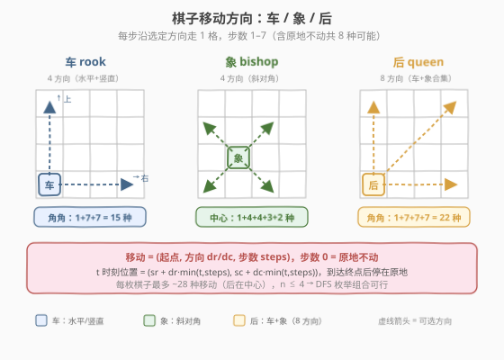
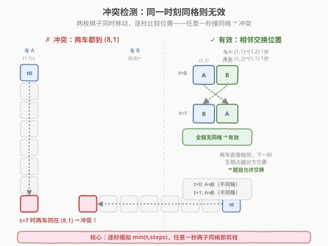
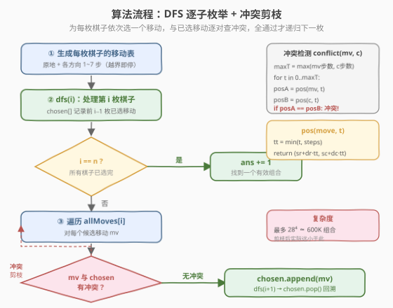
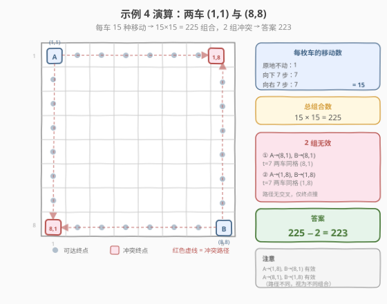

# 棋盘上有效移动组合的数目

- **题目名称**：棋盘上有效移动组合的数目
- **链接**：[2056. 棋盘上有效移动组合的数目](https://leetcode.cn/problems/number-of-valid-move-combinations-on-chessboard/)
- **难度**：困难
- **标签**：数组、回溯、枚举、模拟

## 1. 题目概述

在一个 `8×8` 棋盘上有 `n` 枚棋子（车 rook / 象 bishop / 后 queen），给出每枚棋子的类型 `pieces[i]` 与初始位置 `positions[i]`（下标从 1 开始）。所有棋子**同时**移动：每枚先选一个**方向**，再选一个**步数**，然后从时刻 0 起每秒沿该方向走 1 格，直到走完选定步数后停在终点。若某个时刻有两枚及以上棋子占据同一格，则该移动组合**无效**。求**有效**移动组合的数目。

**移动规则**：

| 棋子 | 可选方向 |
|------|----------|
| 车 rook | 水平 / 竖直（4 方向） |
| 象 bishop | 斜对角（4 方向） |
| 后 queen | 车 + 象合集（8 方向） |

**特别注意**：

- 初始时不会有两枚棋子在同一格。
- 棋子可以不移动（步数 = 0，原地不动）。
- 若两枚棋子**直接相邻**且下一秒要互相占据对方的位置（交换），题目**允许**这种交换。

**示例 1**：

```text
输入：pieces = ["rook"], positions = [[1,1]]
输出：15
解释：车在 (1,1)：原地不动 1 种 + 向下 7 步 + 向右 7 步 = 15 种移动。
```

**示例 2**：

```text
输入：pieces = ["queen"], positions = [[1,1]]
输出：22
解释：后在 (1,1)：原地 1 + 竖直/水平 14 + 斜对角 7 = 22 种。
```

**示例 3**：

```text
输入：pieces = ["bishop"], positions = [[4,3]]
输出：12
解释：象在 (4,3)：原地 1 + 四对角 2+3+2+4 = 12 种。
```

**示例 4**：

```text
输入：pieces = ["rook","rook"], positions = [[1,1],[8,8]]
输出：223
解释：每车 15 种，共 15×15=225。两组无效：两车都到 (8,1) 或都到 (1,8)。
```

**示例 5**：

```text
输入：pieces = ["queen","bishop"], positions = [[5,7],[3,4]]
输出：281
解释：后 24 种 × 象 12 种 = 288，其中 7 组路径冲突，288−7=281。
```

**约束条件**：

- `n == pieces.length == positions.length`
- `1 <= n <= 4`
- `pieces[i]` 为 `"rook"` / `"queen"` / `"bishop"`
- 棋盘上最多只有一个后
- `1 <= ri, ci <= 8`，所有位置互不相同

> 💡 `n ≤ 4` 且每枚棋子最多约 28 种移动，$28^4 \approx 6\times10^5$，是回溯枚举的甜区。难点不在搜索本身，而在**如何高效判定两个移动是否冲突**——需要逐秒模拟两枚棋子的位置。

---

## 2. 解题思路

### 2.1 暴力思路：枚举所有组合，逐对验证

最直白的做法：为每枚棋子枚举所有可能的「方向 + 步数」（含原地不动），组成 $n$ 层嵌套循环，对每个组合检查所有 $\binom{n}{2}$ 对棋子是否冲突。

```text
ans = 0
for m0 in moves[0]:
  for m1 in moves[1]:
    ...
      if all pairs compatible:
        ans += 1
```

问题转化为两个子任务：

1. **移动生成**：每枚棋子能走哪些格子？
2. **冲突判定**：两个移动同时执行，会不会在某秒撞到同一格？

### 2.2 核心观察：移动编码 + 逐秒位置比较



**移动编码**：一个移动由四元组 `(sr, sc, dr, dc, steps)` 唯一确定——起点 `(sr, sc)`、方向步长 `(dr, dc)`、步数 `steps`。步数为 0 表示原地不动。在时刻 $t$ 的位置为：

$$\text{pos}(t) = \bigl(sr + dr \cdot \min(t, \text{steps}),\;\; sc + dc \cdot \min(t, \text{steps})\bigr)$$

> 💡 关键：到达终点后（$t > \text{steps}$）棋子**停在原地**，所以用 $\min(t, \text{steps})$ 截断。这使得不同步数的两枚棋子也能统一在同一时间轴上比较——走得短的之后位置不变，走得长的继续前进。

**移动生成**：对每枚棋子，原地不动 1 种 + 每个方向从 1 步到越界前一步各 1 种。角上的车 15 种、中心的后最多 28 种。

**冲突判定**：两个移动 $m_1, m_2$ 冲突，当且仅当存在某个时刻 $t \in [0, \max(\text{steps}_1, \text{steps}_2)]$ 使得 $\text{pos}(m_1, t) = \text{pos}(m_2, t)$。



> ⚠️ **关于「相邻交换」例外**：题目说直接相邻的两枚棋子可以交换位置。仔细分析：交换时两枚棋子每秒各走 1 格，在任何整数时刻它们**始终在不同格**（$t=0$ 时各自在起点，$t=1$ 时互换到对方起点），因此「逐秒同格」检测**天然不会误判交换为冲突**。该例外是题目对直觉的澄清（交换不算"撞车"），算法无需特殊处理。更一般地，两枚棋子沿同一直线相向而行：距离为偶数时中点同格（冲突），距离为奇数时在中点交换（有效）——两种情况都被逐秒检测正确覆盖。

### 2.3 算法流程图：DFS 逐子枚举 + 冲突剪枝



用回溯把 $n$ 层嵌套显式化。`chosen` 列表记录前 $i-1$ 枚棋子已选的移动，处理第 $i$ 枚时遍历其所有候选移动，与 `chosen` 中每个移动逐对做冲突检测，全通过才选入并递归。

**DFS 步骤**（`dfs(i)`）：

1. **终止**：`i == n` 时所有棋子已选完且无冲突，`ans += 1`。
2. **遍历候选**：对 `allMoves[i]` 中每个移动 `mv`：
   - 与 `chosen` 中每个已选移动做 `conflict(mv, c)` 检测。
   - 若任一冲突 → **剪枝**，跳过此 `mv`。
   - 若全部兼容 → `chosen.append(mv)`，`dfs(i+1)`，`chosen.pop()` 回溯。

> 💡 **为什么先生成再搜索？** 移动表 `allMoves[i]` 只依赖棋子类型与初始位置，与搜索过程无关，预处理一次即可。搜索时直接查表，避免在递归内重复计算方向与越界判断。

### 2.4 示例演算



以示例 4 为例——两车分别在角 (1,1) 和 (8,8)：

**移动生成**：每枚角上的车可走原地 1 + 向下/向右 7 + 向上/向左 7（角上只有两个方向不越界）= **15 种**。

**总组合**：$15 \times 15 = 225$。

**冲突排查**：两车路径分别在列 1 / 行 1（车 A）与列 8 / 行 8（车 B），只有当终点落在对方路径上且同一时刻到达才冲突：

| 冲突组合 | 车A 移动 | 车B 移动 | 冲突时刻 | 原因 |
|---------|---------|---------|---------|------|
| ① | (1,1)→(8,1) 7步 | (8,8)→(8,1) 7步 | $t=7$ | 两车同时在 (8,1) |
| ② | (1,1)→(1,8) 7步 | (8,8)→(1,8) 7步 | $t=7$ | 两车同时在 (1,8) |

其余组合：要么终点不同格，要么到达终点的时刻不同（如车A到 (8,1) 走 7 步、车B到 (5,8) 走 3 步，$t=3$ 时车B已停在 (5,8)、车A在 (4,1)，无冲突）。

**注意**：A→(1,8) 且 B→(8,1) 是**有效**的（两车分别沿行 1 和行 8 移动，路径不交叉）；A→(8,1) 且 B→(1,8) 同样有效。虽然最终棋盘状态相同（两车交换了角），但每枚棋子的**移动操作不同**，视为不同的移动组合。

**答案**：$225 - 2 = \mathbf{223}$。

---

## 3. 参考代码

### C++（DFS 回溯 + 逐秒冲突检测）

```cpp
class Solution {
  public:
    int countCombinations(vector<string>& pieces, vector<vector<int>>& positions) {
        const map<string, vector<pair<int,int>>> dirs = {
            {"rook",   {{1,0},{-1,0},{0,1},{0,-1}}},
            {"bishop", {{1,1},{1,-1},{-1,1},{-1,-1}}},
            {"queen",  {{1,0},{-1,0},{0,1},{0,-1},{1,1},{1,-1},{-1,1},{-1,-1}}}
        };
        int n = pieces.size();
        // allMoves[i] = 棋子 i 的所有移动 {sr, sc, dr, dc, steps}
        vector<vector<array<int,5>>> allMoves(n);
        for (int i = 0; i < n; i++) {
            int sr = positions[i][0], sc = positions[i][1];
            allMoves[i].push_back({sr, sc, 0, 0, 0});          // 原地不动
            for (auto [dr, dc] : dirs.at(pieces[i])) {
                for (int step = 1; step <= 7; step++) {
                    int er = sr + dr * step, ec = sc + dc * step;
                    if (er >= 1 && er <= 8 && ec >= 1 && ec <= 8)
                        allMoves[i].push_back({sr, sc, dr, dc, step});
                    else
                        break;                                  // 越界即停
                }
            }
        }
        // t 时刻位置
        auto getPos = [](const array<int,5>& m, int t) -> pair<int,int> {
            int tt = min(t, m[4]);
            return {m[0] + m[2] * tt, m[1] + m[3] * tt};
        };
        // 两个移动是否冲突（某秒同格）
        auto conflict = [&](const array<int,5>& a, const array<int,5>& b) -> bool {
            int maxT = max(a[4], b[4]);
            for (int t = 0; t <= maxT; t++)
                if (getPos(a, t) == getPos(b, t)) return true;
            return false;
        };
        int ans = 0;
        vector<array<int,5>> chosen;
        function<void(int)> dfs = [&](int i) {
            if (i == n) { ans++; return; }
            for (const auto& mv : allMoves[i]) {
                bool ok = true;
                for (const auto& c : chosen)
                    if (conflict(mv, c)) { ok = false; break; }
                if (ok) {
                    chosen.push_back(mv);
                    dfs(i + 1);
                    chosen.pop_back();
                }
            }
        };
        dfs(0);
        return ans;
    }
};
```

### Python

```python
class Solution:
    def countCombinations(self, pieces: List[str], positions: List[List[int]]) -> int:
        DIRS = {
            'rook':   [(1, 0), (-1, 0), (0, 1), (0, -1)],
            'bishop': [(1, 1), (1, -1), (-1, 1), (-1, -1)],
            'queen':  [(1, 0), (-1, 0), (0, 1), (0, -1),
                       (1, 1), (1, -1), (-1, 1), (-1, -1)],
        }
        n = len(pieces)
        # 生成每枚棋子的所有移动 (sr, sc, dr, dc, steps)
        all_moves = []
        for i in range(n):
            sr, sc = positions[i]
            moves = [(sr, sc, 0, 0, 0)]               # 原地不动
            for dr, dc in DIRS[pieces[i]]:
                for step in range(1, 8):
                    er, ec = sr + dr * step, sc + dc * step
                    if 1 <= er <= 8 and 1 <= ec <= 8:
                        moves.append((sr, sc, dr, dc, step))
                    else:
                        break                         # 越界即停
            all_moves.append(moves)

        def get_pos(mv, t):
            sr, sc, dr, dc, steps = mv
            tt = min(t, steps)
            return (sr + dr * tt, sc + dc * tt)

        def conflict(m1, m2):
            max_t = max(m1[4], m2[4])
            return any(get_pos(m1, t) == get_pos(m2, t) for t in range(max_t + 1))

        ans = 0
        chosen = []

        def dfs(i):
            nonlocal ans
            if i == n:
                ans += 1
                return
            for mv in all_moves[i]:
                if all(not conflict(mv, c) for c in chosen):
                    chosen.append(mv)
                    dfs(i + 1)
                    chosen.pop()

        dfs(0)
        return ans
```

> ⚠️ **「原地不动」必须作为独立移动**：步数 0 的移动 `pos(t) = (sr, sc)` 对所有 $t$ 恒定，这意味着不动的棋子会**持续占据**其格子。若另一枚棋子的路径经过该格（任何时刻到达），即触发同格冲突。示例 5 中后停在 (6,7) 阻挡象经过 (6,7) 就是这种情形。

---

## 4. 复杂度分析

| 维度 | 复杂度 | 说明 |
|------|--------|------|
| **移动生成** | $O(n \cdot D \cdot 7)$ | 每枚棋子 $D$ 个方向（4 或 8），每方向最多 7 步，$n \le 4$ |
| **时间复杂度** | $O(M^n \cdot n^2 \cdot 7)$ | $M$ 为单枚棋子最多移动数（后约 28），$M^n$ 为组合总数，每组合 $\binom{n}{2}$ 对各查 $\le 7$ 秒 |
| **空间复杂度** | $O(n \cdot M)$ | 存移动表 + 递归栈 `chosen`，递归深度 $n \le 4$ |
| **实际常数** | 小 | 剪枝大幅减少搜索节点；$n=4$、后在中心时 $28^4 \approx 6\times10^5$，Python 亦在毫秒级 |

> 💡 **$n \le 4$ 是本题可枚举的关键**。若 $n$ 更大（如 $n \le 8$），$28^8 \approx 3.8\times10^{11}$ 远超枚举能力，需考虑更精细的剪枝或容斥。但本题约束把搜索空间锁在 $10^6$ 量级，回溯 + 剪枝即可 AC。

---

## 5. 扩展：冲突检测的优化与变体

### 5.1 路径预计算代替逐秒查询

当前 `conflict` 每次调用遍历 $\le 7$ 个时刻。可预处理每个移动的**完整路径集合**（含所有时刻位置），两个移动冲突当且仅当路径集合有交集。但需注意——交集必须发生在**同一时刻**，而非仅同一格子（一枚棋子 $t=2$ 经过某格、另一枚 $t=5$ 停在该格不算冲突）。因此需用 `(时刻, 行, 列)` 三元组或按时刻分桶比较，复杂度不变但常数略优。

### 5.2 相邻交换的深入讨论

题目允许直接相邻的棋子交换位置。如前分析，逐秒同格检测天然不误判交换。但若问题模型改为"路径交叉即冲突"（连续移动模型），则需额外检测：$t$ 时刻 A 在 $p$、B 在 $q$，$t+1$ 时刻 A 在 $q$、B 在 $p$（交叉）。此时所有交叉都发生在相邻格（每秒走 1 格），均属"直接相邻"的交换，仍被例外允许——结论不变。这说明两种模型在本题离散 1 步/秒的设定下**等价**。

> ⚠️ 若棋子允许每秒走多步（本题不允许），则可能出现非相邻交叉，两种模型才会分歧。本题固定 1 步/秒，无需担心。

---

## 6. 面试要点

1. **如何表示一个移动？为什么用 `(起点, 方向, 步数)` 而非 `(起点, 终点)`？**

   - 方向 + 步数能直接还原**每秒位置**（等差数列），终点则需额外算方向。且步数 0（原地不动）用方向 `(0,0)` 自然表示，无需特判。冲突检测的核心是逐秒位置比较，方向编码让 `pos(t)` 的计算 $O(1)$。

2. **冲突检测为什么用 `min(t, steps)` 而非 `t`？**

   - 棋子走完选定步数后**停在终点**不再移动。用 $\min(t, \text{steps})$ 截断，使得 $t > \text{steps}$ 时位置恒为终点。这让不同步数的两枚棋子能在同一时间轴 $[0, \max(\text{steps}_1, \text{steps}_2)]$ 上逐秒比较——走短的之后位置不变，走长的继续前进。

3. **「相邻交换」需要特殊处理吗？**

   - 不需要。交换时两枚棋子每秒各走 1 格，在任何整数时刻始终在不同格（$t=0$ 各在起点，$t=1$ 互换到对方起点），逐秒同格检测不会误判。更一般地，相向而行距离为偶数则中点同格（冲突），距离为奇数则在中点交换（有效）——两种情况都被正确覆盖。

4. **为什么 $n \le 4$ 可以枚举，再大就不行？**

   - 每枚棋子最多约 28 种移动（后在中心），$n=4$ 时 $28^4 \approx 6\times10^5$，加上剪枝实际更少。$n=5$ 时 $28^5 \approx 1.7\times10^7$ 仍勉强可接受，但 $n \ge 8$ 时 $28^8 \approx 3.8\times10^{11}$ 远超枚举能力。本题约束 $n \le 4$ 把搜索空间锁在甜区。

5. **原地不动（步数 0）会怎样影响冲突？**

   - 不动的棋子对所有 $t$ 恒在其起点。若另一枚棋子路径经过该格（任何时刻到达），即同格冲突。这让"挡路"成为常见冲突来源——示例 5 中后停在 (6,7) 或 (5,6) 阻挡象沿对角线经过就是这种情形，共贡献 5 组无效。

> 💡 **一句话总结**：本题 = 「移动编码 $(sr,sc,dr,dc,steps)$ 生成候选」+「DFS 逐子枚举」+「逐秒 $\min(t,\text{steps})$ 同格检测剪枝」。核心技巧是用方向 + 步数编码移动使 $O(1)$ 算任意时刻位置，再用 $\min$ 截断统一不同步数的时间轴。$n \le 4$ 保证枚举可行。

---

## 7. 同类练习题

- [51. N 皇后](https://leetcode.cn/problems/n-queens/)（[题解](../0001-0100/51_N皇后.md)）：逐行放置 + 列/对角线冲突剪枝，与本题"逐子选移动 + 逐对查冲突"同属回溯剪枝范式
- [46. 全排列](https://leetcode.cn/problems/permutations/)（[题解](../0001-0100/46_全排列.md)）：DFS + chosen 标记 + 回溯的经典模板，本题的搜索骨架与之同构
- [78. 子集](https://leetcode.cn/problems/subsets/)（[题解](../0001-0100/78_子集.md)）：选/不选决策树回溯，对比本题"为每枚棋子选一个移动"的多选一回溯
- [1219. 黄金矿工](https://leetcode.cn/problems/path-with-maximum-gold/)：网格上的 DFS 回溯 + 路径状态，与本题在网格上模拟移动轨迹的思路相近
