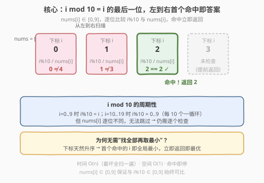
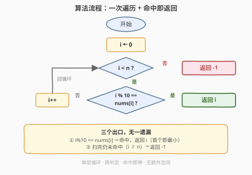

# LeetCode 值相等的最小索引 题解

## 1. 题目概述

- **标题 / 题号**：值相等的最小索引（#2057，easy）
- **链接**：https://leetcode.cn/problems/smallest-index-with-equal-value/
- **难度**：简单
- **标签**：数组、一次遍历、模运算

**题意**：给定一个下标从 0 开始的整数数组 `nums`，返回满足 `i mod 10 == nums[i]` 的**最小下标** `i`；若不存在这样的下标，返回 `-1`。其中 `x mod y` 表示 `x` 除以 `y` 的余数。

**示例 1**：

```text
输入：nums = [0,1,2]
输出：0
解释：i=0 时 0 mod 10 = 0 == nums[0]；i=1、i=2 也都满足。所有下标都满足，最小为 0。
```

**示例 2**：

```text
输入：nums = [4,3,2,1]
输出：2
解释：i=0: 0≠4；i=1: 1≠3；i=2: 2==2 ✓。2 是唯一满足条件的下标。
```

**示例 3**：

```text
输入：nums = [1,2,3,4,5,6,7,8,9,0]
输出：-1
解释：不存在满足 i mod 10 == nums[i] 的下标。
```

**示例 4**：

```text
输入：nums = [2,1,3,5,2]
输出：1
解释：i=1 时 1 mod 10 = 1 == nums[1]，1 是唯一满足条件的下标。
```

**约束**：

- `1 <= nums.length <= 100`
- `0 <= nums[i] <= 9`

## 2. 解题思路

### 2.1 暴力思路：收集所有匹配下标再取最小

最直白的做法是遍历整个数组，把所有满足 `i mod 10 == nums[i]` 的下标收集到一个列表里，最后返回列表中的最小值（列表为空则返回 `-1`）。

```text
matches = []
for i in 0..n-1:
    if i % 10 == nums[i]:
        matches.append(i)
return min(matches) if matches else -1
```

时间复杂度 $O(n)$，空间复杂度 $O(n)$（最坏所有下标都匹配）。这能通过，但**忽略了两个关键结构**：

1. **下标天然升序**：`i` 从 0 递增，第一个命中的下标一定是全局最小的——根本不需要"收集全部再取最小"。
2. **值域受约束**：`nums[i] ∈ [0, 9]`，与 `i mod 10 ∈ [0, 9]` 同域，比较永远有意义，不会出现"必然不匹配"的提前剪枝（但也意味着每个位置都可能是答案）。

### 2.2 核心观察：左到右扫描，首个命中即答案



关键直觉：下标 `i` 按 `0, 1, 2, ...` 升序排列，**第一个**满足 `i mod 10 == nums[i]` 的位置就是题目所求的最小下标。因此只需从左到右扫描，一旦命中立即返回——无需扫描到底，无需额外空间。

> 💡 **`i mod 10` 的含义**：即 `i` 的十进制最后一位数字。`i = 0..9` 时 `i mod 10 = i`；`i = 10..19` 时 `i mod 10 = 0..9`，周期为 10。但由于 `nums[i]` 逐位不同，这个周期性**不能用来跳过下标**——每个位置仍需逐一检查。

> ⚠️ **为什么不能用二分？** 二分查找要求谓词具有**单调性**（如 278 题"第一个错误版本"中，错误一旦出现就持续到末尾）。本题的谓词 `i mod 10 == nums[i]` 在不同 `i` 处真假交替，毫无单调性，无法用二分加速，只能线性扫描。

### 2.3 算法流程图



流程是单层循环 + 两个判定：外层判定 `i < n` 控制遍历边界，内层判定 `i % 10 == nums[i]` 控制命中返回。三条出口分支（`return i`、`return -1`）覆盖所有情况，无遗漏。

### 2.4 示例演算

以 `nums = [4, 3, 2, 1]` 为例逐步演算：

![逐步演算 nums=[4,3,2,1]](../images/2057_example_walkthrough.svg)

- **步骤 1, i=0**：`0 % 10 = 0`，`nums[0] = 4`，`0 ≠ 4` ✗，`i++` 继续。
- **步骤 2, i=1**：`1 % 10 = 1`，`nums[1] = 3`，`1 ≠ 3` ✗，`i++` 继续。
- **步骤 3, i=2**：`2 % 10 = 2`，`nums[2] = 2`，`2 == 2` ✓，**命中，立即返回 2**。
- **i=3 未检查**：因为已在 `i=2` 提前返回。

最终答案 `2`。整个过程只检查了 3 个元素即命中退出，体现了"首个命中即停"的优势。

## 3. 参考代码

### C++（一次遍历 + 提前返回）

```cpp
class Solution {
  public:
    int smallestEqual(vector<int>& nums) {
        for (int i = 0; i < (int)nums.size(); ++i) {
            if (i % 10 == nums[i]) {
                return i;
            }
        }
        return -1;
    }
};
```

### Python

```python
class Solution:
    def smallestEqual(self, nums: List[int]) -> int:
        for i, v in enumerate(nums):
            if i % 10 == v:
                return i
        return -1
```

> 💡 Python 用 `enumerate` 同时拿到下标和值，`i % 10 == v` 一行完成判定，是最简洁的写法。两种语言都是"循环 + 提前 return"，无需额外变量。

## 4. 复杂度分析

| 维度 | 复杂度 | 说明 |
|------|--------|------|
| 时间复杂度 | $O(n)$ | 最坏情况（无匹配或匹配在末尾）遍历整个数组；命中时可提前退出，平均优于 $O(n)$ |
| 空间复杂度 | $O(1)$ | 只用循环变量 `i`，无额外数据结构 |

> 💡 相比暴力"收集全部再取最小"的 $O(n)$ 空间，本题利用"下标升序"这一天然性质，把空间降到 $O(1)$ 且支持提前终止。关键在于意识到**首个命中即最优**，无需完整信息。

## 5. 扩展：「下标即键」与模运算的周期性

本题虽简单，却体现了两个可迁移的思想：

**1. 下标即键（index as key）**

`i mod 10 == nums[i]` 本质上是把下标 `i` 经过 `mod 10` 映射后与值比较——下标本身承载了信息。这一思想在更难的题中大放异彩：

| 题号 | 题目 | 下标如何当键 |
|------|------|--------------|
| 448 | 找到所有数组中消失的数字 | 用 `nums[nums[i]-1]` 取负来标记 `nums[i]` 这个值"存在" |
| 41 | 缺失的第一个正数 | 把值 `v` 归位到下标 `v-1`，扫一遍即可发现缺失 |
| 287 | 寻找重复数 | Floyd 判圈：`nums[i]` 当作"下一个下标"形成隐式链表 |

**2. 模运算的周期性**

`i mod 10` 以 10 为周期循环。当题目涉及"最后一位数字"、"循环分组"、"环形缓冲"时，模运算是首选工具：

- [9. 回文数](https://leetcode.cn/problems/palindrome-number/)：用 `x % 10` 取最后一位、`x / 10` 去掉最后一位来反转数字。
- [189. 轮转数组](https://leetcode.cn/problems/rotate-array/)：用 `(i + k) % n` 计算轮转后的目标下标。
- [146. LRU 缓存](https://leetcode.cn/problems/lru-cache/)：环形场景下模运算管理循环指针。

> 💡 本题中周期性**不能加速查找**（因为 `nums[i]` 无规律），但它解释了为什么 `i mod 10` 与 `nums[i]`（`0..9`）始终可比——两者共享同一段 `0..9` 的值域。

## 6. 面试要点

1. **为什么不能把"找最小匹配下标"优化到优于 $O(n)$？**

   - 谓词 `i mod 10 == nums[i]` 在不同下标处真假交替，不具单调性，无法用二分查找。又因为 `nums[i]` 的值只有逐一检查才能得知，不存在"跳过一段下标"的依据。最坏情况下（无匹配）必须检查所有 $n$ 个元素，故下界为 $\Omega(n)$。

2. **"首个命中即返回"为什么一定是最小下标？**

   - 循环按 `i = 0, 1, 2, ...` 升序遍历。若 `i*` 是第一个满足条件的下标，则对所有 `i < i*` 都不满足，故 `i*` 是所有满足条件下标中的最小值。提前返回不改变正确性，只是避免了无用的后续扫描。

3. **如果去掉约束 `0 <= nums[i] <= 9`，算法需要改动吗？**

   - 不需要改算法逻辑：`i % 10` 始终在 `0..9`，若 `nums[i] >= 10` 则 `i % 10 != nums[i]` 必然成立，该位置自动判为不匹配。但有了这个约束，每个位置都**有可能**匹配（不存在"必然不匹配"的废位置），题目更紧凑。

4. **如果把 `mod 10` 换成 `mod k`（`k` 任意），思路一样吗？**

   - 完全一样。只要谓词是"对下标 `i` 的某种确定性判定"，且想找最小满足下标，左到右扫描 + 首个命中即返回就是通用模板。`mod k` 只改变判定条件，不改变扫描策略。

5. **这个"线性扫描找首个满足谓词的下标"模板还能用在哪？**

   - 所有"找首个满足某条件的位置"型问题：[278. 第一个错误的版本](https://leetcode.cn/problems/first-bad-version/)（谓词单调→可二分加速）、[896. 单调数列](https://leetcode.cn/problems/monotonic-array/)（判定型一次遍历）、[283. 移动零](https://leetcode.cn/problems/move-zeroes/)（快慢双指针找首个非零）。核心都是"遍历 + 判定 + 必要时提前停"。

## 同类练习题

| # | 题目 | 与本题的关联 |
|---|------|-------------|
| 278 | [第一个错误的版本](https://leetcode.cn/problems/first-bad-version/) | 同为"找满足谓词的最小下标"，但谓词单调可用二分加速到 $O(\log n)$；对照本题谓词不单调只能 $O(n)$ |
| 1920 | [基于排列构建数组](https://leetcode.cn/problems/build-array-from-permutation/) | 下标与值的映射关系，`nums[nums[i]]` 索引套索引，"下标即键"思想的直接体现 |
| 448 | [找到所有数组中消失的数字](https://leetcode.cn/problems/find-all-numbers-disappeared-in-an-array/) | 把下标当哈希键原地标记存在性，"下标即键"的进阶应用 |
| 9 | [回文数](https://leetcode.cn/problems/palindrome-number/) | 同样用 `% 10` 取最后一位数字，承接本题的模运算基础 |
| 896 | [单调数列](https://leetcode.cn/problems/monotonic-array/) | 一次遍历 + 提前终止的判定型问题，与本题同属"线性扫描判定"家族 |
