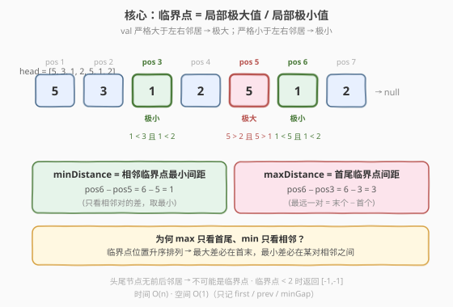

# LeetCode 找出临界点之间的最小和最大距离 题解

## 1. 题目概述

- **标题 / 题号**：找出临界点之间的最小和最大距离（#2058，medium）
- **链接**：https://leetcode.cn/problems/find-the-minimum-and-maximum-number-of-nodes-between-critical-points/
- **难度**：中等
- **标签**：链表、一次遍历、极值判定

**题意**：链表中的**临界点**定义为一个**局部极大值点**或**局部极小值点**：

- 如果当前节点的值**严格大于**前一个节点和后一个节点，那么这个节点就是一个**局部极大值点**。
- 如果当前节点的值**严格小于**前一个节点和后一个节点，那么这个节点就是一个**局部极小值点**。

注意：节点只有在同时存在前一个节点和后一个节点的情况下，才能成为临界点（即头节点和尾节点永不可能是临界点）。

给定链表 `head`，返回长度为 2 的数组 `[minDistance, maxDistance]`，其中 `minDistance` 是任意两个不同临界点之间的**最小**距离，`maxDistance` 是任意两个不同临界点之间的**最大**距离。如果临界点少于两个，返回 `[-1, -1]`。

> 💡 **距离的定义**：两个临界点之间的距离 = 它们在链表中**下标之差的绝对值**（下标从 0 开始）。由于临界点按下标升序出现，距离即为 `后一个下标 − 前一个下标`。

**示例 1**：

```text
输入：head = [3,1]
输出：[-1,-1]
解释：链表 [3,1] 中不存在临界点（节点数 < 3，无中间节点）。
```

**示例 2**：

```text
输入：head = [5,3,1,2,5,1,2]
输出：[1,3]
解释：存在三个临界点：
- [5,3,1,2,5,1,2]：第 3 个节点（下标 2，值 1）是局部极小值点（1 < 3 且 1 < 2）。
- [5,3,1,2,5,1,2]：第 5 个节点（下标 4，值 5）是局部极大值点（5 > 2 且 5 > 1）。
- [5,3,1,2,5,1,2]：第 6 个节点（下标 5，值 1）是局部极小值点（1 < 5 且 1 < 2）。
最小距离：下标 5 − 下标 4 = 1。最大距离：下标 5 − 下标 2 = 3。
```

**示例 3**：

```text
输入：head = [1,3,2,2,3,2,2,2,7]
输出：[3,3]
解释：存在两个临界点：
- 第 2 个节点（下标 1，值 3）是局部极大值点（3 > 1 且 3 > 2）。
- 第 5 个节点（下标 4，值 3）是局部极大值点（3 > 2 且 3 > 2）。
两个临界点之间的距离 = 4 − 1 = 3，既是最小也是最大。
注意：最后一个节点（值 7）不算临界点，因为它之后没有节点。
```

**示例 4**：

```text
输入：head = [2,3,3,2]
输出：[-1,-1]
解释：链表 [2,3,3,2] 中不存在临界点（3 不严格大于/小于 3）。
```

**约束**：

- 链表中节点的数量在范围 `[2, 10^5]` 内。
- `1 <= Node.val <= 10^5`。

## 2. 解题思路

### 2.1 暴力思路：收集所有临界点下标再两两比较

最直白的做法是遍历链表，把所有临界点的下标收集到一个数组 `idxs` 里，然后：

- `minDistance`：遍历相邻下标对，取最小差值。
- `maxDistance`：`idxs[-1] - idxs[0]`（末项减首项）。

```text
idxs = []
prev, curr = head.val, head.next
pos = 1
while curr and curr.next:
    if (curr.val > prev and curr.val > curr.next.val) \
       or (curr.val < prev and curr.val < curr.next.val):
        idxs.append(pos)
    prev, curr = curr.val, curr.next
    pos += 1
if len(idxs) < 2: return [-1, -1]
minDist = min(idxs[i+1] - idxs[i] for i in range(len(idxs)-1))
maxDist = idxs[-1] - idxs[0]
return [minDist, maxDist]
```

时间 $O(n)$，空间 $O(k)$（$k$ 为临界点数，最坏 $O(n)$）。这能通过，但**多存了一个数组**——仔细观察会发现，求 `minDist` 只用到**相邻两个**临界点的差，求 `maxDist` 只用到**首尾**两个临界点。整条数组从未被整体复用，完全可以边扫边算。

### 2.2 核心观察：只需三个变量，一趟扫描即得答案



关键直觉有两层：

**第一层：判定临界点只需「三元组」**。对位置 `pos` 的节点 `curr`，只要维护 `prev`（前一节点值）和 `next = curr.next`（后一节点值），就能判定 `curr` 是否为极大或极小。三元组 `prev → curr → next` 随扫描向右滑动，每个节点只看一次。

**第二层：求 min/max 无需存储全部下标**。因为临界点按位置**升序**出现：

- **`maxDistance`** = 任意两临界点的最大距离。位置升序时，最远的一对必然是**首末**两个临界点 → 只需记 `first`（首个临界点位置）和最后一个临界点位置。
- **`minDistance`** = 任意两临界点的最小距离。位置升序时，最小差必出现在**某对相邻**临界点之间（非相邻对的差不小于其中间相邻对的差）→ 只需在每次发现新临界点时，用「当前位置 − 上一个临界点位置」更新 `minGap`。

> 💡 **为何最小差必在相邻对？** 设临界点位置序列 $p_1 < p_2 < \cdots < p_k$。对任意 $i < j$，$p_j - p_i = (p_{i+1} - p_i) + (p_{i+2} - p_{i+1}) + \cdots + (p_j - p_{j-1}) \geq p_{i+1} - p_i$。即任意非相邻差不小于其包含的某个相邻差。故全局最小差一定在相邻对中取到。

因此只需维护四个量：

| 变量 | 含义 |
|------|------|
| `first` | 首个临界点的位置（用于算 maxGap） |
| `prevIdx` | 上一个临界点的位置（用于算相邻差） |
| `minGap` | 相邻临界点的最小间距 |
| `pos` | 当前扫描位置 |

扫描结束后，若临界点 $\geq 2$ 个，则 `maxGap = prevIdx - first`（`prevIdx` 此刻即最后一个临界点位置），`minGap` 已在扫描中累次取最小。临界点 $< 2$ 个时返回 `[-1, -1]`。

> ⚠️ **「严格」二字不可丢**：题目要求**严格大于/严格小于**。`[2,3,3,2]` 中两个 `3` 相等，既非极大也非极小，故无临界点。判定条件必须用 `>` / `<`，绝不能用 `>=` / `<=`。

### 2.3 算法流程图


流程是一个单层循环，核心是滑动三元组 `prev / curr / next`：

1. **初始化**：`pos = 1`（从第二个节点开始，因为头节点无前驱），`prev = head.val`，`curr = head.next`，`first = prevIdx = -1`，`minGap = ∞`。
2. **循环条件**：`curr.next != null`（保证 `curr` 有后继，即 `curr` 有资格成为临界点）。
3. **临界判定**：`curr.val` 严格大于 `prev` 与 `curr.next.val`（极大），或严格小于两者（极小）。
4. **记录**：若 `first == -1`，这是首个临界点，记 `first = pos`；否则用 `pos - prevIdx` 更新 `minGap`。无论哪种情况都更新 `prevIdx = pos`。
5. **推进**：`prev = curr.val`，`curr = curr.next`，`pos++`，回到第 2 步。
6. **结算**：循环结束后，若 `first == -1`（无临界点）或 `prevIdx == first`（仅一个临界点），返回 `[-1, -1]`；否则返回 `[minGap, prevIdx - first]`。

### 2.4 示例演算

以 `head = [5, 3, 1, 2, 5, 1, 2]` 为例逐步演算（位置从 1 起算，即第 2 个节点 pos=1）：

![逐步演算 [5,3,1,2,5,1,2]](../images/2058_example_walkthrough.svg)

| 步骤 pos | prev, curr, next | 判定 | first / prevIdx / minGap |
|----------|------------------|------|--------------------------|
| 1 | 5, 3, 1 | 3<5 但 3>1 → 非临界 | -1 / -1 / ∞ |
| 2 | 3, 1, 2 | 1<3 且 1<2 → **极小** ✓ | 2 / 2 / ∞（首个，记 first） |
| 3 | 1, 2, 5 | 2>1 但 2<5 → 非临界 | 2 / 2 / ∞ |
| 4 | 2, 5, 1 | 5>2 且 5>1 → **极大** ✓ | 2 / 4 / min(∞, 4−2)=2 |
| 5 | 5, 1, 2 | 1<5 且 1<2 → **极小** ✓ | 2 / 5 / min(2, 5−4)=**1** |
| 6 | 1, 2, null | curr.next==null → 停 | — |

**结算**：`first = 2`，最后临界点 `prevIdx = 5`，`minGap = 1`。`maxGap = prevIdx - first = 5 - 2 = 3`。返回 `[1, 3]`。

> 💡 注意「位置」与「下标」的对应：本题距离定义为下标之差，而链表节点下标从 0 开始。上面演算用 `pos` 从 1 开始（指向第 2 个节点，即下标 1），故 `pos` 之差恰好等于下标之差，结果一致。代码中 `pos` 的起点不影响差值——只要全程统一即可。

## 3. 参考代码

### C++（一趟扫描 + O(1) 状态）

```cpp
/**
 * Definition for singly-linked list.
 * struct ListNode {
 *     int val;
 *     ListNode *next;
 *     ListNode() : val(0), next(nullptr) {}
 *     ListNode(int x) : val(x), next(nullptr) {}
 *     ListNode(int x, ListNode *next) : val(x), next(next) {}
 * };
 */
class Solution {
  public:
    vector<int> nodesBetweenCriticalPoints(ListNode* head) {
        int first = -1, prevIdx = -1, minGap = INT_MAX;
        int pos = 1;
        int prev = head->val;
        ListNode* curr = head->next;
        while (curr && curr->next) {
            int cv = curr->val;
            int nv = curr->next->val;
            if ((cv > prev && cv > nv) || (cv < prev && cv < nv)) {
                if (first == -1) first = pos;          // 首个临界点
                else minGap = min(minGap, pos - prevIdx); // 相邻差取最小
                prevIdx = pos;                         // 滚动上一个临界点
            }
            prev = cv;
            curr = curr->next;
            ++pos;
        }
        if (first == -1 || prevIdx == first) return {-1, -1}; // 临界点 < 2
        return {minGap, prevIdx - first};
    }
};
```

### Python

```python
# Definition for singly-linked list.
# class ListNode:
#     def __init__(self, val=0, next=None):
#         self.val = val
#         self.next = next
class Solution:
    def nodesBetweenCriticalPoints(self, head: Optional[ListNode]) -> List[int]:
        first = prev_idx = -1
        min_gap = float('inf')
        pos = 1
        prev = head.val
        curr = head.next
        while curr and curr.next:
            cv, nv = curr.val, curr.next.val
            if (cv > prev and cv > nv) or (cv < prev and cv < nv):
                if first == -1:
                    first = pos               # 首个临界点
                else:
                    min_gap = min(min_gap, pos - prev_idx)  # 相邻差取最小
                prev_idx = pos                # 滚动上一个临界点
            prev = cv
            curr = curr.next
            pos += 1
        if first == -1 or prev_idx == first:
            return [-1, -1]                   # 临界点 < 2
        return [min_gap, prev_idx - first]
```

> 💡 **判断「临界点 < 2」的优雅写法**：首个临界点会被同时赋给 `first` 和 `prevIdx`。若全程只遇到一个临界点，则 `prevIdx == first` 恒成立且 `minGap` 未被更新。故 `first == -1 || prevIdx == first` 一行覆盖「零个」和「仅一个」两种情况，无需额外计数器。

## 4. 复杂度分析

| 维度 | 复杂度 | 说明 |
|------|--------|------|
| 时间复杂度 | $O(n)$ | `curr` 从第二个节点单向扫描到倒数第二个节点，每个节点只访问一次；判定与状态更新均为 $O(1)$ |
| 空间复杂度 | $O(1)$ | 仅用 `first / prevIdx / minGap / pos / prev` 等常数个变量，不存临界点数组 |

> 💡 相比暴力「收集全部下标再两两比较」的 $O(k)$ 空间，本题利用「min 只看相邻、max 只看首尾」两条性质，把空间压到 $O(1)$。关键在于意识到**升序序列的最值差有结构**——最大差必在两端，最小差必在相邻——无需完整序列即可求出。

## 5. 扩展：为何「相邻差取最小」对任意升序序列都成立？

本题的 `minDistance` 求法依赖一条对**任意升序序列**都成立的引理，理解它能迁移到很多场景：

> **引理**：设 $p_1 < p_2 < \cdots < p_k$ 为升序数列，则 $\min_{i<j}(p_j - p_i) = \min_{i}(p_{i+1} - p_i)$。即「全局最小差」等于「相邻最小差」。

**证明**：对任意 $i < j$，由升序性有 $p_{i+1} - p_i \geq 0$，故

$$p_j - p_i = \sum_{t=i}^{j-1}(p_{t+1} - p_t) \geq p_{i+1} - p_i \geq \min_{t}(p_{t+1} - p_t).$$

即任意非相邻差不小于某个相邻差，故全局最小必在相邻对中取到。$\square$

**对称地**，$\max_{i<j}(p_j - p_i) = p_k - p_1$（首末差），因为 $p_j - p_i \leq p_k - p_1$ 恒成立。

这条「相邻看最小、首末看最大」的性质在以下场景反复出现：

| 场景 | 应用 |
|------|------|
| 本题 2058 | 临界点位置升序 → min 看相邻、max 看首尾 |
| 数组中找最近/最远的一对满足条件的下标 | 收集下标后同法处理 |
| 调度问题中相邻任务的最小间隔 | 升序时间序列的相邻差 |

> 💡 反过来，如果**序列无序**，最小差就不能只看相邻——需要排序后再套用此引理（如「数组中最近的两个数」先排序 $O(n \log n)$ 再相邻扫一遍 $O(n)$）。本题链表扫描天然按位置升序，省去了排序。

## 6. 面试要点

1. **为什么 maxDistance 只用首尾两个临界点，不用遍历所有对？**

   - 临界点按链表位置升序出现。对任意两临界点 $p_i < p_j$，$p_j - p_i \leq p_k - p_1$（末项减首项）恒成立——因为 $p_j \leq p_k$ 且 $p_i \geq p_1$。故最大差必在首末之间取到，无需比较其他对。

2. **为什么 minDistance 只用相邻临界点的差，不用 $O(k^2)$ 两两比较？**

   - 升序序列中，任意非相邻差 $p_j - p_i$ 可拆为若干相邻差之和 $\sum_{t=i}^{j-1}(p_{t+1} - p_t)$，其值不小于其中任一项，故不小于最小的相邻差。全局最小差必在相邻对中取到，只需 $O(k)$ 次比较。

3. **如何处理「临界点少于两个」的情况？**

   - 用 `first == -1` 判定「零个临界点」；用 `prevIdx == first` 判定「仅一个临界点」（首个临界点同时赋给 `first` 和 `prevIdx`，之后若再无临界点则两者相等）。两种情况都返回 `[-1, -1]`。也可用一个独立计数器 `cnt`，但上述写法无需额外变量。

4. **题目强调「严格大于/严格小于」，相等值如何处理？**

   - 必须用 `>` / `<` 而非 `>=` / `<=`。例如 `[2,3,3,2]` 中两个 `3` 相等，既非严格大于也非严格小于邻居，不构成临界点。若误用 `>=`，会把相等的平台误判为极值，导致结果错误。

5. **能否不维护 `prev` 值，直接用节点指针的三元组？**

   - 可以。维护三个指针 `a -> b -> c`（`a` 是 `b` 的前驱，`c` 是 `b` 的后继），判定 `b.val` 与 `a.val`、`c.val` 的关系。但「值」更轻量：只需记 `prev = curr.val` 一个整数，不必持有前驱节点指针。两者等价，用值更简洁。

## 同类练习题

| # | 题目 | 与本题的关联 |
|---|------|-------------|
| 817 | [链表组件](https://leetcode.cn/problems/linked-list-components/) | 同为「一趟扫描链表 + 位置标记」，用集合判定节点是否属于组件，承接本题的位置递增扫描思路 |
| 2130 | [链表最大孪生和](https://leetcode.cn/problems/maximum-twin-sum-of-a-linked-list/) | 一趟扫描链表找最值对，对照本题「首末配对取最值」的思想（用快慢指针找中点 + 反转后半） |
| 2487 | [从链表中移除节点](https://leetcode.cn/problems/remove-nodes-from-linked-list/) | 链表单调性判定与原地修改，强化对「滑动扫描 + 状态维护」的手感 |
| 237 | [删除链表中的节点](https://leetcode.cn/problems/delete-node-in-a-linked-list/)（[题解](../0201-0300/237_删除链表中的节点.md)） | 链表节点与邻居关系的基础训练，承接本题对「前驱—当前—后继」三元组的理解 |
| 82 | [删除排序链表中的重复元素 II](https://leetcode.cn/problems/remove-duplicates-from-sorted-list-ii/)（[题解](../0001-0100/82_删除排序链表中的重复元素 II.md)） | 滑动三元组 `prev/curr/next` 比较值的经典应用，与本题判定逻辑同源 |
