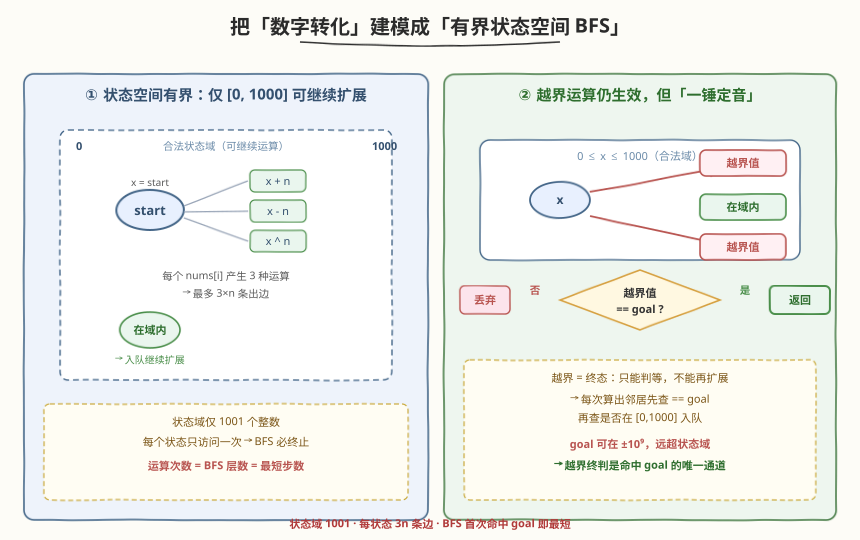
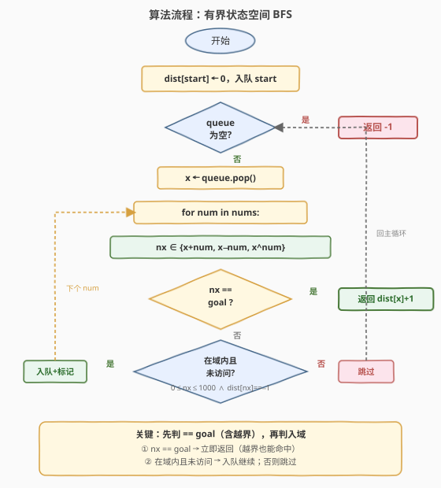
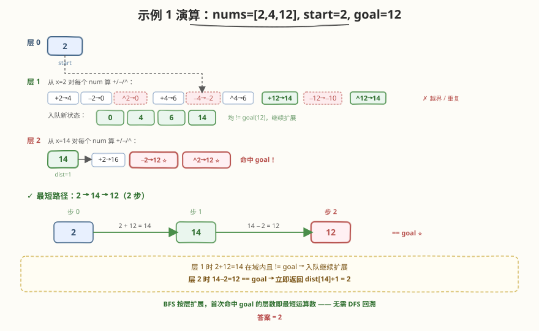

# LeetCode 转化数字的最小运算数 题解

## 1. 题目概述

- **标题 / 题号**：转化数字的最小运算数（#2059，medium）
- **链接**：https://leetcode.cn/problems/minimum-operations-to-convert-number/
- **难度**：中等
- **标签**：广度优先搜索、最短路径、状态空间搜索

**题意**：给你一个下标从 **0** 开始的整数数组 `nums`（元素**互不相同**），以及两个整数 `start` 和 `goal`。整数 `x` 的初始值设为 `start`，你可以对 `x` 重复执行以下运算：

当 `0 <= x <= 1000` 时，对于数组中任一下标 `i`，可以将 `x` 设为以下任一值：

- `x + nums[i]`
- `x - nums[i]`
- `x ^ nums[i]`（按位异或 XOR）

> ⚠️ **关键规则**：使 `x` 越过 `0 <= x <= 1000` 范围的运算**同样生效**，但执行该运算后将**不能继续执行其他运算**——即一旦越界，`x` 就是终态，只能判等不能扩展。

返回将 `x = start` 转化为 `goal` 的**最小操作数**；如果无法完成转化，返回 `-1`。

**示例 1**：

```text
输入：nums = [2,4,12], start = 2, goal = 12
输出：2
解释：2 → 14 → 12
- 2 + 12 = 14
- 14 - 2 = 12
```

**示例 2**：

```text
输入：nums = [3,5,7], start = 0, goal = -4
输出：2
解释：0 → 3 → -4
- 0 + 3 = 3
- 3 - 7 = -4   （最后一步使 x 越界，但运算仍生效）
```

**示例 3**：

```text
输入：nums = [2,8,16], start = 0, goal = 1
输出：-1
解释：无法将 0 转化为 1
```

**约束**：

- `1 <= nums.length <= 1000`
- $-10^9 \le$ `nums[i]`, `goal` $\le 10^9$
- `0 <= start <= 1000`
- `start != goal`
- `nums` 中的所有整数互不相同

> 💡 三个要点：① 每次运算把 `x` 变成 `x±nums[i]` 或 `x^nums[i]` 之一，算一步；② 只有 `x ∈ [0,1000]` 时才能**继续**运算，越界后就是终态；③ `goal` 可达 $\pm 10^9$，远超 `[0,1000]`——此时命中 `goal` 的唯一途径是从某个域内状态做一次越界运算正好等于 `goal`。

## 2. 解题思路

### 2.1 暴力思路：DFS 全枚举

从 `start` 出发递归尝试每一种运算，记录到达 `goal` 的步数取最小值。问题在于：运算可来回往复（`x → x+num → x → ...`），状态空间若不加约束会无限膨胀；即使加记忆化，`goal` 可达 $\pm 10^9$，状态值域巨大，哈希表存不下。这恰好引出本题的核心观察——**可扩展状态域其实很小**。

### 2.2 核心观察：把「数字转化」建模成「有界状态空间 BFS」



关键一步是**区分「可扩展状态」与「终态」**：

- **可扩展状态**：`x ∈ [0, 1000]`，共 **1001 个**。只有这些状态能继续做运算，是 BFS 真正需要遍历的节点。
- **终态**：运算结果越出 `[0, 1000]` 后不能再扩展。但它**仍然是一次合法运算**——只需检查它是否等于 `goal`，等于则命中答案。

于是问题被建模为一张**无权图最短路**：

- **节点**：`[0, 1000]` 中的每个整数（共 1001 个）。
- **边**：从 `x` 出发，对每个 `nums[i]` 产生三条出边，分别指向 `x + nums[i]`、`x - nums[i]`、`x ^ nums[i]`。
- **边权**：每条边权为 1（一次运算 = 一步）。
- **目标**：`goal` 可能在域内（普通节点），也可能在域外（只能作为某条边的终点被「一锤定音」地判等）。

> 💡 **无权图最短路 = BFS**。BFS 按「层数」一圈圈扩展：`start` 在层 0，它的所有邻居在层 1……**第一次**让某条运算结果等于 `goal` 的层数就是最小运算数。每个域内状态只入队一次（`dist` 数组去重），总共至多 1001 个状态，复杂度可控。

> ⚠️ **为什么 `goal` 在域外时不能把它当普通节点？** 因为越界后不能再运算，`goal` 若在域外就没有出边，无法被 BFS「从 `start` 一层层扩展到」。它只能作为某次运算的**结果**被检测：从域内状态 `x` 做一次 `x ± num` 或 `x ^ num`，若结果恰好等于 `goal`，则 `dist[x] + 1` 即为答案。因此**每次算出邻居后，第一步永远是判 `nx == goal`**，在判「是否入域」之前——这个顺序是本题的灵魂。

### 2.3 算法流程图



**三步法**：

1. **初始化**：`dist` 数组大小 1001，填充 `-1` 表示未访问；`dist[start] = 0`，`start` 入队。
2. **BFS 主循环**：每轮取出队首 `x`（`dist[x]` 已知）。对每个 `num ∈ nums`，计算三个邻居 `nx = x + num`、`x - num`、`x ^ num`：
   - **先判** `nx == goal` → 命中，立即返回 `dist[x] + 1`（覆盖越界命中场景）。
   - **再判** `0 <= nx <= 1000 && dist[nx] == -1` → 在域内且未访问，置 `dist[nx] = dist[x] + 1` 并入队。
3. **队空未命中**：返回 `-1`。

> 💡 **两个易错点**：（1）**判等必须在判域之前**——若先判域，`goal` 在域外时永远会被「越界跳过」分支丢弃，漏掉正确答案；（2）**入队时即标记 `dist`**，而不是出队时再标记——否则同一状态会被多个前驱重复入队，队列膨胀到指数级。这是所有 BFS 题的通用纪律。

### 2.4 示例演算

以示例 1 `nums = [2,4,12]`，`start = 2`，`goal = 12` 为例：



**层 0**：`{2}`，`dist[2] = 0`。`2 != 12`（goal），继续扩展。

**层 1**：从 `x = 2` 对每个 `num` 算 `+/−/^`：

| num | x+num | x−num | x^num | 说明 |
|-----|-------|-------|-------|------|
| 2   | 4     | 0     | 0     | `^2` 与 `−2` 都得 0，重复 |
| 4   | 6     | −2    | 6     | `−4→−2` 越界且 `!= goal`，丢弃 |
| 12  | 14    | −10   | 14    | `−12→−10` 越界且 `!= goal`，丢弃 |

入队新状态：`{0, 4, 6, 14}`（均 `!= 12`，继续）。

**层 2**：从 `x = 14`（`dist = 1`）展开时：

- `14 + 2 = 16`（域内，入队）
- `14 - 2 = 12` **== goal！** ⭐ 立即返回 `dist[14] + 1 = 2`

最终答案 `2`，路径 `2 →( +12 )→ 14 →( −2 )→ 12`。BFS 只扩展了两层就命中——这正是「按层扩展、首次命中即最短」的威力。

## 3. 参考代码

### C++

```cpp
class Solution {
  public:
    int minimumOperations(vector<int>& nums, int start, int goal) {
        vector<int> dist(1001, -1);
        queue<int> q;
        q.push(start);
        dist[start] = 0;

        while (!q.empty()) {
            int x = q.front();
            q.pop();
            for (int num : nums) {
                for (int nx : {x + num, x - num, x ^ num}) {
                    if (nx == goal) {
                        return dist[x] + 1;        // 命中 goal（含越界场景）
                    }
                    if (nx >= 0 && nx <= 1000 && dist[nx] == -1) {
                        dist[nx] = dist[x] + 1;    // 入队即标记
                        q.push(nx);
                    }
                }
            }
        }
        return -1;                                 // 队空仍未命中
    }
};
```

### Python

```python
class Solution:
    def minimumOperations(self, nums: List[int], start: int, goal: int) -> int:
        from collections import deque

        dist = [-1] * 1001
        q = deque([start])
        dist[start] = 0

        while q:
            x = q.popleft()
            for num in nums:
                for nx in (x + num, x - num, x ^ num):
                    if nx == goal:
                        return dist[x] + 1         # 命中 goal（含越界场景）
                    if 0 <= nx <= 1000 and dist[nx] == -1:
                        dist[nx] = dist[x] + 1     # 入队即标记
                        q.append(nx)
        return -1                                  # 队空仍未命中
```

> ⚠️ **两个高频踩坑点**：
> （1）**判等顺序**：`if nx == goal` 必须在 `if 0 <= nx <= 1000` **之前**。否则当 `goal` 在域外（如示例 2 的 `goal = -4`）时，越界的 `nx` 会先被「不在域内」分支跳过，永远命不中 `goal`。
> （2）**`dist` 数组代替 `visited` 集合**：状态域恰好是连续整数 `[0, 1000]`，用大小 1001 的数组既做去重又存步数，比哈希集合更省常数。`dist[nx] == -1` 一行完成「未访问」判定。

## 4. 复杂度分析

| 维度 | 复杂度 | 说明 |
|------|--------|------|
| **时间复杂度** | $O(n)$ | 状态域固定 1001 个，每个状态扩展 $3n$ 条边（$n$ = `nums.length`），总工作量 $\le 1001 \times 3n = O(n)$ |
| **空间复杂度** | $O(n + 1001)$ | `dist` 数组 $O(1001)$；队列最坏存全部 1001 个状态 $O(1001)$；`nums` 本身 $O(n)$ |

> 💡 本题状态域是**固定常数**（1001），与 `n` 无关。因此时间复杂度的主导项是「每个状态遍历一遍 `nums`」的 $O(n)$，而非状态空间大小。这也是为什么 `n` 可达 1000 而毫不压力——$1001 \times 3000 \approx 3 \times 10^6$ 次运算，毫秒级完成。只要记住「**可扩展状态总数 = BFS 的时间上界**」即可判断可行性。

## 5. 扩展：与 752 打开转盘锁的对比

本题与 [752. 打开转盘锁](../0701-0800/752_打开转盘锁.md) 是同一套「有界状态空间 BFS」模板的两种变体：

| 维度 | 752 打开转盘锁 | 2059 转化数字的最小运算数 |
|------|---------------|--------------------------|
| 状态 | 4 位数字串 `"0000"~"9999"` | 整数 `0~1000` |
| 状态域大小 | $10^4 = 10000$ | $1001$ |
| 转移 | 每个拨轮 ±1（8 条边） | 每个 num 的 +/−/^（3n 条边） |
| 禁点 | `deadends` 哈希集合 | 无显式禁点 |
| 目标位置 | `target` 在域内 | `goal` 可在域外（$\pm 10^9$） |
| **关键差异** | 目标必在域内，标准 BFS | 目标可能在域外，需「越界终判」 |

> 💡 **「越界终判」是本题相对 752 的唯一新增考点**：752 的 `target` 一定是某个 4 位串（在状态域内），标准 BFS 出队判等即可；本题的 `goal` 可远超 `[0,1000]`，必须把「判等」从出队环节提前到**扩展邻居时**，让越界结果也能参与判等。掌握了这一点，两题就是同一模板的换皮。

## 6. 面试要点

1. **为什么用 BFS 而不是 DFS / Dijkstra？**

   - 每次运算是一步（边权 1），是**无权图最短路**问题。BFS 按层数扩展，首次命中 `goal` 即最短，$O(V+E)$。DFS 找到的不保证最短且带环难剪枝；Dijkstra 是带权图算法，对无权图是杀鸡用牛刀且常数更大。

2. **`goal` 在 `[0,1000]` 之外时，BFS 怎么命中它？**

   - `goal` 在域外时无法作为节点被扩展（越界后不能再运算）。它只能作为某次运算的**结果**被检测：从域内状态 `x` 做一次 `x ± num` 或 `x ^ num`，若结果恰好等于 `goal`，则 `dist[x] + 1` 即为答案。因此**每次算出邻居后，第一步永远是判 `nx == goal`**，在判「是否入域」之前——这个顺序是本题的灵魂。

3. **为什么状态域只有 1001 个？`nums[i]` 和 `goal` 可达 $\pm 10^9$ 不是很大吗？**

   - 题目规定**只有 `0 <= x <= 1000` 时才能继续运算**。一旦某次运算使 `x` 越出此范围，`x` 就成为终态，不能再扩展。因此 BFS 真正需要入队、扩展的节点只有 `[0,1000]` 这 1001 个整数。越界的运算结果只做一次「判等」就丢弃，不入队、不占空间。

4. **`visited`（`dist`）为什么必须在入队时标记？**

   - 若出队才标记，同一状态会被它的多个前驱**重复入队**。最坏情况下队列规模从 $O(V)$ 膨胀到 $O(b^V)$，直接 TLE / OOM。入队即标记能保证每个状态只进队一次，这是 BFS 的核心纪律。

5. **如果 `start == goal` 怎么办？**

   - 题目约束 `start != goal`，无需处理。但若去掉此约束，应在 BFS 开始前特判 `start == goal → return 0`，与 752 中 `target == "0000" → return 0` 同理。

## 同类练习题

| # | 题目 | 与本题的关联 |
|---|------|-------------|
| 752 | [打开转盘锁](https://leetcode.cn/problems/open-the-lock/)（[题解](../0701-0800/752_打开转盘锁.md)） | 最直接的镜像题——有界状态空间 BFS 求最短运算数；目标在域内，无「越界终判」需求，是本题的简化版 |
| 1654 | [到家的最少跳跃次数](https://leetcode.cn/problems/minimum-jumps-to-reach-home/) | 状态=位置，`forbidden` 集合等价禁点，BFS 求最短跳跃；同样有「限制域」需注意上界剪枝 |
| 127 | [单词接龙](https://leetcode.cn/problems/word-ladder/) | 状态=单词，邻居=只差一字母的词典单词，BFS 求最短转换序列；状态空间大，适合双向 BFS |
| 773 | [滑动谜题](https://leetcode.cn/problems/sliding-puzzle/) | 状态=棋盘布局，邻居=空格与相邻格交换，BFS 求最少步数；同属「隐式图 + 状态去重」家族 |
| 994 | [腐烂的橘子](https://leetcode.cn/problems/rotting-oranges/)（[题解](../0901-1000/994_腐烂的橘子.md)） | 多源 BFS 求最短感染时间，同样依赖「BFS 层数 = 最短步数」的核心性质 |
