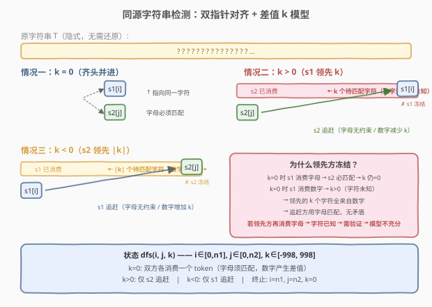
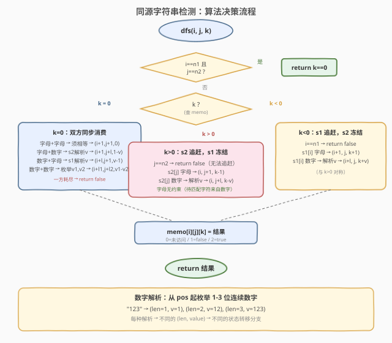
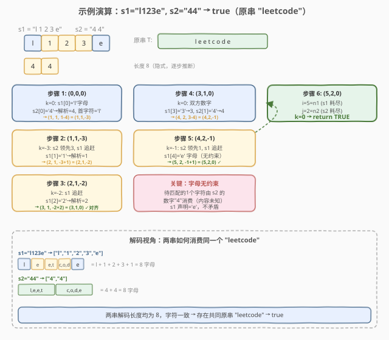

# LeetCode 同源字符串检测 题解

## 1. 题目概述

- **标题 / 题号**：同源字符串检测（#2060，hard）
- **链接**：https://leetcode.cn/problems/check-if-an-original-string-exists-given-two-encoded-strings/
- **难度**：困难
- **标签**：记忆化搜索、动态规划、双指针

**题意**：一个由小写字母组成的**原字符串**按下述步骤编码：

1. 任意**分割**为若干非空子字符串的序列；
2. 任意选择其中一些元素，替换为其各自**长度**（数字型字符串）；
3. 重新顺次连接，得到编码字符串。

例如 `"abcdefghijklmnop"` 可编码为 `"ab121p"`：分割为 `["ab","cdefghijklmn","o","p"]`，将第 2、3 段替换为长度 `"12"`、`"1"`，连接得 `"ab121p"`。

给定两个编码字符串 `s1` 和 `s2`（由小写字母和数字 `1-9` 组成），判断是否存在一个原字符串能同时编码为 `s1` 和 `s2`。

**示例 1**：

```text
输入：s1 = "internationalization", s2 = "i18n"
输出：true
解释：原字符串 "internationalization"（20 字母）。
  s1: 不替换 → "internationalization"
  s2: ["i","nternationalizatio","n"] → ["i","18","n"] → "i18n"
```

**示例 2**：

```text
输入：s1 = "l123e", s2 = "44"
输出：true
解释：原字符串 "leetcode"（8 字母）。
  s1: ["l","e","et","cod","e"] → ["l","1","2","3","e"] → "l123e"
  s2: ["leet","code"] → ["4","4"] → "44"
```

**示例 3**：

```text
输入：s1 = "a5b", s2 = "c5b"
输出：false
解释：s1 首字母必为 'a'，s2 首字母必为 'c'，矛盾。
```

**示例 4**：

```text
输入：s1 = "112s", s2 = "g841"
输出：true
解释：原字符串 "gaaaaaaaaaaaas"（g + 12 个 a + s = 14 字母）。
  s1: ["1","12","s"] → "112s"（1+12+1=14）
  s2: ["g","8","4","1"] → "g841"（1+8+4+1=14）
```

**约束**：

- `1 <= s1.length, s2.length <= 40`
- `s1`、`s2` 仅由数字 `1-9` 和小写字母组成
- `s1`、`s2` 中连续数字不超过 3 位

> ⚠️ **核心难点**：数字串的解析有歧义——`"12"` 既可以解析为长度 12，也可以拆成 `"1"` 和 `"2"` 两个独立段（长度 1 和 2）。需要枚举所有合法解析方式。

## 2. 解题思路

### 2.1 暴力思路：枚举所有原字符串

最朴素的想法：枚举 `s1` 和 `s2` 所有可能的原字符串（通过枚举数字段的所有解析方式 + 字母段的固定字符），然后用集合求交。但一条 40 字符的编码串可能有数十亿种解析（每个 3 位数字有 3 种拆法），根本不可行。

### 2.2 核心观察：双指针对齐 + 差值记忆化搜索



**关键直觉**：我们不需要还原原字符串的具体内容，只需验证 `s1` 和 `s2` 能否**同步消费**同一个原字符串。用双指针 `i`（在 `s1` 中）、`j`（在 `s2` 中）逐步推进，并用**差值 `k`** 记录两边已消费原字符串字符数的差：

$$k = (\text{s1 已消费的字符数}) - (\text{s2 已消费的字符数})$$

- **`k = 0`**：两边齐头并进，指向原字符串同一位置。字母必须匹配，数字创建差值。
- **`k > 0`**：`s1` 领先 `k` 个字符。只有 `s2` 可以追赶（消费字母或数字），`k` 递减。
- **`k < 0`**：`s2` 领先。只有 `s1` 追赶，`k` 递增。

> 💡 **为什么领先方不能动？** 当 `k > 0` 时，`s1` 领先的 `k` 个字符是 `s1` 用**数字**消费的（因为在 `k = 0` 时 `s1` 消费字母必然配对 `s2` 同一字母，不会产生正差值）。这些字符**内容未知**，`s2` 追赶时用字母去匹配它们不会产生矛盾。如果允许领先方继续消费字母，就会引入「已知字符」需要后续验证，打破差值模型的充分性。因此**领先方只能原地等待**，保证所有待匹配字符都来自数字（未知），追赶方的字母无约束。

**状态转移**（`dfs(i, j, k)`）：

| 条件 | `s1[i]` | `s2[j]` | 操作 | 新状态 |
|------|---------|---------|------|--------|
| `k=0` | 字母 | 字母 | 必须相等，各前进 1 | `(i+1, j+1, 0)` |
| `k=0` | 字母 | 数字 | `s2` 解析为 $v$，首字符 = `s1[i]` | `(i+1, j+len, 1-v)` |
| `k=0` | 数字 | 字母 | `s1` 解析为 $v$，首字符 = `s2[j]` | `(i+len, j+1, v-1)` |
| `k=0` | 数字 | 数字 | `s1`→$v_1$，`s2`→$v_2$，枚举所有组合 | `(i+len1, j+len2, v1-v2)` |
| `k>0` | — | 字母 | `s2` 消费 1 字符（无约束） | `(i, j+1, k-1)` |
| `k>0` | — | 数字 | `s2` 解析为 $v$ | `(i, j+len, k-v)` |
| `k<0` | 字母 | — | `s1` 消费 1 字符（无约束） | `(i+1, j, k+1)` |
| `k<0` | 数字 | — | `s1` 解析为 $v$ | `(i+len, j, k+v)` |

**数字解析**：从当前位置起，尝试解析 1、2、3 位连续数字，得到 $(len, value)$ 对。例如 `"123"` → `(1,1), (2,12), (3,123)`。

**终止条件**：`i == n1 && j == n2` 时，返回 `k == 0`（两边同时耗尽且差值为零）。

### 2.3 算法流程图



### 2.4 示例演算

以 `s1 = "l123e"`, `s2 = "44"`（原字符串 `"leetcode"`）为例：



| 步骤 | `i` | `j` | `k` | `s1[i]` | `s2[j]` | 操作 | 新状态 |
|------|-----|-----|-----|---------|---------|------|--------|
| 1 | 0 | 0 | 0 | `l` | `4` | `k=0`：s1 字母，s2 解析 `"4"`=4，首字符=`l` | `(1, 1, 1-4)` = `(1,1,-3)` |
| 2 | 1 | 1 | -3 | `1` | — | `k<0`：s1 解析 `"1"`=1 | `(2, 1, -3+1)` = `(2,1,-2)` |
| 3 | 2 | 1 | -2 | `2` | — | `k<0`：s1 解析 `"2"`=2 | `(3, 1, -2+2)` = `(3,1,0)` |
| 4 | 3 | 1 | 0 | `3` | `4` | `k=0`：双方数字，s1→`"3"`=3，s2→`"4"`=4 | `(4, 2, 3-4)` = `(4,2,-1)` |
| 5 | 4 | 2 | -1 | `e` | — | `k<0`：s1 消费字母 `e`（无约束） | `(5, 2, -1+1)` = `(5,2,0)` |
| 6 | 5 | 2 | 0 | — | — | `i=5=n1`, `j=2=n2`, `k=0` → **TRUE** | ✓ |

> 💡 **第 5 步的关键**：`s1[4]='e'` 是字母，但此时 `k=-1`（`s2` 领先 1 字符）。这 1 个待匹配字符是 `s2` 用数字 `4` 消费的（内容未知），`s1` 用字母 `e` 声明它就是 `e`，两者不矛盾——因为数字端不限制字符内容。

## 3. 参考代码

### C++

```cpp
class Solution {
    int n1, n2;
    string s1, s2;
    vector<vector<vector<char>>> memo;
    static constexpr int OFFSET = 1000;

public:
    bool possiblyEquals(string s1, string s2) {
        this->s1 = s1;
        this->s2 = s2;
        n1 = s1.size();
        n2 = s2.size();
        memo.assign(n1 + 1,
                    vector<vector<char>>(n2 + 1, vector<char>(2001, 0)));
        return dfs(0, 0, 0);
    }

private:
    bool dfs(int i, int j, int k) {
        if (i == n1 && j == n2) return k == 0;
        if (k + OFFSET < 0 || k + OFFSET >= 2001) return false;

        char& cached = memo[i][j][k + OFFSET];
        if (cached) return cached == 2;

        bool res = false;
        if (k == 0) {
            if (i < n1 && j < n2) {
                bool d1 = isdigit((unsigned char)s1[i]);
                bool d2 = isdigit((unsigned char)s2[j]);
                if (!d1 && !d2) {
                    res = (s1[i] == s2[j]) && dfs(i + 1, j + 1, 0);
                } else if (!d1 && d2) {
                    int v = 0;
                    for (int l = 1; l <= 3 && j + l - 1 < n2 &&
                                     isdigit((unsigned char)s2[j + l - 1]);
                         ++l) {
                        v = v * 10 + (s2[j + l - 1] - '0');
                        if (dfs(i + 1, j + l, 1 - v)) { res = true; break; }
                    }
                } else if (d1 && !d2) {
                    int v = 0;
                    for (int l = 1; l <= 3 && i + l - 1 < n1 &&
                                     isdigit((unsigned char)s1[i + l - 1]);
                         ++l) {
                        v = v * 10 + (s1[i + l - 1] - '0');
                        if (dfs(i + l, j + 1, v - 1)) { res = true; break; }
                    }
                } else {
                    int v1 = 0;
                    for (int l1 = 1; l1 <= 3 && i + l1 - 1 < n1 &&
                                      isdigit((unsigned char)s1[i + l1 - 1]);
                         ++l1) {
                        v1 = v1 * 10 + (s1[i + l1 - 1] - '0');
                        int v2 = 0;
                        for (int l2 = 1; l2 <= 3 && j + l2 - 1 < n2 &&
                                          isdigit((unsigned char)s2[j + l2 - 1]);
                             ++l2) {
                            v2 = v2 * 10 + (s2[j + l2 - 1] - '0');
                            if (dfs(i + l1, j + l2, v1 - v2)) { res = true; break; }
                        }
                        if (res) break;
                    }
                }
            }
        } else if (k > 0) {
            if (j < n2) {
                if (isdigit((unsigned char)s2[j])) {
                    int v = 0;
                    for (int l = 1; l <= 3 && j + l - 1 < n2 &&
                                     isdigit((unsigned char)s2[j + l - 1]);
                         ++l) {
                        v = v * 10 + (s2[j + l - 1] - '0');
                        if (dfs(i, j + l, k - v)) { res = true; break; }
                    }
                } else {
                    res = dfs(i, j + 1, k - 1);
                }
            }
        } else {
            if (i < n1) {
                if (isdigit((unsigned char)s1[i])) {
                    int v = 0;
                    for (int l = 1; l <= 3 && i + l - 1 < n1 &&
                                     isdigit((unsigned char)s1[i + l - 1]);
                         ++l) {
                        v = v * 10 + (s1[i + l - 1] - '0');
                        if (dfs(i + l, j, k + v)) { res = true; break; }
                    }
                } else {
                    res = dfs(i + 1, j, k + 1);
                }
            }
        }

        cached = res ? 2 : 1;
        return res;
    }
};
```

### Python

```python
class Solution:
    def possiblyEquals(self, s1: str, s2: str) -> bool:
        n1, n2 = len(s1), len(s2)

        def parse(s, pos, n):
            v = 0
            for l in range(1, 4):
                if pos + l - 1 < n and s[pos + l - 1].isdigit():
                    v = v * 10 + int(s[pos + l - 1])
                    yield l, v
                else:
                    break

        @cache
        def dfs(i: int, j: int, k: int) -> bool:
            if i == n1 and j == n2:
                return k == 0

            if k == 0:
                if i < n1 and j < n2:
                    c1, c2 = s1[i], s2[j]
                    if c1.isalpha() and c2.isalpha():
                        return c1 == c2 and dfs(i + 1, j + 1, 0)
                    elif c1.isalpha() and c2.isdigit():
                        return any(dfs(i + 1, j + l, 1 - v)
                                   for l, v in parse(s2, j, n2))
                    elif c1.isdigit() and c2.isalpha():
                        return any(dfs(i + l, j + 1, v - 1)
                                   for l, v in parse(s1, i, n1))
                    else:
                        return any(dfs(i + l1, j + l2, v1 - v2)
                                   for l1, v1 in parse(s1, i, n1)
                                   for l2, v2 in parse(s2, j, n2))
                return False
            elif k > 0:
                if j >= n2:
                    return False
                if s2[j].isdigit():
                    return any(dfs(i, j + l, k - v)
                               for l, v in parse(s2, j, n2))
                return dfs(i, j + 1, k - 1)
            else:
                if i >= n1:
                    return False
                if s1[i].isdigit():
                    return any(dfs(i + l, j, k + v)
                               for l, v in parse(s1, i, n1))
                return dfs(i + 1, j, k + 1)

        return dfs(0, 0, 0)
```

> ⚠️ **C++ 注意**：`isdigit` 参数需传 `unsigned char`，否则遇到非 ASCII 字符会触发未定义行为。`memo` 用 `char` 存储（0=未访问, 1=false, 2=true）节省空间。

> 💡 **Python 注意**：`@cache`（即 `functools.lru_cache(None)`）自动记忆化。`parse` 是生成器函数，用 `any()` 短路求值——找到一条可行路径即返回，不枚举全部。

## 4. 复杂度分析

| 维度 | 复杂度 | 说明 |
|------|--------|------|
| 时间复杂度 | $O(n_1 \cdot n_2 \cdot K \cdot 9)$ | 状态数 $O(n_1 \cdot n_2 \cdot K)$，其中 $K \leq 1000$（差值 $|k| \leq 998$，因数字最大 999、最小 1，单步最大差值 998）；每个状态最多枚举 $3 \times 3 = 9$ 种数字解析组合 |
| 空间复杂度 | $O(n_1 \cdot n_2 \cdot K)$ | 三维记忆化数组，$n_1, n_2 \leq 40$，$K \leq 2001$，约 $3.3\text{M}$ 字节（char 数组） |

> 💡 **差值上界推导**：在 $k=0$ 时双方各消费一个 token，最大差值 $= 999 - 1 = 998$；追赶阶段每步将 $|k|$ 减小（追赶方消费 $v$ 个字符）或反转符号（超射），新 $|k| = v - |k_{\text{old}}| \leq 999 - 1 = 998$。故 $|k| \leq 998$ 恒成立，$K = 2001$ 足够安全。

## 5. 扩展：差值模型的正确性证明

**定理**：状态 $(i, j, k)$ 可达当且仅当存在原字符串 $T$ 的一个前缀 $T_1$（长度 $p_1$）和前缀 $T_2$（长度 $p_2$），使得 $s_1[0..i)$ 能编码为 $T_1$、$s_2[0..j)$ 能编码为 $T_2$，且 $T_1$ 是 $T_2$ 的前缀（或反之），$k = p_1 - p_2$。

**关键不变式**：当 $k > 0$ 时，$s_1$ 领先的 $k$ 个字符全部由**数字**消费（非字母）。这是因为：

- 在 $k = 0$ 时若 $s_1$ 消费字母，则 $s_2$ 必同时消费同一字母（强制匹配），$k$ 保持 0；
- 只有 $s_1$ 消费数字时才可能产生 $k > 0$；
- 进入 $k > 0$ 后 $s_1$ 停止消费（领先方不动），不会新增字母消费。

因此追赶方（$s_2$）用字母匹配这些字符时**无约束**——数字端不限制字符内容，字母端声明任意字符都不会矛盾。这正是差值模型无需记录具体字符的根因。

## 6. 面试要点

1. **为什么不需要记录原字符串的具体字符？**

   - 因为只有在 $k=0$ 且双方都消费字母时才需要验证匹配（直接比较 $s_1[i] == s_2[j]$）；当 $k \neq 0$ 时，待匹配字符由数字消费（内容未知），追赶方用字母声明任何字符都不矛盾。差值 $k$ 已编码了所有需要的状态信息。

2. **为什么领先方不能继续消费字母？**

   - 若领先方消费字母，该字符变为「已知」，追赶方后续必须精确匹配。但差值模型不记录字符内容，无法验证。更本质地：领先方等待可以保证所有待匹配字符来自数字（未知），追赶方字母无约束。允许领先方消费字母会引入无法验证的约束，使模型不充分。

3. **数字解析为什么要枚举 1-3 位？**

   - 连续数字串的分割有歧义：`"12"` 可以是长度 12，也可以是长度 1 + 长度 2。题目保证连续数字不超过 3 位，所以从当前位置起尝试 1、2、3 位解析即可覆盖所有可能。每种解析产生不同的 $(len, value)$，对应不同的状态转移。

4. **差值 $k$ 的范围为什么有界？**

   - 单个数字最大 999（3 位），最小 1。$k=0$ 时单步最大差值 $999-1=998$。追赶阶段每步将 $|k|$ 减小或反转，新 $|k| \leq 998$。故 $|k| \leq 998$ 恒成立，用 $[-1000, 1000]$ 的数组即可覆盖。

5. **这题和普通双串 DP（如编辑距离）的区别？**

   - 编辑距离的 DP 状态是 $(i, j)$，因为两边消费的是确定的字符。本题的难点在于数字段的**歧义解析**和**差值追踪**——数字消费的字符内容未知，只有差值 $k$ 能描述两边的同步关系，因此状态多了一维 $k$。

## 同类练习题

| # | 题目 | 与本题的关联 |
|---|------|-------------|
| 10 | [正则表达式匹配](https://leetcode.cn/problems/regular-expression-matching/)（[题解](../0001-0100/10_正则表达式匹配.md)） | 双串 DP + `*` 可变长度匹配，同样需要处理「通配符消费任意字符」的语义，对比数字段消费未知字符 |
| 44 | [通配符匹配](https://leetcode.cn/problems/wildcard-matching/)（[题解](../0001-0100/44_通配符匹配.md)） | `*` 匹配任意长度序列，与数字段表示任意长度子串结构相似，均涉及长度不定的消费 |
| 97 | [交错字符串](https://leetcode.cn/problems/interleaving-string/)（[题解](../0101-0200/97_交错字符串.md)） | 双串同步消费合并为第三串，状态 $(i, j)$ 追踪双指针位置，对比本题增加差值维度 |
| 72 | [编辑距离](https://leetcode.cn/problems/edit-distance/)（[题解](../0001-0100/72_编辑距离.md)） | 经典双串 DP $(i, j)$，每步消费确定字符，对比本题数字段带来的歧义与差值追踪 |
