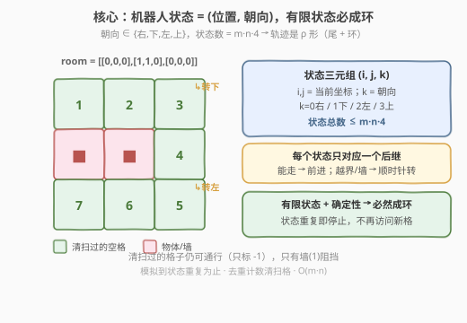

# 扫地机器人清扫过的空间个数

- **题目名称**：扫地机器人清扫过的空间个数
- **链接**：[2061. 扫地机器人清扫过的空间个数](https://leetcode.cn/problems/number-of-spaces-cleaning-robot-cleaned/)
- **难度**：中等
- **标签**：数组、矩阵、模拟

## 1. 题目概述

一个房间用一个**从 0 开始索引**的二维二进制矩阵 `room` 表示，其中 `0` 表示**空闲**空间，`1` 表示放有**物体**（墙）的空间。房间左上角 `room[0][0]` 永远是空闲的。

一个扫地机器人**面向右侧**，从左上角 `(0, 0)` 开始清扫。机器人将一直前进，直到抵达房间边界或触碰到物体时，机器人会**顺时针**旋转 90 度并重复以上步骤。初始位置和所有机器人走过的空间都会被它**清扫干净**。

若机器人持续运转下去，返回被**清扫干净**的空间数量。

**示例 1**：

```text
输入：room = [[0,0,0],[1,1,0],[0,0,0]]
输出：7
解释：
机器人清理了位于 (0, 0)、(0, 1) 和 (0, 2) 的空间。
机器人位于房间边界，所以它顺时针旋转 90 度，现在面向下。
机器人清理了位于 (1, 2) 和 (2, 2) 的空间。
机器人位于房间边界，所以它顺时针旋转 90 度，现在面向左。
机器人清理了位于 (2, 1) 和 (2, 0) 的空间。
机器人已清理了所有 7 处空闲空间，所以返回 7。
```

**示例 2**：

```text
输入：room = [[0,1,0],[1,0,0],[0,0,0]]
输出：1
解释：
机器人清理了位于 (0, 0) 的空间。
机器人触碰到了物体，所以它顺时针旋转 90 度，现在面向下。
机器人触碰到了物体，所以它顺时针旋转 90 度，现在面向左。
机器人位于房间边界，所以它顺时针旋转 90 度，现在面向上。
机器人位于房间边界，所以它顺时针旋转 90 度，现在面向右。
机器人回到了起始状态。
机器人清理了 1 处空间，所以返回 1。
```

**约束条件**：

- `m == room.length`
- `n == room[r].length`
- `1 <= m, n <= 300`
- `room[r][c]` 只会是 `0` 或 `1`
- `room[0][0] == 0`

---

## 2. 解题思路

### 2.1 暴力思路：无限模拟直到"看起来不动了"

最直白的做法是照着题意一步步模拟机器人的移动与转向，把走过的格子记到一个集合里。问题是：机器人**什么时候停**？

- 一种朴素想法是"机器人转满一圈（连续 4 次 90°）还没动就停"。但这只覆盖"被四面墙围死"的极端情况（如示例 2）。
- 在示例 1 中，机器人清扫完 7 格后会进入一个**循环**：沿 `(2,1)→(2,2)→转→(2,2)→(2,1)→(2,0)→转→(2,0)→(2,1)…` 不断绕圈，它**永远转不满连续 4 次**，却也不再访问新格子。如果用"连续 4 次转向"作终止条件，机器人会无限运转下去——答案却显然是有限的 7。

所以"何时停"必须换一个更本质的判据。

### 2.2 核心观察：状态 = (位置, 朝向)，有限状态必成环



关键直觉：机器人的行为完全由**当前状态**决定，而状态可以表示为一个三元组：

$$\text{state} = (i,\ j,\ k),\quad k \in \{0:\text{右},\ 1:\text{下},\ 2:\text{左},\ 3:\text{上}\}$$

每个状态**有且仅有一个确定的后继**：

- 若下一格在界内且不是墙（`room[ni][nj] != 1`）→ **前进**，状态变为 $(n_i, n_j, k)$；
- 否则（越界或墙）→ **原地顺时针转 90°**，状态变为 $(i, j, (k+1)\bmod 4)$。

由于状态总数有限（$\le m \cdot n \cdot 4 \le 300\times300\times4 = 3.6\times10^5$），且后继唯一，整条轨迹必定是 **ρ 形（一条尾巴接一个环）**：从起点出发走一段"尾巴"，然后进入一个循环反复绕圈。

> 💡 **何时停**：一旦某个状态 $(i,j,k)$ **第二次出现**，此后轨迹将原样重复，不会再访问任何新格子。此时已清扫集合不再增长，直接返回其大小即可。这正是"机器人持续运转下去"能清扫的空间总数。

> ⚠️ **易错点：清扫过的格子仍然可通行**。题目只说走过会被清扫，并未说清扫后变成障碍。因此"能否前进"只看下一格是不是墙 `1`（或越界），与是否清扫过无关。实现时把清扫过的格标记为 `-1`（既区别于 `0`，又 `!= 1` 仍可通过），就能同时满足"不重复计数"与"仍可通行"。

### 2.3 算法流程图


流程是一个单层循环，每轮做四件事：标记当前格清扫 → 记录状态已访问 → 判定该状态是否见过（见过则返回 `ans`）→ 否则看下一格决定前进还是转向。终止条件统一收敛到"状态重复"，无需对"连续转向次数"做任何特判。

### 2.4 示例演算

![逐步演算 room=[[0,0,0],[1,1,0],[0,0,0]]](../images/2061_example_walkthrough.svg)

以示例 1 为例逐步演算（朝向记号：`→`右 `↓`下 `←`左 `↑`上）：

- **步骤 1-2**：`(0,0)→` 前进到 `(0,1)`、`(0,2)`，`ans=1,2,3`。
- **步骤 3**：在 `(0,2)` 朝右，下一格 `(0,3)` 越界 → 转 90° 变朝下。
- **步骤 4-5**：`(0,2)↓` 前进到 `(1,2)`、`(2,2)`，`ans=4,5`。
- **步骤 6**：在 `(2,2)` 朝下，下一格 `(3,2)` 越界 → 转 90° 变朝左。
- **步骤 7 及之后**：`(2,2)←` 前进到 `(2,1)`、`(2,0)`，`ans=6,7`；随后在 `(2,0)` 连续转两次（上被墙挡、左越界）变回朝右，沿已清扫格绕回 `(2,2)`，最终在状态 `(2,2,↓)` **第二次出现**时停止。

最终 `ans = 7`。注意机器人在环里反复绕行，但环上的格子早已清扫，集合不再增长——这正是状态判重终止的威力。

---

## 3. 参考代码

### C++（迭代模拟 + 三维判重表）

```cpp
class Solution {
  public:
    int numberOfCleanRooms(vector<vector<int>>& room) {
        int m = room.size(), n = room[0].size();
        // 朝向：0右 1下 2左 3上（顺时针顺序，便于 +1 取模转向）
        const int dr[4] = {0, 1, 0, -1};
        const int dc[4] = {1, 0, -1, 0};
        // seen[i][j][k]：状态 (i,j,k) 是否已访问过
        vector<vector<vector<char>>> seen(
            m, vector<vector<char>>(n, vector<char>(4, 0)));

        int i = 0, j = 0, k = 0, ans = 0;
        while (!seen[i][j][k]) {
            seen[i][j][k] = 1;
            if (room[i][j] == 0) {     // 首次到达才计数
                ans++;
                room[i][j] = -1;        // 标记已清扫：!=1 仍可通行，!=0 不再计数
            }
            int ni = i + dr[k], nj = j + dc[k];
            if (ni >= 0 && ni < m && nj >= 0 && nj < n && room[ni][nj] != 1) {
                i = ni, j = nj;          // 前进，朝向不变
            } else {
                k = (k + 1) % 4;         // 原地顺时针转 90°
            }
        }
        return ans;
    }
};
```

### Python

```python
class Solution:
    def numberOfCleanRooms(self, room: List[List[int]]) -> int:
        m, n = len(room), len(room[0])
        # 朝向：0右 1下 2左 3上
        dirs = [(0, 1), (1, 0), (0, -1), (-1, 0)]
        seen = [[[False] * 4 for _ in range(n)] for _ in range(m)]

        i = j = k = ans = 0
        while not seen[i][j][k]:
            seen[i][j][k] = True
            if room[i][j] == 0:            # 首次到达才计数
                ans += 1
                room[i][j] = -1            # 标记已清扫：仍可通行，不再计数
            ni, nj = i + dirs[k][0], j + dirs[k][1]
            if 0 <= ni < m and 0 <= nj < n and room[ni][nj] != 1:
                i, j = ni, nj              # 前进，朝向不变
            else:
                k = (k + 1) % 4            # 原地顺时针转 90°
        return ans
```

> 💡 两种语言都把"清扫标记"复用到了 `room` 上（`0→-1`），省去额外二维数组；判重用独立的三维 `seen` 表，因为同一格从不同朝向进入是**不同状态**，必须按 `(i,j,k)` 三元组判重。

---

## 4. 复杂度分析

| 维度 | 复杂度 | 说明 |
|------|--------|------|
| 时间复杂度 | $O(m \cdot n)$ | 状态数 $\le m \cdot n \cdot 4$，每个状态至多访问一次即触发终止；每轮 $O(1)$ |
| 空间复杂度 | $O(m \cdot n)$ | 三维 `seen` 表大小 $m \cdot n \cdot 4$；清扫标记原地写在 `room` 上不计额外空间 |

> 💡 相比"无限模拟 + 连续 4 次转向终止"的朴素做法（可能永不停止），状态判重把模拟步数牢牢锁在 $O(m \cdot n)$ 内，且**正确性有保证**：状态重复等价于"未来轨迹完全复刻"，不会再有新格被清扫。

---

## 5. 扩展：为什么"状态重复"是正确的终止条件？

本题的精髓不在模拟本身，而在**终止条件的选取**。可以从两个角度严格论证：

**1. 有限状态 + 确定性后继 ⇒ 必然成环**

把每个状态看作图中的一个节点，"后继关系"是每个节点出度为 1 的有向边。任意有限、出度恒为 1 的有向图，从任一节点出发的路径必然形如 $\rho$（尾巴 + 环）：走至多 $|V|$ 步后一定会撞上之前访问过的节点，此后便在环上无限循环。

**2. 成环后清扫集合不再增长**

设状态 $s^*$ 是第一个被第二次访问的状态。从 $s^*$ 第一次出现到第二次出现的那段路径，构成一个环。由于"清扫集合"只随**首次到达的格子**增长，而环上每一步的状态都在第一次出现那段已被记录，环上经过的格子要么是尾巴里已清扫的，要么是环自身第一次经过时已清扫的——总之**环内不再产生首次到达**。因此 $s^*$ 重复时，清扫集合已达到最终值，立即返回正确。

> ⚠️ 反例警示：若误用"连续 4 次转向即停"，在示例 1 中机器人进入绕行环后**永远凑不齐连续 4 次转向**（环里最多连续转 2 次），会陷入死循环。可见终止条件必须基于"状态"而非"局部动作计数"。

**与"机器人被四面围死"的关系**：示例 2 那种"原地转满一圈"的情况，本质上是状态 $(0,0,\text{右})$ 经过 4 次转向回到了自身——它只是状态成环的一个**特例**（自环长度为 4 的纯转向环）。统一的"状态判重"自然覆盖之，无需特判。

---

## 6. 面试要点

1. **机器人什么时候该停？为什么不能按"连续转向 4 次"停？**

   - 机器人在有限状态空间里走 ρ 形轨迹，**状态 $(i,j,k)$ 重复**时即应停：此后轨迹原样循环，不再访问新格。"连续转向 4 次"只在机器人被四面围死（纯转向自环）时成立；像示例 1 那样进入"前进+转向"混合环时永远凑不齐 4 次连续转向，会死循环。

2. **为什么判重要带朝向 `k`，不能只判位置 `(i,j)`？**

   - 同一格从不同朝向进入是不同状态，后继不同：从 `(2,2)` 朝下会被边界挡住转向，朝左则能前进到 `(2,1)`。只按位置判重会**误判提前终止**，漏算尚未清扫的格子；按三元组判重才与"确定性后继"的成环论证一致。

3. **清扫过的格子还能走吗？代码里如何体现？**

   - 能。题目只把"走过"定义为清扫，并未使之变为障碍。代码把清扫格置为 `-1`：判定前进时只检查 `room[ni][nj] != 1`，故 `-1` 仍可通过；计数时只认 `== 0`，故 `-1` 不重复计数。一个标记同时满足两个约束。

4. **时间复杂度为什么是 $O(m \cdot n)$ 而不是 $O(m \cdot n \cdot 4)$？**

   - 两者同阶。状态总数 $\le 4mn$，每个状态至多访问一次即终止，故步数上限 $4mn = O(mn)$。常数因子 4 不影响大 O 表示。

5. **如果把"顺时针转 90°"改成"逆时针"，或者改成"碰到已清扫格也转向"会怎样？**

   - 改成逆时针只是把转向改成 `k = (k + 3) % 4`，成环论证不变，模拟仍正确。改成"碰到已清扫格也转向"则**改变了可达性**：机器人可能无法回穿已清扫区域，轨迹与原题不同——这其实是 LeetCode 489「机器人扫地」的简化版思路（那题用回溯 + DFS 探索未知区域，复杂得多）。

---

## 7. 同类练习题

- [489. 扫地机器人](https://leetcode.cn/problems/robot-room-cleaner/)（🔒）：同样在未知网格里清扫，但需用 DFS 回溯探索全图，是本题的"未知地图 + 多方向探索"升级版
- [994. 腐烂的橘子](https://leetcode.cn/problems/rotting-oranges/)：网格模拟 + 状态扩展，对比本题"单智能体状态机"与"多源 BFS"两种模拟范式
- [141. 环形链表](https://leetcode.cn/problems/linked-list-cycle/)：同样利用"有限状态 + 确定性后继 ⇒ 必成环"，把隐式状态序列的判环思想迁移到链表
- [287. 寻找重复数](https://leetcode.cn/problems/find-the-duplicate-number/)：Floyd 判圈，"下标当状态、后继唯一"的隐式图成环模型，与本题状态机成环同源
- [54. 螺旋矩阵](https://leetcode.cn/problems/spiral-matrix/)：同样在网格上"碰到边界就顺时针转向"，对比"按层螺旋遍历"与"按状态机模拟"两种视角
