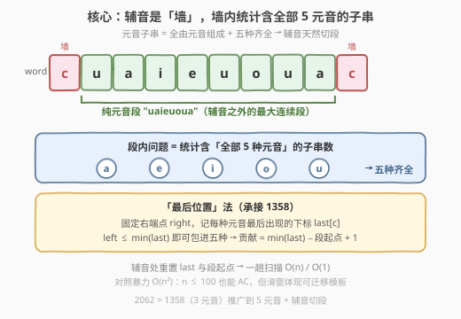
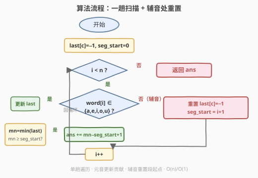
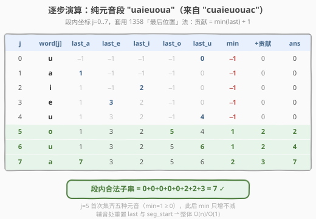

# LeetCode 统计字符串中的元音子字符串 题解

## 1. 题目概述

- **标题 / 题号**：统计字符串中的元音子字符串（#2062，easy）
- **链接**：https://leetcode.cn/problems/count-vowel-substrings-of-a-string/
- **难度**：简单
- **标签**：字符串、滑动窗口、双指针

**题意**：给定字符串 `word`，统计其中**元音子字符串**的数目。**元音子字符串**需同时满足两个条件：

1. **全由元音组成**：子串中只含 `'a'`、`'e'`、`'i'`、`'o'`、`'u'`（不能有任何辅音）；
2. **五种齐全**：子串必须包含全部五种元音，每种至少出现一次。

**示例 1**：

```text
输入：word = "aeiouu"
输出：2
解释：元音子字符串为 "aeiou" 和 "aeiouu"。
```

**示例 2**：

```text
输入：word = "unicornarihan"
输出：0
解释：word 中不含 5 种元音，所以不存在元音子字符串。
```

**示例 3**：

```text
输入：word = "cuaieuouac"
输出：7
解释：元音子字符串有 "uaieuo"、"uaieuou"、"uaieuoua"、"aieuo"、"aieuou"、
      "aieuoua"、"ieuoua"（均位于辅音 c 之间的纯元音段 "uaieuoua" 内）。
```

**示例 4**：

```text
输入：word = "bbaeixoubb"
输出：0
解释：含全部五种元音的子串都夹着辅音（如 x、b），不满足"全由元音组成"。
```

**约束**：

- `1 <= word.length <= 100`
- `word` 仅由小写英文字母组成

> 💡 这道题是 [1358. 包含所有三种字符的子字符串数目](../1301-1400/1358_包含所有三种字符的子字符串数目.md) 的**直接推广**：把"含全部 3 种字符"换成"含全部 5 种元音"，再加一条"子串必须全由元音组成"（辅音天然切段）。核心仍是「以每个右端点结尾的合法子串数 = min(最后位置) + 1」这一可迁移模板。

## 2. 解题思路

### 2.1 暴力思路：枚举所有子串 + 集合判定

最直白的做法：两重循环枚举所有子串 `[i, j]`，对每个子串检查"全元音 + 五种齐全"。优化点是**遇到辅音即中断内层循环**——因为辅音之后无论怎么延伸，子串都不可能"全由元音组成"。

```text
ans = 0
for i in 0..n-1:
    seen = set()
    for j in i..n-1:
        if word[j] not in vowels: break   # 辅音是墙，内层立即终止
        seen.add(word[j])
        if len(seen) == 5: ans += 1
return ans
```

时间 $O(n^2)$，空间 $O(1)$（集合最多 5 个元素）。在 `n ≤ 100` 时约 $10^4$ 次操作，能轻松 AC。但暴力枚举**忽略了两个结构**：

1. **辅音是天然的分段墙**：相邻辅音之间的元音构成一个"纯元音段"，合法子串**绝不会跨越辅音**——问题可分解为「每个纯元音段内部，统计含全部 5 种元音的子串数」。
2. **"以 right 结尾的合法子串数"可 O(1) 求出**：无需对每个 right 重新枚举 left，只需跟踪每种元音最后出现的位置。

### 2.2 核心观察：辅音切段 + 「最后位置」法



**观察 1：辅音切段。** 合法子串必须全由元音组成，因此辅音就像一道道"墙"，把 `word` 切成若干**纯元音段**。不同段之间的子串互不影响，**逐段求解后求和**即为答案。例：`"cuaieuouac"` 被两个 `c` 切出唯一一段 `"uaieuoua"`。

**观察 2：段内问题 = 1358 的推广。** 在一个纯元音段内，所有字符都是元音，"全由元音组成"自动满足，于是问题退化为「统计含全部 5 种元音的子串数」——这正是 [1358](../1301-1400/1358_包含所有三种字符的子字符串数目.md) 把 3 种字符换成 5 种的版本。

**「最后位置」法（承接 1358）。** 固定右端点 `right`，设 `last[c]` 为元音 `c` 在 `≤ right` 范围内**最后一次出现的下标**（段内坐标，未出现记 `-1`）。则：

- 子串 `[left, right]` 含全部五种元音 $\iff$ `left ≤ min(last[a], last[e], last[i], last[o], last[u])`。
- 因为 `left` 只要不越过五种"最后位置"中的最小值，就能把每种元音的最后一次出现都包进窗口；一旦越过，那个"最晚凑齐的元音"就被排除，子串立刻缺一种。

所以**以 `right` 结尾的合法子串数**为：

$$
\text{贡献} = \min(\text{last}_a, \text{last}_e, \text{last}_i, \text{last}_o, \text{last}_u) + 1
$$

> ⚠️ **未集齐时自然为零**：只要还有元音没出现过，其 `last = -1`，`min = -1`，贡献 `−1 + 1 = 0`，无需特判。这与 1358 完全一致。

**合并成一趟扫描。** 不必真的"切段再分别处理"——遇到辅音时把所有 `last` 重置为 `-1`、把段起点 `seg_start` 推到 `i+1` 即可。此时贡献公式从段内的 `min(last) + 1` 变为全局坐标下的 `min(last) − seg_start + 1`（等价，只是减去了段起点偏移）。

> 💡 **为何能 O(1) 空间？** 只需 5 个 `last` 下标 + 1 个 `seg_start` + 累加器，全是常数级。比暴力的集合也不多耗空间，但把时间从 $O(n^2)$ 降到 $O(n)$。

### 2.3 算法流程图



流程是一重循环 + 一个分支：元音则更新 `last` 并按 `min(last) − seg_start + 1` 累加贡献；辅音则重置 `last` 与 `seg_start`。`left`/`right` 概念隐含在 `last` 数组里——每次 `right` 右移，`min(last)` 只增不减，贡献随之单调累积。

### 2.4 示例演算

以 `"cuaieuouac"` 的纯元音段 `"uaieuoua"`（段内坐标 `j = 0..7`）为例，套用 `贡献 = min(last) + 1`：



| j | word[j] | last_a | last_e | last_i | last_o | last_u | min | +贡献 | ans |
|---|---------|--------|--------|--------|--------|--------|-----|------|-----|
| 0 | u       | −1     | −1     | −1     | −1     | 0      | −1  | 0    | 0   |
| 1 | a       | 1      | −1     | −1     | −1     | 0      | −1  | 0    | 0   |
| 2 | i       | 1      | −1     | 2      | −1     | 0      | −1  | 0    | 0   |
| 3 | e       | 1      | 3      | 2      | −1     | 0      | −1  | 0    | 0   |
| 4 | u       | 1      | 3      | 2      | −1     | 4      | −1  | 0    | 0   |
| 5 | o       | 1      | 3      | 2      | 5      | 4      | 1   | 2    | 2   |
| 6 | u       | 1      | 3      | 2      | 5      | 6      | 1   | 2    | 4   |
| 7 | a       | 7      | 3      | 2      | 5      | 6      | 2   | 3    | 7   |

> 💡 `j=5` 处 `o` 进窗口，**首次集齐五种元音**（`min = 1 ≥ 0`），开始有贡献。此后随着 `right` 右移，`min` 只增不减，贡献 `2 → 2 → 3` 累加。最终段内合法子串数 $0+0+0+0+0+2+2+3 = 7$，与示例一致。段外两个辅音 `c` 各自重置 `last` 与 `seg_start`，不产生贡献。

## 3. 参考代码

### 方法一：暴力枚举（O(n²)，遇辅音即断）

#### Python

```python
class Solution:
    def countVowelSubstrings(self, word: str) -> int:
        vowels = set('aeiou')
        ans, n = 0, len(word)
        for i in range(n):
            seen = set()
            for j in range(i, n):
                if word[j] not in vowels:   # 辅音是墙，内层立即终止
                    break
                seen.add(word[j])
                if len(seen) == 5:          # 五种齐全
                    ans += 1
        return ans
```

#### C++

```cpp
class Solution {
  public:
    int countVowelSubstrings(string word) {
        unordered_set<char> vowels{'a','e','i','o','u'};
        int ans = 0, n = word.size();
        for (int i = 0; i < n; ++i) {
            unordered_set<char> seen;
            for (int j = i; j < n; ++j) {
                if (!vowels.count(word[j])) break;   // 辅音是墙
                seen.insert(word[j]);
                if (seen.size() == 5) ++ans;         // 五种齐全
            }
        }
        return ans;
    }
};
```

### 方法二：最后位置法（O(n)，承接 1358）

#### Python

```python
class Solution:
    def countVowelSubstrings(self, word: str) -> int:
        vowels = set('aeiou')
        last = {c: -1 for c in 'aeiou'}
        ans = seg_start = 0
        for i, ch in enumerate(word):
            if ch in vowels:                       # 元音：更新最后位置
                last[ch] = i
                mn = min(last.values())
                if mn >= seg_start:                # 五种均在当前段内集齐
                    ans += mn - seg_start + 1
            else:                                  # 辅音：重置段
                last = {c: -1 for c in 'aeiou'}
                seg_start = i + 1
        return ans
```

#### C++

```cpp
class Solution {
  public:
    int countVowelSubstrings(string word) {
        int last[26] = {}, seg_start = 0, ans = 0;
        for (int i = 0; i < 26; ++i) last[i] = -1;  // 非元音位无影响
        auto isVowel = [](char c){ return c=='a'||c=='e'||c=='i'||c=='o'||c=='u'; };
        for (int i = 0; i < (int)word.size(); ++i) {
            char c = word[i];
            if (isVowel(c)) {
                last[c - 'a'] = i;
                int mn = min({last[0], last[4], last[8], last[14], last[20]}); // a,e,i,o,u
                if (mn >= seg_start) ans += mn - seg_start + 1;
            } else {
                last[0] = last[4] = last[8] = last[14] = last[20] = -1;
                seg_start = i + 1;
            }
        }
        return ans;
    }
};
```

> ⚠️ **`mn >= seg_start` 判定的含义**：辅音重置后未集齐时，某些 `last = -1`，`mn = -1 < seg_start`，贡献为 0；一旦五种元音都在当前段出现过，`mn ≥ seg_start`，公式 `mn − seg_start + 1` 给出合法起点数（`seg_start .. mn`）。这与段内坐标的 `min(last) + 1` 完全等价——只是减去了段起点偏移。

> 💡 **也可写成滑动窗口形式**（承接 1358 方法二）：维护窗口 `[left, right]` 与五种元音计数，窗口内五种齐全时不断收缩 `left` 并累加 `left − seg_start`。与"最后位置"法等价，但常数稍大。面试推荐"最后位置"法：代码短、无需内层 `while`。

## 4. 复杂度分析

| 方法 | 时间复杂度 | 空间复杂度 | 说明 |
|------|-----------|-----------|------|
| 暴力枚举 | $O(n^2)$ | $O(1)$ | 两重循环，集合至多 5 元素；遇辅音提前断 |
| 最后位置法 | $O(n)$ | $O(1)$ | 一趟扫描，维护 5 个 `last` 下标 + `seg_start` |

> 💡 `n ≤ 100` 时两种方法都 AC。最后位置法的价值在**模板可迁移**：当 `n` 放大到 $5 \times 10^4$（如 1358）时，$O(n^2)$ 必超时，$O(n)$ 仍稳。每步 `min` 取 5 个元素为 $O(5) = O(1)$，故总体严格 $O(n)$。

## 5. 扩展：与 1358 的关系及推广

**与 1358 的同构。** 1358 求"含全部 3 种字符的子串数"，字符串本身只含 `a/b/c`，故不存在"切段"问题；本题多了一条"全由元音组成"，引入辅音切段。**去掉辅音切段的逻辑，本题就退化成 1358 的 5 字符版**——`last[c]` 不必重置，`seg_start` 恒为 0，贡献公式回到 `min(last) + 1`。可以说 2062 = 1358 + 辅音墙。

**"至少" vs "恰好" 的关键区别。** 本题与 1358 都是"**至少各一个**"（单调条件：窗口越左扩越满足），能直接对每个 `right` 求 `min(last) + 1`。若是"**恰好**含 K 种"（如 [1248. 统计优美子数组](../1201-1300/1248_统计优美子数组.md)），窗口满足时既可扩也可缩、不单调，需用 `atMost(K) − atMost(K−1)` 做差。这是滑动窗口计数两大流派的核心分水岭。

**推广到 k 种字符。** 若题目改为"含 `k` 种指定字符各至少一次"：

- 维护 `k` 个最后位置，每步取最小值，`O(n·k)`（`k` 小时用定长数组，常数极小；`k` 大时取 min 可用堆优化到 $O(n \log k)$）。
- 或用"种类数计数 + 同向双指针收缩"，仍是 $O(n)$，对大 `k` 更稳妥。

> 本题 `k = 5` 极小，定长数组 + `min` 一次即 $O(1)$，是最优写法。

## 6. 面试要点

1. **为什么"以 right 结尾的合法子串数 = min(最后位置) + 1"？**

   - `left ≤ min(last)` 时，五种元音的最后一次出现都在 `[left, right]` 内，子串合法；`left` 一旦越过该 `min`，就排除了"最后位置最小的那种元音"，子串立刻缺一种。合法起点恰为段起点 `.. min`，共 `min − seg_start + 1` 个（段内坐标即 `min + 1`）。

2. **辅音处为什么要重置 `last` 和 `seg_start`？**

   - 合法子串不能跨越辅音。辅音之后开启新段，之前段的"最后位置"对新段毫无意义——若不重置，`min(last)` 可能指向辅音之前的位置，导致算出的 `left` 落在辅音上，把辅音包进子串，违反"全由元音组成"。重置 `last = -1` 与 `seg_start = i+1` 确保贡献只在段内累积。

3. **`mn >= seg_start` 这个判定能否省掉？**

   - 不能直接省。未集齐时 `mn = -1`，`-1 − seg_start + 1 ≤ 0`，若不判会给出非正贡献（侥幸不增 ans，但语义错误且易在边界出错）。可改写为 `ans += max(0, mn - seg_start + 1)`，等价但更显式；或重置 `last` 为 `seg_start - 1` 而非 `-1`，则未集齐时 `mn = seg_start - 1`，贡献恰为 0，可省判定（但初始化更绕）。

4. **本题与 1358 的关键异同？**

   - **同**：都是"含全部 k 种指定字符的子串数"，都用"最后位置"法，贡献都是 `min(last) + 1`。
   - **异**：1358 字符串只含目标字符，无需切段；本题字符串含辅音（非目标字符），需用辅音切段 + 重置。一句话：**2062 = 1358 + 辅音墙**。

5. **为什么"至少各一个"能直接求，而"恰好 K 个"要做差？**

   - "至少"是单调条件：窗口越左扩、字符越全，越容易满足，故对每个 `right` 存在阈值 `min(last)`，左侧全部合法。"恰好"不单调：窗口满足时既可扩（多含字符）也可缩（少含字符），无法直接对单 `right` 求贡献，只能用 `atMost(K) − atMost(K−1)` 间接求。

> 💡 **一句话总结**：2062 是 1358 的 5 元音推广 + 辅音切段——辅音是墙，墙内用"最后位置"法对每个 `right` 累加 `min(last) − 段起点 + 1`，一趟扫描 $O(n)/O(1)$。`n ≤ 100` 暴力亦可 AC，但滑窗模板能放大到 $5 \times 10^4$ 量级。

## 同类练习题

| # | 题目 | 与本题的关联 |
|---|------|-------------|
| 1358 | [包含所有三种字符的子字符串数目](https://leetcode.cn/problems/number-of-substrings-containing-all-three-characters/)（[题解](../1301-1400/1358_包含所有三种字符的子字符串数目.md)） | 本题的直接母题，"最后位置"法 `min(last)+1` 的 3 字符版，无辅音切段 |
| 1248 | [统计「优美子数组」](https://leetcode.cn/problems/count-number-of-nice-subarrays/)（[题解](../1201-1300/1248_统计优美子数组.md)） | 对照"恰好 K"需 `atMost` 做差，而本题"至少各一个"可直接求 |
| 76 | [最小覆盖子串](https://leetcode.cn/problems/minimum-window-substring/) | 同为"覆盖全部所需字符"的滑窗，求最短长度而非计数 |
| 992 | [K 个不同整数的子数组](https://leetcode.cn/problems/subarrays-with-k-different-integers/) | 「至多 K」技巧的另一种应用，"恰好 K"做差的招牌题 |
| 3 | [无重复字符的最长子串](https://leetcode.cn/problems/longest-substring-without-repeating-characters/)（[题解](../0001-0100/3_无重复字符的最长子串.md)） | 同向双指针 + 哈希记录位置的母题，滑窗计数的基础 |
