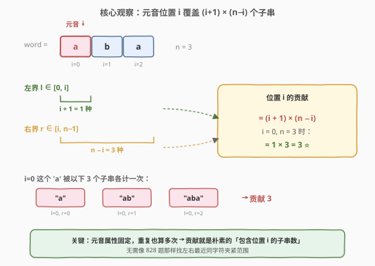
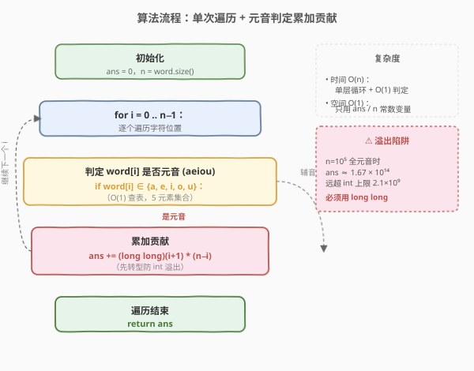
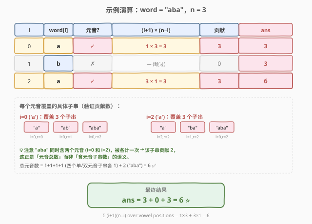

# LeetCode 所有子字符串中的元音 题解

## 1. 题目概述

- **标题 / 题号**：所有子字符串中的元音（#2063，medium）
- **链接**：https://leetcode.cn/problems/vowels-of-all-substrings/
- **难度**：中等
- **标签**：字符串、数学、贡献法

**题意**：给定一个字符串 `word`，返回 `word` 的**所有子字符串**中**元音的总数**。元音是指 `'a'`、`'e'`、`'i'`、`'o'`、`'u'`。

子字符串是字符串中一个连续（非空）的字符序列。

> ⚠️ **关键约束**：`word.length` 可达 $10^5$，子串总数 $O(n^2)$ 约 $5 \times 10^9$ 个，枚举所有子串再逐个统计必然超时。同时，答案可能超过 32 位有符号整数范围（最大约 $1.67 \times 10^{14}$），计算时需用 64 位整数。

**示例 1**：

```text
输入：word = "aba"
输出：6
解释：所有子字符串为 "a"、"ab"、"aba"、"b"、"ba"、"a"。
- "b" 中有 0 个元音
- "a"、"ab"、"ba"、"a" 每个都有 1 个元音
- "aba" 中有 2 个元音
总元音数 = 0 + 1 + 1 + 1 + 1 + 2 = 6
```

**示例 2**：

```text
输入：word = "abc"
输出：3
解释：含元音的子串为 "a"、"ab"、"abc"，每个 1 个元音，共 3 个。
```

**示例 3**：

```text
输入：word = "ltcd"
输出：0
解释：所有子串均不含元音。
```

**示例 4**：

```text
输入：word = "noosabasboosa"
输出：237
```

**约束**：

- `1 <= word.length <= 10^5`
- `word` 由小写英文字母组成

## 2. 解题思路

### 2.1 暴力思路：枚举所有子串

最直观的做法是两层循环枚举所有 $O(n^2)$ 个子串 `[l, r]`，对每个子串线性扫描一遍统计元音数，总计 $O(n^3)$。即便用元音前缀和把单串统计降到 $O(1)$，整体仍是 $O(n^2)$，在 $n = 10^5$ 下约 $5 \times 10^9$ 次操作，必然超时。

突破口在于**转换求和顺序**：题目要「所有子串的元音数之和」，等价于「每个元音字符出现在多少个子串中」的总和：

$$
\text{ans} = \sum_{t \subseteq \text{word}} \text{vowelCount}(t) = \sum_{i=0}^{n-1} [\text{word}[i] \text{ 是元音}] \times (\text{包含位置 } i \text{ 的子串数})
$$

这就是经典的**贡献法**：不枚举子串，而是固定每个位置 `i`，单独计算它对答案的贡献。

### 2.2 核心观察：贡献法——一个元音覆盖多少子串



对位置 `i` 上的元音字符 `word[i]`，它对答案的贡献 = **包含位置 `i` 的子串个数**。一个子串 `[l, r]` 包含位置 `i`，当且仅当 $l \le i \le r$：

- **左边界** `l` 可取 $0, 1, \dots, i$，共 $i + 1$ 种选择；
- **右边界** `r` 可取 $i, i+1, \dots, n-1$，共 $n - i$ 种选择。

左边界与右边界**相互独立**（左界只约束左端、右界只约束右端），所以包含位置 `i` 的子串数为：

$$
\text{contribution}(i) = (i + 1) \times (n - i)
$$

每个这样的子串里，`word[i]` 这个元音都被计一次。把所有元音位置的贡献累加即得答案。

> 💡 **为何本题比 [828. 统计子串中的唯一字符](../0801-0900/828_统计子串中的唯一字符.md) 简单？** 828 题要求字符在子串中「唯一出现」，必须用左右最近同字符下标把范围卡紧到 $(prev, next)$；而本题元音是**固定属性**——一个位置是不是元音与子串里其他字符无关，重复元音也算多次，因此贡献就是朴素的「包含位置 $i$ 的子串数」$(i+1)(n-i)$，无需找左右边界。

> ⚠️ **不重不漏**：同一子串中若有多个元音，会被每个元音各贡献一次——这正是题目所求（统计元音**总数**，而非含元音的子串数），所以重复计入是正确的。

### 2.3 算法流程图



整个流程是单层循环：判定当前字符是否元音 → 若是则把 $(i+1) \times (n-i)$ 累加进答案。每个位置只判一次、加一次，总时间 $O(n)$。元音判定用查表（长度 26 的布尔数组或字符串 `"aeiou"` 的 `find`）做到 $O(1)$。

### 2.4 示例演算



以 `word = "aba"`、`n = 3` 为例逐步演算：

| $i$ | `word[i]` | 元音? | $(i+1)\times(n-i)$ | 贡献 | `ans` |
|-----|-----------|-------|---------------------|------|-------|
| 0 | `a` | ✓ | $1 \times 3 = 3$ | 3 | 3 |
| 1 | `b` | ✗ | — | 0 | 3 |
| 2 | `a` | ✓ | $3 \times 1 = 3$ | 3 | 6 |

- **$i=0$，`a`**：左界只能取 0（1 种），右界可取 0/1/2（3 种），覆盖子串 `"a"`、`"ab"`、`"aba"`，贡献 $1 \times 3 = 3$。
- **$i=1$，`b`**：辅音，贡献 0。
- **$i=2$，`a`**：左界可取 0/1/2（3 种），右界只能取 2（1 种），覆盖子串 `"a"`(后)、`"ba"`、`"aba"`，贡献 $3 \times 1 = 3$。

最终 `ans = 6` ✅，与示例一致。

> 💡 **用示例 4 自检**：`word = "noosabasboosa"`，$n=13$，元音位于 $i \in \{1,2,4,6,9,10,12\}$（注意 `'n'`、`'s'`、`'b'` 是辅音）。贡献依次为 $24+33+45+49+40+33+13 = 237$ ✅。

## 3. 参考代码

### C++（贡献法一次遍历）

```cpp
class Solution {
  public:
    long long countVowels(string word) {
        long long ans = 0;
        int n = word.size();
        string vowels = "aeiou";
        for (int i = 0; i < n; ++i) {
            if (vowels.find(word[i]) != string::npos) {
                ans += (long long)(i + 1) * (n - i);
            }
        }
        return ans;
    }
};
```

### Python

```python
class Solution:
    def countVowels(self, word: str) -> int:
        n = len(word)
        vowels = set("aeiou")
        ans = 0
        for i, ch in enumerate(word):
            if ch in vowels:
                ans += (i + 1) * (n - i)
        return ans
```

> ⚠️ **必须用 64 位整数**：$n = 10^5$ 全元音时，$\sum_{i=0}^{n-1}(i+1)(n-i) = \dfrac{n(n+1)(n+2)}{6} \approx 1.67 \times 10^{14}$，远超 32 位 `int` 上限 $2.1 \times 10^9$。C++ 中 `ans` 与中间乘积都要写成 `long long`（`(long long)(i + 1) * (n - i)` 先转型再相乘，避免 `int` 溢出）；Python 原生大整数无需关心。

## 4. 复杂度分析

| 维度 | 复杂度 | 说明 |
|------|--------|------|
| 时间复杂度 | $O(n)$ | 单层遍历，每次元音判定 $O(1)$（查 5 元音集合） |
| 空间复杂度 | $O(1)$ | 只用常数额外空间（元音集合 + 累加器） |

> 💡 **元音判定的常数优化**：`"aeiou".find(c)` 在长度 5 的串上线性扫，常数极小；若追求极致可用查表 `bool isVowel[26]`，预处理 `{0,4,8,14,20}` 位为 `true`，每次 `isVowel[c-'a']` 一次数组访问。本题 $n \le 10^5$，两种写法都轻松通过。

## 5. 扩展：从「元音总数」到「唯一字符数」

本题是**贡献法**家族中最朴素的成员——每个位置贡献固定为「包含它的子串数」。更进阶的变体需要根据字符**是否重复出现**动态调整贡献范围：

| 题目 | 贡献范围 | 难点 |
|------|----------|------|
| 本题 2063 | $[0, i] \times [i, n-1]$，全串范围 | 元音属性固定，无需考虑重复 |
| [828. 统计子串中的唯一字符](https://leetcode.cn/problems/count-unique-characters-of-all-substrings-of-a-given-string/) | $(prev, i] \times [i, next)$，被左右最近同字符夹紧 | 重复出现时贡献范围收缩 |
| [2262. 字符串的总引力](https://leetcode.cn/problems/total-appeal-of-a-string/) | $(prev, i] \times [i, n-1]$，只夹左端 | 统计不同字符数，右端不必夹 |

可见同样是「固定位置算贡献」，约束越紧（要唯一 / 要不同）就需要越精细的边界维护。掌握本题后，建议顺着这条线练 828 与 2262，把贡献法的「全范围 → 半夹紧 → 全夹紧」三档难度打通。

## 6. 面试要点

1. **为什么能从 $O(n^3)$ 降到 $O(n)$？关键的视角转换是什么？**

   - 把「按子串算结果」转换为「按字符算贡献」。子串有 $O(n^2)$ 个无法避免，但每个元音字符的贡献只依赖其下标 $i$ 和串长 $n$，可 $O(1)$ 算出。求和顺序交换后，遍历 $n$ 个位置即可，这就是**贡献法**的核心思想。

2. **$(i+1) \times (n-i)$ 这个公式是怎么推出来的？**

   - 子串 `[l, r]` 包含位置 $i$ 当且仅当 $l \le i \le r$。$l$ 可取 $0 \dots i$ 共 $i+1$ 种，$r$ 可取 $i \dots n-1$ 共 $n-i$ 种，左右独立相乘即得 $(i+1)(n-i)$。

3. **同一个子串里有多个元音，会被重复计数吗？这样对吗？**

   - 会被每个元音各贡献一次，但这是**正确**的。题目求的是「元音总数」而非「含元音的子串数」——子串 `"aba"` 有 2 个元音，就该被计 2 次。若改成求「至少含一个元音的子串数」，则需要完全不同的思路（如总数减去全辅音子串数）。

4. **为什么必须用 `long long`？最大答案有多大？**

   - $n = 10^5$ 全元音时，$\sum (i+1)(n-i) = \dfrac{n(n+1)(n+2)}{6} \approx 1.67 \times 10^{14}$，远超 `int` 上限 $2.1 \times 10^9$。C++ 必须把 `ans` 声明为 `long long`，且中间乘法 `(long long)(i+1)*(n-i)` 要先转型再乘，否则两个 `int` 相乘已先溢出。题目提示里也明确警告了这一点。

5. **如果题目改成「统计至少包含一个元音的子串数」，思路怎么变？**

   - 改用**反面计数**：总子串数 $\dfrac{n(n+1)}{2}$ 减去「全辅音子串数」。后者只需在辅音连续段上做：对每段长度为 $L$ 的连续辅音，贡献 $\dfrac{L(L+1)}{2}$ 个全辅音子串。这与本题的「正面贡献法」是互补的两条路。

## 同类练习题

| # | 题目 | 与本题的关联 |
|---|------|-------------|
| 828 | [统计子串中的唯一字符](https://leetcode.cn/problems/count-unique-characters-of-all-substrings-of-a-given-string/)（[题解](../0801-0900/828_统计子串中的唯一字符.md)） | 贡献法进阶，贡献范围被左右最近同字符夹紧，本题的「全范围」版升级为「全夹紧」版 |
| 1358 | [包含所有三种字符的子字符串数目](https://leetcode.cn/problems/number-of-substrings-containing-all-three-characters/)（[题解](../1301-1400/1358_包含所有三种字符的子字符串数目.md)） | 固定右端点算合法左端点数，同属「按位置算贡献」的子串计数家族 |
| 1759 | [统计同质子字符串的数目](https://leetcode.cn/problems/count-number-of-homogenous-substrings/)（[题解](../1701-1800/1759_统计同质子字符串的数目.md)） | 按连续同字符段贡献 $\frac{L(L+1)}{2}$，贡献法在「分段」场景的应用 |
| 2262 | [字符串的总引力](https://leetcode.cn/problems/total-appeal-of-a-string/) | 贡献法半夹紧版，每个字符只夹左端最近同字符，统计不同字符总数 |
| 1456 | [定长子串中元音的最大数目](https://leetcode.cn/problems/maximum-number-of-vowels-in-any-substring-of-given-length/)（[题解](../1401-1500/1456_定长子串中元音的最大数目.md)） | 同为元音计数，但改用定长滑动窗口求最大值，对照「求和」与「求最值」两类窗口问题 |
