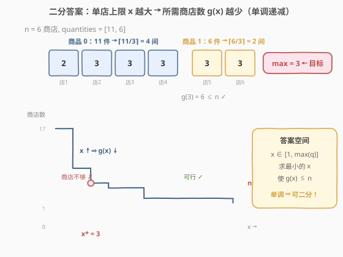
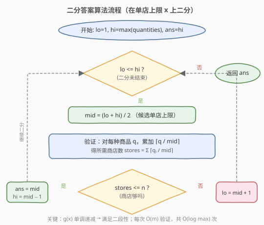

# 分配给商店的最多商品的最小值

- **题目名称**：分配给商店的最多商品的最小值
- **链接**：[2064. 分配给商店的最多商品的最小值](https://leetcode.cn/problems/minimized-maximum-of-products-distributed-to-any-store/)
- **难度**：中等
- **标签**：数组、二分查找

## 1. 题目概述

给定整数 `n` 表示零售商店数，整数数组 `quantities` 表示 `m` 种商品的件数（`quantities[i]` 为第 `i` 种商品的数目）。需将**所有商品**分配到 `n` 间商店，规则：

- 一间商店**至多**只能有一种商品，但件数任意。
- 最小化「所有商店中分配商品数目的最大值」`x`。

返回最小可能的 `x`。

**示例 1**：

```text
输入：n = 6, quantities = [11,6]
输出：3
解释：商品 0（11 件）→ 4 间商店 [2,3,3,3]；商品 1（6 件）→ 2 间商店 [3,3]。max = 3。
```

**示例 2**：

```text
输入：n = 7, quantities = [15,10,10]
输出：5
解释：三种商品各需 3、2、2 间商店，共 7 间，每间恰好 5 件。
```

**示例 3**：

```text
输入：n = 1, quantities = [100000]
输出：100000
解释：唯一商店装全部商品。
```

**约束条件**：

- `1 <= m <= n <= 10^5`
- `1 <= quantities[i] <= 10^5`

---

## 2. 解题思路

### 2.1 暴力思路

`x` 的取值范围是 `[1, max(quantities)]`：

- 下界 `1`：每间商店至少分 1 件。
- 上界 `max(quantities)`：每种商品全放一间商店，总需 `m ≤ n` 间，必然可行。

从 `x = 1` 开始逐个尝试：对每个 `x`，计算所需商店数 $g(x) = \sum_i \lceil \text{quantities}[i] / x \rceil$，第一个满足 $g(x) \le n$ 的 `x` 即答案。验证单个 `x` 是 $O(m)$，整体 $O(m \cdot \max)$，$\max$ 可达 $10^5$，必然超时。

### 2.2 核心观察：二分答案



关键直觉：**所需商店数 $g(x)$ 关于单店上限 $x$ 单调递减**。

- `x` 越大，每间商店装得越多，所需商店越少。
- `x = 1` 时最慢（每件商品独占一间，$g = \sum q_i$）；`x = max(quantities)` 时每种商品只需 1 间，$g = m \le n$，必然可行。

于是存在分界点 $x^*$：

```text
x < x* → g(x) > n   (商店不够)
x >= x* → g(x) <= n  (可行)
```

这正是二分查找所需的**二段性**。在 `[1, max(quantities)]` 上二分，每次 $O(m)$ 验证 `mid`，可行则去左半找更小，不可行则去右半加大。

> 💡 **识别信号**：求「最小化最大值」且能 $O(m)$ 验证候选值 → 二分答案。与 [875. 爱吃香蕉的珂珂](../0801-0900/875_爱吃香蕉的珂珂.md) 完全同骨架，`check()` 同为 $\sum \lceil q_i / x \rceil$ 向上取整求和。

> ⚠️ **下界取 1 而非 `max`**：与 [1011](../1001-1100/1011_在D天内送达包裹的能力.md)/[410](../0401-0500/410_分割数组的最大值.md) 不同，本题单种商品可拆分到多间商店，`x = 1` 是合法下界（每件独占一间）。上界取 `max(quantities)` 即可，此时每种商品仅需 1 间。

### 2.3 算法流程图



判定可行时**先记录 `ans = mid` 再收缩右界**（`hi = mid - 1`），保证最终保留最小可行值。

### 2.4 示例演算

![示例演算：n = 6, quantities = [11, 6]](../images/mmprod_example_walkthrough.svg)

以 `n = 6, quantities = [11, 6]` 为例，`max = 11`，答案区间 `[1, 11]`：

- **第 1 轮** `[1,11]`，`mid=6`，$g = \lceil 11/6 \rceil + \lceil 6/6 \rceil = 2+1 = 3 \le 6$ ✓ → 可行，记 `ans=6`，去左半 `[1,5]`。
- **第 2 轮** `[1,5]`，`mid=3`，$g = \lceil 11/3 \rceil + \lceil 6/3 \rceil = 4+2 = 6 \le 6$ ✓ → 可行，记 `ans=3`，去左半 `[1,2]`。
- **第 3 轮** `[1,2]`，`mid=1`，$g = 11+6 = 17 > 6$ ✗ → 商店不够，去右半 `[2,2]`。
- **第 4 轮** `[2,2]`，`mid=2`，$g = 6+3 = 9 > 6$ ✗ → `lo=3`。
- **结束** `lo=3 > hi=2`，返回 `ans=3`。

---

## 3. 参考代码

### C++

```cpp
class Solution {
  public:
    int minimizedMaximum(int n, vector<int>& quantities) {
        int lo = 1;
        int hi = *max_element(quantities.begin(), quantities.end());
        int ans = hi;

        while (lo <= hi) {
            int mid = lo + (hi - lo) / 2;
            if (canDistribute(quantities, mid, n)) {
                ans = mid;       // 可行，尝试更小上限
                hi = mid - 1;
            } else {
                lo = mid + 1;    // 商店不够，加大上限
            }
        }
        return ans;
    }

  private:
    // 验证：单店上限为 x 时，所需商店数是否 <= n
    bool canDistribute(const vector<int>& quantities, int x, int n) {
        long long stores = 0;
        for (int q : quantities) {
            stores += (q + x - 1) / x;   // ⌈q / x⌉ 向上取整
            if (stores > n) return false; // 提前剪枝，兼防溢出
        }
        return stores <= n;
    }
};
```

### Python

```python
class Solution:
    def minimizedMaximum(self, n: int, quantities: List[int]) -> int:
        lo, hi = 1, max(quantities)
        ans = hi

        while lo <= hi:
            mid = (lo + hi) // 2
            if self._can_distribute(quantities, mid, n):
                ans = mid       # 可行，尝试更小上限
                hi = mid - 1
            else:
                lo = mid + 1    # 商店不够，加大上限
        return ans

    def _can_distribute(self, quantities: List[int], x: int, n: int) -> bool:
        stores = 0
        for q in quantities:
            stores += (q + x - 1) // x   # ⌈q / x⌉ 向上取整
            if stores > n:
                return False             # 提前剪枝
        return stores <= n
```

> ⚠️ **三个易错点**：
> 1. **向上取整用整数运算**：$\lceil q/x \rceil$ 写成 `(q + x - 1) / x`，不要用浮点 `ceil((double)q / x)`——既有精度风险又慢。
> 2. **溢出**：`x = 1` 时 $g = \sum q_i$ 可达 $10^5 \times 10^5 = 10^{10}$，C++ `int` 溢出。用 `long long` 累加，或加提前剪枝 `if (stores > n) return false`。
> 3. **下界是 1 不是 `max(quantities)`**：本题商品可拆分到多间商店，与 1011/410「不可拆分」不同，下界为 1。

---

## 4. 复杂度分析

| 维度 | 复杂度 | 说明 |
|------|--------|------|
| 时间复杂度 | $O(m \log M)$ | $M = \max(\text{quantities})$；二分 $O(\log M)$ 次，每次验证 $O(m)$ |
| 空间复杂度 | $O(1)$ | 仅用常数额外变量 |

> 💡 $m \le 10^5$、$M \le 10^5$，$\log M \approx 17$，总运算量约 $1.7 \times 10^6$，远低于时限。

---

## 5. 扩展：check() 的正确性与取整实现

### 5.1 为什么 $\sum \lceil q_i / x \rceil$ 是最少商店数？

每种商品独立分配（「一店一品」约束使各商品间无共享）。对商品 $i$ 有 $q_i$ 件、每店至多 $x$ 件，最少需 $\lceil q_i / x \rceil$ 间——均分让每店尽量装满 $x$ 件，最后一间装余数。总商店数为各商品所需之和，无更优方案。

> 💡 对比 [1011](../1001-1100/1011_在D天内送达包裹的能力.md) 的 `check` 需贪心模拟装船（包裹有顺序约束），本题各商品独立无序，直接用数学公式求和即可，更简洁。

### 5.2 向上取整的整数实现

$\lceil a / b \rceil$（$a, b > 0$）推荐写法：

```cpp
(a + b - 1) / b    // 补余法：余数不为零时进位
```

**原理**：设 $a = k \cdot b + r$（$0 \le r < b$）。若 $r > 0$，则 $a + b - 1 = k \cdot b + r + b - 1 \ge k \cdot b + b = (k+1) \cdot b$，除以 $b$ 得 $k+1$；若 $r = 0$，则 $a + b - 1 = k \cdot b + b - 1 < (k+1) \cdot b$，除以 $b$ 得 $k$。恰好实现向上取整。

避免使用 `(int)ceil((double)a / b)`——浮点运算既有精度风险又慢。

### 5.3 更紧的下界

下界可从 `1` 收紧到 $\lceil \sum q_i \ / \ n \rceil$：`n` 间商店总容量为 $n \cdot x$，需容纳 $\sum q_i$ 件商品，故 $x \ge \lceil \sum q_i / n \rceil$。这是**必要条件**（不考虑「一店一品」约束），安全但非充分。

> 💡 更紧的下界只减少几次无效二分，不影响正确性。面试中写 `lo = 1` 已足够清晰，追求常数优化时再用紧下界。

---

## 6. 面试要点

1. **为什么能二分？二段性体现在哪？**

   - $g(x) = \sum \lceil q_i / x \rceil$ 随 $x$ 单调递减。存在分界点 $x^*$，使 $x < x^*$ 时 $g > n$（不可行）、$x \ge x^*$ 时 $g \le n$（可行）。这种「左不合法 / 右合法」的结构即二段性。

2. **上下界为什么是 1 和 `max(quantities)`？**

   - 下界 `1`：每间商店至少装 1 件，$x \ge 1$。与 1011/410 不同，本题商品可拆分，无需以 `max` 为下界。
   - 上界 `max(quantities)`：$x = \max$ 时每种商品恰好 1 间（$\lceil q_i / \max \rceil = 1$），总需 $m \le n$ 间，必然可行。

3. **`check()` 里为什么要用 `(q + x - 1) / x` 而非 `q / x`？**

   - 整数除法 `q / x` 向下取整，会少算商店。例如 $q=11, x=3$：`11/3=3`（少算 1 间），而 $\lceil 11/3 \rceil = 4$。用 `(q + x - 1) / x` 实现向上取整。

4. **为什么可能溢出？如何避免？**

   - $x = 1$ 时 $g = \sum q_i$，可达 $10^5 \times 10^5 = 10^{10}$，超出 `int` 范围（$\approx 2.1 \times 10^9$）。用 `long long` 累加，或加提前剪枝 `if (stores > n) return false`——一旦超过 `n` 即不可行，无需继续累加。

5. **和 [875. 爱吃香蕉的珂珂](../0801-0900/875_爱吃香蕉的珂珂.md) 有何异同？**

   - 完全同骨架：都是「最小化最大值」+ 二分答案 + $\sum \lceil q_i / x \rceil$ 验证。875 二分吃速 `k`，验证 $\sum \lceil \text{piles}[i] / k \rceil \le h$；本题二分单店上限 `x`，验证 $\sum \lceil q_i / x \rceil \le n$。仅变量名和语义不同。

---

## 7. 同类练习题

- [875. 爱吃香蕉的珂珂](https://leetcode.cn/problems/koko-eating-bananas/)：同模板，二分吃速，`check` 用向上取整求和，几乎与本题同构
- [1011. 在 D 天内送达包裹的能力](https://leetcode.cn/problems/capacity-to-ship-packages-within-d-days/)：同骨架，二分运载能力，`check` 贪心按天装货（注意下界为 `max`）
- [410. 分割数组的最大值](https://leetcode.cn/problems/split-array-largest-sum/)：二分「最大段和」上限，`check` 贪心划段
- [719. 找出第 K 小的数对距离](https://leetcode.cn/problems/find-k-th-smallest-pair-distance/)：二分距离上限，`check` 用双指针计数
- [1283. 使结果不超过阈值的最小除数](https://leetcode.cn/problems/find-the-smallest-divisor-given-a-threshold/)：同模板，二分除数，`check` 向上取整求和
