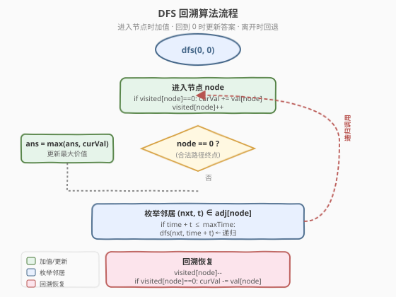
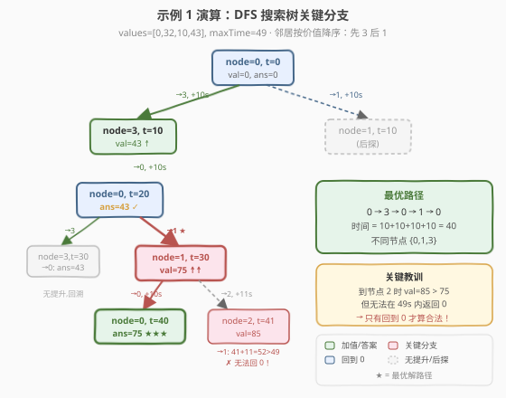

# 最大化一张图中的路径价值

- **题目名称**：最大化一张图中的路径价值
- **链接**：[2065. 最大化一张图中的路径价值](https://leetcode.cn/problems/maximum-path-quality-of-a-graph/)
- **难度**：困难
- **标签**：图、回溯、DFS、剪枝

## 1. 题目概述

给定一个 **无向图**，含 `n` 个节点（编号 `0` 到 `n-1`），每个节点 `i` 有价值 `values[i]`。边以 `edges[j] = [uj, vj, timej]` 表示，`timej` 是通过该边所需时间。一条**合法路径**从节点 `0` 出发、最终回到节点 `0`，且总时间不超过 `maxTime`。路径的**价值**定义为路径中**不同节点**的价值之和（每个节点至多算一次）。求合法路径的**最大价值**。

> ⚠️ **关键约束**：每个节点至多有 **4 条边**，`10 <= timej, maxTime <= 100`。这两个约束共同决定了搜索空间极小，是本题可用回溯的根本原因。

**示例 1**：

```text
输入：values = [0,32,10,43], edges = [[0,1,10],[1,2,15],[0,3,10]], maxTime = 49
输出：75
解释：路径 0 -> 1 -> 0 -> 3 -> 0，总时间 10+10+10+10=40 ≤ 49。
      访问的不同节点为 {0,1,3}，价值 = 0+32+43 = 75。
```

**示例 2**：

```text
输入：values = [5,10,15,20], edges = [[0,1,10],[1,2,10],[0,3,10]], maxTime = 30
输出：25
解释：路径 0 -> 3 -> 0，总时间 10+10=20 ≤ 30。
      访问的不同节点为 {0,3}，价值 = 5+20 = 25。
```

**示例 3**：

```text
输入：values = [1,2,3,4], edges = [[0,1,10],[1,2,11],[2,3,12],[1,3,13]], maxTime = 50
输出：7
解释：路径 0 -> 1 -> 3 -> 1 -> 0，总时间 10+13+13+10=46 ≤ 50。
      访问的不同节点为 {0,1,3}，价值 = 1+2+4 = 7。
```

**示例 4**：

```text
输入：values = [0,1,2], edges = [[1,2,10]], maxTime = 10
输出：0
解释：节点 0 无边相连，唯一合法路径为 [0]，价值 = 0。
```

**约束条件**：

- `1 <= n <= 1000`
- `0 <= values[i] <= 10^8`
- `0 <= edges.length <= 2000`
- `10 <= timej, maxTime <= 100`
- 每个节点至多有 **4 条边**
- 图可能不连通

---

## 2. 解题思路

### 2.1 暴力思路：枚举所有路径

最直白的做法是从节点 0 出发，DFS 枚举所有可能的路径（可重复经过节点和边），对每条回到 0 且时间不超过 `maxTime` 的路径，计算其不同节点价值之和，取最大。

问题在于路径数量似乎无界——节点可以反复访问，路径可以来回走。但实际上，**时间约束天然限制了路径长度**：

- 每条边至少耗时 10 秒，`maxTime <= 100`，因此一条合法路径**至多经过 10 条边**（`100 / 10 = 10`）。
- 每个节点至多 4 条边，即每个位置的分支数 $\le 4$。
- 总路径数上界 $= 4^{10} = 1{,}048{,}576 \approx 10^6$，完全可接受。

> 💡 **为什么能反复经过同一节点？** 题目允许访问节点任意次，但价值只算一次。反复经过某个节点可能是为了"借道"它到达另一个高价值节点——例如示例 3 中路径 `0→1→3→1→0` 两次经过节点 1。

### 2.2 核心观察：回溯 + 访问计数


关键直觉有三层：

**1. 时间约束 = 天然深度限制**：`maxTime ≤ 100` 且 `timej ≥ 10`，路径最多 10 步。不需要额外设深度上限，时间耗尽自然终止。

**2. 访问计数管价值**：用 `visited[node]` 记录每个节点在当前路径上的经过次数（而非布尔值）。当 `visited[node]` 从 `0→1`（首次到达）时累加价值，从 `1→0`（最后一次离开）时减去价值。这样无论节点被经过几次，价值只算一次。

**3. 回到 0 即更新答案**：每次 DFS 到达节点 0（不只是在叶子），都用当前累积价值更新全局最大值。因为路径随时可能在 0 结束并成为合法路径。

> ⚠️ **为什么用计数而非布尔？** 因为路径可能 `0→1→0→3→0`，节点 0 被访问 3 次。如果用布尔标记，第一次离开 0 时就清除了标记，回到 0 时会重复加价值。计数法保证：只在 `visited` 从 0 变 1 时加，从 1 变 0 时减，中间多次经过不影响。

### 2.3 算法流程图



流程核心是一个标准回溯模板，三步循环：

1. **到达节点 0 → 更新答案**：每次回到起点都是一条合法路径（时间已在上层保证 ≤ maxTime）。
2. **枚举邻居**：对当前节点的每条邻边，检查 `time + edge_time ≤ maxTime`，满足则递归。
3. **回溯恢复**：递归返回后，恢复 `visited` 计数与 `curVal`。

> 💡 **邻居排序优化**：按邻居节点价值降序排序，让高价值节点优先被探索。这不改变最坏复杂度，但能更早发现好解，为潜在的上界剪枝提供更紧的 `ans` 初值。

### 2.4 示例演算

以示例 1 为例逐步演算 `values = [0,32,10,43]`，`edges = [[0,1,10],[1,2,15],[0,3,10]]`，`maxTime = 49`：



**DFS 搜索树关键分支**（邻居按价值降序排列，节点 3 优先于节点 1）：

| 步骤 | 路径 | 当前节点 | 时间 | visited | curVal | 动作 |
|------|------|----------|------|---------|--------|------|
| 0 | [0] | 0 | 0 | {0:1} | 0 | 起点，ans=0 |
| 1 | [0,3] | 3 | 10 | {0:1,3:1} | 43 | 首次到 3，+43 |
| 2 | [0,3,0] | 0 | 20 | {0:2,3:1} | 43 | 回到 0，ans=43 |
| 3 | [0,3,0,3] | 3 | 30 | {0:2,3:2} | 43 | 再到 3，visited 已>0，不加值 |
| 4 | [0,3,0,3,0] | 0 | 40 | {0:3,3:2} | 43 | 回到 0，ans=43（无提升） |
| — | 回溯到步骤 2 | 0 | 20 | {0:2,3:1} | 43 | 尝试另一邻居 1 |
| 5 | [0,3,0,1] | 1 | 30 | {0:2,3:1,1:1} | 75 | 首次到 1，+32 |
| 6 | [0,3,0,1,0] | 0 | 40 | {0:3,3:1,1:1} | 75 | 回到 0，**ans=75** |
| 7 | [0,3,0,1,2] | 2 | 45 | {0:2,3:1,1:1,2:1} | 85 | 首次到 2，+10 |
| — | 2 的邻居 1 时间 45+15=60>49 | — | — | — | — | 超时，回溯 |

最终答案 **75**。路径 `0→3→0→1→0` 总时间 40 ≤ 49，访问不同节点 {0,1,3}，价值 0+43+32=75。

> 💡 注意步骤 7 中虽然 `curVal` 达到了 85（含节点 2 的价值 10），但节点 2 无法在时间限制内返回 0（45+15=60 > 49），所以这条分支不会更新 `ans`。只有回到 0 的路径才合法。

---

## 3. 参考代码

### C++（DFS 回溯 + 访问计数）

```cpp
class Solution {
  public:
    int maximalPathQuality(vector<int>& values, vector<vector<int>>& edges, int maxTime) {
        int n = values.size();
        vector<vector<pair<int, int>>> adj(n);
        for (auto& e : edges) {
            int u = e[0], v = e[1], t = e[2];
            adj[u].push_back({v, t});
            adj[v].push_back({u, t});
        }
        for (int i = 0; i < n; i++) {
            sort(adj[i].begin(), adj[i].end(),
                 [&](const auto& a, const auto& b) {
                     return values[a.first] > values[b.first];
                 });
        }

        vector<int> visited(n, 0);
        int ans = 0;
        int curVal = 0;

        function<void(int, int)> dfs = [&](int node, int time) {
            if (visited[node] == 0) {
                curVal += values[node];
            }
            visited[node]++;

            if (node == 0) {
                ans = max(ans, curVal);
            }

            for (auto& [nxt, t] : adj[node]) {
                if (time + t <= maxTime) {
                    dfs(nxt, time + t);
                }
            }

            visited[node]--;
            if (visited[node] == 0) {
                curVal -= values[node];
            }
        };

        dfs(0, 0);
        return ans;
    }
};
```

### Python

```python
class Solution:
    def maximalPathQuality(self, values: List[int], edges: List[List[int]], maxTime: int) -> int:
        n = len(values)
        adj = [[] for _ in range(n)]
        for u, v, t in edges:
            adj[u].append((v, t))
            adj[v].append((u, t))
        for i in range(n):
            adj[i].sort(key=lambda x: -values[x[0]])

        visited = [0] * n
        self.ans = 0
        cur_val = 0

        def dfs(node: int, time: int):
            nonlocal cur_val
            if visited[node] == 0:
                cur_val += values[node]
            visited[node] += 1

            if node == 0:
                self.ans = max(self.ans, cur_val)

            for nxt, t in adj[node]:
                if time + t <= maxTime:
                    dfs(nxt, time + t)

            visited[node] -= 1
            if visited[node] == 0:
                cur_val -= values[node]

        dfs(0, 0)
        return self.ans
```

> 💡 **代码结构说明**：价值增减放在函数**开头和结尾**（而非调用前后），这样进入任意节点时自动累加、离开时自动回退，逻辑更内聚。`visited` 从 0 变 1 时加值、从 1 变 0 时减值，中间多次经过不触发加减。

---

## 4. 复杂度分析

| 维度 | 复杂度 | 说明 |
|------|--------|------|
| 时间复杂度 | $O(4^{\lfloor \text{maxTime}/10 \rfloor})$ | 最坏每步 4 个分支、最多 $\lfloor \text{maxTime}/10 \rfloor \le 10$ 步，约 $4^{10} \approx 10^6$ |
| 空间复杂度 | $O(n + \text{maxTime}/10)$ | `visited` 数组 $O(n)$ + DFS 递归栈深度 $O(\text{maxTime}/10)$ |

> ⚠️ **复杂度不依赖 $n$（节点数）**：虽然 $n$ 可达 1000，但搜索深度受 `maxTime` 限制，实际访问的节点数远小于 $n$。建图 $O(n + E)$ 是预处理，不影响搜索本身。

> 💡 **与朴素回溯对比**：如果不利用"每节点至多 4 边 + 时间下界 10"这两个约束，会误以为路径数无界。关键在于意识到时间约束 $\Rightarrow$ 深度 $\le 10$，把"看似指数爆炸"的问题收敛到 $10^6$ 量级。

---

## 5. 扩展：上界剪枝与状态记忆

### 5.1 上界剪枝（可选优化）

在当前状态 `(node, time, curVal)` 下，理论最大可达价值为 `curVal + unvisitedSum`（所有未访问节点价值之和）。若该值 $\le$ `ans`，可直接剪枝。

```cpp
int totalSum = accumulate(values.begin(), values.end(), 0);
// 在 dfs 内部：
if (curVal + (totalSum - curVal) <= ans) return; // 等价于 totalSum <= ans
```

但由于 `curVal + unvisitedSum = totalSum`（恒等），该上界为常数 `totalSum`，**仅在 `ans` 已达 `totalSum` 时才触发剪枝**（即已找到全局最优）。实际效果有限，本题朴素 DFS 已足够高效。

### 5.2 为何不能用状压 DP？

经典的 TSP 状压 DP 需要 $O(2^n \cdot n^2)$ 空间。本题 $n \le 1000$，$2^{1000}$ 远超内存限制。正是因为**时间约束把搜索深度限制在 10 以内**，才使得回溯比状压 DP 更适用——回溯的复杂度取决于路径长度而非节点总数。

> 💡 **问题结构对比**：TSP（旅行商问题）要求访问所有节点恰好一次，路径长度 $= n$，必须用状压 DP。本题只要求"在时间内回到 0"，路径长度受时间约束 $\le 10$，回溯更自然。

---

## 6. 面试要点

1. **为什么本题可以用回溯而非必须用 DP？**

   - 回溯的复杂度取决于搜索树规模 $= \text{分支数}^{\text{深度}}$。本题分支数 $\le 4$（每节点至多 4 边），深度 $\le 10$（`maxTime/time_min = 100/10`），总状态 $\le 4^{10} \approx 10^6$。而状压 DP 需要 $O(2^n)$，$n=1000$ 不可行。**时间约束是把双刃剑**——它限制了合法路径数，使回溯可行。

2. **为什么用访问计数而非布尔标记？**

   - 路径可能多次经过同一节点（如 `0→1→0→1→0`）。布尔标记在第一次离开时就清除，会导致回到该节点时重复加价值。计数法精确追踪"当前路径上经过几次"，只在 `0→1` 时加值、`1→0` 时减值，保证价值计算正确。

3. **每次到达节点 0 都更新答案，会不会重复？**

   - 会多次更新，但 `max` 操作保证结果正确。同一条 DFS 路径可能多次经过 0（如 `0→1→0→3→0`），每次经过 0 时 `curVal` 可能不同（因为中间访问了新节点），每次都取 `max` 是正确的——任何在 0 处的快照都对应一条合法路径。

4. **如果去掉"每节点至多 4 边"的约束会怎样？**

   - 分支数可能很大（最坏 $n-1$），$n^{10}$ 在 $n=1000$ 时约 $10^{30}$，回溯不再可行。此时需要更强的剪枝（如基于剩余时间的可达性分析）或换思路（如分层图 DP）。这个约束是题目为回溯留的"后门"。

5. **邻居按价值降序排序有什么作用？**

   - 贪心直觉：优先探索高价值节点，更早发现好解，使 `ans` 尽快增大。虽然不改变最坏复杂度，但在实际搜索中能更早触发剪枝（如果有的话），减少无效分支。属于"启发式排序"的常见技巧。

---

## 7. 同类练习题

- [79. 单词搜索](https://leetcode.cn/problems/word-search/)：DFS 回溯 + 访问标记防重复，同样是"有限深度 + 回溯恢复"模板，但用布尔标记（每个格子只能走一次）
- [473. 火柴拼正方形](https://leetcode.cn/problems/matchsticks-to-square/)：回溯 + 剪枝，利用"每边长度相等"约束限制搜索深度，与本题"时间约束限制深度"异曲同工
- [332. 重新安排行程](https://leetcode.cn/problems/reconstruct-itinerary/)：图上 DFS 回溯找欧拉路径，同样涉及边/节点的访问计数与回退
- [980. 不同路径 III](https://leetcode.cn/problems/unique-paths-iii/)：网格图上 DFS 回溯，每个格子只能走一次，对比本题"可重复走但价值只算一次"的差异
- [1219. 黄金矿工](https://leetcode.cn/problems/path-with-maximum-gold/)：网格回溯求最大收益，每格只能采一次（布尔标记），是本题"不可重复"的简化对照版
