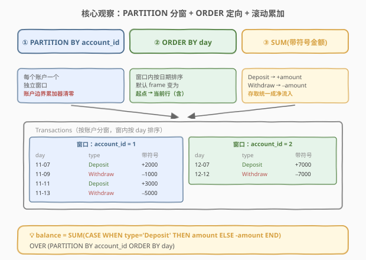
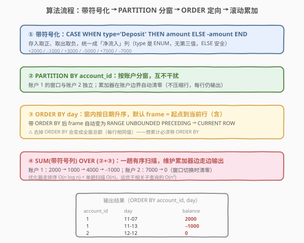
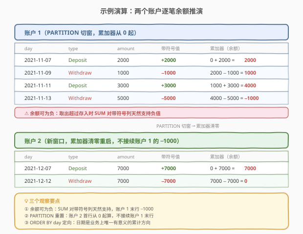

# LeetCode 账户余额 题解

> ⚠️ **注意**：本题是 LeetCode 数据库（SQL）类题目，在 leetcode.cn 上为 **Plus 会员专享题**，[leetcode.com](https://leetcode.com/problems/account-balance/) 可免费练习。本文代码部分使用 SQL（及 pandas 对照）而非 C++/Python。

## 1. 题目概述

- **标题 / 题号**：账户余额（#2066，medium）
- **链接**：https://leetcode.cn/problems/account-balance/
- **难度**：中等
- **标签**：SQL、数据库、窗口函数、`SUM() OVER`、`PARTITION BY`、累计求和、`CASE WHEN`、自连接

**题意**：给定 `Transactions` 表，记录每个银行账户每日的存取款交易。每行一笔交易，`type` 为 `'Deposit'`（存入）或 `'Withdraw'`（取出），`amount` 为金额。编写 SQL 查询，报告**每个账户在每笔交易后的余额**——即该账户截至当日（含当日）所有存入金额减去所有取出金额的**累计和**。结果按 `account_id` 升序、`day` 升序返回。

**表结构**：

```text
表: Transactions
+-------------+------+
| Column Name | Type |
+-------------+------+
| account_id  | int  |   ← 账户 id
| day         | date |   ← 交易日期
| type        | ENUM |   ← 取值 'Deposit' / 'Withdraw'
| amount      | int  |   ← 存入或取出的金额
+-------------+------+
(account_id, day) 是该表的主键（每个账户每天至多一笔交易）。
type 是 ENUM('Deposit','Withdraw')。
```

> 💡 **审题关键**：① 输出**保留原表每一行**（每笔交易一行），只是多一列 `balance`，不是聚合压缩；② 余额是**逐账户的累计和**——「逐账户」意味着按 `account_id` 分组互不干扰，「累计」意味着截至当前行（含）的滚动求和；③ `(account_id, day)` 是主键，故**每个账户内 `day` 唯一**，不存在「同一天多笔需合算」的歧义，按 `day` 排序即可确定累计方向。

**示例 1**：

```text
输入：
Transactions 表:
+------------+------------+----------+--------+
| account_id | day        | type     | amount |
+------------+------------+----------+--------+
| 1          | 2021-11-07 | Deposit  | 2000   |
| 1          | 2021-11-09 | Withdraw | 1000   |
| 1          | 2021-11-11 | Deposit  | 3000   |
| 1          | 2021-11-13 | Withdraw | 5000   |
| 2          | 2021-12-07 | Deposit  | 7000   |
| 2          | 2021-12-12 | Withdraw | 7000   |
+------------+------------+----------+--------+

输出:
+------------+------------+---------+
| account_id | day        | balance |
+------------+------------+---------+
| 1          | 2021-11-07 | 2000    |
| 1          | 2021-11-09 | 1000    |
| 1          | 2021-11-11 | 4000    |
| 1          | 2021-11-13 | -1000   |
| 2          | 2021-12-07 | 7000    |
| 2          | 2021-12-12 | 0       |
+------------+------------+---------+
```

**解释**：

| 账户 | 交易序列 | 逐笔余额推演 |
|------|----------|--------------|
| 1 | +2000, −1000, +3000, −5000 | 2000 → 1000 → 4000 → **−1000** |
| 2 | +7000, −7000 | 7000 → **0** |

> 💡 本题是 SQL **「分组累计求和」招牌母题**——核心是**窗口函数**（window function）：`SUM(带符号金额) OVER (PARTITION BY account_id ORDER BY day)` 一行表达式同时完成「按账户分组」「按日期排序」「截至当前行累计」三件事。它是对标 [1204. 最后一个能进入巴士的人](https://leetcode.cn/problems/last-person-to-fit-in-the-bus/)、[1174. 即时食物配送 II](../1101-1200/1174_即时食物配送II.md) 的窗口函数家族的入门基座，也是「逐行滚动指标」类需求（账户余额、库存流水、签到累计天数）的 SQL 范式。

## 2. 解题思路

### 2.1 暴力思路：相关子查询逐行累加

最直觉的过程式思路：对 `Transactions` 的每一行 `(a, d)`，另开一个子查询把**同账户且日期 $\le d$** 的所有行捞出来，把 `Deposit` 加、`Withdraw` 减，求和作为该行余额：

```text
for each row (a, d, type, amount) in Transactions:
    balance = SUM( sign(type) * amount )
             over { rows in Transactions where account_id = a and day <= d }
    output (a, d, balance)
```

对应 SQL 即**相关子查询**（解法 B）。它能做对，但每行都触发一次对同账户历史数据的扫描：

- **正确性**：显然正确——余额定义为「截至当日（含）的累计净流入」，子查询恰好覆盖 `day <= d` 的同账户行。
- **效率**：对 $n$ 行中的每一行，子查询扫描该账户的历史行（最坏 $O(n)$），总计 $O(n^2)$。本题数据量小可过，但生产环境百万级流水会爆。

> ⚠️ 瓶颈在于「累计」被重复计算了 $n$ 次——每行都从该账户起点重新累加一遍。突破口是把「逐行重新求和」换成**一次性滚动求和**：窗口函数让数据库引擎在**一趟有序扫描**内维护一个累加器，边走边吐出当前累计值，从 $O(n^2)$ 降到 $O(n \log n)$（排序代价）。

### 2.2 核心观察：窗口函数一次性滚动求和



窗口函数 `SUM() OVER (PARTITION BY ... ORDER BY ...)` 把暴力里三步重复操作压成一行表达式：

**第 1 维：`PARTITION BY account_id`——按账户分窗。**

每个账户是一个独立窗口，账户之间的累计互不干扰。账户 1 的余额绝不会把账户 2 的存取算进去。等价于「先把表按 `account_id` 切成若干子表，每个子表单独算累计」。

$$\text{窗口} = \bigsqcup_{a} \text{Transactions}\big|_{\text{account\_id}=a}$$

**第 2 维：`ORDER BY day`——窗口内按日期排序。**

排序确定了「累计方向」——从最早到最晚。`ORDER BY` 一旦出现，窗口的默认边界（frame）就自动变成 `RANGE BETWEEN UNBOUNDED PRECEDING AND CURRENT ROW`，即「从窗口起点到当前行（含）」。这正是「截至当日累计」的语义。

**第 3 维：`SUM(带符号金额)`——把存取统一成带符号数再累计。**

`Deposit` 是加、`Withdraw` 是减，用 `CASE WHEN type='Deposit' THEN amount ELSE -amount END` 把每行映射成「净流入」（存入正、取出负），`SUM` 对这个带符号列做累计即可。于是第 $k$ 行的余额：

$$\text{balance}_k = \sum_{i \le k} \text{sign}(\text{type}_i) \cdot \text{amount}_i$$

合并三步：

$$\boxed{\text{balance} = \text{SUM}\big(\text{CASE WHEN type='Deposit' THEN amount ELSE -amount END}\big) \;\text{OVER}\; (\text{PARTITION BY account\_id ORDER BY day})}$$

> 💡 **为什么窗口函数是「一次性」的？** 优化器对带 `ORDER BY` 的窗口函数走**排序 + 单趟扫描**：先按 `(account_id, day)` 排序，再维护一个按账户重置的累加器，遇到新账户清零、遇到同行累加并输出。排序 $O(n \log n)$、扫描 $O(n)$，远优于相关子查询的 $O(n^2)$。窗口函数的精髓正是把「逐行相关计算」转化为「一趟有序滚动计算」。

> ⚠️ **最常见的两种错解**：① 忘了 `ORDER BY day`，只剩 `SUM(...) OVER (PARTITION BY account_id)`——此时窗口默认边界是整窗（`UNBOUNDED PRECEDING TO UNBOUNDED FOLLOWING`），每行都会得到该账户**全部**净流入总额（同一账户所有行余额相同），不是「截至当日」的累计。② 忘了 `PARTITION BY account_id`，所有账户混在一个窗口里累计——账户 2 的首行会从账户 1 的末行余额接着算，串户。

### 2.3 算法流程图



**逻辑执行步骤**：

| 步骤 | 表达式 | 作用 |
|------|--------|------|
| ① 带符号化 | `CASE WHEN type='Deposit' THEN amount ELSE -amount END` | 存入取正、取出取负，统一成「净流入」列 |
| ② 分窗 | `PARTITION BY account_id` | 每个账户一个独立窗口，互不干扰 |
| ③ 定向 | `ORDER BY day` | 窗口内按日期从早到晚排序；默认 frame 变为「起点到当前行」 |
| ④ 滚动累加 | `SUM(带符号列) OVER (②+③)` | 每行输出截至当日的累计净流入 = 余额 |
| ⑤ 排序输出 | `ORDER BY account_id, day` | 满足题目要求的输出顺序 |

> 💡 **窗口函数的逻辑求值阶段**：窗口函数在 `SELECT` 阶段求值，位于 `WHERE`/`GROUP BY`/`HAVING` **之后**、`ORDER BY`（最终输出排序）**之前**。本题无需 `WHERE`/`GROUP BY`——既不过滤行也不压缩行，原表每行都保留并多算一列 `balance`。最后的 `ORDER BY account_id, day` 只决定输出呈现顺序，不影响 `balance` 的值（窗口函数内部的 `ORDER BY day` 才决定累计方向）。

> ⚠️ **两个 `ORDER BY` 别混淆**：窗口内的 `ORDER BY day` 决定**累计方向**（语义层）；最外层 `ORDER BY account_id, day` 决定**输出顺序**（呈现层）。即使把外层排序删掉，`balance` 的值仍正确，只是行序乱。面试时常被追问「窗口里的 `ORDER BY` 和最后的 `ORDER BY` 有何区别」，要点就是这个。

### 2.4 示例演算

以官方示例数据走一遍两个账户的滚动累加：



**账户 1**（按 `day` 升序，累加器从 0 起，遇新账户重置）：

| day | type | amount | 带符号值 | 累加器（余额） |
|-----|------|--------|----------|----------------|
| 2021-11-07 | Deposit | 2000 | +2000 | 0 + 2000 = **2000** |
| 2021-11-09 | Withdraw | 1000 | −1000 | 2000 − 1000 = **1000** |
| 2021-11-11 | Deposit | 3000 | +3000 | 1000 + 3000 = **4000** |
| 2021-11-13 | Withdraw | 5000 | −5000 | 4000 − 5000 = **−1000** |

**账户 2**（`PARTITION` 切窗时累加器清零重启）：

| day | type | amount | 带符号值 | 累加器（余额） |
|-----|------|--------|----------|----------------|
| 2021-12-07 | Deposit | 7000 | +7000 | 0 + 7000 = **7000** |
| 2021-12-12 | Withdraw | 7000 | −7000 | 7000 − 7000 = **0** |

> 💡 **三个观察要点**：① **余额可为负**——账户 1 末行 `−1000` 说明取出超过存入，`SUM` 对带符号列天然支持负值，无需额外处理；② **`PARTITION` 的重置语义**——账户 2 的首行从 `0` 起算而非从账户 1 末行 `−1000` 接续，正是 `PARTITION BY account_id` 把累加器在账户边界清零的效果；③ **`ORDER BY day` 决定累计方向**——若误按 `amount` 排序，累计就不再是「时间上的余额」而是「按金额排序的累计」，语义全错。日期是业务上唯一有意义的累计方向。

## 3. 参考代码

### SQL（解法 A：`SUM() OVER` 窗口函数，推荐）

```sql
SELECT account_id,
       day,
       SUM(CASE WHEN type = 'Deposit' THEN amount ELSE -amount END)
           OVER (PARTITION BY account_id ORDER BY day) AS balance
FROM Transactions
ORDER BY account_id, day;
```

> 💡 **写法要点**：
> - `CASE WHEN type='Deposit' THEN amount ELSE -amount END` 把存入取正、取出取负，统一成「净流入」列。`type` 是 `ENUM('Deposit','Withdraw')`，无第三种取值，`ELSE` 分支只命中 `Withdraw`，安全。
> - `PARTITION BY account_id`：每个账户一个独立窗口，累加器在账户边界自动清零。
> - `ORDER BY day`：窗口内按日期升序，默认 frame 为 `RANGE BETWEEN UNBOUNDED PRECEDING AND CURRENT ROW`，即「从窗口起点到当前行（含）」——正是「截至当日累计」。
> - 外层 `ORDER BY account_id, day` 仅决定输出呈现顺序，不影响 `balance` 取值。
> - ✓ 代码最简洁，一行窗口表达式同时表达「分组 + 排序 + 累计」三件事，可读性最佳，面试首推。需 MySQL 8.0+ / PostgreSQL / SQL Server / Oracle（均支持窗口函数）。

### SQL（解法 B：相关子查询，兼容旧版 MySQL）

```sql
SELECT t1.account_id,
       t1.day,
       (SELECT SUM(CASE WHEN t2.type = 'Deposit' THEN t2.amount ELSE -t2.amount END)
        FROM Transactions t2
        WHERE t2.account_id = t1.account_id
          AND t2.day <= t1.day) AS balance
FROM Transactions t1
ORDER BY account_id, day;
```

> 💡 **写法要点**：
> - 对每行 `t1`，子查询把同账户且 `day <= t1.day` 的所有行（含自身）做带符号求和，即该行余额。
> - `t2.day <= t1.day` 中的 `<=` 必须含等号——当日交易本身要计入累计；写成 `<` 会漏掉当天那笔。
> - 子查询用了 `t1.account_id = t2.account_id` 实现「同账户」约束，等价于窗口函数的 `PARTITION BY`；`t2.day <= t1.day` 等价于窗口函数 `ORDER BY day` 的默认 frame。
> - ⚠️ **性能差**：每行触发一次子查询扫描，最坏 $O(n^2)$；窗口函数版走排序 + 单趟扫描 $O(n \log n)$。本题数据量小可过，生产环境不推荐。仅在目标数据库不支持窗口函数（如 MySQL 5.7 及更早）时作为兜底方案。
> - 此写法在 MySQL 5.7 上可运行，是无窗口函数环境下的经典写法。

### SQL（解法 C：自连接 + GROUP BY，等价于窗口函数的「展开版」）

```sql
SELECT t1.account_id,
       t1.day,
       SUM(CASE WHEN t2.type = 'Deposit' THEN t2.amount ELSE -t2.amount END) AS balance
FROM Transactions t1
JOIN Transactions t2
    ON t2.account_id = t1.account_id
   AND t2.day <= t1.day
GROUP BY t1.account_id, t1.day
ORDER BY account_id, day;
```

> 💡 **写法要点**：
> - **自连接**：把表与自身按「同账户且 `t2.day <= t1.day`」连接。`t1` 的每一行会匹配上同账户中所有日期不超过它（含自身）的行——这正是「截至当日的历史行集合」。
> - `GROUP BY t1.account_id, t1.day`：对 `t1` 的每一行（`(account_id, day)` 是主键，唯一）分一组，组内对 `t2` 的带符号金额 `SUM`，即累计净流入。
> - 连接条件 `t2.day <= t1.day` 与解法 B 的子查询 `WHERE` 完全等价，只是把「相关子查询」改写为「自连接 + 分组聚合」——两者执行计划经优化器改写后通常同构。
> - ⚠️ **性能同样为 $O(n^2)$**：自连接产生的中间行数是 $\sum_a \frac{k_a(k_a+1)}{2}$（$k_a$ 为账户 $a$ 的行数），最坏 $O(n^2)$。仅在无窗口函数时与解法 B 二选一。
> - 此写法的优势是**纯标准 SQL、无相关子查询**，老旧数据库（甚至 SQLite 早期版本）都能跑；劣势是中间结果膨胀，账户交易密集时性能最差。

### Python（pandas）

```python
import pandas as pd

def account_balance(transactions: pd.DataFrame) -> pd.DataFrame:
    signed = transactions.assign(
        signed_amount=transactions.apply(
            lambda r: r['amount'] if r['type'] == 'Deposit' else -r['amount'], axis=1
        )
    )
    signed = signed.sort_values(['account_id', 'day'])
    signed['balance'] = signed.groupby('account_id')['signed_amount'].cumsum()
    return signed[['account_id', 'day', 'balance']].sort_values(['account_id', 'day'])
```

> 💡 **pandas 对照**：
> - `.assign(signed_amount=...)` 等价于 `CASE WHEN type='Deposit' THEN amount ELSE -amount END`——把存取统一成带符号净流入。也可写 `np.where(t['type']=='Deposit', t['amount'], -t['amount'])` 更向量化。
> - `.sort_values(['account_id','day'])` 等价于窗口函数的 `PARTITION BY account_id ORDER BY day`——pandas 的 `groupby().cumsum()` 不接受 `order_by` 参数，必须先排序再累计。
> - `.groupby('account_id')['signed_amount'].cumsum()` 等价于 `SUM(带符号列) OVER (PARTITION BY account_id ORDER BY day)`——`groupby` 实现 `PARTITION`（每个账户独立累加），`cumsum` 实现「截至当前行」的累计。
> - ⚠️ **pandas 与 SQL 的关键差异**：SQL 的窗口函数在**单条语句**内同时完成排序与累计，不改变原表行顺序；pandas 需**显式 `sort_values`** 再 `cumsum`，最后再 `sort_values` 还原题目要求的输出顺序。两者思路同源（带符号化 → 分组 → 累计），但 pandas 是「先排序再累计」的命令式两步，SQL 是「声明式一步」。

## 4. 复杂度分析

| 维度 | 解法 A（窗口函数） | 解法 B（相关子查询） | 解法 C（自连接+GROUP BY） |
|------|---------------------|----------------------|---------------------------|
| **时间** | $O(n \log n)$ | $O(n^2)$ | $O(n^2)$ |
| **空间** | $O(n)$（排序缓冲） | $O(1)$ 额外 | $O(n^2)$（中间连接结果） |
| **中间行数** | 原表 $n$ 行 | 原表 $n$ 行 | $\sum_a \frac{k_a(k_a+1)}{2}$（最坏 $O(n^2)$） |
| **代码量** | ★★★ 最简洁 | ★★ 中等 | ★ 最多 |
| **兼容性** | MySQL 8.0+ / PG / MSSQL / Oracle | 全部（含 MySQL 5.7） | 全部（标准 SQL） |

> - $n$ = `Transactions` 行数，$k_a$ = 账户 $a$ 的交易笔数，$\sum_a k_a = n$。
> - **解法 A 时间复杂度**：窗口函数需按 `(account_id, day)` 排序，$O(n \log n)$；随后单趟扫描维护按账户重置的累加器，$O(n)$。总计 $O(n \log n)$，由排序主导。若 `(account_id, day)` 已建索引（主键天然有序），排序可省，降至 $O(n)$。
> - **解法 B/C 时间复杂度**：每行（解法 B）或每个连接对（解法 C）都要扫描同账户历史，最坏每账户 $k_a$ 行全集中在同一账户时为 $O(n^2)$。本题数据量小（示例仅 6 行）无感知，生产环境百万流水会严重退化。
> - **空间复杂度**：解法 A 的排序需 $O(n)$ 缓冲；解法 C 的自连接中间结果最坏 $O(n^2)$；解法 B 不物化中间结果，额外空间 $O(1)$（但每行子查询重复扫描）。

> ⚠️ **性能拐点**：账户交易笔数 $k_a$ 越大，解法 B/C 的 $O(k_a^2)$ 退化越明显。经验上 $n > 10^4$ 时窗口函数版优势显著。面试中说明「窗口函数走排序 + 单趟扫描 $O(n \log n)$，主键有序可降到 $O(n)$；相关子查询/自连接为 $O(n^2)$，仅作兼容旧库兜底」即可。给 `(account_id, day)` 建复合索引可同时加速排序与子查询的范围扫。

## 5. 扩展：窗口帧（Frame）与累计方向

### 5.1 `RANGE` vs `ROWS`：默认 frame 的细节

`SUM(...) OVER (PARTITION BY account_id ORDER BY day)` 省略了 `ROWS/RANGE BETWEEN ... AND ...` 子句，此时带 `ORDER BY` 的窗口默认 frame 为：

```
RANGE BETWEEN UNBOUNDED PRECEDING AND CURRENT ROW
```

即「从窗口起点到当前行（含）」。`RANGE` 是**按值范围**界定边界——「当前行」会包含所有 `day` 值等于当前行 `day` 的行。本题 `(account_id, day)` 是主键，**同账户内 `day` 唯一**，不存在并列，`RANGE` 与 `ROWS` 完全等价。

但若题目放宽为「同一天可多笔交易」（主键变成 `(account_id, day, tx_id)`），`RANGE` 会把**同一天的所有行**一起算进累计（同日多笔视为一批，每笔的余额都是「同日全部累计」），而 `ROWS BETWEEN UNBOUNDED PRECEDING AND CURRENT ROW` 会**逐行**累加（同日多笔按物理顺序各自累加）。两者的语义差异：

| frame 写法 | 同日多笔行为 | 适用语义 |
|-------------|--------------|----------|
| `RANGE ... CURRENT ROW`（默认） | 同日合并，每笔余额相同（含同日全部） | 「日级余额」——同日多笔视为一日终值 |
| `ROWS ... CURRENT ROW` | 逐笔累加，同日各笔余额递增 | 「笔级余额」——同日按交易先后顺序累加 |

> 💡 本题主键保证 `day` 唯一，无需纠结。但面试常被追问「同日多笔怎么办」——回答要点是：业务若要「日级余额」用默认 `RANGE`，若要「笔级余额」需显式 `ROWS BETWEEN UNBOUNDED PRECEDING AND CURRENT ROW` 并在 `ORDER BY day, tx_id` 中加入决定同日先后的列（如自增 `tx_id`）。

### 5.2 累计求和的三个变体

调整 frame 即可得到不同的累计语义，是窗口函数家族的核心玩法：

| 变体 | frame 写法 | 语义 | 典型场景 |
|------|------------|------|----------|
| **前缀累计**（截至当前行） | `ROWS BETWEEN UNBOUNDED PRECEDING AND CURRENT ROW` | 起点 → 当前行 | 账户余额、签到累计天数（本题） |
| **滑动窗口**（最近 $k$ 行） | `ROWS BETWEEN k-1 PRECEDING AND CURRENT ROW` | 最近 $k$ 行 | 7 日移动平均、最近 5 笔均值 |
| **全窗汇总**（不分先后） | `ROWS BETWEEN UNBOUNDED PRECEDING AND UNBOUNDED FOLLOWING` | 整个窗口 | 每行附上该组总额、占比计算 |

```sql
-- 前 3 笔的滑动余额均值（示例，非本题要求）
SELECT account_id, day,
       AVG(CASE WHEN type='Deposit' THEN amount ELSE -amount END)
           OVER (PARTITION BY account_id ORDER BY day
                 ROWS BETWEEN 2 PRECEDING AND CURRENT ROW) AS avg_3
FROM Transactions;
```

> 💡 掌握「前缀累计」就解了本题；掌握「滑动窗口」就能算移动平均（[1853. 划分产品类别后的销售总额](https://leetcode.cn/problems/divide-products-into-three-baskets/) 的滑动版）；掌握「全窗汇总」就能算每行占组内比例（[1070. 产品销售分析 III](https://leetcode.cn/problems/product-sales-analysis-iii/) 类）。三者只是 frame 不同，窗口函数骨架一致。

### 5.3 从「累计求和」到「累计计数 / 排名」

`SUM` 能做累计求和，把聚合函数换成 `COUNT`/`ROW_NUMBER`/`RANK` 即得累计计数与排名家族：

| 窗口函数 | 累计语义 | 对应题目 |
|----------|----------|----------|
| `SUM(带符号列) OVER (P ORDER BY d)` | 截至当前行的累计净流入 | 本题（账户余额） |
| `COUNT(*) OVER (P ORDER BY d)` | 截至当前行的累计笔数 | 累计签到次数 |
| `ROW_NUMBER() OVER (P ORDER BY d)` | 窗口内按 d 的序号（1,2,3,…） | 取每组前 $k$ 行 |
| `RANK()/DENSE_RANK() OVER (P ORDER BY x)` | 窗口内按 x 的排名 | [178. 分数排名](https://leetcode.cn/problems/rank-scores/) |

> 💡 本题是窗口函数家族最朴素的「累计求和」入口。`ROW_NUMBER`/`RANK` 是「累计排名」变体，`LAG`/`LEAD` 是「相对偏移」变体，它们共享同一套 `OVER (PARTITION BY ... ORDER BY ...)` 骨架，只是换一个窗口函数名。掌握本题后，可平滑迁移到整个窗口函数家族。

## 6. 面试要点

**Q1：为什么必须带 `ORDER BY day`？去掉会怎样？**

> `SUM(...) OVER (PARTITION BY account_id)`（无 `ORDER BY`）的默认 frame 是**整个窗口**（`UNBOUNDED PRECEDING TO UNBOUNDED FOLLOWING`），于是该账户**每一行**都得到相同的「全账户净流入总额」，而非「截至当日的累计」。`ORDER BY day` 把 frame 收窄为「起点到当前行」，才出现「逐行递增」的累计效果。口诀：**`PARTITION` 决定分组、`ORDER BY` 决定累计方向与 frame**——想累计就必须带 `ORDER BY`。

**Q2：`PARTITION BY account_id` 起什么作用？**

> 把表按 `account_id` 切成若干独立窗口，每个账户的累加器在窗口边界**自动清零**。账户 2 的首行从 0 起算而非接续账户 1 的末行余额。没有 `PARTITION BY` 的话，所有账户混在一个窗口里累计，账户 2 首行会从账户 1 末行接着算，串户。`PARTITION BY` 就是 SQL 窗口函数版的「分组」，但与 `GROUP BY` 不同——它**不压缩行**，每行仍单独输出。

**Q3：窗口函数与 `GROUP BY` 有何区别？**

> `GROUP BY` 把同组多行**压缩成一行**，结果行数 = 组数；窗口函数**保留每一行**，只是给每行附上一个「基于同组其他行计算」的列，结果行数 = 原表行数。本题要求「每笔交易一行」并附余额，必须用窗口函数——`GROUP BY account_id` 会把账户 1 的 4 笔压成 1 行，丢失逐笔明细。口诀：**要汇总压缩用 `GROUP BY`，要逐行附组内指标用窗口函数**。

**Q4：如何把存入和取出统一成可累计的形式？**

> 用 `CASE WHEN type='Deposit' THEN amount ELSE -amount END` 把 `Deposit` 取正、`Withdraw` 取负，得到「净流入」列，`SUM` 即得净余额。也可用 `IF(type='Deposit', amount, -amount)`（MySQL 方言）或 `amount * (2*(type='Deposit') - 1)`（把布尔转 1/0 再映射成 ±1）。`CASE WHEN` 是 SQL 标准，跨库通用，推荐。

**Q5：相关子查询（解法 B）和窗口函数（解法 A）结果一样，性能差在哪？**

> 结果完全一致，但执行策略不同。窗口函数走**排序 + 单趟扫描**：先按 `(account_id, day)` 排序，再维护一个按账户重置的累加器边走边输出，$O(n \log n)$。相关子查询对每行都触发一次「同账户且 `day <= d`」的扫描，最坏 $O(n^2)$。本质区别：窗口函数让数据库**一次排好序后复用**，相关子查询**每行重算历史**。生产环境百万流水时差距可达数个数量级，故窗口函数是首选；相关子查询仅在不支持窗口函数的旧库（MySQL 5.7-）兜底。

> 💡 **一句话总结**：2066 是 SQL **「分组累计求和」招牌母题**——核心模板 `SUM(CASE WHEN type='Deposit' THEN amount ELSE -amount END) OVER (PARTITION BY account_id ORDER BY day)`。三大要点：**带符号化（`CASE` 把存取统一成净流入）、`PARTITION` 分窗（账户边界清零）、`ORDER BY` 定向（默认 frame 变为「起点到当前行」才得累计）**。记住「想累计就必须带 `ORDER BY`，`PARTITION` 决定分组但不压缩行」。

## 同类练习题

| # | 题目 | 与本题的关联 |
|---|------|-------------|
| 1204 | [最后一个能进入巴士的人](https://leetcode.cn/problems/last-person-to-fit-in-the-bus/) | `SUM() OVER (ORDER BY ...)` 累计求和找临界行，与本题同源窗口函数骨架，区别是无 `PARTITION`（全表一个窗口） |
| 1174 | [即时食物配送 II](https://leetcode.cn/problems/immediate-food-delivery-ii/)（[站内题解](../1101-1200/1174_即时食物配送II.md)） | `AVG(布尔) OVER` 配合首次订单判定，窗口函数家族的「分组比率」变体，对照本题的「分组累计」 |
| 178 | [分数排名](https://leetcode.cn/problems/rank-scores/) | `RANK()/DENSE_RANK() OVER (ORDER BY ...)`，把累计求和换成累计排名，同一套 `OVER` 骨架换窗口函数名 |
| 180 | [连续出现的数字](https://leetcode.cn/problems/consecutive-numbers/) | `LAG() OVER (ORDER BY id)` 取前一行对比，窗口函数家族的「相对偏移」变体，对照累计求和的「滚动累加」 |
| 1853 | [划分产品类别后的销售总额](https://leetcode.cn/problems/divide-products-into-three-baskets/) | `SUM() OVER (ORDER BY ... ROWS BETWEEN ... AND ...)` 滑动窗口求和，把本题的「前缀累计」换成「最近 $k$ 行累计」，体会 frame 调整的力量 |
