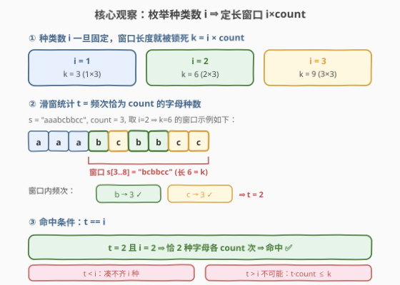
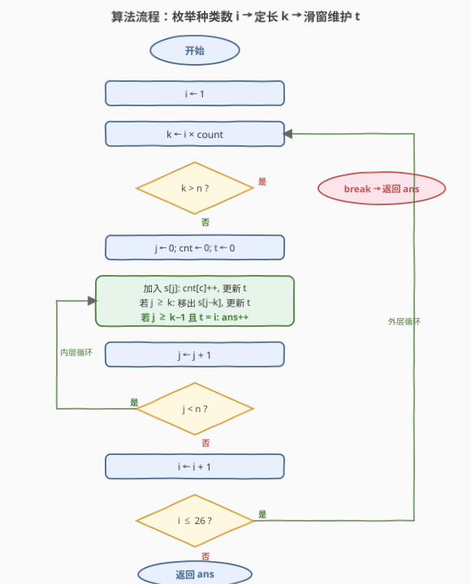
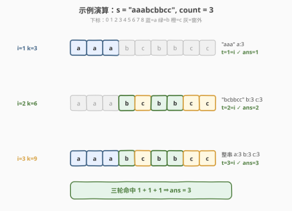

# 等计数子串的数量

- **题目名称**：等计数子串的数量
- **链接**：[2067. 等计数子串的数量](https://leetcode.cn/problems/number-of-equal-count-substrings/)
- **难度**：中等
- **标签**：字符串、滑动窗口、哈希表、计数

## 1. 题目概述

给定一个下标从 **0** 开始、只含**小写英文字母**的字符串 `s`，以及一个整数 `count`。如果 `s` 的某个**子串**中**每种出现的字母都恰好出现 `count` 次**，则称该子串为**等计数子串**。

返回 `s` 中等计数子串的个数。子串是字符串中连续的非空字符序列。

**示例 1**：

```text
输入：s = "aaabcbbcc", count = 3
输出：3
解释：
- 下标 0–2 的子串 "aaa"：'a' 恰好出现 3 次 ✅
- 下标 3–8 的子串 "bcbbcc"：'b'、'c' 各恰好出现 3 次 ✅
- 下标 0–8 的子串 "aaabcbbcc"：'a'、'b'、'c' 各恰好出现 3 次 ✅
```

**示例 2**：

```text
输入：s = "abcd", count = 2
输出：0
解释：每个字母在 s 中出现次数都 < count，没有任何子串满足条件。
```

**示例 3**：

```text
输入：s = "a", count = 5
输出：0
解释：同上，字母出现次数不足 count。
```

**约束条件**：

- $1 \leq \text{s.length} \leq 3 \times 10^4$
- $1 \leq \text{count} \leq 3 \times 10^4$
- `s` 只由小写英文字母组成

> 💡 **审题关键**：①「每种**出现的**字母都恰好 `count` 次」——未出现的字母不参与约束，因此合法子串中字母种类数 $i$ 是个**自由变量**，但一旦 $i$ 确定，子串长度就被锁死为 $i \times \text{count}$；② `s` 只含 26 种小写字母，故 $i \in [1, 26]$——这正是把「不定长搜索」转化为「26 轮定长滑窗」的钥匙。

---

## 2. 解题思路

### 2.1 暴力思路：枚举所有子串

最朴素的做法：枚举所有 $\dfrac{n(n+1)}{2}$ 个子串，对每个子串统计 26 个字母频次，再校验「所有出现的字母频次都等于 `count`」。

- **正确性**：穷举覆盖全部方案。
- **效率**：子串数 $O(n^2)$，每次校验 $O(26)$，总计 $O(26\,n^2)$；$n = 3\times10^4$ 时约 $2.3\times10^{10}$ 次运算，远超时限。

> ⚠️ 暴力的浪费在于：它把「子串长度」当成了自由维度逐一试探，却忽视了「**长度 = 种类数 × count**」这一硬约束。一旦固定种类数 $i$，窗口长度立刻被钉死为 $k = i\cdot\text{count}$，搜索空间从 $O(n^2)$ 个变长窗口坍缩为 $O(n)$ 个定长窗口。

### 2.2 核心观察：枚举种类数 + 定长滑窗



整个解法建立在**三个关键观察**上。

**观察 1：合法子串长度 = 种类数 × count**

设子串中共有 $i$ 种字母出现，每种恰好 `count` 次，则子串长度必为 $L = i \times \text{count}$。字母种类数 $i \in [1, 26]$（小写字母上限）。于是「枚举变长子串」可改写为「**枚举 26 个 $i$，每个 $i$ 对应一个定长窗口**」。

**观察 2：窗口合法 ⇔ 恰好 $i$ 种字母频次等于 count**

对长度 $k = i\cdot\text{count}$ 的窗口，设 $t$ = 窗内频次**恰好**等于 `count` 的字母种数。

- 若窗口合法，则恰有 $i$ 种字母各出现 `count` 次，剩余字母频次为 $0$，故 $t = i$。
- 反之若 $t = i$：这 $i$ 种字母各贡献 `count` 次频次，合计 $i\cdot\text{count} = k$，已填满整个窗口，说明**没有其他字母出现**（否则总频次 $> k$）。故窗口合法。

$$\boxed{\text{窗口合法} \iff t = i}$$

**观察 3：滑动时 $t$ 可 $O(1)$ 增量维护**

窗口右移一格：加入字符 $c$、移出字符 $d = s[j-k]$。频次变化只发生在 $c$ 与 $d$ 两个桶，因此 $t$ 只需在这两次更新中微调：

| 事件 | 频次变化 | 对 $t$ 的影响 |
|------|---------|---------------|
| 加入 $c$：`cnt[c]` 从 $x-1 \to x$ | $x = \text{count}$ | $t\mathrel{+}= 1$（新达到 count） |
| | $x = \text{count}+1$ | $t\mathrel{-}= 1$（刚超过 count，不再是「恰好」） |
| 移出 $d$：`cnt[d]` 从 $x+1 \to x$ | $x = \text{count}$ | $t\mathrel{+}= 1$（回落到 count） |
| | $x = \text{count}-1$ | $t\mathrel{-}= 1$（跌破 count，离开「恰好」） |

> 💡 **为什么不用每次重扫 26 个桶？** 因为窗口每步只动两端各一个字符，全量重算 $O(26)$ 是冗余的。把「是否等于 count」的判定塞进增删瞬间的两个 `if`，每步 $O(1)$ 即可维持 $t$——这是滑动窗口题里「维护满足某谓词的元素个数」的通用技巧。

### 2.3 算法流程图



**完整步骤**：

1. **外层枚举**：对 $i = 1, 2, \dots, 26$：
   - 令窗口长度 $k = i \times \text{count}$。
   - 若 $k > n$，后续 $i$ 更大必然也越界，**直接 `break`**。
2. **内层滑窗**：用指针 $j$ 从左到右扫 $s$，维护频次数组 `cnt[26]` 与计数器 $t$：
   - 加入 `s[j]`：`cnt[c]++`，按上表更新 $t$。
   - 若 $j \geq k$（窗口已超过 $k$ 个字符）：移出 `s[j-k]`，`cnt[d]--`，按上表更新 $t$。
   - 若 $j \geq k-1$（窗口首次填满 $k$ 个字符起）且 $t = i$：`ans++`。
3. **返回** `ans`。

> ⚠️ **两个易错点**：① `break` 而非 `continue`——$i$ 递增时 $k$ 单调递增，一旦 $k>n$ 后续必然越界，无需再试；② 计数条件必须含 `j >= k-1`——前 $k-1$ 步窗口尚未填满，虽可证明此时 $t < i$ 恒成立（窗口字符数 $< k = i\cdot\text{count}$，无法凑出 $i$ 个 `count` 频次），但显式判断更安全、意图更清晰。

### 2.4 示例演算

以 `s = "aaabcbbcc"`、`count = 3`（$n=9$）完整演示三轮滑窗：



各轮结果汇总（窗口长度 $k = 3i$）：

| 轮次 $i$ | $k$ | 命中窗口 | 命中处频次 | $t=i$? | 计入 |
|---------|-----|---------|-----------|--------|------|
| 1 | 3 | `s[0..2]="aaa"` | a:3 | $t=1=1$ ✓ | +1 |
| 2 | 6 | `s[3..8]="bcbbcc"` | b:3, c:3 | $t=2=2$ ✓ | +1 |
| 3 | 9 | `s[0..8]="aaabcbbcc"` | a:3,b:3,c:3 | $t=3=3$ ✓ | +1 |
| 4 | 12 | — | — | — | $k>n$ break |

合计 `ans = 3`。

> 💡 **对比洞察**：注意 $i=1$ 命中的是 `"aaa"`（左端），$i=2$ 命中的是 `"bcbbcc"`（右端），$i=3$ 命中整串——不同 $i$ 轮次**互不干扰**地各自滑窗，这正是「枚举种类数」把搜索空间正交分解的好处：每个 $i$ 只关心长度恰为 $i\cdot\text{count}$ 的窗口，自动过滤掉其他长度的噪声。

---

## 3. 参考代码

### 方法一：枚举种类数 + 定长滑窗（$O(26n)$，推荐）

### C++

```cpp
class Solution {
public:
    int equalCountSubstrings(string s, int count) {
        int n = s.size(), ans = 0;
        for (int i = 1; i <= 26; ++i) {
            int k = i * count;
            if (k > n) break;
            int cnt[26] = {0}, t = 0;
            for (int j = 0; j < n; ++j) {
                int c = s[j] - 'a';
                if (++cnt[c] == count) ++t;
                else if (cnt[c] == count + 1) --t;
                if (j >= k) {
                    int d = s[j - k] - 'a';
                    if (--cnt[d] == count) ++t;
                    else if (cnt[d] == count - 1) --t;
                }
                if (j >= k - 1 && t == i) ++ans;
            }
        }
        return ans;
    }
};
```

### Python

```python
from collections import defaultdict

class Solution:
    def equalCountSubstrings(self, s: str, count: int) -> int:
        n, ans = len(s), 0
        for i in range(1, 27):
            k = i * count
            if k > n:
                break
            cnt, t = defaultdict(int), 0
            for j, c in enumerate(s):
                cnt[c] += 1
                if cnt[c] == count:
                    t += 1
                elif cnt[c] == count + 1:
                    t -= 1
                if j >= k:
                    d = s[j - k]
                    cnt[d] -= 1
                    if cnt[d] == count:
                        t += 1
                    elif cnt[d] == count - 1:
                        t -= 1
                if j >= k - 1 and t == i:
                    ans += 1
        return ans
```

> 💡 **写法要点**：① 外层 `i` 用 `break` 提前终止——$k=i\cdot\text{count}$ 随 $i$ 单调递增；② $t$ 的四个 `if` 对应增删瞬间的两种跨越（达到/超过 count、回落/跌破 count），其余频次变化不触及边界，$t$ 不动；③ `cnt[c] == count+1` 的 `else if` 必不可少——若只判 `==count`，则某字母从 `count` 涨到 `count+1` 时 $t$ 不会减，导致 $t$ 虚高。

### 方法二：前缀和 + 枚举种类数（$O(26n)$，思路对照）

也可用前缀频次差 `pref[j+1] - pref[j-k]` 得到窗口内 26 个字母频次，再扫一遍统计 $t$，与 $i$ 比较。时间同为 $O(26n)$，但每窗需 $O(26)$ 重算，常数大于方法一的 $O(1)$ 增量，仅作思路对照。

---

## 4. 复杂度分析

| 维度 | 方法 | 复杂度 | 说明 |
|------|------|--------|------|
| 时间 | 枚举 + 定长滑窗 | $O(26n)$ | 26 轮外层，每轮 $j$ 单调扫一遍 $s$，每步 $O(1)$ 增量维护 |
| 空间 | 枚举 + 定长滑窗 | $O(26)=O(1)$ | 仅 `cnt[26]` 与若干标量 |
| 时间 | 前缀和差 | $O(26n)$ | 每窗 $O(26)$ 重扫字母表，常数更大 |
| 空间 | 前缀和差 | $O(26n)$ | 需存 26 行前缀频次 |
| 时间 | 暴力枚举子串 | $O(26\,n^2)$ | 枚举 $O(n^2)$ 子串 × 校验 $O(26)$ |

> 💡 本题的 $O(26n)$ 来自两次降维：①「长度 = 种类数 × count」把变长搜索压成 26 个定长窗口；②「频次边界跨越」把每窗 $O(26)$ 校验压成每步 $O(1)$ 增量。两层常数优化后，$n=3\times10^4$ 下约 $7.8\times10^5$ 次操作，轻松通过。

---

## 5. 扩展：字母表大小与「枚举种类数」范式

本题的本质是**有限字母表上的等频子串计数**。套路之所以成立，依赖两个前提：

- **字母表小**（$|\Sigma|=26$）：才能把「种类数 $i$」作为外层循环枚举，复杂度乘以 $|\Sigma|$ 仍可接受。
- **频次固定为 `count`**：使「$i$ 种字母」唯一确定窗口长度 $i\cdot\text{count}$，变长问题化为定长问题。

**推广与边界**：

- 若字母表换成 Unicode（无限大），「枚举种类数」失效，需改用前缀状态编码（如把频次向量压成哈希键），复杂度上升。
- 若题目改为「每种字母频次**相等**但不指定具体值」，则需枚举该公共频次 $f \in [1, n/\text{种类数}]$，再套同款滑窗——多一层 $f$ 的循环。
- 若改为「至多 `count` 次」或「至少 `count` 次」，则失去「长度 = $i\cdot\text{count}$」的硬约束，定长滑窗不再适用，通常转向双指针（满足单调性时）或前缀状态哈希。

> 💡 这条线索连接到一类**「枚举种类数 + 定长滑窗」**范式：只要「每种元素频次等于某定值」+「字母表有限」，就能用种类数作外层、定长作内层。典型应用见下方同类练习题。

---

## 6. 面试要点

**Q1：为什么枚举种类数 $i$ 而不是直接枚举子串长度？**

> 直接枚举长度 $L$ 时，无法判断「合法」所需的字母种类数，仍需在窗口内做 $O(26)$ 校验且缺乏剪枝。而枚举 $i$ 后，长度被唯一确定为 $k=i\cdot\text{count}$，且合法条件简化为「频次恰为 `count` 的字母数 $t$ 等于 $i$」——一个标量等式。$i$ 的取值范围仅 26，远小于 $n$ 种可能长度，搜索空间被大幅压缩。

**Q2：$t = i$ 为什么就保证窗口合法？万一窗口里还有别的字母出现非 `count` 次呢？**

> 若 $t = i$，即有 $i$ 种字母频次恰为 `count`，它们合计贡献 $i\cdot\text{count} = k$ 个字符，已等于窗口长度。窗口总字符数恰为 $k$，故不可能还有其他字母出现（否则总频次 $> k$）。因此窗口内**只有**这 $i$ 种字母、且每种恰 `count` 次，完全合法。

**Q3：`cnt[c] == count + 1` 这个 `else if` 分支能省吗？**

> 不能。若省去，当某字母频次从 `count` 涨到 `count+1` 时，$t$ 不会减 1，于是 $t$ 仍把该字母算作「恰好 count」，导致虚高。例如 `count=3` 时窗口 `"aaaa"`（a 出现 4 次），若不减，$t$ 会误记为 1，可能误判 $t=i=1$ 成立而把不合法窗口计入答案。

**Q4：`count = 1` 时算法还正确吗？会不会退化？**

> 正确。`count=1` 时 `count+1=2`、`count-1=0`，四个分支逻辑自洽。此时 $i=1, k=1$：每个单字符窗口都满足「1 种字母出现 1 次」，全部计入。$i=2, k=2$：仅当窗口两字符不同（各 1 次）才合法。整体复杂度仍 $O(26n)$，不退化。

**Q5：外层循环用 `break` 还是 `continue`？为什么？**

> 用 `break`。$k = i\cdot\text{count}$ 随 $i$ 单调递增，一旦 $k > n$，更大的 $i$ 必然也 $k > n$，继续循环只是空转。`break` 直接终止外层，省去无意义的迭代；若改 `continue` 则会多扫若干轮空循环（虽因 `k>n` 内层 `j` 循环仍会执行但永不计数），既无意义又浪费时间。

> 💡 **一句话总结**：字母表只有 26 种 ⇒ 枚举种类数 $i$、定窗 $k=i\cdot\text{count}$、滑动维护「频次恰为 count 的字母数 $t$」、$t=i$ 即命中。$O(26n)$ 时间、$O(1)$ 空间，两次降维把变长搜索压成定长滑窗。

---

## 7. 同类练习题

- [2062. 统计字符串中的元音子字符串](https://leetcode.cn/problems/count-vowel-substrings-of-a-string/)：固定「5 种元音各至少出现一次」的子串计数——同属有限字母表上的子串计数，对照本题「每种恰 count 次」的等频约束
- [395. 至少有 K 个重复字符的最长子串](https://leetcode.cn/problems/longest-substring-with-at-least-k-repeating-characters/)：分治或「枚举种类数 + 滑窗」求最长——本题的「最长版」变体，把计数改为求最长时同样可用枚举种类数范式
- [438. 找到字符串中所有字母异位词](https://leetcode.cn/problems/find-all-anagrams-in-a-string/)：定长滑窗 + 频次匹配——本题滑窗维护与频次比较的直接前置，窗口长度由异位词长度固定
- [76. 最小覆盖子串](https://leetcode.cn/problems/minimum-window-substring/)：变长滑窗 + 频次覆盖判定——对照本题定长滑窗，体会「约束固定长度」vs「约束最短长度」两种滑窗形态
- [828. 统计子串中的唯一字符](https://leetcode.cn/problems/count-unique-characters-of-all-substrings-of-a-given-string/)：按字符贡献拆解子串计数——另一类「统计满足某频次约束的子串数」问题，改用按位置贡献的乘法原理
