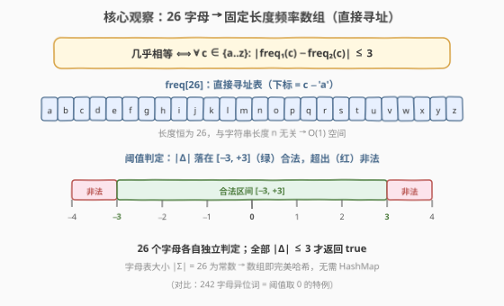
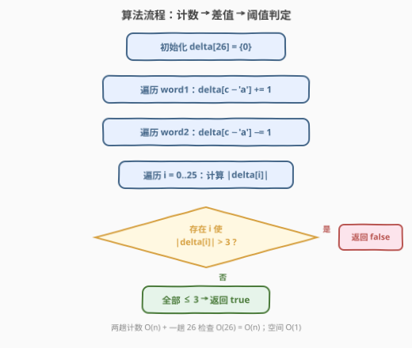
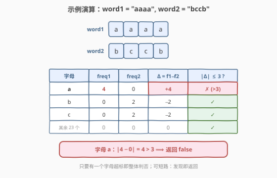

# LeetCode 检查两个字符串是否几乎相等 题解

## 1. 题目概述

- **标题 / 题号**：检查两个字符串是否几乎相等（#2068，easy）
- **链接**：https://leetcode.cn/problems/check-whether-two-strings-are-almost-equivalent/
- **难度**：简单
- **标签**：字符串、哈希表、计数

**题意**：如果两个字符串 `word1` 和 `word2` 中从 `'a'` 到 `'z'` 每一个字母出现频率之差都**不超过** `3`，则称它们**几乎相等**。一个字母 `x` 的出现**频率**指它在字符串中出现的次数。

给定两个长度都为 `n` 的字符串 `word1` 和 `word2`，若它们几乎相等返回 `true`，否则返回 `false`。

> 💡 形式化定义：几乎相等 $\iff \forall\, c \in \{\text{'a'}\dots\text{'z'}\}:\ \lvert \text{freq}_1(c) - \text{freq}_2(c) \rvert \le 3$。

**示例 1**：

```text
输入：word1 = "aaaa", word2 = "bccb"
输出：false
解释：'a' 在 word1 中出现 4 次，在 word2 中出现 0 次，差为 4，大于上限 3。
```

**示例 2**：

```text
输入：word1 = "abcdeef", word2 = "abaaacc"
输出：true
解释：每个字母频率之差至多为 3：
  'a' 1↔4 差 3；'b' 1↔1 差 0；'c' 1↔2 差 1；'d' 1↔0 差 1；'e' 2↔0 差 2；'f' 1↔0 差 1。
```

**示例 3**：

```text
输入：word1 = "cccddabba", word2 = "babababab"
输出：true
解释：'a' 2↔4 差 2；'b' 2↔5 差 3；'c' 3↔0 差 3；'d' 2↔0 差 2。
```

**约束**：

- $n = \text{word1.length} = \text{word2.length}$
- $1 \le n \le 100$
- `word1` 和 `word2` 只包含小写英文字母

## 2. 解题思路

### 2.1 暴力思路：逐字母扫描

最直观的做法是：对 `'a'` 到 `'z'` 这 26 个字母**逐个**处理——每个字母分别扫描 `word1` 和 `word2` 统计出现次数，计算频率差的绝对值，一旦发现某个字母的差 $> 3$ 立即返回 `false`。

该思路正确但每个字母都要扫两遍字符串，共 $26 \times 2 \times n$ 次字符访问，常数较大；且 26 趟扫描之间没有复用任何信息。

> ⚠️ 另一种"暴力"是用通用哈希表（如 `unordered_map`/`dict`）记录频率。但本题字符集只有 26 个小写字母，是**有限且稠密**的，用通用哈希表反而浪费——下文用固定长度数组更优。

### 2.2 核心观察：26 长度频率数组（直接寻址）



关键在于认清字符集的性质：

- **字符集有限且稠密**：只有 `'a'`–`'z'` 共 26 个小写字母，且连续可映射到下标 $0\dots25$（$c - \text{'a'}$）。这正是**直接寻址表（direct-address table）**的甜区——一个长度 26 的数组就是完美哈希表，无需哈希函数、无需处理冲突。
- **字母表大小是常数**：$|\Sigma| = 26$ 与字符串长度 $n$ 无关，因此数组空间 $O(|\Sigma|) = O(1)$。
- **判定可叠加**：用**一个** `delta[26]` 数组，遍历 `word1` 时对应位 `+1`、遍历 `word2` 时对应位 `-1`，最后只需检查所有 `|delta[i]| ≤ 3`。两趟计数合并成一组差值，省去两个独立频率表的比较。

> 💡 **关键洞察**：把"两个频率表的逐位比较"折叠成"一个差值表的逐位阈值判定"——`delta[i] = freq1[i] - freq2[i]`，判定条件从 `|freq1[i] - freq2[i]| ≤ 3` 等价化为 `|delta[i]| ≤ 3`。这是 242 字母异位词（判定 `delta[i] == 0`）的直接泛化：阈值从 $0$ 放宽到 $3$。

### 2.3 算法流程图



流程为「初始化 → 两趟计数 → 一趟阈值检查」：

1. 初始化 `delta[26] = {0}`；
2. 遍历 `word1`：`delta[c - 'a'] += 1`；
3. 遍历 `word2`：`delta[c - 'a'] -= 1`；
4. 遍历 `i = 0\dots25`：若存在 `|delta[i]| > 3` 返回 `false`，否则返回 `true`。

> 💡 第 4 步可**短路**：发现任意一个超标字母立即返回 `false`，无需扫完全部 26 个。但 26 是常数，短路与否对渐近复杂度无影响，只影响常数。

### 2.4 示例演算

以示例 1 `word1 = "aaaa"`、`word2 = "bccb"` 为例：



| 字母 | freq1 | freq2 | $\Delta = f_1 - f_2$ | $\lvert\Delta\rvert \le 3$? |
|------|-------|-------|----------------------|------------------------------|
| a    | 4     | 0     | +4                   | ✗（>3）                      |
| b    | 0     | 2     | −2                   | ✓                            |
| c    | 0     | 2     | −2                   | ✓                            |
| 其余 23 个 | 0 | 0  | 0                    | ✓                            |

字母 `a` 的频率差为 $4 > 3$，触发短路，返回 `false`。

> ⚠️ 注意"几乎相等"要求**所有 26 个字母**都满足阈值，是"与"关系——只要有一个字母超标即整体判否。这与示例 2/3 形成对照：即便多个字母频率差异较大（如示例 3 的 `b` 差 3、`c` 差 3），只要全部卡在阈值内仍返回 `true`。

## 3. 参考代码

### C++

```cpp
class Solution {
  public:
    bool checkAlmostEquivalent(string word1, string word2) {
        int delta[26] = {0};
        for (char c : word1) delta[c - 'a']++;
        for (char c : word2) delta[c - 'a']--;
        for (int i = 0; i < 26; ++i)
            if (abs(delta[i]) > 3) return false;
        return true;
    }
};
```

### Python

```python
class Solution:
    def checkAlmostEquivalent(self, word1: str, word2: str) -> bool:
        delta = [0] * 26
        for c in word1:
            delta[ord(c) - 97] += 1
        for c in word2:
            delta[ord(c) - 97] -= 1
        return all(abs(d) <= 3 for d in delta)
```

> 💡 Python 用 `ord(c) - 97`（即 `ord('a')`）把字母映射到 `0..25`；`all(...)` 天然实现短路——遇到首个 `abs(d) > 3` 即返回 `False`。

## 4. 复杂度分析

| 维度 | 复杂度 | 说明 |
|------|--------|------|
| 时间复杂度 | $O(n)$ | 两趟计数各遍历长度 $n$ 的字符串一次（$2n$），加一趟 26 次阈值检查；$26$ 为常数，总体 $O(n)$ |
| 空间复杂度 | $O(1)$ | `delta[26]` 固定长度，$|\Sigma| = 26$ 与 $n$ 无关 |

> 💡 即便字符集扩大到全 ASCII（128）或 Unicode，只要字符集大小 $|\Sigma|$ 视作常数，空间仍为 $O(1)$；若字符集与 $n$ 同阶则需改用通用哈希表。

## 5. 扩展：Counter 写法与阈值泛化

### 5.1 Python `Counter` 简写

`collections.Counter` 的 `subtract` 方法天然支持"差值表"语义，一行即可完成两趟计数：

```python
from collections import Counter

class Solution:
    def checkAlmostEquivalent(self, word1: str, word2: str) -> bool:
        d = Counter(word1)
        d.subtract(word2)              # 原地相减：d[c] = freq1(c) - freq2(c)
        return all(abs(v) <= 3 for v in d.values())
```

> ⚠️ `Counter` 只保留**至少出现在一个字符串中**的字母作为键；两串都不含的字母 `delta` 恒为 $0$（$\le 3$），无需检查，因此遍历 `d.values()` 即可覆盖所有"可能超标"的字母。这与手写 26 数组等价但更 Pythonic，代价是哈希表常数略高。

### 5.2 阈值泛化

把阈值 `3` 替换为任意整数 $k$，整套模板不变——即"两串每个字母频率差 $\le k$"的判定。几个经典题目都是同一模板的特例：

| 题目 | 判定条件 | 与本题关系 |
|------|----------|-----------|
| 242 有效的字母异位词 | `delta[i] == 0` | $k = 0$ 的特例（完全相同） |
| 2068 本题 | `|delta[i]| <= 3` | $k = 3$ |
| 1347 最少步骤使两串相等 | 求 $\sum\lvert\Delta\rvert/2$ | 把"判定"换成"计量"（统计需补齐的字符数） |

> 💡 把 $k$ 参数化后，2068 与 242 共享同一份"差值表 + 阈值判定"骨架——这也是为什么 26 长度频率数组是字符串频率类题目的万能起手式。

## 6. 面试要点

1. **为什么用长度 26 的数组而不是 `unordered_map`？**

   - 字符集只有 26 个小写字母，**有限、稠密且连续**，满足直接寻址表的条件。数组下标 $c - \text{'a'}$ 即完美哈希，无冲突、无哈希函数开销，访问 $O(1)$ 且常数远小于哈希表。通用哈希表适用于字符集稀疏或未知（如 Unicode）的场景。

2. **用单个 `delta` 数组 vs 两个独立频率数组 `freq1`/`freq2`，有何区别？**

   - 两者等价：`delta[i] = freq1[i] - freq2[i]`。单数组把"计数"和"比较"折叠成一步——边计数边累加差值，最后只查一张表，省去两表对位的逐项相减。空间也从两个 26 数组降为一个，常数更优。

3. **`delta` 可能为负，检查时要注意什么？**

   - 频率差带符号（`word1` 多则为正、`word2` 多则为负），判定必须取**绝对值** `abs(delta[i]) > 3`。若忘记 `abs`，会漏判 `word2` 中某字母远多于 `word1` 的情况（如示例 1 反过来）。

4. **时间复杂度为什么是 $O(n)$ 而非 $O(26n)$？**

   - 两趟计数共 $2n$ 次字符访问，是 $O(n)$；阈值检查固定 26 次，是 $O(|\Sigma|) = O(1)$。渐近复杂度只保留与 $n$ 相关的项，常数 26 被吸收。即便暴力法做 26 趟扫描，渐近仍是 $O(n)$，只是常数大 26 倍。

5. **能否在计数阶段就短路返回？**

   - 可以但不划算。计数时 `delta[i]` 只是"当前已扫描部分"的差值，尚未覆盖全串，`|delta[i]| > 3` 不代表最终超标（后续字符可能把差值拉回）。要在计数阶段短路需维护更复杂的不变量，得不偿失；把短路留到阈值检查阶段即可，26 次检查本身极快。

## 同类练习题

| # | 题目 | 与本题的关联 |
|---|------|-------------|
| 242 | [有效的字母异位词](https://leetcode.cn/problems/valid-anagram/) | 判定两串每个字母频率**完全相同**（`delta[i] == 0`），即本题阈值取 $0$ 的特例，同 26 长度频率数组模板 |
| 383 | [赎金信](https://leetcode.cn/problems/ransom-note/) | 用频率数组判定 `freq_ransom[i] <= freq_mag[i]`（子集关系），同为直接寻址表计数 |
| 1347 | [制造两个字符串几乎相等的最少步骤](https://leetcode.cn/problems/minimum-number-of-steps-to-make-two-strings-anagram/) | 同名"几乎相等"但求**最小操作数**（$\sum\lvert\Delta\rvert/2$），把本题的"判定"升级为"计量" |
| 1941 | [检查是否所有字符出现相等次数](https://leetcode.cn/problems/check-if-all-characters-have-equal-number-of-occurrences/) | 单串频率一致性判定（所有字母频率相等或为 0），同 26 频率数组套路的单串变体 |
