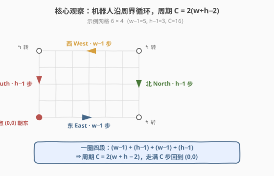
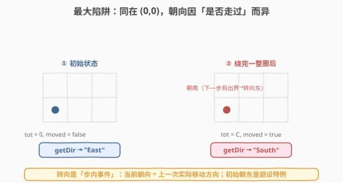
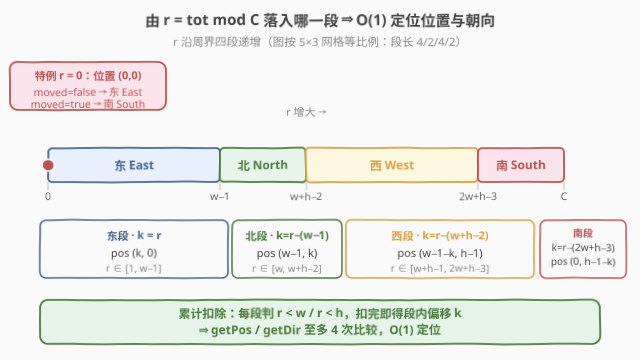
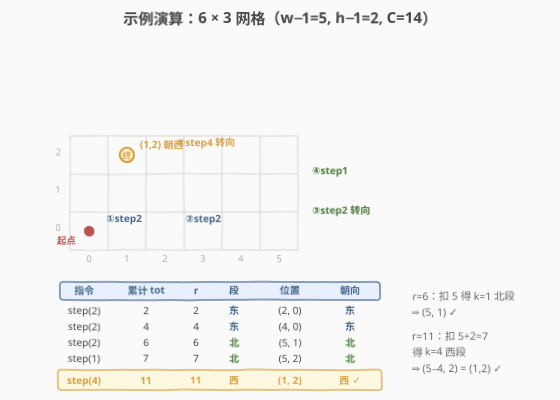

# 模拟行走机器人 II

- **题目名称**：模拟行走机器人 II
- **链接**：[2069. 模拟行走机器人 II](https://leetcode.cn/problems/walking-robot-simulation-ii/)
- **难度**：中等
- **标签**：设计、模拟、数学、取模

## 1. 题目概述

给定一个 `width × height` 的网格，左下角为 `(0, 0)`，右上角为 `(width - 1, height - 1)`。机器人初始在 `(0, 0)`，方向朝 **东**。每一步执行：

1. 沿当前方向尝试前进一格；
2. 若下一格出界，则**逆时针转 90°**，再前进一格。

机器人走完指令要求的步数后停下，等待下一条指令。请实现 `Robot` 类：

- `Robot(int width, int height)`：初始化 `width × height` 网格，机器人在 `(0, 0)` 朝东。
- `void step(int num)`：前进 `num` 步。
- `int[] getPos()`：返回 `[x, y]`。
- `String getDir()`：返回 `"East" / "North" / "South" / "West"`。

**示例 1**：

```text
输入：["Robot","step","step","getPos","getDir","step","step","step","getPos","getDir"]
     [[6,3],[2],[2],[],[],[2],[1],[4],[],[]]
输出：[null,null,null,[4,0],"East",null,null,null,[1,2],"West"]
解释：6×3 网格。
  step(2) → (2,0) 朝东；step(2) → (4,0) 朝东；
  step(2) → 先东行到 (5,0) 触发转向北，再北行到 (5,1)；
  step(1) → (5,2) 朝北；
  step(4) → 触发转向西，西行到 (1,2) 朝西。
```

**约束条件**：

- $2 \le \text{width}, \text{height} \le 100$
- $1 \le \text{num} \le 10^5$
- `step` / `getPos` / `getDir` 总调用次数 $\le 10^4$

> 💡 **审题关键**：① 机器人**只前进、不后退**，遇墙才逆时针转向——这意味着它永远贴着**网格周界**走，不会进入内部；② 每一步最多转一次（出界即转），转向发生在「该步内部」，故**步后的朝向 = 该步实际移动方向**；③ `num` 可达 $10^5$、调用 $10^4$ 次，累计 $10^9$ 步，逐格模拟必然超时——必须利用周期性。

---

## 2. 解题思路

### 2.1 暴力思路：逐格模拟

最直白：`step(num)` 循环 `num` 次，每次按规则走一格、必要时转向。

- **正确性**：忠实模拟每一步，逻辑无懈可击。
- **效率**：单次 `step` 为 $O(\text{num})$，最坏 $10^5$；$10^4$ 次调用累计 $10^9$ 步，远超时限。

> ⚠️ 暴力的浪费在于：它把每一步都当成「新信息」处理，却没发现机器人走的是一条**封闭环路**——走完一圈回到原点（除 (0,0) 朝向的细节外），状态完全复现。一旦识别出周期，$10^9$ 步可瞬间折叠为「步数取模」。

### 2.2 核心观察：周界环路 + 周期取模



整个解法建立在**三个观察**上。

**观察 1：机器人始终贴着周界走**

机器人只有「前进」与「遇墙逆时针转」两种行为，没有主动转向或后退。从 `(0,0)` 朝东出发：沿底边东行到 `(w-1,0)`，转向北沿右边到 `(w-1,h-1)`，转向西沿顶边到 `(0,h-1)`，转向南沿左边回到 `(0,0)`——全程只踩周界格子，永不进入内部。

**观察 2：路径是周期为 $C = 2(w+h-2)$ 的封闭环路**

把一圈拆成四段，每段步数即该边两端点的「格距」：

| 段 | 方向 | 起点 | 步数 | 终点 |
|----|------|------|------|------|
| 1 | 东 East | (0,0) | $w-1$ | (w−1, 0) |
| 2 | 北 North | (w−1,0) | $h-1$ | (w−1, h−1) |
| 3 | 西 West | (w−1,h−1) | $w-1$ | (0, h−1) |
| 4 | 南 South | (0,h−1) | $h-1$ | (0, 0) |

$$C = (w-1)+(h-1)+(w-1)+(h-1) = 2(w+h-2)$$

走满 $C$ 步，位置回到 $(0,0)$。于是「前进 $\text{num}$ 步后的位置」等价于「前进 $\text{num} \bmod C$ 步后的位置」——$10^9$ 步折叠为 $< C \le 396$ 的余数。

**观察 3：(0,0) 的朝向有「初始 / 绕圈后」之分（本题最大陷阱）**

- **初始**：机器人在 $(0,0)$ **朝东**（题设），尚未移动。
- **绕完一整圈**：机器人沿第四段（南）**向南**走到 $(0,0)$，到达时**仍朝南**——转向东要等「下一步」触发。

也就是说，同样在 $(0,0)$：`tot=0` 时朝东，`tot=C`（或任意 $C$ 的正倍数）时朝南。`getDir` 必须区分二者。用一个 `moved` 标志（是否调用过 `step`）即可消歧：`r==0` 时 `moved` 为假 → 东，为真 → 南。



> ⚠️ **为什么不能简单地说「(0,0) 永远朝东」？** 因为转向是「步内事件」：第四段最后一步从 $(0,1)$ 向南跨入 $(0,0)$，移动方向是南，步后朝向即南。东行的转向要等到下一次 `step` 才发生。故 `getDir` 在 `tot` 为 $C$ 的正倍数时返回「南」，仅 `tot=0` 返回「东」。

### 2.3 算法流程：余数分段定位



设 `r = tot`（已对 $C$ 取模，$r \in [0, C-1]$）。用「累计扣除」把 $r$ 归入四段之一，每段内用段内偏移 $k$ 直接写出坐标：

1. **若 $r = 0$**：位置 $(0,0)$；朝向 = `East`（若未移动）或 `South`（若已移动）。结束。
2. **东段** $r \in [1, w-1]$：$k = r$，位置 $(k,\ 0)$，朝向东。
3. 扣除 $w-1$。**北段** $r \in [1, h-1]$：$k = r$，位置 $(w-1,\ k)$，朝向北。
4. 扣除 $h-1$。**西段** $r \in [1, w-1]$：$k = r$，位置 $(w-1-k,\ h-1)$，朝向西。
5. 扣除 $w-1$。**南段** $r \in [1, h-1]$：$k = r$，位置 $(0,\ h-1-k)$，朝向南。

每步比较都是 $O(1)$，`getPos` / `getDir` 至多 4 次比较即可定位。

> 💡 **写法要点**：用「累计扣除」而非「四个独立区间判断」——前者每段判定只需 `r < w` / `r < h`，且扣除后 $r$ 自动成为段内偏移 $k$，坐标公式直接用 $k$，无需重复算 `r - 边界`。代码因此极短。

### 2.4 示例演算

以 `width=6, height=3`（$w-1=5,\ h-1=2,\ C=14$）完整演示：



| 指令 | 累计 `tot` | `r = tot` | 段 | 位置 | 朝向 |
|------|-----------|-----------|-----|---------|------|
| step(2) | 2 | 2 | 东 | (2, 0) | 东 |
| step(2) | 4 | 4 | 东 | (4, 0) | 东 |
| step(2) | 6 | 6 | 北 | (5, 1) | 北 |
| step(1) | 7 | 7 | 北 | (5, 2) | 北 |
| step(4) | 11 | 11 | 西 | (1, 2) | 西 |

- $r=2$：东段 $k=2$ → $(2,0)$ 东 ✓
- $r=6$：扣除 $w-1=5$ 得 $k=1$ 北段 → $(w-1, k)=(5,1)$ 北 ✓（第 6 步正是底边到头、转向北走一格）
- $r=11$：扣 $5+2=7$ 得 $k=4$ 西段 → $(w-1-k,\ h-1)=(5-4,\ 2)=(1,2)$ 西 ✓

与示例输出 `[1,2], "West"` 完全一致。

---

## 3. 参考代码

### C++

```cpp
class Robot {
    int w, h, C, tot = 0;
    bool moved = false;
    void compute(int& x, int& y, int& d) const {
        int r = tot;
        if (r == 0) { x = 0; y = 0; d = moved ? 3 : 0; return; }
        if (r < w) { x = r; y = 0; d = 0; return; }
        r -= w - 1;
        if (r < h) { x = w - 1; y = r; d = 1; return; }
        r -= h - 1;
        if (r < w) { x = w - 1 - r; y = h - 1; d = 2; return; }
        r -= w - 1;
        x = 0; y = h - 1 - r; d = 3;
    }
public:
    Robot(int width, int height) : w(width), h(height), C(2 * (width + height - 2)) {}
    void step(int num) { tot = (tot + num) % C; moved = true; }
    vector<int> getPos() { int x, y, d; compute(x, y, d); return {x, y}; }
    string getDir() {
        int x, y, d; compute(x, y, d);
        static const char* names[] = {"East", "North", "West", "South"};
        return names[d];
    }
};
```

### Python

```python
from typing import List

class Robot:
    def __init__(self, width: int, height: int):
        self.w, self.h = width, height
        self.C = 2 * (width + height - 2)
        self.tot = 0
        self.moved = False

    def step(self, num: int) -> None:
        self.tot = (self.tot + num) % self.C
        self.moved = True

    def _compute(self):
        w, h, r = self.w, self.h, self.tot
        if r == 0:
            return (0, 0, 3 if self.moved else 0)
        if r < w:
            return (r, 0, 0)
        r -= w - 1
        if r < h:
            return (w - 1, r, 1)
        r -= h - 1
        if r < w:
            return (w - 1 - r, h - 1, 2)
        r -= w - 1
        return (0, h - 1 - r, 3)

    def getPos(self) -> List[int]:
        x, y, _ = self._compute()
        return [x, y]

    def getDir(self) -> str:
        _, _, d = self._compute()
        return ("East", "North", "West", "South")[d]
```

> 💡 **关键点**：① `tot` 每次 `step` 后立即 `% C`，常量级存储避免溢出；② `moved` 标志只用于消歧 `r==0`——未移动时题设朝东，绕圈后朝南；③ 方向编码 `0/1/2/3 = 东/北/西/南`，恰为逆时针顺序，便于扩展。

---

## 4. 复杂度分析

| 维度 | 方法 | 复杂度 | 说明 |
|------|------|--------|------|
| 时间 | 周期取模 + 分段定位 | $O(1)$ / 操作 | `step` 一次取模；`getPos` / `getDir` 至多 4 次比较 |
| 空间 | 周期取模 + 分段定位 | $O(1)$ | 仅存 `w, h, C, tot, moved` 五个标量 |
| 时间 | 逐格模拟（暴力） | $O(\text{num})$ / step | 累计可达 $10^9$，超时 |
| 空间 | 逐格模拟（暴力） | $O(1)$ | 同样只存当前位置与方向 |

> 💡 本题的 $O(1)$ 来自把「线性步数」折叠为「模 $C$ 余数」：$C \le 2(100+100-2)=396$，余数小到可直接分段查表。本质是识别出状态空间的**周期性**——这是所有「循环移动 / 旋转」类模拟题的通用降阶钥匙。

---

## 5. 扩展：周期性状态折叠

本题的本质是**有限状态系统的周期性折叠**。机器人状态 = (位置, 朝向)，而该状态在周界上构成一个长度为 $C$ 的纯循环。一旦识别周期，任意大步数都能取模归约。

**适用条件**（识别「可折叠周期」的信号）：

- 状态转移是**确定且可逆的纯函数**（无随机、无外部输入改变转移）；
- 状态空间**有限**且存在回归点（本题回到 $(0,0)$ 即回归）；
- 查询只需「终态」而非「完整过程」。

**边界与变体**：

- 若网格内有**障碍物**（如 874. 模拟行走机器人），路径不再是单一周界环路，周期折叠失效，需改用「障碍哈希 + 逐段跨步」。
- 若转向规则改为「遇墙即停」或「可反向」，周期结构被破坏，需重新分析。
- 若查询要求「第 $k$ 步的完整轨迹」，取模只能给终态；过程仍需按段批量输出（$O(\text{段数})$ 而非 $O(\text{步数})$）。
- 若**朝向不纳入状态**（只问位置），周期仍为 $C$；本题因 `getDir` 把朝向纳入查询，才额外引出 $(0,0)$ 的朝向陷阱。

> 💡 这条线索连接到一类「**周期 / 模运算降阶**」范式：Floyd 判圈（141 / 142）、快乐数判圈（202）、分数循环节（166）都是识别周期后把线性搜索化为 $O(\text{周期长})$ 甚至 $O(1)$。本题的特殊之处在于周期长有闭式公式 $C=2(w+h-2)$，无需运行即知。

---

## 6. 面试要点

**Q1：为什么机器人一定只走周界、不进入内部？**

> 它只有「前进」与「遇墙逆时针转」两种行为，没有主动转向或后退。从角点出发沿边走，每次到头都转向上 / 下一条边，于是永远在外圈循环。内部格子要主动转向才能进入，而规则不允许。

**Q2：周期 $C = 2(w+h-2)$ 是怎么算出来的？**

> 一圈四段，每段步数 = 该边两端点的坐标差：底 / 顶边各 $w-1$ 步，左 / 右边各 $h-1$ 步。合计 $(w-1)+(h-1)+(w-1)+(h-1) = 2(w+h-2)$。注意是「格距」而非「格数」——从 $(0,0)$ 走到 $(w-1,0)$ 是 $w-1$ 步。

**Q3：回到 (0,0) 时方向为什么是南、不是东？这是最大坑点。**

> 第四段最后一步从 $(0,1)$ **向南**跨入 $(0,0)$，移动方向是南。转向规则是「下一步出界才转」——到达 $(0,0)$ 时尚未触发下一次转向，故当前朝向仍为南。只有初始状态（题设）在 $(0,0)$ 朝东。因此 `getDir` 在 `tot` 为 $C$ 的正倍数时返回「南」，仅 `tot=0` 返回「东」。

**Q4：`num` 很大、调用很多次，不取模会怎样？**

> 逐格模拟 $O(\text{num})$，$10^4$ 次调用、每次 $10^5$ 步，累计 $10^9$ 步必超时。取模把每次 `step` 降为 $O(1)$：`tot = (tot + num) % C`。$C \le 396$，`tot` 始终是常量级，无溢出风险。

**Q5：能否不存 `moved` 标志？**

> 可以：保留完整 `tot` 不取模，查询时 `r = tot % C`，用 `tot > 0 && r == 0` 判定「绕圈后」朝南。但 `tot` 可达 $10^9$（C++ 需 `long long`）。取模 + `moved` 标志把存储压到常量级且无溢出顾虑，更稳妥；标志本身只占 1 字节，开销可忽略。

> 💡 **一句话总结**：机器人贴周界走，周期 $C=2(w+h-2)$；`step` 取模、`getPos` / `getDir` 按余数分段 $O(1)$ 定位；唯一陷阱是 $(0,0)$ 在「初始」朝东、「绕圈后」朝南，用 `moved` 标志消歧。

---

## 7. 同类练习题

- [874. 模拟行走机器人](https://leetcode.cn/problems/walking-robot-simulation/)：同系列前作，机器人按指令走但有障碍物——周期折叠失效，改用障碍哈希 + 逐段跨步，对照体会「无障碍→取模 / 有障碍→哈希」的分野
- [1041. 困于环中的机器人](https://leetcode.cn/problems/robot-bounded-in-circle/)：判定指令序列是否让机器人困于环——同属机器人周期性分析，判定「1 轮或 4 轮回归原点方向」
- [657. 机器人能否返回原点](https://leetcode.cn/problems/robot-return-to-origin/)：机器人位移计数判定——入门级机器人模拟，对照本题的「朝向状态」复杂度
- [258. 各位相加](https://leetcode.cn/problems/add-digits/)：用 $\bmod 9$ 把逐位求和降至 $O(1)$——同属「模运算降阶」范式，把线性过程折叠为周期余数
