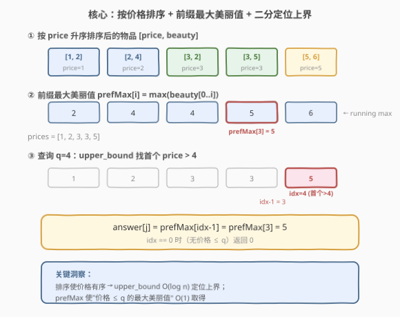
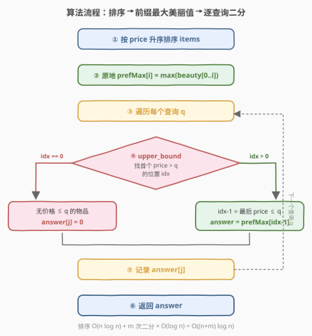
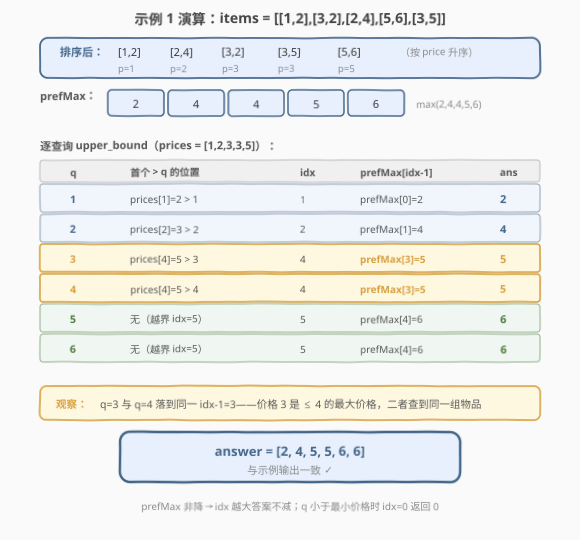

# LeetCode 每一个查询的最大美丽值 题解

## 1. 题目概述

- **标题 / 题号**：每一个查询的最大美丽值（#2070，medium）
- **链接**：https://leetcode.cn/problems/most-beautiful-item-for-each-query/
- **难度**：中等
- **标签**：数组、排序、二分查找

**题意**：给定一个二维整数数组 `items`，其中 `items[i] = [price_i, beauty_i]` 分别表示第 $i$ 件物品的**价格**与**美丽值**。同时给定下标从 0 开始的整数数组 `queries`。对于每个查询 `queries[j]`，求出**价格小于等于** `queries[j]` 的物品中，**最大的美丽值**是多少；若不存在符合条件的物品，则该查询结果为 `0`。

返回与 `queries` 等长的数组 `answer`，其中 `answer[j]` 为第 $j$ 个查询的答案。

**示例 1**：

```text
输入：items = [[1,2],[3,2],[2,4],[5,6],[3,5]], queries = [1,2,3,4,5,6]
输出：[2,4,5,5,6,6]
解释：
- queries[0]=1，仅 [1,2] 价格 ≤ 1，答案 2。
- queries[1]=2，[1,2] 与 [2,4] 符合，最大美丽值 4。
- queries[2]=3、queries[3]=4，符合物品均为 [1,2],[3,2],[2,4],[3,5]，最大美丽值 5。
- queries[4]=5、queries[5]=6，所有物品符合，最大美丽值 6。
```

**示例 2**：

```text
输入：items = [[1,2],[1,2],[1,3],[1,4]], queries = [1]
输出：[4]
解释：所有物品价格均为 1，取最大美丽值 4。注意多件物品可能有相同的价格与美丽值。
```

**示例 3**：

```text
输入：items = [[10,1000]], queries = [5]
输出：[0]
解释：没有物品价格 ≤ 5，结果为 0。
```

**约束**：

- $1 \le \text{items.length},\ \text{queries.length} \le 10^5$
- $\text{items[i].length} == 2$
- $1 \le \text{price}_i,\ \text{beauty}_i,\ \text{queries}[j] \le 10^9$

## 2. 解题思路

### 2.1 暴力思路：逐查询扫描全部物品

最直观的做法是对每个查询 `q`，线性扫描所有物品，维护 `price_i <= q` 中的最大 `beauty_i`。

- 单次查询 $O(n)$，$m$ 次查询共 $O(n \cdot m)$。当 $n = m = 10^5$ 时高达 $10^{10}$ 次操作，**超时**。

> 💡 暴力的瓶颈在于"对每个查询都重复扫描整个物品表"。如果能预处理物品，使"价格不超过 $q$ 的最大美丽值"查询降到 $O(\log n)$，总复杂度就可接受。

### 2.2 核心观察：排序 + 前缀最大美丽值 + 二分查找



将问题分解为三步：

**第一步：按 `price` 升序排序 `items`。** 排序后，价格数组天然有序，可对其做二分查找。对于同价格的物品，相对顺序不影响正确性——后续的前缀最大值会自动取到该价格下的最大美丽值。

**第二步：构建前缀最大美丽值 `prefMax`。** 令 $\text{prefMax}[i] = \max(\text{beauty}_0, \ldots, \text{beauty}_i)$，即前 $i+1$ 件物品（按价格升序）中的最大美丽值。由于数组按价格升序，$\text{prefMax}[i]$ 恰好就是"价格不超过 $\text{price}_i$ 的所有物品中的最大美丽值"。

**第三步：对每个查询 $q$，二分找价格上界。** 用 `upper_bound` 在价格数组中找**首个** $\text{price} > q$ 的位置 `idx`，则 `idx - 1` 是**最后一个** $\text{price} \le q$ 的物品。若 `idx == 0`（没有任何物品价格 $\le q$），答案为 `0`；否则答案为 $\text{prefMax}[\text{idx}-1]$。

> 💡 **关键洞察**：排序使价格有序 → `upper_bound` $O(\log n)$ 定位上界；`prefMax` 使"价格不超过某界的最大美丽值" $O(1)$ 取得。两者结合，将暴力 $O(n \cdot m)$ 降为 $O((n + m) \log n)$。

> ⚠️ **为何用 `upper_bound` 而非 `lower_bound`？** 题目要求价格 $\le q$（含等于）。`upper_bound` 返回首个 $> q$ 的位置，其前一个位置即为最后一个 $\le q$ 的物品，正好覆盖等号。若用 `lower_bound`（首个 $\ge q$），还需额外判断该位置是否等于 $q$，处理更繁琐。

### 2.3 算法流程图



流程为「排序 → 建 `prefMax` → 逐查询二分定位 → 取前缀最大值或 0」：

1. 按 `price` 升序排序 `items`（同价格时顺序无所谓）。
2. 原地构建 `prefMax`：$\text{items}[i][1] = \max(\text{items}[i-1][1],\ \text{items}[i][1])$，即把 `beauty` 列改写为前缀最大值。
3. 抽取价格数组 `prices` 供二分使用。
4. 遍历每个查询 $q$：`idx = upper_bound(prices, q)`。
5. 若 `idx == 0`：`answer[j] = 0`（无符合物品）；否则 `answer[j] = prefMax[idx - 1]`。
6. 返回 `answer`。

### 2.4 示例演算

以示例 1 `items = [[1,2],[3,2],[2,4],[5,6],[3,5]], queries = [1,2,3,4,5,6]` 为例：



**排序后**（按 `price`）：$[1,2],\ [2,4],\ [3,2],\ [3,5],\ [5,6]$

**构建 `prefMax`**（原地改写 `beauty`）：$[2,\ 4,\ 4,\ 5,\ 6]$（$\max(2)=2 \to \max(2,4)=4 \to \max(4,2)=4 \to \max(4,5)=5 \to \max(5,6)=6$）

**价格数组** `prices`：$[1,\ 2,\ 3,\ 3,\ 5]$

| 查询 $q$ | `upper_bound` 找首个 $> q$ | `idx` | `idx-1` | `prefMax[idx-1]` | `answer[j]` |
|----------|----------------------------|-------|---------|------------------|-------------|
| 1        | `prices[1]=2 > 1`          | 1     | 0       | 2                | 2           |
| 2        | `prices[2]=3 > 2`          | 2     | 1       | 4                | 4           |
| 3        | `prices[4]=5 > 3`          | 4     | 3       | 5                | 5           |
| 4        | `prices[4]=5 > 4`          | 4     | 3       | 5                | 5           |
| 5        | 无（越界，`idx=5`）        | 5     | 4       | 6                | 6           |
| 6        | 无（越界，`idx=5`）        | 5     | 4       | 6                | 6           |

最终答案 `answer = [2, 4, 5, 5, 6, 6]`，与示例一致。

> 💡 注意 $q=3$ 与 $q=4$ 落在同一个 `idx-1=3`：因为价格数组中最大的 $\le 4$ 的价格是 $3$（位于下标 3），二者查询到的是同一组物品。这正是"价格不连续"时前缀最大值仍正确的原因。

## 3. 参考代码

### C++

```cpp
class Solution {
public:
    vector<int> maximumBeauty(vector<vector<int>>& items, vector<int>& queries) {
        int n = items.size();
        sort(items.begin(), items.end()); // 按 price 升序，同价格时 beauty 升序（无所谓）

        // 原地把 beauty 列改写为前缀最大美丽值
        for (int i = 1; i < n; i++)
            items[i][1] = max(items[i - 1][1], items[i][1]);

        // 抽取价格数组供二分
        vector<int> prices(n);
        for (int i = 0; i < n; i++) prices[i] = items[i][0];

        vector<int> ans;
        ans.reserve(queries.size());
        for (int q : queries) {
            int idx = upper_bound(prices.begin(), prices.end(), q) - prices.begin();
            ans.push_back(idx == 0 ? 0 : items[idx - 1][1]);
        }
        return ans;
    }
};
```

### Python

```python
from bisect import bisect_right
from typing import List

class Solution:
    def maximumBeauty(self, items: List[List[int]], queries: List[int]) -> List[int]:
        items.sort()  # 按 price 升序
        n = len(items)

        # 原地把 beauty 列改写为前缀最大美丽值
        for i in range(1, n):
            items[i][1] = max(items[i - 1][1], items[i][1])

        prices = [p for p, _ in items]

        ans = []
        for q in queries:
            idx = bisect_right(prices, q)  # 首个 > q 的位置
            ans.append(0 if idx == 0 else items[idx - 1][1])
        return ans
```

> 💡 **原地点睛**：直接把 `items[i][1]` 改写为前缀最大值，避免额外开 `prefMax` 数组，空间降至 $O(n)$（仅 `prices`）。若题目不允许修改输入，可另开 `prefMax` 数组。

## 4. 复杂度分析

| 维度 | 复杂度 | 说明 |
|------|--------|------|
| 时间复杂度 | $O((n + m) \log n)$ | 排序 $O(n \log n)$ + 构建 `prefMax` $O(n)$ + $m$ 次查询每次 `upper_bound` $O(\log n)$ |
| 空间复杂度 | $O(n)$ | 价格数组 `prices` $O(n)$（`prefMax` 原地写入 `items`，不另计） |

> 💡 当 $n = m = 10^5$ 时，$(n + m) \log n \approx 3.3 \times 10^6$，远在时限内。

## 5. 扩展：离线排序查询 + 双指针

上述方法对每个查询独立二分。若查询数目 $m$ 很大，可改为**离线处理**：把查询连同原下标一起按升序排序，然后用双指针在已排序的物品上单调右移，维护前缀最大美丽值，每个查询 $O(1)$ 取得答案。

```python
from typing import List

class Solution:
    def maximumBeauty(self, items: List[List[int]], queries: List[int]) -> List[int]:
        items.sort()  # 按 price 升序
        # 查询带上原下标后排序
        sorted_q = sorted((q, j) for j, q in enumerate(queries))
        ans = [0] * len(queries)

        i = 0
        best = 0
        n = len(items)
        for q, j in sorted_q:
            while i < n and items[i][0] <= q:
                best = max(best, items[i][1])
                i += 1
            ans[j] = best
        return ans
```

| 维度 | 复杂度 | 说明 |
|------|--------|------|
| 时间复杂度 | $O(n \log n + m \log m)$ | 物品排序 + 查询排序 + 双指针线性扫描 $O(n + m)$ |
| 空间复杂度 | $O(n + m)$ | 排序后的查询数组 + 答案数组 |

> 💡 **两种方法对比**：二分法无需排序查询、可流式处理（查询来一个答一个），且代码更短；离线双指针法免去二分的 $O(\log n)$ 因子，当 $m$ 远大于 $n$ 时更优，但需要一次性拿到全部查询。面试中二分法更易讲解清楚。

## 6. 面试要点

1. **为什么按 `price` 排序后，前缀最大值就等于"价格不超过某界的最大美丽值"？**

   - 排序后物品按价格升序排列，$\text{prefMax}[i]$ 是前 $i+1$ 件物品的最大美丽值。由于前 $i+1$ 件物品的价格都 $\le \text{price}_i$，且第 $i$ 件之后价格都 $> \text{price}_i$，所以 $\text{prefMax}[i]$ 恰是"价格 $\le \text{price}_i$"的最大美丽值。

2. **`upper_bound` 和 `lower_bound` 在这里有何区别？**

   - 题目要求价格 $\le q$（含等号）。`upper_bound` 返回首个 $> q$ 的位置 `idx`，则 `idx - 1` 是最后一个 $\le q$ 的物品，直接覆盖等号。若用 `lower_bound`（首个 $\ge q$），还需判断该位置价格是否等于 $q$ 决定取 `idx` 还是 `idx-1`，分支更多、易错。

3. **同价格的多件物品如何处理？**

   - 无需特殊处理。排序后同价格的物品相邻，前缀最大值会在遍历到它们时自动取该价格下的最大美丽值。`upper_bound` 跳过所有等于 $q$ 的价格，`idx - 1` 落在同价格的最后一件，`prefMax` 已是最大值。

4. **查询 $q$ 小于所有价格时为什么返回 0？**

   - `upper_bound` 返回 `idx = 0`（首个 $> q$ 的位置就是第 0 位，说明连最小价格都 $> q$），此时 `idx - 1 = -1` 越界，按题意返回 `0`。代码中用 `idx == 0 ? 0 : prefMax[idx-1]` 处理。

5. **能否不用额外 `prices` 数组？**

   - 可以。C++ 可在 `items` 上用自定义比较器直接 `upper_bound`：传入 `vector<int>{q, INT_MAX}` 并比较 `a[0] < b[0]`，省去抽取 `prices` 的 $O(n)$ 空间。但抽取 `prices` 的写法更直观、可读性更好，是面试首选。

## 同类练习题

| # | 题目 | 与本题的关联 |
|---|------|-------------|
| 2054 | [两个最好的不重叠活动](https://leetcode.cn/problems/two-best-non-overlapping-events/) | 同为"排序 + 前缀最大值 + 二分定位上界"套路，按 `endTime` 排序后二分找兼容前置事件 |
| 300 | [最长递增子序列](https://leetcode.cn/problems/longest-increasing-subsequence/) | 在有序尾数数组上 `upper_bound`/`lower_bound` 二分定位，$O(n \log n)$ 经典应用 |
| 2080 | [区间内查询数字的频率](https://leetcode.cn/problems/range-frequency-queries/) | 对每个值维护有序下标数组，区间查询用二分统计频率，同为"预处理有序 + 二分回答查询" |
| 1847 | [最近的房间](https://leetcode.cn/problems/closest-room/) | 按尺寸排序 + 有序集合二分找最接近的房间号，离线处理查询的思路与本文扩展解法相通 |
