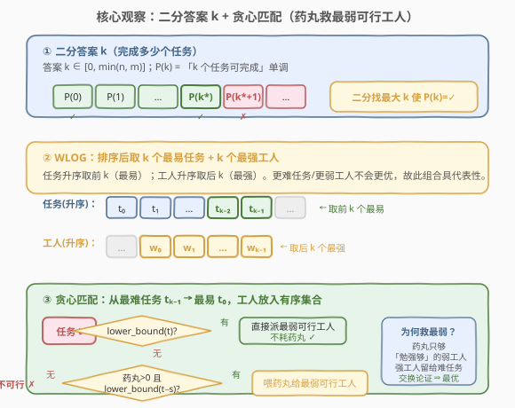
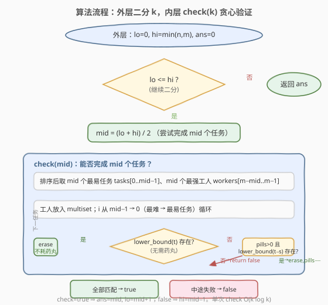
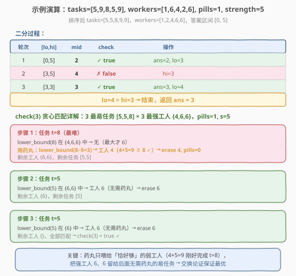

# LeetCode 你可以安排的最多任务数目 题解

## 1. 题目概述

- **标题 / 题号**：你可以安排的最多任务数目（#2071，hard）
- **链接**：https://leetcode.cn/problems/maximum-number-of-tasks-you-can-assign/
- **难度**：困难
- **标签**：数组、二分查找、贪心、有序集合

**题意**：给定 `tasks`（`n` 个任务的力量需求）和 `workers`（`m` 个工人的力量值）。每个工人**至多完成一个**任务，且需 `workers[j] >= tasks[i]`。另有 `pills` 片药丸，每片可让**一个**工人的力量值增加 `strength`，每个工人**至多服一片**。返回**最多**能完成的任务数。

**示例 1**：

```text
输入：tasks = [3,2,1], workers = [0,3,3], pills = 1, strength = 1
输出：3
解释：0 号工人服药 → 0+1≥1 完成任务 2；1 号工人完成任务 1；2 号工人完成任务 0。
```

**示例 2**：

```text
输入：tasks = [5,4], workers = [0,0,0], pills = 1, strength = 5
输出：1
解释：0 号工人服药 → 0+5≥5 完成任务 0；其余工人无力完成任务 1。
```

**示例 3**：

```text
输入：tasks = [10,15,30], workers = [0,10,10,10,10], pills = 3, strength = 10
输出：2
解释：0、1 号工人各服药完成 10、15；任务 30 即便服药也无人能完成。
```

**示例 4**：

```text
输入：tasks = [5,9,8,5,9], workers = [1,6,4,2,6], pills = 1, strength = 5
输出：3
解释：2 号工人服药 → 4+5≥8 完成任务 2；1、4 号工人分别完成两个 5。
```

**约束**：

- `1 <= n, m <= 5 * 10^4`
- `0 <= pills <= m`
- `0 <= tasks[i], workers[j], strength <= 10^9`

## 2. 解题思路

### 2.1 暴力思路

最朴素地，枚举「选哪些任务、派哪些工人、给谁吃药丸」的所有组合，再判定能否一一匹配。组合数是指数级，且匹配本身是二分图匹配（带药丸加成后），显然不可行。

退一步：固定「要完成 `k` 个任务」后，判定是否可行（`check(k)`）本身已不平凡——药丸分配使得工人与任务的匹配不再是简单的排序双指针。即便如此，`k` 的取值范围是 `[0, min(n, m)]`（可达 `5×10^4`），若每次 `check` 都能高效完成，便可在外层二分 `k`。

### 2.2 核心观察：二分答案 + 贪心匹配



关键直觉有两层：

**第一层——单调性 → 可二分。** 设 $P(k)$ 表示「能完成 $k$ 个任务」。若 $P(k)$ 成立，则去掉任意一个任务后 $P(k-1)$ 必然成立（少做一个更容易）。于是 $P$ 在 $k$ 上单调：左段全 true、右段全 false，存在分界点 $k^*$。在 `[0, min(n, m)]` 上二分找最大可行 `k` 即可。

**第二层——WLOG 化简 `check(k)`。** 判定 $P(k)$ 时不必枚举选哪 `k` 个任务、哪 `k` 个工人：

- **任务选最易的 `k` 个**：若任意 `k` 个任务可完成，把它们换成「`k` 个最易任务」只会更宽松。
- **工人选最强的 `k` 个**：同理，换成「`k` 个最强工人」只会更强。

故 `check(k)` 只需考察「排序后 `tasks` 前 `k` 个 × `workers` 后 `k` 个」这一组代表样本。

**第三层——贪心匹配（药丸救最弱可行工人）。** 把 `k` 个最强工人放入有序集合，**从最难任务向最易任务**逐个匹配：

1. **优先不服药**：在集合中找最小的 `worker >= task`（`lower_bound(task)`）。若存在，派该工人完成，**不耗药丸**——省下的药丸留给真正需要的人。
2. **必须服药**：若无人能直接完成且仍有药丸，找最小的 `worker >= task - strength`（`lower_bound(task - strength)`），喂药丸后完成。
3. 否则 `check` 失败。

> 💡 **为何「救最弱可行」而非救最强？** 我们从最难任务往最易处理。当前任务最难，后续只会更易。把药丸喂给「恰好够」的弱工人（`w + strength` 刚达到 `task`），可把强工人留给后续——后续易任务强工人无需药丸即可完成。强工人更「灵活」，留着更值。交换论证可证此贪心最优。

> ⚠️ **顺序不能反**：必须从**最难→最易**。若从易到难，会把强工人早早消耗在易任务上，难任务无人能做。

### 2.3 算法流程图



外层在 `[0, min(n, m)]` 上二分，`check(mid)=true` 则 `ans=mid, lo=mid+1`（尝试更多），否则 `hi=mid-1`。单次 `check` 为 $O(k \log k)$（`k` 次有序集合的查找/删除）。

### 2.4 示例演算



以示例 4 为例，排序后 `tasks=[5,5,8,9,9]`、`workers=[1,2,4,6,6]`，二分区间 `[0,5]`：

- `mid=2`：`check(2)` 取任务 `[5,5]`、工人 `{6,6}`，均直接匹配 → true，`ans=2, lo=3`。
- `mid=4`：`check(4)` 取任务 `[5,5,8,9]`、工人 `{2,4,6,6}`。任务 9 需药丸（`lower_bound(4)→4`，`4+5=9`），耗尽药丸后任务 8 无人能做 → false，`hi=3`。
- `mid=3`：`check(3)` 取任务 `[5,5,8]`、工人 `{4,6,6}`：
  - 任务 8：无 `worker≥8`；药丸 `lower_bound(3)→4`，`4+5=9≥8` ✓，erase 4，`pills=0`，余 `{6,6}`。
  - 任务 5：`lower_bound(5)→6`，直接派，erase 6，余 `{6}`。
  - 任务 5：`lower_bound(5)→6`，直接派，erase 6，余 `{}`。
  - 全部匹配 → true，`ans=3, lo=4`。
- `lo=4 > hi=3`，返回 `ans=3`。

## 3. 参考代码

### C++

```cpp
class Solution {
  public:
    int maxTaskAssign(vector<int>& tasks, vector<int>& workers, int pills, int strength) {
        sort(tasks.begin(), tasks.end());
        sort(workers.begin(), workers.end());
        int n = tasks.size(), m = workers.size();
        int lo = 0, hi = min(n, m), ans = 0;
        while (lo <= hi) {
            int mid = lo + (hi - lo) / 2;
            if (canDo(tasks, workers, pills, strength, mid)) {
                ans = mid;        // 可行，尝试完成更多
                lo = mid + 1;
            } else {
                hi = mid - 1;     // 太多，减少
            }
        }
        return ans;
    }

  private:
    // 验证：能否完成 k 个任务
    bool canDo(const vector<int>& tasks, const vector<int>& workers,
               int pills, int strength, int k) {
        if (k == 0) return true;
        int m = workers.size();
        // k 个最强工人入有序集合
        multiset<int> ws(workers.begin() + (m - k), workers.end());
        int p = pills;
        for (int i = k - 1; i >= 0; --i) {      // 最难 → 最易
            int t = tasks[i];
            auto it = ws.lower_bound(t);        // 优先不服药：最小 worker >= t
            if (it != ws.end()) {
                ws.erase(it);
            } else if (p > 0) {                 // 必须服药
                auto it2 = ws.lower_bound(t - strength);   // 最小 worker >= t - s
                if (it2 != ws.end()) {
                    ws.erase(it2);
                    --p;
                } else {
                    return false;
                }
            } else {
                return false;
            }
        }
        return true;
    }
};
```

### Python

```python
from sortedcontainers import SortedList

class Solution:
    def maxTaskAssign(self, tasks: List[int], workers: List[int],
                      pills: int, strength: int) -> int:
        tasks.sort()
        workers.sort()
        n, m = len(tasks), len(workers)

        def can_do(k: int) -> bool:
            if k == 0:
                return True
            ws = SortedList(workers[m - k:])    # k 个最强工人
            p = pills
            for i in range(k - 1, -1, -1):      # 最难 → 最易
                t = tasks[i]
                idx = ws.bisect_left(t)         # 优先不服药
                if idx < len(ws):
                    ws.pop(idx)
                elif p > 0:                     # 必须服药
                    idx = ws.bisect_left(t - strength)
                    if idx < len(ws):
                        ws.pop(idx)
                        p -= 1
                    else:
                        return False
                else:
                    return False
            return True

        lo, hi, ans = 0, min(n, m), 0
        while lo <= hi:
            mid = (lo + hi) // 2
            if can_do(mid):
                ans = mid
                lo = mid + 1
            else:
                hi = mid - 1
        return ans
```

> ⚠️ **三个易错点**：
> 1. **顺序是最难→最易**：`for (i = k-1; i >= 0; --i)`。反过来会过早消耗强工人，难任务无人能做。
> 2. **优先不服药**：先 `lower_bound(t)` 再 `lower_bound(t-strength)`。药丸是稀缺资源，能不服就不服。
> 3. **C++ 用成员 `lower_bound`**：`ws.lower_bound(t)` 是 $O(\log k)$；若误用 `std::lower_bound(ws.begin(), ws.end(), t)` 在非随机访问迭代器上退化为 $O(k)$，整体变 $O(k^2)$ 必 TLE。

> 💡 **Python 环境说明**：力扣 Python 预装 `sortedcontainers`，`SortedList.bisect_left` 与 `pop(idx)` 均为 $O(\log k)$。若面试不允许第三方库，可用值域线段树/树状数组 + 离散化替代，思路不变。

## 4. 复杂度分析

| 维度 | 复杂度 | 说明 |
|------|--------|------|
| 时间复杂度 | $O\bigl(L \log^2 L\bigr)$，$L = \min(n, m)$ | 外层二分 $O(\log L)$ 次；每次 `check` 建 multiset $O(k \log k)$ + `k` 次查找/删除 $O(k \log k)$ |
| 空间复杂度 | $O(L)$ | 有序集合存 `k` 个工人 |

> 💡 $L \le 5\times10^4$，$\log L \approx 16$，总运算量约 $5\times10^4 \times 16 \times 16 \approx 1.3\times10^7$，远低于时限。

## 5. 扩展：贪心正确性的交换论证

### 5.1 WLOG「最易任务 × 最强工人」为何有效

设存在某方案用任务集 $T$（$|T|=k$）与工人集 $W$（$|W|=k$）完成 $k$ 个任务。令 $T^*$ 为「$k$ 个最易任务」、$W^*$ 为「$k$ 个最强工人」，按升序下标对应：

- $T^*_i \le T_i$（最易任务不超过原任务难度），故能被 $W$ 完成的任务换成 $T^*$ 仍可被同一工人完成。
- $W^*_i \ge W_i$（最强工人不低于原工人），故 $W$ 能完成的任务 $W^*$ 也能完成。

所以 $T^*$ 由 $W^*$ 可完成 ⇔ $P(k)$ 成立。`check(k)` 只需检验这一组代表样本。

### 5.2 「优先不服药 + 救最弱可行」的交换论证

设当前最难任务为 $t$，贪心选择工人 $w_g$：

- **情况 A（不服药）**：$w_g = \min\{w \in W : w \ge t\}$。若最优解改用服药工人 $w_p$（$w_p + s \ge t$，$w_p < t$）完成 $t$，则 $w_g$ 被留给后续某易任务 $t' \le t$。把 $w_g$ 与 $w_p$ 对调：$w_g \ge t \ge t'$ 可不服药完成 $t'$，$w_p + s \ge t$ 服药完成 $t$，药丸用量不变，仍合法。故「不服药」不劣于「服药」。

- **情况 B（必须服药）**：$w_g = \min\{w \in W : w + s \ge t\}$（最弱可行）。若最优解改用更强的服药工人 $w_q > w_g$ 完成 $t$，则 $w_g$ 被留给后续 $t' \le t$。因 $w_g < w_q$ 且 $w_g + s \ge t \ge t'$，$w_g$ 加药丸可完成 $t'$；而 $w_q \ge w_g$，若 $w_q \ge t'$ 甚至可不服药。对调后药丸用量不增、合法性保持。故「救最弱」不劣于「救更强」。

两种情况合起来，贪心选择可经有限次交换变为最优解而不变差，故贪心最优。

> 💡 **处理顺序的必要性**：交换论证依赖「后续任务 $t' \le t$」（即从难到易），这样把强工人留给后续时，后续任务更易、强工人更可能不服药完成。若反向处理，$t' \ge t$，强工人留给后续反而更不够用，论证失效。

### 5.3 另一种 $O(k)$ 的双端队列写法

利用「从难到易 + 工人升序」的单调性，可用双端队列替代 multiset：维护一个「服药候选」队列，按需从队首/队尾取工人，单次 `check` 降到 $O(k)$。思路与 [239. 滑动窗口最大值](../0801-0900/239_滑动窗口最大值.md) 的单调队列同源，但实现细节更绕。本题 $L \le 5\times10^4$、multiset 写法已足够，且更直观、易讲清贪心，故采用 multiset 版。

## 6. 面试要点

1. **为什么能二分？单调性体现在哪？**

   - $P(k)$=「能完成 $k$ 个任务」。$P(k)$ 成立则 $P(k-1)$ 必成立（少做一个更易），故 $P$ 单调：小 $k$ 全 true、大 $k$ 全 false，存在分界点 $k^*$。此即二段性，可二分找最大可行 $k$。

2. **`check(k)` 为什么只看「最易 `k` 任务 × 最强 `k` 工人」？**

   - 任何可行方案的 `k` 个任务换成「`k` 个最易任务」只会更宽松；`k` 个工人换成「`k` 个最强工人」只会更强。故这一组具代表性：它能完成 ⇔ $P(k)$ 成立。详见 5.1 交换论证。

3. **为什么从最难任务往最易匹配，而不是反过来？**

   - 难任务能做的人少，应优先分配；易任务能做的人多，留到后面灵活。从难到易时，后续任务 $t' \le t$，强工人留着总能胜任；反向则后续更难、强工人可能不够。交换论证（5.2）也依赖此顺序。

4. **为什么「优先不服药」，且服药时选最弱可行工人？**

   - 药丸稀缺，能省则省：不服药完成当前任务，药丸留给真正需要的人。必须服药时选最弱可行（`lower_bound(t-s)`），把强工人留给后续易任务（强工人更可能不服药完成）。详见 5.2 交换论证。

5. **C++ 中 `multiset` 用 `lower_bound` 有什么坑？**

   - 必须用**成员函数** `ws.lower_bound(t)`，$O(\log k)$。若误用 `std::lower_bound(ws.begin(), ws.end(), t)`，因 `multiset` 迭代器非随机访问，退化为 $O(k)$，整体 $O(k^2)$ 必超时。删除同理用 `erase(it)` 删单个迭代器，勿 `erase(value)`（会删所有等值元素）。

## 同类练习题

| # | 题目 | 与本题的关联 |
|---|------|-------------|
| 875 | [爱吃香蕉的珂珂](https://leetcode.cn/problems/koko-eating-bananas/) | 二分答案母题，`check` 用向上取整求和，本题外层二分同骨架 |
| 1011 | [在 D 天内送达包裹的能力](https://leetcode.cn/problems/capacity-to-ship-packages-within-d-days/) | 二分答案 + 贪心验证，对照「最大化最小/最小化最大」类套路 |
| 410 | [分割数组的最大值](https://leetcode.cn/problems/split-array-largest-sum/) | 二分答案 + 贪心划分，困难题同范式 |
| 2576 | [求出最多标记下标](https://leetcode.cn/problems/find-the-maximum-number-of-marked-indices/) | 排序 + 贪心匹配（双指针二分答案），与本题 WLOG + 贪心匹配思路相通 |
| 2552 | [统计上升四元组](https://leetcode.cn/problems/count-increasing-quadruplets/) | 贪心匹配与有序集合维护候选集的进阶练习 |
