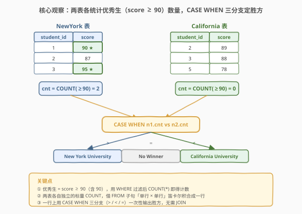
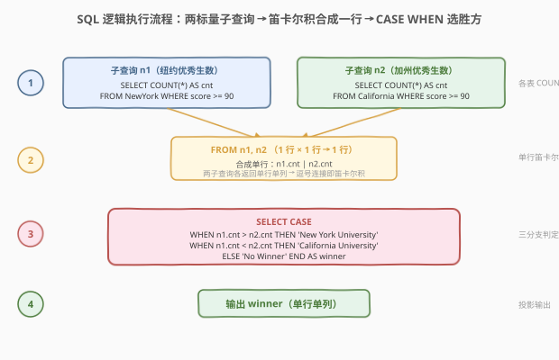
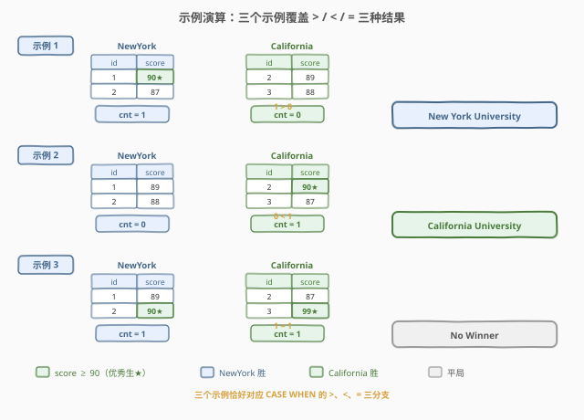

# LeetCode 赢得比赛的大学 题解

## 1. 题目概述

- **标题 / 题号**：赢得比赛的大学（#2072，easy）
- **链接**：https://leetcode.cn/problems/the-winner-university/
- **难度**：简单
- **标签**：数据库、SQL、`COUNT`、`WHERE` 过滤、`CASE WHEN`、标量子查询、笛卡尔积（隐式 `CROSS JOIN`）、LeetCode 锁题

**题意**：纽约大学和加州大学之间举行了一场比赛，由两所大学中**相同数量**的学生参加。**优秀学生**指考试中获得 `90` 分或更高成绩的学生。拥有**更多优秀学生**的大学赢得比赛；若两校优秀学生数**相同**，则平局。

给定 `NewYork` 和 `California` 两张表，各记录一所学校学生一次考试的成绩。编写 SQL 查询返回胜方：

- 纽约大学胜 → `"New York University"`
- 加州大学胜 → `"California University"`
- 平局 → `"No Winner"`

> ⚠️ 本题是 LeetCode **Plus 会员专享题（🔒）**，题面与示例来自力扣中文站。

**表结构**：

```text
Table: NewYork
+-------------+------+
| Column Name | Type |
+-------------+------+
| student_id  | int  |  ← 主键
| score       | int  |
+-------------+------+
每一行包含纽约大学一名学生一次考试的成绩。

Table: California
+-------------+------+
| Column Name | Type |
+-------------+------+
| student_id  | int  |  ← 主键
| score       | int  |
+-------------+------+
每一行包含加州大学一名学生一次考试的成绩。
```

**示例 1**：

```text
输入：
NewYork 表:
+------------+-------+
| student_id | score |
+------------+-------+
| 1          | 90    |
| 2          | 87    |
+------------+-------+
California 表:
+------------+-------+
| student_id | score |
+------------+-------+
| 2          | 89    |
| 3          | 88    |
+------------+-------+
输出：
+---------------------+
| winner              |
+---------------------+
| New York University |
+---------------------+
解释：纽约大学有 1 名优秀生（90），加州大学有 0 名。纽约大学胜。
```

**示例 2**：

```text
输入：
NewYork 表:
+------------+-------+
| student_id | score |
+------------+-------+
| 1          | 89    |
| 2          | 88    |
+------------+-------+
California 表:
+------------+-------+
| student_id | score |
+------------+-------+
| 2          | 90    |
| 3          | 87    |
+------------+-------+
输出：
+-----------------------+
| winner                |
+-----------------------+
| California University |
+-----------------------+
解释：纽约大学有 0 名优秀生，加州大学有 1 名（90）。加州大学胜。
```

**示例 3**：

```text
输入：
NewYork 表:
+------------+-------+
| student_id | score |
+------------+-------+
| 1          | 89    |
| 2          | 90    |
+------------+-------+
California 表:
+------------+-------+
| student_id | score |
+------------+-------+
| 2          | 87    |
| 3          | 99    |
+------------+-------+
输出：
+-----------+
| winner    |
+-----------+
| No Winner |
+-----------+
解释：两校各有 1 名优秀生，平局。
```

**约束**：

- `student_id` 是两表各自的主键
- `score` 为整数

> 💡 **审题关键**：① 「**优秀学生**」是 `score ≥ 90`（含 90），用 `WHERE score >= 90` 过滤后 `COUNT` 即得计数；② 胜负只看**优秀生数量**的比较，与学生总数、具体分数高低无关；③ 三种结果对应 `>`、`<`、`=` 三个分支，天然映射到 `CASE WHEN`。

## 2. 解题思路

### 2.1 暴力思路：两表分别查询再比较

最直觉的过程式思路：对每张表单独查出优秀生数，再在应用层用 `if/else` 比较。伪代码：

```text
ny_cnt  = SELECT COUNT(*) FROM NewYork     WHERE score >= 90
cal_cnt = SELECT COUNT(*) FROM California  WHERE score >= 90
if ny_cnt > cal_cnt:  return "New York University"
elif ny_cnt < cal_cnt: return "California University"
else:                 return "No Winner"
```

逻辑正确，但 SQL 的设计哲学是「**一次查询表达完整逻辑**」——把两次独立查询和一次比较揉进**一条 SQL**，既减少往返又更声明式。关键在于如何让两个独立的 `COUNT` 出现在**同一行**上供 `CASE WHEN` 比较。

### 2.2 核心观察：标量子查询 + 隐式笛卡尔积合成一行



**问题拆解为两个子问题**：

1. **每校的优秀生数**——各自是一个**标量子查询**（返回单行单列）：

   ```sql
   (SELECT COUNT(*) FROM NewYork    WHERE score >= 90)  -- → n1.cnt
   (SELECT COUNT(*) FROM California WHERE score >= 90)  -- → n2.cnt
   ```

2. **把两个标量合成一行再比较**——这是本题的核心技巧。把两个子查询放在 `FROM` 子句中用逗号连接：

   ```sql
   FROM (SELECT COUNT(*) AS cnt FROM NewYork     WHERE score >= 90) n1,
        (SELECT COUNT(*) AS cnt FROM California  WHERE score >= 90) n2
   ```

   逗号连接即**隐式笛卡尔积**（`CROSS JOIN`）。由于每个子查询各返回**恰好一行**，1 × 1 = 1 行，合成后的结果集只有一行，含 `n1.cnt` 和 `n2.cnt` 两列——正好供 `CASE WHEN` 在同一行上比较。

> 💡 **为什么是笛卡尔积而非 `JOIN ON`？** 两张表之间**没有关联键**——纽约大学的学生 `id` 与加州大学的 `id` 互不相干（示例中两表都出现 `student_id = 2` 但那是巧合）。我们需要的不是「按某键匹配」，而是「把两个独立统计结果并排放一起」。笛卡尔积恰好做这件事：无条件组合两表的每一行。又因两侧各一行，结果必为一行，无行数膨胀风险。

> ⚠️ **笛卡尔积的危险一般在于行数膨胀**（$n \times m$ 行），但本题两侧都是**单行标量子查询**，1 × 1 = 1，安全。若误对两张明细表直接笛卡尔积，会得到 $n \times m$ 行——所以**先聚合成单行再笛卡尔积**是关键。

**胜负判定**用 `CASE WHEN` 三分支：

$$\text{winner} = \begin{cases} \text{New York University} & n_1 > n_2 \\ \text{California University} & n_1 < n_2 \\ \text{No Winner} & n_1 = n_2 \end{cases}$$

### 2.3 算法流程图



**逻辑执行步骤**：

| 步骤 | 子句 | 作用 |
|------|------|------|
| ① | `FROM (SELECT COUNT(*) ... NewYork WHERE score>=90) n1` | 子查询：纽约优秀生数 → 单行单列 |
| ② | `, (SELECT COUNT(*) ... California WHERE score>=90) n2` | 子查询：加州优秀生数 → 单行单列；逗号即笛卡尔积，1×1→1 行 |
| ③ | `SELECT CASE WHEN n1.cnt > n2.cnt THEN ... WHEN ... < ... THEN ... ELSE 'No Winner' END` | 同一行上三分支比较，输出胜方 |
| ④ | `AS winner` | 命名输出列 |

> 💡 **SQL 子句执行顺序**：`FROM`（含子查询物化与笛卡尔积）→ `SELECT`（含 `CASE WHEN`）。先在 `FROM` 阶段把两个标量合成一行，`SELECT` 阶段的 `CASE WHEN` 直接引用该行的 `n1.cnt`、`n2.cnt` 做比较——无需 `JOIN`/`GROUP BY`。

### 2.4 示例演算



三个示例恰好对应 `CASE WHEN` 的三分支：

| 示例 | NewYork 优秀生 | California 优秀生 | 比较 | 分支 | 输出 |
|------|---------------|-------------------|------|------|------|
| 1 | 1（id=1, score=90） | 0 | $1 > 0$ | `>` | New York University |
| 2 | 0 | 1（id=2, score=90） | $0 < 1$ | `<` | California University |
| 3 | 1（id=2, score=90） | 1（id=3, score=99） | $1 = 1$ | `ELSE` | No Winner |

> 💡 **示例 3 的两校优秀生分数不同（90 vs 99）但都算「1 名优秀生」**——胜负只看**人数**不看分数高低。这印证了题意：优秀生是一个 `score ≥ 90` 的布尔判定，`COUNT` 只数行数。

## 3. 参考代码

### SQL（解法 A：标量子查询 + 笛卡尔积 + CASE WHEN，推荐）

```sql
SELECT
    CASE
        WHEN n1.cnt > n2.cnt THEN 'New York University'
        WHEN n1.cnt < n2.cnt THEN 'California University'
        ELSE 'No Winner'
    END AS winner
FROM
    (SELECT COUNT(*) AS cnt FROM NewYork    WHERE score >= 90) n1,
    (SELECT COUNT(*) AS cnt FROM California WHERE score >= 90) n2;
```

> 💡 **写法要点**：
> - **两个子查询各带 `WHERE score >= 90`**：先过滤再 `COUNT(*)`，得到各校优秀生数。`>=` 含 90 本身。
> - **`FROM n1, n2` 隐式笛卡尔积**：两个单行子查询合成一行。等价于 `FROM n1 CROSS JOIN n2`，但逗号写法更简洁，是 LeetCode SQL 题的常见惯用法。
> - **`CASE WHEN` 三分支**：`>` → NYU、`<` → Cal、`ELSE` → No Winner。`ELSE` 兜底相等情形，无需单独写 `=`。
> - **无需 `GROUP BY`/`JOIN ON`**：两表无关联键，笛卡尔积合成后已是一行，`CASE WHEN` 直接引用列比较。
> - ✓ **最推荐**：一条 SQL 表达完整逻辑，声明式、无应用层往返。

### SQL（解法 B：UNION ALL 堆叠 + 条件聚合，对照思路）

```sql
SELECT
    CASE
        WHEN SUM(school = 'NY')  > SUM(school = 'Cal') THEN 'New York University'
        WHEN SUM(school = 'NY')  < SUM(school = 'Cal') THEN 'California University'
        ELSE 'No Winner'
    END AS winner
FROM (
    SELECT 'NY' AS school FROM NewYork    WHERE score >= 90
    UNION ALL
    SELECT 'Cal'          FROM California WHERE score >= 90
) t;
```

> 💡 **解法 B 的思路**：先用 `UNION ALL` 把两校的优秀生行堆到同一列 `school`（NY/Cal 标签），再对外层用 `SUM(school = 'NY')` 数纽约优秀生数、`SUM(school = 'Cal')` 数加州优秀生数——`SUM(布尔表达式)` 把 `TRUE` 当 1 累加，等价于条件 `COUNT`。
>
> **与解法 A 的关系**：逻辑等价。区别在于**数据组织方向**——解法 A「两个标量并排放」（横向），解法 B「两批行堆起来再聚合」（纵向）。解法 B 的优势是**只需扫一遍合并结果集**、且当涉及「更多学校」时扩展性好（再加一个 `UNION ALL` 分支即可）；解法 A 更直观地对应「两个数比大小」的题意。MySQL 中 `SUM(布尔)` 可用，PostgreSQL 需写 `SUM(CASE WHEN school='NY' THEN 1 ELSE 0 END)` 或 `COUNT(*) FILTER (WHERE school='NY')`。

### SQL（解法 C：CROSS JOIN 显式写法，语义对照）

```sql
SELECT
    CASE
        WHEN n1.cnt > n2.cnt THEN 'New York University'
        WHEN n1.cnt < n2.cnt THEN 'California University'
        ELSE 'No Winner'
    END AS winner
FROM
    (SELECT COUNT(*) AS cnt FROM NewYork    WHERE score >= 90) n1
    CROSS JOIN
    (SELECT COUNT(*) AS cnt FROM California WHERE score >= 90) n2;
```

> 💡 **解法 C 与解法 A 完全等价**——`FROM a, b` 是 `FROM a CROSS JOIN b` 的隐式简写。SQL-92 标准推荐显式 `CROSS JOIN` 以提高可读性（明确表达「我知道这是笛卡尔积」），但 LeetCode 中逗号写法更常见。两者执行计划相同。

### Python（pandas）

```python
import pandas as pd

def winner_university(new_york: pd.DataFrame, california: pd.DataFrame) -> pd.DataFrame:
    ny_cnt = int((new_york['score'] >= 90).sum())
    cal_cnt = int((california['score'] >= 90).sum())
    if ny_cnt > cal_cnt:
        winner = 'New York University'
    elif ny_cnt < cal_cnt:
        winner = 'California University'
    else:
        winner = 'No Winner'
    return pd.DataFrame({'winner': [winner]})
```

> 💡 **pandas 对照**：`(new_york['score'] >= 90).sum()` 对应 `SELECT COUNT(*) FROM NewYork WHERE score >= 90`——布尔 Series 求和即 `TRUE` 的个数。两个标量在 Python 中用 `if/elif/else` 比较，对应 SQL 的 `CASE WHEN` 三分支。返回单行 DataFrame 对应 SQL 单行单列输出。

## 4. 复杂度分析

| 维度 | 解法 A（标量+笛卡尔积） | 解法 B（UNION ALL） | pandas |
|------|------------------------|---------------------|--------|
| **时间** | $O(n + m)$ | $O(n + m)$ | $O(n + m)$ |
| **空间** | $O(1)$（两标量） | $O(n + m)$（合并行集） | $O(n + m)$ |
| **扫表次数** | 各表 1 次 | 各表 1 次 | 各表 1 次 |
| **可读性** | ✓ 直观对应题意 | ✓ 扩展性好 | ✓ 清晰 |
| **推荐度** | ✓ **首选** | ✓ 对照/多校扩展 | ✓ 验证用 |

> - $n$ = `NewYork` 行数，$m$ = `California` 行数
> - **时间**：两解法都各扫一遍表过滤 `score >= 90` 并计数，$O(n + m)$。若 `score` 上有索引，可走索引范围扫描加速过滤。
> - **空间**：解法 A 的子查询各物化一个标量，$O(1)$；解法 B 需把两校优秀生行堆成中间结果集，最坏 $O(n + m)$。
> - **索引优化**：在 `score` 上建索引可让 `WHERE score >= 90` 走索引范围扫描，避免全表扫描。但 `COUNT(*)` 仍需访问匹配行（除非有覆盖索引）。

## 5. 扩展：标量聚合的笛卡尔积合成模式

本题的核心技巧——「**多个标量子查询用 `FROM` 逗号连接合成一行**」——是 SQL 中组合**独立统计量**的通用模式。

### 5.1 模式提炼

当需要把 $k$ 个**互不相关**的标量统计结果放在同一行比较/组合时，模板为：

```sql
SELECT ...
FROM (SELECT AGG(...) FROM t1 WHERE ...) a,
     (SELECT AGG(...) FROM t2 WHERE ...) b,
     (SELECT AGG(...) FROM t3 WHERE ...) c
-- a/b/c 各返回一行 → 合成 1 行 × k 列
```

> 💡 **关键前提**：每个子查询必须返回**恰好一行**（标量聚合如 `COUNT`/`SUM`/`MAX` 天然满足，即使输入为空也返回一行 `0`/`NULL`）。若某子查询返回多行，笛卡尔积会膨胀——此时应改用 `JOIN ON` 或先在外层 `LIMIT 1`。

### 5.2 与 JOIN ON 的区别

| 场景 | 用法 | 连接条件 |
|------|------|---------|
| 两表有**关联键**（如外键） | `INNER/LEFT JOIN ON a.id = b.id` | 按键匹配 |
| 两表**无关联**，需并排统计 | `FROM a, b`（笛卡尔积） | 无条件（前提：各单行） |
| 多表**纵向堆叠** | `UNION ALL` | 无（行拼接） |

> ⚠️ **常见误区**：看到两张表就想 `JOIN`。但 `JOIN ON` 需要**关联条件**——本题两校学生 `id` 互不相干（`student_id` 是各自表的主键，不是跨表外键），强行 `JOIN ON student_id` 会丢失只在一表出现的学生。无关联时正确的「并排」方式是笛卡尔积（前提单行）或 `UNION ALL`（堆叠）。

### 5.3 若扩展为多校联赛

假如比赛有 $k$ 所大学（$k$ 张表），解法 B 的 `UNION ALL` 扩展性更好——再加一个分支即可，然后用 `GROUP BY` 或窗口函数取优秀生数最多者：

```sql
WITH excellent AS (
    SELECT 'NY'  AS school FROM NewYork     WHERE score >= 90
    UNION ALL
    SELECT 'Cal'         FROM California    WHERE score >= 90
    UNION ALL
    SELECT 'Tex'         FROM Texas         WHERE score >= 90
)
SELECT school AS winner
FROM excellent
GROUP BY school
ORDER BY COUNT(*) DESC, school
LIMIT 1;
```

> 💡 解法 A 的笛卡尔积写法在 $k$ 校时会变成 $k$ 个子查询的 $k$ 元笛卡尔积，虽仍可行（各单行），但 `CASE WHEN` 的分支数随 $k$ 平方增长，不如 `UNION ALL + GROUP BY` 简洁。这体现了两种模式的适用边界：**少量横向并排**用笛卡尔积，**多源纵向比较**用 `UNION ALL`。

## 6. 面试要点

1. **为什么用笛卡尔积（`FROM n1, n2`）而不是 `JOIN ON`？**

   > 两张表之间没有关联键——`student_id` 是各自表的主键，不是跨表外键，两校学生 id 互不相干。我们需要的是「把两个独立统计结果并排放一行」而非「按键匹配」。笛卡尔积无条件组合两表的每一行；又因两侧各是单行标量子查询，1×1=1，无膨胀风险。若强行 `JOIN ON student_id`，会丢失只在一表出现的学生，计数失真。

2. **笛卡尔积一般很危险，本题为什么安全？**

   > 笛卡尔积的危险在于行数膨胀（$n \times m$ 行）。本题 `FROM` 中的两个子查询各返回**恰好一行**（`COUNT(*)` 是标量聚合，即使输入为空也返回一行 `0`），1 × 1 = 1 行，结果集始终单行。安全的前提是「**先聚合成单行，再笛卡尔积**」——若对两张明细表直接笛卡尔积则危险。

3. **`CASE WHEN` 的三个分支为什么用 `>`、`<`、`ELSE` 而非写 `=`？**

   > `>` 和 `<` 已覆盖两种「有胜方」情形，剩下的「相等」自然落入 `ELSE`。显式写 `WHEN n1.cnt = n2.cnt THEN 'No Winner'` 也可，但 `ELSE` 更简洁且避免遗漏边界。`CASE WHEN` 按顺序短路，`ELSE` 兜底所有未命中情况。

4. **`FROM a, b` 和 `FROM a CROSS JOIN b` 有区别吗？**

   > 完全等价。`FROM a, b` 是 SQL-89 的隐式笛卡尔积写法，`CROSS JOIN` 是 SQL-92 的显式写法。执行计划相同。SQL-92 推荐显式 `CROSS JOIN` 以提高可读性、明确表达意图，但 LeetCode 中逗号写法更常见。

5. **解法 A（笛卡尔积）和解法 B（UNION ALL）各适合什么场景？**

   > 解法 A 直观对应「两个数比大小」的题意，少量横向并排时简洁；解法 B 把两校优秀生行堆叠后聚合，扩展性好——当学校数增多时只需加 `UNION ALL` 分支，配合 `GROUP BY` 取最多者，而 `CASE WHEN` 分支数随学校数平方增长，扩展性差。少量比较用 A，多源比较用 B。

> 💡 **一句话总结**：2072 的核心是「**标量子查询 + 隐式笛卡尔积合成一行 + CASE WHEN 三分支**」——两表各 `COUNT(WHERE score>=90)` 得标量，`FROM n1, n2` 把两个单行合成一行（1×1=1，无膨胀），`CASE WHEN >/<`/ELSE 选胜方。关键洞察：两表无关联键时用笛卡尔积「并排」而非 `JOIN ON`「匹配」，且前提是先聚合成单行。

## 同类练习题

| # | 题目 | 与本题的关联 |
|---|------|-------------|
| 1990 | [统计实验的数量](https://leetcode.cn/problems/count-the-number-of-experiments/)（[题解](../1901-2000/1990_统计实验的数量.md)) | `CROSS JOIN` 把多个独立计数合成一行——与 2072 同属「无关联表并排统计」模式，用笛卡尔积组合多平台的实验数 |
| 1965 | [丢失信息的雇员](https://leetcode.cn/problems/employees-with-missing-information/)（[题解](../1901-2000/1965_丢失信息的雇员.md)） | `UNION ALL` 堆叠两表后比较——与 2072 解法 B 同属「纵向堆叠 + 聚合比较」范式，巩固 `UNION ALL` 组合无关联表的能力 |
| 1633 | [各赛事的用户注册率](https://leetcode.cn/problems/percentage-of-users-attended-a-contest/)（[题解](../1601-1700/1633_各赛事的用户注册率.md)） | `COUNT` + 比率 + `ORDER BY`——同为 `COUNT` 聚合比较题，关注比率排序而非三分支判定 |
| 1757 | [可回收且低脂的产品](https://leetcode.cn/problems/find-products-that-are-recyclable-and-low-fat/)（[题解](../1701-1800/1757_可回收且低脂的产品.md)） | `WHERE` + `AND` 谓词过滤——最简行级过滤，巩固 `WHERE` 过滤基础，是 2072 中 `WHERE score >= 90` 的入门原型 |
| 1173 | [即时食物配送 I](https://leetcode.cn/problems/immediate-food-delivery-i/) | `ROUND` + `AVG` + `CASE WHEN` 比率——`CASE WHEN` 做条件聚合的对照题，与 2072 的 `CASE WHEN` 做三分支判定互为补充 |
