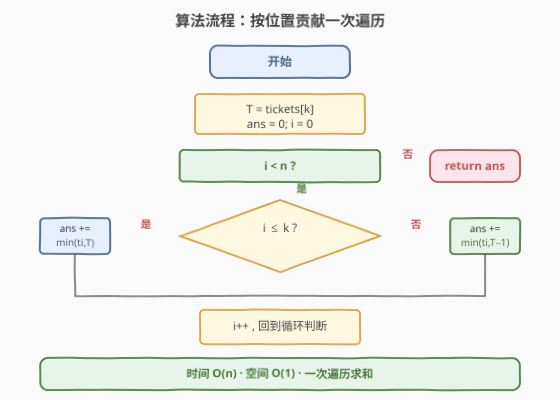

# LeetCode 买票需要的时间 题解

## 1. 题目概述

- **标题 / 题号**：买票需要的时间（#2073，easy）
- **链接**：https://leetcode.cn/problems/time-needed-to-buy-tickets/
- **难度**：简单
- **标签**：队列、数组、模拟、数学

**题意**：有 `n` 个人排队买票，第 `0` 个人站在队伍**最前方**，第 `n-1` 个人站在**最后方**。给定下标从 `0` 开始的整数数组 `tickets`，其中 `tickets[i]` 表示第 `i` 个人想买的票数。

每个人买票需要**恰好 1 秒**，且**一次只能买一张票**。如果还需要买更多票，必须走到**队尾**重新排队（瞬间完成，不计时间）；如果没有剩余票要买，则**离开**队伍。

返回位于位置 `k` 的人完成买票所需的时间（秒）。

**示例 1**：

```text
输入：tickets = [2,3,2], k = 2
输出：6
解释：
- 队伍一开始为 [2,3,2]，第 k 个人以下划线标识。
- 第 1 秒：队首买一张 → [3,2,1]
- 第 2 秒：[2,1,2]
- 第 3 秒：[1,2,1]
- 第 4 秒：[2,1]（某人买完离开）
- 第 5 秒：[1,1]
- 第 6 秒：[1]，第 k 个人完成买票，返回 6。
```

**示例 2**：

```text
输入：tickets = [5,1,1,1], k = 0
输出：8
解释：
- 队伍一开始为 [5,1,1,1]，第 k 个人以下划线标识。
- 第 1 秒：[1,1,1,4]
- 继续过程 3 秒，第 4 秒变为 [4]
- 继续过程 4 秒，第 8 秒变为 []，第 k 个人完成买票，返回 8。
```

**约束**：

- $n == \text{tickets.length}$
- $1 \leq n \leq 100$
- $1 \leq \text{tickets}[i] \leq 100$
- $0 \leq k < n$

> 💡 **审题关键**：① 买票是**循环轮转**的——每个人买完一张就跑到队尾，本质是「按位置轮流各买一张」的**轮次**结构；② 题目只关心**第 `k` 个人买完的那一刻**，一旦 `k` 买完立即停止，**之后的人无需再算**；③ 每个人最多买 `tickets[k]` 或 `tickets[k]-1` 张就轮到 `k` 收尾——这正是把模拟压缩成一次遍历的钥匙。

## 2. 解题思路

### 2.1 暴力思路：队列模拟

最直观的做法：用一个队列**真实模拟**买票过程。

- 把每个人的 `(下标, 剩余票数)` 入队。
- 每秒从队首取出一人，买一张票（剩余票数 `-1`，时间 `+1`）：
  - 若此人是位置 `k` 且剩余票数变为 `0`，**立即返回**当前时间。
  - 若此人剩余票数仍 `> 0`，重新推入队尾。
  - 若剩余票数为 `0`（非 `k`），直接离开（不入队）。

- **正确性**：完全复现题目描述的轮转过程，必然得到正确答案。
- **效率**：总买票秒数至多 $\sum \text{tickets}[i] \leq 100 \times 100 = 10^4$，每秒一次入队/出队，$O(\sum \text{tickets}[i])$ 时间、$O(n)$ 空间。本题数据规模下完全够用。

> ⚠️ 暴力的浪费在于：它把**每一个人的每一次买票**都逐一走过，却没有利用「**第 `k` 个人最多经历 `tickets[k]` 轮**」这一上界。一旦意识到 `k` 的票数决定了所有人在它之前/之后最多能买几张，就能从「逐秒模拟」跃迁到「按人求和」。

### 2.2 核心观察：按位置贡献一次遍历

![核心观察：k 买 tickets[k] 张 ⇒ 轮次上界，按位置 i≤k / i&gt;k 分两类贡献](../images/2073_contribution_concept.svg)

整个解法建立在**两个关键观察**上。

**观察 1：第 `k` 个人恰好在第 `tickets[k]` 轮完成买票**

把「队伍走完一圈、每个人各买一张」称为一个**轮次**。第 `k` 个人每轮恰好买一张票，所以需要恰好 `tickets[k]` 个轮次才能买完。换言之，在 `k` 完成买票前，整个队伍最多完整地转过 `tickets[k]` 轮（最后一轮 `k` 买完即停）。

**观察 2：位置 `i` 相对 `k` 决定其参与轮数**

以 `k` 为分界，把所有人分成两类：

| 位置 | 最多参与几轮 | 每轮买 1 张 ⇒ 贡献秒数 |
|------|-------------|----------------------|
| $i \leq k$（在 `k` 前面或就是 `k`） | `tickets[k]` 轮（每轮都在 `k` 之前轮到） | $\min(\text{tickets}[i],\ \text{tickets}[k])$ |
| $i > k$（在 `k` 后面） | `tickets[k] - 1` 轮（第 `tickets[k]` 轮 `k` 买完即停，后面的人没机会轮到） | $\min(\text{tickets}[i],\ \text{tickets}[k] - 1)$ |

> 💡 **为什么 `i > k` 少一轮？** 在每个轮次里，队伍从队首开始依次买票。第 `k` 个人在第 `tickets[k]` 轮轮到自己时买下最后一张票并离开——此时排在 `k` **后面**的人在这一轮根本没轮到，过程就结束了。所以 `i > k` 的人至多参与前 `tickets[k] - 1` 轮。

$$\boxed{\text{answer} = \sum_{i \leq k} \min(\text{tickets}[i],\ \text{tickets}[k]) \;+\; \sum_{i > k} \min(\text{tickets}[i],\ \text{tickets}[k] - 1)}$$

**用示例 1 验证**：`tickets = [2,3,2]`, `k = 2`, $\text{tickets}[k] = 2$。

- $i=0 \leq k$：$\min(2, 2) = 2$
- $i=1 \leq k$：$\min(3, 2) = 2$
- $i=2 \leq k$：$\min(2, 2) = 2$
- 合计 $= 6$ ✓

### 2.3 算法流程图



**完整步骤**：

1. 记 `T = tickets[k]`，初始化 `ans = 0`。
2. **遍历** `i` 从 `0` 到 `n-1`：
   - 若 `i <= k`：`ans += min(tickets[i], T)`。
   - 若 `i > k`：`ans += min(tickets[i], T - 1)`。
3. **返回** `ans`。

> ⚠️ **一个易错点**：`i > k` 分支用的是 `T - 1` 而非 `T`。若误用 `T`，会把 `k` 后面的人多算一轮，导致答案偏大。直觉上：`k` 买完即停，排在它后面的人在最后一轮「还没轮到」就被打断了。

### 2.4 示例演算

以 `tickets = [2,3,2]`, `k = 2`（$T = 2$）逐步演算：

![示例演算：3 人各按位置贡献，i≤k 取 min(tickets[i],2)，合计 6 秒](../images/2073_example_walkthrough.svg)

| 位置 $i$ | $\text{tickets}[i]$ | 与 $k$ 关系 | 参与轮数上界 | 实际贡献 $\min$ | 累计 `ans` |
|---------|---------------------|------------|-------------|----------------|-----------|
| 0 | 2 | $i \leq k$ | 2 | $\min(2, 2) = 2$ | 2 |
| 1 | 3 | $i \leq k$ | 2 | $\min(3, 2) = 2$ | 4 |
| 2 | 2 | $i \leq k$（就是 $k$） | 2 | $\min(2, 2) = 2$ | 6 |

合计 `ans = 6`。

> 💡 **对照示例 2** `tickets = [5,1,1,1]`, `k = 0`（$T = 5$）：$i=0$ 贡献 $\min(5,5)=5$；$i=1,2,3$ 均 $i > k$，各贡献 $\min(1, 4)=1$，合计 $5+1+1+1=8$ ✓。注意 $k=0$ 时「后面的人」就是除 `k` 外的**所有人**，它们都按 `T-1=4` 取 min。

## 3. 参考代码

### 方法一：按位置贡献一次遍历（$O(n)$，推荐）

### C++

```cpp
class Solution {
public:
    int timeRequiredToBuy(vector<int>& tickets, int k) {
        int T = tickets[k], ans = 0;
        for (int i = 0; i < (int)tickets.size(); ++i) {
            ans += (i <= k) ? min(tickets[i], T) : min(tickets[i], T - 1);
        }
        return ans;
    }
};
```

### Python

```python
class Solution:
    def timeRequiredToBuy(self, tickets: list[int], k: int) -> int:
        T = tickets[k]
        return sum(min(t, T) if i <= k else min(t, T - 1)
                   for i, t in enumerate(tickets))
```

> 💡 **写法要点**：① `T = tickets[k]` 提前取出，避免循环里反复索引；② `i <= k` 用 `<=`——`k` 本身归入「前面」一类，贡献恰为 $\min(\text{tickets}[k], T) = T$，即 `k` 自己买的 `T` 张票；③ `i > k` 用 `T - 1`，对应最后一轮被打断。

### 方法二：队列模拟（$O(\sum \text{tickets}[i])$，思路对照）

### C++

```cpp
class Solution {
public:
    int timeRequiredToBuy(vector<int>& tickets, int k) {
        queue<pair<int,int>> q;
        for (int i = 0; i < (int)tickets.size(); ++i)
            q.push({i, tickets[i]});
        int time = 0;
        while (!q.empty()) {
            auto [i, left] = q.front(); q.pop();
            --left;
            ++time;
            if (i == k && left == 0) return time;
            if (left > 0) q.push({i, left});
        }
        return time;
    }
};
```

### Python

```python
from collections import deque

class Solution:
    def timeRequiredToBuy(self, tickets: list[int], k: int) -> int:
        q = deque(enumerate(tickets))
        time = 0
        while q:
            i, left = q.popleft()
            left -= 1
            time += 1
            if i == k and left == 0:
                return time
            if left > 0:
                q.append((i, left))
        return time
```

> 💡 模拟法忠实复现轮转过程，适合用来验证答案；但在数据规模放大时（如 $\sum \text{tickets}[i]$ 达 $10^9$）会超时，此时只有方法一的 $O(n)$ 能通过。

## 4. 复杂度分析

| 维度 | 方法 | 复杂度 | 说明 |
|------|------|--------|------|
| 时间 | 按位置贡献 | $O(n)$ | 一次遍历，每个位置 $O(1)$ 取 $\min$ 累加 |
| 空间 | 按位置贡献 | $O(1)$ | 仅 `T`、`ans` 两个标量 |
| 时间 | 队列模拟 | $O(\sum \text{tickets}[i])$ | 每秒一次出/入队，总秒数即答案 |
| 空间 | 队列模拟 | $O(n)$ | 队列至多存 `n` 人 |

> 💡 本题 $n \leq 100$、$\text{tickets}[i] \leq 100$，两种方法都能通过。但方法一把「逐秒模拟」压缩为「按人求和」，从 $O(\sum \text{tickets}[i])$ 降到 $O(n)$——这是**用数学观察换计算量**的典型范例：抓住「`k` 的票数决定所有人参与轮数上界」这一不变量，就能跳过中间过程直接求和。

## 5. 扩展：若数据规模放大

假设题目放宽约束到 $n \leq 10^5$、$\text{tickets}[i] \leq 10^9$，则队列模拟的 $O(\sum \text{tickets}[i])$ 必然超时，而方法一的 $O(n)$ 依然轻松通过。

进一步，若把「每人买 1 张」改为「每人每轮买 $c$ 张」（$c$ 可变），则第 `k` 个人完成所需轮数为 $\lceil \text{tickets}[k] / c \rceil$，其余人的贡献上限相应变为 $\min(\text{tickets}[i],\ \lceil T/c \rceil \cdot c)$ 或类似形式——核心思路（按位置分类 + 取 $\min$）依然成立，只需调整轮次与每轮购票量的换算。

> 💡 这类「**循环轮转中求某元素完成时刻**」的问题，通用套路是：① 找到目标元素完成所需的**轮数上界**；② 按位置是否在目标之前/之后分类，对每个人取「自身需求」与「轮数上界」的 $\min$ 求和。关键在于识别「轮次」这一结构并算清边界。

## 6. 面试要点

**Q1：为什么 `i > k` 的人少参与一轮？**

> 在每个轮次中，队伍从队首依次买票。第 `k` 个人在第 `tickets[k]` 轮轮到自己时买下最后一张票并离开，过程**立即终止**。排在 `k` 后面的人在这一轮还没轮到就被打断，所以最多只参与前 `tickets[k] - 1` 轮。

**Q2：`k` 本身的贡献怎么算？为什么归入 `i <= k` 一类？**

> `k` 归入 `i <= k` 一类，贡献为 $\min(\text{tickets}[k], T) = \min(T, T) = T$，正好是 `k` 自己买的 `T` 张票、每张 1 秒。把它放在「前面」一类是因为在每一轮里 `k` 都会轮到自己（它就是队中一员），与「在 `k` 前面」的人在轮次结构上等价——都完整参与 `T` 轮。

**Q3：如果误把 `i > k` 也用 `T` 而非 `T - 1`，会怎样？**

> 会把排在 `k` 后面的人多算一轮，答案偏大。例如示例 1 中 $i$ 无 `> k` 的情况看不出差异；但示例 2 `tickets=[5,1,1,1], k=0` 中，若 $i=1,2,3$ 都用 `min(1, 5)=1`（而非 `min(1, 4)=1`），此处恰好相同，但若后面的人票数较大（如 `tickets=[5,3], k=0`），正确答案应为 $5 + \min(3,4)=8$，误用 `T` 则得 $5+\min(3,5)=8$——此时仍相同，因为后面的人票数未超 $T-1$。真正出错在后面的人票数 $\geq T$ 时，如 `tickets=[3,5], k=0`：正确 $3+\min(5,2)=5$，误用得 $3+\min(5,3)=6$，多算 1 秒。

**Q4：队列模拟法和数学法分别适合什么场景？**

> 模拟法思路直观、不易出错，适合数据规模小（$\sum \text{tickets}[i]$ 可接受）或题目过程复杂难以推导公式时作为保底；数学法（按位置贡献）适合数据规模大、需 $O(n)$ 高效通过时。面试中可先说模拟法建立正确性信心，再推导数学法展示优化能力。

**Q5：本题的「轮次」思想还能迁移到哪些问题？**

> 任何「循环队列中求某元素首次满足条件的时刻」都可套用：先算目标元素的轮数上界，再按位置前后分类求和。例如约瑟夫环问题（求第 `k` 个出圈的人）也含轮次结构，只是每轮删除一人、计数规则不同，需调整每轮的「步长」与「位置映射」。

> 💡 **一句话总结**：`k` 要买 `T = tickets[k]` 张 ⇒ 经历 `T` 轮 ⇒ 排在 `k` 前面（含 `k`）的人各贡献 $\min(\text{tickets}[i], T)$，排在后面的人各贡献 $\min(\text{tickets}[i], T-1)$，一次遍历求和即得答案。$O(n)$ 时间、$O(1)$ 空间。

## 同类练习题

| # | 题目 | 与本题的关联 |
|---|------|-------------|
| 1700 | [无法吃午餐的学生数量](https://leetcode.cn/problems/number-of-students-unable-to-eat-lunch/) | 队列模拟 + 计数优化——同为队列轮转问题，但终止条件改为「剩余学生都不喜欢栈顶三明治」，可用计数代替模拟 |
| 933 | [最近的请求次数](https://leetcode.cn/problems/number-of-recent-calls/) | 队列维护时间窗口——队列结构的基础应用，按时间入队/出队 |
| 950 | [按既定顺序创建队列](https://leetcode.cn/problems/reveal-cards-in-increasing-order/) | 队列轮转模拟——反向用队列模拟发牌轮转过程，体会队列「队首取出、队尾追加」的循环结构 |
| 2894 | [分类求和并舍弃数位](https://leetcode.cn/problems/divisible-and-non-divisible-sums-difference/) | 按分类一次遍历求和——同属「按条件分类 + 数学求和」的简单题，体会分类求和的思路 |
