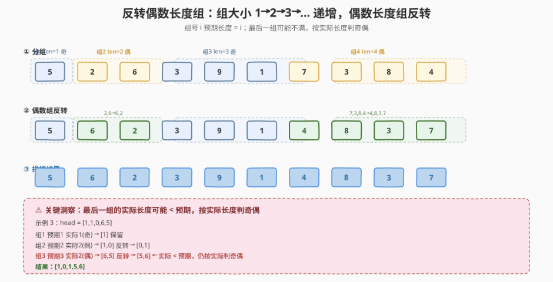
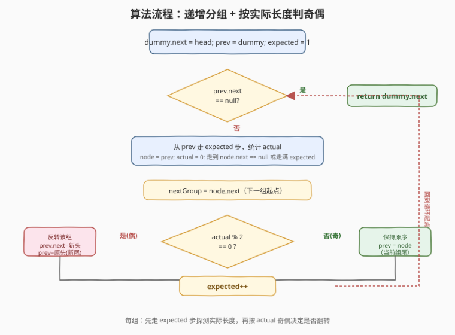
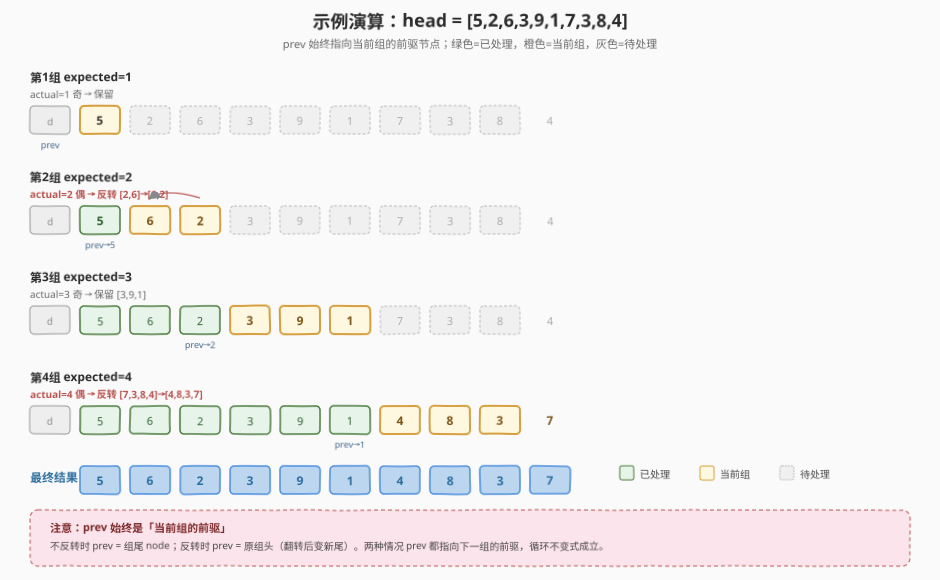

# 反转偶数长度组的节点

- **题目名称**：反转偶数长度组的节点
- **链接**：[2074. 反转偶数长度组的节点](https://leetcode.cn/problems/reverse-nodes-in-even-length-groups/)
- **难度**：中等
- **标签**：链表、分段处理、翻转、指针操作

## 1. 题目概述

给定单链表的头节点 `head`。链表节点**依次**被分入长度为 `1, 2, 3, 4, …` 的组（第 $i$ 组预期长度为 $i$）。**最后一组可能不满**——剩余节点数可能小于其预期长度。请将**实际长度为偶数**的组反转，返回修改后链表的头节点。不能改节点内部的值，只能改指针。

**示例 1**：

```text
输入：head = [5,2,6,3,9,1,7,3,8,4]
输出：[5,6,2,3,9,1,4,8,3,7]
解释：
  组1 (len=1): [5]        → 奇，保留
  组2 (len=2): [2,6]      → 偶，反转 → [6,2]
  组3 (len=3): [3,9,1]    → 奇，保留
  组4 (len=4): [7,3,8,4]  → 偶，反转 → [4,8,3,7]
  拼接：5 → 6 → 2 → 3 → 9 → 1 → 4 → 8 → 3 → 7
```

**示例 2**：

```text
输入：head = [1,1,0,6]
输出：[1,0,1,6]
解释：
  组1 (len=1): [1]    → 奇，保留
  组2 (len=2): [1,0]  → 偶，反转 → [0,1]
  组3 (预期3，实际1): [6]  → 奇，保留
  拼接：1 → 0 → 1 → 6
```

**示例 3**：

```text
输入：head = [1,1,0,6,5]
输出：[1,0,1,5,6]
解释：
  组1 (len=1): [1]         → 奇，保留
  组2 (len=2): [1,0]       → 偶，反转 → [0,1]
  组3 (预期3，实际2): [6,5] → 偶（按实际长度！）→ 反转 → [5,6]
  拼接：1 → 0 → 1 → 5 → 6
```

**约束条件**：

- 链表中节点数目范围 `[1, 10^5]`
- `0 <= Node.val <= 10^5`

> 💡 **审题关键**：① 组大小**递增**（1, 2, 3, …），不是固定 $k$；② 最后一组可能不满，**用实际长度判奇偶**而非预期长度——示例 3 中组 3 预期 3 实际 2，因 2 为偶故反转；③ 只反转偶数长度的组，奇数长度的组保持原序；④ 只改指针不改值。

---

## 2. 解题思路

### 2.1 暴力思路：转数组分组反转再重建

遍历链表把所有节点存入数组，按 `1, 2, 3, …` 切分各组，对偶数长度的组反转数组片段，最后用反转后的节点序列重建链表。

- **正确性**：显然正确。
- **效率**：时间 $O(n)$，但空间 $O(n)$（数组），且不符合「改指针不改值」的要求，面试官通常不满意。

> ⚠️ 瓶颈在于额外 $O(n)$ 空间。能否纯指针操作 + $O(1)$ 空间？突破口是借鉴 [25. K 个一组翻转链表](../0001-0100/25_K个一组翻转链表.md) 的「dummy + 分组 + 局部翻转 + 串接」骨架，把固定 $k$ 换成递增的 `expected`，并引入「先探测实际长度再决定是否翻转」的两阶段处理。

### 2.2 核心观察：递增分组 + 按实际长度判奇偶 + 局部翻转



本题在 K 个一组翻转链表的基础上引入两个变化：

**变化一：组大小递增而非固定。**

第 $i$ 组的预期长度为 $i$（从 1 开始递增）。外层循环不再用固定 `k`，而是维护一个递增的 `expected` 变量，每处理完一组 `expected++`。

**变化二：先探测实际长度，再决定是否翻转。**

K 个一组翻转中，不足 $k$ 的组**保持原序且一定翻转判定为否**（因为不足就 break）。但本题的最后一组可能不满，且**不满的组仍可能需要翻转**——取决于它的**实际长度**奇偶（示例 3：组 3 预期 3 实际 2，偶数，仍需反转）。

因此每组处理分为两阶段：

1. **探测阶段**：从 `prev` 走 `expected` 步（遇 `null` 提前停），统计**实际长度** `actual`，并定位组尾 `node`。
2. **决策阶段**：`actual % 2 == 0` 则翻转该组，否则跳过。

> 💡 **为什么不能像 K 个一组那样「先翻转再判长度」？** 因为本题中奇数长度的组**不需要翻转**，如果先翻转再发现是奇数还要翻回来，多做一次无用功。先探测长度再决定，每组最多翻转一次，总工作量为 $O(n)$。

**翻转与串接技巧**（复用 25 题模板）：

翻转区间 `[groupHead, node]` 时，将 `prev` 指针初始化为 `nextGroup`（下一组起点）而非 `nullptr`，这样翻转后原组头（变新尾）的 `next` 自动指向下一组，省去额外串接。翻转后：

- `prev.next = node`（原组尾变新头）
- `prev = groupHead`（原组头变新尾，作下一组的前驱）

不翻转时：

- `prev = node`（组尾直接作下一组前驱）

> ⚠️ **循环不变式**：无论翻转与否，处理完一组后 `prev` 始终指向**下一组的前驱节点**。这是整个算法正确性的基石——下一轮从 `prev.next` 开始探测新组。

### 2.3 算法流程图



**逻辑执行步骤**：

| 步骤 | 操作 | 作用 |
|------|------|------|
| ① 初始化 | `dummy.next = head; prev = dummy; expected = 1` | dummy 统一处理表头，prev 指向当前组前驱 |
| ② 探测 | 从 `prev` 走 `expected` 步，统计 `actual`，定位组尾 `node` | 获取实际长度（可能 < expected） |
| ③ 记录 | `nextGroup = node.next` | 保存下一组起点，翻转时作为终止边界 |
| ④ 决策 | `actual % 2 == 0`？ | 偶→翻转，奇→跳过 |
| ⑤a 翻转 | 反转 `[prev.next, node]`，`prev.next = node`，`prev = groupHead` | 原尾变新头接前驱，原头变新尾作下组前驱 |
| ⑤b 跳过 | `prev = node` | 组尾直接作下组前驱 |
| ⑥ 递增 | `expected++` | 下一组预期长度 +1 |
| ⑦ 循环 | `prev.next == null` 时退出，返回 `dummy.next` | 所有组处理完毕 |

> 💡 **终止条件**是 `prev.next == null` 而非「走到链表末尾」——`prev` 始终是下一组前驱，当 `prev.next` 为空说明没有下一组了。这与探测阶段「走 `expected` 步遇 `null` 提前停」配合，自然处理最后一组不满的情况。

### 2.4 示例演算

以官方示例 1 `head = [5,2,6,3,9,1,7,3,8,4]` 走一遍完整流程：



| 步骤 | expected | 探测到的组 | actual | 奇偶 | 动作 | prev 更新 |
|------|----------|-----------|--------|------|------|-----------|
| 第1组 | 1 | [5] | 1 | 奇 | 保留 | prev → 5 |
| 第2组 | 2 | [2,6] | 2 | 偶 | 反转 → [6,2] | prev → 2（原头变新尾） |
| 第3组 | 3 | [3,9,1] | 3 | 奇 | 保留 | prev → 1 |
| 第4组 | 4 | [7,3,8,4] | 4 | 偶 | 反转 → [4,8,3,7] | prev → 7（原头变新尾） |

**逐组推演**：

- **第1组**（expected=1）：`prev=dummy`，走 1 步到节点 5，`actual=1`（奇）→ 保留，`prev=5`。链表：`d→5→2→6→3→9→1→7→3→8→4`
- **第2组**（expected=2）：`prev=5`，走 2 步到节点 6，`actual=2`（偶）→ 反转 [2,6] 为 [6,2]：`5→6→2`，`prev=2`（原头变新尾）。链表：`d→5→6→2→3→9→1→7→3→8→4`
- **第3组**（expected=3）：`prev=2`，走 3 步到节点 1，`actual=3`（奇）→ 保留，`prev=1`。链表不变
- **第4组**（expected=4）：`prev=1`，走 4 步到节点 4，`actual=4`（偶）→ 反转 [7,3,8,4] 为 [4,8,3,7]：`1→4→8→3→7`，`prev=7`。链表：`d→5→6→2→3→9→1→4→8→3→7`
- **终止**：`prev=7`，`prev.next=null` → 退出，返回 `dummy.next`

> 💡 **三个观察要点**：① **prev 的双重身份**——不翻转时 prev=组尾，翻转时 prev=原组头（变新尾），两种情况都满足「prev = 下一组前驱」的循环不变式；② **翻转时 prev 初始化为 nextGroup** 是关键技巧，让原头变新尾后 `next` 自动指向下一组，无需额外串接；③ **最后一组不满时 actual < expected**，但循环仍正常处理——探测阶段遇 `null` 提前停，`actual` 记录实际走过的节点数。

---

## 3. 参考代码

### C++

```cpp
/**
 * Definition for singly-linked list.
 * struct ListNode {
 *     int val;
 *     ListNode *next;
 *     ListNode() : val(0), next(nullptr) {}
 *     ListNode(int x) : val(x), next(nullptr) {}
 *     ListNode(int x, ListNode *next) : val(x), next(next) {}
 * };
 */
class Solution {
  public:
    ListNode* reverseEvenLengthGroups(ListNode* head) {
        ListNode dummy(0);
        dummy.next = head;
        ListNode* prev = &dummy;
        int expected = 1;

        while (prev->next != nullptr) {
            // ① 探测：从 prev 走 expected 步，统计实际长度
            ListNode* node = prev;
            int actual = 0;
            for (int i = 0; i < expected && node->next != nullptr; ++i) {
                node = node->next;
                ++actual;
            }
            // ② nextGroup = 组尾的下一个（下一组起点 / 翻转终止边界）
            ListNode* nextGroup = node->next;

            if (actual % 2 == 0) {
                // ③ 偶数长度 → 翻转 [prev->next, node]
                ListNode* groupHead = prev->next;
                ListNode* p = nextGroup;   // 关键：初始化为 nextGroup
                ListNode* c = groupHead;
                while (c != nextGroup) {
                    ListNode* nxt = c->next;
                    c->next = p;
                    p = c;
                    c = nxt;
                }
                // 翻转后：p = 原组尾(新头)，groupHead = 原组头(新尾)
                prev->next = p;        // 前驱接新头
                prev = groupHead;      // 原头变新尾，作下一组前驱
            } else {
                // ④ 奇数长度 → 保持原序
                prev = node;           // 组尾作下一组前驱
            }
            ++expected;
        }
        return dummy.next;
    }
};
```

### Python

```python
class Solution:
    def reverseEvenLengthGroups(self, head: Optional[ListNode]) -> Optional[ListNode]:
        dummy = ListNode(0, head)
        prev = dummy
        expected = 1

        while prev.next:
            # ① 探测：从 prev 走 expected 步，统计实际长度
            node = prev
            actual = 0
            for _ in range(expected):
                if not node.next:
                    break
                node = node.next
                actual += 1
            # ② nextGroup = 组尾的下一个
            next_group = node.next

            if actual % 2 == 0:
                # ③ 偶数长度 → 翻转 [prev.next, node]
                group_head = prev.next
                p, c = next_group, group_head
                while c != next_group:
                    nxt = c.next
                    c.next = p
                    p, c = c, nxt
                prev.next = p
                prev = group_head
            else:
                # ④ 奇数长度 → 保持原序
                prev = node

            expected += 1

        return dummy.next
```

> 💡 **写法要点**：
> - **dummy 节点**统一处理表头，第一组（长度 1，奇数）不翻转时 `prev` 自然移到原 head，无需特判。
> - **探测与翻转分离**：先走 `expected` 步探测 `actual`，再按 `actual % 2` 决策。这保证奇数组完全不碰指针，偶数组只翻转一次。
> - **翻转时 `p = nextGroup`**（而非 `None`）：翻转循环结束时原组头的 `next` 自动等于 `nextGroup`，省去「翻转后再串接到下一组」的额外语句。这是 [25. K 个一组翻转链表](../0001-0100/25_K个一组翻转链表.md) 的经典技巧。
> - **`while (c != nextGroup)`** 而非 `while (c != nullptr)`：因为本组末尾是 `node`，`node->next` 就是 `nextGroup`，翻转应在到达 `nextGroup` 时停止。

---

## 4. 复杂度分析

| 维度 | 复杂度 | 说明 |
|------|--------|------|
| 时间复杂度 | $O(n)$ | 每个节点在探测阶段被访问 1 次，偶数组的节点在翻转阶段再访问 1 次，总计每节点最多 2 次访问 |
| 空间复杂度 | $O(1)$ | 只用 `prev`/`node`/`groupHead`/`p`/`c` 等常数个指针 |

> ⚠️ **为什么是 $O(n)$ 而非 $O(n^2)$？** 虽然外层按组循环、内层按 `expected` 步走，看起来像嵌套，但**每组的探测 + 翻转工作量为 $O(\text{actual})$**，所有组的 `actual` 之和恰好为 $n$（每个节点恰属于一组）。即使偶数组翻转翻倍，总计也是 $O(2n) = O(n)$，不是 $O(n^2)$。

> 💡 与 [25. K 个一组翻转链表](../0001-0100/25_K个一组翻转链表.md) 同理：分段处理的「检查 + 翻转」两阶段虽然每组走两趟，但每节点总共访问常数次，整体 $O(n)$。

---

## 5. 扩展：与 K 个一组翻转链表的差异

本题是 K 个一组翻转链表的变体，两者骨架一致（dummy + 分组 + 局部翻转 + 串接），差异在三处：

| 维度 | 25. K 个一组翻转 | 2074. 反转偶数长度组 |
|------|------------------|----------------------|
| **组大小** | 固定 $k$ | 递增 `1, 2, 3, …` |
| **翻转条件** | 够 $k$ 个就翻 | 实际长度为偶数才翻 |
| **不满组处理** | 不足 $k$ 直接 break（保持原序） | 不满组仍需处理——按**实际长度**判奇偶，可能翻转 |

**核心差异**：25 题中「不满 $k$」一定意味着「不翻转」（因为预期 $k$ 个不够就停）；2074 中「不满 `expected`」仍可能翻转（因为判据是**实际长度**而非预期长度）。这迫使 2074 必须先探测 `actual` 再决策，不能像 25 题那样「能翻就翻」。

> 💡 掌握 25 题的翻转 + 串接模板后，2074 只需加一层「先探测实际长度、再按奇偶决策」的逻辑。模板复用、边界变体——这正是链表分段处理题的通用范式。

---

## 6. 面试要点

**Q1：为什么不能像 K 个一组翻转那样直接翻转所有组，最后把奇数组翻回来？**

> 可以但浪费——每组翻转代价 $O(\text{len})$，翻再翻回要两倍工作。更糟的是奇数组翻转后改变了指针方向，翻回时需要重新定位边界，容易出错。先探测 `actual` 再按奇偶决策，奇数组完全不碰指针，偶数组只翻一次，总工作量 $O(n)$ 且逻辑清晰。

**Q2：为什么翻转时 `prev` 指针要初始化为 `nextGroup` 而非 `nullptr`？**

> 普通反转链表（[206](../0201-0300/206_反转链表.md)）中 `prev=nullptr`，翻转后尾节点指向 `null`。但分段翻转时，原组头翻转后变新尾，它的 `next` 必须指向**下一组的头**。把 `prev` 初始化为 `nextGroup`，翻转循环结束时原组头的 `next` 自动等于 `nextGroup`，省去翻转后再串接的额外语句。这是 [25. K 个一组翻转](../0001-0100/25_K个一组翻转链表.md) 的经典技巧。

**Q3：处理完一组后 `prev` 怎么更新？翻转和不翻转两种情况为什么都正确？**

> 循环不变式是「`prev` 始终指向下一组的前驱」。不翻转时 `prev = node`（组尾），组尾的 `next` 正是下一组头，满足不变式。翻转时 `prev = groupHead`（原组头翻转后变新尾），新尾的 `next` 在翻转中已被设为 `nextGroup`（下一组头），同样满足不变式。两种情况殊途同归。

**Q4：最后一组不满（actual < expected）时算法如何处理？**

> 探测阶段的 `for` 循环条件是 `i < expected && node->next != nullptr`，遇到 `null` 提前停止，`actual` 记录实际走过的节点数。随后正常按 `actual % 2` 决策——不满组可能奇可能偶，与满组逻辑完全一致。这就是为什么示例 3 中组 3（预期 3 实际 2）仍被反转：`actual=2` 为偶。

**Q5：时间复杂度为什么是 $O(n)$？外层按组、内层按 expected 步，不是嵌套循环吗？**

> 不是传统嵌套循环。外层每组处理一次，内层的步数之和 = 所有组的实际长度之和 = $n$。偶数组的翻转额外访问该组节点一次，总计不超过 $2n$。每组节点恰属于一组、被访问常数次，故 $O(n)$。关键是「分组不重叠」——每节点只被探测一次、最多翻转一次。

> 💡 **一句话总结**：2074 是 K 个一组翻转链表的递增变体——**组大小递增（1,2,3,…）+ 先探测实际长度再按奇偶决策翻转 + 复用 dummy 翻转串接模板**。三个要点：递增 `expected`、`actual` 判奇偶（非预期）、`prev = nextGroup` 翻转技巧。循环不变式「prev = 下一组前驱」贯穿始终。

---

## 7. 同类练习题

- [25. K 个一组翻转链表](https://leetcode.cn/problems/reverse-nodes-in-k-group/)（[题解](../0001-0100/25_K个一组翻转链表.md)）：固定 $k$ 分段翻转的母题，本题的翻转 + 串接模板直接复用自此
- [206. 反转链表](https://leetcode.cn/problems/reverse-linked-list/)（[题解](../0201-0300/206_反转链表.md)）：三指针翻转的原子操作，分段翻转的内层循环即此模板
- [92. 反转链表 II](https://leetcode.cn/problems/reverse-linked-list-ii/)：反转指定区间 `[left, right]`，体会「定位区间 + 局部翻转 + 三段串接」的通用套路
- [24. 两两交换链表中的节点](https://leetcode.cn/problems/swap-nodes-in-pairs/)：$k=2$ 的特例翻转，相邻成对交换，本题 expected=2 的组即此操作
- [61. 旋转链表](https://leetcode.cn/problems/rotate-list/)（[题解](../0201-0300/61_旋转链表.md)）：成环再断开的链表重构，对照本题的「分段 + 局部翻转 + 串接」另一种链表重组范式
