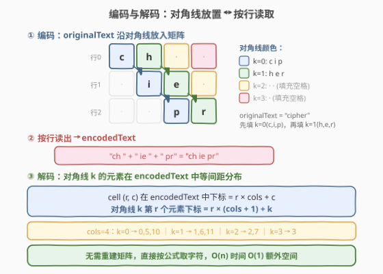
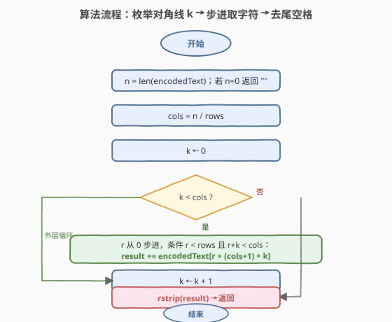
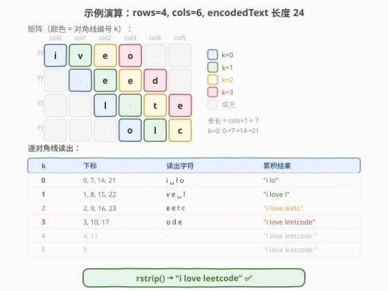

# 解码斜向换位密码

- **题目名称**：解码斜向换位密码
- **链接**：[2075. 解码斜向换位密码](https://leetcode.cn/problems/decode-the-slanted-ciphertext/)
- **难度**：中等
- **标签**：字符串、矩阵、模拟

## 1. 题目概述

字符串 `originalText` 使用**斜向换位密码**，经由行数固定为 `rows` 的矩阵辅助，加密得到字符串 `encodedText`。加密分两步：

1. **对角线放入**：将 `originalText` 沿矩阵的**对角线**（从左上到右下）逐条放入。对角线按**起始列**从左到右排列：第 $0$ 条从 $(0,0)$ 出发向下右延伸，第 $1$ 条从 $(0,1)$ 出发，依此类推。空余单元格用 `' '` 填充。矩阵列数满足：填充后最右侧列不为空。
2. **按行读出**：将矩阵按行从左到右、从上到下拼接，得到 `encodedText`。

给定 `encodedText` 和 `rows`，返回 `originalText`。`originalText` 不含尾随空格。

**示例 1**：

```text
输入：encodedText = "ch   ie   pr", rows = 3
输出："cipher"
解释：3×4 矩阵如下，蓝色对角线 (0,0)→(1,1)→(2,2) 放 "cip"，绿色对角线 (0,1)→(1,2)→(2,3) 放 "her"。
      c  h  ·  ·
        i  e  ·
           p  r
按行读出 → "ch  " + " ie " + "  pr" = "ch   ie   pr"
```

**示例 2**：

```text
输入：encodedText = "iveo    eed   l te   olc", rows = 4
输出："i love leetcode"
```

**示例 3**：

```text
输入：encodedText = "coding", rows = 1
输出："coding"
解释：仅 1 行，originalText 与 encodedText 相同。
```

**示例 4**：

```text
输入：encodedText = " b  ac", rows = 2
输出：" abc"
解释：originalText 不含尾随空格，但可能含前置空格。
```

**约束条件**：

- $0 \leq \text{encodedText.length} \leq 10^6$
- `encodedText` 仅由小写英文字母和 `' '` 组成
- `encodedText` 是对某个**不含**尾随空格的 `originalText` 的有效编码
- $1 \leq \text{rows} \leq 1000$
- 生成的测试用例满足**仅存在一个**可能的 `originalText`

> 💡 **审题关键**：① 矩阵的列数 `cols = len(encodedText) / rows`——因为按行读出后总字符数 = `rows × cols`；② 对角线编号 $k$ = 起始列号，第 $k$ 条对角线上的元素为 $(0,k), (1,k+1), (2,k+2), \ldots$，即 $(r, r+k)$；③ `originalText` 无尾随空格 ⇒ 解码后只需 `rstrip` 即可。

---

## 2. 解题思路

### 2.1 暴力思路：重建矩阵 + 逐对角线读取

最直观的做法：先从 `encodedText` 重建 `rows × cols` 矩阵（按行填充），再按对角线顺序读取字符，最后去掉尾随空格。

- **正确性**：完全模拟加密的逆过程。
- **效率**：重建矩阵 $O(n)$，读取 $O(n)$，总计 $O(n)$ 时间、$O(n)$ 空间。对于 $n \leq 10^6$ 可通过，但额外建矩阵浪费空间。

> ⚠️ 重建矩阵是多余的——对角线上的每个字符在 `encodedText` 中的位置可以用**公式直接计算**，无需中间存储。

### 2.2 核心观察：对角线索引公式



矩阵中单元格 $(r, c)$ 在 `encodedText`（行主序）中的下标为：

$$\text{index}(r, c) = r \times \text{cols} + c$$

第 $k$ 条对角线上的第 $r$ 个元素位于 $(r, r+k)$，代入得：

$$\boxed{\text{index}(r, r+k) = r \times \text{cols} + (r+k) = r \times (\text{cols}+1) + k}$$

**三个关键推论**：

1. **等间距**：同一条对角线 $k$ 上，相邻元素的索引差恒为 $\text{cols}+1$——从起始索引 $k$ 开始，以 $\text{cols}+1$ 为步长递增。
2. **对角线长度**：第 $k$ 条对角线有 $\min(\text{rows}, \text{cols}-k)$ 个元素（行不越界且列不越界）。
3. **无需建矩阵**：直接用公式从 `encodedText` 取字符，$O(1)$ 额外空间。

### 2.3 算法流程图



**完整步骤**：

1. 计算 $n = \text{len}(\text{encodedText})$。若 $n = 0$，返回空串。
2. 计算 $\text{cols} = n \, / \, \text{rows}$。
3. **外层循环**：对 $k = 0, 1, \ldots, \text{cols}-1$：
   - **内层循环**：对 $r = 0, 1, \ldots$，条件 $r < \text{rows}$ 且 $r + k < \text{cols}$：
     - 取 $\text{encodedText}[r \times (\text{cols}+1) + k]$，追加到结果。
4. 去掉结果尾部的空格（`rstrip`）。
5. 返回结果。

> ⚠️ **内层循环的终止条件**必须同时检查 $r < \text{rows}$ 和 $r + k < \text{cols}$——只检查前者会导致列越界（当 $\text{rows} > \text{cols}$ 时，步长 $\text{cols}+1$ 可能使索引「跳」到下一行的错误列）。

### 2.4 示例演算

以示例 2（`rows=4`，`encodedText` 长度 24，`cols=6`，步长 $= 7$）完整演示：



各对角线读取结果汇总：

| 对角线 $k$ | 索引序列 | 读出字符 | 累积结果 |
|-----------|---------|---------|---------|
| 0 | 0, 7, 14, 21 | `i ␣ l o` | `"i lo"` |
| 1 | 1, 8, 15, 22 | `v e ␣ l` | `"i love l"` |
| 2 | 2, 9, 16, 23 | `e e t c` | `"i love leetc"` |
| 3 | 3, 10, 17 | `o d e` | `"i love leetcode"` |
| 4 | 4, 11 | `␣ ␣` | `"i love leetcode  "` |
| 5 | 5 | `␣` | `"i love leetcode   "` |

`rstrip` 后 → `"i love leetcode"` ✅

> 💡 **对比观察**：对角线 $k=0\sim3$ 承载了 `originalText` 的全部 15 个字符（含内部空格），$k=4\sim5$ 全为填充空格。`rstrip` 恰好去掉这些尾部填充，内部空格（如 `"i love"` 中的空格）不受影响。

---

## 3. 参考代码

### C++

```cpp
class Solution {
public:
    string decodeCiphertext(string encodedText, int rows) {
        int n = encodedText.size();
        if (n == 0) return "";
        int cols = n / rows;
        string result;
        result.reserve(n);
        for (int k = 0; k < cols; ++k) {
            for (int r = 0; r < rows && r + k < cols; ++r) {
                result += encodedText[r * (cols + 1) + k];
            }
        }
        while (!result.empty() && result.back() == ' ') result.pop_back();
        return result;
    }
};
```

### Python

```python
class Solution:
    def decodeCiphertext(self, encodedText: str, rows: int) -> str:
        n = len(encodedText)
        if n == 0:
            return ""
        cols = n // rows
        result = []
        for k in range(cols):
            for r in range(rows):
                if r + k >= cols:
                    break
                result.append(encodedText[r * (cols + 1) + k])
        return ''.join(result).rstrip()
```

> 💡 **写法要点**：① `result.reserve(n)` 预分配避免 C++ 中 `+=` 的频繁扩容；② 内层循环的 `r + k < cols` 条件不可省——当 $\text{rows} > \text{cols}$ 时，仅检查 `r < rows` 会导致索引越过当前对角线的列边界，读取到下一行的错误位置；③ C++ 手动 `pop_back` 去尾空格等价于 Python 的 `rstrip()`。

---

## 4. 复杂度分析

| 维度 | 复杂度 | 说明 |
|------|--------|------|
| 时间 | $O(n)$ | 遍历所有对角线上的单元格，总数 $\leq n = \text{rows} \times \text{cols}$ |
| 空间 | $O(n)$ | 结果字符串（C++ `reserve` 后无额外开销；不建矩阵） |
| 空间（额外） | $O(1)$ | 仅用 `cols`、循环变量等标量 |

> 💡 总遍历量为 $\sum_{k=0}^{\text{cols}-1} \min(\text{rows}, \text{cols}-k)$，该值 $\leq \text{rows} \times \text{cols} = n$（未在任何对角线上的单元格不被访问）。$n = 10^6$ 时约 $10^6$ 次操作，轻松通过。

---

## 5. 扩展：行列不等时的矩阵形态

当 $\text{rows} > \text{cols}$ 时，矩阵呈「高瘦」形态，此时矩阵左下方存在一块**不在任何对角线上**的区域（$c < r$ 的单元格）。这些单元格在编码时被填充为空格，解码时无需读取。

例如 $\text{rows}=3, \text{cols}=2$ 时：

```text
(0,0) (0,1)    ← 对角线 k=0, k=1
(1,0) (1,1)    ← (1,0) 不在对角线上
(2,0) (2,1)    ← 均不在对角线上
```

对角线 $k=0$：$(0,0), (1,1)$（2 个元素，受 $\text{cols}$ 限制）
对角线 $k=1$：$(0,1)$（1 个元素，受 $\text{cols}$ 限制）

总读取 $2+1=3$ 个元素 $< n=6$，未读取的 3 个单元格均为填充空格。

> 💡 本题的索引公式 $r \times (\text{cols}+1) + k$ 之所以用 $\text{cols}+1$ 而非 $\text{cols}$，是因为对角线上每前进一行，列也前进一列——行主序中行变化贡献 $\text{cols}$，列变化贡献 $1$，合计 $\text{cols}+1$。若误写为 $r \times \text{cols} + k$，则退化为按列读取，与对角线读取完全不同。

---

## 6. 面试要点

**Q1：为什么不直接重建矩阵再按对角线读？**

> 重建矩阵需要 $O(n)$ 额外空间存储所有单元格（含填充空格），而索引公式 $r \times (\text{cols}+1) + k$ 允许我们 $O(1)$ 定位每个对角线字符，直接从 `encodedText` 取值。空间从 $O(n)$ 降到 $O(1)$（不含输出），且常数更小（无矩阵初始化开销）。

**Q2：内层循环为什么必须检查 `r + k < cols`？只检查 `r < rows` 不够吗？**

> 不够。当 $\text{rows} > \text{cols}$ 时，对角线 $k$ 在列方向先触及边界。若仅检查 `r < rows`，步长 $\text{cols}+1$ 会使索引从 $(r, r+k)$ 跳到 $(r+1, r+1+k)$，但 $r+1+k \geq \text{cols}$ 时该列不存在——索引仍落在 $[0, n)$ 范围内（因为 $(r+1) \times \text{cols} \leq n$），不会越界报错，但会读取到**下一行错误列**的字符，导致结果错误。必须显式截断。

**Q3：`rstrip` 为什么只去尾随空格，不影响 `originalText` 中的内部空格？**

> 编码时填充的空格只出现在对角线的**尾部**（`originalText` 耗尽后的剩余格子）和不在任何对角线上的格子。按对角线顺序读取时，所有 `originalText` 字符（含内部空格）在前，填充空格在后。因此 `rstrip` 只去掉尾部的填充空格，内部空格不受影响。

**Q4：`rows = 1` 时算法如何退化？**

> `rows = 1` 时 `cols = n`，步长 $= \text{cols}+1 = n+1$。对角线 $k=0$：$r=0$（`r < 1` 且 `0+k < n`），读取索引 $0$。$k=1$：读取索引 $1$。依此类推，$k$ 从 $0$ 到 $n-1$，各读一个字符，顺序恰为 `encodedText[0], [1], ..., [n-1]`——即原样返回 `encodedText`。`rstrip` 为空操作（因为 `originalText` 无尾随空格）。

**Q5：如果 `encodedText` 为空串怎么处理？**

> `n = 0` 时 `cols = 0`，外层循环不执行，结果为空串。但需注意 `cols = 0 / rows = 0`，不应进行除法相关计算（虽然 $0 / \text{rows} = 0$ 不会除零，但提前返回空串更清晰、避免后续逻辑的边界问题）。

> 💡 **一句话总结**：对角线 $k$ 的元素在 `encodedText` 中从下标 $k$ 开始、以 $\text{cols}+1$ 为步长等间距排列。直接按公式取字符、`rstrip` 去尾空格，$O(n)$ 时间、$O(1)$ 额外空间。

---

## 7. 同类练习题

- [2134. 股票价格波动](https://leetcode.cn/problems/stock-price-fluctuation/)：矩阵转一维索引的逆操作——本题索引公式的直接对照，体会行主序下 $(r,c) \to r \times \text{cols} + c$ 的双向映射
- [566. 重塑矩阵](https://leetcode.cn/problems/reshape-the-matrix/)：矩阵行列重排——同样依赖行主序索引公式 $r \times \text{cols} + c$，将二维坐标映射到一维
- [1880. 检查某单词前缀是否存在于另一单词中](https://leetcode.cn/problems/check-if-word-prefix-occurs-in-sentence/)：字符串切分与拼接——对照本题的按行拼接与按对角线拆分，体会「同一数据的多种读取顺序」
- [54. 螺旋矩阵](https://leetcode.cn/problems/spiral-matrix/)：矩阵的另一种读取顺序——对照本题的「对角线读取」，体会矩阵遍历方向的变换（螺旋 vs 对角线 vs 行主序）
