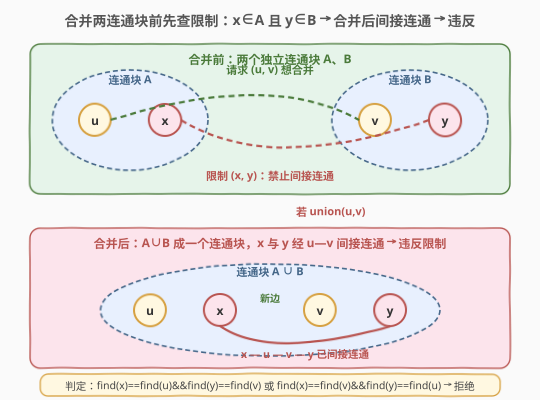
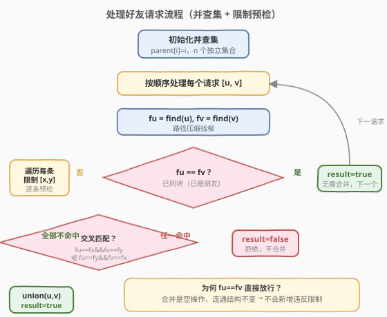
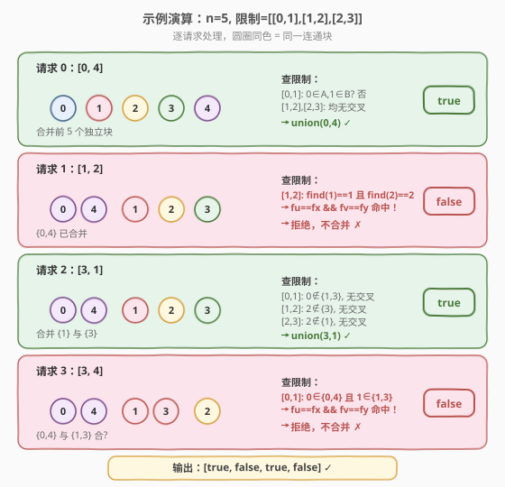

# 处理含限制条件的好友请求

- **题目名称**：处理含限制条件的好友请求
- **链接**：[2076. 处理含限制条件的好友请求](https://leetcode.cn/problems/process-restricted-friend-requests/)
- **难度**：困难
- **标签**：并查集、图

## 1. 题目概述

网络上有 `n` 个用户，编号 `0` 到 `n-1`。给定限制数组 `restrictions`，其中 `restrictions[i] = [xi, yi]` 表示用户 `xi` 和 `yi` **不能成为朋友**——无论是**直接**还是通过其他用户**间接**连通。再给定好友请求数组 `requests`，其中 `requests[j] = [uj, vj]`，**按列表顺序逐个处理**：若 `uj`、`vj` 可以成为朋友则请求**成功**且二者成为直接朋友；否则**失败**。返回布尔数组 `result`，`result[j]` 表示第 `j` 个请求是否成功。

> ⚠️ 注意两条关键规则：①限制是**双向且传递**的——只要 `xi`、`yi` 落在同一个连通块（直接或间接连通）就算违反，并非只禁止直接连边；②若 `uj`、`vj` **已经是直接朋友**，请求仍算**成功**（合并是空操作，不改变连通结构）。

**示例 1**：

```text
输入：n = 3, restrictions = [[0,1]], requests = [[0,2],[2,1]]
输出：[true,false]
解释：
- 请求 0：0 与 2 可成为朋友 → 成功，0—2 直接连通。
- 请求 1：2 与 1 若合并，会使 0 与 1 经 0—2—1 间接连通 → 违反限制 [0,1] → 失败。
```

**示例 2**：

```text
输入：n = 3, restrictions = [[0,1]], requests = [[1,2],[0,2]]
输出：[true,false]
解释：
- 请求 0：1 与 2 合并成功。
- 请求 1：0 与 2 若合并，0—2—1 让 0、1 间接连通 → 违反 → 失败。
```

**示例 3**：

```text
输入：n = 5, restrictions = [[0,1],[1,2],[2,3]], requests = [[0,4],[1,2],[3,1],[3,4]]
输出：[true,false,true,false]
解释：
- 请求 0：[0,4] 无限制交叉 → 成功。
- 请求 1：[1,2] 命中限制 [1,2] → 失败。
- 请求 2：[3,1] 无交叉 → 成功。
- 请求 3：[3,4] 会让 {0,4} 与 {1,3} 合并，命中限制 [0,1] → 失败。
```

**约束条件**：

- $2 \le n \le 1000$
- $0 \le \text{restrictions.length} \le 1000$
- $0 \le x_i, y_i \le n - 1$，$x_i \ne y_i$
- $1 \le \text{requests.length} \le 1000$
- $0 \le u_j, v_j \le n - 1$，$u_j \ne v_j$

> 💡 **审题关键**：①请求**在线处理**且会改变后续状态——成功的合并会永久影响后续判断，不能用离线倒推；②限制的违反判定等价于"合并后某条限制的两端 `find` 相同"，这是把"间接连通"翻译成并查集语言的核心；③`n`、限制数、请求数同阶（都 $\le 1000$），允许 $O(Q \cdot R \cdot \alpha)$ 的双层枚举。

---

## 2. 解题思路

### 2.1 暴力思路：每次合并后全图 BFS 判限制

对每个请求 `[u, v]`，先尝试在邻接表里连一条边 `(u, v)`，然后对**每条限制 `[x, y]`** 做 BFS/DFS 判断 `x`、`y` 是否连通；若任一限制被违反则回滚这条边并标记失败，否则保留并标记成功。

- **正确性**：直接模拟题意，显然正确。
- **效率**：单次请求需 $O(R \cdot (n + E))$，$E$ 为已连边数；$Q$ 次请求共 $O(Q \cdot R \cdot n)$，$n=R=Q=1000$ 时达 $10^9$，**超时**且实现繁琐（要支持回滚）。

> ⚠️ 瓶颈在于"连通性判定"被重复做了 $Q \times R$ 次，且每次都从零 BFS。突破口是用**并查集**把"是否连通"降到 $O(\alpha)$，并在**合并前**预检——只查"这条限制会不会因本次合并被触发"，无需合并后再回滚。

### 2.2 核心观察：并查集 + 合并前限制预检



把"朋友关系"建模为并查集：**同一连通块 = 直接或间接朋友**。每条请求 `[u, v]` 要决定是否把 `find(u)` 与 `find(v)` 两个连通块合并。关键观察是：

> 一条限制 `[x, y]` 会在合并 `(u, v)` 后被违反，当且仅当 `x`、`y` **恰分别落在待合并的两个连通块里**——即合并后它们才首次被连到一起。

形式化地，记 $f_u = \text{find}(u)$、$f_v = \text{find}(v)$、$f_x = \text{find}(x)$、$f_y = \text{find}(y)$。合并 `(u, v)` 后 `find(x) == find(y)` 当且仅当：

$$
(f_x = f_u \land f_y = f_v) \;\lor\; (f_x = f_v \land f_y = f_u)
$$

即限制的两端"**交叉对齐**"到待合并的两个块。这有两种命中姿势（`x` 在 `u` 块且 `y` 在 `v` 块，或反过来）。

> 💡 **为什么只需查"交叉对齐"？** 若合并前 `find(x) == find(y)` 已成立，说明该限制**早就被违反**——但我们维护了"绝不进行会触发限制的合并"这一不变量，所以这种情况不会出现（除非初始就违反，需预处理剔除，本题数据保证初始无人在同一块）。因此唯一需要担心的是"本次合并**新**触发"的违反，即两端原属不同块、合并后同块——这正是交叉对齐。

**算法**：对每个请求 `[u, v]`：

1. 若 `find(u) == find(v)`：二者已在同一块（已是朋友），**直接放行**（合并是空操作，连通结构不变，不会新增违反）→ `true`。
2. 否则遍历所有限制 `[x, y]`，用上述交叉匹配判定；若**任一**命中 → `false`（不合并）。
3. 若**全部不命中** → `union(u, v)`，`true`。

> ⚠️ **第 1 步的放行不是偷懒**：`find(u) == find(v)` 意味着历史上某次成功合并已把二者连通。由于我们从不做触发限制的合并，这对 `(u, v)` 不可能是某条限制的两端（否则它们永远不会同块）。所以放行安全——这正是题目"已是直接朋友仍成功"那条规则的并查集体现。

### 2.3 算法流程图



三段式：初始化并查集 → 逐请求取 `find` → 同块直接放行 / 异块遍历限制做交叉匹配 → 命中则拒绝、全不命中则合并放行。

### 2.4 示例演算



以示例 3 为例（`n=5`，限制 `[[0,1],[1,2],[2,3]]`），逐请求追踪连通块演变：

| 请求 | 合并前连通块 | 关键限制检查 | 结果 | 合并后连通块 |
|------|-------------|-------------|------|-------------|
| `[0,4]` | `{0}{1}{2}{3}{4}` | 限制两端均无交叉 | `true` | `{0,4}{1}{2}{3}` |
| `[1,2]` | `{0,4}{1}{2}{3}` | `[1,2]`: `find(1)==find(1)` 且 `find(2)==find(2)` → **交叉命中** | `false` | 不变 |
| `[3,1]` | `{0,4}{1}{2}{3}` | `[0,1]`/`[1,2]`/`[2,3]` 均无交叉 | `true` | `{0,4}{1,3}{2}` |
| `[3,4]` | `{0,4}{1,3}{2}` | `[0,1]`: `0∈{0,4}` 且 `1∈{1,3}` → **交叉命中** | `false` | 不变 |

> 💡 **请求 3 是最易错点**：限制写的是 `[0,1]`，请求却是 `[3,4]`——但 `3` 已与 `1` 同块、`4` 已与 `0` 同块，合并 `(3,4)` 等价于打通 `{0,4}` 与 `{1,3}`，于是 `0`、`1` 经 `0—4—3—1` 间接连通。交叉匹配 `find(0)==find(4)` 且 `find(1)==find(3)` 精准捕获了这种"借道"情形，无需真的合并再回滚。

---

## 3. 参考代码

### C++（并查集 + 路径压缩 + 按秩合并）

```cpp
class Solution {
public:
    vector<bool> friendRequests(int n, vector<vector<int>>& restrictions,
                                vector<vector<int>>& requests) {
        vector<int> parent(n), rank_(n, 0);
        for (int i = 0; i < n; ++i) parent[i] = i;

        // 带路径压缩的查找
        function<int(int)> find = [&](int x) {
            if (parent[x] != x) parent[x] = find(parent[x]);
            return parent[x];
        };

        vector<bool> ans;
        ans.reserve(requests.size());
        for (auto& req : requests) {
            int u = req[0], v = req[1];
            int fu = find(u), fv = find(v);
            if (fu == fv) {                 // 已同块（已是朋友）→ 直接放行
                ans.push_back(true);
                continue;
            }
            bool ok = true;
            for (auto& r : restrictions) {  // 交叉匹配预检
                int fx = find(r[0]), fy = find(r[1]);
                if ((fx == fu && fy == fv) || (fx == fv && fy == fu)) {
                    ok = false;             // 命中 → 会违反该限制
                    break;
                }
            }
            if (ok) {                       // 全不命中 → 合并
                if (rank_[fu] < rank_[fv]) parent[fu] = fv;
                else if (rank_[fu] > rank_[fv]) parent[fv] = fu;
                else { parent[fv] = fu; rank_[fu]++; }
            }
            ans.push_back(ok);
        }
        return ans;
    }
};
```

### Python（并查集 + 路径压缩 + 按秩合并）

```python
class Solution:
    def friendRequests(self, n: int, restrictions: List[List[int]],
                       requests: List[List[int]]) -> List[bool]:
        parent = list(range(n))
        rank_ = [0] * n

        def find(x: int) -> int:
            while parent[x] != x:
                parent[x] = parent[parent[x]]      # 隔代压缩
                x = parent[x]
            return x

        ans = []
        for u, v in requests:
            fu, fv = find(u), find(v)
            if fu == fv:                            # 已同块 → 直接放行
                ans.append(True)
                continue
            ok = True
            for x, y in restrictions:               # 交叉匹配预检
                fx, fy = find(x), find(y)
                if (fx == fu and fy == fv) or (fx == fv and fy == fu):
                    ok = False                      # 命中 → 会违反
                    break
            if ok:                                  # 全不命中 → 合并
                if rank_[fu] < rank_[fv]:
                    parent[fu] = fv
                elif rank_[fu] > rank_[fv]:
                    parent[fv] = fu
                else:
                    parent[fv] = fu
                    rank_[fu] += 1
            ans.append(ok)
        return ans
```

> 💡 **`fu == fv` 分支必须单独处理**：若漏掉而直接进限制循环，虽然循环本身不会命中（因不变量保证同块内无限制对），逻辑上也对，但会做无谓的 $O(R)$ 遍历。单独短路既贴合题意"已是朋友仍成功"，又顺手剪枝。

---

## 4. 复杂度分析

| 维度 | 复杂度 | 说明 |
|------|--------|------|
| 时间复杂度 | $O(Q \cdot R \cdot \alpha(n))$ | 每个请求至多遍历 $R$ 条限制，每条做 4 次 `find`，单次 `find` 均摊 $O(\alpha(n))$；$n, Q, R \le 1000$ 时约 $4 \times 10^6 \cdot \alpha$，毫秒级 |
| 空间复杂度 | $O(n)$ | `parent` 与 `rank_` 各 $O(n)$，限制/请求只读不复制 |

> ⚠️ 本题数据范围故意卡在 $1000$，使 $O(Q \cdot R)$ 双层枚举可过。若 $n, Q, R$ 升到 $10^5$，需改用更精巧的"按连通块维护限制邻接表 + 启发式合并小堆入大堆"做法，把每条限制的总检查次数压到 $O(n \log n)$——见第 5 节。

---

## 5. 扩展：大数据量下的启发式合并优化

当 $n, Q, R$ 同阶到 $10^5$ 时，$O(Q \cdot R)$ 不可行。优化思路：**不为每个请求遍历所有限制，而是让每个连通块只持有"涉及自身成员的限制集合"**，合并两块时把小集合并入大集合（启发式合并），逐条检查被并入的限制是否恰好落在对端块里。

具体地，给每个节点 `i` 维护一个集合 `rest[i]`，存所有限制中**包含 `i` 的那一端对应的另一端**（即限制 `[a,b]` 给 `rest[a]` 加 `b`、给 `rest[b]` 加 `a`）。合并 `fu`、`fv` 时：

- 对小集合里的每个 `x`，若 `find(x) == fv`（即 `x` 现在对端在对侧块），则该限制会被触发 → 拒绝。
- 否则把 `x` 迁移进大集合。若全部迁移完毕无触发，则合并成功。

由于每个元素每被迁移一次所在集合至少翻倍，单元素总迁移次数 $O(\log n)$，总检查 $O((n + R) \log n)$。这是并查集"**小集合并入大集合**"的经典摊还分析，与 [721. 账户合并](https://leetcode.cn/problems/accounts-merge/) 的合并思路同源。

> 💡 面试中若数据范围像本题一样小（$\le 1000$），直接讲本文 $O(Q \cdot R \cdot \alpha)$ 的双层枚举法即可——清晰、不易写错；若面试官追问"放大到 $10^5$ 怎么办"，再抛出启发式合并版，体现对摊还分析的掌握。

---

## 6. 面试要点

1. **为什么"限制违反"可以转化为交叉匹配 `find` 比较？**

   - 合并 `(u, v)` 只会改变 `fu`、`fv` 两个块的归属，其余块不变。一条限制 `[x, y]` 合并后才违反，意味着合并前 `find(x) != find(y)`、合并后相等——这只可能发生在 `x`、`y` 原本分别属于 `fu`、`fv` 两个块（顺序两种），即交叉对齐。若合并前已同块则属于"早被违反"，由不变量排除。

2. **`find(u) == find(v)` 时为何直接返回 `true` 而不查限制？**

   - 二者已在同一块说明历史某次成功合并已连通它们。由于我们从不执行触发限制的合并，`(u, v)` 不可能是任何限制的两端（限制两端永远不会同块）。所以本次合并不改变连通结构、不会新增违反——这正是题目"已是直接朋友仍成功"的规则，且顺手剪掉一次 $O(R)$ 遍历。

3. **需要支持"合并失败后回滚"吗？**

   - 不需要。本题在**合并前**预检：只有全不命中才真正 `union`，命中则什么都不做。状态永远只前进、不回退，避免了撤销操作的复杂性。这是"先检查再动手"优于"动手后检查"的关键。

4. **路径压缩会影响后续 `find` 结果吗？**

   - 不会改变等价类，只会把树拍扁。`find` 在压缩后仍返回同一根，交叉匹配判定不变。注意在一次请求内对 `u, v, x, y` 多次调用 `find` 是安全的——压缩只会让后续更快。

5. **限制数组里有重复或自环怎么办？**

   - 题目保证 $x_i \ne y_i$ 且无重复。即便有，去重不改变判定（重复限制只是重复检查同一对）；自环（`xi == yi`）则恒不违反（同点恒同块，但属"早被违反"需预处理剔除）。工程实现可在读入时去重以减少常数。

---

## 7. 同类练习题

- [547. 省份数量](https://leetcode.cn/problems/number-of-provinces/)（[题解](../0501-0600/547_省份数量.md)）：并查集母题，统计连通分量，复习 `find`/`union` 模板
- [684. 冗余连接](https://leetcode.cn/problems/redundant-connection/)（[题解](../0601-0700/684_冗余连接.md)）：并查集"加边前判同根"判环，与本题"合并前判限制"同属预检范式
- [990. 等式方程的可满足性](https://leetcode.cn/problems/satisfiability-of-equality-equations/)：先 union 等式、再查不等式是否冲突，"限制"思想的字符串版
- [721. 账户合并](https://leetcode.cn/problems/accounts-merge/)：并查集合并字符串键，第 5 节启发式合并优化的同源题
- [1319. 连通网络的操作次数](https://leetcode.cn/problems/number-of-operations-to-make-network-connected/)：并查集数连通分量求最少冗余线缆，对比"合并用途"的差异
