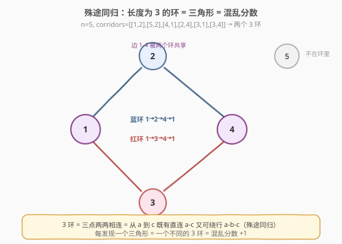
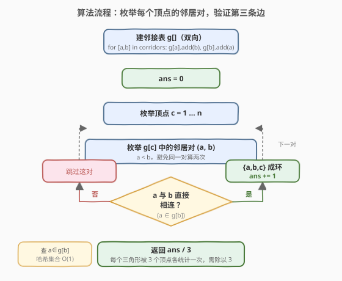
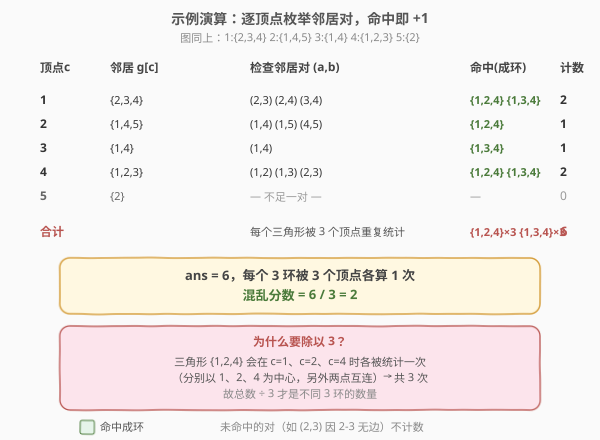

# 殊途同归

- **题目名称**：殊途同归
- **链接**：[2077. 殊途同归](https://leetcode.cn/problems/paths-in-maze-that-lead-to-same-room/)
- **难度**：中等
- **标签**：图、哈希表

## 1. 题目概述

迷宫由 `n` 个从 `1` 到 `n` 的房间组成，有些房间由走廊连接。给定二维整数数组 `corridors`，其中 `corridors[i] = [room1_i, room2_i]` 表示一条**双向**走廊连接 `room1_i` 与 `room2_i`。

迷宫的**混乱分数**定义为**长度为 3 的不同环**的数量：

- `1 → 2 → 3 → 1` 是长度为 3 的环；
- `1 → 2 → 3 → 4`（长度 4）和 `1 → 2 → 3 → 2 → 1`（重复访问 2）都不是。

若一个环中存在某个房间**不在**另一个环中，则二者视为**不同**的环。注意 `4→1→3→4`、`3→4→1→3`、`1→3→4→1` 是**同一个**环（房间集合相同）。返回迷宫的混乱分数。

**示例 1**：

```text
输入：n = 5, corridors = [[1,2],[5,2],[4,1],[2,4],[3,1],[3,4]]
输出：2
解释：两个长度为 3 的环：
      4→1→3→4（房间 {1,3,4}）
      1→2→4→1（房间 {1,2,4}）
```

**示例 2**：

```text
输入：n = 4, corridors = [[1,2],[3,4]]
输出：0
解释：没有长度为 3 的环。
```

**约束条件**：

- `2 <= n <= 1000`
- `1 <= corridors.length <= 5 * 10^4`
- `corridors[i].length == 2`
- `1 <= room1_i, room2_i <= n`，且 `room1_i != room2_i`
- 没有重复的走廊

---

## 2. 解题思路

> ⚠️ **题目本质**：长度为 3 的环就是**三角形**（三点两两相连）。所谓"殊途同归"——从房间 `a` 到房间 `c` 既有**直连走廊** `a-c`，又可**绕行** `a-b-c`，两条不同路径到达同一房间，于是 `a,b,c` 构成一个 3 环。本题即**统计无向图中的三角形个数**。

### 2.1 暴力思路

枚举所有三元组 `(a, b, c)`，检查三对房间是否都有走廊相连。三元组数量 $O(n^3)$，`n = 1000` 时高达 $10^9$，必然超时。优化方向：只在与某个顶点相邻的点对里枚举，把"无关节点"过滤掉。

### 2.2 核心观察：固定一个顶点，枚举其邻居对



关键直觉：

- 一个三角形 `{a, b, c}` 中，**每个顶点的两个邻居恰好是另外两个顶点**，且这两个邻居本身也相连。
- 因此**固定顶点 `c`**，在其邻居集合 `g[c]` 中任取一对 `(a, b)`，只要 `a` 与 `b` 之间也有走廊（`a ∈ g[b]`），就说明 `{a, b, c}` 两两相连 → 构成一个 3 环。
- 用**哈希集合**存每个顶点的邻居，"查 `a` 是否为 `b` 的邻居"是 $O(1)$。

> 💡 一句话：**3 环 ⇔ 三角形 ⇔ 某顶点的两个邻居互连**。把问题从"数三元组"降为"在每个顶点的邻居对里查第三条边"。

> ⚠️ **重复计数**：同一个三角形 `{a, b, c}` 会在 `c = a`、`c = b`、`c = c` 时**各被统计一次**（共 3 次，分别以三个顶点为中心）。因此最终答案要**除以 3**。

### 2.3 算法流程图



外层遍历 `n` 个顶点，内层在 `g[c]` 的邻居里枚举点对并 $O(1)$ 查表。总时间取决于所有顶点邻居对的规模 $\sum_c \binom{\deg(c)}{2}$，最坏 $O(n^2)$（`n ≤ 1000` 完全可控）。

### 2.4 示例演算



以示例 1 为例，邻接表为 `1:{2,3,4} 2:{1,4,5} 3:{1,4} 4:{1,2,3} 5:{2}`：

| 顶点 c | 邻居 g[c] | 检查的邻居对 (a,b) | 命中（成环） | 计数 |
|--------|-----------|--------------------|--------------|------|
| 1 | {2,3,4} | (2,3)(2,4)(3,4) | {1,2,4} {1,3,4} | 2 |
| 2 | {1,4,5} | (1,4)(1,5)(4,5) | {1,2,4} | 1 |
| 3 | {1,4} | (1,4) | {1,3,4} | 1 |
| 4 | {1,2,3} | (1,2)(1,3)(2,3) | {1,2,4} {1,3,4} | 2 |
| 5 | {2} | — 不足一对 — | — | 0 |

合计 `ans = 6`。三角形 `{1,2,4}` 被顶点 1、2、4 各算一次（3 次），`{1,3,4}` 同样被算 3 次，共 6 次。`6 / 3 = 2`，即混乱分数。

---

## 3. 参考代码

### C++

```cpp
class Solution {
public:
    int numberOfPaths(int n, vector<vector<int>>& corridors) {
        vector<unordered_set<int>> g(n + 1);
        for (auto& c : corridors) {       // 双向建图
            g[c[0]].insert(c[1]);
            g[c[1]].insert(c[0]);
        }
        int ans = 0;
        for (int c = 1; c <= n; ++c) {
            vector<int> nxt(g[c].begin(), g[c].end());
            int m = nxt.size();
            for (int i = 0; i < m; ++i)
                for (int j = i + 1; j < m; ++j)   // 枚举邻居对 (a,b)
                    ans += g[nxt[j]].count(nxt[i]); // a,b 相连则 +1
        }
        return ans / 3;                  // 每个三角形被统计 3 次
    }
};
```

### Python

```python
from collections import defaultdict
from itertools import combinations

class Solution:
    def numberOfPaths(self, n: int, corridors: List[List[int]]) -> int:
        g = defaultdict(set)
        for a, b in corridors:           # 双向建图
            g[a].add(b)
            g[b].add(a)
        ans = 0
        for c in range(1, n + 1):
            for a, b in combinations(g[c], 2):  # 枚举 c 的邻居对
                if a in g[b]:                   # a,b 相连则成环
                    ans += 1
        return ans // 3                 # 每个三角形被统计 3 次
```

> 💡 **`combinations(g[c], 2)`** 自动保证 `a < b`（按集合迭代序），同一对只枚举一次；用 `set` 的 `in` 判断第三条边 $O(1)$。

---

## 4. 复杂度分析

| 维度 | 复杂度 | 说明 |
|------|--------|------|
| 时间复杂度 | $O(\sum_c \deg(c)^2)$，最坏 $O(n^2)$ | 每个顶点枚举其邻居对，对数为 $\binom{\deg(c)}{2}$，每次查表 $O(1)$；最坏稠密图 $\deg \sim n$ |
| 空间复杂度 | $O(n + E)$ | 邻接表存 $E$ 条边（双向 $2E$），`E = corridors.length` |

> ⚠️ 本题 `n ≤ 1000`、`E ≤ 5×10^4`，$O(n^2)$ 约 $10^6$ 量级，宽松通过。若 `n` 放大到 $10^5$ 的稀疏图，应改用"**定向边**"技巧：仅保留 `u → v (u < v)` 的有向边，再对每个 `u` 的出边 `u→v`、`v→w` 查 `u→w` 是否存在，复杂度 $O(E^{1.5})$。

---

## 5. 扩展：避免除以 3 的定向边写法

把无向边**定向为小编号指向大编号**（`u → v` 仅当 `u < v`），则每个三角形 `{a,b,c}`（`a<b<c`）只对应唯一的有向路径 `a → b → c`，且 `a→c` 也存在。这样每个三角形**恰好被统计一次**，无需除以 3：

```cpp
// 仅保留 u < v 的有向边
vector<unordered_set<int>> g(n + 1);
for (auto& c : corridors) {
    int a = min(c[0], c[1]), b = max(c[0], c[1]);
    g[a].insert(b);
}
int ans = 0;
for (int a = 1; a <= n; ++a)
    for (int b : g[a])
        for (int cc : g[b])      // a < b < cc
            ans += g[a].count(cc); // a 与 cc 直连？
return ans;
```

> 💡 这两种写法等价，区别仅在计数次数：哈希集合版每个三角形算 3 次再除以 3；定向边版每个三角形算 1 次。面试时讲清"为何除以 3"更能体现对重复计数的理解。

---

## 6. 面试要点

1. **3 环和三角形是什么关系？**
   - 长度为 3 的环 `a→b→c→a` 要求三点两两相连，正是图论中的**三角形（3-clique）**。"殊途同归"即从 `a` 到 `c` 有直连 `a-c` 与绕行 `a-b-c` 两条路。

2. **为什么要除以 3？**
   - 同一个三角形 `{a,b,c}` 在外层顶点 `c` 取 `a`、`b`、`c` 时各被统计一次（每次以一个顶点为中心，另两点互连），共 3 次。除以 3 还原为不同环的数量。

3. **如何保证邻居对不重复枚举？**
   - 邻居集合转列表后用 `j > i` 的双重循环（`combinations`），保证每对 `(a,b)` 只查一次。集合本身去重也避免了重边干扰。

4. **查"a 是否为 b 的邻居"为什么是 O(1)？**
   - 邻居用 `unordered_set` / Python `set` 存储，`count` / `in` 平均 $O(1)$。若用排序数组+二分则 $O(\log n)$，总量级仍可过。

5. **稠密图下复杂度如何？**
   - 最坏完全图 $\deg(c) = n-1$，邻居对数 $\binom{n-1}{2} \sim O(n^2)$，约 $5\times10^5$；`n=1000` 安全。更大规模需用定向边将复杂度压到 $O(E^{1.5})$。

---

## 7. 同类练习题

- [684. 冗余连接](https://leetcode.cn/problems/redundant-connection/)：并查集找成环边，与本题"数环"对照（找一条 vs 数全部）
- [207. 课程表](https://leetcode.cn/problems/course-schedule/)：拓扑排序判有向环，本题统计无向 3 环，环问题两种经典切入
- [1791. 找出星型图的中心节点](https://leetcode.cn/problems/find-center-of-star-graph/)：无向图度数观察，与本题共享"按邻居分析图结构"的思路
- [1971. 寻找图中是否存在路径](https://leetcode.cn/problems/find-if-path-exists-in-graph/)：无向图连通性 / BFS / 并查集，巩固无向图建图与遍历
