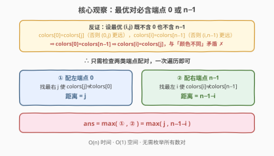
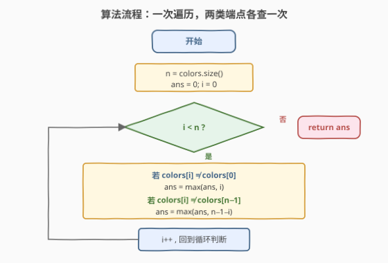
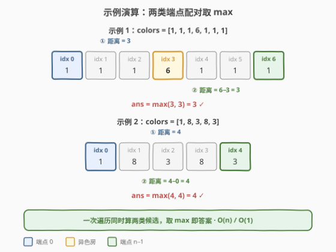

# LeetCode 两栋颜色不同且距离最远的房子 题解

## 1. 题目概述

- **标题 / 题号**：两栋颜色不同且距离最远的房子（#2078，easy）
- **链接**：https://leetcode.cn/problems/two-furthest-houses-with-different-colors/
- **难度**：简单
- **标签**：数组、贪心、数学观察

**题意**：街上有 `n` 栋房子整齐地排成一列，每栋房子都粉刷了一种颜色。给定下标从 `0` 开始且长度为 `n` 的整数数组 `colors`，其中 `colors[i]` 表示第 `i` 栋房子的颜色。

返回**两栋颜色不同**的房子之间的**最大距离**。第 `i` 栋房子和第 `j` 栋房子之间的距离是 `abs(i - j)`。

**示例 1**：

```text
输入：colors = [1,1,1,6,1,1,1]
输出：3
解释：颜色 1 标识为蓝色，颜色 6 标识为红色。
      两栋颜色不同且距离最远的房子是房子 0 和房子 3。
      距离 = abs(0 - 3) = 3。
      注意，房子 3 和房子 6 也可以产生最佳答案。
```

**示例 2**：

```text
输入：colors = [1,8,3,8,3]
输出：4
解释：两栋颜色不同且距离最远的房子是房子 0 和房子 4。
      距离 = abs(0 - 4) = 4。
```

**示例 3**：

```text
输入：colors = [0,1]
输出：1
解释：两栋颜色不同且距离最远的房子是房子 0 和房子 1。距离 = 1。
```

**约束**：

- $n == \text{colors.length}$
- $2 \leq n \leq 100$
- $0 \leq \text{colors}[i] \leq 100$
- 生成的测试数据满足**至少存在 2 栋颜色不同的房子**

> 💡 **审题关键**：① 求的是**最大**距离，不是最小——直觉上要把目光投向数组的**两端**而非中间；② 颜色只需**不同**即可，不限定具体颜色值；③ $n \leq 100$ 极小，暴力 $O(n^2)$ 必然通过，但存在 $O(n)$ 的优雅观察解。

## 2. 解题思路

### 2.1 暴力思路：双重循环枚举所有数对

最直观的做法：枚举所有房子对 $(i, j)$，若 $\text{colors}[i] \neq \text{colors}[j]$，就用 $|i - j|$ 更新答案。

- **正确性**：穷举所有候选，必然不漏。
- **效率**：数对数量 $\binom{n}{2} = O(n^2)$，$n = 100$ 时约 $5000$ 对，轻松通过。

> ⚠️ 暴力的浪费在于：它把**所有数对**都查了一遍，却没有利用「**最大距离**」这一目标的几何结构。求最大距离意味着最优对必然「尽量往两边靠」——这正是把 $O(n^2)$ 压到 $O(n)$ 的钥匙。

### 2.2 核心观察：最优对必含端点 0 或 n−1



关键直觉：**距离最大的那对房子，至少有一端是数组的端点（下标 0 或 n−1）**。

**反证证明**：设最优对为 $(i, j)$（$0 < i < j < n-1$，即两端都不是端点），距离为 $j - i$。

1. 考虑 $(0, j)$：距离 $j > j - i$。若 $\text{colors}[0] \neq \text{colors}[j]$，则 $(0, j)$ 是更优解，矛盾。故 $\text{colors}[0] = \text{colors}[j]$。
2. 考虑 $(i, n{-}1)$：距离 $n{-}1{-}i > j - i$。同理必须有 $\text{colors}[i] = \text{colors}[n{-}1]$。
3. 考虑 $(0, n{-}1)$：距离 $n{-}1 > j - i$。若 $\text{colors}[0] \neq \text{colors}[n{-}1]$，又是更优解，矛盾。故 $\text{colors}[0] = \text{colors}[n{-}1]$。
4. 链式传递：$\text{colors}[i] = \text{colors}[n{-}1] = \text{colors}[0] = \text{colors}[j]$，即 $\text{colors}[i] = \text{colors}[j]$，与「颜色不同」矛盾！✗

> 💡 一句话：**最优对必含端点**。因此只需检查两类配对：① 与左端点 0 配对，找最远的异色房；② 与右端点 $n{-}1$ 配对，找最远的异色房。答案取两者的 max。

$$\boxed{\text{answer} = \max\Big(\ \max_{j:\,\text{colors}[j]\neq\text{colors}[0]} j,\ \ \max_{i:\,\text{colors}[i]\neq\text{colors}[n-1]} (n{-}1{-}i)\ \Big)}$$

### 2.3 算法流程图



**完整步骤**：

1. 初始化 `ans = 0`。
2. **遍历** `i` 从 `0` 到 `n-1`：
   - 若 $\text{colors}[i] \neq \text{colors}[0]$：候选对 $(0, i)$，距离 $= i$，更新 `ans = max(ans, i)`。
   - 若 $\text{colors}[i] \neq \text{colors}[n{-}1]$：候选对 $(i, n{-}1)$，距离 $= n{-}1{-}i$，更新 `ans = max(ans, n - 1 - i)`。
3. **返回** `ans`。

> ⚠️ 两个 `if` 是**并列**关系（非 `else if`），每个 `i` 都要查两次：一次看它能否作为「与左端点配对的异色房」，一次看它能否作为「与右端点配对的异色房」。第一次遍历到异色房时距离未必最大，但遍历完整趟后 `ans` 自然取到最大值。

### 2.4 示例演算

以两个示例逐步演算：



**示例 1** `colors = [1,1,1,6,1,1,1]`（$n = 7$）：

| 检查类 | 端点 | 端点颜色 | 最远异色房 | 距离 |
|--------|------|----------|------------|------|
| ① 配左端点 0 | idx 0 | 1 | idx 3（颜色 6） | $3 - 0 = 3$ |
| ② 配右端点 6 | idx 6 | 1 | idx 3（颜色 6） | $6 - 3 = 3$ |

`ans = max(3, 3) = 3` ✓

**示例 2** `colors = [1,8,3,8,3]`（$n = 5$）：

| 检查类 | 端点 | 端点颜色 | 最远异色房 | 距离 |
|--------|------|----------|------------|------|
| ① 配左端点 0 | idx 0 | 1 | idx 4（颜色 3） | $4 - 0 = 4$ |
| ② 配右端点 4 | idx 4 | 3 | idx 0（颜色 1） | $4 - 0 = 4$ |

`ans = max(4, 4) = 4` ✓

> 💡 示例 2 中两类配对恰好指向**同一对**房子 $(0, 4)$——因为两端颜色本就不同，它们互为对方的最远异色房。这印证了反证中的关键一步：若 $\text{colors}[0] \neq \text{colors}[n{-}1]$，则 $(0, n{-}1)$ 直接就是最优解。

## 3. 参考代码

### 方法一：端点观察一次遍历（$O(n)$，推荐）

### C++

```cpp
class Solution {
public:
    int maxDistance(vector<int>& colors) {
        int n = colors.size(), ans = 0;
        for (int i = 0; i < n; ++i) {
            if (colors[i] != colors[0])     // 候选对 (0, i)
                ans = max(ans, i);
            if (colors[i] != colors[n - 1]) // 候选对 (i, n-1)
                ans = max(ans, n - 1 - i);
        }
        return ans;
    }
};
```

### Python

```python
class Solution:
    def maxDistance(self, colors: list[int]) -> int:
        n = len(colors)
        ans = 0
        for i, c in enumerate(colors):
            if c != colors[0]:      # 候选对 (0, i)
                ans = max(ans, i)
            if c != colors[n - 1]:  # 候选对 (i, n-1)
                ans = max(ans, n - 1 - i)
        return ans
```

> 💡 **写法要点**：① 两个 `if` 并列，不是 `elif`——每个 `i` 都要同时检查「能否配左端点」和「能否配右端点」；② `colors[0]` 和 `colors[n-1]` 在循环中不变，可提前取出避免反复索引；③ 当 `i = 0` 时第一个 `if` 必不成立（同色），`i = n-1` 时第二个 `if` 必不成立，无需特判。

### 方法二：双重循环暴力（$O(n^2)$，思路对照）

### C++

```cpp
class Solution {
public:
    int maxDistance(vector<int>& colors) {
        int n = colors.size(), ans = 0;
        for (int i = 0; i < n; ++i)
            for (int j = i + 1; j < n; ++j)
                if (colors[i] != colors[j])
                    ans = max(ans, j - i);
        return ans;
    }
};
```

### Python

```python
class Solution:
    def maxDistance(self, colors: list[int]) -> int:
        n = len(colors)
        return max(j - i
                   for i in range(n)
                   for j in range(i + 1, n)
                   if colors[i] != colors[j])
```

> 💡 暴力法忠实穷举所有数对，正确性不言自明，$n \leq 100$ 下 $\binom{100}{2} = 4950$ 对轻松通过。但若 $n$ 放大到 $10^5$，$O(n^2)$ 必然超时，此时只有方法一的 $O(n)$ 能过。

## 4. 复杂度分析

| 维度 | 方法 | 复杂度 | 说明 |
|------|------|--------|------|
| 时间 | 端点观察 | $O(n)$ | 一次遍历，每个位置 $O(1)$ 做两次比较 |
| 空间 | 端点观察 | $O(1)$ | 仅 `ans` 一个标量 |
| 时间 | 双重循环 | $O(n^2)$ | 枚举所有数对 $\binom{n}{2}$ |
| 空间 | 双重循环 | $O(1)$ | 仅 `ans` 一个标量 |

> 💡 本题 $n \leq 100$，两种方法都能通过。但方法一用「**反证 + 端点观察**」把 $O(n^2)$ 压到 $O(n)$——这是「**用数学观察换计算量**」的典型范例：抓住「最优对必含端点」这一不变量，就能跳过绝大多数中间数对。

## 5. 扩展：提前终止的双向扫描

方法一遍历了整个数组，但其实可以**提前终止**：从左往右找第一个 $\neq \text{colors}[n{-}1]$ 的位置 `i`，从右往左找第一个 $\neq \text{colors}[0]$ 的位置 `j`，答案即 $\max(n{-}1{-}i,\ j)$。

```cpp
class Solution {
public:
    int maxDistance(vector<int>& colors) {
        int n = colors.size();
        int i = 0;                          // 从左找第一个 ≠ colors[n-1]
        while (colors[i] == colors[n - 1]) ++i;
        int j = n - 1;                      // 从右找第一个 ≠ colors[0]
        while (colors[j] == colors[0]) --j;
        return max(n - 1 - i, j);
    }
};
```

> 💡 两种写法等价，复杂度均为 $O(n)$。双向扫描版在「两端颜色不同」时瞬间返回（`i=0, j=n-1`），最坏仍需完整扫描。面试中方法一更易讲清「每个位置同时检查两类配对」的统一逻辑；双向扫描版则更直观地对应「找最左/最右异色房」的描述。

## 6. 面试要点

**Q1：为什么最优对必含端点 0 或 n−1？**

> 反证：设最优对 $(i,j)$ 两端都不是端点。则 $(0,j)$ 距离更大，要保证它不更优必须有 $\text{colors}[0]=\text{colors}[j]$；$(i,n{-}1)$ 同理有 $\text{colors}[i]=\text{colors}[n{-}1]$；$(0,n{-}1)$ 同理有 $\text{colors}[0]=\text{colors}[n{-}1]$。链式传递得 $\text{colors}[i]=\text{colors}[j]$，矛盾。

**Q2：两个 if 为什么是并列而不是 elif？**

> 每个 `i` 要**同时**充当两类角色：作为「与左端点 0 配对的异色房」和「与右端点 $n{-}1$ 配对的异色房」。若用 `elif`，则一旦第一个 `if` 命中就跳过第二个检查，会漏掉「这个位置虽与左端点同色，但与右端点异色」的情况，导致答案偏小。

**Q3：如果 colors[0] ≠ colors[n−1]，答案是什么？**

> 直接是 $n - 1$。两端颜色不同时，$(0, n{-}1)$ 就是最优对——距离已达数组最大跨度 $n{-}1$，不可能有更远的。此时方法一中 `i = n-1` 时第一个 `if` 命中得 `ans = n-1`，`i = 0` 时第二个 `if` 命中也得 `n-1`，自然正确。

**Q4：暴力法和观察法分别适合什么场景？**

> 暴力法思路直观、不易出错，适合数据规模小（$n \leq 10^3$）或一时想不到观察结论时作为保底。观察法适合 $n$ 较大或追求最优复杂度时。面试中可先说暴力建立正确性信心，再用反证推出端点观察展示优化能力。

**Q5：这类「最大距离」问题的通用思路是什么？**

> 求最大距离时，最优对往往「贴着边界」——这是「**极值在端点**」的常见模式。通用套路：① 先想暴力穷举；② 观察目标函数（距离）的几何结构，看是否能锁定到端点或边界；③ 用反证或单调性证明观察正确；④ 据此设计 $O(n)$ 扫描。

> 💡 **一句话总结**：最优对必含端点 0 或 $n{-}1$（反证可证）⇒ 一次遍历，每个位置同时查「能否配左端点」和「能否配右端点」，取 max 即答案。$O(n)$ 时间、$O(1)$ 空间。

## 同类练习题

| # | 题目 | 与本题的关联 |
|---|------|-------------|
| 849 | [到最近的人的最大距离](https://leetcode.cn/problems/maximize-distance-to-closest-person/) | 同为「数组中求最大距离」，849 找离最近人最远的位置（区间中点），本题找异色最远对（端点配对），距离类问题两种经典切入 |
| 11 | [盛最多水的容器](https://leetcode.cn/problems/container-with-most-water/) | 双指针从两端向内收缩求最大面积，与本题「答案必含端点」的观察形成对照——本题只需查端点无需收缩 |
| 219 | [存在重复元素 II](https://leetcode.cn/problems/contains-duplicate-ii/) | 数组中找满足条件（同值且距离 ≤ k）的数对，与本题「异色且距离最大」互为对偶，巩固距离类问题的哈希/扫描思路 |
| 896 | [单调数列](https://leetcode.cn/problems/monotonic-array/) | 一次遍历判定数组性质，同为「$O(n)$ 简单题」范式，体会「一次遍历 + 多条件并行检查」的写法 |
