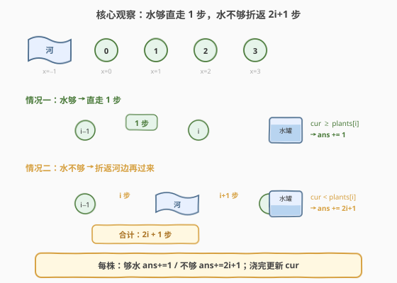
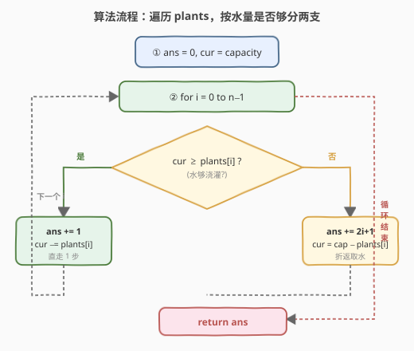
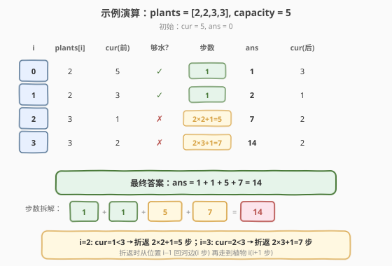

# 给植物浇水

- **题目名称**：给植物浇水
- **链接**：[2079. 给植物浇水](https://leetcode.cn/problems/watering-plants/)
- **难度**：中等
- **标签**：数组、贪心、模拟

## 1. 题目概述

用一个水罐给花园里的 `n` 株植物浇水。植物排成一行，从左到右编号 `0` 到 `n-1`，第 `i` 株植物的位置是 `x = i`。`x = -1` 处有一条河，你可以在那里重新灌满水罐。

浇水规则：

- 按**从左到右**的顺序给植物浇水。
- 在给当前植物浇完水之后，如果你没有足够的水**完全**浇灌下一株植物，那么你就需要**返回河边**重新装满水罐。
- 你**不能**提前重新灌满水罐。

最初你在河边（`x = -1`），水罐是满的。在 `x` 轴上每移动一个单位都需要一步。给定下标从 `0` 开始的整数数组 `plants`（`plants[i]` 为第 `i` 株植物需要的水量）和整数 `capacity`（水罐容量），返回浇灌所有植物需要的**步数**。

**示例 1**：

```text
输入：plants = [2,2,3,3], capacity = 5
输出：14
解释：从河边开始，此时水罐是装满的：
- 走到植物 0 (1 步)，浇水。水罐中还有 3 单位的水。
- 走到植物 1 (1 步)，浇水。水罐中还有 1 单位的水。
- 由于不能完全浇灌植物 2，回到河边取水 (2 步)。
- 走到植物 2 (3 步)，浇水。水罐中还有 2 单位的水。
- 由于不能完全浇灌植物 3，回到河边取水 (3 步)。
- 走到植物 3 (4 步)，浇水。
需要的步数 = 1 + 1 + 2 + 3 + 3 + 4 = 14。
```

**示例 2**：

```text
输入：plants = [1,1,1,4,2,3], capacity = 4
输出：30
解释：从河边开始，此时水罐是装满的：
- 走到植物 0,1,2 (3 步)，浇水。回到河边取水 (3 步)。
- 走到植物 3 (4 步)，浇水。回到河边取水 (4 步)。
- 走到植物 4 (5 步)，浇水。回到河边取水 (5 步)。
- 走到植物 5 (6 步)，浇水。
需要的步数 = 3 + 3 + 4 + 4 + 5 + 5 + 6 = 30。
```

**示例 3**：

```text
输入：plants = [7,7,7,7,7,7,7], capacity = 8
输出：49
解释：每次浇水都需要重新灌满水罐。
需要的步数 = 1 + 1 + 2 + 2 + 3 + 3 + 4 + 4 + 5 + 5 + 6 + 6 + 7 = 49。
```

**约束条件**：

- $n == \text{plants.length}$
- $1 \leq n \leq 1000$
- $1 \leq \text{plants}[i] \leq 10^6$
- $\max(\text{plants}[i]) \leq \text{capacity} \leq 10^9$

> 💡 **审题关键**：① 浇水**顺序固定**——从左到右逐株浇，不能跳过或回头；② **不能提前灌水**——只有「不够浇下一株」时才折返，这保证了每次折返都是**必须的**、最优的（贪心正确性来源）；③ 每株植物的需求 $\leq$ 容量，保证一罐水**一定能浇完一株**；④ 步数 = 在 `x` 轴上移动的总距离，折返的代价取决于当前植物的位置 `i`。

---

## 2. 解题思路

### 2.1 暴力思路：逐步模拟

最直观的做法：用一个变量 `cur` 跟踪水罐剩余水量，一个变量 `pos` 跟踪当前位置，逐株植物模拟浇水过程。

- 初始 `pos = -1`（河边），`cur = capacity`。
- 对每株植物 `i`：
  - 若 `cur >= plants[i]`：从 `pos` 走到 `i`（`i - pos` 步），浇水，`cur -= plants[i]`，`pos = i`。
  - 若 `cur < plants[i]`：先从 `pos` 走回河边 `-1`（`pos - (-1) = pos + 1` 步），灌满 `cur = capacity`，再走到植物 `i`（`i - (-1) = i + 1` 步），浇水，`cur -= plants[i]`，`pos = i`。

- **正确性**：完全复现题目描述的浇水过程，必然得到正确答案。
- **效率**：每株植物 $O(1)$ 处理，总时间 $O(n)$，空间 $O(1)$。其实暴力已经是最优解。

> ⚠️ 暴力已经 $O(n)$，没有更优复杂度可追求。优化的方向不在复杂度，而在**简化代码**——通过数学观察把「位置跟踪」和「分段步数计算」压缩成一行公式。

### 2.2 核心观察：折返步数的闭式公式



整个解法建立在**一个关键观察**上。

**观察：折返的步数只取决于植物位置 `i`**

考虑到达植物 `i` 之前的两种情况（你当前在植物 `i-1` 处，或在河边 `-1` 处对于 `i=0`）：

| 情况 | 条件 | 路径 | 步数 |
|------|------|------|------|
| **水够** | `cur >= plants[i]` | 从 `i-1` 直走到 `i` | $1$ |
| **水不够** | `cur < plants[i]` | 从 `i-1` 回河边 $(-1)$，再走到 `i` | $(i-1-(-1)) + (i-(-1)) = i + (i+1) = 2i + 1$ |

> 💡 **为什么折返是 $2i+1$？** 你当前在位置 $i-1$（刚浇完上一株）。要回河边（$x=-1$），需走 $i-1 - (-1) = i$ 步；灌满后从河边走到植物 $i$，需走 $i - (-1) = i+1$ 步。合计 $i + (i+1) = 2i+1$ 步。对于 $i=0$ 的情况，初始就在河边且水罐是满的，所以 `cur >= plants[0]` 必然成立（因为 $\text{plants}[0] \leq \text{capacity}$），不会触发折返。

$$\boxed{\text{step}_i = \begin{cases} 1 & \text{if } \text{cur} \geq \text{plants}[i] \\ 2i + 1 & \text{if } \text{cur} < \text{plants}[i] \end{cases}}$$

每种情况后更新 `cur`：水够则 `cur -= plants[i]`；水不够则灌满后浇 `cur = capacity - plants[i]`。

**用示例 1 验证**：`plants = [2,2,3,3]`, `capacity = 5`。

| $i$ | $\text{plants}[i]$ | $\text{cur}$（前） | 够水? | 步数 | $\text{ans}$ | $\text{cur}$（后） |
|-----|---------------------|---------------------|-------|------|---------------|---------------------|
| 0 | 2 | 5 | ✓ | $1$ | 1 | 3 |
| 1 | 2 | 3 | ✓ | $1$ | 2 | 1 |
| 2 | 3 | 1 | ✗ | $2 \times 2 + 1 = 5$ | 7 | 2 |
| 3 | 3 | 2 | ✗ | $2 \times 3 + 1 = 7$ | 14 | 2 |

合计 $\text{ans} = 14$ ✓

### 2.3 算法流程图



**完整步骤**：

1. 初始化 `ans = 0`，`cur = capacity`（水罐满）。
2. **遍历** `i` 从 `0` 到 `n-1`：
   - 若 `cur >= plants[i]`：`ans += 1`，`cur -= plants[i]`（直走 1 步）。
   - 若 `cur < plants[i]`：`ans += 2 * i + 1`，`cur = capacity - plants[i]`（折返取水再过来）。
3. **返回** `ans`。

> ⚠️ **一个易错点**：折返后 `cur` 的更新不是 `cur = capacity` 再 `cur -= plants[i]` 两步，而是直接 `cur = capacity - plants[i]`。因为灌满后立即浇掉了 `plants[i]` 单位的水。合并成一步既简洁又不易出错。

### 2.4 示例演算

以 `plants = [2,2,3,3]`, `capacity = 5` 逐步演算：



**步数拆解**：

- $i=0$：`cur=5 ≥ 2` → 直走 $1$ 步，`cur=3`
- $i=1$：`cur=3 ≥ 2` → 直走 $1$ 步，`cur=1`
- $i=2$：`cur=1 < 3` → 折返 $2 \times 2+1=5$ 步，`cur=2`
- $i=3$：`cur=2 < 3` → 折返 $2 \times 3+1=7$ 步，`cur=2`

$$\text{ans} = 1 + 1 + 5 + 7 = 14 \checkmark$$

> 💡 **对照示例 3** `plants = [7,7,7,7,7,7,7]`, `capacity = 8`：每株浇完后 `cur=1 < 7`，所以从 $i=1$ 起每株都折返。步数 $= 1 + \sum_{i=1}^{6}(2i+1) = 1 + 3+5+7+9+11+13 = 49$ ✓。注意 $i=0$ 时初始满罐 `cur=8 ≥ 7`，直走 $1$ 步。

---

## 3. 参考代码

### 方法一：闭式公式一次遍历（$O(n)$，推荐）

### C++

```cpp
class Solution {
public:
    int wateringPlants(vector<int>& plants, int capacity) {
        int ans = 0, cur = capacity;
        for (int i = 0; i < (int)plants.size(); ++i) {
            if (cur >= plants[i]) {
                ans += 1;
                cur -= plants[i];
            } else {
                ans += 2 * i + 1;
                cur = capacity - plants[i];
            }
        }
        return ans;
    }
};
```

### Python

```python
class Solution:
    def wateringPlants(self, plants: list[int], capacity: int) -> int:
        ans, cur = 0, capacity
        for i, p in enumerate(plants):
            if cur >= p:
                ans += 1
                cur -= p
            else:
                ans += 2 * i + 1
                cur = capacity - p
        return ans
```

> 💡 **写法要点**：① `cur` 初始化为 `capacity`（满罐出发）；② 判断用 `>=`——「恰好够」也算够，直走 1 步；③ 折返分支的步数 `2*i+1` 可以这样记忆：回河边 $i$ 步 + 到植物 $i+1$ 步；④ `cur` 更新合并为 `capacity - plants[i]`，省去先赋值再减的两步写法。

### 方法二：位置跟踪模拟（$O(n)$，思路对照）

### C++

```cpp
class Solution {
public:
    int wateringPlants(vector<int>& plants, int capacity) {
        int ans = 0, cur = capacity, pos = -1;
        for (int i = 0; i < (int)plants.size(); ++i) {
            if (cur < plants[i]) {
                ans += pos + 1;          // 回河边：pos → -1
                cur = capacity;
            }
            ans += i - pos;              // 走到植物 i
            cur -= plants[i];
            pos = i;
        }
        return ans;
    }
};
```

### Python

```python
class Solution:
    def wateringPlants(self, plants: list[int], capacity: int) -> int:
        ans, cur, pos = 0, capacity, -1
        for i, p in enumerate(plants):
            if cur < p:
                ans += pos + 1           # 回河边：pos → -1
                cur = capacity
            ans += i - pos               # 走到植物 i
            cur -= p
            pos = i
        return ans
```

> 💡 模拟法显式跟踪 `pos`，把「回河边」和「走到植物」拆成两步累加，逻辑更贴近物理过程。与方法一相比，当 `cur < plants[i]` 时：`ans += (pos+1) + (i-(-1))` = `(i-1+1) + (i+1)` = `i + i+1` = `2i+1`，完全等价。

---

## 4. 复杂度分析

| 维度 | 方法 | 复杂度 | 说明 |
|------|------|--------|------|
| 时间 | 闭式公式 | $O(n)$ | 一次遍历，每株 $O(1)$ 判断 + 累加 |
| 空间 | 闭式公式 | $O(1)$ | 仅 `ans`、`cur` 两个标量 |
| 时间 | 位置模拟 | $O(n)$ | 同为一次遍历，每株 $O(1)$ |
| 空间 | 位置模拟 | $O(1)$ | 多一个 `pos` 变量，仍 $O(1)$ |

> 💡 两种方法复杂度完全相同。区别仅在代码简洁度：闭式公式把回河边和走到植物合并为 `2i+1`，省去 `pos` 变量；位置模拟更直观、不易记错公式。面试中可先讲模拟法建立正确性，再推导闭式公式展示数学简化能力。

---

## 5. 扩展：若允许提前灌水

本题限制「**不能提前灌水**」，这保证了贪心的正确性——每次折返都是必须的。若放开此限制（允许在任意位置主动返回河边灌水），问题变为**最优决策**问题：在哪些位置提前折返能使总步数最小？

直觉上，提前灌水**不会更优**：因为当前水够时提前折返，多走了 $2i+1$ 步却只换来后续某一株少折返一次（那株折返的步数 $\leq 2n-1$）。但若后续连续多株都差一点点水，提前灌一次可能省多次折返。这使得问题从 $O(n)$ 贪心变为需要 DP 或更复杂策略的优化问题，超出本题范围。

> 💡 「不能提前灌水」这一约束看似限制，实则是**简化问题的关键**——它让每步决策唯一确定（够就走，不够就折返），无需比较不同策略的代价，直接贪心即可。

---

## 6. 面试要点

**Q1：为什么折返步数是 $2i+1$ 而不是 $2i$ 或 $2(i+1)$？**

> 折返时你站在位置 $i-1$（刚浇完上一株）。回河边：$(i-1) - (-1) = i$ 步。从河边到植物 $i$：$i - (-1) = i+1$ 步。合计 $i + (i+1) = 2i+1$。记忆技巧：「回 $i$ 步，来 $i+1$ 步」——来比回多 1，因为目的地比出发点远了一格。

**Q2：为什么 $i=0$ 不会触发折返？**

> 初始在河边（$x=-1$），水罐满（`cur = capacity`）。约束保证 $\text{plants}[0] \leq \text{capacity}$，所以 `cur >= plants[0]` 必然成立，直走 1 步即可。即便公式 $2 \times 0 + 1 = 1$ 也恰好等于直走的 1 步，所以即使误入折返分支，结果仍正确——但逻辑上不会触发。

**Q3：「不能提前灌水」这一约束为什么重要？**

> 它保证了每次折返都是**被迫的**（水不够才回），决策唯一确定。若允许提前灌水，则需在「现在折返」和「等不够了再折返」之间做最优选择，问题从贪心变为优化。约束让算法退化为简单的逐株判断。

**Q4：如果某株植物的需求超过容量怎么办？**

> 约束保证 $\max(\text{plants}[i]) \leq \text{capacity}$，所以不会出现。若去掉此约束，则该植物无法被浇灌（一满罐都不够），应返回 $-1$ 或抛出异常。这是面试中可以主动提出的边界情况。

**Q5：本题的贪心策略为什么是最优的？**

> 因为「不能提前灌水」+「顺序固定」+「每株需求 $\leq$ 容量」三个约束使得每步决策唯一：水够就直走（1 步），不够就折返（$2i+1$ 步）。没有任何可选的决策分支，也就没有「更优」可言——贪心即唯一解。

> 💡 **一句话总结**：逐株遍历，水够走 1 步、不够走 $2i+1$ 步，同时更新 `cur`。$O(n)$ 时间、$O(1)$ 空间。核心是把折返的往返距离压缩为位置 $i$ 的闭式公式 $2i+1$。

---

## 7. 同类练习题

- [2073. 买票需要的时间](https://leetcode.cn/problems/time-needed-to-buy-tickets/)：同为「按位置贡献一次遍历」——将循环轮转模拟压缩为按位置分类求和，$O(n)$ 代替 $O(\sum \text{tickets})$
- [2105. 给植物浇水 II](https://leetcode.cn/problems/watering-plants-ii/)：本题的进阶版——两人分别从两端浇水，各持一个水罐，贪心分配浇灌顺序
- [2139. 得到目标值的最小行动次数](https://leetcode.cn/problems/minimum-moves-to-reach-target-score/)：贪心 + 逆向思维——从目标倒推回 1，优先使用加倍操作，同为「每步贪心选择最优动作」
- [2135. 统计追加字母后的单词数](https://leetcode.cn/problems/count-words-obtained-after-adding-a-letter/)：贪心 + 位运算——将字符差异编码为位掩码，按子集关系判定可达性
