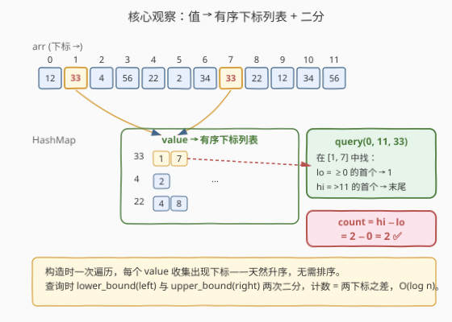
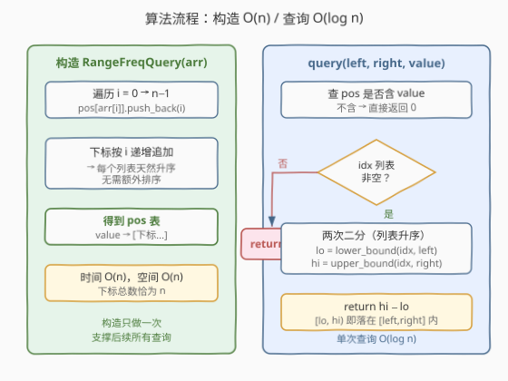
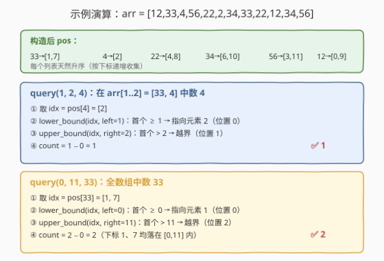

# LeetCode 区间内查询数字的频率 题解

## 1. 题目概述

- **标题 / 题号**：区间内查询数字的频率（#2080，medium）
- **链接**：https://leetcode.cn/problems/range-frequency-queries/
- **难度**：中等
- **标签**：设计、哈希表、二分查找、数组

**题意**：给定下标从 **0** 开始的整数数组 `arr`，要求设计一个数据结构 `RangeFreqQuery` 支持区间频率查询：

- `RangeFreqQuery(int[] arr)`：用数组 `arr` 初始化。
- `int query(int left, int right, int value)`：返回子数组 `arr[left...right]`（含两端）中等于 `value` 的元素个数。

**示例 1**：

```text
输入：
["RangeFreqQuery", "query", "query"]
[[[12, 33, 4, 56, 22, 2, 34, 33, 22, 12, 34, 56]], [1, 2, 4], [0, 11, 33]]
输出：
[null, 1, 2]

解释：
RangeFreqQuery q = new RangeFreqQuery([12, 33, 4, 56, 22, 2, 34, 33, 22, 12, 34, 56]);
q.query(1, 2, 4);    // arr[1..2] = [33, 4]，4 出现 1 次 → 返回 1
q.query(0, 11, 33);  // 整个数组中 33 出现 2 次 → 返回 2
```

**约束**：

- $1 \le \text{arr.length} \le 10^5$
- $1 \le \text{arr[i]}, \text{value} \le 10^4$
- $0 \le \text{left} \le \text{right} < \text{arr.length}$
- `query` 的**总调用次数**最多 $10^5$

> 💡 **审题关键**：① 数组**初始化后不可变**——可以放心做一次性预处理；② 查询的是「某个特定 `value`」在区间内的频数，而非区间内所有元素的统计；③ 数组长度与查询次数同阶（都到 $10^5$），单次查询必须 $O(\log n)$ 或更优，逐元素扫描必超时；④ `value` 取值上限 $10^4$，但 $10^4$ 个「每值前缀和数组」共 $10^9$ 空间，不可行——需要更紧凑的结构。

## 2. 解题思路

### 2.1 暴力思路：每次查询线性扫描

对每个 `query(left, right, value)`，遍历 `arr[left..right]` 数等于 `value` 的元素个数。

- **正确性**：显然正确。
- **效率**：单次查询 $O(n)$，$q$ 次共 $O(n \cdot q)$，$n, q \le 10^5$ 时达 $10^{10}$，**超时**。

> ⚠️ 浪费在于「对每个查询都重新扫一遍数组」。突破口：把「`value` 出现在哪些位置」**预处理**好，查询时只在该 `value` 的位置集合里做范围计数。

### 2.2 核心观察：值 → 有序下标列表 + 二分



**关键转换**分两步：

**第一步：构造时为每个 `value` 收集出现下标。** 用哈希表 `pos`，`pos[value]` 存放 `value` 在 `arr` 中出现的**所有下标**。由于遍历 `arr` 时下标 `i` 递增，`push_back` 自然得到**升序列表**，无需排序：

$$
\text{pos}[\text{value}] = [\,i_1, i_2, \dots, i_k\,], \quad i_1 < i_2 < \dots < i_k
$$

**第二步：查询时在升序列表上两次二分。** 给定 `[left, right]`，区间内 `value` 的频数 = 列表中下标落在 `[left, right]` 内的元素个数。在升序列表上：

- `lo = lower_bound(idx, left)`：首个 $\ge \text{left}$ 的位置（列表下标）；
- `hi = upper_bound(idx, right)`：首个 $> \text{right}$ 的位置（列表下标）。

则 `[lo, hi)` 这一左闭右开区间内的元素，其下标恰好都落在 `[left, right]` 内，频数即为：

$$
\text{count} = \text{hi} - \text{lo}
$$

> 💡 **为什么 `hi − lo` 就是答案？** `lower_bound` 与 `upper_bound` 是把升序列表「切成三段」：< `left`、`[left, right]`、`> right`。`lo` 指向中段起点，`hi` 指向中段终点（即右段起点），故 `hi − lo` = 中段长度 = 落在 `[left, right]` 内的下标个数。若 `value` 不在 `pos` 中，或区间内无该值，`hi − lo = 0`，天然返回 0。

> ⚠️ **必须用 `upper_bound(right)` 而非 `lower_bound(right)`**：下标等于 `right` 的元素**在区间内**（区间含右端），应被计入。`upper_bound` 找的是首个**严格大于** `right` 的位置，正好把 `= right` 的元素留在中段内。若误用 `lower_bound(right)` 会漏数下标恰为 `right` 的那次出现。

### 2.3 算法流程图



**构造 `RangeFreqQuery(arr)`**：

1. 初始化空哈希表 `pos`。
2. 顺序遍历 `arr`，对每个 `i` 执行 `pos[arr[i]].push_back(i)`。
3. 完成后每个 `pos[v]` 即为升序下标列表。时间 $O(n)$，空间 $O(n)$（所有列表长度之和恰为 $n$）。

**查询 `query(left, right, value)`**：

1. 若 `pos` 不含 `value`，返回 0。
2. 取 `idx = pos[value]`（升序）。
3. `lo = lower_bound(idx, left)`，`hi = upper_bound(idx, right)`。
4. 返回 `hi − lo`。单次 $O(\log n)$。

### 2.4 示例演算



以题目示例 `arr = [12, 33, 4, 56, 22, 2, 34, 33, 22, 12, 34, 56]` 为例。构造后关键条目：

| value | 下标列表 |
|-------|----------|
| 33    | [1, 7]   |
| 4     | [2]      |
| 22    | [4, 8]   |
| 34    | [6, 10]  |
| 56    | [3, 11]  |
| 12    | [0, 9]   |

**查询 `query(1, 2, 4)`**：`idx = [2]`。

| 步骤 | 计算 | 结果 |
|------|------|------|
| `lower_bound([2], 1)` | 首个 $\ge 1$ → 元素 2，位置 0 | `lo = 0` |
| `upper_bound([2], 2)` | 首个 $> 2$ → 越界，位置 1 | `hi = 1` |
| 计数 | `hi − lo = 1 − 0` | **1** ✓ |

**查询 `query(0, 11, 33)`**：`idx = [1, 7]`。

| 步骤 | 计算 | 结果 |
|------|------|------|
| `lower_bound([1,7], 0)` | 首个 $\ge 0$ → 元素 1，位置 0 | `lo = 0` |
| `upper_bound([1,7], 11)` | 首个 $> 11$ → 越界，位置 2 | `hi = 2` |
| 计数 | `hi − lo = 2 − 0` | **2** ✓ |

下标 1、7 均落在 `[0, 11]` 内，频数 2，与示例输出一致。

> 💡 **若查询 `query(2, 6, 33)` 呢？** `idx = [1, 7]`。`lower_bound([1,7], 2)` → 元素 7，位置 1（下标 1 < 2 被排除）；`upper_bound([1,7], 6)` → 元素 7，位置 1（下标 7 > 6 被排除）。`hi − lo = 1 − 1 = 0`。区间 `[2, 6] = [4, 56, 22, 2, 34]` 中确实无 33，返回 0 ✓。

## 3. 参考代码

### C++

```cpp
class RangeFreqQuery {
    unordered_map<int, vector<int>> pos; // value -> 升序下标列表
  public:
    RangeFreqQuery(vector<int>& arr) {
        for (int i = 0; i < (int)arr.size(); ++i) {
            pos[arr[i]].push_back(i); // 下标递增追加，天然升序
        }
    }

    int query(int left, int right, int value) {
        auto it = pos.find(value);
        if (it == pos.end()) return 0;
        const vector<int>& idx = it->second;
        int lo = lower_bound(idx.begin(), idx.end(), left) - idx.begin();
        int hi = upper_bound(idx.begin(), idx.end(), right) - idx.begin();
        return hi - lo;
    }
};
```

### Python

```python
from bisect import bisect_left, bisect_right
from collections import defaultdict


class RangeFreqQuery:
    def __init__(self, arr: List[int]):
        self.pos = defaultdict(list)
        for i, v in enumerate(arr):
            self.pos[v].append(i)  # 下标递增追加，天然升序

    def query(self, left: int, right: int, value: int) -> int:
        idx = self.pos.get(value)
        if not idx:
            return 0
        lo = bisect_left(idx, left)   # 首个 >= left 的位置
        hi = bisect_right(idx, right) # 首个 >  right 的位置
        return hi - lo
```

> 💡 **C++ 细节**：`lower_bound` / `upper_bound` 返回迭代器，减去 `idx.begin()` 得到下标。`pos.find(value)` 比 `pos.count(value)` 更省——找到后直接取 `it->second`，避免再次哈希查找。`pos` 不含 `value` 时 `idx` 为空，`lower_bound`/`upper_bound` 都返回 `begin()`，`hi − lo = 0`，因此「`pos` 不含 `value`」的特判其实可省；显式写出只是常数优化与可读性。

## 4. 复杂度分析

| 维度 | 复杂度 | 说明 |
|------|--------|------|
| 构造时间 | $O(n)$ | 一次遍历，每个下标 `push_back` 摊还 $O(1)$ |
| 单次查询 | $O(\log n)$ | 两次二分，在最长下标列表（长度 $\le n$）上 |
| 总时间 | $O(n + q \log n)$ | $n, q \le 10^5$，约 $10^5 + 10^5 \log 10^5 \approx 1.7 \times 10^6$，轻松通过 |
| 空间 | $O(n)$ | 所有下标列表长度之和恰为 $n$，外加哈希表开销 |

> ⚠️ 暴力法 $O(n \cdot q)$ 在 $n = q = 10^5$ 时约 $10^{10}$ 次操作，必超时。预处理把「找位置」一次性做掉，查询只在**单个 `value` 的下标列表**上二分——这是**离线/不可变数组 + 区间计数**问题的经典套路：用空间换时间，用有序性换 $O(\log n)$。

## 5. 扩展：与「每值前缀和」的对比

若 `value` 取值范围很小（如只有几种不同值），另一种做法是**为每个 `value` 维护一份出现次数前缀和**：`pre[value][i]` = `arr[0..i-1]` 中 `value` 的个数，查询 `pre[value][right+1] − pre[value][left]`，$O(1)$。

| 维度 | 哈希 + 有序列表 + 二分（本文） | 每值前缀和 |
|------|------------------------------|------------|
| 预处理 | $O(n)$ | $O(n \cdot V)$，$V$ 为不同值数 |
| 单查询 | $O(\log n)$ | $O(1)$ |
| 空间 | $O(n)$ | $O(n \cdot V)$ |
| 适用 | 值域大、稀疏（本题 $V$ 可达 $10^4$） | 值域极小（如 $V \le 10$） |

> ⚠️ 本题若强行用「每值前缀和」：值域 $10^4$，需 $10^4 \times 10^5 = 10^9$ 空间，**不可行**。而哈希 + 有序列表只存「实际出现的下标」，空间严格 $O(n) = 10^5$，远更节省。本质区别：前缀和把信息按「值 × 位置」二维铺开，列表法把信息按「值」分组、组内只存**非零位置**——当每个值出现稀疏时，列表法空间优势巨大。

> 💡 **若数组可变**（如支持修改 `arr[i]`），本文结构失效（需动态维护有序列表，单点修改 $O(n)$）。此时应改用**值域分块**或**带平衡树/树状数组的离线结构**，复杂度上升至 $O(\sqrt{n})$ 或 $O(\log^2 n)$ 单次操作。本题数组不可变，无需考虑。

## 6. 面试要点

1. **为什么下标列表天然有序，无需排序？**

   - 构造时按 `i = 0 → n−1` 顺序遍历 `arr`，对 `pos[arr[i]]` 执行 `push_back(i)`。下标递增追加，列表自动升序。这是「按出现顺序收集」带来的免费性质，省去 $O(k \log k)$ 排序。

2. **`lower_bound(left)` 与 `upper_bound(right)` 各自在找什么？**

   - `lower_bound(idx, left)`：列表中首个 $\ge \text{left}$ 的元素位置，即区间内 `value` 的**最早**下标。`upper_bound(idx, right)`：列表中首个 $> \text{right}$ 的元素位置，标记区间内 `value` 的**最晚**下标之后一格。两者之差 = 区间内出现次数。

3. **为什么必须用 `upper_bound(right)` 而非 `lower_bound(right)`？**

   - 题目区间含右端点 `right`，下标等于 `right` 的元素应被计入。`upper_bound` 找**严格大于** `right` 的位置，把 `= right` 的元素留在中段内；`lower_bound(right)` 会把 `= right` 的元素当作「首个 $\ge$ right」划入右段，导致漏数一次。

4. **`value` 不在 `pos` 中时为什么返回 0 是正确的？**

   - `value` 从未在 `arr` 出现，自然在任意子数组中频数为 0。代码中显式 `if (it == pos.end()) return 0` 既快又清晰。即便省去特判，空列表上 `lower_bound`/`upper_bound` 都返回 `begin()`，`hi − lo = 0`，结果仍正确——特判仅为常数优化。

5. **能否做到 $O(1)$ 查询？**

   - 若值域极小，可用「每值前缀和」做到 $O(1)$ 查询、$O(nV)$ 空间（见第 5 节）。本题值域 $10^4$、$n = 10^5$，前缀和方案空间 $10^9$ 不可行。$O(\log n)$ 的二分方案是空间与时间的最佳折中。

## 同类练习题

| # | 题目 | 与本题的关联 |
|---|------|-------------|
| 2055 | [蜡烛之间的盘子](https://leetcode.cn/problems/plates-between-candles/)（[题解](../2001-2100/2055_蜡烛之间的盘子.md)） | 同样是「区间内统计某元素个数」，用前缀和 + 蜡烛边界预处理做到 $O(1)$ 查询，对比本文的哈希 + 二分，两种离线查询套路的取舍 |
| 34 | [在排序数组中查找元素的第一个和最后一个位置](https://leetcode.cn/problems/find-first-and-last-position-of-element-in-sorted-array/) | `lower_bound`/`upper_bound` 二分找边界的母题，本文查询的核心原语 |
| 981 | [基于时间的键值存储](https://leetcode.cn/problems/time-based-key-value-store/)（[题解](../0901-1000/981_基于时间的键值存储.md)） | HashMap + 有序数组二分找右界，与本文「值 → 有序列表 + 二分」结构同源 |
| 208 | [实现 Trie](https://leetcode.cn/problems/implement-trie-prefix-tree/)（[题解](../0201-0300/208_实现Trie.md)） | 另一类「预处理 + 查询」设计题，对比 Trie 的前缀检索与本文的范围计数 |
| 303 | [区域和检索 - 数组不可变](https://leetcode.cn/problems/range-sum-query-immutable/)（[题解](../0301-0400/303_区域和检索 - 数组不可变.md)） | 不可变数组的区间查询招牌题，前缀和路线的代表；本文是「按值分组 + 二分」路线的代表 |
