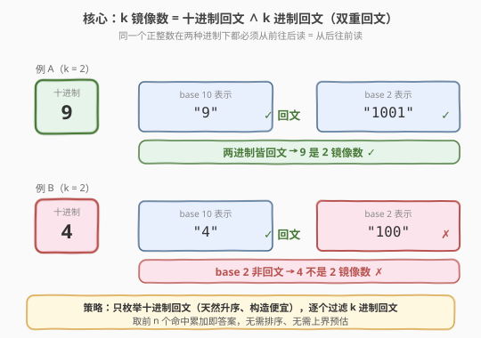
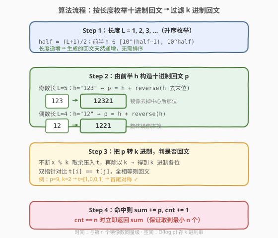
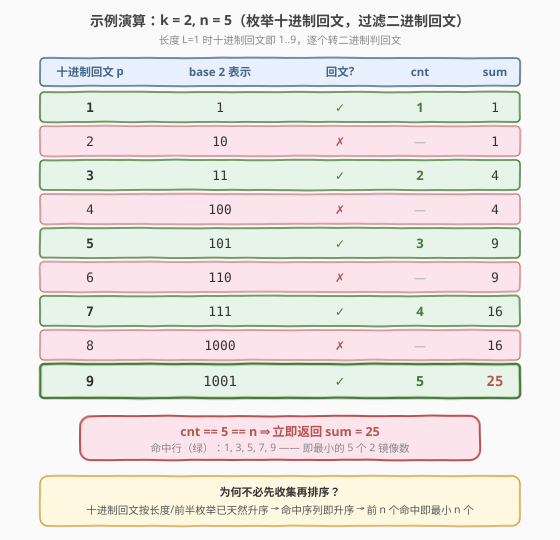

# k 镜像数字的和

- **题目名称**：k 镜像数字的和
- **链接**：[2081. k 镜像数字的和](https://leetcode.cn/problems/sum-of-k-mirror-numbers/)
- **难度**：困难
- **标签**：数学、枚举、回文、构造

## 1. 题目概述

一个 **k 镜像数字** 指的是一个在**十进制**和 **k 进制**下从前往后读和从后往前读都一样的、**没有前导 0** 的**正**整数。

- 例如 `9` 是 2 镜像数字：十进制 `9`，二进制 `1001`，两者皆回文。
- `4` 不是 2 镜像数字：二进制 `100` 不回文。

给定进制 `k` 和数字 `n`，返回 k 镜像数字中**最小**的 `n` 个数**之和**。

**示例 1**：

```text
输入：k = 2, n = 5
输出：25
解释：最小的 5 个 2 镜像数字及其二进制表示：
  十进制    二进制
    1        1
    3        11
    5        101
    7        111
    9        1001
  和 = 1 + 3 + 5 + 7 + 9 = 25
```

**示例 2**：

```text
输入：k = 3, n = 7
输出：499
解释：7 个最小的 3 镜像数字及其三进制表示：
  十进制    三进制
    1        1
    2        2
    4        11
    8        22
    121      11111
    151      12121
    212      21212
  和 = 1 + 2 + 4 + 8 + 121 + 151 + 212 = 499
```

**示例 3**：

```text
输入：k = 7, n = 17
输出：20379000
解释：17 个最小的 7 镜像数字为：
1, 2, 3, 4, 5, 6, 8, 121, 171, 242, 292, 16561, 65656, 2137312, 4602064, 6597956, 6958596
```

**约束条件**：

- `2 <= k <= 9`
- `1 <= n <= 30`

---

## 2. 解题思路

> ⚠️ **题目本质**：要找一个数同时是「十进制回文」和「k 进制回文」。难点不在判定，而在**如何按升序枚举候选**——候选空间巨大（所有正整数），直接 `1, 2, 3, …` 逐个判两遍回文会枚举极多无效数字。突破口是**只枚举十进制回文**，因为它天然有序、构造便宜，再对每个十进制回文判定 k 进制回文即可。

### 2.1 暴力思路

从 `1` 开始逐个正整数检查：先判十进制是否回文，再判 k 进制是否回文，收集前 `n` 个。问题是十进制回文极其稀疏（长度 `L` 的数共 $10^L$ 个，回文仅约 $9 \times 10^{\lceil L/2 \rceil -1}$ 个），绝大多数枚举都是浪费。当 `k=2, n=30` 时需逐个扫描到第 30 个 2 镜像数（约 $9.4\times10^8$），接近 $10^9$ 次迭代，每次都要做两次字符串化与回文判定，必然超时。

### 2.2 核心观察：只构造十进制回文，再过滤 k 进制回文



三个关键观察：

- **十进制回文可由「前半」直接构造**：任意长度 $L$ 的十进制回文，由其前 $\lceil L/2 \rceil$ 位唯一确定——把前半镜像拼到尾部即可。长度 $L$ 的回文共有 $9 \times 10^{\lceil L/2\rceil-1}$ 个（首位非零），数量约为同长总数的 $\sqrt{10}$ 分之一。
- **按长度 + 前半枚举即天然升序**：长度 $L$ 的最大回文 $< 10^L$，长度 $L+1$ 的最小回文 $= 10^L+1$，故**先短后长、同长按前半递增**枚举出的回文序列严格递增。这意味着命中的 k 镜像数序列也严格递增，**无需排序、无需预设上界**，凑够 $n$ 个立即返回即为最小 $n$ 个。
- **k 进制回文判定 $O(\log p)$**：把十进制回文 $p$ 不断对 $k$ 取余得到 $k$ 进制各位，双指针对比即可。

> 💡 一句话：**枚举十进制回文（升序、构造 $O(L)$）→ 过滤 k 进制回文（判定 $O(\log p)$）→ 凑够 $n$ 个累加返回**。把「在无穷正整数里找双重回文」转化为「在稀疏但有序的十进制回文流里过滤」。

> ⚠️ **为什么不过滤 k 进制回文流？** k 进制回文难以按十进制大小排序生成，而十进制回文生成本身就是升序的，天然契合「取最小 n 个」的需求。这是本题的胜负手。

### 2.3 算法流程图



构造回文的关键细节（设前半为字符串 `s`，长度 `len(s) = half`）：

- **奇数长 $L$**：`p = s + s[:-1][::-1]`（镜像时去掉中心位）。如 `s="123"`($L=5$) → `"12321"`。
- **偶数长 $L$**：`p = s + s[::-1]`（整体镜像）。如 `s="12"`($L=4$) → `"1221"`。

外层 `L` 从 $1$ 递增直到凑够 $n$ 个；内层前半 `h` 从 $10^{\text{half}-1}$ 到 $10^{\text{half}}-1$。

### 2.4 示例演算



以 `k=2, n=5` 为例，长度 $L=1$ 时十进制回文即 `1..9`，逐个转二进制判回文：

| 十进制回文 $p$ | base 2 表示 | 回文? | cnt | sum |
|----------------|-------------|-------|-----|-----|
| 1 | `1` | ✓ | 1 | 1 |
| 2 | `10` | ✗ | — | 1 |
| 3 | `11` | ✓ | 2 | 4 |
| 4 | `100` | ✗ | — | 4 |
| 5 | `101` | ✓ | 3 | 9 |
| 6 | `110` | ✗ | — | 9 |
| 7 | `111` | ✓ | 4 | 16 |
| 8 | `1000` | ✗ | — | 16 |
| 9 | `1001` | ✓ | 5 | **25** |

`cnt == 5 == n` 时立即返回 `sum = 25`。命中行 `1,3,5,7,9` 正是最小的 5 个 2 镜像数——升序枚举保证了这一点。

---

## 3. 参考代码

### C++

```cpp
class Solution {
public:
    long long kMirror(int k, int n) {
        long long ans = 0;
        int cnt = 0;
        for (int L = 1; ; ++L) {            // 枚举十进制回文长度
            int half = (L + 1) / 2;
            long long start = 1;
            for (int i = 1; i < half; ++i) start *= 10;
            for (long long h = start; h < start * 10; ++h) {  // 枚举前半
                string s = to_string(h);
                string ps = s;
                for (int i = (L % 2 ? half - 2 : half - 1); i >= 0; --i)
                    ps += s[i];            // 镜像拼接：奇数去中心位，偶数整体镜像
                long long p = stoll(ps);
                if (isKPalindrome(p, k)) {
                    ans += p;
                    if (++cnt == n) return ans;
                }
            }
        }
    }
private:
    bool isKPalindrome(long long x, int k) {
        string t;
        while (x) { t.push_back(char('0' + x % k)); x /= k; }
        int i = 0, j = (int)t.size() - 1;
        while (i < j) if (t[i++] != t[j--]) return false;
        return true;
    }
};
```

### Python

```python
class Solution:
    def kMirror(self, k: int, n: int) -> int:
        ans = 0
        cnt = 0
        L = 1
        while True:
            half = (L + 1) // 2
            for h in range(10 ** (half - 1), 10 ** half):  # 枚举前半
                s = str(h)
                if L % 2:
                    p = int(s + s[:-1][::-1])              # 奇数长：去中心位镜像
                else:
                    p = int(s + s[::-1])                   # 偶数长：整体镜像
                if self._is_k_pal(p, k):
                    ans += p
                    cnt += 1
                    if cnt == n:
                        return ans
            L += 1

    def _is_k_pal(self, x: int, k: int) -> bool:
        t = []
        while x:
            t.append(x % k)
            x //= k
        return t == t[::-1]
```

> 💡 **构造写法对照**：Python 的 `s[:-1][::-1]` 即「去掉最后一位再反转」，对应奇数长去掉中心位；`s[::-1]` 是整体反转，对应偶数长。两种情况共用前半 `s`，差异只在镜像时是否保留中心位。
>
> ⚠️ **溢出**：最坏 `k=2, n=30` 时第 30 个 2 镜像数约 $9.4\times10^8$，前 30 个之和约 $2.6\times10^9$，已超过 32 位 `int` 上界（$2.1\times10^9$），故 C++ 必须用 `long long`；Python 整数无上限，天然安全。k 进制串长度 $O(\log_k p)$，空间开销可忽略。

---

## 4. 复杂度分析

| 维度 | 复杂度 | 说明 |
|------|--------|------|
| 时间复杂度 | $O(\sqrt{P} \cdot \log P)$ | $P$ 为第 $n$ 个 k 镜像数的值。长度 $\le \log_{10} P$ 的十进制回文总数约 $2\sqrt{P}$（每长度约 $9\times10^{\lceil L/2\rceil-1}$ 个，等比求和得 $O(10^{L/2}) = O(\sqrt{P})$）；每次 k 进制判回文 $O(\log_k P) = O(\log P)$ |
| 空间复杂度 | $O(\log P)$ | 存 k 进制各位与十进制回文串 |

> 💡 **为何实际可过**：常数极小（每次判定仅位运算与取余），且命中的 k 镜像数在前半枚举中分布相对靠前；$k$ 越大 k 进制回文越稠密、$P$ 越小。最坏 $k=2$ 时 $P$ 较大但 $\sqrt{P}$ 量级的枚举仍在时限内。

---

## 5. 扩展：直接枚举十进制回文的两种构造法

除了「按长度 + 前半」构造，还有一种**基于半数递增**的等价写法：直接枚举「回文的左半部分」`base`，从它生成奇、偶两种长度的回文，再统一排序去重。但本题中**按长度分层枚举已天然升序**，无需额外排序，故上述分长度枚举更简洁、更省。

若 $n$ 或 $k$ 范围进一步放大，可考虑**双向优化**：对 k 进制回文也按生成器产出，再用「归并两个升序回文流取交集」的思路，但实现复杂度显著上升，本题规模下无必要。

---

## 6. 面试要点

1. **为什么不直接逐个正整数判定？**
   - 十进制回文极稀疏（占比约 $1/\sqrt{10}$），逐个枚举绝大部分是无效判定；$n=30, k=2$ 时需枚举到 $10^{15}$ 量级，不可行。应只枚举十进制回文这个稀疏且有序的候选集。

2. **如何保证取到的是最小的 n 个？**
   - 按「长度递增、同长度按前半递增」枚举十进制回文，序列严格递增（长度 $L$ 最大回文 $<10^L <$ 长度 $L+1$ 最小回文）。命中的 k 镜像数继承此升序，凑够 $n$ 个立即返回即为最小 $n$ 个，无需排序。

3. **奇数长和偶数长回文如何统一构造？**
   - 都取前 $\lceil L/2\rceil$ 位作为前半 `s`。偶数长整体镜像 `s + s[::-1]`；奇数长去掉中心位再镜像 `s + s[:-1][::-1]`。差异只在镜像时是否跳过 `s` 的最后一位（中心位）。

4. **k 进制回文如何判定？为什么是 $O(\log p)$？**
   - 不断 `x % k` 取余压入数组再 `x //= k`，得到 k 进制从低位到高位的各位；与反转数组比较即可。位数共 $\lfloor\log_k p\rfloor + 1$，故 $O(\log p)$，双指针比较同阶。

5. **数据范围与溢出怎么处理？**
   - `n ≤ 30, k ≤ 9`。最坏 $k=2$ 时第 30 个 2 镜像数较大但仍在 `long long` 内，C++ 用 `long long`；Python 整数无上限最稳妥。返回类型本身就是 `long long`，符合题目约定。

---

## 7. 同类练习题

- [9. 回文数](https://leetcode.cn/problems/palindrome-number/)：判定十进制回文的基本功，反转一半数字的思想与本题构造回文一脉相承
- [409. 最长回文串](https://leetcode.cn/problems/longest-palindrome/)：用字符频率构造回文，与本题「由前半构造回文」共享构造性思维
- [866. 回文素数](https://leetcode.cn/problems/prime-palindrome/)：同样按回文构造 + 逐个过滤另一性质（素数），与本题「枚举回文流过滤 k 进制回文」结构高度一致
- [479. 最大回文数乘积](https://leetcode.cn/problems/largest-palindrome-product/)：枚举回文再验证另一条件，巩固「构造回文候选 + 过滤」范式
