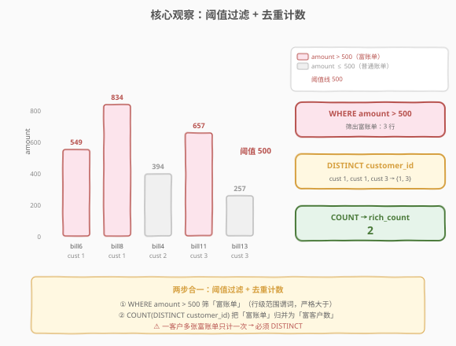
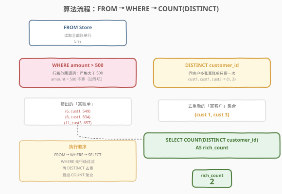
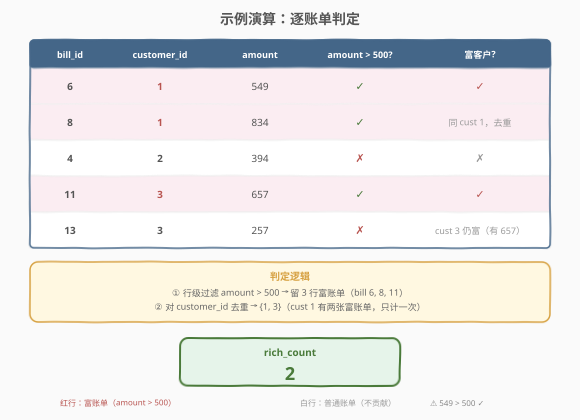

# LeetCode 富有客户的数量 题解

## 1. 题目概述

- **标题 / 题号**：富有客户的数量（#2082，easy）
- **链接**：https://leetcode.cn/problems/the-number-of-rich-customers/
- **难度**：简单
- **标签**：数据库、SQL、`WHERE` 过滤、范围谓词、`COUNT(DISTINCT)`、去重计数、LeetCode 锁题

**题意**：给定 `Store` 表，每行记录一张账单的金额及关联客户。编写 SQL 查询，报告**至少有一张账单金额严格大于 500** 的客户数量。结果以单行单列 `rich_count` 返回。

**表结构**：

```text
Table: Store
+-------------+------+
| Column Name | Type |
+-------------+------+
| bill_id     | int  |  ← 主键（账单编号）
| customer_id | int  |  ← 客户编号
| amount      | int  |  ← 账单金额
+-------------+------+
bill_id 是本表的主键（具有唯一值的列）。
每一行包含一个订单的金额及相关客户的信息。
```

> ⚠️ **主键是单列 `bill_id`**：一张账单一行，但**同一客户可有多张账单**——这正是「富有客户数」需要 `DISTINCT` 的根因。若不加 `DISTINCT`，会把同一客户的多张富账单重复计数。`amount` 是整数，「严格大于 500」即 `amount > 500`，等于 500 不算。

**示例 1**：

```text
输入：
Store 表:
+---------+-------------+--------+
| bill_id | customer_id | amount |
+---------+-------------+--------+
| 6       | 1           | 549    |
| 8       | 1           | 834    |
| 4       | 2           | 394    |
| 11      | 3           | 657    |
| 13      | 3           | 257    |
+---------+-------------+--------+

输出：
+------------+
| rich_count |
+------------+
| 2          |
+------------+

解释：
客户 1 有 2 个订单金额严格大于 500。
客户 2 没有任何订单金额严格大于 500。
客户 3 有 1 个订单金额严格大于 500。
```

**解释拆解**：

| customer_id | 各账单金额 | 是否有金额 > 500？ | 结论 |
|-------------|-----------|-------------------|------|
| 1 | 549, 834 | ✓（549 > 500、834 > 500） | **富有** |
| 2 | 394 | ✗（394 ≤ 500） | 普通 |
| 3 | 657, 257 | ✓（657 > 500） | **富有** |

富有客户集合 = `{1, 3}`，数量 = 2。

**约束**：

- `bill_id` 是 `Store` 表的主键，行唯一。
- `amount` 为整数，可正可负（亦可能为 0）。
- 同一 `customer_id` 可对应多行（多张账单）。
- 结果仅返回单行单列 `rich_count`。

> 💡 **审题关键**：① 「至少一张」即存在性判定——不需要 `GROUP BY` + `HAVING`，行级 `WHERE amount > 500` 已天然表达「该客户存在富账单」；② 「严格大于 500」是 `>` 不是 `>=`，`amount = 500` 不算富账单；③ 同一客户多张富账单**只计一次**，`COUNT` 必须配 `DISTINCT customer_id`——这是本题唯一的「弯」。掌握这三点，本题就退化为一行 `SELECT COUNT(DISTINCT ...) FROM ... WHERE ...`。

## 2. 解题思路

### 2.1 暴力思路：逐客户遍历判定

最直觉的过程式思维：取出所有不重复的客户，对每个客户检查其所有账单中是否至少有一张金额 > 500，若是则计数 +1。

```text
customers = DISTINCT customer_id in Store
count = 0
for c in customers:
    if any(amount > 500 for bill of c):
        count += 1
return count
```

逻辑完全正确——但 SQL 有更声明式的表达：先在 `WHERE` 子句把「富账单」筛出来（这等价于 `any(amount > 500)`），再对筛出的行按 `customer_id` 去重计数。两步合一条查询即可，无需显式循环。

> ⚠️ **过程式思维的陷阱**：有人会担心「同一客户多张富账单会不会被数多次」——会的，所以 `COUNT` 必须配 `DISTINCT`。若误写 `COUNT(customer_id)`，客户 1 有两张富账单会被计 2 次，答案变成 3 而非 2。这是本题最易踩的坑，详见 2.4 节演算。

### 2.2 核心观察：行级过滤 + 去重计数



题目的两个语义——「**严格大于 500**」和「**客户数量**」——分别对应 SQL 的两个机制，叠加即得答案：

| 题意要求 | SQL 机制 | 语义 |
|----------|----------|------|
| 「至少一张账单金额 > 500」 | `WHERE amount > 500` | **行级范围谓词**：筛出所有「富账单」行，存在性由「筛后非空」隐式表达 |
| 「客户的数量」 | `COUNT(DISTINCT customer_id)` | **去重聚合**：把富账单按客户归并，每客户计一次 |

两者一前一后：`WHERE` 先把 5 行筛成 3 行富账单，`COUNT(DISTINCT)` 再把这 3 行按 `customer_id` 去重为 `{1, 3}` 计数得 2。

$$\text{rich\_count} = \left| \{\, \text{customer\_id} \mid \exists\, \text{bill}: \text{amount} > 500 \,\} \right|$$

> 💡 **为什么不用 `GROUP BY` + `HAVING`？** 「至少一张」是**存在性**判定，而 `WHERE amount > 500` 已经把「存在富账单」的行筛出来了——筛后某客户只要有至少一行留下，就说明该客户存在富账单。再对这些行 `COUNT(DISTINCT customer_id)` 即得「存在富账单的客户数」。`GROUP BY customer_id HAVING SUM(amount > 500) > 0` 也能做，但多此一举：它先分组再过滤组，而本题只需「过滤行 + 去重计数」，`WHERE` 一步到位。`GROUP BY` 适用于「**组级**条件」（如「平均金额 > 500 的客户数」），本题是**行级**条件，用 `WHERE` 最自然。

> ⚠️ **「严格大于」是 `>` 不是 `>=`**：题目英文 "strictly greater than"，`amount = 500` 不算富账单。若误写 `amount >= 500`，会把金额恰为 500 的账单也算进来，可能多计客户。这是 SQL 中**边界条件**的典型坑——题目说「严格大于」就 `>`，说「大于等于」才 `>=`。

### 2.3 算法流程图



**逻辑执行步骤**：

| 步骤 | 子句 | 作用 |
|------|------|------|
| ① | `FROM Store` | 读取全部账单行（5 行） |
| ② | `WHERE amount > 500` | 行级范围过滤，只留富账单（3 行：549、834、657） |
| ③ | `COUNT(DISTINCT customer_id)` | 对富账单按客户去重计数（{1, 3} → 2） |
| ④ | `AS rich_count` | 命名输出列 |

> 💡 **SQL 子句执行顺序**：`FROM` → `WHERE`（行级过滤）→ `SELECT`（含 `COUNT(DISTINCT)` 聚合）。本题**无 `GROUP BY`**——`COUNT(DISTINCT)` 是对 `WHERE` 过滤后的**整个结果集**做去重计数，输出单行。理解「`WHERE` 先过滤行，`SELECT` 再聚合」的顺序是关键：先有 3 行富账单，才谈得上对这 3 行去重计数。

### 2.4 示例演算

以示例 1 的 5 行账单为例，观察两阶段处理：



**步骤 ①②：`WHERE amount > 500`（行级范围过滤）**

对 5 行逐行检查 `amount` 是否严格大于 500：

| 行 | bill_id | customer_id | amount | amount>500? | 去留 |
|----|---------|-------------|--------|-------------|------|
| 1 | 6 | 1 | 549 | ✓（549 > 500） | **保留** |
| 2 | 8 | 1 | 834 | ✓（834 > 500） | **保留** |
| 3 | 4 | 2 | 394 | ✗（394 ≤ 500） | 丢弃 |
| 4 | 11 | 3 | 657 | ✓（657 > 500） | **保留** |
| 5 | 13 | 3 | 257 | ✗（257 ≤ 500） | 丢弃 |

过滤后剩 **3 行**富账单：`(6, 1, 549)`、`(8, 1, 834)`、`(11, 3, 657)`。

> 💡 **客户 2 被整体排除**：客户 2 只有一张账单 394，不 > 500，`WHERE` 过滤后一行不剩，自然不在结果中。客户 3 虽有一张 257 不达标，但另一张 657 达标——只要存在一张富账单即保留，这正是「至少一张」的语义。

**步骤 ③：`COUNT(DISTINCT customer_id)`（去重计数）**

对剩余 3 行的 `customer_id` 列去重后计数：

| 富账单行 | customer_id |
|----------|-------------|
| (6, 1, 549) | 1 |
| (8, 1, 834) | 1 ← 与上相同，去重 |
| (11, 3, 657) | 3 |

去重后集合 = `{1, 3}`，计数 = **2**。

> ⚠️ **若漏写 `DISTINCT` 会怎样？** `COUNT(customer_id)` 对 3 行直接计数得 3——客户 1 的两张富账单被计了两次，答案错为 3。原因：`COUNT(x)` 数的是**行数**而非**不同值的个数**，只有 `COUNT(DISTINCT x)` 才数「不同值的个数」。本题问的是「客户数量」而非「富账单数量」，故必须 `DISTINCT`。

## 3. 参考代码

### SQL（解法 A：`WHERE` + `COUNT(DISTINCT)`，推荐）

```sql
SELECT COUNT(DISTINCT customer_id) AS rich_count
FROM Store
WHERE amount > 500;
```

> 💡 **写法要点**：
> - `WHERE amount > 500`：行级范围谓词，筛出富账单。`>` 严格大于，`amount = 500` 不算。
> - `COUNT(DISTINCT customer_id)`：对富账单按客户去重计数——同一客户多张富账单只计一次。
> - `AS rich_count`：列别名必须与题目要求的输出列名一致。
> - ✓ **最自然**：一行 `WHERE` 表达「存在富账单」，`COUNT(DISTINCT)` 表达「客户数量」，语义一气呵成。

### SQL（解法 B：`GROUP BY` + `HAVING`，思路对照）

```sql
SELECT COUNT(*) AS rich_count
FROM (
    SELECT 1
    FROM Store
    WHERE amount > 500
    GROUP BY customer_id
) t;
```

> 💡 **解法 B 的思路**：子查询先 `WHERE amount > 500` 筛富账单，再 `GROUP BY customer_id` 把同一客户的多张富账单归并为一组——每个客户至多剩一组（有富账单的客户才有组）。外层 `COUNT(*)` 数组数即「富客户数」。逻辑与解法 A 完全等价，只是把「去重」用 `GROUP BY` 显式表达。
>
> **与解法 A 的关系**：`COUNT(DISTINCT customer_id)` 在语义上等价于「先 `GROUP BY customer_id` 再 `COUNT(*)`」——优化器通常把两者优化为相同的执行计划（哈希去重 / 排序去重）。解法 A 更紧凑，解法 B 更直观地展示了「分组归并」的过程，适合口述思路。优先选 A。

### SQL（解法 C：`GROUP BY` + `HAVING COUNT(*) > 0`，存在性写法）

```sql
SELECT COUNT(*) AS rich_count
FROM (
    SELECT customer_id
    FROM Store
    GROUP BY customer_id
    HAVING MAX(amount) > 500
) t;
```

> 💡 **解法 C 的思路**：先按 `customer_id` 分组，用 `HAVING MAX(amount) > 500` 判定「该客户最大账单金额 > 500」——等价于「至少一张账单 > 500」（因为 `MAX(amount) > 500` 当且仅当存在某张账单 > 500）。外层 `COUNT(*)` 数满足条件的客户组数。
>
> **与解法 A/B 的关系**：三者逻辑等价。解法 C 用 `MAX(amount) > 500` 表达存在性，是「组级条件」的典型写法——适用于条件本身依赖聚合（如「平均金额 > 500」「至少 3 张账单 > 500」）。本题条件是行级（单张账单 > 500），用 `WHERE` 更自然，解法 C 略重但展示了 `HAVING` 的用法。生产中若需复杂组级条件，解法 C 的骨架可扩展。

### Python（pandas）

```python
import pandas as pd

def count_rich_customers(store: pd.DataFrame) -> int:
    rich = store[store['amount'] > 500]
    return int(rich['customer_id'].nunique())
```

> 💡 **pandas 对照**：
> - `store['amount'] > 500` 对应 SQL 的 `WHERE amount > 500`，产出布尔 Series。
> - `store[...]` 对应行级过滤，等价于 `WHERE`。
> - `rich['customer_id'].nunique()` 对应 `COUNT(DISTINCT customer_id)`——`.nunique()` 即「number of unique」，天然去重计数。
> - 注意 `.nunique()` 默认忽略 `NaN`，与 SQL 的 `COUNT(DISTINCT)`（忽略 `NULL`）行为一致。

## 4. 复杂度分析

| 维度 | 解法 A（`WHERE`+`COUNT(DISTINCT)`） | 解法 B（`GROUP BY`） | 解法 C（`HAVING MAX`） | pandas |
|------|-------------------------------------|----------------------|------------------------|--------|
| **时间** | $O(n)$ | $O(n)$ | $O(n)$ | $O(n)$ |
| **空间** | $O(k)$ | $O(k)$ | $O(k)$ | $O(n)$ |
| **写法** | 紧凑一行 | 子查询归并 | 组级条件 | DataFrame |
| **推荐度** | ✓ **首选** | ✓ 思路对照 | ✓ 可扩展 | ✓ 验证用 |

> - $n$ = `Store` 表行数，$k$ = 不同客户数（去重后集合大小，$k \le n$）
> - **时间**：全表扫描一次 $O(n)$ + 对筛后行去重 $O(k)$。现代优化器对 `COUNT(DISTINCT)` 通常走哈希聚合，$O(n)$ 一次扫描完成；若 `amount` 列有索引，`WHERE amount > 500` 可走索引范围扫描，只读富账单行，降至 $O(\log n + m)$（$m$ 为富账单数）。
> - **空间**：去重需物化客户集合 $O(k)$；pandas 需 $O(n)$ 存 DataFrame。
> - **索引优化**：在 `amount` 列建索引可加速范围过滤；若查询频繁，可建 `(amount, customer_id)` 复合索引实现 index-only scan（覆盖索引），避免回表。

## 5. 扩展：`COUNT` 家族与去重、存在性表达

### 5.1 `COUNT` 的四种形态

`COUNT` 是 SQL 中最易混淆的聚合函数，四种写法语义截然不同：

| 写法 | 计数对象 | 是否去重 | 是否忽略 NULL | 示例（筛后 3 行 cust={1,1,3}） |
|------|---------|---------|--------------|------------------------------|
| `COUNT(*)` | **所有行**（含 NULL） | ✗ | ✗（数所有行） | 3 |
| `COUNT(customer_id)` | `customer_id` 非 NULL 的行 | ✗ | ✓ | 3 |
| `COUNT(DISTINCT customer_id)` | `customer_id` 的**不同值** | ✓ | ✓ | 2 |
| `COUNT(1)` | 所有行（`1` 是常量非 NULL） | ✗ | ✗ | 3 |

> 💡 **本题为什么用 `COUNT(DISTINCT customer_id)`**：题目问「客户**数量**」——即不同客户的个数，必须去重。`COUNT(*)` 数的是「富账单数」（3），`COUNT(customer_id)` 也是 3（因为 `customer_id` 非空），只有 `COUNT(DISTINCT customer_id)` 得 2（不同客户数）。**判断口诀**：问「行数/记录数」用 `COUNT(*)`，问「某列不同值的个数」用 `COUNT(DISTINCT col)`。

### 5.2 存在性的三种表达

「至少一张账单 > 500」是**存在性**判定，SQL 有三种等价表达：

| 写法 | 语义层级 | 适用场景 |
|------|---------|---------|
| `WHERE amount > 500`（解法 A） | **行级** | 条件作用于单行，筛后非空即存在 |
| `HAVING MAX(amount) > 500`（解法 C） | **组级** | 条件依赖聚合（MAX/SUM/AVG），需 `GROUP BY` |
| `EXISTS (SELECT 1 FROM Store s2 WHERE s2.customer_id = c.id AND s2.amount > 500)` | **相关子查询** | 跨表存在性，或主查询需返回客户明细时 |

> 💡 **选择原则**：① 条件是**单行属性**（如 `amount > 500`）→ 用 `WHERE`；② 条件是**聚合属性**（如「平均 > 500」「至少 3 张 > 500」）→ 用 `HAVING`；③ 条件涉及**另一张表**或需「主查询返回明细 + 存在性过滤」→ 用 `EXISTS`。本题是单行属性，`WHERE` 最自然。

### 5.3 变体：若题目改为「平均金额 > 500 的客户数」

若题目改为「平均账单金额严格大于 500 的客户数量」，条件变为**组级聚合**，解法 A 的 `WHERE` 不再适用（`WHERE` 不能用 `AVG`），需改用 `HAVING`：

```sql
SELECT COUNT(*) AS rich_count
FROM (
    SELECT customer_id
    FROM Store
    GROUP BY customer_id
    HAVING AVG(amount) > 500
) t;
```

> 💡 这正是解法 C 骨架的价值——当条件从「单张账单 > 500」升级为「聚合 > 500」时，只需把 `HAVING MAX(amount) > 500` 换成 `HAVING AVG(amount) > 500`（或 `SUM` / `MIN` 等），骨架不变。理解「行级条件用 `WHERE`，组级条件用 `HAVING`」的分工，是 SQL 查询设计的基础认知。

## 6. 面试要点

1. **为什么用 `COUNT(DISTINCT customer_id)` 而非 `COUNT(*)`？**

   > 题目问「客户数量」即不同客户的个数。`WHERE amount > 500` 筛出的是**富账单行**，同一客户可能有多张富账单（如客户 1 有 549、834 两张）。`COUNT(*)` 数的是富账单行数（3），会重复计数；`COUNT(DISTINCT customer_id)` 把同一客户的多张富账单归并为一次，得不同客户数（2）。**口诀**：问「行数」用 `COUNT(*)`，问「某列不同值个数」用 `COUNT(DISTINCT col)`。

2. **`amount > 500` 和 `amount >= 500` 有什么区别？**

   > 题目英文 "strictly greater than 500"，即严格大于，`amount = 500` 不算富账单。用 `amount > 500` 正确，`amount >= 500` 会把金额恰为 500 的账单也算进来，可能多计客户。这是 SQL 中**边界条件**的典型坑——「严格大于」用 `>`，「大于等于」才用 `>=`。面试中主动确认「500 算不算」是加分项。

3. **为什么不用 `GROUP BY` + `HAVING`？**

   > 「至少一张账单 > 500」是**行级**条件（作用于单张账单），用 `WHERE amount > 500` 一步过滤即可——筛后某客户只要有至少一行留下，就说明该客户存在富账单。`GROUP BY customer_id HAVING MAX(amount) > 500` 也能做，但多此一举：它先分组再过滤组，而本题只需「过滤行 + 去重计数」。`GROUP BY` 适用于**组级条件**（如「平均金额 > 500」「至少 3 张账单 > 500」），此时 `WHERE` 无法表达聚合条件，才必须用 `HAVING`。

4. **如果 `Store` 表很大（数亿行），如何优化？**

   > 在 `amount` 列建索引，使 `WHERE amount > 500` 走索引范围扫描，只读取富账单行，避免全表扫描。进一步可建 `(amount, customer_id)` 复合索引实现 index-only scan（覆盖索引）——查询只需访问索引即可得到 `customer_id` 去重计数，无需回表读数据行。面试中提到「`amount` 列建索引把 $O(n)$ 降为 $O(\log n + m)$，复合索引 `(amount, customer_id)` 可覆盖查询」即可。

5. **`COUNT(DISTINCT)` 和 `GROUP BY` + `COUNT(*)` 性能上有差异吗？**

   > 现代优化器（MySQL、PostgreSQL 等）通常把 `COUNT(DISTINCT col)` 优化为与「`GROUP BY col` + 外层 `COUNT(*)`」相同的执行计划——都走哈希聚合或排序去重，$O(n)$ 一次扫描完成。写法上 `COUNT(DISTINCT)` 更紧凑，`GROUP BY` 更直观展示分组过程。性能无差异，选择看可读性。极大数据量下，若去重集合过大内存放不下，数据库会溢写到磁盘（外部排序 / 分区哈希），此时可考虑近似计数（如 HyperLogLog）。

> 💡 **一句话总结**：2082 是 SQL **"行级过滤 + 去重计数"入门招牌题**——核心就一句 `SELECT COUNT(DISTINCT customer_id) AS rich_count FROM Store WHERE amount > 500`。考点覆盖三要素：**范围谓词（`amount > 500`，严格大于）、去重计数（`COUNT(DISTINCT)`，同客户多账单只计一次）、行级 vs 组级（存在性用 `WHERE` 不用 `HAVING`）**。理解「`>` 严格」「`DISTINCT` 去重」「`WHERE` 行级」这三点，所有「计数 + 阈值」类 SQL 题都能覆盖。

## 同类练习题

| # | 题目 | 与本题的关联 |
|---|------|-------------|
| 584 | [寻找用户推荐人](https://leetcode.cn/problems/find-customer-referee/)（[题解](../0501-0600/584_寻找用户推荐人.md)） | `WHERE` 单条件行级过滤 + NULL 处理——同为「行级筛选」入门题，对照 `!= 2 OR IS NULL` 与 `amount > 500` 的范围谓词写法 |
| 1757 | [可回收且低脂的产品](https://leetcode.cn/problems/recyclable-and-low-fat-products/) | `WHERE` 双布尔条件 + `COUNT`——`low_fats = 'Y' AND recyclable = 'Y'` 后计数，与 2082 共享「过滤 + 计数」骨架，但无去重需求 |
| 1821 | [寻找今年具有正收入的客户](https://leetcode.cn/problems/find-customers-with-positive-revenue-this-year/)（[题解](../1801-1900/1821_寻找今年具有正收入的客户.md)） | `WHERE` 双条件行级过滤——`year = 2021 AND revenue > 0`，与 2082 共享「范围谓词 `>` 严格大于」的边界坑 |
| 1148 | [文章浏览 I](https://leetcode.cn/problems/article-views-i/) | `WHERE` 等值过滤 + `DISTINCT` 去重——对照 2082 理解「主键已保证唯一时无需 DISTINCT」与「同客户多行需 DISTINCT」的边界 |
| 1699 | [两人之间的通话次数](https://leetcode.cn/problems/number-of-calls-between-two-persons/) | `GROUP BY` + `COUNT` + `DISTINCT` 去重——在 2082 基础上叠加分组聚合与复合键去重，进阶练习 |
