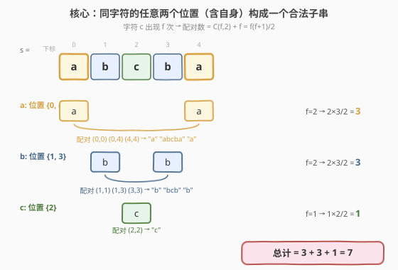
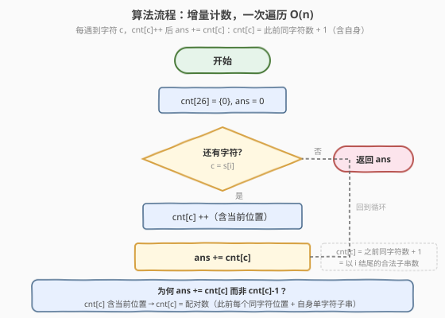
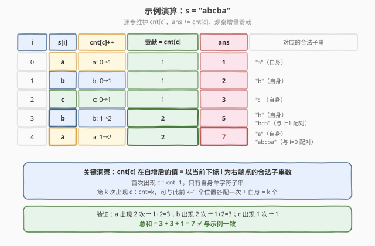

# 求以相同字母开头和结尾的子串总数

- **题目名称**：求以相同字母开头和结尾的子串总数
- **链接**：[2083. 求以相同字母开头和结尾的子串总数](https://leetcode.cn/problems/substrings-that-begin-and-end-with-the-same-letter/)
- **难度**：中等
- **标签**：字符串、数学、计数、前缀和、哈希表

## 1. 题目概述

给你一个仅由小写英文字母组成的、下标从 `0` 开始的字符串 `s`。返回 `s` 中**以相同字符开头和结尾**的子字符串总数。

子字符串是字符串中连续的非空字符序列。单个字符的子串也算（它既是开头也是结尾，天然满足条件）。

> ⚠️ **关键约束**：`s.length` 可达 $10^5$，子串总数 $O(n^2)$ 约 $5 \times 10^9$ 个，枚举所有子串再逐个判定必然超时。需要找到 $O(n)$ 的计数方法。

**示例 1**：

```text
输入：s = "abcba"
输出：7
解释：
以相同字母开头和结尾的长度为 1 的子串是："a"、"b"、"c"、"b" 和 "a"。
以相同字母开头和结尾的长度为 3 的子串是："bcb"。
以相同字母开头和结尾的长度为 5 的子串是："abcba"。
```

**示例 2**：

```text
输入：s = "abacad"
输出：9
解释：
以相同字母开头和结尾的长度为 1 的子串是："a"、"b"、"a"、"c"、"a" 和 "d"。
以相同字母开头和结尾的长度为 3 的子串是："aba" 和 "aca"。
以相同字母开头和结尾的长度为 5 的子串是："abaca"。
```

**示例 3**：

```text
输入：s = "a"
输出：1
解释：只有一个，以相同字母开头和结尾的长度为 1 的子串是："a"。
```

**约束条件**：

- $1 \le \text{s.length} \le 10^5$
- `s` 仅包含小写英文字母

---

## 2. 解题思路

### 2.1 暴力思路：枚举所有子串

最直观的做法是两层循环枚举所有 $O(n^2)$ 个子串 `s[l..r]`，判定 `s[l] == s[r]` 是否成立。虽然单次判定 $O(1)$，但 $n = 10^5$ 时子串数约 $5 \times 10^9$，必然超时。

突破口在于**转换计数视角**：题目要「首尾同字符的子串数」，而一个子串 `s[l..r]` 合法当且仅当 `s[l] == s[r]`。这等价于：**从所有出现字符 `c` 的位置中任取一对（可同位置）作为首尾**，就得到一个合法子串。于是问题从「枚举子串」归约为「按字符分组计数配对」。

### 2.2 核心观察：同字符配对计数



关键洞察分两步：

**第一步：按字符分组位置。** 把字符串中每种字符出现的位置收集起来。例如 `s = "abcba"`：

| 字符 | 出现位置 | 出现次数 $f$ |
|------|----------|--------------|
| `a` | $\{0, 4\}$ | 2 |
| `b` | $\{1, 3\}$ | 2 |
| `c` | $\{2\}$ | 1 |

**第二步：对每种字符算配对数。** 字符 `c` 出现在 $f$ 个位置，从中任取一对 $(i, j)$（允许 $i = j$，即单字符子串）作为子串首尾，就得到一个合法子串。配对数为：

$$\text{配对数} = \binom{f}{2} + f = \frac{f(f-1)}{2} + f = \frac{f(f+1)}{2}$$

其中 $\binom{f}{2}$ 是「取两个不同位置」的组合数（$i < j$ 的对数），加 $f$ 是「取同一位置」的 $f$ 个单字符子串。

**总答案**为所有字符的配对数之和：

$$\text{ans} = \sum_{c} \frac{f_c (f_c + 1)}{2}$$

> 💡 **为何只需频率无需位置？** 因为合法条件只要求「首尾字符相同」，不关心中间内容——任何首尾为 `c` 的子串都合法，无论中间夹着什么。因此只要知道 `c` 出现在哪些位置，任取一对即可，位置的具体值不影响合法性（只影响子串内容，但题目只问总数）。

> ⚠️ **单字符子串必须计入**：每个字符自身构成一个长度为 1 的子串，首尾天然相同。公式中 $+f$ 正是这 $f$ 个单字符子串。若误写为 $\binom{f}{2}$ 则会漏掉所有长度为 1 的子串。

### 2.3 算法流程图



上述「先统计频率再套公式」需要两趟遍历（先数频率，再求和）。更优雅的做法是**增量计数**——一趟遍历同时完成两步：

1. **初始化**：计数数组 `cnt[26] = {0}`，答案 `ans = 0`。
2. **遍历** `s` 的每个字符 `c`：
   - 先 `cnt[c]++`（把当前位置计入同字符出现次数）；
   - 再 `ans += cnt[c]`（累加贡献）。
3. 遍历结束，返回 `ans`。

**正确性**：当遍历到第 $k$ 次出现字符 `c` 时（即 `cnt[c]` 自增后变为 $k$），`ans += k` 的含义是——以当前位置为**右端点**的合法子串恰好有 $k$ 个：与此前 $k-1$ 个 `c` 的位置各配一次（长度 $> 1$ 的子串），加上自身单字符子串（长度 $1$）。对所有位置求和，等价于对所有合法子串恰好各计一次。

> 💡 **两种视角的等价性**：增量法的总和 $\sum_{k=1}^{f_c} k = \frac{f_c(f_c+1)}{2}$，与公式法完全一致。增量法把「按字符分组求和」拆成「按位置逐个贡献」，无需事先统计完整频率，一趟即可。

### 2.4 示例演算



以 `s = "abcba"` 逐步演算：

| $i$ | `s[i]` | `cnt[c]` 变化 | 贡献 `cnt[c]` | `ans` | 对应合法子串 |
|-----|--------|---------------|---------------|-------|-------------|
| 0 | `a` | `a: 0→1` | 1 | 1 | `"a"`（自身） |
| 1 | `b` | `b: 0→1` | 1 | 2 | `"b"`（自身） |
| 2 | `c` | `c: 0→1` | 1 | 3 | `"c"`（自身） |
| 3 | `b` | `b: 1→2` | 2 | 5 | `"b"`（自身）+ `"bcb"`（与 $i=1$ 配对） |
| 4 | `a` | `a: 1→2` | 2 | 7 | `"a"`（自身）+ `"abcba"`（与 $i=0$ 配对） |

- **$i=0$，`a`**：首次出现 `a`，`cnt['a']=1`，只有自身单字符子串 `"a"`，贡献 1。
- **$i=3$，`b`**：第 2 次出现 `b`，`cnt['b']=2`，可与 $i=1$ 的 `b` 配对得 `"bcb"`，加上自身 `"b"`，贡献 2。
- **$i=4$，`a`**：第 2 次出现 `a`，`cnt['a']=2`，可与 $i=0$ 的 `a` 配对得 `"abcba"`，加上自身 `"a"`，贡献 2。

最终 `ans = 1+1+1+2+2 = 7` ✅，与示例一致。

> 💡 **用示例 2 自检**：`s = "abacad"`，`a` 出现 3 次（$i=0,2,4$）、`b` 出现 1 次、`c` 出现 1 次、`d` 出现 1 次。增量贡献依次为 `1,1,2,1,3,1`，总和 $= 9$ ✅。

---

## 3. 参考代码

### C++（增量计数一次遍历）

```cpp
class Solution {
  public:
    long long numberOfSubstrings(string s) {
        long long ans = 0;
        int cnt[26] = {0};
        for (char c : s) {
            ans += ++cnt[c - 'a'];
        }
        return ans;
    }
};
```

### Python

```python
class Solution:
    def numberOfSubstrings(self, s: str) -> int:
        cnt = [0] * 26
        ans = 0
        for ch in s:
            idx = ord(ch) - ord('a')
            cnt[idx] += 1
            ans += cnt[idx]
        return ans
```

> ⚠️ **必须用 64 位整数**：$n = 10^5$ 全同一字符时，$\frac{n(n+1)}{2} \approx 5 \times 10^9$，超过 32 位 `int` 上限 $2.1 \times 10^9$。C++ 中 `ans` 声明为 `long long`，且 `++cnt[...]` 返回 `int` 需隐式提升后再累加（`ans +=` 左侧为 `long long`，右侧自动提升）。Python 原生大整数无需关心。

> 💡 **一行写法的妙处**：`ans += ++cnt[c - 'a']` 把「自增」与「累加」合为一行——`++cnt` 先自增返回新值，再被 `ans +=` 累加。等价于 `cnt[k]++; ans += cnt[k];` 两行，但更紧凑。注意 `++cnt` 必须前置自增才能返回更新后的值；若写成 `cnt[k]++`（后置）则返回旧值，会少计 1（漏掉当前单字符子串）。

---

## 4. 复杂度分析

| 维度 | 复杂度 | 说明 |
|------|--------|------|
| 时间复杂度 | $O(n)$ | 单层遍历，每次字符计数与累加均 $O(1)$ |
| 空间复杂度 | $O(1)$ | 固定 26 大小计数数组，与输入规模无关 |

> 💡 **为何是 $O(1)$ 而非 $O(|\Sigma|)$？** 字符集大小 $|\Sigma| = 26$（小写字母）是常数，故计数数组空间为 $O(1)$。若字符集扩展到 Unicode，则需改用哈希表，空间退化为 $O(\min(n, |\Sigma|))$，但时间仍为 $O(n)$（哈希表均摊 $O(1)$ 操作）。

---

## 5. 扩展：从「首尾相同」到「首尾唯一」

本题是**子串首尾计数**家族中最朴素的成员——合法条件只依赖首尾字符相同。更进阶的变体对首尾施加额外约束：

| 题目 | 合法条件 | 难点 |
|------|----------|------|
| 本题 2083 | 首尾字符相同 | 只需按字符频率算配对数 $\frac{f(f+1)}{2}$ |
| [828. 统计子串中的唯一字符](https://leetcode.cn/problems/count-unique-characters-of-all-substrings-of-a-given-string/) | 字符在子串中恰好出现一次 | 贡献范围被左右最近同字符夹紧，$(prev, next)$ 内才唯一 |
| [2262. 字符串的总引力](https://leetcode.cn/problems/total-appeal-of-a-string/) | 子串中不同字符数 | 每个字符只夹左端最近同字符，半夹紧贡献 |

可见同样是「固定位置算贡献」，约束越紧（要唯一 / 要不同）就需要越精细的边界维护。掌握本题后，建议顺着这条线练 828 与 2262，把「全范围配对 → 半夹紧 → 全夹紧」三档难度打通。

---

## 6. 面试要点

1. **为什么能从 $O(n^2)$ 降到 $O(n)$？关键的视角转换是什么？**

   - 把「按子串枚举判定」转换为「按字符分组计数配对」。合法子串的条件是首尾字符相同，等价于从同字符的位置集合中任取一对（含同位置）。因此只需统计每种字符的频率 $f$，配对数 $\frac{f(f+1)}{2}$ 即为该字符贡献的子串数，总时间 $O(n)$。

2. **$\frac{f(f+1)}{2}$ 这个公式是怎么推出来的？**

   - 字符 `c` 出现 $f$ 次。任取一对位置 $(i, j)$ 作为子串首尾：$i < j$ 的对数是 $\binom{f}{2} = \frac{f(f-1)}{2}$（长度 $\ge 2$ 的子串），$i = j$ 的对数是 $f$（单字符子串）。合计 $\frac{f(f-1)}{2} + f = \frac{f(f+1)}{2}$。

3. **增量法 `ans += ++cnt[c]` 为什么等价于公式法？**

   - 遍历中第 $k$ 次遇到字符 `c` 时，`cnt[c]` 自增后为 $k$，`ans += k` 恰好累加了以当前位置为右端点的 $k$ 个合法子串（$k-1$ 个与此前同字符位置配对 + 1 个自身）。对所有 $k = 1 \dots f$ 求和得 $\sum_{k=1}^{f} k = \frac{f(f+1)}{2}$，与公式法一致。增量法无需先数完整频率，一趟即可。

4. **为什么必须用 `long long`？最大答案有多大？**

   - $n = 10^5$ 全同一字符（如 `"aaaa...a"`）时，$\frac{n(n+1)}{2} = \frac{10^5 \times 10^5 + 1}{2} \approx 5 \times 10^9$，超过 `int` 上限 $2.147 \times 10^9$。C++ 必须把 `ans` 声明为 `long long`；Python 原生大整数无需关心。

5. **如果题目改成「首尾字符不同」，思路怎么变？**

   - 用**反面计数**：总子串数 $\frac{n(n+1)}{2}$ 减去「首尾相同的子串数」（即本题答案）。总子串数减去同字符配对数即得异字符配对数。另一种直接思路是：对每个位置 $i$，以 `s[i]` 为右端点的异字符子串数为 $i$（所有左端点 $j \le i$）减去同字符左端点数 `cnt[s[i]] - 1`（排除自身和同字符位置）。两种方法等价，都是 $O(n)$。

---

## 7. 同类练习题

- [828. 统计子串中的唯一字符](https://leetcode.cn/problems/count-unique-characters-of-all-substrings-of-a-given-string/)（[题解](../0801-0900/828_统计子串中的唯一字符.md)）：贡献法进阶，贡献范围被左右最近同字符夹紧，本题的「全范围配对」升级为「全夹紧唯一」
- [2262. 字符串的总引力](https://leetcode.cn/problems/total-appeal-of-a-string/)：贡献法半夹紧版，每个字符只夹左端最近同字符，统计不同字符总数
- [2063. 所有子字符串中的元音](https://leetcode.cn/problems/vowels-of-all-substrings/)（[题解](../2001-2100/2063_所有子字符串中的元音.md)）：贡献法朴素版，每个元音贡献「包含它的子串数」$(i+1)(n-i)$，同属子串计数家族
- [1759. 统计同质子字符串的数目](https://leetcode.cn/problems/count-number-of-homogenous-substrings/)（[题解](../1701-1800/1759_统计同质子字符串的数目.md)）：按连续同字符段贡献 $\frac{L(L+1)}{2}$，分段场景的配对计数
- [1358. 包含所有三种字符的子字符串数目](https://leetcode.cn/problems/number-of-substrings-containing-all-three-characters/)（[题解](../1301-1400/1358_包含所有三种字符的子字符串数目.md)）：固定右端点算合法左端点数，同属「按位置算贡献」的子串计数家族
