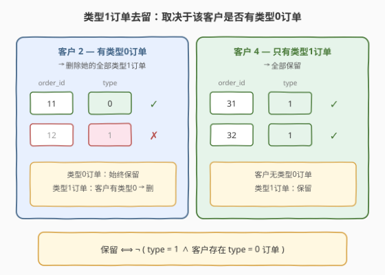
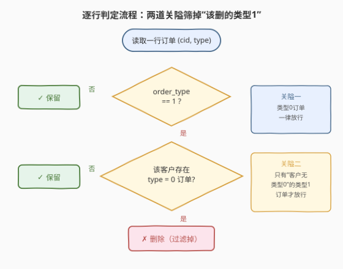
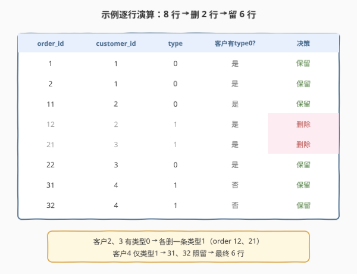

# 为订单类型为0的客户删除类型为1的订单

- **题目名称**：为订单类型为0的客户删除类型为1的订单
- **链接**：[2084. 为订单类型为 0 的客户删除类型为 1 的订单](https://leetcode.cn/problems/drop-type-1-orders-for-customers-with-type-0-orders/)
- **难度**：简单
- **标签**：SQL、`WHERE`、`NOT EXISTS`、相关子查询、`NOT IN`、窗口函数、`COUNT ... OVER`

## 1. 题目概述

给定一张 `Orders` 表，每行记录一笔订单的编号、客户编号与订单类型。`order_type` 取值 `0`（到店订单）或 `1`（在线订单）。现需做一次数据清洗：**对「至少有一笔类型 0 订单」的客户，丢弃其全部类型 1 订单**；对只有类型 1 订单的客户，则原样保留。要求返回清洗后的结果表，顺序不限。

**表结构**：

```text
Table: Orders
+-------------+------+
| Column Name | Type |
+-------------+------+
| order_id    | int  |  ← 主键（唯一值）
| customer_id | int  |  ← 客户编号
| order_type  | int  |  ← 0 = 到店订单, 1 = 在线订单
+-------------+------+
(order_id 是这张表具有唯一值的列)
```

**示例 1**：

```text
输入：Orders 表
+----------+-------------+------------+
| order_id | customer_id | order_type |
+----------+-------------+------------+
| 1        | 1           | 0          |
| 2        | 1           | 0          |
| 11       | 2           | 0          |
| 12       | 2           | 1          |
| 21       | 3           | 1          |
| 22       | 3           | 0          |
| 31       | 4           | 1          |
| 32       | 4           | 1          |
+----------+-------------+------------+

输出：
+----------+-------------+------------+
| order_id | customer_id | order_type |
+----------+-------------+------------+
| 1        | 1           | 0          |
| 2        | 1           | 0          |
| 11       | 2           | 0          |
| 22       | 3           | 0          |
| 31       | 4           | 1          |
| 32       | 4           | 1          |
+----------+-------------+------------+
```

**解释**：

| customer_id | 拥有的 type | 是否有 type=0 | type=1 处理 | 最终保留 |
|-------------|-------------|---------------|-------------|----------|
| 1 | {0, 0} | ✓ | 无 type=1，无需删 | order 1、2 |
| 2 | {0, 1} | ✓ | 删掉 type=1（order 12） | order 11 |
| 3 | {1, 0} | ✓ | 删掉 type=1（order 21） | order 22 |
| 4 | {1, 1} | ✗ | 无 type=0，照留 | order 31、32 |

**约束条件**：

- `order_id` 为 `Orders` 表具有唯一值的列（主键）。
- `order_type` 只取 `0` 或 `1`。
- 结果表可按任意顺序返回，仅含未被丢弃的订单行。

> 💡 **题目本质**：注意题面说"删除"，但实际要求是**返回清洗后的结果表**（`SELECT`），并非真正 `DELETE` 修改原表。这是一道**条件过滤**题——是否丢弃某行 type=1 订单，取决于「该客户这一组里是否存在 type=0 订单」这个**分组级属性**。难点在于把"组级属性"下沉到"行级判定"。

---

## 2. 解题思路

### 2.1 暴力思路：逐行去查"该客户有没有类型0"

最直觉的过程式思维：遍历 `Orders` 每一行，若是 type=1，就再到全表里查一下「同 `customer_id` 下有没有 type=0 的行」；有就丢掉当前行，没有就保留。type=0 的行无条件保留。

```text
result = []
for row in Orders:
    if row.type == 0:
        result.append(row)                       # 类型0一律留
    else:  # type == 1
        has_type0 = any(r.type == 0 and r.customer_id == row.customer_id for r in Orders)
        if not has_type0:
            result.append(row)                   # 客户无类型0才留
return result
```

逻辑正确，但这是**命令式双重循环**：外层逐行、内层全表扫描，$O(n^2)$。SQL 没有"逐行循环"语句，需把"该客户是否存在 type=0"翻译成**集合操作**——这正是**相关子查询（`EXISTS`）**或**分组属性广播（窗口函数）**的用武之地。

### 2.2 核心观察：把判定式写成"非(类型1 且 客户有类型0)"



把题意翻译成一行布尔逻辑——**一行订单被保留，当且仅当它不满足"是类型1 且 其客户存在类型0订单"**：

$$\text{保留} \iff \neg\big(\, \text{order\_type} = 1 \;\land\; \exists\, \text{同客户 type}=0 \text{ 行} \,\big)$$

这个判定式天然拆成两种"放行"情形：

1. **`order_type = 0`**：永远放行（与客户有无类型0无关，因为自己就是类型0）；
2. **`order_type = 1` 但客户无类型0订单**：放行。

而被拦下的只有一种：**`order_type = 1` 且客户有类型0订单**。

> 💡 一句话：**类型0订单全留；类型1订单只留"客户从无类型0"的那批**。判定式能否"下沉到行级"取决于如何拿到"客户是否存在 type=0"这个分组级信息——`EXISTS` 相关子查询、`NOT IN` 子查询、`COUNT() OVER` 窗口广播三种方式都能拿到，殊途同归。

### 2.3 算法流程图



逐行判定可看作两道"关隘"串联：

| 关隘 | 判定 | 不满足（放行） | 满足（进入下一关） |
|------|------|----------------|--------------------|
| ① | `order_type = 1 ?` | 否 → 类型0，直接保留 | 是 → 进入关隘② |
| ② | `该客户存在 type=0 订单?` | 否 → 客户只有类型1，保留 | 是 → **删除** |

`EXISTS` 写法把两关合并进一个 `WHERE NOT (type=1 AND EXISTS(...))`；`NOT IN` 写法把"客户从无类型0"预先算成一张名单再 `JOIN`/`IN`；窗口函数写法把"客户是否有类型0"用 `COUNT(CASE WHEN type=0)` 广播到每一行再外层 `WHERE` 过滤。三者逻辑等价，区别在"分组属性何时、如何计算"。

### 2.4 示例演算

以示例 1 数据为例，逐行套用判定式（"客户有 type=0?"列由子查询/窗口预先给出）：



| order_id | customer_id | type | 客户有 type=0? | 套用判定式 | 决策 |
|----------|-------------|------|----------------|------------|------|
| 1 | 1 | 0 | 是 | type=0 → 放行 | 保留 |
| 2 | 1 | 0 | 是 | type=0 → 放行 | 保留 |
| 11 | 2 | 0 | 是 | type=0 → 放行 | 保留 |
| 12 | 2 | 1 | 是 | type=1 ∧ 有type0 → 删 | **删除** |
| 21 | 3 | 1 | 是 | type=1 ∧ 有type0 → 删 | **删除** |
| 22 | 3 | 0 | 是 | type=0 → 放行 | 保留 |
| 31 | 4 | 1 | 否 | type=1 ∧ 无type0 → 放行 | 保留 |
| 32 | 4 | 1 | 否 | type=1 ∧ 无type0 → 放行 | 保留 |

客户 2、3 各有类型0，故各删一条类型1（order 12、21）；客户 4 只有类型1，31、32 照留。最终 8 − 2 = 6 行，与示例输出一致。

> ⚠️ **易错点**：不要误把规则理解成"有类型0的客户删掉全部订单"或"删掉全部类型0"。规则只动**类型1**那一侧——类型0订单永远保留，被删的只能是"有类型0客户的"类型1订单。

---

## 3. 参考代码

### SQL（解法 A：`NOT EXISTS` 相关子查询，推荐）

```sql
SELECT order_id, customer_id, order_type
FROM Orders AS o
WHERE NOT (
        order_type = 1
        AND EXISTS (
            SELECT 1
            FROM Orders
            WHERE customer_id = o.customer_id
              AND order_type = 0
        )
    );
```

> 💡 **写法要点**：
> - `WHERE NOT (type=1 AND EXISTS(...))` 是判定式的**直译**——`NOT` 取反"该删条件"，`EXISTS` 相关子查询回答"该客户是否存在 type=0"。
> - 子查询的 `WHERE customer_id = o.customer_id` 引用了外层行 `o`，是**相关子查询**：外层每扫一行，内层就对该客户查一次。语义上等价于 2.1 的双重循环，但由优化器转为半连接（Semi-Join），通常 $O(n \log n)$ 甚至近似 $O(n)$。
> - `SELECT 1`：`EXISTS` 只关心"有没有行返回"，不取具体列，写 `1` 或 `*` 均可，`1` 更显语义。
> - ✓ **最直白**：判定式与代码一一对应，面试首选，讲清"为何 `NOT (A AND B)`"即可。

### SQL（解法 B：`OR` + `NOT IN` 子查询）

```sql
SELECT order_id, customer_id, order_type
FROM Orders
WHERE order_type = 0
    OR customer_id NOT IN (
        SELECT customer_id
        FROM Orders
        WHERE order_type = 0
    );
```

> 💡 **写法要点**：
> - 换个角度表达"两种放行情形"：① `type = 0` 全留；② `type = 1` 且客户**不在**"有类型0客户名单"里 → 留。两条用 `OR` 连接。
> - 子查询 `SELECT customer_id ... WHERE order_type=0` 预先算出"有类型0的客户集合"，外层 `customer_id NOT IN (...)` 即"客户从无类型0"。
> - `NOT IN` 在此处**安全**：`customer_id` 非空（题目保证），名单里无 NULL，不会触发 `NOT IN` 遇 NULL 全为 NULL 的陷阱。若该列可空，应改 `NOT EXISTS`。
> - 语义直观（"留两类：类型0，或客户不在名单"），适合习惯"白名单/黑名单"思维的同学。

### SQL（解法 C：窗口函数 `COUNT ... OVER`，无需子查询）

```sql
SELECT order_id, customer_id, order_type
FROM (
    SELECT
        order_id, customer_id, order_type,
        COUNT(CASE WHEN order_type = 0 THEN 1 END) OVER (PARTITION BY customer_id) AS cnt0
    FROM Orders
) AS t
WHERE order_type = 0 OR cnt0 = 0;
```

> 💡 **写法要点**：
> - `COUNT(CASE WHEN order_type=0 THEN 1 END) OVER (PARTITION BY customer_id)` 是**窗口版计数**——不聚合收缩行数，而是把"该客户的 type=0 订单数"广播到该客户的**每一行**；`cnt0 > 0` 即"客户有类型0"。
> - 外层 `WHERE order_type=0 OR cnt0=0` 等价于解法 B 的两情形：类型0全留，或客户无类型0（`cnt0=0`）的类型1也留。
> - `CASE WHEN ... THEN 1 END`（省略 `ELSE NULL`）只对 type=0 计数，type=1 行贡献 NULL 被 `COUNT` 忽略；等价写法 `SUM(CASE WHEN order_type=0 THEN 1 ELSE 0 END) OVER (...)`。
> - 一条查询、无相关子查询，可读性好；需 MySQL 8.0+ / PostgreSQL 等支持窗口函数的环境。

### Python（pandas）

```python
import pandas as pd

def drop_orders(orders: pd.DataFrame) -> pd.DataFrame:
    cnt0 = orders.groupby('customer_id')['order_type'].transform(lambda s: (s == 0).sum())
    keep = (orders['order_type'] == 0) | (cnt0 == 0)
    return orders[keep][['order_id', 'customer_id', 'order_type']]
```

> 💡 **pandas 对照**：`groupby('customer_id')['order_type'].transform(...)` 对应 `COUNT(CASE...) OVER (PARTITION BY customer_id)`——`transform` 把每组的聚合结果广播回每一行，不收缩行数；`(s == 0).sum()` 对应"数 type=0 的条数"；`(type==0) | (cnt0==0)` 对应 `WHERE order_type=0 OR cnt0=0`。与解法 C 同构。

---

## 4. 复杂度分析

| 维度 | 复杂度 | 说明 |
|------|--------|------|
| **时间（A）** | $O(n \log n)$ ~ 近似 $O(n)$ | `EXISTS` 相关子查询经优化器转为半连接；若 `customer_id` 有索引，每行内层查询近似 $O(\log n)$，整体 $O(n \log n)$；哈希半连接可降至近似 $O(n)$ |
| **时间（B）** | $O(n)$ ~ $O(n \log n)$ | 子查询全表扫描 + 去重得到名单 $O(n)$（哈希）或 $O(n \log n)$（排序去重）；外层 `NOT IN` 半连接 $O(n)$ |
| **时间（C）** | $O(n \log n)$ | 窗口函数按 `customer_id` 分区需排序，$O(n \log n)$；分区后线性扫描计数 $O(n)$ |
| **空间** | $O(n)$ | 解法 C 的窗口分区缓冲 / 解法 B 的名单哈希表 |
| **结果行数** | $\le n$ | 删去"有类型0客户的"全部 type=1 行，$m = n - \text{被删行数}$ |

> ⚠️ SQL 复杂度取决于**执行计划与索引**。若 `(customer_id, order_type)` 上有联合索引，三种解法都能走索引免全表扫描，性能相当。面试中说明"`EXISTS` 走半连接、窗口需分区排序"即可。本题表小，各写法性能无实质差异，**优先选可读性最好的解法 A**。

---

## 5. 扩展：三种"分组属性下沉到行级"的范式对比

本题的核心动作是"拿一个**分组级属性**（客户有无 type=0）去判每一行的去留"。SQL 里把分组属性下沉到行级有三种经典范式，对照如下：

| 范式 | 代表写法 | 何时计算分组属性 | 优势 | 适用场景 |
|------|----------|------------------|------|----------|
| **相关子查询** | `EXISTS` / `NOT EXISTS` | 外层每扫一行即时计算 | 判定式直译，最贴题意 | 行级判定依赖"是否存在同组满足条件的行" |
| **预聚合名单 + `IN`/`NOT IN`** | 子查询得到集合再 `IN` | 一次性预先算好集合 | 思路"白名单/黑名单"直观 | 需要复用同一分组集合多次判断 |
| **窗口函数广播** | `COUNT/SUM ... OVER (PARTITION BY)` | 一次性算好并广播到每行 | 无相关子查询，单趟扫描 | 需把多个分组属性同时挂到每行 |

> 💡 **三者的等价性**：本题三种解法最终都回答同一问题——"该客户的组里有没有 type=0"。`EXISTS` 是"问一次答一次"（相关），`NOT IN` 是"先造名单再查成员"（预聚合），`COUNT OVER` 是"给每行贴个标签"（广播）。面试时可任选一种主讲，并说明另两种的等价关系，体现对"行级 vs 组级"的把控。

> ⚠️ **`NOT IN` 的 NULL 陷阱**：若子查询结果含 `NULL`，`x NOT IN (..., NULL, ...)` 会因 `NULL` 比较恒为 `NULL`（非真）而**一行都匹配不到**，导致整表被错误丢弃。本题 `customer_id` 非空，名单无 `NULL`，安全。可空列时务必改用 `NOT EXISTS` 或在子查询里 `WHERE col IS NOT NULL`。这是 `NOT IN` 与 `NOT EXISTS` 最关键的差异。

---

## 6. 面试要点

1. **题面说"删除"，为什么用 `SELECT` 而不是 `DELETE`？**

   - 题目要求"返回清洗后的**结果表**"，是一次**只读查询**，不修改原表数据。`DELETE` 会真正改表（参考 196 题），且无法"返回结果"。若面试官追问"真要原地删除怎么写"，可改为：`DELETE FROM Orders WHERE order_type=1 AND customer_id IN (SELECT customer_id FROM (SELECT customer_id FROM Orders WHERE order_type=0) t);`（套派生表绕 MySQL 目标表引用限制，见 196 题扩展）。

2. **`EXISTS` 相关子查询为什么不会变成 $O(n^2)$？**

   - 相关子查询语义上是"外层每行查一次内层"，朴素实现确为 $O(n^2)$。但现代优化器会把它转为**半连接（Semi-Join）**——对内层结果做哈希或排序后，外层只需 $O(1)$/$O(\log n)$ 查 membership，整体降至 $O(n)$ ~ $O(n \log n)$。若 `customer_id` 有索引更可走索引嵌套循环。所以写 `EXISTS` 不必担心性能，它常比 `NOT IN` 更稳（无 NULL 陷阱、可走半连接）。

3. **解法 B 的 `NOT IN` 在本题安全吗？什么情况下会出问题？**

   - 本题安全：`customer_id` 题目保证非空，子查询名单不含 `NULL`。若 `customer_id` 可空，`NOT IN (..., NULL, ...)` 会令整个谓词恒为 `NULL`/假，导致**一行都返回不了**（把该留的也丢了）。规避：改用 `NOT EXISTS`，或在子查询加 `WHERE customer_id IS NOT NULL`。口诀：「列可空时，`NOT IN` 危险，`NOT EXISTS` 稳妥」。

4. **窗口函数解法 C 的 `COUNT(CASE WHEN order_type=0 THEN 1 END)` 为什么不用 `ELSE 0`？**

   - `COUNT(expr)` 只数**非空**值。`CASE WHEN order_type=0 THEN 1 END` 省略 `ELSE` 时默认 `ELSE NULL`，type=1 行贡献 `NULL` 被忽略，type=0 行贡献 `1` 被数——正好得到"该客户 type=0 的条数"。若写 `ELSE 0`，则每行都贡献非空值，`COUNT` 会数全组行数（失去意义），此时应改用 `SUM(CASE WHEN order_type=0 THEN 1 ELSE 0 END)`。`COUNT+CASE省ELSE` 与 `SUM+CASE带ELSE0` 两种写法等价，前者更简洁。

5. **三种解法怎么选？**

   - **解法 A（`NOT EXISTS`）**：判定式直译、无 NULL 陷阱、走半连接性能稳，**面试首选**。讲清"为何 `NOT (A AND B)`"即可体现对题意的把握。
   - **解法 B（`NOT IN`）**：思路直观（白名单/黑名单），适合"预先算名单"的场景；注意 NULL 陷阱。
   - **解法 C（窗口函数）**：单趟扫描、无相关子查询，适合同时需要多个分组属性时；需 8.0+ 环境。

> 💡 **一句话总结**：2084 是 SQL **"行级过滤依赖分组属性"招牌题**——核心就一句 `WHERE NOT (order_type=1 AND EXISTS(同客户 type=0 子查询))`。考点不在语法难度，而在**把"客户有无类型0"这个组级属性下沉为行级判定**，以及 `NOT EXISTS` / `NOT IN` / `COUNT OVER` 三种下沉范式的等价与取舍（尤其 `NOT IN` 的 NULL 陷阱）。掌握这条骨架，所有"按同组是否存在某类行来过滤"的 SQL 题都能迁移。

---

## 7. 同类练习题

- [196. 删除重复的电子邮箱](https://leetcode.cn/problems/delete-duplicate-emails/)（[站内题解](../0101-0200/196_删除重复的电子邮箱.md)）：同样是"按同组属性决定删哪些行"的母题，但 196 是真正的 `DELETE`（原地改表 + 留最小 id），2084 是 `SELECT`（返回结果表）——对照体会"返回过滤结果"与"原地删除"的语义差异
- [183. 从不订购的客户](https://leetcode.cn/problems/customers-who-never-order-products/)（[站内题解](../0101-0200/183_从不订购的客户.md)）：`NOT IN` / `NOT EXISTS` 反连接定位"从未出现"的行，与 2084 解法 B 的"客户不在有类型0名单里"共享"反连接 + NULL 陷阱"讨论
- [1174. 即时食物配送 II](https://leetcode.cn/problems/immediate-food-delivery-ii/)：`GROUP BY + MIN` 算每组首条订单再回判每行，与 2084 解法 C 共享"分组属性广播到行级"思想——从"广播有无 type=0"延伸到"广播首单日期"
- [1789. 员工的直属部门](https://leetcode.cn/problems/primary-department-for-employees/)：按员工分组后用 `ROW_NUMBER`/`COUNT` 决定保留哪条部门记录，与 2084 同为"同组内按条件筛选行"模式
- [550. 游戏玩法分析 IV](https://leetcode.cn/problems/game-play-analysis-iv/)：先用子查询算出每个玩家首登日期，再 `JOIN` 回原表筛行——与 2084 解法 B 的"预聚合名单 + 关联"同构，巩固"先算分组属性再回判行"管道
