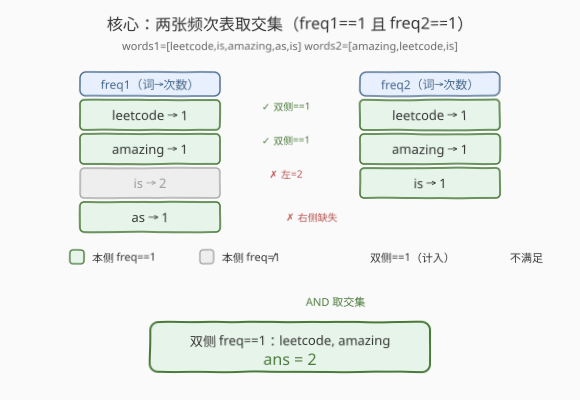
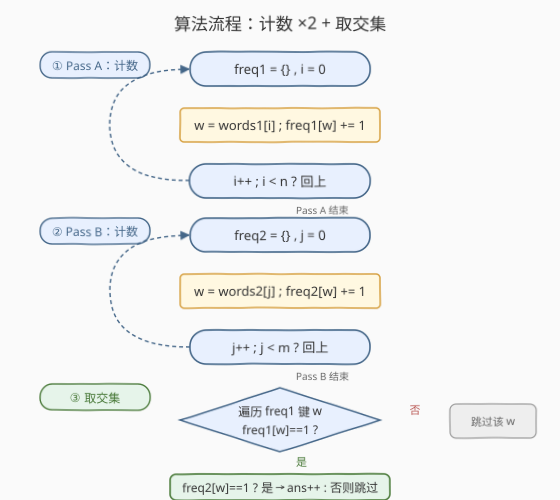
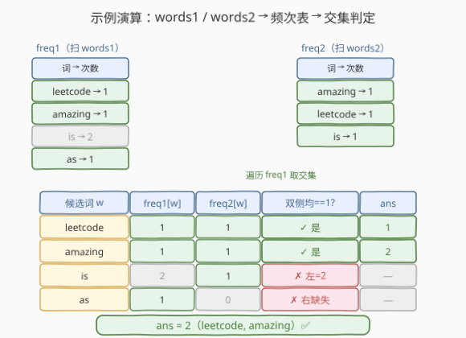

# 统计出现过一次的公共字符串

- **题目名称**：统计出现过一次的公共字符串
- **链接**：[2085. 统计出现过一次的公共字符串](https://leetcode.cn/problems/count-common-words-with-one-occurrence/)
- **难度**：简单
- **标签**：数组、哈希表、字符串、计数

## 1. 题目概述

给定两个字符串数组 `words1` 和 `words2`，返回在两个数组中**都恰好出现一次**的字符串的数目。

> 💡 注意「都恰好出现一次」是一个 **AND 条件**：字符串 `w` 必须同时满足 `freq1[w] == 1` 且 `freq2[w] == 1`，缺一不可。其中任意一个数组里没出现、或出现了不止一次，都不计入。

**示例 1**：

```text
输入：words1 = ["leetcode","is","amazing","as","is"], words2 = ["amazing","leetcode","is"]
输出：2
解释：
- "leetcode" 在两个数组中都恰好出现一次，计入。
- "amazing" 在两个数组中都恰好出现一次，计入。
- "is" 在两个数组中都出现过，但在 words1 中出现了 2 次，不计入。
- "as" 在 words1 中出现一次，但在 words2 中没出现，不计入。
所以共有 2 个字符串满足条件。
```

**示例 2**：

```text
输入：words1 = ["b","bb","bbb"], words2 = ["a","aa","aaa"]
输出：0
解释：两数组无任何公共字符串，自然没有「都出现一次」的字符串。
```

**示例 3**：

```text
输入：words1 = ["a","ab"], words2 = ["a","a","a","ab"]
输出：1
解释：唯一满足的是 "ab"（words1 中 1 次，words2 中 1 次）。
      "a" 在 words2 中出现 3 次，不满足。
```

**约束条件**：

- `1 <= words1.length, words2.length <= 1000`
- `1 <= words1[i].length, words2[j].length <= 30`
- `words1[i]` 和 `words2[j]` 都只包含小写英文字母。

---

## 2. 解题思路

### 2.1 暴力思路：对每个候选词双向数频次

最直觉的做法：枚举 `words1` 中每个词 `w`，先在 `words1` 里数它的频次是否为 1，若是再到 `words2` 里数它的频次是否也为 1，命中则计数。

```text
for w in words1:
    if count(words1, w) == 1 and count(words2, w) == 1:
        ans += 1
return ans
```

问题有二：①每个词都要把两个数组各扫一遍，时间 $O(|words1| \cdot (|words1| + |words2|))$，约 $2 \times 10^6$，勉强可过但浪费；②同一词若在 `words1` 出现多次（如示例 1 的 `"is"`），会被反复判断，且重复计入需额外去重——逻辑易错。

> ⚠️ 频次信息是**全局共享**的：一个词在数组里出现几次，扫一遍就能确定，没必要每次临时现数。把频次提前算好存进哈希表，后续查询 $O(1)$。

### 2.2 核心观察：两张频次表取交集（AND）



关键观察：**「是否恰好出现一次」只取决于该词的频次，而每个数组的频次可以独立地一遍扫描确定**。于是把流程拆成「计数 + 取交集」两阶段：

1. **Pass A**：扫 `words1`，建频次表 `freq1`（词 → 出现次数）。
2. **Pass B**：扫 `words2`，建频次表 `freq2`。
3. **取交集**：遍历 `freq1` 中频次为 1 的词 `w`，检查 `freq2[w] == 1` 是否成立，命中则 `ans += 1`。

> 💡 **为什么遍历 `freq1` 而非 `words1`？** 取交集时只需考察「`freq1[w] == 1`」的词，遍历 `freq1` 的键天然去重，每个词只判一次，避免了暴力法里同一词反复判断的麻烦。对于 `freq2[w]`，缺键时返回 0，`0 != 1` 自动判否，无需特判「`w` 是否存在于 `words2`」。

> 💡 **与 [2053. 数组中第 K 个独一无二的字符串](2053_数组中第K个独一无二的字符串.md) 的关系**：2053 是「单数组取 `freq==1`」，本题是「双数组取 `freq1==1` **且** `freq2==1`」——把单数组的频次过滤升级为双数组的**频次交集**，核心套路（哈希计数 + 二次过滤扫描）完全一致，只是过滤条件从单侧变双侧 AND。

### 2.3 算法流程图



两遍计数各 $O(n)$、$O(m)$，交集阶段遍历 `freq1` 至多 $n$ 个键，每次 $O(1)$ 查 `freq2`。整体 $O(n + m)$ 时间，$O(n + m)$ 空间。

### 2.4 示例演算

以示例 1 `words1 = ["leetcode","is","amazing","as","is"]`、`words2 = ["amazing","leetcode","is"]` 为例：



**Pass A** 扫 `words1` 得 `freq1`：

| 词 | leetcode | is | amazing | as |
|----|----------|----|---------|----|
| 频次 | 1 | 2 | 1 | 1 |

**Pass B** 扫 `words2` 得 `freq2`：

| 词 | amazing | leetcode | is |
|----|---------|----------|----|
| 频次 | 1 | 1 | 1 |

**取交集**：遍历 `freq1` 中频次为 1 的词：

| 候选词 `w` | `freq1[w]` | `freq2[w]` | 双侧均==1? | 计入 |
|------------|-----------|-----------|-----------|------|
| leetcode | 1 | 1 | ✓ | ans=1 |
| amazing | 1 | 1 | ✓ | ans=2 |
| as | 1 | 0（缺键） | ✗ | — |
| is | 2 | — | ✗（`freq1` 已≠1） | — |

最终 `ans = 2` ✅。注意 `"as"` 虽在 `words1` 中恰好一次，但 `words2` 里没有，`freq2["as"]` 缺键返回 0，被自动排除；`"is"` 在 `freq1` 里就是 2，连候选都不是。

---

## 3. 参考代码

### C++

```cpp
class Solution {
  public:
    int countWords(vector<string>& words1, vector<string>& words2) {
        unordered_map<string, int> freq1, freq2;
        for (const auto& w : words1) freq1[w]++;   // Pass A：计数 words1
        for (const auto& w : words2) freq2[w]++;   // Pass B：计数 words2
        int ans = 0;
        for (const auto& [w, c] : freq1) {          // 取交集：遍历 freq1
            if (c == 1 && freq2[w] == 1) ans++;     // 双侧均==1 才计入
        }
        return ans;
    }
};
```

### Python

```python
from collections import Counter
from typing import List

class Solution:
    def countWords(self, words1: List[str], words2: List[str]) -> int:
        freq1 = Counter(words1)                     # Pass A：计数 words1
        freq2 = Counter(words2)                     # Pass B：计数 words2
        return sum(1 for w, c in freq1.items()
                   if c == 1 and freq2[w] == 1)     # 取交集：双侧均==1
```

> 💡 Python 用 `Counter` 缺键时返回 0（`0 == 1` 为假），无需 `w in freq2` 预判；C++ `unordered_map::operator[]` 缺键时插入默认值 0，同样安全，但会向 `freq2` 插入空条目——若在意可改用 `.count()` 或 `.find()` 先判存在。本题数据量小，影响可忽略。

---

## 4. 复杂度分析

| 维度 | 复杂度 | 说明 |
|------|--------|------|
| 时间复杂度 | $O(n + m)$ | Pass A 扫 $n$、Pass B 扫 $m$、交集阶段至多扫 $n$ 个键，每次 $O(1)$ 哈希查询 |
| 空间复杂度 | $O(n + m)$ | 两张频次表至多存 $n + m$ 个不同字符串 |

> ⚠️ 严格地讲，单次哈希操作成本与字符串长度 $L$ 相关，总时间 $O((n+m) \cdot L)$。本题 $L \le 30$ 视为常数，故仍为 $O(n+m)$。若 $L$ 很大，可考虑字符串滚动哈希降低单次成本，但会引入碰撞风险。

---

## 5. 扩展：遍历较小表优化常数

交集阶段遍历 `freq1` 还是 `freq2` 不影响正确性，但**遍历键较少的那张表**能减少检查次数：

```cpp
int countWords(vector<string>& words1, vector<string>& words2) {
    unordered_map<string, int> f1, f2;
    for (const auto& w : words1) f1[w]++;
    for (const auto& w : words2) f2[w]++;
    int ans = 0;
    // 选键较少的表遍历，减少检查次数
    if (f1.size() > f2.size()) swap(f1, f2);
    for (const auto& [w, c] : f1)
        if (c == 1 && f2[w] == 1) ans++;
    return ans;
}
```

**变体讨论**：若题目改为「两侧出现次数相同的字符串数」（不限定为 1），只需把判定改为 `freq1[w] == freq2[w]`；若改为「两侧均恰好出现 `k` 次」，改为 `freq1[w] == k && freq2[w] == k`。频次表 + 双侧条件 AND 的框架不变，体现「计数 + 交集」范式的可迁移性。

---

## 6. 面试要点

1. **为什么用两张频次表而不是一张？**

   - 「都恰好出现一次」是**两个独立数组**上的条件，每个数组的频次必须分别统计。一张表无法同时承载两个数组的频次信息（除非混存并打标记，反而更复杂）。两张表各管一侧、最后取交集，逻辑最清晰。

2. **取交集时遍历 `freq1` 还是 `freq2`？需要两边都遍历吗？**

   - 只需遍历其中一张表即可。一个词若 `freq1[w]==1 && freq2[w]==1`，遍历 `freq1` 时即可命中；遍历 `freq2` 同理。无需两边都遍历（否则同一词会被判两次）。为优化常数，遍历**键较少**的那张表。

3. **`freq2[w]` 在 `w` 不存在时怎么处理？**

   - C++ `unordered_map::operator[]` 缺键返回 0（并插入空条目）；Python `Counter`/`dict.get` 缺键返回 0。`0 != 1` 自动判否，无需特判存在性——这是哈希计数的便利。

4. **暴力法为什么会重复计数？**

   - 暴力法若直接 `for w in words1` 逐个判断，`"is"`（在 `words1` 出现两次）会在两个位置各被判一次；即便两次都判否，也是浪费。更糟的是若条件改为「至少出现一次」等，重复枚举会导致同一词被多次计入，必须额外用 `seen` 集合去重。遍历 `freq1` 的键天然去重，规避了此问题。

5. **本题与 2053（第 K 个独一无二字符串）的异同？**

   - 同：都是「频次预计算 + 二次过滤」的哈希计数套路，核心是 `freq==1` 的过滤。
   - 异：2053 单数组、按原序取第 k 个（强调保序）；本题双数组、取双侧 `freq==1` 的交集（强调 AND 条件）。本题无需保序，因为求的是「数目」而非「具体第几个」。

> 💡 **一句话总结**：两个数组各建一张频次表，遍历其中一张取 `freq1==1 && freq2==1` 的词计数即可。本质是**哈希计数 + 双侧条件 AND 交集**，$O(n+m)$ 时间空间，与 [2053](2053_数组中第K个独一无二的字符串.md)「单数组频次过滤」同源。

---

## 7. 同类练习题

- [2053. 数组中第 K 个独一无二的字符串](https://leetcode.cn/problems/kth-distinct-string-in-an-array/)（[题解](2053_数组中第K个独一无二的字符串.md)）：单数组取 `freq==1` 并保序取第 k 个，本题的「单侧退化版」
- [387. 字符串中的第一个唯一字符](https://leetcode.cn/problems/first-unique-character-in-a-string/)：频次预计算 + 二次扫描找首个 `freq==1`，同套哈希计数模板
- [1941. 检查是否所有字符出现相等次数](https://leetcode.cn/problems/check-if-all-characters-have-equal-number-of-occurrences/)：频次统计 + 值域判定，`Counter` 的直接使用
- [349. 两个数组的交集](https://leetcode.cn/problems/intersection-of-two-arrays/)：双数组取交集（不限频次），对照本题「频次限定为 1 的交集」
- [1002. 查找共用字符](https://leetcode.cn/problems/find-common-characters/)：多数组取公共字符（取各数组最小频次），频次交集的进阶版
