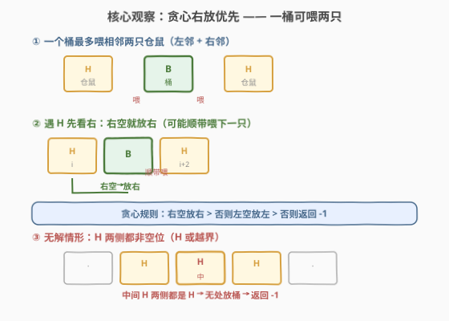
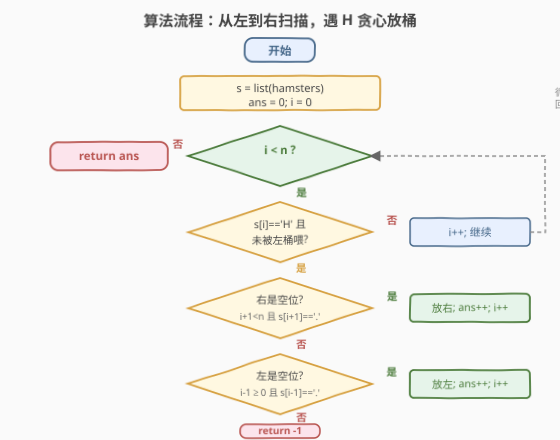
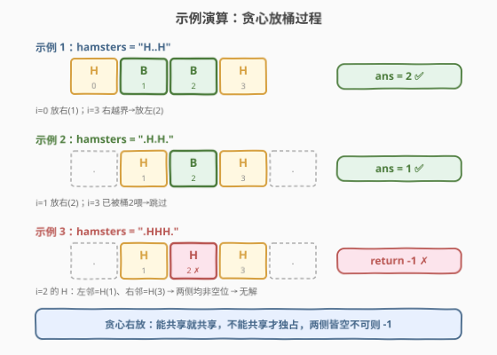

# 喂食仓鼠的最小食物桶数

- **题目名称**：喂食仓鼠的最小食物桶数
- **链接**：[2086. 喂食仓鼠的最小食物桶数](https://leetcode.cn/problems/minimum-number-of-food-buckets-to-feed-the-hamsters/)
- **难度**：中等
- **标签**：贪心、字符串、动态规划

## 1. 题目概述

给定一个下标从 `0` 开始的字符串 `hamsters`，其中 `hamsters[i]` 要么是：

- `'H'` 表示下标 `i` 处有一只仓鼠，要么
- `'.'` 表示下标 `i` 是空位。

你可以在**空位**上放置食物桶来喂仓鼠。若仓鼠的**左边或右边至少有一个食物桶**，它就能被喂食。更正式地，若在位置 `i - 1` **或** `i + 1` 放置食物桶，就可以喂位置 `i` 处的仓鼠。

在**所有仓鼠都能被喂食**的前提下，返回需要放置的**最少食物桶数**；若无法喂食所有仓鼠，返回 `-1`。

**示例 1**：

```text
输入：hamsters = "H..H"
输出：2
解释：在下标 1 和 2 处各放一个食物桶。
可以证明若只放 1 个桶，必有一只仓鼠吃不到。
```

**示例 2**：

```text
输入：hamsters = ".H.H."
输出：1
解释：在下标 2 处放一个食物桶即可同时喂两只仓鼠。
```

**示例 3**：

```text
输入：hamsters = ".HHH."
输出：-1
解释：即便在每个空位都放桶，下标 2 处的仓鼠仍吃不到。
```

**约束条件**：

- $1 \leq \text{hamsters.length} \leq 10^5$
- `hamsters[i]` 要么是 `'H'`，要么是 `'.'`。

> 💡 **审题关键**：① 桶只能放在 `'.'` 上，仓鼠 `'H'` 上不能放；② 一个桶最多喂**相邻两只**仓鼠（左邻 + 右邻），这是「一个桶当两个用」的潜力所在；③ 若某只 `'H'` 的左右两侧都不是空位（是 `'H'` 或越界），则**必无解**；④ 目标是**最小化桶数**，故应尽量让一个桶同时喂两只仓鼠。

---

## 2. 解题思路

### 2.1 暴力思路：枚举空位子集

最直观的做法：把每个空位视作「放桶 / 不放桶」两种选择，枚举所有 $2^m$ 种组合（$m$ 为空位数），对每种组合检查是否所有 `'H'` 都被覆盖（即每个 `'H'` 的左或右至少有一个桶），在所有合法组合中取桶数最少者。

- **正确性**：穷举所有放置方案，必然覆盖最优解。
- **效率**：$O(2^m \cdot n)$，当 $n \leq 10^5$ 时完全不可行——必须找到**局部决策可确定**的结构。

> ⚠️ 暴力的浪费在于：它把所有空位的放置决策**同时**考虑，却没有意识到「从左到右扫描时，每遇到一只仓鼠，其桶的归属可以立即确定」。一旦发现「贪心右放」不会丢失最优性，就能把指数级枚举压缩成 $O(n)$ 一次遍历。

### 2.2 核心观察：贪心右放优先



整个解法建立在**三个关键观察**上。

**观察 1：一个桶最多喂相邻两只仓鼠**

桶放在位置 $j$（须为 `'.'`），能喂 $j-1$ 和 $j+1$ 处的仓鼠。因此理想情况下，一个桶同时服务左右两只 `'H'`，桶数减半。示例 2 `".H.H."` 把桶放在中间的 `.`（下标 2），正好一桶喂两只。

**观察 2：遇到 `H` 优先把桶放右边（贪心选择）**

从左到右扫描，遇到一只**尚未被喂**的仓鼠（下标 $i$）时，需要在 $i-1$ 或 $i+1$ 放桶。该选哪边？

| 选择 | 服务范围 | 对后续影响 |
|------|----------|-----------|
| 放右 $i+1$ | 喂 $i$，**可能顺带喂 $i+2$**（若 $i+2$ 是 `H`） | 向右延伸，潜力更大 |
| 放左 $i-1$ | 喂 $i$，**只能喂 $i-2$**（但 $i-2$ 已被左侧处理过） | 向左延伸，对已处理部分无增益 |

> 💡 **交换论证**：设最优解在某只 `H` 处把桶放在了左边（$i-1$），而 $i+1$ 是空位。把这只桶从 $i-1$ 挪到 $i+1$，原先靠 $i-1$ 喂的仓鼠（只有 $i$ 自己，因为 $i-2$ 若是 `H` 在更早处已被处理）仍由新位置 $i+1$ 喂（$i+1$ 是 $i$ 的右邻）；同时新位置还能额外喂 $i+2$。因此「右放」**始终不劣于**「左放」，可安全替换。这就是贪心选择性质。

**观察 3：两侧均无空位即无解**

若 `H` 在下标 $i$，而 $i-1$ 与 $i+1$ 都不是 `'.'`（要么是 `'H'`，要么越界），则这只仓鼠**无论如何都吃不到**，直接返回 `-1`。示例 3 `".HHH."` 中下标 2 的 `H` 左右都是 `H`，故无解。

$$\boxed{\text{遇 H：已被左桶喂→跳过；否则右空放右；否则左空放左；否则返回 -1}}$$

**用示例 2 验证**：`hamsters = ".H.H."`

- $i=1$（`H`）：未被喂，右 $i+1=2$ 是 `.`，放桶于 2，`ans=1`。
- $i=3$（`H`）：左邻 $i-1=2$ 已有桶 → 被喂，跳过。
- 返回 `1` ✓

### 2.3 算法流程图



**完整步骤**：

1. 初始化 `ans = 0`，`prevBucket = -2`（记录最近放置的桶下标，初值不可能命中 `i-1`）。
2. **遍历** `i` 从 `0` 到 `n-1`：
   - 若 `hamsters[i] != 'H'`：跳过。
   - 若 `prevBucket == i - 1`：当前 `H` 已被左侧桶喂，跳过。
   - 否则需要放桶：
     - 若 `i + 1 < n` 且 `hamsters[i+1] == '.'`：放桶于 `i+1`，`prevBucket = i+1`，`ans++`。
     - 否则若 `i - 1 >= 0` 且 `hamsters[i-1] == '.'`：放桶于 `i-1`，`prevBucket = i-1`，`ans++`。
     - 否则：返回 `-1`。
3. **返回** `ans`。

> ⚠️ **两个易错点**：① 必须先判「已被左桶喂」再决定是否放新桶，否则会把已喂的 `H` 重复计桶；② 「右空放右」优先于「左空放左」是**最优性的关键**——若反过来优先放左，遇到 `"H.H.H"` 这类可共享的情况会多放桶。

### 2.4 示例演算

对三个示例逐步演算：



| 示例 | 输入 | 扫描过程 | 桶位置 | 结果 |
|------|------|----------|--------|------|
| 1 | `"H..H"` | $i=0$ 放右(1)；$i=3$ 右越界→放左(2) | {1, 2} | `2` |
| 2 | `".H.H."` | $i=1$ 放右(2)；$i=3$ 已被桶 2 喂→跳过 | {2} | `1` |
| 3 | `".HHH."` | $i=1$ 右是 `H`→放左(0)；$i=2$ 左右皆 `H`→`-1` | — | `-1` |

> 💡 **对比示例 1 与示例 2**：同为「两只 `H` 中间有空位」，示例 1 中间有两个 `.` 但 `H` 分居两端（下标 0、3），一个桶最多喂相邻两只，而 0 与 3 不相邻，故需 2 桶；示例 2 中两只 `H`（下标 1、3）共享中间 `.`（下标 2），一桶即可。是否「能共享」取决于两只 `H` 之间是否恰好隔一个 `.`。

---

## 3. 参考代码

### 方法一：贪心右放（$O(n)$ 时间 / $O(1)$ 空间，推荐）

### C++

```cpp
class Solution {
public:
    int minimumBuckets(string hamsters) {
        int n = hamsters.size(), ans = 0;
        int prevBucket = -2; // 最近放置的桶下标，初值不可能命中 i-1
        for (int i = 0; i < n; ++i) {
            if (hamsters[i] != 'H') continue;
            if (prevBucket == i - 1) continue; // 已被左侧桶喂
            if (i + 1 < n && hamsters[i + 1] == '.') { // 优先放右
                prevBucket = i + 1;
                ++ans;
            } else if (i - 1 >= 0 && hamsters[i - 1] == '.') { // 退而放左
                prevBucket = i - 1;
                ++ans;
            } else {
                return -1;
            }
        }
        return ans;
    }
};
```

### Python

```python
class Solution:
    def minimumBuckets(self, hamsters: str) -> int:
        n = len(hamsters)
        ans = 0
        prev_bucket = -2  # 最近放置的桶下标，初值不可能命中 i-1
        for i, ch in enumerate(hamsters):
            if ch != 'H':
                continue
            if prev_bucket == i - 1:  # 已被左侧桶喂
                continue
            if i + 1 < n and hamsters[i + 1] == '.':  # 优先放右
                prev_bucket = i + 1
                ans += 1
            elif i - 1 >= 0 and hamsters[i - 1] == '.':  # 退而放左
                prev_bucket = i - 1
                ans += 1
            else:
                return -1
        return ans
```

> 💡 **写法要点**：① 只用 `prevBucket` 一个变量即可判断「当前 `H` 是否已被左侧桶喂」——因为桶只能放在 `H` 的相邻位置，最近放的桶若恰在 `i-1`，必然喂到 $i$；② 无需修改原串、无需额外数组，做到 $O(1)$ 空间；③ `prevBucket` 初值取 `-2`（任何 `i-1` 都不可能等于 `-2`，因为 $i \geq 0$），避免特判首元素。

### 方法二：动态规划（$O(n)$ 时间 / $O(1)$ 空间，思路对照）

若不想依赖贪心正确性证明，可用 DP 穷举所有合法放置方案。关键在于：判定 `H` 在 $i-1$ 是否被覆盖时，需要同时知道 $i-2$、$i-1$、$i$ 三处是否放桶——故状态需记录**相邻两个位置**的桶状态。

**状态定义**：`dp[s]`，其中 $s = (a \ll 1) \mid b$，$a$ = 位置 $i-2$ 是否有桶，$b$ = 位置 $i-1$ 是否有桶。含义为「已决定位置 $0 \dots i-1$ 的放桶情况，且位置 $0 \dots i-2$ 的所有 `H` 均已被覆盖」时的最少桶数。

**转移**（决定位置 $i$ 是否放桶 $c \in \{0,1\}$）：

- $c = 1$ 要求 `hamsters[i] == '.'`；
- 若 `hamsters[i-1] == 'H'`，需 $a \lor b \lor c = 1$（被 $i-2$、$i-1$ 或 $i$ 三者之一覆盖）；
- 新状态 $s' = (b \ll 1) \mid c$，代价 $+c$。

末尾追加一个虚拟位置 $n$（强制 $c=0$）以覆盖最后一只 `H`，答案为 $\min(dp[0], dp[2])$。

### C++

```cpp
class Solution {
public:
    int minimumBuckets(string hamsters) {
        int n = hamsters.size();
        const int INF = 1e9;
        int dp[4] = {0, INF, INF, INF}; // 起点：位置 -1 无桶
        for (int i = 0; i <= n; ++i) { // i == n 为虚拟位置
            int nd[4] = {INF, INF, INF, INF};
            bool canBucket = (i < n) && (hamsters[i] == '.');
            for (int s = 0; s < 4; ++s) {
                if (dp[s] >= INF) continue;
                int a = (s >> 1) & 1, b = s & 1;
                for (int c = 0; c <= 1; ++c) {
                    if (c == 1 && !canBucket) continue;
                    if (i >= 1 && hamsters[i - 1] == 'H' && !(a || b || c)) continue;
                    int ns = (b << 1) | c;
                    nd[ns] = min(nd[ns], dp[s] + c);
                }
            }
            for (int s = 0; s < 4; ++s) dp[s] = nd[s];
        }
        int ans = min(dp[0], dp[2]);
        return ans >= INF ? -1 : ans;
    }
};
```

### Python

```python
class Solution:
    def minimumBuckets(self, hamsters: str) -> int:
        n = len(hamsters)
        INF = float('inf')
        dp = [0, INF, INF, INF]  # (a<<1)|b
        for i in range(n + 1):  # i == n 为虚拟位置
            nd = [INF] * 4
            can_bucket = i < n and hamsters[i] == '.'
            for s in range(4):
                if dp[s] >= INF:
                    continue
                a, b = (s >> 1) & 1, s & 1
                for c in (0, 1):
                    if c == 1 and not can_bucket:
                        continue
                    if i >= 1 and hamsters[i - 1] == 'H' and not (a or b or c):
                        continue
                    ns = (b << 1) | c
                    if dp[s] + c < nd[ns]:
                        nd[ns] = dp[s] + c
            dp = nd
        ans = min(dp[0], dp[2])
        return -1 if ans >= INF else ans
```

> 💡 DP 不需要交换论证，只把「每个 `H` 必须被覆盖」作为约束枚举状态，机械地求最小——但状态数固定为 4，仍是 $O(n)$。贪心本质上是「DP 中每步的最优选择已被锁定，故可丢弃状态表只留一个变量」的紧凑形式。

---

## 4. 复杂度分析

| 维度 | 方法 | 复杂度 | 说明 |
|------|------|--------|------|
| 时间 | 贪心 | $O(n)$ | 一次遍历，每个位置 $O(1)$ 判断与放置 |
| 空间 | 贪心 | $O(1)$ | 仅 `ans` 与 `prevBucket` 两个标量 |
| 时间 | DP | $O(n)$ | 每个位置 4 状态 × 2 选择 = 常数转移 |
| 空间 | DP | $O(1)$ | 滚动数组仅 4 个状态 |

> 💡 两种方法同为 $O(n)$ 时间，但贪心代码更短、常数更小。本题数据规模 $n \leq 10^5$，二者都能轻松通过。贪心的优势在于**把「指数级枚举」压缩成「一次扫描 + 局部贪心选择」**——关键洞察是「右放不劣于左放」使得每步决策唯一确定。

---

## 5. 扩展：贪心正确性的形式化证明

下面用**交换论证**严格证明「遇 `H` 优先放右」的最优性。

**命题**：存在一个最优解，其中每只「未被左侧桶喂」的仓鼠都把桶放在右侧（若右侧为空位）。

**证明**：设 $\mathcal{O}$ 为任意一个最优解，设 $i$ 是从左到右**第一只**未被左侧桶喂、且 $\mathcal{O}$ 把桶放在左侧（$i-1$）的仓鼠，此时 $i+1$ 是空位（否则 $\mathcal{O}$ 也会被迫放左，不构成反例）。构造 $\mathcal{O}'$：把 $i-1$ 处的桶挪到 $i+1$。

- **$i$ 仍被喂**：新桶在 $i+1$，是 $i$ 的右邻。
- **不影响 $i-2$**：$i-2$ 若是 `H`，它在 $i$ 之前已被处理；若它靠 $i-1$ 的桶喂，则 $i-1$ 在那时就该有桶——但 $i$ 是「第一只放左」的，说明 $i-2$ 并非靠 $i-1$ 喂（它靠更左的桶或自己右侧别的桶）。更直接地：$i-2$ 与 $i$ 共享 $i-1$ 时，$i$ 会被「$i-2$ 处理时放的右桶」喂到，与「$i$ 未被左桶喂」矛盾。故 $i-2$ 不依赖 $i-1$。
- **可能新增收益**：新位置 $i+1$ 还能喂 $i+2$，若 $\mathcal{O}$ 原本为 $i+2$ 单独放了桶，$\mathcal{O}'$ 可去掉那只桶，桶数不增。

故 $|\mathcal{O}'| \leq |\mathcal{O}|$，$\mathcal{O}'$ 仍最优且消除了 $i$ 处的「放左」。重复此操作可把所有「可放右却放左」的情况消除，得到一个「优先放右」的最优解。$\square$

> 💡 这类「**覆盖型贪心**」的通用证明套路：找到一个**反例点**（放左而非放右），做一次局部交换证明不劣，递推消除所有反例点。与「区间调度按右端点排序」「跳跃游戏维护当前能达右最远」是同一族思想。

---

## 6. 面试要点

**Q1：为什么遇到 `H` 要优先把桶放右边而不是左边？**

> 放右边能喂当前 `H`，且**可能顺带喂下一只 `H`**（若 $i+2$ 也是 `H`）；放左边只能喂当前 `H`（$i-2$ 若是 `H` 早已在左侧处理完毕，不会再受益）。由交换论证，把左放换成右放从不增加桶数，故右放严格不劣。

**Q2：如何判断无解？为什么返回 `-1`？**

> 当某只 `H` 的左右两侧都不是空位（是 `H` 或越界）时，这只仓鼠无论如何吃不到。一旦扫描中遇到这种情况立即返回 `-1`。这是**唯一**的无解情形——其余情况下，每个 `H` 至少有一侧可放桶，贪心必能构造出合法方案。

**Q3：贪心会不会因为「优先放右」而漏掉更优解？**

> 不会。交换论证保证：任何把桶放左的最优解都能逐步改写成「放右」的同等优解。换言之，「优先放右」覆盖了至少一个最优解，故不会漏掉最优值。

**Q4：$O(1)$ 空间版本为什么只需记录「最近一个桶下标」？**

> 判断当前 `H` 是否已被左侧桶喂，只需检查「最近放的桶是否恰在 $i-1$」。因为桶只放在 `H` 的相邻位置，且我们按从左到右顺序处理——若存在一个左侧桶在 $i-1$，它必然是最近放的那只。无需记录更早的桶，它们离当前 `H` 太远，喂不到。

**Q5：贪心与 DP 的关系是什么？**

> DP 把「每个 `H` 必须被覆盖」作为约束，枚举所有合法放置方案求最小，需要 4 状态记录相邻两位的桶情况。贪心本质上是发现「DP 中每步的最优选择已被锁定」（右放总是不劣），从而丢弃状态表、只保留一个变量。可理解为贪心是 DP 的**紧凑化**——当 DP 的最优子结构退化为「唯一选择」时即得贪心。

> 💡 **一句话总结**：从左到右扫，遇 `H` 若未被左桶喂就「右空放右、否则左空放左、否则 `-1`」。$O(n)$ 时间、$O(1)$ 空间，核心是「右放不劣于左放」的交换论证。

---

## 7. 同类练习题

- [1326. 灌溉花园的最少水龙头数目](https://leetcode.cn/problems/minimum-number-of-taps-to-open-to-water-a-garden/)：覆盖整条线段的最少区间数贪心——同为「最少设施覆盖所有需求点」的覆盖型贪心，按左端点排序 + 维护当前能达右最远
- [1024. 视频拼接](https://leetcode.cn/problems/video-stitching/)：区间覆盖贪心——用若干片段覆盖目标区间，每次在可达范围内选延伸最远者，与本题「一桶覆盖两只」同属覆盖族
- [605. 种花问题](https://leetcode.cn/problems/can-place-flowers/)：一维数组相邻位置约束的贪心判定——放花要求两侧皆空，与本题「放桶要求相邻有 `H`」是相邻约束的正反两面
- [767. 重构字符串](https://leetcode.cn/problems/reorganize-string/)：相邻位置约束的重排贪心——要求相同字符不相邻，按频率贪心交替放置，体会「相邻约束」在贪心中的不同表现形式
