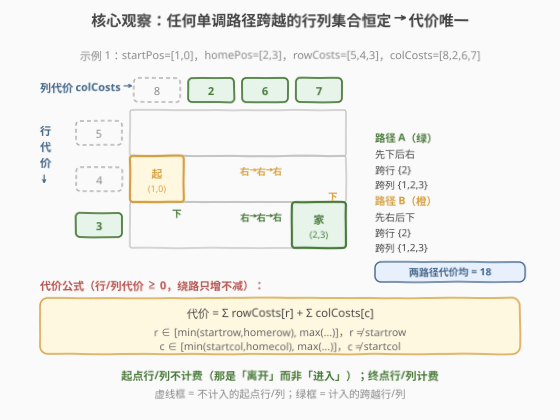
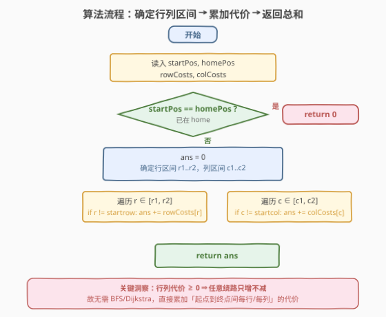
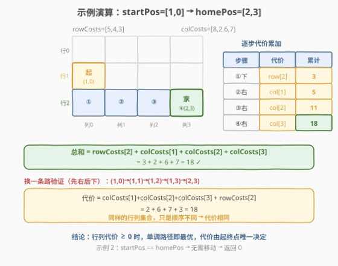

# 网格图中机器人回家的最小代价

- **题目名称**：网格图中机器人回家的最小代价
- **链接**：[2087. 网格图中机器人回家的最小代价](https://leetcode.cn/problems/minimum-cost-homecoming-of-a-robot-in-a-grid/)
- **难度**：中等
- **标签**：贪心、数组、网格

## 1. 题目概述

给定一个 $m \times n$ 的网格图，左上角为 $(0,0)$，右下角为 $(m-1, n-1)$。机器人初始在 `startPos = [startrow, startcol]`，家在 `homePos = [homerow, homecol]`。机器人每一步可往**上、下、左、右**四个方向移动一格，不能越界。

每步移动的代价**只与进入的格子有关**：

- 往上/下移动到**第 $r$ 行**的格子，代价为 `rowCosts[r]`；
- 往左/右移动到**第 $c$ 列**的格子，代价为 `colCosts[c]`。

返回机器人回家的**最小总代价**。

**示例 1**：

```text
输入：startPos = [1, 0], homePos = [2, 3], rowCosts = [5, 4, 3], colCosts = [8, 2, 6, 7]
输出：18
解释：(1,0) →下→ (2,0) [rowCosts[2]=3]
            →右→ (2,1) [colCosts[1]=2]
            →右→ (2,2) [colCosts[2]=6]
            →右→ (2,3) [colCosts[3]=7]
总代价 = 3 + 2 + 6 + 7 = 18
```

**示例 2**：

```text
输入：startPos = [0, 0], homePos = [0, 0], rowCosts = [5], colCosts = [26]
输出：0
解释：机器人已在家，无需移动。
```

**约束条件**：

- $m = \text{rowCosts.length}$，$n = \text{colCosts.length}$
- $1 \le m, n \le 10^5$
- $0 \le \text{rowCosts}[r], \text{colCosts}[c] \le 10^4$
- $0 \le \text{startrow}, \text{homerow} < m$，$0 \le \text{startcol}, \text{homecol} < n$

> 💡 **审题关键**：① 代价只依赖**进入的格子**（行或列），与从哪来、何时走**无关**；② 约束保证所有代价 $\ge 0$，这意味着**绕路只会增加代价、不会减少**；③ $m, n$ 可达 $10^5$，网格规模可达 $10^{10}$，任何基于「逐格 BFS/Dijkstra/DP」的算法都会超时——必须发现题目隐藏的结构。

---

## 2. 解题思路

### 2.1 暴力思路：网格最短路

最直观的做法是把网格建成图：每个格子是一个节点，与上下左右四个邻居连边，边权为进入邻居的代价（`rowCosts` 或 `colCosts`）。然后从 `startPos` 跑一次 Dijkstra 求到 `homePos` 的最短路。

- **正确性**：标准最短路，必然得到最优解。
- **效率**：节点数 $mn$、边数 $4mn$。当 $m, n \le 10^5$ 时，$mn$ 可达 $10^{10}$，**无论是时间还是空间都彻底爆炸**。

> ⚠️ 暴力的盲点在于「把网格当成普通图来搜」，却没注意到：**代价结构极其特殊**——移动到某行/某列的代价是**固定的、与路径无关的**。一旦识破这一点，就能把 $10^{10}$ 的搜索压缩成 $O(m+n)$ 的累加。

### 2.2 核心观察：单调推进即最优，代价由起终点唯一决定



整个解法建立在**三个关键观察**上。

**观察 1：代价只依赖「进入的格子」，与移动顺序无关**

无论机器人何时走到第 $r$ 行，付出的都是 `rowCosts[r]`；何时走到第 $c$ 列，付出的都是 `colCosts[c]`。因此总代价只取决于「**机器人最终跨越了哪些行、哪些列**」，与跨越的先后顺序无关。

**观察 2：从起点到终点，必然跨越一组确定的行与列**

要从 $(\text{startrow}, \text{startcol})$ 到 $(\text{homerow}, \text{homecol})$，机器人**必须**改变行号 $\text{startrow} \to \text{homerow}$、列号 $\text{startcol} \to \text{homecol}$。只要路径**单调推进**（行只朝 homerow 方向走、列只朝 homecol 方向走），机器人跨越的：

- **行集合** $= \{r : \min(\text{startrow},\text{homerow}) \le r \le \max(\text{startrow},\text{homerow}),\ r \ne \text{startrow}\}$
- **列集合** $= \{c : \min(\text{startcol},\text{homecol}) \le c \le \max(\text{startcol},\text{homecol}),\ c \ne \text{startcol}\}$

> 💡 **为什么排除起点行/列？** 代价定义在「**进入**」的格子上。机器人初始就站在起点行 `startrow` 与起点列 `startcol`，它「离开」起点但不「进入」起点，故起点的行/列代价不计。终点则是被「进入」的，故计入。

**观察 3：代价非负 ⇒ 绕路只增不减，单调路径即全局最优**

若机器人某次「走过头」再折返（如行从 `startrow` 走到 `homerow+1` 再回到 `homerow`），它会**额外跨越** `homerow+1` 这一行，多付一份 `rowCosts[homerow+1]`（$\ge 0$）。因此任何**非单调**的路径代价 $\ge$ 单调路径代价。

$$\boxed{\text{最小代价} = \sum_{\substack{r \in [\min,\max]\\r \ne \text{startrow}}} \text{rowCosts}[r] \;+\; \sum_{\substack{c \in [\min,\max]\\c \ne \text{startcol}}} \text{colCosts}[c]}$$

**用示例 1 验证**：`startPos=[1,0]`, `homePos=[2,3]`

- 行集合：$\min(1,2)=1,\max=2$，排除 $\text{startrow}=1$ → $\{2\}$，行代价 $= \text{rowCosts}[2] = 3$。
- 列集合：$\min(0,3)=0,\max=3$，排除 $\text{startcol}=0$ → $\{1,2,3\}$，列代价 $= 2+6+7 = 15$。
- 总代价 $= 3 + 15 = 18$ ✓

无论走「先下后右」还是「先右后下」，跨越的行列集合相同，代价都是 18。

### 2.3 算法流程图



**完整步骤**：

1. 若 `startPos == homePos`，直接返回 `0`。
2. 确定行区间 $[r_1, r_2] = [\min(\text{startrow},\text{homerow}),\ \max(\text{startrow},\text{homerow})]$。
3. 确定列区间 $[c_1, c_2] = [\min(\text{startcol},\text{homecol}),\ \max(\text{startcol},\text{homecol})]$。
4. `ans = 0`；遍历 $r \in [r_1, r_2]$，若 $r \ne \text{startrow}$ 则 `ans += rowCosts[r]`。
5. 遍历 $c \in [c_1, c_2]$，若 $c \ne \text{startcol}$ 则 `ans += colCosts[c]`。
6. 返回 `ans`。

> ⚠️ **唯一易错点**：忘记排除起点行/列。代价定义在「进入」的格子，起点是「离开」而非「进入」，多算 `rowCosts[startrow]` 或 `colCosts[startcol]` 会导致答案偏大。

### 2.4 示例演算

对示例 1 逐步演算（同时验证换一条路结果相同）：



| 路径 | 步骤 | 跨越行 | 跨越列 | 代价计算 | 总和 |
|------|------|--------|--------|----------|------|
| A：先下后右 | $(1,0)\to(2,0)\to(2,1)\to(2,2)\to(2,3)$ | $\{2\}$ | $\{1,2,3\}$ | $3+2+6+7$ | `18` |
| B：先右后下 | $(1,0)\to(1,1)\to(1,2)\to(1,3)\to(2,3)$ | $\{2\}$ | $\{1,2,3\}$ | $2+6+7+3$ | `18` |

> 💡 **对比两条路径**：跨越的行列集合完全相同 $\{2\} \cup \{1,2,3\}$，只是顺序不同。由于代价与顺序无关，两者总和相同。这正是「**代价唯一由起终点决定**」的直观体现。

---

## 3. 参考代码

### 方法一：从起点走到终点，边走边累加（$O(m+n)$ / $O(1)$，推荐）

直接模拟机器人从 `startPos` 一步步走到 `homePos`：先把行号对齐到 `homerow`，再把列号对齐到 `homecol`，每「进入」一个新行/列就累加其代价。写法最贴近题意，不易写错。

### C++

```cpp
class Solution {
public:
    int minCost(vector<int>& startPos, vector<int>& homePos,
                vector<int>& rowCosts, vector<int>& colCosts) {
        int ans = 0;
        int r = startPos[0], c = startPos[1];
        while (r != homePos[0]) {
            r += (homePos[0] > r) ? 1 : -1;
            ans += rowCosts[r];
        }
        while (c != homePos[1]) {
            c += (homePos[1] > c) ? 1 : -1;
            ans += colCosts[c];
        }
        return ans;
    }
};
```

### Python

```python
class Solution:
    def minCost(self, startPos: List[int], homePos: List[int],
                rowCosts: List[int], colCosts: List[int]) -> int:
        ans = 0
        r, c = startPos
        hr, hc = homePos
        while r != hr:
            r += 1 if hr > r else -1
            ans += rowCosts[r]
        while c != hc:
            c += 1 if hc > c else -1
            ans += colCosts[c]
        return ans
```

> 💡 **写法要点**：① 每次先移动 `r`（`+= 1` 或 `-= 1`），**再**累加 `rowCosts[r]`，因为代价定义在「进入」的格子（移动后的位置）；② 行先走还是列先走无所谓——总代价相同；③ `startPos == homePos` 时两个 `while` 都不进入，自然返回 `0`，无需特判。

### 方法二：区间求和（$O(m+n)$ / $O(1)$，思路对照）

与方法一等价，但用 `min/max` 圈定区间后一次遍历累加，跳过起点。更直接地体现「代价 = 行区间和 + 列区间和（均不含起点）」的公式。

### C++

```cpp
class Solution {
public:
    int minCost(vector<int>& startPos, vector<int>& homePos,
                vector<int>& rowCosts, vector<int>& colCosts) {
        int r1 = min(startPos[0], homePos[0]);
        int r2 = max(startPos[0], homePos[0]);
        int c1 = min(startPos[1], homePos[1]);
        int c2 = max(startPos[1], homePos[1]);
        int ans = 0;
        for (int r = r1; r <= r2; ++r) {
            if (r != startPos[0]) ans += rowCosts[r];
        }
        for (int c = c1; c <= c2; ++c) {
            if (c != startPos[1]) ans += colCosts[c];
        }
        return ans;
    }
};
```

### Python

```python
class Solution:
    def minCost(self, startPos: List[int], homePos: List[int],
                rowCosts: List[int], colCosts: List[int]) -> int:
        r1, r2 = min(startPos[0], homePos[0]), max(startPos[0], homePos[0])
        c1, c2 = min(startPos[1], homePos[1]), max(startPos[1], homePos[1])
        ans = 0
        for r in range(r1, r2 + 1):
            if r != startPos[0]:
                ans += rowCosts[r]
        for c in range(c1, c2 + 1):
            if c != startPos[1]:
                ans += colCosts[c]
        return ans
```

> 💡 两种方法本质相同：方法一是「沿路径走一遍」，方法二是「圈定区间跳过起点」。复杂度均为 $O(|\Delta r| + |\Delta c|) \le O(m + n)$，对 $10^5$ 规模轻松通过。

---

## 4. 复杂度分析

| 维度 | 方法 | 复杂度 | 说明 |
|------|------|--------|------|
| 时间 | 方法一/二 | $O(\lvert\text{homerow}-\text{startrow}\rvert + \lvert\text{homecol}-\text{startcol}\rvert) \le O(m+n)$ | 至多遍历起点到终点间的行与列各一次 |
| 空间 | 方法一/二 | $O(1)$ | 仅几个标量累加 |
| 时间 | Dijkstra 暴力 | $O(mn \log(mn))$ | 节点数 $mn$，$m,n \le 10^5$ 时 $mn \le 10^{10}$，不可行 |
| 空间 | Dijkstra 暴力 | $O(mn)$ | 存距离数组，同样爆炸 |

> 💡 本题的精髓不在「写出更快的算法」，而在**识破陷阱**：网格规模 $10^{10}$ 暗示不能逐格搜索，必须利用「代价只依赖进入的行列」+「代价非负」两条性质，把问题降维成两个一维区间的求和。

---

## 5. 扩展：如果代价可能为负怎么办？

本题能贪心直接求和的根本前提是 **$\text{rowCosts}[r], \text{colCosts}[c] \ge 0$**。若放宽为「代价可为负」，结论就崩塌了：

- **负代价鼓励绕路**：若某行代价为很大的负数，机器人会故意「绕过去蹭一遍」以降低总代价。此时单调路径不再最优，必须考虑所有可达格子。
- **但网格仍是 DAG 吗？** 不再是——机器人可以在任意两格间来回蹭负代价，问题退化为**带负权环的最短路**。若存在负环，则代价可趋于 $-\infty$（无意义）；否则需用 Bellman-Ford 类算法，规模 $10^{10}$ 下仍不现实。
- **可行的退化**：若仅允许「行只能朝 homerow 方向、列只能朝 homecol 方向」单调移动（即限制为 DAG），则可用 $O(mn)$ 的 DAG 最短路/拓扑 DP 求解，但仍受网格规模限制。

> ⚠️ 这说明「代价非负」是本题能 $O(m+n)$ 求解的**关键假设**，面试时可主动提出：去掉该假设后问题会质变，体现对约束的敏感度。

---

## 6. 面试要点

**Q1：为什么不需要 BFS/Dijkstra？题目明明是网格最短路。**

> 因为代价结构特殊：移动到第 $r$ 行的代价恒为 `rowCosts[r]`，与从哪来、何时走无关。加上所有代价非负，绕路只增不减。所以最优路径必然是单调的，跨越的行集合、列集合唯一确定，代价也就唯一——直接累加即可，无需搜索。

**Q2：为什么起点行/列的代价不计入？**

> 代价定义在「**进入**的格子」上。机器人初始就在起点行 `startrow`、起点列 `startcol`，它「离开」起点而非「进入」起点，所以这两项不计。终点是机器人「进入」的，要计入。多算起点代价是本题最常见的 off-by-one 错误。

**Q3：换一条单调路径，答案会变吗？**

> 不会。任何单调路径（行只朝 homerow 方向、列只朝 homecol 方向）跨越的行集合都是 $\{r \in [\min,\max], r \ne \text{startrow}\}$，列集合都是 $\{c \in [\min,\max], c \ne \text{startcol}\}$。代价只依赖集合内容，与跨越顺序无关，故所有单调路径代价相等。

**Q4：如果代价可能为负，你的解法还成立吗？**

> 不成立。负代价会鼓励机器人绕远路去「蹭」负权行/列，单调性失效。若允许任意方向移动且存在负环，总代价可趋于 $-\infty$；即便无负环也需 Bellman-Ford，$10^{10}$ 规模下不可行。若限制只能单调移动（DAG），则可用 $O(mn)$ DP 求解。本题的 $O(m+n)$ 解法严格依赖「代价非负」这一前提。

**Q5：$m, n \le 10^5$ 这个约束给了你什么提示？**

> $mn$ 可达 $10^{10}$，任何 $O(mn)$ 或更慢的算法（BFS、Dijkstra、网格 DP）都会超时/超内存。这强烈暗示不能把网格当成普通图来搜，必须发现题目特殊的代价结构，把问题降到 $O(m+n)$ 甚至更低。面试中遇到「看起来是图/网格搜索但规模巨大」的题，往往都有类似的隐藏结构可降维。

> 💡 **一句话总结**：代价非负 + 代价只依赖进入的行列 ⇒ 单调路径最优 ⇒ 代价 = 起终点间每行/每列代价之和（不含起点行/列）。$O(m+n)$ 时间、$O(1)$ 空间，核心是识破「网格最短路」的伪装。

---

## 7. 同类练习题

- [64. 最小路径和](https://leetcode.cn/problems/minimum-path-sum/)：网格从左上到右下的最小路径和——每个格子有**独立的**权值，代价不可分离，必须 $O(mn)$ DP；对比本题为何代价「可分离」时能直接降维
- [62. 不同路径](https://leetcode.cn/problems/unique-paths/)：网格从左上到右下只允许向右/向下的路径计数——帮助理解「为何本题只需考虑单调路径」以及单调路径的几何性质
- [1217. 玩筹码](https://leetcode.cn/problems/minimum-cost-to-move-chips-to-the-same-position/)：把筹码移到同一位置的最小代价——同为「看似要搜索，实则由奇偶分组结构可 $O(n)$ 直接求」的识破型题，体会结构性降维
- [1631. 最小体力消耗路径](https://leetcode.cn/problems/path-with-minimum-effort/)：网格路径的最小「最大边权」——代价**不可分离**（取决于相邻高度差），必须用并查集/Dijkstra 搜索，对照本题可分离代价的差异
