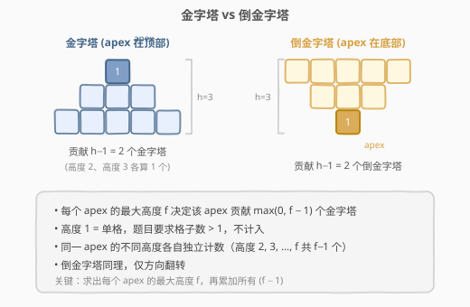
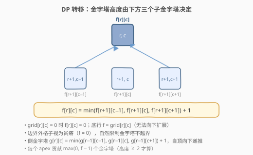
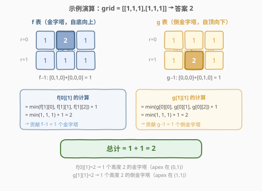

# LeetCode 统计农场中肥沃金字塔的数目 题解

## 1. 题目概述

- **标题 / 题号**：统计农场中肥沃金字塔的数目（#2088，hard）
- **链接**：https://leetcode.cn/problems/count-fertile-pyramids-in-a-land/
- **难度**：困难
- **标签**：数组、动态规划、矩阵

**题意**：有一个 `m × n` 的二进制矩阵 `grid` 表示农场，`1` 为肥沃、`0` 为贫瘠。网格外的格子视为贫瘠。

**金字塔**：顶端在最上方，高度为 `h`，以 `(r, c)` 为顶端时，第 `k` 层（`k = 0…h−1`）覆盖行 `r+k` 上从 `c−k` 到 `c+k` 的 `2k+1` 个格子。要求格子数大于 1（即 `h ≥ 2`），所有格子肥沃。

**倒金字塔**：顶端在最下方，高度为 `h`，以 `(r, c)` 为顶端时，第 `k` 层覆盖行 `r−k` 上从 `c−k` 到 `c+k` 的格子。同样要求 `h ≥ 2`。

返回金字塔和倒金字塔的总数目。同一 apex 的不同高度各自独立计数。

**示例 1**：

```text
输入：grid = [[0,1,1,0],[1,1,1,1]]
输出：2
解释：2 个金字塔（apex 分别在 (0,1) 和 (0,2)），0 个倒金字塔。
```

**示例 2**：

```text
输入：grid = [[1,1,1],[1,1,1]]
输出：2
解释：1 个金字塔（apex (0,1)，高度 2）+ 1 个倒金字塔（apex (1,1)，高度 2）。
```

**示例 3**：

```text
输入：grid = [[1,0,1],[0,0,0],[1,0,1]]
输出：0
```

**示例 4**：

```text
输入：grid = [[1,1,1,1,0],[1,1,1,1,1],[1,1,1,1,1],[0,1,0,0,1]]
输出：13
解释：7 个金字塔 + 6 个倒金字塔。
```

**约束**：

- `m == grid.length`
- `n == grid[i].length`
- `1 <= m, n <= 1000`
- `1 <= m * n <= 10^5`
- `grid[i][j]` 为 `0` 或 `1`

## 2. 解题思路

### 2.1 暴力思路

对每个格子 `(r, c)` 作为 apex，枚举高度 `h` 从 2 到可能的最大值，逐层检查金字塔覆盖的所有格子是否均为肥沃。时间复杂度 $O(m \cdot n \cdot H^2)$（$H = \max(m, n)$），在 $m \times n = 10^5$ 时最坏 $O(10^{10})$，不可接受。

### 2.2 核心观察：子金字塔分解 + DP



关键观察：**一个高度为 `h` 的金字塔，可以分解为顶端格子 `(r, c)` 加上三个高度为 `h−1` 的子金字塔**，分别以 `(r+1, c−1)`、`(r+1, c)`、`(r+1, c+1)` 为顶端。

因此，以 `(r, c)` 为顶端的最大金字塔高度 `f[r][c]` 满足：

$$f[r][c] = \min(f[r{+}1][c{-}1],\ f[r{+}1][c],\ f[r{+}1][c{+}1]) + 1$$

前提是 `grid[r][c] = 1`；若 `grid[r][c] = 0` 则 `f[r][c] = 0`。

> 💡 **为什么取 min？** 金字塔的每一层都比上一层宽 2 格，所以三个子金字塔必须同时能支撑到 `h−1` 层。任何一个子金字塔高度不足，就会成为"短板"，限制整体高度。这与 [221. 最大正方形](https://leetcode.cn/problems/maximal-square/) 中 `dp[i][j] = min(左, 上, 左上) + 1` 的思路完全同构——都是"三个方向的最小值 + 1"决定当前格子能扩展多大。

每个 apex 贡献 $\max(0,\ f[r][c] - 1)$ 个金字塔（高度 2, 3, …, `f[r][c]` 各算一个，共 `f[r][c] − 1` 个）。

倒金字塔完全对称：以 `(r, c)` 为底端的最大高度 `g[r][c]` 满足：

$$g[r][c] = \min(g[r{-}1][c{-}1],\ g[r{-}1][c],\ g[r{-}1][c{+}1]) + 1$$

### 2.3 算法流程图



**金字塔 DP（自底向上）**：

1. 初始化 `f` 矩阵，底行 `f[m−1][c] = grid[m−1][c]`。
2. 从 `r = m−2` 到 `0`，对每列 `c`：若 `grid[r][c] = 1`，则 `f[r][c] = 1 + min(f[r+1][c−1], f[r+1][c], f[r+1][c+1])`（边界外取 0）；否则 `f[r][c] = 0`。
3. 累加所有 `max(0, f[r][c] − 1)`。

**倒金字塔 DP（自顶向下）**：

1. 初始化 `g` 矩阵，顶行 `g[0][c] = grid[0][c]`。
2. 从 `r = 1` 到 `m−1`，对每列 `c`：若 `grid[r][c] = 1`，则 `g[r][c] = 1 + min(g[r−1][c−1], g[r−1][c], g[r−1][c+1])`；否则 `g[r][c] = 0`。
3. 累加所有 `max(0, g[r][c] − 1)`。

### 2.4 示例演算

以示例 2 `grid = [[1,1,1],[1,1,1]]` 为例：



**f 表（金字塔，自底向上）**：

| | c=0 | c=1 | c=2 |
|---|---|---|---|
| r=0 | 1 | **2** | 1 |
| r=1 | 1 | 1 | 1 |

`f[0][1] = min(f[1][0], f[1][1], f[1][2]) + 1 = min(1,1,1) + 1 = 2`，贡献 `f−1 = 1`。其余 `f` 值均为 1，贡献 0。金字塔总计 = 1。

**g 表（倒金字塔，自顶向下）**：

| | c=0 | c=1 | c=2 |
|---|---|---|---|
| r=0 | 1 | 1 | 1 |
| r=1 | 1 | **2** | 1 |

`g[1][1] = min(g[0][0], g[0][1], g[0][2]) + 1 = 2`，贡献 1。倒金字塔总计 = 1。

**总计 = 1 + 1 = 2**。

## 3. 参考代码

### C++

```cpp
class Solution {
  public:
    int countPyramids(vector<vector<int>>& grid) {
        int m = grid.size(), n = grid[0].size();
        int ans = 0;

        // f[r][c] = 以 (r,c) 为顶端的金字塔最大高度（向下扩展）
        vector<vector<int>> f(m, vector<int>(n, 0));
        for (int r = m - 1; r >= 0; r--) {
            for (int c = 0; c < n; c++) {
                if (grid[r][c] == 0) {
                    f[r][c] = 0;
                } else if (r == m - 1) {
                    f[r][c] = 1;
                } else {
                    int left  = (c > 0)     ? f[r + 1][c - 1] : 0;
                    int mid   =               f[r + 1][c];
                    int right = (c < n - 1)  ? f[r + 1][c + 1] : 0;
                    f[r][c] = 1 + min({left, mid, right});
                }
                ans += max(0, f[r][c] - 1);
            }
        }

        // g[r][c] = 以 (r,c) 为底端的倒金字塔最大高度（向上扩展）
        vector<vector<int>> g(m, vector<int>(n, 0));
        for (int r = 0; r < m; r++) {
            for (int c = 0; c < n; c++) {
                if (grid[r][c] == 0) {
                    g[r][c] = 0;
                } else if (r == 0) {
                    g[r][c] = 1;
                } else {
                    int left  = (c > 0)     ? g[r - 1][c - 1] : 0;
                    int mid   =               g[r - 1][c];
                    int right = (c < n - 1)  ? g[r - 1][c + 1] : 0;
                    g[r][c] = 1 + min({left, mid, right});
                }
                ans += max(0, g[r][c] - 1);
            }
        }

        return ans;
    }
};
```

### Python

```python
class Solution:
    def countPyramids(self, grid: List[List[int]]) -> int:
        m, n = len(grid), len(grid[0])
        ans = 0

        f = [[0] * n for _ in range(m)]
        for r in range(m - 1, -1, -1):
            for c in range(n):
                if grid[r][c] == 0:
                    f[r][c] = 0
                elif r == m - 1:
                    f[r][c] = 1
                else:
                    left  = f[r + 1][c - 1] if c > 0 else 0
                    mid   = f[r + 1][c]
                    right = f[r + 1][c + 1] if c < n - 1 else 0
                    f[r][c] = 1 + min(left, mid, right)
                ans += max(0, f[r][c] - 1)

        g = [[0] * n for _ in range(m)]
        for r in range(m):
            for c in range(n):
                if grid[r][c] == 0:
                    g[r][c] = 0
                elif r == 0:
                    g[r][c] = 1
                else:
                    left  = g[r - 1][c - 1] if c > 0 else 0
                    mid   = g[r - 1][c]
                    right = g[r - 1][c + 1] if c < n - 1 else 0
                    g[r][c] = 1 + min(left, mid, right)
                ans += max(0, g[r][c] - 1)

        return ans
```

## 4. 复杂度分析

| 维度 | 复杂度 | 说明 |
|------|--------|------|
| 时间复杂度 | $O(m \cdot n)$ | 两次遍历矩阵，每次 $O(mn)$ |
| 空间复杂度 | $O(m \cdot n)$ | `f` 和 `g` 各占 $O(mn)$；可优化为 $O(n)$（见下方扩展） |

> ⚠️ 本题 $m \times n \le 10^5$，$O(mn)$ 时间和空间均无压力。暴力 $O(mnH^2)$ 会超时。

## 5. 扩展：空间优化至 $O(n)$

两次 DP 各自只依赖相邻一行，可用滚动数组将空间降至 $O(n)$：

```python
# 金字塔 DP：只保留下一行
prev = [grid[m - 1][c] for c in range(n)]
ans = 0
for r in range(m - 2, -1, -1):
    cur = [0] * n
    for c in range(n):
        if grid[r][c] == 0:
            cur[c] = 0
        else:
            left  = prev[c - 1] if c > 0 else 0
            mid   = prev[c]
            right = prev[c + 1] if c < n - 1 else 0
            cur[c] = 1 + min(left, mid, right)
        ans += max(0, cur[c] - 1)
    prev = cur
```

倒金字塔同理，改为自顶向下滚动即可。由于 $m \times n \le 10^5$，$O(mn)$ 空间已够用，$O(n)$ 仅为面试中的优化讨论点。

## 6. 面试要点

1. **为什么金字塔可以分解为三个子金字塔？**
   - 高度 `h` 的金字塔第 `k` 层有 `2k+1` 个格子。去掉顶端后，剩余部分恰好被三个高度 `h−1` 的子金字塔完全覆盖（左 `(r+1,c−1)`、中 `(r+1,c)`、右 `(r+1,c+1)`），且三者覆盖的并集等于原金字塔去掉顶端后的全部格子。

2. **为什么每个 apex 贡献 `f − 1` 而不是 `f`？**
   - 题目要求格子数大于 1，即高度 ≥ 2。高度 1（单格）不算金字塔。高度 `f` 的 apex 可以形成高度 2, 3, …, `f` 共 `f − 1` 个金字塔。

3. **倒金字塔和金字塔的 DP 有何区别？**
   - 仅递推方向不同：金字塔自底向上（依赖 `r+1` 行），倒金字塔自顶向下（依赖 `r−1` 行）。转移方程结构完全相同。

4. **边界怎么处理？**
   - 网格外的格子视为贫瘠（`f = 0`）。代码中通过条件判断 `c > 0` / `c < n−1` 将越界值取 0，自然限制金字塔不越界。

5. **和 221. 最大正方形有什么联系？**
   - 两者都是 `dp[i][j] = min(三个方向) + 1` 的模式。最大正方形看左、上、左上三个方向；本题看下方三个方向。核心思想一致：当前格子能扩展的最大结构受限于相邻方向的最小值。

## 同类练习题

| # | 题目 | 与本题的关联 |
|---|------|-------------|
| 221 | [最大正方形](https://leetcode.cn/problems/maximal-square/) | `dp[i][j] = min(左, 上, 左上) + 1`，同构的"三方向取 min + 1"DP |
| 1277 | [统计全为 1 的正方形子矩阵](https://leetcode.cn/problems/count-square-submatrices-with-all-ones/) | 221 的计数版，累加所有 `dp[i][j]`（每个格子贡献的正方形个数等于其最大边长） |
| 1139 | [最大的以 1 为边界的正方形网格](https://leetcode.cn/problems/largest-1-bordered-square/) | 矩阵中的正方形结构 DP，预处理方向连续 1 的个数 |
| 72 | [编辑距离](https://leetcode.cn/problems/edit-distance/) | 二维矩阵 DP，当前状态依赖相邻方向（[[72_编辑距离.md]]） |
