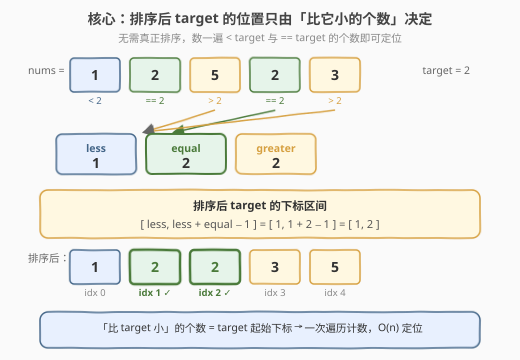
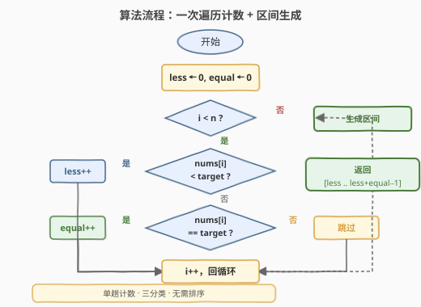

# 找出数组排序后的目标下标

- **题目名称**：找出数组排序后的目标下标
- **链接**：[2089. 找出数组排序后的目标下标](https://leetcode.cn/problems/find-target-indices-after-sorting-array/)
- **难度**：简单
- **标签**：数组、计数、排序

## 1. 题目概述

给定一个下标从 0 开始的整数数组 `nums` 以及一个目标元素 `target`。**目标下标**是满足 `nums[i] == target` 的下标 `i`。将 `nums` 按**非递减**顺序排序后，返回由 `nums` 中目标下标组成的列表。如果不存在目标下标，返回**空**列表。返回的列表必须按**递增**顺序排列。

**示例 1**：

```text
输入：nums = [1,2,5,2,3], target = 2
输出：[1,2]
解释：排序后，nums 变为 [1,2,2,3,5]。满足 nums[i] == 2 的下标是 1 和 2。
```

**示例 2**：

```text
输入：nums = [1,2,5,2,3], target = 3
输出：[3]
解释：排序后，nums 变为 [1,2,2,3,5]。满足 nums[i] == 3 的下标是 3。
```

**示例 3**：

```text
输入：nums = [1,2,5,2,3], target = 5
输出：[4]
解释：排序后，nums 变为 [1,2,2,3,5]。满足 nums[i] == 5 的下标是 4。
```

**示例 4**：

```text
输入：nums = [1,2,5,2,3], target = 4
输出：[]
解释：nums 中不含值为 4 的元素。
```

**约束条件**：

- `1 <= nums.length <= 100`
- `1 <= nums[i], target <= 100`

---

## 2. 解题思路

### 2.1 暴力思路：排序后扫描收集

最直白的做法是**严格按题意模拟**：先对 `nums` 升序排序，再从头扫描，把所有满足 `nums[i] == target` 的下标 `i` 收集到结果列表中返回。

```text
sort(nums)
ans = []
for i in 0..n-1:
    if nums[i] == target:
        ans.append(i)
return ans
```

时间复杂度 $O(n \log n)$（排序主导），空间复杂度 $O(\log n)$（排序栈）+ $O(k)$（结果列表，$k$ 为等于 `target` 的元素个数）。这能通过，但**做了一件多余的事——我们真正排序了数组，却只用了"target 落在哪几个位置"这一条信息**。

> ⚠️ **浪费在哪？** 排序把所有元素的相对顺序都确定了，但题目只关心 `target` 这一个值的下标。比 `target` 小的元素**谁先谁后**、比 `target` 大的元素**如何排列**，对答案毫无影响。我们为"不需要的全局有序"付了 $O(n \log n)$ 的代价。

### 2.2 核心观察：计数定位，无需排序



关键直觉：在升序数组中，**所有等于 `target` 的元素必然连续排在一起**，且它们占据的起始下标恰等于「比 `target` 小的元素个数」。设：

- $\text{less}$ = `nums` 中严格小于 `target` 的元素个数
- $\text{equal}$ = `nums` 中等于 `target` 的元素个数

排序后，前 $\text{less}$ 个位置被"小于 target"的元素占满，紧接着的 $\text{equal}$ 个位置恰好属于 `target`。因此目标下标区间为：

$$
\big[\,\text{less},\; \text{less} + \text{equal} - 1\,\big]
$$

即答案为 $[\text{less},\, \text{less}+1,\, \dots,\, \text{less}+\text{equal}-1]$。若 $\text{equal} = 0$，区间为空，返回 `[]`。

> 💡 **为什么成立？** 升序排序的唯一效果是"按值分块、块内连续"。`target` 这一块的左边界 = 它前面所有比它小的元素总数 = `less`；块大小 = `equal`。至于"小于 target 的那些元素内部如何排序"——对 `target` 块的位置**没有任何影响**。所以我们只需统计两个计数，**完全跳过排序**。

> ⚠️ **与"排序后扫描"的本质区别**：暴力法先排序再"发现"target 在哪；计数法直接"算出"target 该在哪。前者是"先排好再看"，后者是"用有序的结构性质直接定位"——这正是从模拟到洞察的思维跃迁。

### 2.3 算法流程图



流程是一次遍历 + 三分类判定：每个元素与 `target` 比较，落入 `less`（小于）、`equal`（等于）或跳过（大于）三条分支之一。遍历结束后用 `[less, less+equal-1]` 直接生成结果区间，无需排序、无需二次扫描。

### 2.4 示例演算

以 `nums = [1, 2, 5, 2, 3]`、`target = 2` 为例逐步演算：

![逐步演算 nums=[1,2,5,2,3], target=2](../images/2089_example_walkthrough.svg)

- **步骤 1, nums[0]=1**：$1 < 2$ → `less` 分支，`less = 1`。
- **步骤 2, nums[1]=2**：$2 == 2$ → `equal` 分支，`equal = 1`。
- **步骤 3, nums[2]=5**：$5 > 2$ → 跳过（大于 target，对位置无影响）。
- **步骤 4, nums[3]=2**：$2 == 2$ → `equal` 分支，`equal = 2`。
- **步骤 5, nums[4]=3**：$3 > 2$ → 跳过。

遍历结束：$\text{less} = 1$，$\text{equal} = 2$，区间 $= [1,\, 1+2-1] = [1, 2]$，即答案 `[1, 2]`。整个过程只扫了一遍数组，**没有动过数组顺序**。

---

## 3. 参考代码

### C++（一次遍历计数）

```cpp
class Solution {
  public:
    vector<int> targetIndices(vector<int>& nums, int target) {
        int less = 0, equal = 0;
        for (int v : nums) {
            if (v < target) ++less;
            else if (v == target) ++equal;
        }
        vector<int> ans;
        ans.reserve(equal);
        for (int i = less; i < less + equal; ++i) {
            ans.push_back(i);
        }
        return ans;
    }
};
```

### Python

```python
class Solution:
    def targetIndices(self, nums: List[int], target: int) -> List[int]:
        less = sum(1 for v in nums if v < target)
        equal = sum(1 for v in nums if v == target)
        return list(range(less, less + equal))
```

> 💡 Python 用 `range(less, less + equal)` 直接生成区间，`equal == 0` 时 `range` 自然为空，无需特判。两种语言都是"一趟计数 + 区间构造"，完全避开排序。

### 直译版（排序后扫描，对照用）

```python
class Solution:
    def targetIndices(self, nums: List[int], target: int) -> List[int]:
        nums.sort()
        return [i for i, v in enumerate(nums) if v == target]
```

> ⚠️ 直译版逻辑最贴近题面，面试时可先给出此版说明题意理解无误，再优化到计数版体现洞察力。注意 `nums.sort()` 会修改入参，若调用方后续需要原数组需先拷贝。

---

## 4. 复杂度分析

| 维度 | 复杂度 | 说明 |
|------|--------|------|
| 时间复杂度 | $O(n)$ | 一趟遍历统计 `less`/`equal`；生成结果 $O(\text{equal}) \le O(n)$ |
| 空间复杂度 | $O(1)$ | 只用两个计数变量（结果列表不计入额外空间） |

> 💡 对比暴力排序版 $O(n \log n)$ / $O(\log n)$，计数版把时间降到线性、空间降到常数。关键在于意识到**题目只需要 target 的位置，不需要完整有序数组**——排序包含了远超所需的冗余信息。

---

## 5. 扩展：当"只需位置"时，计数可替代排序

本题体现了一个可迁移的优化范式：**若只需要某元素在有序序列中的位置（排名），而非序列本身，可用计数替代排序**。

**1. 排名的本质 = 计数**

元素 $x$ 在升序序列中的起始下标 =「严格小于 $x$ 的元素个数」。这是**计数排序**的核心思想抽离出来的一维应用：

| 题号 | 题目 | 排名/计数如何登场 |
|------|------|-------------------|
| 1365 | 有多少小于当前数字的数字 | 对每个元素求「小于它的个数」= 求其在排序后的起始下标 |
| 1331 | 数组序号转换 | 按值排名，计数排序或排序去重后二分定位 |
| 561 | 数组拆分 | 排序后取偶数下标——本质也是用有序位置配对 |

**2. 计数排序的舞台：小值域**

本题约束 $\text{nums}[i] \le 100$，值域极小，即便用完整计数排序（统计频次后前缀和定位置）也是 $O(n + V)$。但我们做得更彻底——**连计数排序的"前缀和重排"都省了**，因为只需要 `target` 一个值的位置，两个标量 `less`/`equal` 足矣。

> 💡 **何时必须真排序？** 若题目要求返回排序后的**整个数组**（如 912 题），或需要 `target` 之外其他元素的相对顺序（如"target 后第一个比它大的元素"），计数就无法替代排序。判断标准：**答案是否只依赖 target 的排名信息**。

---

## 6. 面试要点

1. **为什么计数法一定正确？排序后 target 的位置凭什么由 less 决定？**

   - 升序排序把元素按值分块连续排放。`target` 块的左边界 = 它前面所有严格小于它的元素总数 = `less`；块内元素个数 = `equal`。因此 target 占据下标 $[\text{less},\, \text{less}+\text{equal}-1]$。小于 target 的元素**内部如何排列不影响 target 块的位置**，故无需真正排序。

2. **如果数组中有大量重复的 target，算法还成立吗？**

   - 完全成立。`equal` 正是统计 target 的重复次数，区间长度等于 `equal`。例如 `nums = [2,2,2]`、`target = 2`：`less = 0`、`equal = 3`，答案 `[0, 1, 2]`。重复越多，计数法的优势越明显——排序版要处理重复元素，计数版只是 `equal` 多累加几次。

3. **计数法和排序版相比，时间和空间各优多少？**

   - 时间：计数 $O(n)$ vs 排序 $O(n \log n)$，$n=100$ 时差异不大，但 $n$ 增大（本题约束放宽时）计数优势线性放大。空间：计数 $O(1)$ 额外空间 vs 排序 $O(\log n)$ 递归栈（原地排序）。若排序版用非原地排序（如返回新数组），则需 $O(n)$ 额外空间，差距更大。

4. **如果题目改成「返回 target 在排序后数组中的排名（从 1 开始）」，怎么改？**

   - 排名 = `less + 1`（1-indexed）即第一个 target 的位置 +1。若问"target 占据的排名区间"，则是 $[\text{less}+1,\, \text{less}+\text{equal}]$。可见"下标"与"排名"只差一个常数偏移，核心都是 `less` 计数。

5. **这个"计数定位"思想还能用在哪？**

   - 所有"只需某元素在有序序列中位置"的问题：[1365. 有多少小于当前数字的数字](https://leetcode.cn/problems/how-many-numbers-are-smaller-than-the-current-number/)（对每个元素求 less）、[1331. 数组序号转换](https://leetcode.cn/problems/rank-transform-of-an-array/)（按值排名）。进阶场景如"在线排名系统"——新元素插入时只需查询小于它的计数即可定位，无需重排全体。

---

## 7. 同类练习题

- [1365. 有多少小于当前数字的数字](https://leetcode.cn/problems/how-many-numbers-are-smaller-than-the-current-number/)：对每个元素求「小于它的个数」即其在排序后的起始下标，同属"计数定位"家族（值域小可用计数排序优化到 $O(n+V)$）
- [1331. 数组序号转换](https://leetcode.cn/problems/rank-transform-of-an-array/)：按值赋排名，排名本质 = less+1，与本题"下标即排名"对照
- [561. 数组拆分](https://leetcode.cn/problems/array-partition/)：排序后取偶数下标配对求和，对比本题"排序后取 target 段下标"，同为利用有序位置信息
- [912. 排序数组](https://leetcode.cn/problems/sort-an-array/)：当确实需要完整有序数组时无法用计数替代，对照本题"只需位置"的边界条件
- [274. H 指数](https://leetcode.cn/problems/h-index/)：用计数排序思想对引用次数分桶后求 H 指数，同为"小值域 + 计数替代排序"的进阶应用
