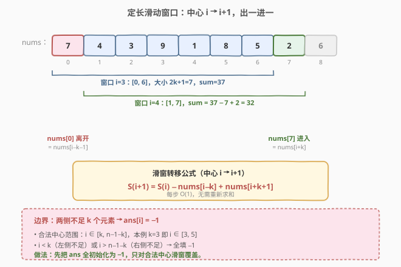
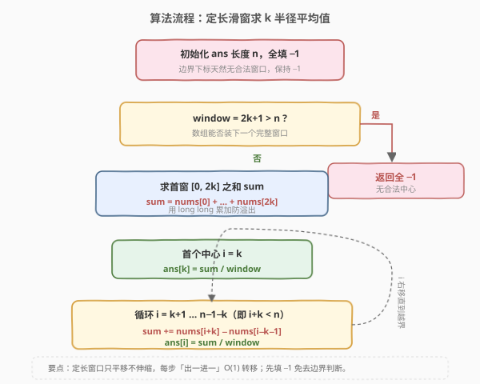
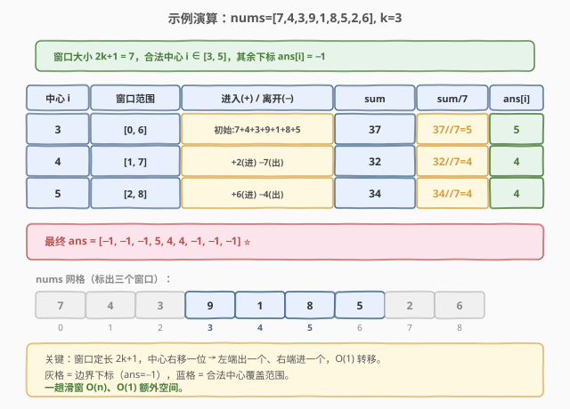

# 半径为k的子数组平均值

- **题目名称**：半径为k的子数组平均值
- **链接**：[2090. 半径为 k 的子数组平均值](https://leetcode.cn/problems/k-radius-subarray-averages/)
- **难度**：中等
- **标签**：数组、滑动窗口、前缀和

## 1. 题目概述

给你一个下标从 **0** 开始的数组 `nums`，数组中有 `n` 个整数，另给你一个整数 `k`。

**k 半径平均值** 是指：`nums` 中以下标 `i` 为中心、半径为 `k` 的子数组的平均值，即下标范围 $[i - k, i + k]$ 内所有元素的平均值。若下标 `i` 的左右两侧没有足够的元素（即 $i < k$ 或 $i > n - 1 - k$），则其 k 半径平均值为 `-1`。

返回一个长度为 `n` 的数组 `avgs`，其中 `avgs[i]` 是下标 `i` 处的 k 半径平均值。

> 💡 **平均值的约定**：本题的平均值用「向下取整的整数除法」计算，即 $\lfloor \text{sum} / (2k+1) \rfloor$。

**示例 1**：

```text
输入：nums = [7,4,3,9,1,8,5,2,6], k = 3
输出：[-1,-1,-1,5,4,4,-1,-1,-1]
解释：
- 窗口大小 2k+1 = 7。
- i=3：子数组 nums[0..6] = [7,4,3,9,1,8,5]，和=37，avg=37/7=5。
- i=4：子数组 nums[1..7] = [4,3,9,1,8,5,2]，和=32，avg=32/7=4。
- i=5：子数组 nums[2..8] = [3,9,1,8,5,2,6]，和=34，avg=34/7=4。
- 其余下标左右元素不足 3 个，均为 -1。
```

**示例 2**：

```text
输入：nums = [100000], k = 0
输出：[100000]
解释：窗口大小 2·0+1 = 1，每个下标的平均值就是 nums[i] 本身。
```

**示例 3**：

```text
输入：nums = [8], k = 100000
输出：[-1]
解释：窗口大小 2·100000+1 = 200001 远大于数组长度 1，无合法中心，返回 -1。
```

**约束条件**：

- $n = \text{nums.length}$
- $1 \le n \le 10^5$
- $1 \le \text{nums[i]} \le 10^5$
- $0 \le k$

> ⚠️ **溢出提醒**：窗口最大长度 $2k+1$ 可达 $2 \times 10^5 + 1$，每个元素最大 $10^5$，窗口和最大约 $2 \times 10^{10}$，**远超 32 位 `int` 上界**（约 $2.1 \times 10^9$）。C++ 必须用 `long long` 累加，Python 整数无上限可不管。

---

## 2. 解题思路

### 2.1 暴力思路

对每个下标 `i`，若 $i \in [k, n-1-k]$，则遍历 `nums[i-k..i+k]` 求和再除以 $2k+1$；否则置 `-1`。每个合法中心都要 $O(k)$ 求和，整体最坏 $O(n \cdot k)$，当 $k \approx n/2$ 时退化为 $O(n^2)$，$n = 10^5$ 必然超时。

### 2.2 核心观察：定长窗口 → 滑动窗口



关键观察：所有合法中心的窗口**长度固定为 $2k+1$**，且中心每右移一位，窗口整体也右移一位——左端退出一个元素、右端进入一个元素。这就是**定长滑动窗口**：

- 窗口 $[i-k, i+k]$ 的和记为 $S_i$；
- 中心从 $i$ 移到 $i+1$ 时，窗口变为 $[i+1-k, i+1+k]$，于是

$$S_{i+1} = S_i - \text{nums}[i - k] + \text{nums}[i + k + 1]$$

即「**减去刚离开的左端、加上刚进入的右端**」，一步 $O(1)$ 即可由旧和推出新和。

> 💡 **与 [209. 长度最小的子数组](../0201-0300/209_长度最小的子数组.md) 的对比**：209 是「**变长**滑动窗口」，靠双指针根据单调性伸缩窗口求最短；本题是「**定长**滑动窗口」，窗口大小恒为 $2k+1$，只需平移——比 209 更简单，连 `while` 收缩都不需要，每步固定「出一进一」。

> ⚠️ **先填 `-1` 再覆盖**：边界下标（$i < k$ 或 $i > n-1-k$）天然无合法窗口。先把整个 `ans` 初始化为 `-1`，再只对合法中心范围 $[k, n-1-k]$ 滑窗填值，避免逐个判断边界。

### 2.3 算法流程图



维护变量：

- `window = 2k + 1`：定长窗口大小；
- `sum`：当前窗口内元素之和（用 `long long`）；
- `ans`：长度为 `n`、初值全 `-1` 的答案数组。

**流程**：

1. 若 `window > n`，整个数组装不下一个完整窗口，直接返回全 `-1` 的 `ans`。
2. 计算首个合法窗口 $[0, 2k]$ 的和：`sum = nums[0] + ... + nums[2k]`。
3. 中心 `i = k` 时，`ans[k] = sum / window`。
4. **循环** `i` 从 `k+1` 到 `n-1-k`（即 `i + k < n`）：
   - `sum += nums[i + k] - nums[i - k - 1]`（进右出左）；
   - `ans[i] = sum / window`。
5. 返回 `ans`。

> ⚠️ **下标核对**：中心 `i` 的右端是 `i + k`，上一个窗口的左端是 `i - k - 1`。循环条件 `i + k < n` 保证右端不越界；起始 `i = k+1` 时左端 `i - k - 1 = 0` 恰为上一窗口的最左元素，安全。

### 2.4 示例演算

以 `nums = [7,4,3,9,1,8,5,2,6], k = 3` 为例（窗口大小 $7$）：



| 中心 i | 窗口范围 | 进入(+)/离开(−) | sum | avg = sum/7 | ans[i] |
|--------|---------|------------------|-----|-------------|--------|
| 3 | [0, 6] | 初始：7+4+3+9+1+8+5 | 37 | 5 | 5 |
| 4 | [1, 7] | +2(进) −7(出) | 32 | 4 | 4 |
| 5 | [2, 8] | +6(进) −4(出) | 34 | 4 | 4 |

其余下标 `i ∈ {0,1,2,6,7,8}` 因两侧不足 `k=3` 个元素，`ans[i] = -1`。最终输出 `[-1,-1,-1,5,4,4,-1,-1,-1]`，与示例一致。

---

## 3. 参考代码

### C++

```cpp
class Solution {
  public:
    vector<int> getAverages(vector<int>& nums, int k) {
        int n = nums.size();
        vector<int> ans(n, -1);
        int window = 2 * k + 1;
        if (window > n) return ans;                 // 装不下一个完整窗口
        long long sum = 0;
        for (int i = 0; i < window; ++i) sum += nums[i];   // 首个窗口 [0, 2k]
        ans[k] = sum / window;                      // 中心 i = k
        for (int i = k + 1; i + k < n; ++i) {
            sum += nums[i + k] - nums[i - k - 1];   // 进右出左
            ans[i] = sum / window;
        }
        return ans;
    }
};
```

### Python

```python
class Solution:
    def getAverages(self, nums: List[int], k: int) -> List[int]:
        n = len(nums)
        ans = [-1] * n
        window = 2 * k + 1
        if window > n:
            return ans
        s = sum(nums[:window])                      # 首个窗口 [0, 2k]
        ans[k] = s // window
        for i in range(k + 1, n - k):
            s += nums[i + k] - nums[i - k - 1]      # 进右出左
            ans[i] = s // window
        return ans
```

> 💡 **Python 循环边界**：`range(k + 1, n - k)` 等价于 `i + k < n` 且 `i` 从 `k+1` 起步，与 C++ 的 `for` 条件完全一致。`n - k` 是合法中心的**开区间的右端**（不含），即最后一个合法中心是 `n - 1 - k`。

---

## 4. 复杂度分析

| 维度 | 复杂度 | 说明 |
|------|--------|------|
| 时间复杂度 | $O(n)$ | 首窗求和 $O(2k+1)$，滑窗每步 $O(1)$，共 $n - 2k$ 步；总体每个元素至多被进出窗口各一次，线性 |
| 空间复杂度 | $O(1)$ | 仅用 `sum`/`window` 等几个变量；输出数组 `ans` 不计入额外空间 |

> 💡 本题时间已是下界——至少要读一遍 `nums` 才能给出所有平均值，$O(n)$ 无法再优。

---

## 5. 扩展：前缀和 + 区间求和

定长窗口求和本质是「**区间和**」问题，自然可用前缀和 $O(1)$ 查询。定义 `prefix[i]` 为 `nums[0..i-1]` 之和（`prefix[0] = 0`），则中心 `i` 的窗口和为：

$$\text{sum}_i = \text{prefix}[i + k + 1] - \text{prefix}[i - k]$$

```cpp
vector<int> getAverages(vector<int>& nums, int k) {
    int n = nums.size();
    vector<int> ans(n, -1);
    vector<long long> p(n + 1, 0);
    for (int i = 0; i < n; ++i) p[i + 1] = p[i] + nums[i];
    int window = 2 * k + 1;
    for (int i = k; i + k < n; ++i) {
        ans[i] = (p[i + k + 1] - p[i - k]) / window;
    }
    return ans;
}
```

> 💡 **两种解法对比**：前缀和版写法更对称（每个中心独立查询，无需维护滑窗状态），但多 $O(n)$ 额外空间存 `prefix`；滑动窗口版空间 $O(1)$，且常数更小（一次遍历、无第二次扫描）。本题 $n \le 10^5$ 两种都能过，面试中**优先讲滑动窗口**展示「定长窗口无需伸缩」的洞察，再用前缀和作为对照。

---

## 6. 面试要点

1. **为什么用定长滑动窗口而不是双指针伸缩？**
   - 本题窗口大小恒为 $2k+1$，不存在「伸缩」的需求——中心每右移一位，窗口恰好整体右移一位，固定「出一进一」。双指针伸缩（如 209）是为「变长窗口求最值」设计的，本题用不上收缩逻辑，反而徒增复杂度。

2. **窗口和为什么必须用 `long long`？**
   - 窗口最大 $2 \times 10^5 + 1$ 个元素，每个最大 $10^5$，和可达约 $2 \times 10^{10}$，远超 32 位 `int`（约 $2.1 \times 10^9$）。用 `int` 累加会溢出得到错误平均值。Python 整数无限精度无此问题。

3. **滑窗转移公式 `nums[i+k] - nums[i-k-1]` 的下标怎么推出来的？**
   - 中心 `i` 的窗口是 $[i-k, i+k]$。中心变 `i+1` 时窗口变为 $[i+1-k, i+1+k]$：新进入的右端是 `nums[i+1+k]`（即当前 `i` 循环里的 `nums[i+k]`），刚离开的左端是 `nums[i-k]`（即上一窗口最左端，对当前 `i` 而言是 `nums[i-k-1]`）。两者下标差恰好为窗口长度。

4. **`k = 0` 时算法是否正确？**
   - `window = 1`，首窗 `sum = nums[0]`，`ans[0] = nums[0]/1 = nums[0]`；循环 `i` 从 `1` 到 `n-1`，每步 `sum += nums[i] - nums[i-1] = nums[i]`，`ans[i] = nums[i]`。每个下标都是合法中心，输出即原数组，与示例 2 一致。

5. **先填 `-1` 再覆盖 vs 逐个判断边界，哪个更好？**
   - 先填 `-1` 再只对 $[k, n-1-k]$ 覆盖，代码更简洁且无分支——边界天然保持 `-1`。逐个判断需在每个下标前 `if (i < k || i > n-1-k)`，分支更多、可读性差。两者复杂度相同，前者更优雅。

---

## 7. 同类练习题

- [209. 长度最小的子数组](https://leetcode.cn/problems/minimum-size-subarray-sum/)（[题解](../0201-0300/209_长度最小的子数组.md)）：变长滑动窗口求最短，对比本题的定长窗口，理解「伸缩」与「平移」的差异
- [346. 数据流中的移动平均值](https://leetcode.cn/problems/moving-average-from-data-stream/)：定长窗口求平均的在线流式版，窗口大小固定、新数据进旧数据出，与本题滑窗转移同构
- [643. 子数组最大平均数 I](https://leetcode.cn/problems/maximum-average-subarray-i/)：定长滑动窗口求最大平均值，窗口转移逻辑完全相同，只把「填每个位置」改为「维护最大值」
- [239. 滑动窗口最大值](https://leetcode.cn/problems/sliding-window-maximum/)（[题解](../0201-0300/239_滑动窗口最大值.md)）：定长窗口但求最大值，需单调队列维护，对照本题求和只需 $O(1)$ 转移的简单性
- [528. 按权重随机选择](https://leetcode.cn/problems/random-pick-with-weight/)（[题解](../0901-1000/528_按权重随机选择.md)）：前缀和 + 二分区间查询，对照本题前缀和版的区间和应用
