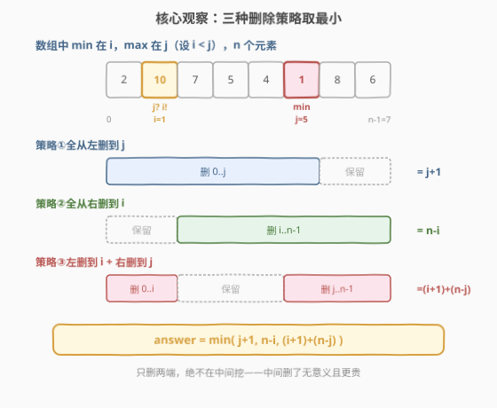
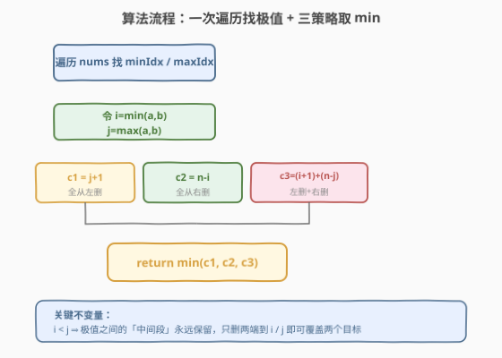
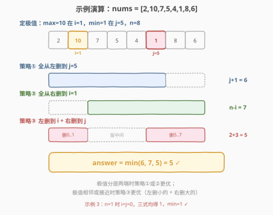

# 从数组中移除最大值和最小值

- **题目名称**：从数组中移除最大值和最小值
- **链接**：[2091. 从数组中移除最大值和最小值](https://leetcode.cn/problems/removing-minimum-and-maximum-from-array/)
- **难度**：中等
- **标签**：数组、贪心、数学

## 1. 题目概述

给定一个下标从 `0` 开始的数组 `nums`，数组由若干**互不相同**的整数组成。数组中存在唯一的最小值和唯一的最大值，目标是从数组中**移除这两个元素**。

一次**删除**操作定义为：从数组的**前面**移除一个元素，或从数组的**后面**移除一个元素。返回将最小值和最大值**都**移除所需的最小删除次数。

**示例 1**：

```text
输入：nums = [2,10,7,5,4,1,8,6]
输出：5
解释：最小元素是 nums[5] = 1，最大元素是 nums[1] = 10。
     从前面移除 2 个元素（删到 10），从后面移除 3 个元素（删到 1），共 2 + 3 = 5。
```

**示例 2**：

```text
输入：nums = [0,-4,19,1,8,-2,-3,5]
输出：3
解释：最小元素是 nums[1] = -4，最大元素是 nums[2] = 19。
     从前面移除 3 个元素即可同时删掉两者，共 3。
```

**示例 3**：

```text
输入：nums = [101]
输出：1
解释：唯一元素既是最大值又是最小值，删 1 次即可。
```

**约束条件**：

- $1 \leq \text{nums.length} \leq 10^5$
- $-10^5 \leq \text{nums}[i] \leq 10^5$
- `nums` 中的整数**互不相同**

> 💡 **审题关键**：① 只能从**两端**删除，不能从中间挖——这意味着任何删除方案都是「前缀删一段 + 后缀删一段」；② 只需删掉**两个**特定元素（min 和 max），其余元素删多删少无所谓，但要**最小化总删除数**；③ 元素互不相同 ⇒ min 与 max 各有唯一下标，且当 $n=1$ 时二者重合。

---

## 2. 解题思路

### 2.1 暴力思路：枚举两个删除端点

最朴素的念头：删前缀 $[0, a]$ 和后缀 $[b, n-1]$，枚举所有 $a, b$ 组合，检查 min、max 是否都被覆盖，取最小 $a+1 + n-b$。两重循环 $O(n^2)$，能出结果但完全没利用「只需删两个元素」这一结构——绝大多数枚举都是无意义的。

稍进一步会意识到：**前缀只需删到「能覆盖某个极值」为止，后缀只需删到「能覆盖另一个极值」为止**。设 min 下标为 $a$、max 下标为 $b$（先不区分大小），则任何可行方案必然满足「前缀删到 $\geq \min(a,b)$ 或后缀删到 $\leq \min(a,b)$」**且**「前缀删到 $\geq \max(a,b)$ 或后缀删到 $\leq \max(a,b)$」。把这两个约束的组合列出来，恰好只有**三种**非劣策略。

### 2.2 核心观察：三种删除策略取最小



设 min 与 max 的下标分别为 $a$、$b$，令 $i = \min(a, b)$、$j = \max(a, b)$，即 $i < j$（$n=1$ 时 $i=j=0$ 单独处理或直接代入公式也成立）。由于**只能从两端删**，要同时覆盖 $i$ 和 $j$ 两个下标，删除的前缀端点 $L$ 与后缀端点 $R$ 必须满足：

- $i$ 被删 ⇔ $i \leq L$ 或 $i \geq R$；
- $j$ 被删 ⇔ $j \leq L$ 或 $j \geq R$。

把两个目标的覆盖方式两两组合，剔除「前缀删到 $j$ 就已经顺带删了 $i$」这类被支配的冗余方案后，**只有三种互不包含的非劣策略**：

| 策略 | 操作 | 删除次数 | 适用情形 |
|------|------|----------|----------|
| ① 全从左删 | 前缀删到 $j$（覆盖 $i, j$） | $j + 1$ | 极值都靠近左端 |
| ② 全从右删 | 后缀删到 $i$（覆盖 $i, j$） | $n - i$ | 极值都靠近右端 |
| ③ 左删 + 右删 | 前缀删到 $i$ + 后缀删到 $j$ | $(i+1) + (n-j)$ | 极值分居两端 |

> ⚠️ **为什么没有「前缀删到 $i$ + 后缀删到 $i$」之类？** 因为只删到 $i$ 不能覆盖 $j$（$j > i$）。要覆盖 $j$，前缀必须删到 $\geq j$（即策略①），或后缀必须删到 $\leq j$。若后缀删到 $\leq j$，则 $j$ 被覆盖；要让 $i$ 也被覆盖，后缀需进一步删到 $\leq i$（退化成策略②，前缀那段白删），或前缀补删到 $\geq i$（即策略③）。三策略已穷尽所有非劣组合。

$$\boxed{\text{answer} = \min\big(\, j+1,\ \ n-i,\ \ (i+1)+(n-j)\,\big)}$$

> 💡 **直觉理解**：极值把数组分成了「左段 $[0, i]$」「中段 $[i, j]$」「右段 $[j, n-1]$」。中段是两个极值之间的部分，**删中段毫无意义**（既不帮助覆盖 $i$ 也不帮助覆盖 $j$，反而增加删除数）。所以只需在「删左段」「删右段」「删左段+删右段」中选最省的——分别对应策略②、策略①、策略③。

### 2.3 算法流程图



**完整步骤**：

1. **一次遍历**找最小值下标 `a` 与最大值下标 `b`（元素互不相同，无需处理并列）。
2. 令 `i = min(a, b)`，`j = max(a, b)`，保证 `i <= j`。
3. 计算三种代价：`c1 = j + 1`、`c2 = n - i`、`c3 = (i + 1) + (n - j)`。
4. **返回** `min(c1, c2, c3)`。

> ⚠️ **$n=1$ 边界**：此时 $a = b = 0$，$i = j = 0$，三式分别为 $c_1 = 1$、$c_2 = 1 - 0 = 1$、$c_3 = 1 + (1 - 0) = 2$（注意 $n-j = 1$），$\min = 1$，与示例 3 一致。无需特判，公式自然覆盖。

### 2.4 示例演算

以 `nums = [2,10,7,5,4,1,8,6]`（$n=8$）为例：



一次遍历得 $a = 5$（min=1）、$b = 1$（max=10），故 $i = 1$、$j = 5$。

| 策略 | 计算 | 代价 |
|------|------|------|
| ① 全从左删到 $j=5$ | $j+1 = 6$ | 6 |
| ② 全从右删到 $i=1$ | $n-i = 8-1 = 7$ | 7 |
| ③ 左删到 $i=1$ + 右删到 $j=5$ | $(i+1)+(n-j) = 2+3 = 5$ | **5** |

$\text{answer} = \min(6, 7, 5) = 5$ ✓

> 💡 **对照示例 2** `nums = [0,-4,19,1,8,-2,-3,5]`：$a=1$（min=-4）、$b=2$（max=19），$i=1, j=2, n=8$。$c_1 = 3$、$c_2 = 7$、$c_3 = 2+6 = 8$，$\min = 3$ ✓。两极值相邻且靠左，策略①（全从左删）最优。可见**极值越聚拢于一端，单侧删除越划算；极值越分居两端，双侧夹击越划算**。

---

## 3. 参考代码

### C++

```cpp
class Solution {
public:
    int minimumDeletions(vector<int>& nums) {
        int n = nums.size();
        int a = 0, b = 0;
        for (int i = 1; i < n; ++i) {
            if (nums[i] < nums[a]) a = i;
            if (nums[i] > nums[b]) b = i;
        }
        int i = min(a, b), j = max(a, b);
        int c1 = j + 1;
        int c2 = n - i;
        int c3 = (i + 1) + (n - j);
        return min({c1, c2, c3});
    }
};
```

### Python

```python
class Solution:
    def minimumDeletions(self, nums: list[int]) -> int:
        a = nums.index(min(nums))
        b = nums.index(max(nums))
        i, j = min(a, b), max(a, b)
        n = len(nums)
        c1 = j + 1
        c2 = n - i
        c3 = (i + 1) + (n - j)
        return min(c1, c2, c3)
```

> 💡 **写法要点**：① 一次遍历同时维护 `a`、`b` 两个极值下标，避免 `min`/`max` + `index` 各扫一遍（Python 版为简洁用了内置函数，三次扫描常数略大但 $O(n)$ 不变）；② `i, j` 的归一化（小者记 `i`、大者记 `j`）是三策略公式正确的前提，不可省；③ `min({c1, c2, c3})` 用初始化列表语法，比嵌套 `min` 更清爽。

> ⚠️ **边界**：`n=1` 时循环不执行，`a=b=0`，`i=j=0`，三式得 `1, 1, 2`，返回 `1`，与示例 3 一致；`n=2` 时 `i=0, j=1`，三式得 `2, 2, 2`，返回 `2`（两个都要删，只能整体删完），亦正确。无需任何特判。

---

## 4. 复杂度分析

| 维度 | 复杂度 | 说明 |
|------|--------|------|
| 时间复杂度 | $O(n)$ | 一次遍历找极值下标，三策略代价 $O(1)$ 计算 |
| 空间复杂度 | $O(1)$ | 仅 `a, b, i, j, c1, c2, c3` 等标量 |

> 💡 本题 $n \leq 10^5$，$O(n)$ 轻松通过。瓶颈在「找两个极值下标」这一步，无法低于 $O(n)$（毕竟要看遍每个元素才知道谁最大谁最小）；三策略的 $O(1)$ 计算是把「枚举所有删法」压缩到「只算三种非劣删法」的体现——这是**贪心剪枝**：用结构性论证剔除所有被支配的方案，只保留 Pareto 前沿。

---

## 5. 扩展：若要删除的元素多于两个

假设题目改为「移除数组中最大的 $k$ 个元素」，策略会怎样演变？

- $k=2$（本题）：极值下标把数组分三段，三策略取 min。
- $k=3$：三个目标下标把数组分四段，需枚举「前缀删到第几个目标 + 后缀删到第几个目标」的组合，共 $O(k^2)$ 种策略取 min。
- 一般地，对 $k$ 个目标下标排序后，前缀删到第 $t$ 个、后缀删到第 $t+1$ 个（$t$ 从 $0$ 到 $k$），代价 $\text{idx}_t + (n - \text{idx}_{t+1})$（端点用哨兵 $0$ 和 $n$），$O(k)$ 种策略取 min，整体 $O(n + k\log k)$。

> 💡 本质是：**目标下标把数组切成若干段，删前缀和删后缀的「分界点」只能在目标下标处取值**——这是「只删两端」约束的几何性质决定的。本题 $k=2$ 正是该通用框架的最简实例。

---

## 6. 面试要点

**Q1：为什么只需考虑三种策略？其他删法为什么不用算？**

> 设 $i<j$ 为两极值下标。任何「前缀删 $[0,L]$ + 后缀删 $[R,n-1]$」的可行方案，必须让 $i,j$ 都落在被删区域。按 $i,j$ 各自由「前缀覆盖」还是「后缀覆盖」分四类组合，其中「$i,j$ 都由前缀覆盖」⇒ $L \geq j$ ⇒ 退化成策略①（前缀删到 $j$ 最省）；「都由后缀覆盖」⇒ $R \leq i$ ⇒ 策略②；「$i$ 由前缀、$j$ 由后缀」⇒ 策略③；「$i$ 由后缀、$j$ 由前缀」要求 $R \leq i < j \leq L$，即前后缀相交、删完整个数组，必劣于前三者。故仅三策略非劣。

**Q2：$i, j$ 为什么要先排序成 $i < j$？**

> 三策略公式 `j+1`、`n-i`、`(i+1)+(n-j)` 都假设 $i$ 是较小下标、$j$ 是较大下标。若不排序直接用原始 $a, b$，策略③会写成 `(a+1)+(n-b)`，当 $a > b$ 时含义错乱（变成「左删到 max + 右删到 min」，删的范围互相包含）。归一化为 `i=min, j=max` 后公式统一、不易写错。

**Q3：为什么「删中间段」一定不优？**

> 中间段 $[i, j]$ 位于两个目标之间，删它既不帮助覆盖 $i$（$i$ 在中间段左端，要覆盖 $i$ 得靠前缀删到 $i$ 或后缀删到 $i$），也不帮助覆盖 $j$。删中间段只会徒增删除次数而不改变两个目标的覆盖状态，故任何含「中段删除」的方案都能通过去掉中段删除得到更优解——中段删除是被支配的。

**Q4：$n=1$ 时公式会不会出错？**

> 不会。$n=1$ 时 $a=b=0$，$i=j=0$，$c_1 = 0+1 = 1$、$c_2 = 1-0 = 1$、$c_3 = (0+1)+(1-0) = 2$，$\min = 1$，正确。关键是 $n-j = 1-0 = 1$（不是 $0$），因为「后缀删到下标 $j$」意为删除下标 $j$ 到 $n-1$ 共 $n-j$ 个元素。无需特判单元素。

**Q5：能否用一次遍历同时完成「找极值 + 算答案」？**

> 可以但不必要。找极值必须遍历完整个数组才能确定（最值可能在末尾），而算答案只需 $O(1)$，所以「先遍历找极值、再 $O(1)$ 算答案」已是 $O(n)$ 最优。若强行在遍历中维护「当前 min/max 下标」并实时更新答案，反而要处理「极值尚未出现完整」的中间状态，徒增复杂度且无渐进收益。面试中清晰分两步更易讲清。

> 💡 **一句话总结**：找 min/max 下标 $a, b$，令 $i=\min(a,b), j=\max(a,b)$，答案 $= \min(j+1,\ n-i,\ (i+1)+(n-j))$。$O(n)$ 时间、$O(1)$ 空间，无需特判。

---

## 7. 同类练习题

- [2012. 数组美丽值求和](https://leetcode.cn/problems/sum-of-beauty-in-the-array/)：数组下标与极值关系的另一应用——按位置前后缀极值判定美丽值，同属「一次遍历找极值 + 位置分类」思路
- [2037. 使每位学生都有座位的最少移动次数](https://leetcode.cn/problems/minimum-number-of-moves-to-seat-everyone/)：排序后配对求最小移动次数——贪心取最优配对，与本题「三策略取 min」同为「枚举有限非劣方案取最优」的贪心范式
- [209. 长度最小的子数组](https://leetcode.cn/problems/minimum-size-subarray-sum/)（[站内题解](../0201-0300/209_长度最小的子数组.md)）：在数组上求最小操作数，对照「双端操作 vs 区间操作」的不同建模角度
- [2903. 找出满足差值条件的下标](https://leetcode.cn/problems/find-indices-with-index-and-value-difference/)：在数组中按下标与值的约束找极值下标对——同为「极值下标 + 位置关系」的数组题，体会「最值决定可行性」的套路
