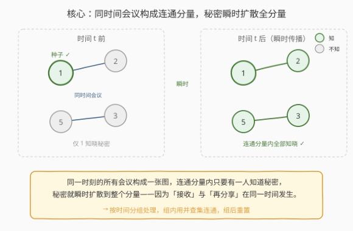
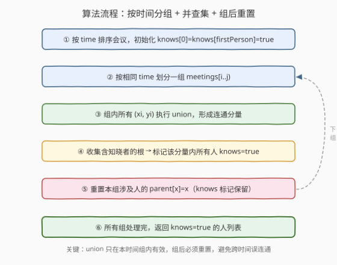
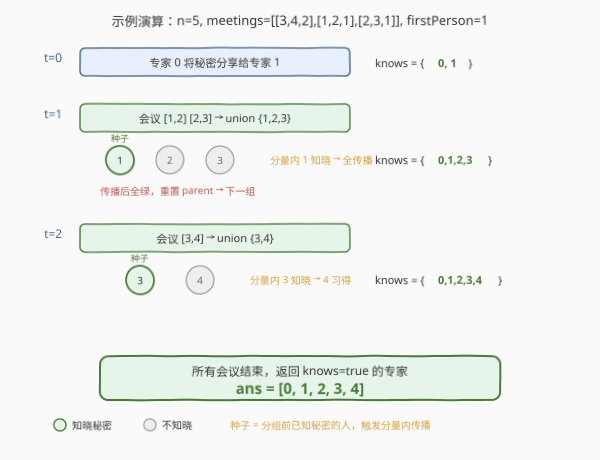

# 找出知晓秘密的所有专家

- **题目名称**：找出知晓秘密的所有专家
- **链接**：[2092. 找出知晓秘密的所有专家](https://leetcode.cn/problems/find-all-people-with-secret/)
- **难度**：困难
- **标签**：并查集、图、排序、广度优先搜索

## 1. 题目概述

有 `n` 个专家编号 `0` 到 `n-1`。专家 `0` 持有一个秘密，在时间 `0` 分享给专家 `firstPerson`。之后每场会议 `meetings[i] = [xi, yi, timei]` 中，若**一方知晓秘密**则**瞬时**分享给另一方。秘密共享是**瞬时发生**的——同一时刻一个专家不仅能接收秘密，还能在其他同时间会议里继续传播。返回最终所有知晓秘密的专家。

**示例 1**：

```text
输入：n = 6, meetings = [[1,2,5],[2,3,8],[1,5,10]], firstPerson = 1
输出：[0,1,2,3,5]
解释：t=0 → 0 告诉 1；t=5 → 1 告诉 2；t=8 → 2 告诉 3；t=10 → 1 告诉 5。
```

**示例 2**：

```text
输入：n = 4, meetings = [[3,1,3],[1,2,2],[0,3,3]], firstPerson = 3
输出：[0,1,3]
解释：t=2 会议 [1,2] 双方都不知晓，无事发生；t=3 会议 [3,1] [0,3] 把 0、1、3 连通，3 已知晓 → 0、1 习得。专家 2 始终不知。
```

**示例 3**：

```text
输入：n = 5, meetings = [[3,4,2],[1,2,1],[2,3,1]], firstPerson = 1
输出：[0,1,2,3,4]
解释：t=1 会议 [1,2] [2,3] 同时间发生，1 知晓 → 经 2 传到 3（2 接收后同时间再分享）；t=2 → 3 告诉 4。
```

**约束条件**：

- $2 \le n \le 10^5$
- $1 \le \text{meetings.length} \le 10^5$
- $0 \le xi, yi \le n-1$，$xi \ne yi$
- $1 \le timei \le 10^5$
- $1 \le firstPerson \le n-1$

> ⚠️ 本题最大的坑在「**同时间瞬时传播**」：同一时刻的多场会议不是孤立事件，而是一张**图**——秘密可在连通分量内跨会议连锁扩散。逐场独立处理会漏掉这种连锁。

---

## 2. 解题思路

### 2.1 暴力思路：按时间排序后逐场处理

最直觉的做法：把会议按 `time` 排序，然后逐场扫描——每场会议若一方知晓就把另一方标记为知晓。

```text
sort meetings by time
for each meeting [x, y, t]:
    if knows[x]: knows[y] = true
    if knows[y]: knows[x] = true
```

**这个做法是错的**。考虑示例 3 的 `t=1`：会议 `[1,2]` 和 `[2,3]`。若扫描顺序先 `[2,3]` 再 `[1,2]`：

- `[2,3]`：2、3 都不知晓 → 无事发生；
- `[1,2]`：1 知晓 → 2 习得，但 3 永远错过了（同一时刻的会议已处理完）。

正确结果应包含 3，但暴力法漏了。**根因**：同时间的会议应视为**同时发生**，知晓状态需在该时间组内**反复传播到不动点**，而非逐场单次判断。

> 💡 修复方向有二：① 对每个时间组反复扫描直到无变化（fixpoint），但单组最坏 $O(M^2)$；② **按时间分组，组内建图做 BFS/并查集**，一次性传播到整个连通分量——这才是正解。

### 2.2 核心观察：同时间会议 = 连通分量，秘密瞬时扩散



关键观察：**同一时刻的所有会议构成一张无向图**。秘密在该图上的传播规则是——若连通分量内有任意一人知晓，则**全分量瞬时知晓**（因为接收与再分享同时间发生，等价于分量内可达）。

于是算法分两层：

- **外层**：按 `time` 排序，相同时间的会议划为一组，**按时间递增逐组处理**。
- **内层**：对每组会议，用**并查集**把所有 $(xi, yi)$ 连通；然后找出哪些连通分量含有「已知晓者」（种子），把这些分量内的所有人标记为知晓。

> ⚠️ **并查集必须「组后重置」**：并查集的连通关系只在**当前时间组**内有效——跨时间不能保留。否则上一时间组把 A、B 连通了（但 B 没习得秘密），下一时间组 B 单独参会时会因残留的连通关系被误判。正确做法是**每组处理完后，把本组涉及的人的 `parent[x]` 重置为 `x`**，而 `knows` 标记保留——`knows` 是持久的（一旦知晓永远知晓），`parent` 是临时的（只服务于当前时间组）。

### 2.3 算法流程图



整体三步循环：**union 建连通 → 找种子根标记 → 重置 parent**。排序 $O(M \log M)$，并查集近似 $O(M \cdot \alpha(n))$，重置 $O(M)$。

### 2.4 示例演算

以示例 3 `n=5, meetings=[[3,4,2],[1,2,1],[2,3,1]], firstPerson=1` 为例：



**t=0**：`0` 把秘密告诉 `1`，`knows = {0, 1}`。

**t=1**（会议 `[1,2]`、`[2,3]` 一组）：

| 步骤 | 操作 | 结果 |
|------|------|------|
| union | `union(1,2)`、`union(2,3)` | 连通分量 $\{1,2,3\}$，根为 3 |
| 找种子根 | `knows[1]=true` → `secretRoots={find(1)=3}` | 种子根 = {3} |
| 标记 | `find(1)=3∈secretRoots`、`find(2)=3`、`find(3)=3` | `knows[2]=knows[3]=true` |
| 重置 | `parent[1]=1`、`parent[2]=2`、`parent[3]=3` | 清空本组连通，保留 `knows={0,1,2,3}` |

**t=2**（会议 `[3,4]` 一组）：`union(3,4)` → 分量 $\{3,4\}$；`knows[3]=true` → 种子根含 `find(3)`；标记 `knows[4]=true`；重置。最终 `knows={0,1,2,3,4}` ✅。

---

## 3. 参考代码

### C++

```cpp
class Solution {
  public:
    vector<int> parent;

    int find(int x) {
        while (parent[x] != x) {
            parent[x] = parent[parent[x]];   // 路径压缩
            x = parent[x];
        }
        return x;
    }

    vector<int> findAllPeople(int n, vector<vector<int>>& meetings,
                              int firstPerson) {
        parent.resize(n);
        iota(parent.begin(), parent.end(), 0);
        vector<bool> knows(n, false);
        knows[0] = knows[firstPerson] = true;

        sort(meetings.begin(), meetings.end(),
             [](const auto& a, const auto& b) { return a[2] < b[2]; });

        int m = meetings.size();
        for (int i = 0; i < m;) {
            int j = i;
            while (j < m && meetings[j][2] == meetings[i][2]) j++;

            // ① 组内 union
            for (int k = i; k < j; k++) {
                int ra = find(meetings[k][0]), rb = find(meetings[k][1]);
                if (ra != rb) parent[ra] = rb;
            }
            // ② 收集含知晓者的根
            unordered_set<int> secretRoots;
            for (int k = i; k < j; k++) {
                if (knows[meetings[k][0]]) secretRoots.insert(find(meetings[k][0]));
                if (knows[meetings[k][1]]) secretRoots.insert(find(meetings[k][1]));
            }
            // ③ 标记分量内所有人
            for (int k = i; k < j; k++) {
                if (secretRoots.count(find(meetings[k][0]))) knows[meetings[k][0]] = true;
                if (secretRoots.count(find(meetings[k][1]))) knows[meetings[k][1]] = true;
            }
            // ④ 重置本组涉及人的 parent（knows 保留）
            for (int k = i; k < j; k++) {
                parent[meetings[k][0]] = meetings[k][0];
                parent[meetings[k][1]] = meetings[k][1];
            }
            i = j;
        }

        vector<int> ans;
        for (int p = 0; p < n; p++)
            if (knows[p]) ans.push_back(p);
        return ans;
    }
};
```

### Python

```python
from typing import List

class Solution:
    def findAllPeople(self, n: int, meetings: List[List[int]],
                      firstPerson: int) -> List[int]:
        parent = list(range(n))
        knows = [False] * n
        knows[0] = knows[firstPerson] = True

        def find(x: int) -> int:
            while parent[x] != x:
                parent[x] = parent[parent[x]]   # 路径压缩
                x = parent[x]
            return x

        meetings.sort(key=lambda m: m[2])

        i = 0
        while i < len(meetings):
            j = i
            while j < len(meetings) and meetings[j][2] == meetings[i][2]:
                j += 1
            # ① 组内 union
            for k in range(i, j):
                ra, rb = find(meetings[k][0]), find(meetings[k][1])
                if ra != rb:
                    parent[ra] = rb
            # ② 收集含知晓者的根
            secret_roots = set()
            for k in range(i, j):
                if knows[meetings[k][0]]:
                    secret_roots.add(find(meetings[k][0]))
                if knows[meetings[k][1]]:
                    secret_roots.add(find(meetings[k][1]))
            # ③ 标记分量内所有人
            for k in range(i, j):
                if find(meetings[k][0]) in secret_roots:
                    knows[meetings[k][0]] = True
                if find(meetings[k][1]) in secret_roots:
                    knows[meetings[k][1]] = True
            # ④ 重置本组涉及人的 parent（knows 保留）
            for k in range(i, j):
                parent[meetings[k][0]] = meetings[k][0]
                parent[meetings[k][1]] = meetings[k][1]
            i = j

        return [p for p in range(n) if knows[p]]
```

> 💡 **重置为何安全**：本组的 union 只在「本组涉及的人」之间建立 parent 指针，未涉及的人 `parent[x]==x` 始终不变。重置时对每条会议的两个端点执行 `parent[x]=x`，覆盖了所有被改动过的人——无论他们在 union 树中是根还是叶，逐一归位即可，顺序无关。

---

## 4. 复杂度分析

| 维度 | 复杂度 | 说明 |
|------|--------|------|
| 时间复杂度 | $O(M \log M + M \cdot \alpha(n))$ | 排序 $O(M \log M)$；每个时间组内 union/find/标记/重置各扫一遍本组会议，并查集单次近似 $O(\alpha(n))$ |
| 空间复杂度 | $O(n + M)$ | `parent`、`knows` 各 $O(n)$；`secretRoots` 哈希集至多 $O(\text{本组人数})$，整体不超过 $O(M)$ |

> ⚠️ 严格地讲，`unordered_set` 单次操作均摊 $O(1)$ 但有哈希常数；若追求极致可用「标记数组 + 时间戳」替代 `secretRoots`，把标记根的空间降到 $O(n)$ 且常数更小。本题 $M \le 10^5$，哈希集完全够用。

---

## 5. 扩展：BFS 同时间连通块解法

不用并查集，对每个时间组**建邻接表 + 多源 BFS** 同样可行：把组内已知晓的人全部入队，BFS 遍历邻接表，访问到的节点全部标记知晓。逻辑更直观，无需重置。

```cpp
class Solution {
  public:
    vector<int> findAllPeople(int n, vector<vector<int>>& meetings,
                              int firstPerson) {
        vector<bool> knows(n, false);
        knows[0] = knows[firstPerson] = true;

        sort(meetings.begin(), meetings.end(),
             [](const auto& a, const auto& b) { return a[2] < b[2]; });

        int m = meetings.size();
        for (int i = 0; i < m;) {
            int j = i;
            while (j < m && meetings[j][2] == meetings[i][2]) j++;

            unordered_map<int, vector<int>> g;
            for (int k = i; k < j; k++) {
                int x = meetings[k][0], y = meetings[k][1];
                g[x].push_back(y);
                g[y].push_back(x);
            }
            // 多源 BFS：已知晓者作种子
            queue<int> q;
            unordered_set<int> vis;
            for (auto& [p, _] : g)
                if (knows[p]) { q.push(p); vis.insert(p); }
            while (!q.empty()) {
                int u = q.front(); q.pop();
                for (int v : g[u])
                    if (!vis.count(v)) {
                        knows[v] = true;
                        vis.insert(v);
                        q.push(v);
                    }
            }
            i = j;
        }

        vector<int> ans;
        for (int p = 0; p < n; p++)
            if (knows[p]) ans.push_back(p);
        return ans;
    }
};
```

**两种解法对比**：

| 维度 | 并查集 + 重置 | BFS 连通块 |
|------|--------------|-----------|
| 时间 | $O(M \log M + M\alpha)$ | $O(M \log M + M)$ |
| 空间 | $O(n + M)$（无额外图） | $O(n + M)$（需建邻接表） |
| 优雅度 | 重置是精巧技巧，易写错 | 直观，无状态残留 |
| 适用 | 适合需要连通关系判断的场景 | 适合纯传播问题 |

> 💡 并查集的「组后重置」是**有状态 DSU 的经典技巧**——用 DSU 做临时连通判断，用完即清，避免跨组污染。类似思想见 [1202. 交换字符串中的元素](https://leetcode.cn/problems/smallest-string-with-swaps/)（连通分量内任意排列）。

---

## 6. 面试要点

1. **为什么逐场会议处理是错的？**

   - 同一时刻的多场会议**同时发生**，知晓状态会在组内连锁传播。逐场单次判断无法覆盖「A→B→C」这种同时间多跳链——若先处理 B-C 再处理 A-B，C 就漏了。必须把同时间会议**成组处理**，让传播到达不动点。

2. **为什么并查集要「组后重置」？**

   - 并查集的连通关系只在**当前时间组**内有意义。若不重置，上一组把 A、B 连通（B 未习得秘密），下一组 B 单独参会时 `find(B)` 仍指向 A 的根，可能被误判为「与知晓者同分量」。重置 `parent[x]=x` 清空临时连通，而 `knows` 标记保留——因为「是否知晓」是持久的，连通关系是瞬时的。

3. **重置时为什么把每个端点直接设回自己就行，不用按树序自底向上？**

   - 本组的 union 只改动了「本组涉及的人」的 `parent` 指针。对每条会议的两个端点执行 `parent[x]=x`，就覆盖了所有被改动者。无论某人在 union 树中是根还是叶，直接归位即可——因为我们要的是「全部回到初始自环态」，不是「保持某棵子树结构」。

4. **secretRoots 为什么用集合存根而非直接存人？**

   - 同一连通分量可能有多人知晓（多个种子），但它们的 `find()` 指向**同一个根**。存根天然去重，避免对同一分量重复标记。标记阶段只需对每个涉及的人查 `find()` 是否落在 `secretRoots` 中，$O(1)$ 判定。

5. **BFS 解法和并查集解法各自的优势？**

   - BFS 更直观：建图、多源 BFS、访问到即知晓，无状态残留，不易写错。并查集更紧凑：无需建邻接表，原地 union/find/重置，常数更小，且「有状态 DSU 临时借用」是可迁移的面试技巧。两者复杂度同阶，按场景选取。

> 💡 **一句话总结**：按时间分组，组内用并查集连通——若某分量含知晓者则全分量习得，组后重置 parent 保留 knows。本质是**时间维度上的分层图传播** + **并查集临时连通判断**。

---

## 7. 同类练习题

- [547. 省份数量](https://leetcode.cn/problems/number-of-provinces/)：并查集基础模板，连通分量计数，本题 DSU 的母题
- [721. 账户合并](https://leetcode.cn/problems/accounts-merge/)：并查集 + 分组归并，同属一账户的邮箱 union 成分量，与本题「同组 union 后聚合」同源
- [1202. 交换字符串中的元素](https://leetcode.cn/problems/smallest-string-with-swaps/)：并查集连通分量内任意交换，体现「连通分量内信息自由流动」，与本题秘密传播同构
- [1631. 最小消耗路径](https://leetcode.cn/problems/path-with-minimum-effort/)：并查集按边权排序逐步连通，找「首次连通时刻」，对照本题按时间分组连通
- [399. 除法求值](https://leetcode.cn/problems/evaluate-division/)：带权并查集，连通分量内传递比值关系，DSU 进阶应用
