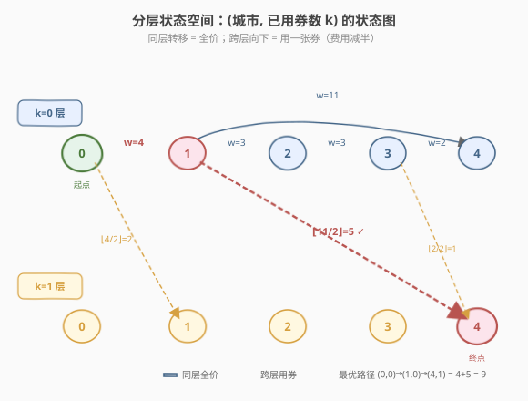
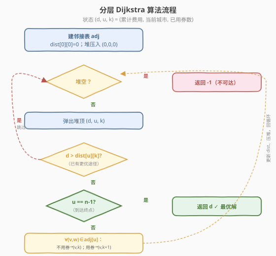
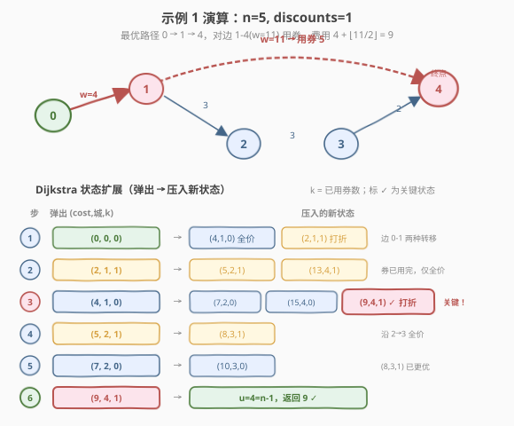

# LeetCode 前往目标城市的最小费用 题解

## 1. 题目概述

- **标题 / 题号**：前往目标城市的最小费用（#2093，medium）
- **链接**：https://leetcode.cn/problems/minimum-cost-to-reach-city-with-discounts/
- **难度**：中等
- **标签**：图、最短路径、Dijkstra、堆优先队列、分层状态

**题意**：有 $n$ 个城市（编号 $0$ 到 $n-1$），由若干双向高速公路连接。`highways[i] = [city1, city2, toll]` 表示一条连接 `city1` 与 `city2`、通行费为 `toll` 的高速公路。除 `highways` 中给出的公路外，城市间不连通。

你拥有 `discounts` 张**折扣券**：每张券可使**某一条**高速公路的通行费**减半**（向下取整）。**每条公路最多使用一张折扣券**（不能对同一条公路叠加多张）。求从城市 $0$ 到城市 $n-1$ 的**最小总费用**；若不可达返回 $-1$。

> 💡 **审题关键**：① 折扣券是**全局配额**（共 `discounts` 张），不是每条边一张；② 每条边**最多用一张**，但可以**不用**；③ 「在哪条边上花掉券」是决策变量——把贵的边打五折收益最大，但路径选择与券的分配**耦合**，不能分开贪心。

**示例 1**：

```text
输入：n = 5, highways = [[0,1,4],[2,1,3],[1,4,11],[3,2,3],[3,4,2]], discounts = 1
输出：9

最优路径：0 → 1 → 4，对边 1-4（toll=11）使用折扣，费用 = 4 + ⌊11/2⌋ = 4 + 5 = 9
（若不用券：4+11=15；若券花在 0-1 上：⌊4/2⌋+11 = 2+11 = 13）
```

**示例 2**：

```text
输入：n = 4, highways = [[1,3,17],[1,2,7],[3,2,5],[0,1,6],[3,0,20]], discounts = 20
输出：8

最优路径：0 → 1 → 2 → 3，三条边都用券：⌊6/2⌋ + ⌊7/2⌋ + ⌊5/2⌋ = 3 + 3 + 2 = 8
（券充足，等价于每条边都半价）
```

**示例 3**：

```text
输入：n = 4, highways = [[0,1,3],[2,3,2]], discounts = 0
输出：-1

城市 0、1 与城市 2、3 互不连通，无法从 0 到达 3
```

**约束**：

- $2 \le n \le 1000$
- $1 \le \text{highways.length} \le 1000$
- $0 \le \text{city1}_i, \text{city2}_i \le n - 1$，$\text{city1}_i \ne \text{city2}_i$
- $1 \le \text{toll}_i \le 10^5$
- $0 \le \text{discounts} \le 5$
- 无重复公路

> ⚠️ **关键量**：`discounts` 极小（$\le 5$），这是破题的钥匙——可把「已用券数」作为状态的一维，状态空间被控制在 $n \times (\text{discounts}+1) \le 6000$，Dijkstra 完全可行。

## 2. 解题思路

### 2.1 暴力思路：枚举每条边是否用券

对路径上每条边独立决定「用券/不用券」，在券总数 $\le \text{discounts}$ 的约束下取最小。若先枚举所有 $0 \to n-1$ 的路径，再对每条路径做背包选边分配券：

- 路径数量随图规模**指数爆炸**，$n = 1000$ 时完全不可行；
- 即便固定一条路径，路径长度可达 $n$，在长度上选 $\le 5$ 条边打五折也是组合枚举。

> ⚠️ 瓶颈在于「路径」与「券分配」耦合枚举。突破口是注意到 `discounts` 极小——把**已用券数**纳入 Dijkstra 的状态，让算法在搜索路径的同时自动决定券的分配。

### 2.2 核心观察：分层状态 (城市, 已用券数)



关键观察：**把 `(城市, 已用券数 k)` 作为一个联合状态**。状态图分 `discounts + 1` 层，第 $k$ 层表示「已用掉 $k$ 张券」。

从状态 $(u, k)$ 经边 $(u, v, w)$ 有**两种转移**：

1. **不使用券**（同层转移）：$(u, k) \to (v, k)$，费用增加 $w$；
2. **使用一张券**（向下一层）：$(u, k) \to (v, k+1)$，费用增加 $\lfloor w/2 \rfloor$，要求 $k < \text{discounts}$。

定义：

$$\text{dist}[v][k] = \text{从城市 0 出发、恰好用掉 k 张券到达城市 v 的最小费用}$$

- 状态空间：$n \times (\text{discounts}+1) \le 1000 \times 6 = 6000$，非常小。
- 所有转移费用非负（$w \ge 1$，$\lfloor w/2 \rfloor \ge 0$），Dijkstra 贪心成立。
- 答案 $= \min_{0 \le k \le \text{discounts}} \text{dist}[n-1][k]$。

> 💡 **为什么这样建模合法（每条边最多一张券）？** 在最优路径中**不会重复经过同一条边**——因为所有边权非负，绕回已走过的边只会增加费用。既然每条边在最优路径中至多出现一次，「用券/不用券」的二选一转移自然保证每条边最多消耗一张券。`discounts` 的全局配额由 $k$ 维统一计数，不会超额。

> 💡 **为什么 Dijkstra 第一次弹出 $n-1$ 即最优？** 状态图上所有边权非负，Dijkstra 按**总费用**从小到大弹出状态。第一次弹出任意 $(n-1, k)$ 时，其费用就是所有可达终点状态中的最小值——这正是 $\min_k \text{dist}[n-1][k]$。

### 2.3 算法流程：分层 Dijkstra



1. 建无向邻接表 `adj[u] = [(v, w), ...]`。
2. 维护 `dist[city][k]`：到达该状态的最小费用，初始化为 $\infty$；`dist[0][0] = 0`。
3. 最小堆存 `(费用, 城市, 已用券数)`，初始压入 `(0, 0, 0)`。
4. 循环弹出堆顶 `(d, u, k)`：
   - **剪枝**：若 `d > dist[u][k]`，已有更优途径到达此状态，跳过。
   - **终止**：若 `u == n - 1`，返回 `d`（Dijkstra 保证首次到达终点即最优）。
   - **扩展**：对每条边 `(u, v, w)`：
     - 不用券：若 `d + w < dist[v][k]`，更新并压入 `(d + w, v, k)`。
     - 用券（`k < discounts`）：若 `d + w/2 < dist[v][k+1]`，更新并压入 `(d + w/2, v, k+1)`。
5. 堆空仍未到达终点，返回 $-1$。

> ⚠️ **剪枝的必要性**：同一 `(城市, k)` 状态可能被多条路径压入堆，但只有费用最小的那次值得扩展。`dist` 数组负责去重，避免重复扩展导致复杂度退化。

### 2.4 示例演算

以示例 1 为例（`n=5, discounts=1`），图如下，展示 Dijkstra 的关键状态扩展：



| 步骤 | 弹出 `(cost, 城, k)` | 扩展产生的新状态 | 说明 |
|------|----------------------|------------------|------|
| 1 | `(0, 0, 0)` | `(4, 1, 0)` 全价；`(2, 1, 1)` 打折 | 起点 0，对边 0-1(w=4) 两种转移 |
| 2 | `(2, 1, 1)` | `(5, 2, 1)`、`(13, 4, 1)` | 已用 1 张券，后续只能全价 |
| 3 | `(4, 1, 0)` | `(7, 2, 0)`、`(15, 4, 0)`；**`(9, 4, 1)`** ✓ | 关键：到 4 全价 15，对边 1-4(w=11) 打折得 9 |
| 4 | `(5, 2, 1)` | `(8, 3, 1)` | 沿 2→3 全价扩展 |
| 5 | `(7, 2, 0)` | `(10, 3, 0)`；`(8, 3, 1)` 已更优跳过 | 也可对 2-3 打折但已被 step4 覆盖 |
| 6 | `(8, 3, 1)` | `(10, 4, 1)` 已更优跳过 | 到 4 全价 8+2=10 > 9，不更新 |
| 7 | **`(9, 4, 1)`** | — | **弹出 $n-1=4$，返回 9** |

> 💡 **关键瞬间**在第 3 步：从 `(4, 1, 0)` 出发，对边 `1-4 (w=11)` 走「用券」分支，费用 $4 + \lfloor 11/2 \rfloor = 9$，压入 `(9, 4, 1)`。第 7 步它成为堆顶被弹出，`u == 4 == n-1`，直接返回 9。这比「全程全价 15」和「把券花在 0-1 上得 13」都更优——Dijkstra 自动找到了**把券花在最贵边上**的方案。

## 3. 参考代码

### C++

```cpp
class Solution {
public:
    int minimumCost(int n, vector<vector<int>>& highways, int discounts) {
        // 邻接表
        vector<vector<pair<int,int>>> adj(n);
        for (auto& h : highways) {
            int u = h[0], v = h[1], w = h[2];
            adj[u].push_back({v, w});
            adj[v].push_back({u, w});
        }

        // dist[city][k] = 到达 city 且已用 k 张券的最小费用
        vector<vector<int>> dist(n, vector<int>(discounts + 1, INT_MAX));
        // 最小堆：(费用, 城市, 已用券数)
        priority_queue<tuple<int,int,int>, vector<tuple<int,int,int>>,
                       greater<>> pq;

        dist[0][0] = 0;
        pq.push({0, 0, 0});

        while (!pq.empty()) {
            auto [d, u, k] = pq.top(); pq.pop();
            // 剪枝：已有更优途径到达此状态
            if (d > dist[u][k]) continue;
            // 到达终点：Dijkstra 保证首次弹出即最优
            if (u == n - 1) return d;
            // 扩展邻居
            for (auto& [v, w] : adj[u]) {
                // 不用券
                if (d + w < dist[v][k]) {
                    dist[v][k] = d + w;
                    pq.push({d + w, v, k});
                }
                // 用券
                if (k < discounts && d + w / 2 < dist[v][k + 1]) {
                    dist[v][k + 1] = d + w / 2;
                    pq.push({d + w / 2, v, k + 1});
                }
            }
        }
        return -1;
    }
};
```

### Python

```python
class Solution:
    def minimumCost(self, n: int, highways: List[List[int]], discounts: int) -> int:
        adj = [[] for _ in range(n)]
        for u, v, w in highways:
            adj[u].append((v, w))
            adj[v].append((u, w))

        # dist[city][k] = 到达 city 且已用 k 张券的最小费用
        dist = [[float('inf')] * (discounts + 1) for _ in range(n)]
        dist[0][0] = 0
        import heapq
        heap = [(0, 0, 0)]  # (费用, 城市, 已用券数)

        while heap:
            d, u, k = heapq.heappop(heap)
            # 剪枝
            if d > dist[u][k]:
                continue
            # 到达终点
            if u == n - 1:
                return d
            # 扩展邻居
            for v, w in adj[u]:
                # 不用券
                if d + w < dist[v][k]:
                    dist[v][k] = d + w
                    heapq.heappush(heap, (d + w, v, k))
                # 用券
                if k < discounts and d + w // 2 < dist[v][k + 1]:
                    dist[v][k + 1] = d + w // 2
                    heapq.heappush(heap, (d + w // 2, v, k + 1))

        return -1
```

> 💡 **整数除法**：C++ 的 `w / 2` 与 Python 的 `w // 2` 对正整数都是向下取整，与题意「rounded down」一致。

> ⚠️ **`INT_MAX` 溢出**：C++ 中 `d + w` 在 `d` 已是 `INT_MAX` 时会溢出，但代码只在 `d` 被 Dijkstra 弹出（即 `d == dist[u][k] < INT_MAX`）时才扩展，因此 `d + w` 不会溢出。`w/2` 同理安全。

## 4. 复杂度分析

| 维度 | 复杂度 | 说明 |
|------|--------|------|
| 时间复杂度 | $O\big((\text{discounts}+1) \cdot E \cdot \log((\text{discounts}+1) \cdot n)\big)$ | 状态数 $\le n \times (\text{discounts}+1)$，每状态扩展 $\deg$ 条边各两个分支，堆操作 $\log$ 级 |
| 空间复杂度 | $O\big(n \cdot (\text{discounts}+1)\big) + O(E)$ | `dist` 二维数组 + 邻接表 + 堆 |

> 💡 **代入约束**：$\text{discounts} \le 5$，$E \le 1000$，$n \le 1000$，状态 $\le 6000$，时间约为 $6 \times 1000 \times \log 6000 \approx 7.8 \times 10^4$ 次操作，极快。`discounts` 维度极小是本题可用 Dijkstra 的根本原因。

## 5. 扩展：为什么不能对每条边独立贪心？

一个自然的错误想法是：「找到全价最短路，然后把它路径上最贵的 $\text{discounts}$ 条边打五折」。

**反例**：设 `discounts = 1`，起点 $0$、终点 $3$：

- 路径 A：$0 \to 3$，单条边 $w = 20$，全价 $20$，打五折后 $10$；
- 路径 B：$0 \to 1 \to 2 \to 3$，三条边 $w = 6, 7, 5$，全价 $18$，最贵边 $7$ 打五折后 $18 - 7 + 3 = 14$。

全价最短路是 B（$18 < 20$），但把券花在 B 上得 $14$；反而路径 A 打五折得 $10$ 更优。**全价最短路不等于带折扣的最短路**——券的分配会改变路径优劣关系，必须把「用券数」纳入状态联合搜索。

> 💡 这与 [1928. 规定时间内到达终点的最小花费](../1901-2000/1928_规定时间内到达终点的最小花费.md) 中「费用最优与时间最优冲突」、[787. K 站中转内最便宜的航班](../0701-0800/787_K站中转内最便宜的航班.md) 中「价格最优与边数最优冲突」是同一类思想——**当存在第二维约束/资源时，必须把它并入状态**，否则贪心锁定会错过真正最优解。

## 6. 面试要点

1. **为什么普通 Dijkstra（只维护 `dist[城市]`）不行？**

   > 因为「在某条边用券」会改变后续路径的优劣。全价最短路把券花在自己路径上未必最优——可能另一条全价更贵的路径，把券花在它的贵边上反而更省。必须把「已用券数」纳入状态，避免过早锁定。

2. **状态空间多大？为什么 `discounts` 要小？**

   > $n \times (\text{discounts}+1) \le 1000 \times 6 = 6000$。`discounts` 是题目给的破题关键：它极小（$\le 5$），才允许把「用券数」做状态维。若 `discounts` 很大（如 $10^9$），此建模失效，需另寻思路（如凸优化/二分）。

3. **Dijkstra 在状态图上为什么正确？**

   > 所有转移费用非负（$w \ge 1$，$w/2 \ge 0$），状态图无负权回路，Dijkstra 贪心成立。第一次弹出任意 $(n-1, k)$ 时，其费用即 $\min_k \text{dist}[n-1][k]$，可直接返回。

4. **「每条边最多一张券」的约束是如何满足的？**

   > 最优路径不会重复经过同一条边（边权非负，绕回只会增加费用），所以每条边在路径中至多出现一次。二选一转移（用/不用券）天然保证每条边最多消耗一张券，全局配额由 $k$ 维计数防止超额。

5. **`dist` 数组的作用？返回时机？**

   > `dist[city][k]` 去重剪枝，避免同一状态被重复扩展。返回时机是**首次弹出 $u = n-1$**，无需遍历所有 $k$ 取最小——Dijkstra 按费用递增弹出，首个终点状态即全局最优。

6. **和 787、1928 的异同？**

   > 三者都是「带资源约束的最短路」：787 约束**边数上限**（Bellman-Ford 按轮分层），1928 约束**时间上限**（Dijkstra 在 `(城市, 时间)` 上搜索），本题约束**折扣券配额**（Dijkstra 在 `(城市, 用券数)` 上搜索）。核心范式一致：**把约束维度并入状态**。

## 同类练习题

| # | 题目 | 与本题的关联 |
|---|------|-------------|
| 787 | [K 站中转内最便宜的航班](https://leetcode.cn/problems/cheapest-flights-within-k-stops/)（[题解](../0701-0800/787_K站中转内最便宜的航班.md)） | 带「边数上限」约束的最短路，Bellman-Ford 按轮分层——与本题「券配额」约束同构，对照理解两种资源维度的处理方式 |
| 1928 | [规定时间内到达终点的最小花费](https://leetcode.cn/problems/minimum-cost-to-reach-destination-in-time/)（[题解](../1901-2000/1928_规定时间内到达终点的最小花费.md)） | 带「时间上限」约束的最小费用，Dijkstra 在 `(城市, 时间)` 状态图搜索——同为分层状态 Dijkstra，对照 `discounts` 与 `maxTime` 两维的处理 |
| 743 | [网络延迟时间](https://leetcode.cn/problems/network-delay-time/)（[题解](../0701-0800/743_网络延迟时间.md)） | 堆优化 Dijkstra 单源最短路母题，无约束时的基础模板，本题在其上增加「用券数」分层 |
| 1514 | [概率最大的路径](https://leetcode.cn/problems/path-with-maximum-probability/) | Dijkstra 变体（最长路 / 乘积），展示 Dijkstra 状态定义与转移的灵活性 |
| 1631 | [最小体力消耗路径](https://leetcode.cn/problems/path-with-minimum-effort/) | Dijkstra 变体，按「路径最大边权」排序，体会 Dijkstra 状态/距离函数的多种设计 |
