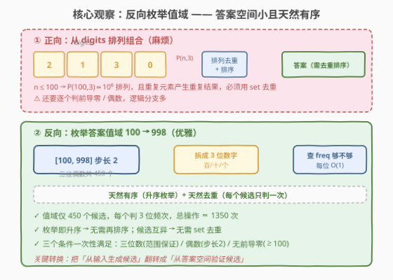
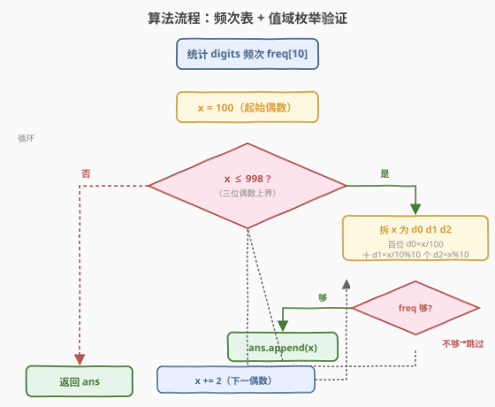
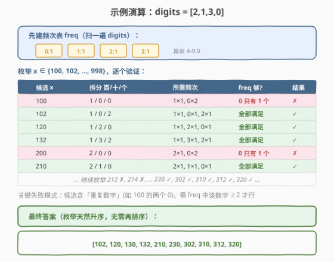

# LeetCode 找出 3 位偶数 题解

## 1. 题目概述

- **标题 / 题号**：找出 3 位偶数（#2094，easy）
- **链接**：https://leetcode.cn/problems/finding-3-digit-even-numbers/
- **难度**：简单
- **标签**：数组、哈希表、枚举、计数

**题意**：给定一个整数数组 `digits`，每个元素是 `0-9` 中的一个数字（**可能重复**）。要求找出**所有**满足下列条件且**互不相同**的整数：

1. 该整数由 `digits` 中的三个元素按**任意顺序**依次连接组成（即从 `digits` 中选三个元素拼成三位数，每个元素至多用其出现次数次）；
2. 该整数**不含前导零**；
3. 该整数是一个**偶数**。

将结果按**递增顺序**排列，以数组形式返回。

> 💡 **关键点**：①是「选三个元素拼数」而非「子序列」，元素可重复使用但次数受限于其在 `digits` 中的频次；②答案要**互不相同**且**升序**——这两点直接决定了最优解法的选择（见 2.2）。

**示例 1**：

```text
输入：digits = [2,1,3,0]
输出：[102,120,130,132,210,230,302,310,312,320]
解释：
所有满足题目条件的整数都在输出数组中列出。
注意，答案数组中不含有奇数或带前导零的整数。
```

**示例 2**：

```text
输入：digits = [2,2,8,8,2]
输出：[222,228,282,288,822,828,882]
解释：
同样的数字（0 - 9）在构造整数时可以重复多次，重复次数最多与其在 digits 中出现的次数一样。
在这个例子中，数字 8 在构造 288、828 和 882 时都重复了两次。
```

**示例 3**：

```text
输入：digits = [3,7,5]
输出：[]
解释：使用给定的 digits 无法构造偶数（没有偶数数字可用作个位）。
```

**约束**：

- $3 \le \text{digits.length} \le 100$
- $0 \le \text{digits[i]} \le 9$

## 2. 解题思路

### 2.1 暴力思路：枚举输入的三元排列

最直觉的做法：从 `digits` 里任选三个位置 $i, j, k$（互不相同），拼成 $100 \cdot \text{digits[i]} + 10 \cdot \text{digits[j]} + \text{digits[k]}$，再判定：

- 百位 $\ne 0$（无前导零）；
- 个位为偶数（$\text{digits[k]} \in \{0,2,4,6,8\}$）；
- 命中则塞进 `set` 去重。

```text
for i in range(n):
  for j in range(n):
    for k in range(n):
      if i==j or j==k or i==k: continue
      if digits[i]==0: continue          # 前导零
      if digits[k] % 2: continue          # 奇数
      ans_set.add(100*digits[i] + 10*digits[j] + digits[k])
return sorted(ans_set)
```

问题有三：①三重循环 $O(n^3)$，$n=100$ 时约 $10^6$ 次，常数偏大；②重复元素会产生大量重复排列（如 `[2,2,8,8,2]` 选三个 2 有多种位置组合但结果都是 222），全靠 `set` 兜底去重，浪费计算；③最后还要 `sorted` 排序，又是一次 $O(|ans| \log |ans|)$。

> ⚠️ 「从输入生成候选」的痛点在于：候选之间**可能重复**、**无序**，必须事后去重排序。若能反过来「从答案空间枚举候选」，重复与排序问题一并消失。

### 2.2 核心观察：反向枚举值域（100 → 998 步长 2）



关键观察：**答案本身是三位偶数，取值范围是 $[100, 998]$ 中所有偶数，仅 450 个候选**。与其从输入端拼出 $O(n^3)$ 个候选再去重排序，不如**直接枚举这 450 个候选**，逐个验证「能否由 `digits` 组成」。

三个题目条件在「枚举值域」框架下**自动满足**：

| 条件 | 如何自动满足 |
|------|-------------|
| 三位数 | 枚举范围 $[100, 998]$ 本身就是三位数 |
| 偶数 | 步长 2 枚举，$x$ 恒为偶数 |
| 无前导零 | $x \ge 100$ 保证百位 $\ge 1$，天然无前导零 |

剩下的唯一任务：验证候选 $x$ 的三个数位能否由 `digits` 的频次表支撑。这只需：

1. **预处理**：扫一遍 `digits`，建长度 10 的频次数组 `freq[0..9]`，$O(n)$。
2. **逐候选验证**：对每个 $x \in \{100, 102, \dots, 998\}$，拆出百/十/个三位 $d_0, d_1, d_2$，再建一个临时计数 `need[0..9]`，检查 `need[d] <= freq[d]` 对所有 $d$ 成立，$O(3)$ 每个候选。

> 💡 **为什么天然有序且去重？** 枚举 $x$ 从 100 到 998 **严格递增**，按命中顺序收集即为升序，无需 `sorted`；每个候选 $x$ 是一个具体数值，**只会被枚举一次**，天然互异，无需 `set`。这是「枚举值域」相对「枚举输入」的核心收益。

> 💡 **与 [2042. 检查句子中的数字是否递增](2042_检查句子中的数字是否递增.md) 的关系**：2042 是「从 token 流过滤数字并判递增」，本题是「从值域过滤可组成的偶数」——两者都把「生成 + 过滤」合并为单趟扫描，但 2042 扫的是输入流，本题扫的是答案空间。当答案空间远小于输入组合数时，反向枚举是更优选择。

### 2.3 算法流程图



1. 扫 `digits` 建 `freq[10]`。
2. `for x = 100; x <= 998; x += 2`：
   - 拆 $x$ 为 $d_0 = \lfloor x/100 \rfloor$、$d_1 = \lfloor x/10 \rfloor \bmod 10$、$d_2 = x \bmod 10$；
   - 临时计数 `need[d]++`（共 3 次）；
   - 若对所有 $d \in \{d_0, d_1, d_2\}$ 都有 `need[d] <= freq[d]`，则 `ans.append(x)`；
3. 返回 `ans`（已升序、已去重）。

> ⚠️ **验证时的坑：重复数位**。若 $x$ 含重复数字（如 $100$ 含两个 0、$222$ 含三个 2），`need[0]` 会累加到 2，必须 `freq[0] >= 2` 才行。不能简单写成「三位都在 freq 中出现」——那会把 `freq[0]=1` 的 `100` 错判为可行。正确做法是**按数位计数后比较频次**，而非仅判存在性。

### 2.4 示例演算

以示例 1 `digits = [2,1,3,0]` 为例，先建频次表：



`freq = {0:1, 1:1, 2:1, 3:1}`（其余为 0）。然后枚举 $x \in \{100, 102, \dots, 998\}$：

| 候选 $x$ | 拆分 百/十/个 | 所需频次 | freq 检查 | 结果 |
|----------|---------------|---------|-----------|------|
| 100 | 1 / 0 / 0 | 1×1, **0×2** | 0 只有 1 个 | ✗ |
| 102 | 1 / 0 / 2 | 1×1, 0×1, 2×1 | 全部满足 | ✓ |
| 120 | 1 / 2 / 0 | 1×1, 2×1, 0×1 | 全部满足 | ✓ |
| 132 | 1 / 3 / 2 | 1×1, 3×1, 2×1 | 全部满足 | ✓ |
| 200 | 2 / 0 / 0 | 2×1, **0×2** | 0 只有 1 个 | ✗ |
| 210 | 2 / 1 / 0 | 2×1, 1×1, 0×1 | 全部满足 | ✓ |
| … | … | … | … | … |
| 230 / 302 / 310 / 312 / 320 | — | 各位各需 1 次 | 全部满足 | ✓ |

关键失败模式：候选含**重复数位**（如 `100`、`200` 各需两个 0，`freq[0]=1` 不足），被频次检查拦截。最终收集到 10 个数，按枚举顺序即为升序：

```text
[102, 120, 130, 132, 210, 230, 302, 310, 312, 320]
```

## 3. 参考代码

### C++

```cpp
class Solution {
  public:
    vector<int> findEvenNumbers(vector<int>& digits) {
        int freq[10] = {0};
        for (int d : digits) freq[d]++;           // 预处理频次表
        vector<int> ans;
        for (int x = 100; x <= 998; x += 2) {     // 枚举三位偶数
            int need[10] = {0};
            need[x / 100]++;
            need[x / 10 % 10]++;
            need[x % 10]++;
            bool ok = true;
            for (int d = 0; d < 10; ++d)
                if (need[d] > freq[d]) { ok = false; break; }
            if (ok) ans.push_back(x);
        }
        return ans;                               // 天然升序、互异
    }
};
```

### Python

```python
from typing import List

class Solution:
    def findEvenNumbers(self, digits: List[int]) -> List[int]:
        freq = [0] * 10
        for d in digits:
            freq[d] += 1                          # 预处理频次表
        ans = []
        for x in range(100, 999, 2):              # 枚举三位偶数
            need = [0] * 10
            need[x // 100] += 1
            need[x // 10 % 10] += 1
            need[x % 10] += 1
            if all(need[d] <= freq[d] for d in range(10)):
                ans.append(x)
        return ans                                # 天然升序、互异
```

> 💡 **两种实现细节**：
> - **频次比较**用 `need[d] <= freq[d]` 而非「逐位 `in` 判存在」——前者正确处理重复数位（如 `100` 需 `freq[0]>=2`），后者会把 `freq[0]=1` 错判可行。
> - C++ 用定长数组 `freq[10]` / `need[10]` 即可，无需 `unordered_map`；Python 用 `all(need[d] <= freq[d] ...)` 一行表达，也可改写为先 `Counter` 再比较，但定长数组常数更小。
> - 也可不显式建 `need`，直接对 `x` 的三位做「借用-归还」式检查（见 5. 扩展），省去 `need` 数组分配，进一步降常数。

## 4. 复杂度分析

| 维度 | 复杂度 | 说明 |
|------|--------|------|
| 时间复杂度 | $O(n + 450 \cdot 10)$ | 频次预处理 $O(n)$；枚举 450 个候选，每个拆位 $O(3)$ + 频次比较 $O(10)$，约 4500 次常数操作 |
| 空间复杂度 | $O(1)$ | `freq[10]`、`need[10]` 定长数组（不计输出）；输出数组大小 $\le 450$ |

> 💡 严格地讲，时间复杂度可写作 $O(n + 1)$（因为 450 与 10 都是常数），但展开写出常数项更直观。当 $n=100$ 时，预处理 100 次 + 枚举验证约 4500 次，远优于暴力 $10^6$ 次三重循环。

> ⚠️ 暴力法 $O(n^3)$ 在 $n=100$ 时约 $10^6$ 次，虽也能通过（LeetCode 时间限制宽松），但反向枚举法在**任意 $n$ 下都是 $O(n + 4500)$**——即便 $n$ 涨到 $10^5$，本解法依然 $O(n)$，而暴力会退化到 $O(10^{15})$ 不可行。这是「枚举值域」对「枚举输入」的渐近优势。

## 5. 扩展：原地借还式频次检查（省去 need 数组）

上面的实现每个候选都新建一个 `need[10]` 并与 `freq` 逐位比较。更省的做法是**临时借用 `freq` 自身**做检查，验证完再归还：

```cpp
class Solution {
  public:
    vector<int> findEvenNumbers(vector<int>& digits) {
        int freq[10] = {0};
        for (int d : digits) freq[d]++;
        vector<int> ans;
        for (int x = 100; x <= 998; x += 2) {
            int a = x / 100, b = x / 10 % 10, c = x % 10;
            --freq[a]; --freq[b]; --freq[c];        // 无条件借三位
            if (freq[a] >= 0 && freq[b] >= 0 && freq[c] >= 0)
                ans.push_back(x);                   // 借后均未透支 → 可行
            ++freq[a]; ++freq[b]; ++freq[c];        // 无条件归还，恢复 freq
        }
        return ans;
    }
};
```

| 维度 | 复杂度 | 说明 |
|------|--------|------|
| 时间复杂度 | $O(n + 450 \cdot 3)$ | 每个候选仅 3 次借/3 次还，比 `need[10]` 版本的 10 次比较更省 |
| 空间复杂度 | $O(1)$ | 无需 `need` 数组，仅 `freq[10]` |

> 💡 **借还式的正确性**：关键在于「借」与「还」必须**对称**——三位**全部无条件先借**（`--freq[a]; --freq[b]; --freq[c]`），再检查借后是否透支（`>= 0`），最后**全部无条件归还**。这样无论检查是否通过，`freq` 的净变化恒为 0，每个候选都在「干净的 freq」上验证。重复数位也被正确处理：如 $x=222$ 时 `--freq[2]` 执行三次，借后 `freq[2] >= 0` 等价于「原 `freq[2] >= 3`」。

> ⚠️ **反例：短路 `&&` 配合递减是陷阱**。若写成 `if (--freq[a] >= 0 && --freq[b] >= 0 && --freq[c] >= 0)`，短路求值会在首位透支时**跳过后续位的递减**，但末尾的无条件 `++freq[a]; ++freq[b]; ++freq[c]` 仍会归还三位——没借的位被多还一次，`freq` 被污染，后续候选频次虚高而误判可行。**借还式的不变式是「借几位就还几位」**，无条件的版本必须保证「借的次数」恒为 3，故递减必须放在短路之外。

**变体讨论**：若题目改为「找四位偶数」「找五位回文数」等，只要答案值域有界（如四位偶数约 4500 个候选），反向枚举依然适用，只需调整枚举范围与拆位逻辑。但当答案空间膨胀（如「找任意位数的偶数」），反向枚举不再可行，需回到正向搜索 + 剪枝。

## 6. 面试要点

1. **为什么选择反向枚举值域而非正向枚举输入？**

   - 反向枚举把答案空间限定在 $[100, 998]$ 共 450 个候选，**天然升序、天然互异**，省去 `set` 去重与 `sort` 排序；而正向 $O(n^3)$ 枚举输入会产生大量重复排列（重复元素导致），且结果无序，需事后处理。当「答案空间远小于输入组合数」时，反向枚举是更优范式。

2. **频次比较为什么用 `need[d] <= freq[d]` 而非逐位判存在？**

   - 候选可能含**重复数位**（如 $100$ 含两个 0），逐位判存在只查「0 是否在 digits 中」，会忽略「需要两个 0」的事实，把 `freq[0]=1` 的 `100` 错判可行。按数位计数后比较频次，才能正确拦截「重复数位需求超过供给」的情形。

3. **借还式检查中，为什么「借」和「还」都必须是无条件的三位全做？**

   - 借还式依赖「净变化恒为 0」的不变式：每个候选开始前 `freq` 必须是「干净的」全量频次。若用短路 `&&` 配合 `--freq[d]`，首位透支时后续位不递减，但末尾无条件归还三位会把没借的位多还一次，`freq` 虚高，后续候选误判可行。正确写法是**先无条件递减三位**（放短路外）、再检查、再**无条件归还三位**——借的次数恒为 3，归还次数恒为 3，对称抵消。

4. **三个题目条件（三位数/偶数/无前导零）如何被枚举范围自动保证？**

   - 枚举 $[100, 998]$ 步长 2：①下界 100 保证 $\ge 100$ 即三位数；②步长 2 保证恒偶数；③下界 100 保证百位 $\ge 1$ 即无前导零。三个条件被「编码进枚举范围」，验证阶段只剩「能否由 digits 组成」一项任务，逻辑大幅简化。这是「把约束转化为枚举边界」的典型技巧。

5. **如果 digits 长度很大（如 $10^5$），两种方法表现如何？**

   - 反向枚举法仍为 $O(n + 4500) = O(n)$，预处理扫一遍即可；暴力三重循环退化为 $O(n^3) \approx 10^{15}$，完全不可行。说明反向枚举对输入规模具有**渐近鲁棒性**——只要答案值域有界，输入再大也不影响验证阶段成本。

> 💡 **一句话总结**：三位偶数答案空间仅 450 个，枚举 $[100, 998]$ 步长 2 逐个验证频次即可，$O(n + 450)$ 时间 / $O(1)$ 空间，天然升序去重。本质是**「枚举值域 + 频次验证」**范式，与 [2042](2042_检查句子中的数字是否递增.md)「枚举输入流」形成正反对照。

## 同类练习题

| # | 题目 | 与本题的关联 |
|---|------|-------------|
| 2042 | [检查句子中的数字是否递增](https://leetcode.cn/problems/check-if-numbers-are-ascending-in-a-sentence/)（[题解](2042_检查句子中的数字是否递增.md)） | 正反对照——本题枚举答案值域，2042 枚举输入 token 流，同为「生成 + 过滤合并单趟」但方向相反 |
| 1291 | [顺次数](https://leetcode.cn/problems/sequential-digits/) | 答案空间有界（位数 × 起始数字组合极少），反向枚举所有顺次数并按范围过滤，与本题「枚举值域验证」同套路 |
| 970 | [强整数](https://leetcode.cn/problems/powerful-integers/) | 枚举 $x^i + y^j$ 的有界值域 + 去重收集，答案空间小，反向枚举 + set 去重的典型 |
| 2006 | [差的绝对值为 K 的数对数目](https://leetcode.cn/problems/count-number-of-pairs-with-absolute-difference-k/)（[题解](2006_差的绝对值为K的数对数目.md)） | 频次表 + 值域枚举（枚举每个数查 num±k 是否存在），与本题「频次预处理 + 值域验证」同源 |
| 2085 | [统计出现过一次的公共字符串](https://leetcode.cn/problems/count-common-words-with-one-occurrence/)（[题解](2085_统计出现过一次的公共字符串.md)） | 频次表 + 双侧条件 AND 交集，同为「频次预计算 + 二次过滤」的哈希计数家族 |
