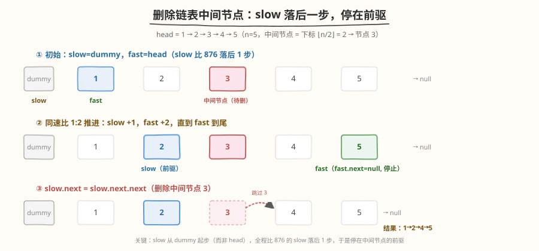
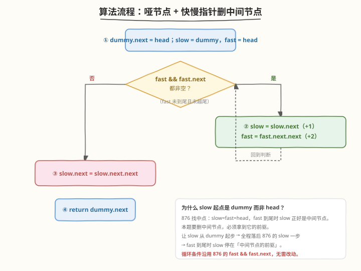
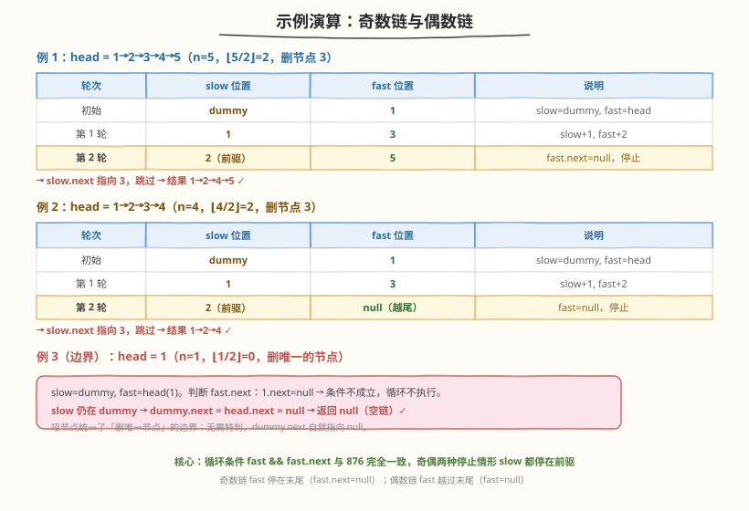

# LeetCode 删除链表的中间节点 题解

## 1. 题目概述

- **标题 / 题号**：删除链表的中间节点（#2095，medium）
- **链接**：https://leetcode.cn/problems/delete-the-middle-node-of-a-linked-list/
- **难度**：中等
- **标签**：链表、双指针

**题意**：给定一个非空单链表的头节点 `head`，**删除链表的中间节点**，并返回修改后的链表头节点。

中间节点的定义：长度为 `n` 的链表，中间节点是**下标为** $\lfloor n/2 \rfloor$ **的节点**（下标从 0 开始）。例如 `n = 1,2,3,4,5` 时，中间节点的下标分别为 `0,1,1,2,2`。

**示例 1**：

```text
输入：head = [1,2,3,4,5]
输出：[1,2,4,5]
解释：n = 5，中间节点下标 ⌊5/2⌋ = 2，即值为 3 的节点，删除后为 1 → 2 → 4 → 5。
```

**示例 2**：

```text
输入：head = [1,2,3,4]
输出：[1,2,4]
解释：n = 4，中间节点下标 ⌊4/2⌋ = 2，即值为 3 的节点，删除后为 1 → 2 → 4。
```

**示例 3**：

```text
输入：head = [2,1]
输出：[2]
解释：n = 2，中间节点下标 ⌊2/2⌋ = 1，即值为 1 的节点，删除后为 2。
```

**约束**：

- 链表中节点数目为 `n`
- `1 <= n <= 10^5`
- `1 <= Node.val <= 10^5`

> 💡 这是 [876. 链表的中间结点](../0801-0900/876_链表的中间结点.md) 与 [19. 删除链表的倒数第 N 个节点](../0001-0100/19_删除链表的倒数第N个节点.md) 的合体——前者用快慢双指针 1:2 找中点，后者用哑节点拿前驱做删除。把两者捏合只需一个改动：**让慢指针从 `dummy` 起步**，它就比 876 的慢指针全程落后 1 步，于是当快指针到尾时，慢指针正好停在中间节点的**前驱**上，直接 `slow.next = slow.next.next` 即可。

## 2. 解题思路

### 2.1 暴力思路：先数长度再走到前驱

最直观的做法分两步：

1. **第一趟**：遍历链表数出长度 `n`。
2. **第二趟**：再从头走到下标为 $\lfloor n/2 \rfloor - 1$ 的节点（待删中间节点的前驱），执行 `cur.next = cur.next.next`。

```text
# 第一趟：数长度
n = 0; cur = head
while cur: n++; cur = cur.next
# 第二趟：走到前驱（下标 ⌊n/2⌋ - 1）
prev = 0; cur = head
while prev < n//2 - 1: cur = cur.next; prev++
cur.next = cur.next.next  # 删除中间节点
```

时间 `O(n)`，空间 `O(1)`，能过，但需要**两趟扫描**。更麻烦的是 `n == 1` 时前驱下标为 `-1`，必须特判「删头节点」——这正是哑节点要解决的痛点。

> ⚠️ 暴力法的核心痛点：删中间节点要先拿到**前驱**，而"中间"是个相对位置（依赖总长度 `n`），不数一遍长度就无法定位。能否在一次扫描中，既不数长度、又能让指针自动停在前驱？关键在于**让一个指针走快一倍**，用它触底的时间点来对齐"一半路程"。

### 2.2 核心观察：快慢双指针 + slow 落后一步

两个关键技巧叠加：

1. **哑节点（dummy node）**：在 `head` 前加虚拟节点 `dummy`，`dummy.next = head`。删除下标 0 的节点（`n == 1`，中间节点就是头节点）时，慢指针停在 `dummy`，`dummy.next = head.next` 与普通删除完全一致，无需特判。
2. **快慢双指针 1:2 + slow 起点落后**：`slow = dummy`、`fast = head`，每轮 `slow +1`、`fast +2`。因为 `fast` 速度是 `slow` 的 2 倍，`fast` 触底时 `slow` 走了一半路程；又因为 `slow` 从 `dummy` 起步比从 `head` 起步落后 1 个节点，所以 `slow` 最终停在**中间节点的前驱**而非中间节点本身。



**为什么 slow 起点是 dummy 而不是 head？**

- 回顾 [876](../0801-0900/876_链表的中间结点.md)：`slow = fast = head`，`fast` 到尾时 `slow` 停在**中间节点本身**。这对"返回中间节点"刚好，但对"删除中间节点"不够——删除必须拿到前驱。
- 本题让 `slow = dummy`（`fast` 仍为 `head`），相当于把 876 的 `slow` 整体**左移 1 个节点**。`fast` 的运动轨迹完全不变，触底时机不变，于是 `slow` 的落点也整体左移 1 个——从"中间节点"变成"中间节点的前驱"。
- 这是一处**只改一个赋值**就把"找中点"升级为"删中点"的精妙改造，循环条件 `fast && fast.next` 沿用 876 原样不动。

> 💡 **核心洞察**：定位类链表问题里，"指针的起点"和"指针的速度"同样重要。876 用速度比 1:2 把 `slow` 送到中点；本题保持速度比不变，仅把 `slow` 起点后撤到 `dummy`，就让它的落点从前驱的"下一个"变成"前驱"本身。这是"用起点偏移微调落点"的通用手法——同样的思想在 [19 题](../0001-0100/19_删除链表的倒数第N个节点.md) 里表现为"快指针先发 n 步"。

### 2.3 算法流程图



**完整步骤**：

1. **建哑节点**：`dummy.next = head`，`slow = dummy`，`fast = head`
2. **循环推进**：`while fast != null && fast.next != null`：
   - `slow = slow.next`（慢指针走 1 步）
   - `fast = fast.next.next`（快指针走 2 步）
3. **删除**：`slow.next = slow.next.next`（跳过中间节点）
4. **返回**：`dummy.next`

> ⚠️ 循环条件必须是 `fast && fast.next`（与 876 完全一致），且**两个判断顺序不能反**：先判 `fast` 防止偶数链 `fast` 越尾后解引用空指针，再判 `fast.next` 处理奇数链最后一步。若误写成 `fast.next && fast`，`fast` 为 `null` 时先访问 `fast.next` 直接崩溃。

### 2.4 示例演算

分别看奇数链与偶数链两种停止情形，外加 `n = 1` 的边界：



以 `head = [1,2,3,4,5]`（奇数，n=5）为例：

| 轮次 | slow 位置 | fast 位置 | 说明 |
|------|----------|----------|------|
| 初始 | dummy | 1 | slow=dummy, fast=head |
| 第 1 轮 | 1 | 3 | slow+1, fast+2 |
| 第 2 轮 | 2（前驱） | 5 | fast.next=null，停止 |

循环结束 `slow` 停在节点 2（中间节点 3 的前驱），`slow.next = slow.next.next` 跳过 3，结果 `1→2→4→5`。

以 `head = [1,2,3,4]`（偶数，n=4）为例：

| 轮次 | slow 位置 | fast 位置 | 说明 |
|------|----------|----------|------|
| 初始 | dummy | 1 | slow=dummy, fast=head |
| 第 1 轮 | 1 | 3 | slow+1, fast+2 |
| 第 2 轮 | 2（前驱） | null（越尾） | fast=null，停止 |

循环结束 `slow` 停在节点 2（中间节点 3 的前驱），删除后 `1→2→4`。

> 💡 两种停止情形 `slow` 都恰好停在前驱：奇数链 `fast` 停在最后一个节点（`fast.next == null` 触发停止）；偶数链 `fast` 越过末尾变 `null`（`fast == null` 触发停止）。这正是循环条件 `fast && fast.next` 同时覆盖奇偶的精妙之处——和 876 一模一样，无需为奇偶分别写逻辑。边界 `n = 1` 时循环一次都不执行，`slow` 留在 `dummy`，`dummy.next = head.next = null` 返回空链，哑节点再次证明其价值。

## 3. 参考代码

### C++

```cpp
// 删除链表的中间节点.cpp —— 哑节点 + 快慢双指针（slow 落后 1 步停在前驱）
// 编译: g++ -O2 -std=c++17 删除链表的中间节点.cpp -o delmid
struct ListNode {
    int val;
    ListNode* next;
    ListNode() : val(0), next(nullptr) {
    }
    ListNode(int x) : val(x), next(nullptr) {
    }
    ListNode(int x, ListNode* n) : val(x), next(n) {
    }
};

class Solution {
  public:
    ListNode* deleteMiddle(ListNode* head) {
        ListNode dummy(0);          // 哑节点，统一处理 n==1 删头节点
        dummy.next = head;
        ListNode* slow = &dummy;    // slow 从 dummy 起步，比 876 落后 1 步
        ListNode* fast = head;      // fast 从 head 起步

        // 快慢双指针 1:2，fast 到尾时 slow 停在中间节点的前驱
        while (fast != nullptr && fast->next != nullptr) {
            slow = slow->next;
            fast = fast->next->next;
        }

        // slow.next 是中间节点，跳过它
        ListNode* toDelete = slow->next;
        slow->next = slow->next->next;
        delete toDelete;            // 释放内存（可选，C++ 良好习惯）

        return dummy.next;
    }
};
```

### Python

```python
from typing import Optional

class ListNode:
    def __init__(self, val=0, next=None):
        self.val = val
        self.next = next

class Solution:
    def deleteMiddle(self, head: Optional[ListNode]) -> Optional[ListNode]:
        dummy = ListNode(0, head)      # 哑节点，统一处理 n==1 删头节点
        slow = dummy                   # slow 从 dummy 起步，比 876 落后 1 步
        fast = head                    # fast 从 head 起步

        # 快慢双指针 1:2，fast 到尾时 slow 停在中间节点的前驱
        while fast and fast.next:
            slow = slow.next
            fast = fast.next.next

        # slow.next 是中间节点，跳过它
        slow.next = slow.next.next

        return dummy.next
```

> 💡 对比 [876](../0801-0900/876_链表的中间结点.md) 的代码，唯一区别是 `slow` 的初值从 `head` 改成 `dummy`，外加最后多了 `slow.next = slow.next.next` 这一句删除。循环体和循环条件**逐字相同**。Python 的 `while fast and fast.next` 利用短路求值天然防空指针；C++ 用 `fast != nullptr && fast->next != nullptr` 同理。删除前保存 `toDelete` 指针，避免 `slow->next->next` 访问已释放内存。

## 4. 复杂度分析

| 维度 | 快慢双指针（一趟） | 两趟扫描 | 说明 |
|------|-------------------|---------|------|
| **时间复杂度** | `O(n)` | `O(n)` | `fast` 每轮走 2 步，至多 `⌈n/2⌉` 轮到链尾，总步数 `O(n)`；两趟扫描合计 `2n` 步，同为 `O(n)` |
| **空间复杂度** | `O(1)` | `O(1)` | 只用 `dummy`、`slow`、`fast` 三个指针 |
| **扫描趟数** | **1 趟** | 2 趟 | 一趟扫描无需先数长度，且无需为 `n==1` 特判 |

> ⚠️ 两种方法时间复杂度都是 `O(n)`，但快慢双指针只扫描一趟，常数因子更优（约 `n/2` 轮 vs `2n` 步）。更关键的是它体现了"**用速度差对齐一半路程**"的通用模板，可直接迁移到链表归并切分、回文链表找中点等场景。

## 5. 扩展：起点偏移微调落点的通用手法

### 5.1 与 876、19 的对照

三道题共享"快慢双指针"骨架，差异仅在**起点**与**速度比**：

| 题目 | 目标 | slow 起点 | fast 起点 | 速度比 | slow 最终落点 |
|------|------|----------|----------|--------|--------------|
| 876 链表中点 | 返回中点 | `head` | `head` | 1:2 | 中间节点本身 |
| 2095 删中间节点 | 删中点 | `dummy` | `head` | 1:2 | 中间节点的前驱 |
| 19 删倒数第 N | 删倒数第 N | `dummy` | `dummy`（先走 N） | 1:1（先发 N 步） | 倒数第 N+1 个（前驱） |

> 💡 **规律**：要删某个节点就必须拿到前驱，"拿前驱"的统一做法是让 `slow` 比"找该节点"的版本**整体后撤 1 个起点**——876 找中点用 `slow=head`，删中点就用 `slow=dummy`；找倒数第 N 用 `fast` 先走 `N-1` 步，删倒数第 N 就让 `fast` 先走 `N` 步。起点后撤 1，落点就后撤 1，从前驱的下一个变成前驱本身。

### 5.2 偶数链取前一个中点的删除

本题偶数链删除的是下标 `n/2` 的节点（即"右中点"），与 876 取第二个中点一致。若面试官追问"删**左中点**（下标 `n/2 - 1`）怎么做"，对应 876 取第一个中点的变体——把循环条件改成 `fast.next && fast.next.next`（让 `fast` 早一轮停止，`slow` 少走一步），同样配 `slow = dummy` 拿前驱即可。

> 💡 这点在 [148. 排序链表](https://leetcode.cn/problems/sort-list/) 归并切分里很关键——左半段必须更短或等长否则切分不均死循环。口诀：**取后中点（本题）用 `fast && fast.next`，取前中点用 `fast.next && fast.next.next`**，配 `slow=dummy` 即可删对应中点。

## 6. 面试要点

1. **为什么 slow 起点是 dummy 而不是 head？**

   - 删节点必须拿到**前驱**。若 `slow = head`（如 876），`fast` 到尾时 `slow` 停在中间节点本身，无法删除（删节点要前驱）。
   - 让 `slow = dummy`，相当于把 876 的 `slow` 整体左移 1 个节点。`fast` 运动不变、触底时机不变，`slow` 落点也随之左移 1 个——从"中间节点"变成"中间节点的前驱"。
   - 只改一个赋值（`slow = dummy`），就把"找中点"升级为"删中点"，循环条件沿用 876 的 `fast && fast.next`。

2. **循环条件为什么是 `fast && fast.next`？**

   - `fast` 防止偶数链越过末尾后解引用空指针；`fast.next` 判断奇数链是否还剩最后一步。
   - 两个条件缺一不可且**顺序不能反**：必须先判 `fast` 非空再判 `fast.next`，否则 `fast` 为空时 `fast.next` 直接崩溃。
   - 这与 876 的循环条件**逐字相同**——奇数链 `fast.next == null` 退出，偶数链 `fast == null` 退出，两种情况 `slow` 都恰好停在前驱。

3. **n == 1（删唯一节点）时哑节点如何起作用？**

   - `slow = dummy`、`fast = head(1)`。判断 `fast.next`：`1.next == null`，条件不成立，循环一次都不执行。
   - `slow` 仍在 `dummy`，`slow.next = slow.next.next` 即 `dummy.next = head.next = null`，返回空链。
   - 无需任何 `if` 特判，逻辑与删普通节点完全一致。这就是哑节点统一边界处理的价值。

4. **为什么 fast 起点是 head 而不是 dummy？**

   - 若 `fast` 也从 `dummy` 起步，`fast` 会比标准 876 多走 1 个节点的路程，触底时机延后，`slow` 落点会偏移，奇偶两种停止情形的对称性被破坏。
   - 保持 `fast = head` 让 `fast` 的运动轨迹与 876 完全一致，这样"slow 起点后撤 1 → 落点后撤 1"的推理才成立。简言之：**用 slow 的起点偏移调落点，用 fast 的运动保对齐**。

5. **能不能不遍历直接算下标？**

   - 链表**不支持随机访问**，无法像数组那样 `arr[n//2]` 直接取中点。必须遍历，快慢双指针是"一趟遍历"的最优解。
   - 暴力两趟扫描（先数长度 `n` 再走 `n//2 - 1` 步到前驱）复杂度同为 `O(n)`，但需特判 `n == 1`，且失去"速度差对齐一半路程"的模板迁移性。面试策略：先说两趟朴素思路，再优化为一趟快慢双指针，展示从"依赖总长度"到"用速度比定位"的思维跃迁。

> 💡 **一句话总结**：2095 是 876 与 19 的合体——快慢双指针 1:2 找中点（承 876），哑节点拿前驱做删除（承 19），缝合点在于让 `slow` 从 `dummy` 起步而非 `head`，使其比 876 的 `slow` 全程落后 1 步，于是 `fast` 到尾时 `slow` 停在中间节点的前驱。一趟扫描 `O(n)` 时间、`O(1)` 空间，循环条件 `fast && fast.next` 同时覆盖奇偶两种停止情形，`n == 1` 边界由哑节点天然处理。核心模板是"用起点偏移微调落点"，可迁移到一切"定位 + 删除"类链表问题。

## 同类练习题

| # | 题目 | 与本题的关联 |
|---|------|-------------|
| 876 | [链表的中间结点](https://leetcode.cn/problems/middle-of-the-linked-list/)（[题解](../0801-0900/876_链表的中间结点.md)） | 同款快慢双指针 1:2，本题的"找中点"母题，`slow` 从 `head` 起步停在中点本身 |
| 19 | [删除链表的倒数第 N 个节点](https://leetcode.cn/problems/remove-nth-node-from-end-of-list/)（[题解](../0001-0100/19_删除链表的倒数第N个节点.md)） | 哑节点拿前驱做删除的另一招牌题，用"快指针先发 N 步"锁定倒数位置 |
| 234 | [回文链表](https://leetcode.cn/problems/palindrome-linked-list/) | 快慢找中点 + 反转后半段 + 比较，876 模板的综合应用 |
| 148 | [排序链表](https://leetcode.cn/problems/sort-list/)（[题解](../0101-0200/148_排序链表.md)） | 快慢找中点切分 + 归并合并，注意偶数链取前中点的循环条件变体 |
| 142 | [环形链表 II](https://leetcode.cn/problems/linked-list-cycle-ii/)（[题解](../0101-0200/142_环形链表 II.md)） | 快慢双指针 1:2 的追及判环变体，同源不同用 |
