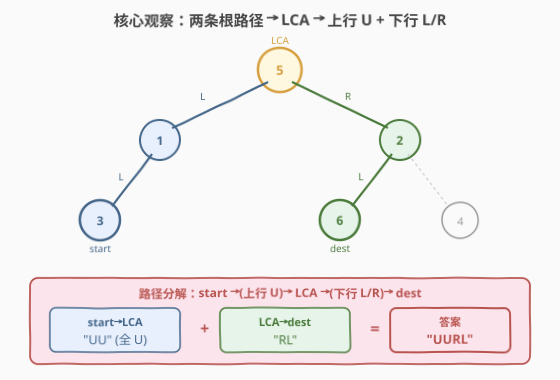
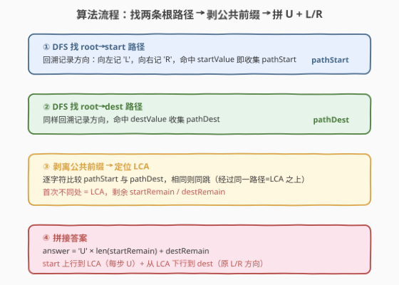
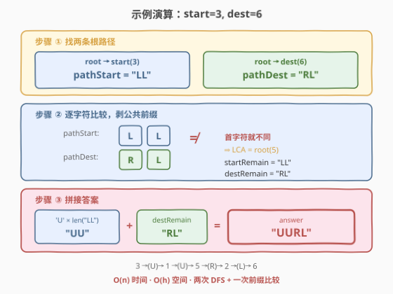

# LeetCode 从二叉树一个节点到另一个节点每一步的方向 题解

## 1. 题目概述

- **标题 / 题号**：从二叉树一个节点到另一个节点每一步的方向（#2096，medium）
- **链接**：https://leetcode.cn/problems/step-by-step-directions-from-a-binary-tree-node-to-another/
- **难度**：中等
- **标签**：树、二叉树、深度优先搜索、最近公共祖先

**题意**：给定一棵二叉树的根节点 `root`，以及两个位于树中的不同节点值 `startValue` 和 `destValue`。返回从值为 `startValue` 的节点到值为 `destValue` 的节点的**最短路径**的方向字符串，每个字符是以下之一：

- `'L'`：从当前节点走向其**左子节点**
- `'R'`：从当前节点走向其**右子节点**
- `'U'`：从当前节点走向其**父节点**（向上走）

> ⚠️ **关键约束**：二叉树节点只有 `left`/`right` 指针（向下），**没有父指针**（向上）。但方向字符串允许 `'U'`，意味着路径可以"先向上再向下"。

**示例 1**：

```text
输入：root = [5,1,2,3,null,6,4], startValue = 3, destValue = 6
输出："UURL"
解释：路径为 3 → 1 → 5 → 2 → 6
      3 到 1 是向上（U），1 到 5 是向上（U），
      5 到 2 是向右（R），2 到 6 是向左（L）。
```

**示例 2**：

```text
输入：root = [2,1], startValue = 2, destValue = 1
输出："L"
解释：路径为 2 → 1，从根走向左子节点。
```

**约束**：

- 树中节点数目范围 $[2, 10^5]$
- $1 \le \text{Node.val} \le 10^5$
- 所有 `Node.val` **互不相同**
- `startValue != destValue`，且两者都存在于树中

> 💡 **审题关键**：① 树中任意两节点间路径**唯一**（树无环）；② 路径必然"先向上到某公共祖先，再向下"——这个转折点就是 **LCA**；③ `start`/`dest` 给的是**节点值**而非指针，搜索时按 `val` 比较。

## 2. 解题思路

### 2.1 暴力思路：BFS 建无向图再求最短路

最直白的做法：把二叉树当作无向图（每条父子边双向连通），从 `start` 做 BFS，层层扩展直到找到 `dest`，沿途记录方向。

- **正确性**：BFS 必然找到最短路（树无环，两点间路径唯一，长度即最短）。
- **效率**：建图 $O(n)$ + BFS $O(n)$，空间 $O(n)$ 存邻接表与方向信息。能过但**大材小用**——树的结构本就保证了路径唯一，无需通用最短路算法。

> ⚠️ 暴力的浪费在于：它把树退化成一般图，丢失了"**树中路径唯一且必经 LCA**"这一结构信息。利用 LCA，可以把问题降维为"两段独立路径的拼接"。

### 2.2 核心观察：两条根路径 + 剥公共前缀 = LCA 拆两段



关键直觉分三层：

**1. 路径必经 LCA**：`start` 到 `dest` 的路径 = `start` 向上到 LCA + LCA 向下到 `dest`。因为树中两节点间路径唯一，而 LCA 是两条"向上回溯"路径的汇聚点（与 [236. 最近公共祖先](../0201-0300/236_二叉树的最近公共祖先.md)、[1740. 找到二叉树中的距离](../1701-1800/1740_找到二叉树中的距离.md) 同构）。

**2. 根路径编码方向**：从 `root` 出发 DFS 到 `start`，沿途向左记 `'L'`、向右记 `'R'`，得到字符串 `pathStart`。同理得到 `pathDest`。这两个字符串精确描述了从根到目标节点的下行方向序列。

**3. 公共前缀 = LCA 之上的共同路径**：`pathStart` 和 `pathDest` 的**公共前缀**代表从根到 LCA 的那段共同下行路径。剥掉公共前缀后：

- `startRemain`：从 LCA 到 `start` 的下行方向序列（需要**反向**为 `'U'`，因为 `start` 要向上走回 LCA）
- `destRemain`：从 LCA 到 `dest` 的下行方向序列（保持原样，因为要从 LCA 向下走）

$$\boxed{\text{answer} = \text{'U'} \times \text{len}(\text{startRemain}) + \text{destRemain}}$$

> 💡 **为什么剥公共前缀就能定位 LCA？** 公共前缀的终点正是两条路径"分岔"之处——分岔点就是 LCA。分岔后 `pathStart` 继续向下到 `start`，`pathDest` 继续向下到 `dest`。把 `start` 那段全部反转为 `'U'`（上行），再接上 `dest` 那段（下行），就是完整方向串。

### 2.3 算法流程图



**完整步骤**：

1. **DFS 找 `pathStart`**：从 `root` 出发，回溯记录方向（`'L'`/`'R'`）。命中 `startValue` 时，当前路径字符串即为 `pathStart`。
2. **DFS 找 `pathDest`**：同样方法得到 `pathDest`。
3. **剥公共前缀**：设两指针 `i = 0`，逐字符比较 `pathStart[i]` 与 `pathDest[i]`，相同则 `i++`。首次不同（或某串耗尽）时停止，`i` 即公共前缀长度，对应 LCA。
4. **拼接答案**：`answer = string(len(pathStart) - i, 'U') + pathDest[i:]`。

> ⚠️ **第 3 步的边界**：若一条路径是另一条的前缀（如 `start` 是 `dest` 的祖先），则较短串耗尽时停止。此时 LCA = 较浅的那个节点，`startRemain` 或 `destRemain` 为空，公式依然成立。

### 2.4 示例演算

以示例 1（`startValue = 3, destValue = 6`）逐步演算：



**步骤 ① 找两条根路径**：

树结构如下（`★` 为 LCA，`🔵` 为 start，`🟢` 为 dest）：

```text
          5 ★ (LCA)
         / \
   (L)  1   2  (R)
       /   / \
  (L) 3   6   4
         (L)
```

- `pathStart`（root → 3）：5 向左到 1（`'L'`），1 向左到 3（`'L'`）→ **`"LL"`**
- `pathDest`（root → 6）：5 向右到 2（`'R'`），2 向左到 6（`'L'`）→ **`"RL"`**

**步骤 ② 剥公共前缀**：

| 位置 | `pathStart[i]` | `pathDest[i]` | 是否相同 |
|------|-----------------|---------------|----------|
| 0    | `'L'`           | `'R'`         | ✗ 不同 → 停止 |

公共前缀长度 `i = 0` → **LCA = root(5)**（首字符就不同，说明 `start` 和 `dest` 分居 root 两侧）。

- `startRemain = pathStart[0:] = "LL"`
- `destRemain = pathDest[0:] = "RL"`

**步骤 ③ 拼接答案**：

- 上行段：`'U' × len("LL") = "UU"`（3 → 1 → 5，两步向上）
- 下行段：`"RL"`（5 → 2 → 6）
- **answer = `"UU" + "RL" = "UURL"`** ✓

> 💡 **对照示例 2**（`start = 2, dest = 1`）：`pathStart = ""`（root 本身就是 start），`pathDest = "L"`。公共前缀长度 `i = 0`（空串），`startRemain = ""`，`destRemain = "L"`，answer = `"" + "L" = "L"` ✓。

## 3. 参考代码

### C++

```cpp
/**
 * Definition for a binary tree node.
 * struct TreeNode {
 *     int val;
 *     TreeNode *left;
 *     TreeNode *right;
 * };
 */
class Solution {
public:
    // DFS 找 root → target 的方向路径，存入 path
    bool findPath(TreeNode* node, int target, string& path) {
        if (node == nullptr) return false;
        if (node->val == target) return true;
        // 尝试左子树
        path.push_back('L');
        if (findPath(node->left, target, path)) return true;
        path.pop_back();
        // 尝试右子树
        path.push_back('R');
        if (findPath(node->right, target, path)) return true;
        path.pop_back();
        return false;
    }

    string getDirections(TreeNode* root, int startValue, int destValue) {
        string pathStart, pathDest;
        findPath(root, startValue, pathStart);
        findPath(root, destValue, pathDest);

        // 剥公共前缀
        int i = 0;
        while (i < pathStart.size() && i < pathDest.size()
               && pathStart[i] == pathDest[i]) {
            ++i;
        }

        // 上行段：start 到 LCA，全 U
        string up(pathStart.size() - i, 'U');
        // 下行段：LCA 到 dest，原方向
        string down = pathDest.substr(i);
        return up + down;
    }
};
```

### Python

```python
class Solution:
    def getDirections(self, root: Optional[TreeNode], startValue: int, destValue: int) -> str:
        # DFS 找 root → target 的方向路径
        def find_path(node: Optional[TreeNode], target: int) -> str:
            if not node:
                return ""
            if node.val == target:
                return "FOUND"
            left = find_path(node.left, target)
            if left:
                return "L" + left
            right = find_path(node.right, target)
            if right:
                return "R" + right
            return ""

        path_start = find_path(root, startValue).replace("FOUND", "")
        path_dest = find_path(root, destValue).replace("FOUND", "")

        # 剥公共前缀
        i = 0
        while i < len(path_start) and i < len(path_dest) \
                and path_start[i] == path_dest[i]:
            i += 1

        # 上行段 + 下行段
        return "U" * (len(path_start) - i) + path_dest[i:]
```

> 💡 **代码要点**：① `findPath` 是标准回溯模板——`push_back` 进路径、递归失败则 `pop_back` 回退，保证路径始终对应当前 DFS 栈；② 剥前缀只需一个 `while` 循环，无需显式构造 LCA 节点；③ 上行段长度 = `pathStart` 剩余长度，全部填 `'U'`；下行段直接取 `pathDest` 的后缀。

> ⚠️ **Python 版的 `replace("FOUND", "")`**：`find_path` 用 `"FOUND"` 标记命中，命中后递归返回值前缀方向会拼接上 `"FOUND"`，最后替换为空串即可。也可改用列表回溯（与 C++ 版一致），但字符串拼接版更简洁。

## 4. 复杂度分析

| 维度 | 复杂度 | 说明 |
|------|--------|------|
| 时间复杂度 | $O(n)$ | 两次 DFS 各遍历至多 $n$ 个节点 + 一次前缀比较 $O(\min(h_p, h_q))$，总计 $O(n)$ |
| 空间复杂度 | $O(h)$ | 递归调用栈深度 = 树高 $h$；最坏（链状树）$O(n)$，平衡树 $O(\log n)$。路径字符串长度 $\le h$ |

> 💡 **为何时间是 $O(n)$ 而非 $O(2n)$？** 渐近意义下 $O(2n) = O(n)$，常数因子为 2。两次 DFS 各自独立遍历整棵树（因为不知道目标在哪个子树，必须全遍历到命中点）。前缀比较的代价 $O(h) \le O(n)$，被 DFS 项吸收。

## 5. 扩展：单次 DFS 一趟找两条路径

上述解法遍历树两次。可以合并为**单次 DFS**：在一次遍历中同时记录到 `start` 和 `dest` 的路径，找到两个目标后立即返回。

```cpp
class Solution {
public:
    string pathStart, pathDest;
    bool foundStart = false, foundDest = false;

    void dfs(TreeNode* node, string& cur, int s, int d) {
        if (!node || (foundStart && foundDest)) return;
        if (node->val == s) { pathStart = cur; foundStart = true; }
        if (node->val == d) { pathDest  = cur; foundDest  = true; }

        cur.push_back('L'); dfs(node->left,  cur, s, d); cur.pop_back();
        cur.push_back('R'); dfs(node->right, cur, s, d); cur.pop_back();
    }

    string getDirections(TreeNode* root, int startValue, int destValue) {
        string cur;
        dfs(root, cur, startValue, destValue);
        int i = 0;
        while (i < pathStart.size() && i < pathDest.size()
               && pathStart[i] == pathDest[i]) ++i;
        return string(pathStart.size() - i, 'U') + pathDest.substr(i);
    }
};
```

该版本在 `foundStart && foundDest` 时短路返回，最坏仍遍历 $O(n)$（两目标都在最深处），但平均更优。逻辑与两次 DFS 版完全等价，只是合并了遍历循环。

> 💡 **面试策略**：先讲清两次 DFS 版（逻辑最清晰、不易出错），再提单次 DFS 优化展示对遍历效率的思考。剥前缀 + 拼 U 的核心逻辑两版完全一致。

## 6. 面试要点

**Q1：为什么路径一定经过 LCA？**

> 树中两节点间路径唯一（无环连通图性质）。`start` 到 `dest` 的路径必然在某个祖先处"折返"——`start` 先向上到该祖先，再向下到 `dest`。这个折返点就是 LCA：它是同时是 `start` 和 `dest` 祖先的最近节点。任何不经过 LCA 的路径都会在树中形成环，矛盾。

**Q2：为什么剥公共前缀就能定位 LCA，而不需要显式找 LCA 节点？**

> `pathStart` 和 `pathDest` 分别是从根到 `start`/`dest` 的方向序列。公共前缀表示两条路径"从根开始共同走过的部分"——共同部分的终点就是两条路径分岔之处，即 LCA。分岔后两条路径分别向下到 `start` 和 `dest`。因此剥掉公共前缀后，`start` 的剩余部分反转成 `'U'`（上行），`dest` 的剩余部分保持原方向（下行），拼接即答案。无需显式构造 LCA 的 TreeNode 指针。

**Q3：如果 start 是 dest 的祖先（或反之），算法还成立吗？**

> 成立。若 `start` 是 `dest` 的祖先，则 `pathStart` 是 `pathDest` 的前缀。公共前缀长度 `i = len(pathStart)`，`startRemain` 为空（`len - i = 0`，无 `'U'`），`destRemain = pathDest[i:]` 是从 `start` 下行到 `dest` 的方向。答案纯下行，无 `'U'`，正确。反之（`dest` 是 `start` 的祖先）则 `destRemain` 为空，答案纯 `'U'`。

**Q4：为什么不能用 BFS 建无向图求最短路？**

> 可以，但浪费结构。BFS 把树当一般图处理，忽略了两点间路径唯一、必经 LCA 的树性质。BFS 需要 $O(n)$ 建邻接表 + $O(n)$ 队列扩展 + 记录每步方向，空间和常数都更大。而 LCA 解法直接利用树的结构，只需两次 DFS + 一次字符串比较，逻辑更简洁，空间只需 $O(h)$（递归栈 + 路径串）而非 $O(n)$（邻接表）。

**Q5：路径字符串的长度上界是多少？**

> 等于树高 $h$。最坏情况（退化为链表）$h = n = 10^5$，字符串长度 $10^5$，拼接 $O(n)$ 完全可接受。剥前缀的 `while` 循环同样 $O(h)$，不超时。

> 💡 **一句话总结**：两次 DFS 找根→start 和根→dest 的方向串 → 剥公共前缀定位 LCA → `start` 剩余反转全 `'U'` + `dest` 剩余原方向 → $O(n)$ 时间、$O(h)$ 空间。

## 同类练习题

| # | 题目 | 与本题的关联 |
|---|------|-------------|
| 236 | [二叉树的最近公共祖先](https://leetcode.cn/problems/lowest-common-ancestor-of-a-binary-tree/)（[题解](../0201-0300/236_二叉树的最近公共祖先.md)） | **最直接的基石题**——本题找 LCA 的思路与 236 同构（后序 DFS 找分岔点），先掌握 236 的递归决策再做本题水到渠成 |
| 1740 | [找到二叉树中的距离](https://leetcode.cn/problems/find-distance-in-a-binary-tree/)（[题解](../1701-1800/1740_找到二叉树中的距离.md)） | 同为"两节点经 LCA 拆两段"的套路，1740 求距离（边数），本题求方向串，对照理解 LCA 拆分的不同输出形式 |
| 1650 | [二叉树的最近公共祖先 III](https://leetcode.cn/problems/lowest-common-ancestor-of-a-binary-tree-iii/) | 节点带父指针，可直接从 `start` 向上走祖先链，无需从根 DFS——对照理解"有/无父指针"对路径求解的影响 |
| 863 | [二叉树中所有距离为 K 的节点](https://leetcode.cn/problems/all-nodes-distance-k-in-binary-tree/) | 同样涉及"向上走父方向"，需建父指针后从目标节点 BFS 扩散，与本题"先上行再下行"的路径结构互补 |
| 112 | [路径总和](https://leetcode.cn/problems/path-sum/) | DFS 回溯记录根→叶路径的经典题，巩固本题 `findPath` 函数使用的"push/pop 回溯记录方向"模板 |
