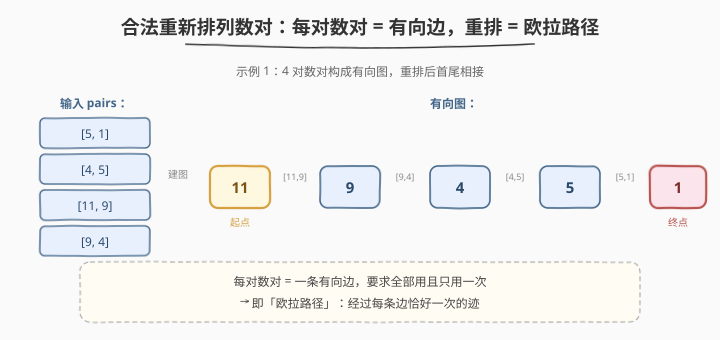
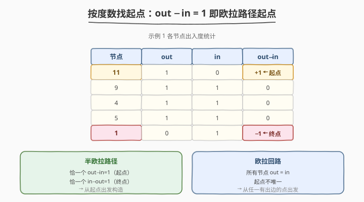
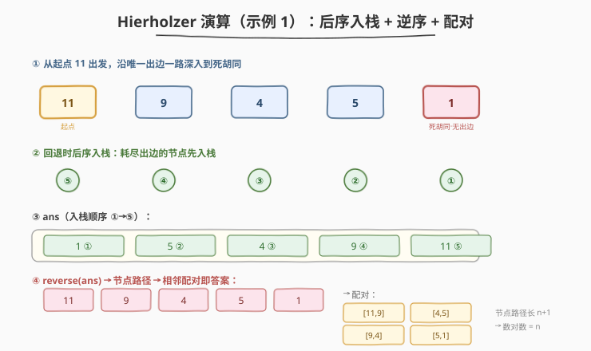

# LeetCode 合法重新排列数对 题解

## 1. 题目概述

- **标题 / 题号**：合法重新排列数对（#2097，hard）
- **链接**：https://leetcode.cn/problems/valid-arrangement-of-pairs/
- **难度**：困难
- **标签**：深度优先搜索、图、欧拉路径、Hierholzer

**题意**：给你一个下标从 0 开始的二维整数数组 `pairs`，其中 `pairs[i] = [start_i, end_i]`。请你将这些数对**重新排列**，使得排列后对每个满足 `1 <= i < pairs.length` 的下标 `i`，都有 `end_{i-1} == start_i`。

返回**任意一种**合法排列即可。题目保证至少存在一种合法排列。

**示例 1**：

```text
输入：pairs = [[5,1],[4,5],[11,9],[9,4]]
输出：[[11,9],[9,4],[4,5],[5,1]]
解释：end_0=9==start_1=9，end_1=4==start_2=4，end_2=5==start_3=5，全部首尾相接。
```

**示例 2**：

```text
输入：pairs = [[1,3],[3,2],[2,1]]
输出：[[1,3],[3,2],[2,1]]
解释：1→3→2→1，首尾相接形成回路。
```

**示例 3**：

```text
输入：pairs = [[1,2],[1,3],[2,1],[3,2],[3,1],[2,3]]
输出：[[1,2],[2,1],[1,3],[3,2],[2,3],[3,1]]（其中一种合法排列）
```

**约束**：

- $1 \le \text{pairs.length} \le 10^5$
- $\text{pairs}[i].\text{length} == 2$
- $0 \le \text{start}_i, \text{end}_i \le 10^9$
- $\text{start}_i \ne \text{end}_i$
- 存在至少一种 `pairs` 的合法排列

> 💡 **审题关键**：① 每对数对 `[start, end]` 是一条**有向边** `start → end`；② 合法排列要求相邻数对首尾相接，即排成一串 `v_0 → v_1 → v_2 → ... → v_n`；③ 每条边**必须用、且只用一次**——这正是「**欧拉路径**」的定义。与 [332. 重新安排行程](../0301-0400/332_重新安排行程.md) 同构，但 332 返回**节点序列**、起点固定为 `"JFK"` 且要求字典序最小；本题返回**边序列（数对）**、起点按度数确定、任意合法排列均可。

## 2. 解题思路

### 2.1 暴力思路：全排列 + 校验

最直白的做法：枚举 `pairs` 的所有排列，对每种排列检查是否满足 `end_{i-1} == start_i` 对所有 `i` 成立，找到第一个合法的即返回。

- **正确性**：穷举所有排列必然命中合法解。
- **效率**：$O(n! \cdot n)$，$n \le 10^5$ 时完全不可行。需要更本质的观察。

### 2.2 核心观察：这是求「欧拉路径」



关键洞察：**每对数对 `[start, end]` = 一条有向边**，合法排列要求所有边首尾相接成一条迹、每条边用且只用一次——这正是「**欧拉路径**」的定义。

题目保证至少存在一种合法排列，意味着图**必存在**一条欧拉路径。于是问题从「搜索排列」降维为「**用 Hierholzer 算法 $O(V + E)$ 构造欧拉路径**」。

> 💡 **与 332 的关键差别**：332 起点固定为 `"JFK"` 且需字典序最小（邻接表用最小堆）；本题**起点不固定**——需先按度数分析找出欧拉路径的起点，且**任意合法排列均可**（邻接表用普通栈 `pop()` 即可，无需排序）。

### 2.3 核心观察：按度数找起点



有向图欧拉路径的**起点判定**（弱连通前提下）：

| 类型 | 条件 | 起点 |
|------|------|------|
| **半欧拉路径** | 恰一个顶点 $\text{out} - \text{in} = 1$（起点）、恰一个 $\text{in} - \text{out} = 1$（终点），其余相等 | $\text{out} - \text{in} = 1$ 的顶点 |
| **欧拉回路** | 所有顶点 $\text{out} = \text{in}$ | 任意有出边的顶点 |

**算法**：遍历所有边统计 `indeg` / `outdeg`，找到 $\text{out} - \text{in} = 1$ 的顶点作为起点；若不存在（欧拉回路情形），取任一有出边的顶点（如 `pairs[0][0]`）。

> ⚠️ **为什么起点必须选 $\text{out} - \text{in} = 1$ 的顶点？** 该顶点多一条出边未配对——必须从它出发才能把这条「多余」的出边用掉；若从其他顶点出发，最终会卡在这条多余出边之前无法闭合。欧拉回路中所有顶点度数平衡，从哪出发都行。

### 2.4 算法流程：Hierholzer 后序入栈 + 逆序 + 配对



Hierholzer 算法三步：

1. **建邻接表**：`unordered_map<int, vector<int>>`，每个节点的出边用 `vector` 存储，取边时 `pop_back()` $O(1)$ 删除（无需排序，任意合法排列均可）。
2. **DFS 后序入栈**：

   ```text
   dfs(u):
       while u 还有未用出边:
           v ← u 的某条出边（pop 删除）
           dfs(v)
       ans.append(u)        # 耗尽 u 的所有出边后，才把 u 记入答案
   ```

3. **逆序 + 配对**：`reverse(ans)` 得到节点序列 $[v_0, v_1, \dots, v_n]$，相邻节点配对 $[v_i, v_{i+1}]$ 即为输出的数对序列。

> 💡 **为什么「后序入栈 + 逆序」是对的？** `dfs(u)` 耗尽出边后才把 `u` 入栈，此时 `u` 无路可走，是当前路径的末端段。由于图存在欧拉路径，提前进入「死胡同」的节点恰好是真正的终点（非终点的节点 $\text{in} = \text{out}$，进去后必然还能出来，不会误死）。逆序后即得从起点到终点的正序欧拉路径。

> ⚠️ **$n \le 10^5$ 的递归栈溢出风险**：本题边数远大于 332（$E \le 300$），递归深度可达 $O(E) = 10^5$，可能触发栈溢出。因此参考代码使用**迭代版** Hierholzer（显式 `stack` 模拟递归），避免栈深度问题。

### 2.5 示例演算

以示例 1（`pairs = [[5,1],[4,5],[11,9],[9,4]]`）逐步演算：

**步骤 ① 建图与度数统计**：

| 节点 | out | in | out−in |
|------|-----|-----|--------|
| 11   | 1   | 0   | +1 ← **起点** |
| 9    | 1   | 1   | 0 |
| 4    | 1   | 1   | 0 |
| 5    | 1   | 1   | 0 |
| 1    | 0   | 1   | −1 ← **终点** |

起点 = 11（$\text{out} - \text{in} = 1$）。

**步骤 ② Hierholzer 深入**：

从 11 出发，邻接表唯一出边一路深入：`11 → 9 → 4 → 5 → 1`，节点 1 无出边，进入死胡同。

**步骤 ③ 后序入栈**：

回退阶段依次入栈：`1 ① → 5 ② → 4 ③ → 9 ④ → 11 ⑤`，得到 `ans = [1, 5, 4, 9, 11]`。

**步骤 ④ 逆序 + 配对**：

逆序得节点路径 `[11, 9, 4, 5, 1]`，相邻配对：

```text
[11, 9], [9, 4], [4, 5], [5, 1]
```

正好用完全部 4 条边，首尾相接，合法 ✓。

## 3. 参考代码

### C++

```cpp
class Solution {
public:
    vector<vector<int>> validArrangement(vector<vector<int>>& pairs) {
        unordered_map<int, vector<int>> g;
        unordered_map<int, int> indeg, outdeg;

        for (const auto& p : pairs) {
            g[p[0]].push_back(p[1]);
            ++outdeg[p[0]];
            ++indeg[p[1]];
        }

        // 按度数找起点：out − in = 1 的顶点；若不存在（欧拉回路），取任一有出边的点
        int start = pairs[0][0];
        for (auto& [u, _] : g) {
            if (outdeg[u] - indeg[u] == 1) {
                start = u;
                break;
            }
        }

        // 迭代版 Hierholzer：显式栈模拟递归，避免 1e5 深度栈溢出
        vector<int> ans;
        stack<int> st;
        st.push(start);
        while (!st.empty()) {
            int u = st.top();
            if (!g[u].empty()) {
                int v = g[u].back();
                g[u].pop_back();   // 取出一条出边并删除
                st.push(v);
            } else {
                ans.push_back(u);   // 后序入栈：出边耗尽后才记录
                st.pop();
            }
        }

        reverse(ans.begin(), ans.end());

        // 节点序列 → 相邻配对即数对序列
        vector<vector<int>> res;
        res.reserve(ans.size() - 1);
        for (int i = 0; i + 1 < (int)ans.size(); ++i) {
            res.push_back({ans[i], ans[i + 1]});
        }
        return res;
    }
};
```

### Python

```python
class Solution:
    def validArrangement(self, pairs: List[List[int]]) -> List[List[int]]:
        g = defaultdict(list)
        indeg = defaultdict(int)
        outdeg = defaultdict(int)

        for u, v in pairs:
            g[u].append(v)
            outdeg[u] += 1
            indeg[v] += 1

        # 按度数找起点
        start = pairs[0][0]
        for u in g:
            if outdeg[u] - indeg[u] == 1:
                start = u
                break

        # 迭代版 Hierholzer
        ans = []
        st = [start]
        while st:
            u = st[-1]
            if g[u]:
                st.append(g[u].pop())   # 取出一条出边并删除
            else:
                ans.append(u)            # 后序入栈
                st.pop()

        ans.reverse()

        # 节点序列 → 相邻配对
        return [[ans[i], ans[i + 1]] for i in range(len(ans) - 1)]
```

> 💡 **代码要点**：① 邻接表用 `vector` / `list` + `pop_back()` / `pop()` 取边，$O(1)$ 删除，无需排序（任意合法排列均可，区别于 332 的最小堆）；② 迭代版用显式 `stack` 模拟递归，`u` 有出边则压入下一点、无出边则弹出并记入 `ans`，逻辑等价于递归后序；③ 最终把节点序列 `[v_0, ..., v_n]` 配对成 `[[v_0,v_1], ..., [v_{n-1},v_n]]`，长度 $n$ = 边数 = `pairs.length`。

## 4. 复杂度分析

| 维度 | 复杂度 | 说明 |
|------|--------|------|
| 时间复杂度 | $O(V + E)$ | 建图遍历所有边 $O(E)$ + Hierholzer 每条边进出栈各一次 $O(E)$ + 逆序与配对 $O(E)$；$V$ 为不同节点数 $\le 2E$ |
| 空间复杂度 | $O(V + E)$ | 邻接表存所有边 $O(V + E)$ + 度数哈希表 $O(V)$ + 栈与答案数组 $O(V)$ |

其中 $E = \text{pairs.length} \le 10^5$，$V$ 为出现的不同节点数（$\le 2E$）。节点值可达 $10^9$，故邻接表与度数表均用哈希表（`unordered_map` / `defaultdict`）而非数组。

> 💡 **为何不需要排序？** 332 要求字典序最小的行程，故邻接表用最小堆 $O(E \log E)$；本题只需**任意一种**合法排列，邻接表用普通栈 `pop()` 取边 $O(1)$，整体 $O(V + E)$。

## 5. 扩展：递归版与迭代版对比

**递归版**（适合 $E$ 较小时，逻辑最清晰）：

```cpp
void dfs(int u, unordered_map<int, vector<int>>& g, vector<int>& ans) {
    while (!g[u].empty()) {
        int v = g[u].back();
        g[u].pop_back();
        dfs(v, g, ans);
    }
    ans.push_back(u);
}
```

**迭代版**（显式栈，避免栈溢出，适合 $E \le 10^5$）：

```cpp
stack<int> st;
st.push(start);
while (!st.empty()) {
    int u = st.top();
    if (!g[u].empty()) { st.push(g[u].back()); g[u].pop_back(); }
    else { ans.push_back(u); st.pop(); }
}
```

| 版本 | 时间 | 空间 | 风险 |
|------|------|------|------|
| 递归版 | $O(V + E)$ | $O(E)$ 递归栈 | $E = 10^5$ 时可能栈溢出 |
| 迭代版 | $O(V + E)$ | $O(E)$ 显式栈（堆内存） | 无栈溢出风险 |

> 💡 **面试策略**：先讲递归版（逻辑清晰、易白板），再说明 $E$ 较大时改用迭代版规避栈深度。两版的核心逻辑完全一致——「有出边就深入，无出边就入栈」。

## 6. 面试要点

**Q1：为什么这道题是欧拉路径问题？**

> 每对数对 `[start, end]` 是一条有向边，合法排列要求所有边首尾相接、每条边用且只用一次——即「经过每条边恰好一次的迹」，正是欧拉路径定义。返回的数对序列就是欧拉路径上的边序列。

**Q2：如何确定欧拉路径的起点？**

> 统计每个顶点的出度与入度。若存在 $\text{out} - \text{in} = 1$ 的顶点，它是半欧拉路径的起点（多一条出边未配对，必须从它出发）；若所有顶点 $\text{out} = \text{in}$（欧拉回路），从任一有出边的顶点出发即可。终点是 $\text{in} - \text{out} = 1$ 的顶点。

**Q3：为什么「后序入栈 + 逆序」能得到正确路径？**

> `dfs(u)` 耗尽 `u` 的所有出边后才把 `u` 入栈，此时 `u` 无路可走，是当前路径的末端段。由于图存在欧拉路径，提前进入死胡同的节点恰好是真正的终点（非终点的节点 $\text{in} = \text{out}$，进去后必然还能出来）。逆序后即得从起点到终点的正序路径。

**Q4：为什么用迭代版而非递归版？**

> 本题 $E \le 10^5$，递归深度可达 $O(E)$，可能触发栈溢出（取决于编译器/运行环境默认栈大小）。迭代版用显式 `stack`（堆内存）模拟递归，逻辑等价但无栈深度限制。332 的 $E \le 300$ 无此顾虑。

**Q5：本题与 332 重新安排行程有什么异同？**

> **同**：都是有向图欧拉路径，都用 Hierholzer 后序入栈 + 逆序。**异**：① 332 起点固定 `"JFK"`，本题按度数找起点；② 332 要求字典序最小（最小堆 $O(E \log E)$），本题任意合法排列（普通栈 $O(V+E)$）；③ 332 返回节点序列，本题返回边序列（数对），需在节点路径上相邻配对；④ 332 节点为字符串、$E \le 300$，本题节点为整数（可达 $10^9$，用哈希表）、$E \le 10^5$。

> 💡 **一句话总结**：数对 = 有向边 → 按度数找起点（$\text{out}-\text{in}=1$）→ 迭代 Hierholzer 后序入栈 → 逆序得节点路径 → 相邻配对输出。$O(V + E)$ 时间、$O(V + E)$ 空间。

## 同类练习题

| # | 题目 | 与本题的关联 |
|---|------|-------------|
| 332 | [重新安排行程](https://leetcode.cn/problems/reconstruct-itinerary/)（[题解](../0301-0400/332_重新安排行程.md)） | **最直接的基石题**——同为有向图欧拉路径 + Hierholzer，区别在于起点固定、要求字典序最小（最小堆）、返回节点序列。先掌握 332 再做本题水到渠成 |
| 753 | [破解保险箱](https://leetcode.cn/problems/cracking-the-safe/) | 欧拉回路构造，每个 $(n-1)$ 位串为节点、补一位为边，Hierholzer 直接套用，对照理解「回路 vs 路径」的起点差异 |
| 207 | [课程表](https://leetcode.cn/problems/course-schedule/)（[题解](../0201-0300/207_课程表.md)） | 同为有向图遍历，拓扑排序按「点」调度（判环），欧拉路径按「边」调度（走完每条边），可对比理解两种图遍历的本质差别 |
| 1192 | [查找集群内的关键连接](https://leetcode.cn/problems/critical-connections-in-a-network/) | 无向图边的遍历问题（Tarjan 找桥边），与欧拉路径「按边遍历」的视角互补，对照理解有向/无向图边级算法 |
