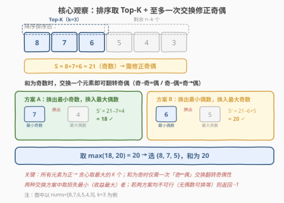
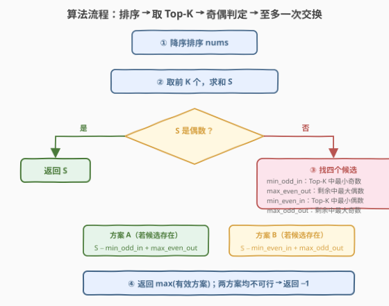

# LeetCode 长度为 K 的最大偶数和子序列 题解

## 1. 题目概述

- **标题 / 题号**：长度为 K 的最大偶数和子序列（#2098，medium）
- **链接**：https://leetcode.cn/problems/subsequence-of-size-k-with-the-largest-even-sum/
- **难度**：中等
- **标签**：贪心、排序、数组

**题意**：给定一个整数数组 `nums` 和一个整数 `k`，从 `nums` 中选出一个长度为 `k` 的**子序列**，使其元素之和为**最大的偶数**。如果不存在这样的子序列，返回 `-1`。

> **子序列**：由原数组删除部分（或不删除）元素、不改变剩余元素顺序得到。由于本题只关心**和**而非顺序，等价于「从 `nums` 中任选 `k` 个元素使其和最大且为偶数」。

**示例 1**：

```text
输入：nums = [4,1,2,3], k = 2
输出：6
解释：选 4 和 2，和 = 6（偶数），这是所有长度为 2 的子序列中最大的偶数和。
      选 4 和 3 的和 = 7（奇数，不合法）；选 3 和 2 的和 = 5（奇数）。
```

**示例 2**：

```text
输入：nums = [5,5,4], k = 3
输出：14
解释：必须选全部 3 个元素，5+5+4 = 14（偶数）。
```

**示例 3**：

```text
输入：nums = [1,3,5,7], k = 3
输出：-1
解释：所有元素均为奇数，选任意 3 个（奇数个）的和恒为奇数，无法构成偶数和。
```

**约束**：

- $1 \le \text{nums.length} \le 10^5$
- $1 \le \text{nums[i]} \le 10^5$
- $1 \le k \le \text{nums.length}$

> 💡 **审题关键**：① 所有元素为**正整数**，这是贪心取最大值的前提——若含负数则不能简单取 Top-K；② 只关心**和**的奇偶性而非子序列本身，故可以先排序打破顺序约束；③ 和的奇偶性仅取决于所选元素中**奇数的个数**——奇数个奇数 → 和为奇，偶数个奇数 → 和为偶。

## 2. 解题思路

### 2.1 暴力思路：枚举所有 C(n, k) 个子序列

最直觉的做法：从 `n` 个元素中选 `k` 个，枚举所有 $\binom{n}{k}$ 个组合，逐个求和并判断奇偶，记录最大的偶数和。

- **正确性**：穷举所有可能，必然得到最优解。
- **效率**：$\binom{n}{k}$ 在 $n=10^5$、$k=n/2$ 时是天文数字，完全不可行。

> ⚠️ 暴力的根源在于「把选子序列当成组合枚举」。但本题只关心**和**的大小与奇偶，不关心具体选了哪些元素。正数前提下，**和最大化**有强贪心结构：尽量选大的。

### 2.2 核心观察：排序取 Top-K + 至多一次交换修正奇偶



由于所有元素为正整数，**和最大的 k 个元素必然是排序后最大的 k 个**（Top-K）。设其和为 $S$：

- **若 $S$ 已为偶数**：直接返回 $S$，这就是全局最优——任何替换都会使和减小。
- **若 $S$ 为奇数**：需要通过**恰好一次交换**将奇偶性翻转为偶。交换的原理是：用 Top-K 外的一个元素替换 Top-K 内的一个元素，且两者的奇偶性**不同**（一奇一偶），从而使奇数个数变化 $\pm 1$，翻转总和的奇偶性。

> 💡 **为什么至多一次交换就够了？** 和的奇偶性由「奇数元素的个数」的奇偶决定。$S$ 为奇意味着 Top-K 中有奇数个奇数。一次「换出一奇 / 换入一偶」或「换出一偶 / 换入一奇」都能使奇数个数 $\pm 1$，翻转为偶数个。无需两次。

两种交换方案（取损失最小即收益最大者）：

| 方案 | 换出（Top-K 内） | 换入（剩余中） | 新和 | 奇偶变化 |
|------|------------------|----------------|------|----------|
| **A** | 最小的奇数 `min_odd_in` | 最大的偶数 `max_even_out` | $S - \text{min\_odd\_in} + \text{max\_even\_out}$ | 奇数个数 $-1$ → 偶 ✓ |
| **B** | 最小的偶数 `min_even_in` | 最大的奇数 `max_odd_out` | $S - \text{min\_even\_in} + \text{max\_odd\_out}$ | 奇数个数 $+1$ → 偶 ✓ |

> 💡 **为什么换出「最小的」、换入「最大的」？** 要让新和尽量大，换出的损失要尽量小（换出 Top-K 中最小的奇/偶），换入的收益要尽量大（换入剩余中最大的偶/奇）。降序排序后，Top-K 中最小的奇/偶出现在 Top-K 末尾附近，剩余中最大的奇/偶出现在剩余开头附近，均可线性扫描找到。

> ⚠️ **若两种方案均不可行**（例如 Top-K 中没有偶数且剩余中没有偶数），则无法构成偶数和，返回 $-1$。典型场景：所有元素为奇数且 $k$ 为奇数。

### 2.3 算法流程图



1. **降序排序** `nums`。
2. **取前 $k$ 个**，求和 $S$。
3. **判定 $S$ 奇偶**：
   - $S$ 为偶 → 返回 $S$。
   - $S$ 为奇 → 进入步骤 4。
4. **找四个候选值**：
   - `min_odd_in`：Top-K 中最小的奇数；
   - `max_even_out`：剩余 $n-k$ 个中最大的偶数；
   - `min_even_in`：Top-K 中最小的偶数；
   - `max_odd_out`：剩余 $n-k$ 个中最大的奇数。
5. **计算两种方案**（仅当对应候选均存在时有效）：
   - 方案 A：$S - \text{min\_odd\_in} + \text{max\_even\_out}$
   - 方案 B：$S - \text{min\_even\_in} + \text{max\_odd\_out}$
6. **返回** 有效方案中的最大值；若均无效，返回 $-1$。

### 2.4 示例演算

以 `nums = [8, 7, 6, 5, 4, 3]`, $k = 3$ 演算：

![示例演算：[8,7,6,5,4,3] k=3 → 20](../images/2098_example_walkthrough.svg)

| 步骤 | 操作 | 结果 |
|------|------|------|
| ① 降序排序 | `nums` 已降序 | `[8, 7, 6, 5, 4, 3]` |
| ② 取 Top-3 求和 | $8+7+6$ | $S = 21$（奇数） |
| ③ 找候选 | Top-3 = `[8,7,6]`，剩余 = `[5,4,3]` | `min_odd_in=7`, `min_even_in=6`, `max_even_out=4`, `max_odd_out=5` |
| ④ 方案 A | $21 - 7 + 4$ | $18$ ✓ |
| ④ 方案 B | $21 - 6 + 5$ | $20$ ✓ |
| ⑤ 取最大 | $\max(18, 20)$ | **20**（选 `{8, 7, 5}`） |

> 💡 方案 B 损失仅 $6-5=1$，远优于方案 A 的损失 $7-4=3$。降序排序保证了 `max_odd_out=5` 是剩余中最大的奇数，恰好比 `min_even_in=6` 仅小 1，使方案 B 几乎无损。

## 3. 参考代码

### C++

```cpp
class Solution {
public:
    long long largestEvenSum(vector<int>& nums, int k) {
        sort(nums.begin(), nums.end(), greater<int>());
        int n = nums.size();

        long long sum = 0;
        for (int i = 0; i < k; ++i)
            sum += nums[i];

        if (sum % 2 == 0)
            return sum;

        int minOddIn = INT_MAX, minEvenIn = INT_MAX;
        for (int i = 0; i < k; ++i) {
            if (nums[i] & 1) minOddIn = min(minOddIn, nums[i]);
            else             minEvenIn = min(minEvenIn, nums[i]);
        }

        int maxOddOut = -1, maxEvenOut = -1;
        for (int i = k; i < n; ++i) {
            if (nums[i] & 1) { if (maxOddOut == -1)  maxOddOut = nums[i]; }
            else             { if (maxEvenOut == -1) maxEvenOut = nums[i]; }
            if (maxOddOut != -1 && maxEvenOut != -1) break;
        }

        long long ans = -1;
        if (minOddIn != INT_MAX && maxEvenOut != -1)
            ans = max(ans, sum - minOddIn + maxEvenOut);
        if (minEvenIn != INT_MAX && maxOddOut != -1)
            ans = max(ans, sum - minEvenIn + maxOddOut);

        return ans;
    }
};
```

### Python

```python
from typing import List

class Solution:
    def largestEvenSum(self, nums: List[int], k: int) -> int:
        nums.sort(reverse=True)
        s = sum(nums[:k])
        if s % 2 == 0:
            return s

        min_odd_in = min_even_in = float('inf')
        for x in nums[:k]:
            if x & 1:
                min_odd_in = min(min_odd_in, x)
            else:
                min_even_in = min(min_even_in, x)

        max_odd_out = max_even_out = -1
        for x in nums[k:]:
            if x & 1:
                if max_odd_out == -1:
                    max_odd_out = x
            else:
                if max_even_out == -1:
                    max_even_out = x
            if max_odd_out != -1 and max_even_out != -1:
                break

        ans = -1
        if min_odd_in != float('inf') and max_even_out != -1:
            ans = max(ans, s - min_odd_in + max_even_out)
        if min_even_in != float('inf') and max_odd_out != -1:
            ans = max(ans, s - min_even_in + max_odd_out)

        return ans
```

> 💡 **写法对照**：两版逻辑完全一致——降序排序后取 Top-K 求和，若为奇数则线性扫描四个候选值，取两种交换方案的最大值。C++ 用 `INT_MAX` / `-1` 作为「不存在」哨兵；Python 用 `float('inf')` / `-1`。降序排序保证了剩余部分从左到右递减，找到的首个奇/偶即为最大，可提前 `break`。

> ⚠️ **溢出**：$k \le 10^5$、$\text{nums[i]} \le 10^5$，和最大可达 $10^{10}$，超出 `int` 范围。C++ 必须用 `long long`；Python 整数无溢出风险。

## 4. 复杂度分析

| 维度 | 复杂度 | 说明 |
|------|--------|------|
| 时间复杂度 | $O(n \log n)$ | 降序排序 $O(n \log n)$；求和 $O(k)$；扫描四个候选 $O(k + (n-k)) = O(n)$；总计排序主导 |
| 空间复杂度 | $O(1)$ | 排序为原地（C++ `sort` / Python `list.sort`）；仅用常数个标量变量（不计排序的栈空间） |

> 💡 可用 `nth_element`（C++）将 Top-K 划分到前 $k$ 个位置，均摊 $O(n)$，再分别扫描两段找候选，总体降至 $O(n)$。但 $n \le 10^5$ 时 $O(n \log n)$ 足够通过，且排序写法更简洁、可读性更佳。

## 5. 扩展：O(n) 的 nth_element 优化

若追求理论最优，C++ 可用 `nth_element` 以均摊 $O(n)$ 将第 $k$ 大元素置于位置 $k-1$，前 $k$ 个即为 Top-K（无序）。随后：

- 在 `nums[0..k-1]` 中线性扫描找 `min_odd_in`、`min_even_in`；
- 在 `nums[k..n-1]` 中线性扫描找 `max_odd_out`、`max_even_out`。

```cpp
class Solution {
public:
    long long largestEvenSum(vector<int>& nums, int k) {
        int n = nums.size();
        nth_element(nums.begin(), nums.begin() + k - 1, nums.end(), greater<int>());

        long long sum = 0;
        int minOddIn = INT_MAX, minEvenIn = INT_MAX;
        for (int i = 0; i < k; ++i) {
            sum += nums[i];
            if (nums[i] & 1) minOddIn = min(minOddIn, nums[i]);
            else             minEvenIn = min(minEvenIn, nums[i]);
        }
        if (sum % 2 == 0) return sum;

        int maxOddOut = -1, maxEvenOut = -1;
        for (int i = k; i < n; ++i) {
            if (nums[i] & 1) maxOddOut = max(maxOddOut, nums[i]);
            else             maxEvenOut = max(maxEvenOut, nums[i]);
        }

        long long ans = -1;
        if (minOddIn != INT_MAX && maxEvenOut != -1)
            ans = max(ans, sum - minOddIn + maxEvenOut);
        if (minEvenIn != INT_MAX && maxOddOut != -1)
            ans = max(ans, sum - minEvenIn + maxOddOut);
        return ans;
    }
};
```

| 维度 | 复杂度 | 说明 |
|------|--------|------|
| 时间复杂度 | $O(n)$ | `nth_element` 均摊 $O(n)$；两段扫描各 $O(n)$ |
| 空间复杂度 | $O(1)$ | 原地划分，常数额外空间 |

> ⚠️ `nth_element` 后前 $k$ 个元素**无序**，剩余部分也**无序**，因此找 `max_odd_out` / `max_even_out` 时不能提前 `break`，需完整扫描剩余部分取 `max`。这是用 $O(n)$ 时间换 $O(n \log n)$ 排序的代价。

**若 nums 含负数？** 贪心取 Top-K 不再正确——可能需要舍弃一个大正数来换取一个小负数的奇偶修正，甚至整体选不同的元素集合。此时问题退化为带奇偶约束的 k 元素最大和子集选择，可能需要动态规划（按奇偶分类的 Top-K），复杂度显著上升。本题的正数约束是贪心成立的关键前提。

## 6. 面试要点

**Q1：为什么可以直接排序取 Top-K？排序不会破坏子序列的顺序约束吗？**

> 因为本题只关心子序列的**和**，不关心元素顺序或具体选了哪些位置。和是交换律的——选哪些元素决定了和的大小，与顺序无关。排序只是把「选最大的 k 个」从 $O(n^k)$ 枚举简化为 $O(n \log n)$ 排序后取前 $k$ 个。所有元素为正保证了「和最大」$\Leftrightarrow$「选最大的 k 个」。

**Q2：为什么至多一次交换就能修正奇偶？**

> 和的奇偶性由「奇数元素的个数」的奇偶决定。$S$ 为奇 → Top-K 中有奇数个奇数。一次交换改变一个元素的奇偶归属，使奇数个数 $\pm 1$，翻转为偶数个，和变为偶。两种方案（换奇入偶 / 换偶入奇）覆盖了所有可能的单次修正路径，取损失最小者即可。

**Q3：两种方案分别什么时候不可行？**

> 方案 A 不可行：Top-K 中没有奇数（`min_odd_in` 不存在）**或**剩余中没有偶数（`max_even_out` 不存在）。方案 B 不可行：Top-K 中没有偶数（`min_even_in` 不存在）**或**剩余中没有奇数（`max_odd_out` 不存在）。若两者均不可行，返回 $-1$。典型场景：所有元素为奇且 $k$ 为奇——Top-K 全为奇（无偶可换出），剩余也全为奇（无偶可换入），两方案皆失效。

**Q4：为什么换出选「最小的」、换入选「最大的」？**

> 新和 $= S - \text{换出} + \text{换入}$。要使新和最大，换出的损失 $\text{换出}$ 要尽量小，换入的收益 $\text{换入}$ 要尽量大。在降序排序后，Top-K 中的最小奇/偶在末尾附近，剩余中的最大奇/偶在开头附近，均可高效找到。两种方案各自独立取最优候选，再取两者中的较大值。

**Q5：$k = n$ 时如何处理？**

> $k = n$ 时必须选全部元素，剩余部分为空，两方案的换入候选均不存在。若总和 $S$ 已为偶数则直接返回；若为奇数则两方案均不可行，返回 $-1$。这在代码中自然体现：`max_odd_out` 和 `max_even_out` 均保持 $-1$（初始值），两方案的条件判断均不通过。

> 💡 **一句话总结**：正数数组 → 降序排序取 Top-K → 和为偶直接返回 → 和为奇则用两种「一换一」方案修正奇偶，取损失最小者；两方案均不可行则返回 $-1$。$O(n \log n)$ 时间 / $O(1)$ 空间。

## 同类练习题

| # | 题目 | 与本题的关联 |
|---|------|-------------|
| 561 | [数组拆分](https://leetcode.cn/problems/array-partition/) | 排序贪心选数的最经典入门题——排序后取偶数位置元素求和，与本题同为「排序 + 贪心选取」范式 |
| 2030 | [含特定字母的最小子序列](https://leetcode.cn/problems/smallest-k-length-subsequence-with-occurrences-of-a-letter/)（[题解](2030_含特定字母的最小子序列.md)） | 同为「长度为 $k$ 的子序列 + 额外约束」，但用单调栈而非排序贪心，对照两种子序列选法 |
| 410 | [分割数组的最大值](https://leetcode.cn/problems/split-array-largest-sum/)（[题解](../0401-0500/410_分割数组的最大值.md)） | 选 $k$ 段的最优化问题，用二分答案 + 贪心验证，与本题的「排序 + 贪心」形成对照 |
| 2144 | [打折购买糖果的最小开销](https://leetcode.cn/problems/minimum-cost-of-buying-candies-with-discount/) | 排序贪心 + 分组选取（买 2 送 1），同为「排序后按规则选元素」的贪心家族 |
| 2161 | [根据给定数字划分数组](https://leetcode.cn/problems/partition-array-according-to-given-pivot/) | 按枢轴值划分数组，与本题按奇偶性分组扫描的思路相关 |
