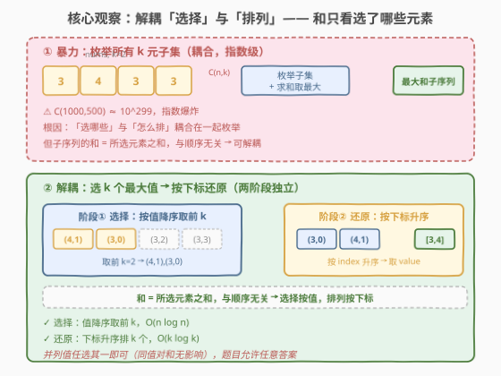
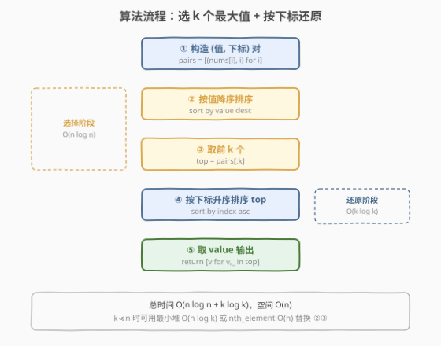
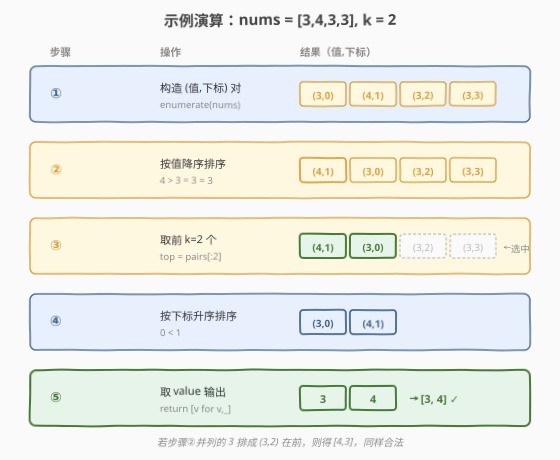

# 找到和最大的长度为 K 的子序列

- **题目名称**：找到和最大的长度为 K 的子序列
- **链接**：[2099. 找到和最大的长度为 K 的子序列](https://leetcode.cn/problems/find-subsequence-of-length-k-with-the-largest-sum/)
- **难度**：简单
- **标签**：数组、排序、堆、贪心

## 1. 题目概述

给你一个整数数组 `nums` 和一个整数 `k`。需要找到 `nums` 中长度为 `k` 的**子序列**，且这个子序列的**和最大**。返回**任意**一个长度为 `k` 的整数子序列。

**子序列**定义为从一个数组里删除一些元素后，不改变剩下元素的顺序得到的数组。

**示例 1**：

```text
输入：nums = [2,1,3,3], k = 2
输出：[3,3]
解释：子序列有最大和：3 + 3 = 6。
```

**示例 2**：

```text
输入：nums = [-1,-2,3,4], k = 3
输出：[-1,3,4]
解释：子序列有最大和：-1 + 3 + 4 = 6。
```

**示例 3**：

```text
输入：nums = [3,4,3,3], k = 2
输出：[3,4]
解释：子序列有最大和：3 + 4 = 7。另一个可行的子序列为 [4, 3]。
```

**约束条件**：

- $1 \le \text{nums.length} \le 1000$
- $-10^5 \le \text{nums[i]} \le 10^5$
- $1 \le k \le \text{nums.length}$

> 💡 **关键点**：①「子序列」要求保留原相对顺序，不能重排输出；②返回「任意」一个，意味着同值并列时无需唯一确定挑哪个；③目标是「和最大」而非「字典序最小/最大」——这决定了选 k 个最大值即可，无需关心并列元素的具体取舍。

---

## 2. 解题思路

### 2.1 暴力思路：枚举所有长度为 k 的子序列

最直觉：从 $n$ 个位置里选 $k$ 个（组合 $\binom{n}{k}$），对每种组合求和取最大。

```text
best = -∞
for each combination C of k indices from [0,n):
    s = sum(nums[i] for i in C)
    if s > best: best = s, ans = [nums[i] for i in sorted(C)]
return ans
```

问题：$\binom{n}{k}$ 是指数级。$n=1000, k=500$ 时 $\binom{1000}{500} \approx 10^{299}$，完全不可行；即便 $k=2$，$\binom{1000}{2} \approx 5 \times 10^5$ 尚可，但 $k$ 一大就爆炸。

> ⚠️ 暴力的根因：把「选哪 k 个」与「这 k 个怎么排」耦合在一起枚举。而子序列的和**只取决于选了哪些元素**，与它们的顺序无关——这就给了解耦的可能。

### 2.2 核心观察：选 k 个最大值 + 按下标还原（解耦选择与排列）



关键观察：**子序列的和 = 所选 k 个元素之和，与顺序无关**。因此「和最大的长度 k 子序列」等价于「选 `nums` 中 k 个最大的元素」——选择标准完全由**值**决定，与位置无关。

但输出必须是**子序列**（保留原相对顺序），所以选完 k 个最大值后，还需按**原下标升序**排好输出。于是算法解耦为两阶段：

| 阶段 | 任务 | 依据 |
|------|------|------|
| ① 选择 | 选出 k 个最大值（带下标） | 按值降序取前 k |
| ② 还原 | 把选中的 k 个按原顺序输出 | 按下标升序排 |

> 💡 **为什么正确？** 设选中的 k 个元素集合为 $S$（即 k 个最大值）。任意以 $S$ 为元素集合的输出，当且仅当按下标升序时才是合法子序列。而 $S$ 的和是所有 k 元子集里最大的（因为 $S$ 取了 k 个最大值），故按原序输出 $S$ 即为答案。

> ⚠️ **并列值的处理**：当第 k 大的值有多个并列时（如示例 3 中 $k=2$，前 2 大是 4 和 3，但 3 有三个），选哪几个并列元素不影响和（同值），故「任意」都合法。题目允许返回任意一个，故无需特殊去重或挑拣——排序稳定与否均可。示例 3 输出 `[3,4]`（取下标 0 的 3）或 `[4,3]`（取下标 2 或 3 的 3）都正确。

### 2.3 算法流程图



1. 构造 (值, 下标) 二元组列表 `pairs = [(nums[i], i) for i in range(n)]`。
2. 按**值降序**排序 `pairs`（并列时下标任意序即可）。
3. 取前 $k$ 个，得到选中的 k 个二元组。
4. 对这 $k$ 个按**下标升序**排序。
5. 依次取出值，即为答案子序列。

### 2.4 示例演算

以示例 3 `nums = [3,4,3,3], k = 2` 为例：



1. 构造 (值, 下标) 对：`(3,0), (4,1), (3,2), (3,3)`。
2. 按值降序排序：`(4,1), (3,0), (3,2), (3,3)`（三个 3 并列，下标升序呈现仅是其中一种）。
3. 取前 $k=2$ 个：`(4,1), (3,0)`。
4. 按下标升序排序：`(3,0), (4,1)`。
5. 取值 → `[3, 4]` ✓

> 💡 若步骤 2 中三个并列的 3 排成 `(3,2)` 在 `(3,0)` 前，则前 2 个为 `(4,1),(3,2)`，按下标排得 `(4,1),(3,2)` → `[4,3]`，同样合法（题目注释「另一个可行的子序列为 [4,3]」）。

---

## 3. 参考代码

### C++

```cpp
class Solution {
  public:
    vector<int> maxSubsequence(vector<int>& nums, int k) {
        int n = nums.size();
        vector<pair<int,int>> pairs(n);
        for (int i = 0; i < n; ++i) pairs[i] = {nums[i], i};
        // 阶段①：按值降序排序
        sort(pairs.begin(), pairs.end(), [](const auto& a, const auto& b) {
            return a.first > b.first;
        });
        // 取前 k 个
        vector<pair<int,int>> top(pairs.begin(), pairs.begin() + k);
        // 阶段②：按下标升序还原子序列
        sort(top.begin(), top.end(), [](const auto& a, const auto& b) {
            return a.second < b.second;
        });
        vector<int> ans;
        for (auto& p : top) ans.push_back(p.first);
        return ans;
    }
};
```

### Python

```python
from typing import List

class Solution:
    def maxSubsequence(self, nums: List[int], k: int) -> List[int]:
        pairs = [(v, i) for i, v in enumerate(nums)]
        # 阶段①：按值降序取前 k
        pairs.sort(key=lambda x: -x[0])
        top = pairs[:k]
        # 阶段②：按下标升序还原
        top.sort(key=lambda x: x[1])
        return [v for v, _ in top]
```

> 💡 **实现细节**：
> - 必须带下标排序，不能只排值——否则还原阶段拿不到原位置。
> - Python 用 `key=lambda x: -x[0]` 做值降序（等价于 `reverse=True`）；也可一步选 top-k：`heapq.nlargest(k, enumerate(nums), key=lambda p: p[1])`（堆 $O(n \log k)$），再按下标排序。
> - $n=1000$ 时全量排序与堆差异可忽略，全量排序最清晰，面试首选。

---

## 4. 复杂度分析

| 维度 | 复杂度 | 说明 |
|------|--------|------|
| 时间复杂度 | $O(n \log n + k \log k)$ | 值排序 $O(n \log n)$；前 $k$ 个按下标排序 $O(k \log k)$；$n=1000$ 时约 $10^4$ 次比较 |
| 空间复杂度 | $O(n)$ | `pairs` 数组 $O(n)$（输出 $O(k)$ 不另计） |

> 💡 当 $k \ll n$ 时，用大小为 $k$ 的最小堆可把选 top-k 降到 $O(n \log k)$，用 `nth_element`（C++）可降到 $O(n)$ 平均，见扩展。

---

## 5. 扩展：用堆或 nth_element 优化 top-k 选择

当 $k \ll n$ 时，全量排序浪费。两种更优选择：

**最小堆（大小 $k$）**：维护大小为 $k$ 的最小堆，堆顶是当前 top-k 中最小者。扫一遍 `nums`，新元素比堆顶大则替换，最终堆中即 top-k。$O(n \log k)$。

```cpp
// 维护 (值, 下标) 的最小堆，大小 k
priority_queue<pair<int,int>, vector<pair<int,int>>, greater<>> pq;
for (int i = 0; i < n; ++i) {
    pq.push({nums[i], i});
    if ((int)pq.size() > k) pq.pop();      // 弹出最小者，保留 k 个最大
}
// 堆中即 top-k，再按下标还原
```

**`nth_element`（C++）**：$O(n)$ 平均时间把第 $k$ 大放到位置，其前 $k$ 个即为 top-k（无序）。但 `nth_element` 对并列值不保证前 $k$ 个的精确边界，处理并列需额外按阈值计数。

| 方法 | 时间 | 适用 |
|------|------|------|
| 全量排序 | $O(n \log n)$ | 通用，最简洁 |
| 最小堆 | $O(n \log k)$ | $k \ll n$ |
| `nth_element` | $O(n)$ 平均 | 追求极致，并列处理略繁 |

> ⚠️ $n \le 1000$ 时三种方法都在毫秒级，差异可忽略。选择应以**可读性**为先——全量排序最清晰，是面试首选。

---

## 6. 面试要点

1. **为什么「和最大的 k 元子序列」等价于「选 k 个最大值」？**

   - 子序列的和 = 所选元素之和，与顺序无关。要让 $k$ 个元素之和最大，等价于选 $k$ 个值最大的元素。位置只决定输出排列（必须按下标升序才是子序列），不参与选择标准。这是「解耦选择与排列」的典型。

2. **选完 k 个最大值后，为什么要再按下标排序？**

   - 题目要求返回子序列，必须保留原相对顺序。值排序打乱了原顺序，故需对选中的 $k$ 个按下标升序重排，才能输出合法子序列。这一步是 $O(k \log k)$。

3. **第 k 大的值有并列时，选哪个？**

   - 任意选。同值元素对和的贡献相同，选哪个都不改变总和。题目允许返回任意一个，故无需特殊处理。示例 3 中 $k=2$，前 2 大为 4 和 3（3 有三个），选下标 0 的 3 得 `[3,4]`，选下标 2 或 3 的 3 得 `[4,3]`，均合法。

4. **能用堆优化到 $O(n \log k)$ 吗？**

   - 能。维护大小为 $k$ 的最小堆，堆顶为当前 top-k 最小者。扫一遍 `nums`，比堆顶大则替换。最终堆中即 top-k。$k \ll n$ 时优于全量排序。但 $n=1000$ 时差异可忽略，全量排序更简洁可读。

5. **若改为「字典序最小的和最大子序列」怎么办？**

   - 选择阶段不变（仍选 $k$ 个最大值），但并列值的取舍需加约束：在保证和最大的前提下，按下标升序优先选靠前的并列元素，使输出字典序最小。可在值排序时以「值降序，下标升序」为键，取前 $k$ 即天然字典序最小。

> 💡 **一句话总结**：和最大的 $k$ 元子序列 = 「选 $k$ 个最大值」+「按下标还原顺序」，两阶段解耦，$O(n \log n)$ 时间 / $O(n)$ 空间。

---

## 7. 同类练习题

- [215. 数组中的第K个最大元素](https://leetcode.cn/problems/kth-largest-element-in-an-array/)：top-k 选择的母题，partition 求第 k 大，本题选 k 个最大值是其批量版
- [347. 前 K 个高频元素](https://leetcode.cn/problems/top-k-frequent-elements/)：频次版 top-k，堆或桶选前 k 高频，与本题「选 top-k」同源
- [506. 相对名次](https://leetcode.cn/problems/relative-ranks/)：按分数排序发奖牌再按下标还原原顺序，与本题「值排序选 + 下标排序还原」完全同套路
- [870. 优势洗牌](https://leetcode.cn/problems/advantage-shuffle/)：排序后按位置匹配重排，同为「排序 + 按下标还原」两阶段范式
- [414. 第三大的数](https://leetcode.cn/problems/third-maximum-number/)：去重后的 top-k 选择，并列去重是本题并列可任选的对照
