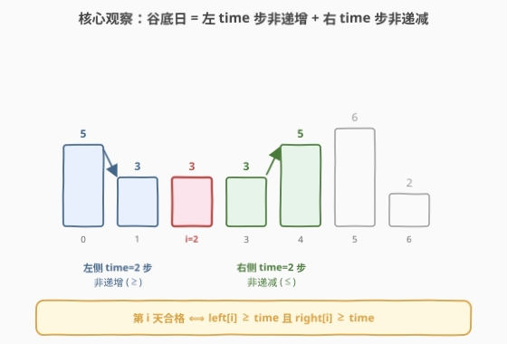
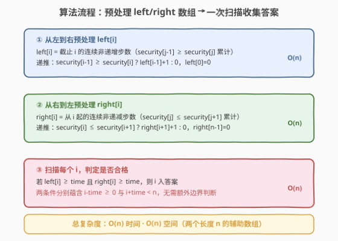

# LeetCode 适合野炊的日子 题解

## 1. 题目概述

- **标题 / 题号**：适合野炊的日子（#2100，medium）
- **链接**：https://leetcode.cn/problems/find-good-days-to-rob-the-bank/
- **难度**：中等
- **标签**：数组、动态规划、前缀和

**题意**：给定下标从 **0** 开始的整数数组 `security`，`security[i]` 表示第 `i` 天的建议出行指数。另给整数 `time`。第 `i` 天称为**适合野炊的日子**，当且仅当满足全部条件：

- 第 `i` 天前、后都**至少有 `time` 天**；
- 第 `i` 天前连续 `time` 天出行指数**非递增**：`security[i-time] >= security[i-time+1] >= ... >= security[i]`；
- 第 `i` 天后连续 `time` 天出行指数**非递减**：`security[i] <= ... <= security[i+time-1] <= security[i+time]`。

返回包含**所有**适合野炊日子的下标数组，顺序任意。

**示例 1**：

```text
输入：security = [5,3,3,3,5,6,2], time = 2
输出：[2,3]
解释：
第 2 天：security[0] >= security[1] >= security[2] <= security[3] <= security[4]
第 3 天：security[1] >= security[2] >= security[3] <= security[4] <= security[5]
其余天不满足，故返回 [2,3]。
```

**示例 2**：

```text
输入：security = [1,1,1,1,1], time = 0
输出：[0,1,2,3,4]
解释：time = 0 时无需前后窗口，每一天都合格。
```

**示例 3**：

```text
输入：security = [1,2,3,4,5,6], time = 2
输出：[]
解释：数组严格递增，任意位置前 2 天都不非递增，无合格日。
```

**约束**：

- $1 \le \text{security.length} \le 10^5$
- $0 \le \text{security[i]}, \text{time} \le 10^5$

> 💡 **审题关键**：① 合格日的两侧各 `time` 天构成一个 **V 形谷底**——左侧非递增（下行/持平）、右侧非递减（上行/持平），`i` 恰在谷底；② `time` 可达 $10^5$，逐日 $O(\text{time})$ 校验会超时，必须**预处理**把每侧的连续趋势压缩成 $O(1)$ 可查的量。

## 2. 解题思路

### 2.1 暴力思路：逐日窗口扫描

对每个候选下标 `i`（满足 `i - time >= 0` 且 `i + time < n`），向左逐对检查 `security[j-1] >= security[j]` 是否在 `[i-time+1, i]` 内全部成立，向右逐对检查 `security[j] <= security[j+1]` 是否在 `[i, i+time-1]` 内全部成立。

- **正确性**：直接照定义判定，显然正确。
- **效率**：候选约 $n$ 个，每个 $O(\text{time})$ 校验，总计 $O(n \cdot \text{time})$。当 `time` 与 `n` 同阶（均 $10^5$）时达到 $10^{10}$，严重超时。

> ⚠️ 暴力的浪费在于：相邻候选日 `i` 与 `i+1` 的左右窗口高度重叠，"非递增/非递减"的判定被重复计算了 $O(\text{time})$ 次。把每个位置上的趋势信息**一次性预处理**并复用，即可把单次判定降到 $O(1)$。

### 2.2 核心观察：预处理两个连续趋势数组



关键直觉分三层：

**1. 趋势是局部可传递的**。"非递增"是相邻关系 `security[j-1] >= security[j]` 的连续累计。若以 `left[i]` 记录**截止 `i` 的连续非递增步数**，则它只依赖上一个状态：

$$\text{left}[i] = \begin{cases} 0, & i = 0 \\ \text{left}[i-1] + 1, & \text{security}[i-1] \ge \text{security}[i] \\ 0, & \text{otherwise} \end{cases}$$

同理定义 `right[i]` 为**从 `i` 起向右的连续非递减步数**，从右向左递推：

$$\text{right}[i] = \begin{cases} 0, & i = n-1 \\ \text{right}[i+1] + 1, & \text{security}[i] \le \text{security}[i+1] \\ 0, & \text{otherwise} \end{cases}$$

**2. 两个量直接刻画合格条件**。`left[i]` 表示"以 `i` 为终点的非递增段长度"，恰好对应"第 `i` 天前有 `left[i]` 天连续非递增"。因此 `left[i] >= time` ⇔ 左侧窗口满足非递增要求；`right[i] >= time` ⇔ 右侧窗口满足非递减要求。

**3. 边界自动蕴含**。`left[i] >= time` 意味着 `i` 之前至少有 `time` 个非递增步，即 `i - time >= 0`；`right[i] >= time` 意味着 `i` 之后至少有 `time` 个非递减步，即 `i + time < n`。故无需单独写边界判断。

$$\boxed{\text{第 } i \text{ 天合格} \iff \text{left}[i] \ge \text{time} \;\wedge\; \text{right}[i] \ge \text{time}}$$

> 💡 **为什么这种 DP 成立？** "连续非递增步数"具有最优子结构：`i` 处的连续段要么由 `i-1` 处的连续段延长一步得来，要么因趋势中断而归零。这是典型的"以位置为阶段、以连续计数为状态"的一维 DP，与 [300. 最长递增子序列](../0201-0300/300_最长递增子序列.md) 的"连续"退化版同构（LIS 允许跳过元素，本题要求严格连续，故状态转移更简单）。

### 2.3 算法流程图



**完整步骤**：

1. **预处理 `left`**：从左到右一遍扫描，按上式递推填满 `left[0..n-1]`。
2. **预处理 `right`**：从右到左一遍扫描，按上式递推填满 `right[0..n-1]`。
3. **扫描收集**：对每个 `i`，若 `left[i] >= time` 且 `right[i] >= time`，把 `i` 加入答案。

> ⚠️ **方向别搞反**：`left` 从左向右递推（依赖 `left[i-1]`），`right` 从右向左递推（依赖 `right[i+1]`）。两者方向相反，因为它们分别描述"以 `i` 为终点"和"以 `i` 为起点"的连续段。

### 2.4 示例演算

以示例 1（`security = [5,3,3,3,5,6,2]`, `time = 2`）逐步演算：

![示例演算：security = [5,3,3,3,5,6,2], time = 2](../images/2100_example_walkthrough.svg)

**步骤 ① 预处理 `left`（从左到右）**：

| `i` | `security[i-1] vs security[i]` | `left[i]` | 说明 |
|-----|-------------------------------|-----------|------|
| 0   | —（起点）                      | 0         | 无前驱 |
| 1   | 5 ≥ 3 ✓                       | 1         | 延续 |
| 2   | 3 ≥ 3 ✓                       | 2         | 延续 |
| 3   | 3 ≥ 3 ✓                       | 3         | 延续 |
| 4   | 3 ≥ 5 ✗                       | 0         | 中断 |
| 5   | 5 ≥ 6 ✗                       | 0         | 中断 |
| 6   | 6 ≥ 2 ✓                       | 1         | 重启 |

`left = [0,1,2,3,0,0,1]`

**步骤 ② 预处理 `right`（从右到左）**：

| `i` | `security[i] vs security[i+1]` | `right[i]` | 说明 |
|-----|-------------------------------|------------|------|
| 6   | —（终点）                      | 0          | 无后继 |
| 5   | 6 ≤ 2 ✗                       | 0          | 中断 |
| 4   | 5 ≤ 6 ✓                       | 1          | 延续 |
| 3   | 3 ≤ 5 ✓                       | 2          | 延续 |
| 2   | 3 ≤ 3 ✓                       | 3          | 延续 |
| 1   | 3 ≤ 3 ✓                       | 4          | 延续 |
| 0   | 5 ≤ 3 ✗                       | 0          | 中断 |

`right = [0,4,3,2,1,0,0]`

**步骤 ③ 扫描收集（`time = 2`）**：

| `i` | `left[i]` | `right[i]` | 合格？ |
|-----|-----------|------------|--------|
| 0   | 0         | 0          | ✗ |
| 1   | 1         | 4          | ✗（left 不足） |
| 2   | 2         | 3          | ✓ |
| 3   | 3         | 2          | ✓ |
| 4   | 0         | 1          | ✗ |
| 5   | 0         | 0          | ✗ |
| 6   | 1         | 0          | ✗ |

**答案 = `[2, 3]`** ✓

> 💡 **对照示例 2**（`time = 0`）：`time = 0` 时条件 `left[i] >= 0` 与 `right[i] >= 0` 恒成立，故所有下标都合格，返回 `[0,1,2,3,4]`。算法无需特判 `time = 0`。

## 3. 参考代码

### C++

```cpp
class Solution {
public:
    vector<int> goodDaysToRobBank(vector<int>& security, int time) {
        int n = security.size();
        vector<int> left(n, 0);   // 截止 i 的连续非递增步数
        vector<int> right(n, 0);  // 从 i 起的连续非递减步数

        // ① 从左到右预处理 left
        for (int i = 1; i < n; ++i) {
            if (security[i - 1] >= security[i]) {
                left[i] = left[i - 1] + 1;
            }
        }
        // ② 从右到左预处理 right
        for (int i = n - 2; i >= 0; --i) {
            if (security[i] <= security[i + 1]) {
                right[i] = right[i + 1] + 1;
            }
        }
        // ③ 扫描收集答案
        vector<int> ans;
        for (int i = 0; i < n; ++i) {
            if (left[i] >= time && right[i] >= time) {
                ans.push_back(i);
            }
        }
        return ans;
    }
};
```

### Python

```python
class Solution:
    def goodDaysToRobBank(self, security: List[int], time: int) -> List[int]:
        n = len(security)
        left = [0] * n   # 截止 i 的连续非递增步数
        right = [0] * n  # 从 i 起的连续非递减步数

        # ① 从左到右预处理 left
        for i in range(1, n):
            if security[i - 1] >= security[i]:
                left[i] = left[i - 1] + 1
        # ② 从右到左预处理 right
        for i in range(n - 2, -1, -1):
            if security[i] <= security[i + 1]:
                right[i] = right[i + 1] + 1
        # ③ 扫描收集答案
        return [i for i in range(n) if left[i] >= time and right[i] >= time]
```

> 💡 **代码要点**：① `left`/`right` 初始化全 0，递推时只在趋势成立处累加，否则保持 0（隐式归零）；② 两趟预处理方向相反——`left` 向右扫依赖 `i-1`，`right` 向左扫依赖 `i+1`；③ 收集阶段用列表推导（Python）/循环 `push_back`（C++）一次性遍历，三趟总计 $O(n)$。

> ⚠️ **空间可优化但意义不大**：`right` 可在收集阶段"边算边用"以省一个数组，但会牺牲代码清晰度。$n \le 10^5$ 时两个 `int` 数组约 $0.8\text{ MB}$，完全可接受，优先保证可读性。

## 4. 复杂度分析

| 维度 | 复杂度 | 说明 |
|------|--------|------|
| 时间复杂度 | $O(n)$ | 三趟线性扫描：预处理 `left` $O(n)$ + 预处理 `right` $O(n)$ + 收集答案 $O(n)$，总计 $O(3n) = O(n)$ |
| 空间复杂度 | $O(n)$ | 两个长度为 $n$ 的辅助数组 `left`、`right`；不计返回的答案数组 |

> 💡 **为何时间是 $O(n)$ 而非 $O(n \cdot \text{time})$？** 关键在于把"每个位置 $O(\text{time})$ 的窗口校验"通过 DP 压缩成"每个位置 $O(1)$ 的状态递推 + $O(1)$ 的判定"。趋势信息在相邻位置间复用：`left[i]` 直接继承 `left[i-1]`，无需重扫窗口。这是**用空间换时间 + 利用子结构复用**的典型范式。

## 5. 扩展：滚动合并为单趟预处理

上述解法用两趟方向相反的扫描分别填 `left` 与 `right`。可以观察到：`right` 的递推只依赖"右侧邻居"，与 `left` 的填充互不干扰，但二者方向相反无法合并成单趟。若追求**极致空间**，可在收集阶段从右向左同时维护 `right` 的滚动值：

```cpp
class Solution {
public:
    vector<int> goodDaysToRobBank(vector<int>& security, int time) {
        int n = security.size();
        vector<int> left(n, 0);
        for (int i = 1; i < n; ++i) {
            if (security[i - 1] >= security[i]) left[i] = left[i - 1] + 1;
        }
        vector<int> ans;
        int right = 0;  // 滚动：当前 i 起的连续非递减步数
        for (int i = n - 1; i >= 0; --i) {
            // 维护 right：i 与 i+1 的关系
            if (i < n - 1 && security[i] <= security[i + 1]) {
                ++right;
            } else if (i < n - 1) {
                right = 0;
            } else {
                right = 0;  // i == n-1
            }
            if (left[i] >= time && right >= time) ans.push_back(i);
        }
        reverse(ans.begin(), ans.end());
        return ans;
    }
};
```

该版本只保留 `left` 数组，`right` 改为单变量滚动，空间降为 $O(n)$（仅 `left`）→ 渐近仍 $O(n)$，但常数减半。代价是收集顺序倒序，需最后反转。逻辑等价，**仅作空间优化展示**，面试中优先讲清两数组版。

> 💡 **面试策略**：先讲清两数组版（逻辑最直观、左右对称、不易出错），再提滚动版展示对空间优化的思考。核心的"预处理连续趋势 + $O(1)$ 判定"思想两版完全一致。

## 6. 面试要点

**Q1：为什么 `left[i] >= time` 能同时保证"前 `time` 天非递增"和"`i - time >= 0`"两个条件？**

> `left[i]` 定义为"截止 `i` 的连续非递增步数"，即最大的 $k$ 使 `security[i-k] >= ... >= security[i]` 成立。`left[i] >= time` 直接说明存在长度 $\ge \text{time}$ 的非递增段以 `i` 为终点，即前 `time` 天（`[i-time, i]`）非递增。同时这段的起点 `i - left[i]` 必须 $\ge 0$，而 `left[i] >= time` 蕴含 `i - time >= i - left[i] >= 0`，边界自动满足。

**Q2：为什么不能只预处理一个数组（例如只算 `left`）？**

> 合格条件是"左非递增"与"右非递减"的**合取**，两者方向不同、互相独立。`left` 只描述以 `i` 为终点的左向趋势，对右向趋势一无所知。例如 `security = [5,4,3,2,1]`（严格递减），所有位置 `left` 都很大，但 `right` 全为 0——右非递减条件处处不满足，`time > 0` 时答案为空。必须再预处理 `right` 才能正确判定。

**Q3：`time = 0` 时算法为何无需特判？**

> `time = 0` 时条件变为 `left[i] >= 0` 且 `right[i] >= 0`。由于 `left`、`right` 的取值天然非负（递推从 0 起累加），两个条件对所有 `i` 恒成立，算法自然返回 `[0, 1, ..., n-1]`。无需单独处理 `time = 0` 的分支，体现了 DP 解法对边界情形的鲁棒性。

**Q4：暴力 $O(n \cdot \text{time})$ 在什么数据规模下会超时？**

> $n, \text{time} \le 10^5$。最坏情形（如 `security` 全相等，所有候选都合格）暴力需对约 $n - 2\cdot\text{time}$ 个候选各做 $2\cdot\text{time}$ 次比较，约 $2 \cdot 10^{10}$ 次操作，远超 1 秒限制（约 $10^8$ 量级）。预处理 DP 把单次判定从 $O(\text{time})$ 降到 $O(1)$，总开销降至 $3 \cdot 10^5$，安全通过。

**Q5：本题与"前缀和"的关联是什么？**

> `left`/`right` 本质是**带中断重置的前缀计数**——普通前缀和是单调累加（`prefix[i] = prefix[i-1] + a[i]`），而本题在趋势中断时归零再重启。可视为"条件前缀和"：累加项是布尔量 `security[i-1] >= security[i]`，但一旦该量为 0 就清空累计。这种"连续段计数"模式在 [845. 数组中的最长山脉](https://leetcode.cn/problems/longest-mountain-in-array/)、[821. 字符的最短距离](https://leetcode.cn/problems/shortest-distance-to-a-character/) 等题中反复出现。

> 💡 **一句话总结**：两趟方向相反的一维 DP 预处理"以 `i` 为终点的左非递增步数"和"以 `i` 为起点的右非递减步数"，再一趟扫描按 `left[i] >= time ∧ right[i] >= time` 收集答案 → $O(n)$ 时间、$O(n)$ 空间。

## 同类练习题

| # | 题目 | 与本题的关联 |
|---|------|-------------|
| 845 | [数组中的最长山脉](https://leetcode.cn/problems/longest-mountain-in-array/) | 同样是"左非递增 + 右非递减"的 V 形结构，但要求最长山脉长度而非枚举谷底——对照理解"判定每个位置"与"求最长段"两种问法下的连续段 DP 用法 |
| 1394 | [找出数组中的幸运数](https://leetcode.cn/problems/find-lucky-integer-in-an-array/) | 同为数组预处理 + 一次扫描收集，但用频次表而非连续趋势，对比"计数型预处理"与"趋势型预处理" |
| 152 | [乘积最大子数组](../0101-0200/152_乘积最大子数组.md)（[题解](../0101-0200/152_乘积最大子数组.md)） | 一维 DP + 相邻位置状态传递的经典题，巩固"以位置为阶段、用前驱状态递推"的思路 |
| 300 | [最长递增子序列](../0201-0300/300_最长递增子序列.md)（[题解](../0201-0300/300_最长递增子序列.md)） | 一维 DP 的母题，对照理解"严格连续"（本题，转移 $O(1)$）与"允许跳过"（LIS，转移 $O(n)$ 或二分 $O(\log n)$）的区别 |
| 821 | [字符的最短距离](https://leetcode.cn/problems/shortest-distance-to-a-character/) | 两趟方向相反的扫描（从左、从右各一遍）合并得到每个位置的答案，与本题"左扫填 left、右扫填 right"的对称双扫结构同构 |
