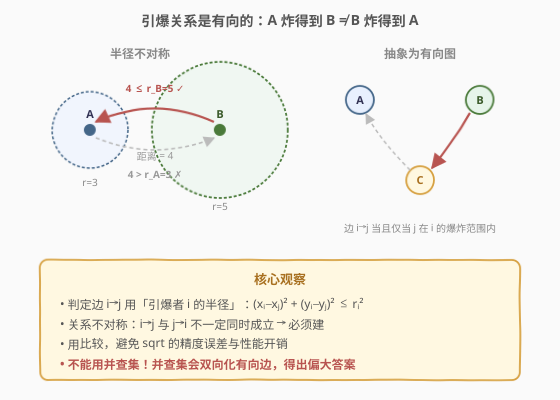
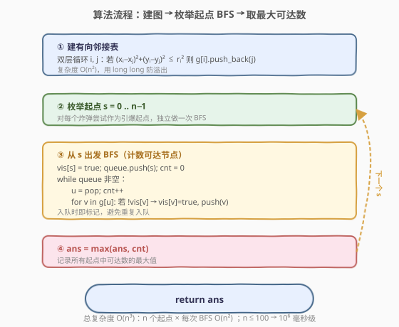
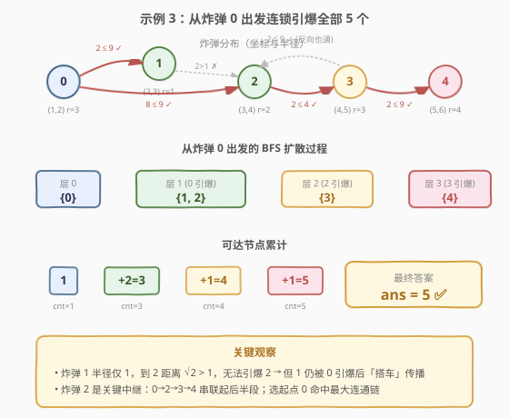

# 引爆最多的炸弹

- **题目名称**：引爆最多的炸弹
- **链接**：[2101. 引爆最多的炸弹](https://leetcode.cn/problems/detonate-the-maximum-bombs/)
- **难度**：中等
- **标签**：图、广度优先搜索、深度优先搜索

## 1. 题目概述

给定 `n` 个炸弹 `bombs[i] = [xi, yi, ri]`，其中 `(xi, yi)` 是炸弹坐标、`ri` 是爆炸半径。任选**一个**炸弹引爆，爆炸范围内的所有炸弹会被连锁引爆，链式传播。返回在只引爆一个炸弹的前提下，**最多**能引爆的炸弹数目。

**示例 1**：

```text
输入：bombs = [[2,1,3],[6,1,4]]
输出：2
解释：右炸弹 (6,1,r=4) 距左炸弹 (2,1) 为 4 ≤ 4，能引爆左炸弹；反之左炸弹半径 3，距离 4 > 3 引爆不了右炸弹。
```

**示例 2**：

```text
输入：bombs = [[1,1,5],[10,10,5]]
输出：1
解释：两炸弹距离 √162 ≈ 12.73，均大于 5，互不可达。
```

**示例 3**：

```text
输入：bombs = [[1,2,3],[2,3,1],[3,4,2],[4,5,3],[5,6,4]]
输出：5
解释：从炸弹 0 出发：0→{1,2}，2→3，3→4，连锁引爆全部 5 个。
```

**约束条件**：

- $1 \le \text{bombs.length} \le 100$
- $\text{bombs[i].length} = 3$
- $1 \le x_i, y_i, r_i \le 10^5$

> ⚠️ 关键陷阱：**引爆关系是有向的、不对称的**。炸弹 A 半径大可能炸到 B，但 B 半径小未必能炸到 A——因为判定用的是「**引爆者**的半径」与「两者距离」比较。把它当成无向图做并查集会得到错误答案。

---

## 2. 解题思路

### 2.1 暴力思路：模拟连锁引爆

最直觉的做法：枚举每个炸弹作为起点，模拟「引爆 → 收集爆炸范围内的炸弹 → 它们再引爆」的过程，直到没有新炸弹加入，统计被引爆数量，取最大值。

这其实就是正解——只要「爆炸范围判断」和「连锁传播」实现正确，复杂度在 $n \le 100$ 下完全可接受。问题转化为：**如何高效表达「谁能炸到谁」**。

### 2.2 核心观察：有向图 + 传递闭包



把每个炸弹看作图中一个节点。若炸弹 `i` 引爆后能**直接**触发炸弹 `j`，则连一条有向边 $i \to j$。判定条件为：

$$
(x_i - x_j)^2 + (y_i - y_j)^2 \le r_i^2
$$

注意右边用的是**引爆者 `i` 的半径**，所以 $i \to j$ 与 $j \to i$ **不一定同时成立**——这就是有向图的来源。

> 💡 **避免浮点开方**：直接比较平方距离 $\Delta x^2 + \Delta y^2$ 与 $r_i^2$，避免 `sqrt` 带来的精度误差与性能开销。坐标和半径都 $\le 10^5$，平方后 $\le 10^{10}$，用 64 位整数（`long long` / Python int）安全。

建好有向图后，问题等价于：**在所有起点中，找到可达节点数最多的那个**。对每个起点做一次 BFS/DFS 即可。

### 2.3 算法流程图



整体两步：**双层循环建邻接表 → 枚举每个起点 BFS 计数取 max**。建图 $O(n^2)$，每个起点 BFS 最坏 $O(n + m) = O(n^2)$，$n$ 个起点合计 $O(n^3)$，$n=100$ 时约 $10^6$ 次操作，毫秒级完成。

### 2.4 示例演算

以示例 3 `bombs = [[1,2,3],[2,3,1],[3,4,2],[4,5,3],[5,6,4]]` 为例：



**建图**（逐一计算 $\Delta x^2 + \Delta y^2 \le r_i^2$）：

| 边 $i \to j$ | $\Delta x^2 + \Delta y^2$ | $r_i^2$ | 是否可达 |
|--------------|---------------------------|---------|----------|
| $0 \to 1$ | $1+1=2$ | $9$ | ✅ |
| $0 \to 2$ | $4+4=8$ | $9$ | ✅ |
| $1 \to 2$ | $1+1=2$ | $1$ | ❌（$2>1$） |
| $2 \to 3$ | $1+1=2$ | $4$ | ✅ |
| $3 \to 4$ | $1+1=2$ | $9$ | ✅ |
| $3 \to 2$ | $1+1=2$ | $9$ | ✅（反向也通） |

**从炸弹 0 出发 BFS**：

| 层 | 出发节点 | 新引爆 | 队列 |
|----|----------|--------|------|
| 0 | {0} | — | [0] |
| 1 | 0 | {1, 2} | [1, 2] |
| 2 | 1, 2 | {3}（2→3） | [3] |
| 3 | 3 | {4}（3→4） | [4] |
| 4 | 4 | — | [] |

最终从 0 出发可达 5 个节点，即答案 5 ✅。

---

## 3. 参考代码

### C++

```cpp
class Solution {
  public:
    int maximumDetonation(vector<vector<int>>& bombs) {
        int n = bombs.size();
        // 建有向邻接表：i -> j 当且仅当 j 在 i 的爆炸范围内
        vector<vector<int>> g(n);
        for (int i = 0; i < n; i++) {
            long long ri = bombs[i][2];
            for (int j = 0; j < n; j++) {
                if (i == j) continue;
                long long dx = bombs[i][0] - bombs[j][0];
                long long dy = bombs[i][1] - bombs[j][1];
                if (dx * dx + dy * dy <= ri * ri) g[i].push_back(j);
            }
        }

        int ans = 0;
        for (int s = 0; s < n; s++) {
            vector<char> vis(n, 0);
            queue<int> q;
            q.push(s);
            vis[s] = 1;
            int cnt = 0;
            while (!q.empty()) {
                int u = q.front(); q.pop();
                cnt++;
                for (int v : g[u])
                    if (!vis[v]) {
                        vis[v] = 1;
                        q.push(v);
                    }
            }
            ans = max(ans, cnt);
        }
        return ans;
    }
};
```

### Python

```python
from collections import deque
from typing import List

class Solution:
    def maximumDetonation(self, bombs: List[List[int]]) -> int:
        n = len(bombs)
        g = [[] for _ in range(n)]
        for i in range(n):
            xi, yi, ri = bombs[i]
            for j in range(n):
                if i == j:
                    continue
                dx = xi - bombs[j][0]
                dy = yi - bombs[j][1]
                if dx * dx + dy * dy <= ri * ri:
                    g[i].append(j)

        def bfs(start: int) -> int:
            vis = [False] * n
            vis[start] = True
            q = deque([start])
            cnt = 0
            while q:
                u = q.popleft()
                cnt += 1
                for v in g[u]:
                    if not vis[v]:
                        vis[v] = True
                        q.append(v)
            return cnt

        return max(bfs(s) for s in range(n))
```

> 💡 **入队时即标记 `vis`**，而非出队时标记——避免同一节点被多次入队导致重复处理甚至无限循环。这是 BFS 的基本卫生习惯。

---

## 4. 复杂度分析

| 维度 | 复杂度 | 说明 |
|------|--------|------|
| 时间复杂度 | $O(n^3)$ | 建图 $O(n^2)$（双层全对距离判定）；$n$ 个起点各做一次 BFS，单次最坏 $O(n + m) = O(n^2)$（稠密图 $m = O(n^2)$），合计 $O(n^3)$ |
| 空间复杂度 | $O(n^2)$ | 邻接表最坏存 $O(n^2)$ 条边；BFS 的 `vis`/队列 $O(n)$ |

> ⚠️ $n \le 100$ 时 $n^3 = 10^6$，毫秒级完成。若 $n$ 放大到 $10^3$ 以上，需改用 Floyd-Warshall 传递闭包的位运算优化（见第 5 节）或更聪明的图论方法。

---

## 5. 扩展：Floyd-Warshall 传递闭包

当 $n$ 较大时，可一次性算出**任意两点的可达关系**，避免 $n$ 次独立 BFS。用 Floyd-Warshall 求传递闭包：

$$
\text{reach}[i][j] = \text{reach}[i][j] \lor (\text{reach}[i][k] \land \text{reach}[k][j])
$$

```cpp
class Solution {
  public:
    int maximumDetonation(vector<vector<int>>& bombs) {
        int n = bombs.size();
        vector<vector<char>> reach(n, vector<char>(n, 0));
        for (int i = 0; i < n; i++) {
            long long ri = bombs[i][2];
            for (int j = 0; j < n; j++) {
                long long dx = bombs[i][0] - bombs[j][0];
                long long dy = bombs[i][1] - bombs[j][1];
                if (dx * dx + dy * dy <= ri * ri) reach[i][j] = 1;
            }
        }
        // Floyd-Warshall 传递闭包
        for (int k = 0; k < n; k++)
            for (int i = 0; i < n; i++)
                if (reach[i][k])
                    for (int j = 0; j < n; j++)
                        if (reach[k][j]) reach[i][j] = 1;

        int ans = 0;
        for (int i = 0; i < n; i++) {
            int cnt = 0;
            for (int j = 0; j < n; j++) cnt += reach[i][j];
            ans = max(ans, cnt);
        }
        return ans;
    }
};
```

**两种解法对比**：

| 维度 | 枚举起点 BFS | Floyd-Warshall 闭包 |
|------|--------------|---------------------|
| 时间 | $O(n^3)$ | $O(n^3)$ |
| 空间 | $O(n^2)$ 邻接表 | $O(n^2)$ 布尔矩阵 |
| 常数 | BFS 单次只扫可达子集，稀疏图更快 | 三重循环全量计算，稠密图稳定 |
| 可读性 | 直观，模拟连锁反应 | 矩阵运算，紧凑 |
| 可优化 | — | 可用 `bitset` 压缩到 $O(n^3/w)$，$w=64$ |

> 💡 当 $n$ 增大到几百时，Floyd + `bitset` 是经典加速手段——把内层 `for j` 换成一次按位 OR，复杂度降到 $O(n^3 / 64)$。

---

## 6. 面试要点

1. **为什么引爆关系是有向的？**

   - 边 $i \to j$ 的判定用的是**引爆者 `i` 的半径** $r_i$。若 $r_i$ 很大、$r_j$ 很小，可能出现 $i$ 能炸到 $j$ 但 $j$ 炸不到 $i$。把它当无向图用并查集会把这种不对称关系错误地双向化，得出偏大的答案。

2. **为什么用平方距离而不是开方？**

   - 一是避免 `sqrt` 的浮点精度误差——坐标 $\le 10^5$ 时两坐标差平方和 $\le 2 \times 10^{10}$，`long long` 完全精确；二是省去开方运算，常数更小。比较 $\Delta x^2 + \Delta y^2 \le r^2$ 与 $\sqrt{\Delta x^2 + \Delta y^2} \le r$ 在数学上等价，工程上前者更稳更快。

3. **BFS 和 DFS 哪个更合适？**

   - 本题只关心可达性（能否引爆），不关心引爆顺序或层级，BFS 和 DFS 都正确。BFS 用队列、DFS 用栈或递归，递归 DFS 在 $n=100$ 时栈深最多 100 层，安全。工业代码里 BFS 通常更直观、无栈溢出风险，推荐。

4. **复杂度 $O(n^3)$ 在 $n=100$ 下够用吗？**

   - $100^3 = 10^6$，加上常数极小（整数乘加 + 数组访问），C++ 端约 1ms 级。Python 端略慢但 $10^6$ 次纯整数运算仍在 100ms 内，可通过。约束 $n \le 100$ 正是为 $O(n^3)$ 设计的甜区。

5. **能否用并查集？**

   - **不能直接用标准并查集**。并查集表达的是无向连通关系，会把不对称的有向边错误地双向化。若坚持用并查集，需对每个起点独立建一次并查集做「定向连通」（其实是退化为 BFS），失去了并查集的优势。本题的本质是**有向图可达性**，BFS/Floyd 才是正确工具。

> 💡 **一句话总结**：判定 $i \to j$ 用「平方距离 $\le r_i^2$」建**有向图**，枚举每个起点 BFS 取最大可达数。避免开方、避免无向化、避免并查集——三个最常见的踩坑点。

---

## 7. 同类练习题

- [207. 课程表](https://leetcode.cn/problems/course-schedule/)：有向图判环 / 拓扑排序，本题的有向图建模基础
- [743. 网络延迟时间](https://leetcode.cn/problems/network-delay-time/)：有向图单源最短路径，与本题「从单源出发的可达性」同源但加上了路径长度
- [994. 腐烂的橘子](https://leetcode.cn/problems/rotting-oranges/)：多源 BFS 链式传播，与本题连锁引爆模型一致，区别在网格图 vs 一般图
- [547. 省份数量](https://leetcode.cn/problems/number-of-provinces/)：**无向图**连通分量计数，对照本题理解「有向 vs 无向」对算法选择的影响
- [1462. 课程表 IV](https://leetcode.cn/problems/course-schedule-iv/)：有向图传递闭包判断可达性，Floyd-Warshall 的直接应用
