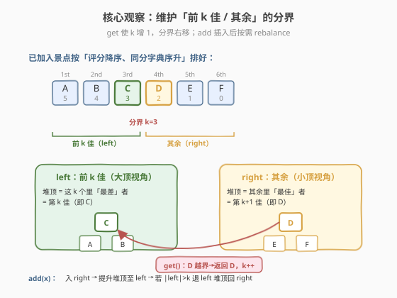
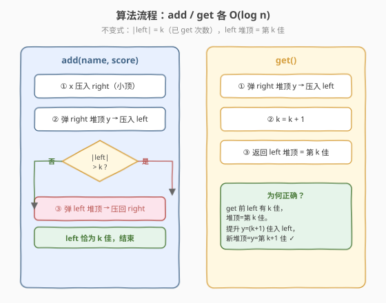
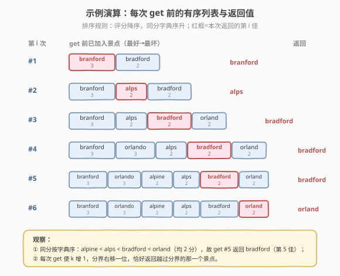

# 序列顺序查询

- **题目名称**：序列顺序查询
- **链接**：[2102. 序列顺序查询](https://leetcode.cn/problems/sequentially-ordinal-rank-tracker/)
- **难度**：困难
- **标签**：设计、堆（优先队列）、有序集合、数据流

## 1. 题目概述

一个观光景点由**名字** `name` 和**评分** `score` 组成，`name` 在所有景点中**唯一**，`score` 为整数。景点按「好到坏」排序，规则是：

- 评分**越高**越好；
- 评分相同时，**字典序较小**的更好。

要求设计 `SORTracker` 类，支持：

- `void add(name, score)`：向系统中添加一个景点。
- `string get()`：查询当前已添加景点中**第 $i$ 好**的景点名字，其中 $i$ 是「到目前为止（含本次）调用 `get` 的次数」。

> 例如第 4 次调用 `get()`，就返回当前所有景点里第 4 好的名字。题目保证任意查询时刻，查询次数都不超过系统中景点数目。

**示例**：

```text
输入：
["SORTracker", "add", "add", "get", "add", "get", "add", "get", "add", "get", "add", "get", "get"]
[[], ["bradford", 2], ["branford", 3], [], ["alps", 2], [], ["orland", 2], [], ["orlando", 3], [], ["alpine", 2], [], []]
输出：
[null, null, null, "branford", null, "alps", null, "bradford", null, "bradford", null, "bradford", "orland"]

解释：
add("bradford", 2); add("branford", 3);
get() // 第 1 次：排序 branford(3), bradford(2) → 返回第 1 好 "branford"
add("alps", 2);
get() // 第 2 次：排序 branford(3), alps(2), bradford(2) → "alps" 字典序小于 "bradford"，故第 2 好 = "alps"
add("orland", 2);
get() // 第 3 次：排序 branford, alps, bradford, orland → 第 3 好 = "bradford"
add("orlando", 3);
get() // 第 4 次：排序 branford(3), orlando(3), alps(2), bradford(2), orland(2) → 第 4 好 = "bradford"
add("alpine", 2);
get() // 第 5 次：排序 branford, orlando, alpine(2), alps(2), bradford(2), orland(2) → 第 5 好 = "bradford"
get() // 第 6 次：第 6 好 = "orland"
```

**约束条件**：

- `name` 只包含小写英文字母，且每个景点名字互不相同。
- $1 \le \text{name.length} \le 10$
- $1 \le \text{score} \le 10^5$
- 任意时刻，调用 `get` 的次数都不超过调用 `add` 的次数。
- 总共调用 `add` 和 `get` 不超过 $4 \times 10^4$。

> 💡 **审题关键**：① `get` 返回的排名 $i$ **随调用次数递增**——第 1 次要第 1 好，第 2 次要第 2 好……相当于一个**单调右移的分界指针**；② 排序键是「评分降序 + 同分名字字典序升」，复合比较；③ `add` 与 `get` 交错到来，是典型的**在线数据流**问题，需要支持动态插入 + 动态查询第 $k$ 大（$k$ 单调增）。

---

## 2. 解题思路

### 2.1 暴力思路：每次查询全量排序

用一个数组存所有 `(score, name)`。`add` 直接 append；`get` 时把整个数组按规则排序，取第 $i$ 个。

- **正确性**：显然正确。
- **效率**：`add` $O(1)$，但每次 `get` 要 $O(n \log n)$ 排序；总调用 $4 \times 10^4$，整体可达 $O(q \cdot n \log n) \approx 10^9$，**超时**。
- 即使用插入排序维护有序数组（`add` $O(n)$ 插入 + `get` $O(1)$ 索引），`add` 累计仍是 $O(q \cdot n) \approx 1.6 \times 10^9$，同样不可接受。

> ⚠️ 瓶颈在于「每次只前进一名」的查询却被退化成全量重排。突破口是**只维护分界点附近的状态**，让插入和查询都只花 $O(\log n)$。

### 2.2 核心观察：维护「前 $k$ 佳 / 其余」的分界

把所有已加入景点按规则排好，设想一道**分界线**划在第 $k$ 名与第 $k+1$ 名之间（$k$ = 已 `get` 次数）：

- **左侧**（前 $k$ 佳）：我们需要快速拿到其中**最差**的那个 = 第 $k$ 佳（即本次 `get` 要返回的下一个，当 $k$ 增 1 时的返回值）。确切地说，`get` 会让分界右移一位，返回**越过分界**的那个景点。
- **右侧**（其余）：我们需要快速拿到其中**最佳**的那个 = 第 $k+1$ 佳（`get` 时它要越过分界进入左侧）。

于是问题转化为：**动态维护两个集合的堆顶，并支持 $O(\log n)$ 跨堆搬运**。这正是**双堆**（或**有序集合 + 迭代器**）的招牌场景：

- `left`：一个「**大顶视角**」的堆，存前 $k$ 佳，堆顶 = 这 $k$ 个里最差的 = 第 $k$ 佳；
- `right`：一个「**小顶视角**」的堆，存其余，堆顶 = 其余里最佳的 = 第 $k+1$ 佳。



> 💡 **不变式**：`|left| == k`，`left` 堆顶 = 第 $k$ 佳，`right` 堆顶 = 第 $k+1$ 佳。`get` 只需把 `right` 堆顶搬到 `left`，$k$ 自增，返回新 `left` 堆顶；`add` 先入 `right`，再把 `right` 堆顶提升进 `left`，若 `|left| > k` 就把 `left` 堆顶退回 `right`——一次插入至多两次堆操作。

**复合比较的处理**：排序键是「评分降序 + 名字字典序升」。Python 标准库 `heapq` 是小顶堆，字符串又不能直接取反，因此用两个轻量包装类分别定义 `__lt__`：

- `_Best`：`__lt__` 让「更好者更小」（评分大优先，同分名字小优先）→ `right` 小顶堆堆顶 = 最佳；
- `_Worst`：`__lt__` 让「更差者更小」（评分小优先，同分名字大优先）→ `left` 小顶堆堆顶 = 最差。

C++ 则可直接用 `multiset<pair<int,string>>` 存 `{-score, name}`（取负让升序 = 最好在前），再用一个**迭代器 `it`** 指向分界点（第 $k$ 佳），插入时按需 `--it` / `get` 时 `it++`，无需手写双堆。

### 2.3 算法流程图



**`add(name, score)`**（保持 `|left| == k`）：

1. 把 $x$ 压入 `right`；
2. 弹 `right` 堆顶 $y$，压入 `left`（让可能的新 $k$ 佳进入候选）；
3. 若 `|left| > k`，弹 `left` 堆顶压回 `right`（把多出来的最差者退回）。

**`get()`**（$k$ 增 1，返回新的第 $k$ 佳）：

1. 弹 `right` 堆顶 $y$，压入 `left`；
2. `k += 1`；
3. 返回 `left` 堆顶的 `name`（此时它正是第 $k$ 佳）。

> ⚠️ **正确性直觉**：`get` 前 `left` 装 $k$ 佳、堆顶 = 第 $k$ 佳。把 `right` 堆顶（第 $k+1$ 佳）搬进 `left` 后，`left` 变成 $k+1$ 佳，其中最差的恰好是这个新搬入者（它本就是 $k+1$ 名里最差的，比左侧 $k$ 个都差），于是新堆顶 = 第 $k+1$ 佳，正是本次要返回的。

### 2.4 示例演算

下表逐步展示示例中每次 `get` 调用前已加入景点的排序结果，红框为本次返回的第 $i$ 佳：



关键看点：

- **同分按字典序**：`alpine < alps < bradford < orland`（均为 2 分），故第 5 次返回 `bradford`（第 5 佳），第 6 次才到 `orland`。
- **分界单调右移**：每次 `get` 使 $k$ 增 1，分界右移一位，恰好返回越过分界的那个景点；`add` 只在分界附近做一次 rebalance。

---

## 3. 参考代码

### C++

```cpp
class SORTracker {
    // 存 {-score, name}：升序即「最好在前」；同分时名字字典序小者在前
    multiset<pair<int, string>> s;
    multiset<pair<int, string>>::iterator it;
public:
    SORTracker() : it(s.end()) {}          // it 指向「下一个 get 要返回的位置」= 第 k 佳

    void add(string name, int score) {
        auto p = make_pair(-score, name);
        // 若 p 比当前第 k 佳更好（会插到 it 之前），或 it 已到末尾（k==n），
        // 插入后第 k 佳整体后移一位，it 需左移一格以保持指向第 k 佳。
        if (it == s.end() || p < *it) {
            s.insert(p);
            --it;
        } else {
            s.insert(p);
        }
    }

    string get() {
        return it++->second;              // 返回第 k 佳，随后 k 自增（it 右移）
    }
};
```

> 💡 **迭代器稳定性**：`std::multiset` 是节点式容器，`insert` **不失效任何迭代器**（包括 `end()`），因此构造时保存的 `it` 在整个生命周期内安全可用。`it == s.end()` 涵盖两种情况：初始空集，或 $k$ 已追上 $n$（此前 `get` 返回过末位元素）。

### Python

```python
import heapq


class _Best:
    """升序=更好：评分大优先，同分字典序小优先。供 right 小顶堆。"""
    __slots__ = ('name', 'score')

    def __init__(self, name, score):
        self.name = name
        self.score = score

    def __lt__(self, o):
        if self.score != o.score:
            return self.score > o.score      # 评分高者「更小」=更优
        return self.name < o.name            # 同分名字小者「更小」=更优


class _Worst:
    """升序=更坏：评分小优先，同分字典序大优先。供 left 小顶堆。"""
    __slots__ = ('name', 'score')

    def __init__(self, name, score):
        self.name = name
        self.score = score

    def __lt__(self, o):
        if self.score != o.score:
            return self.score < o.score      # 评分低者「更小」=更差
        return self.name > o.name            # 同分名字大者「更小」=更差


class SORTracker:
    def __init__(self):
        self.left = []    # 小顶堆，存 _Worst；堆顶=前 k 佳中最差者=第 k 佳
        self.right = []   # 小顶堆，存 _Best； 堆顶=其余中最佳者=第 k+1 佳
        self.k = 0        # 已调用 get 的次数；不变式 |left| == k

    def add(self, name: str, score: int) -> None:
        heapq.heappush(self.right, _Best(name, score))
        b = heapq.heappop(self.right)                 # 候选的第 (k+1) 佳
        heapq.heappush(self.left, _Worst(b.name, b.score))
        if len(self.left) > self.k:                   # left 多了一个 → 退最差者回 right
            w = heapq.heappop(self.left)
            heapq.heappush(self.right, _Best(w.name, w.score))

    def get(self) -> str:
        b = heapq.heappop(self.right)                 # 第 (k+1) 佳越过分界
        heapq.heappush(self.left, _Worst(b.name, b.score))
        self.k += 1
        return self.left[0].name                      # 新堆顶=第 k 佳
```

> ⚠️ **为何用两个包装类？** 复合比较「评分降序 + 名字升序」无法用单个元组 + 取反统一表达（字符串不能取反）。`_Best` / `_Worst` 分别定义 `__lt__`，让 `heapq` 的两个小顶堆天然给出所需堆顶，跨堆搬运时只需用对方类重新包装同一份 `(name, score)`，逻辑清晰且无需手写比较函数。

---

## 4. 复杂度分析

| 维度 | 复杂度 | 说明 |
|------|--------|------|
| `add` 时间 | $O(\log n)$ | Python：至多 2 次 push + 1 次 pop；C++：一次 `multiset::insert` + 至多一次 `--it`，均 $O(\log n)$ |
| `get` 时间 | $O(\log n)$ | Python：1 次 pop + 1 次 push；C++：一次解引用 + `it++`，均摊 $O(\log n)$（迭代器自增本身 $O(1)$，但整体均摊） |
| 空间 | $O(n)$ | $n$ 为已加入景点数；两堆 / 有序集合各存一份引用，常数倍 |

> 💡 **总量核算**：设总调用次数 $N \le 4 \times 10^4$。每次 `add` / `get` 至多常数次堆（或平衡树）操作，总时间 $O(N \log N) \approx 4 \times 10^4 \times 17 \approx 7 \times 10^5$，远在限额内。

---

## 5. 扩展：双堆 vs 有序集合 + 迭代器

两种实现对应同一道「分界指针」思想，选型取决于语言设施：

| 维度 | 双堆（Python 方案） | 有序集合 + 迭代器（C++ 方案） |
|------|---------------------|------------------------------|
| 单次复杂度 | $O(\log n)$ | $O(\log n)$ |
| 额外状态 | `k` 计数 + 两个堆 | 一个迭代器 `it` |
| 跨结构搬运 | 每次需用对方类重新包装 | 无需搬运，`it` 直接指向分界 |
| 代码量 | 略多（两个包装类） | 极简（核心 3 行） |
| 适用语言 | 无平衡树时的通用解 | C++ / Java（`TreeSet`）/ Rust（`BTreeSet`） |

- **C++ 为何能更简洁**：`std::multiset` 的迭代器在插入后保持有效，`--it` / `it++` 即可移动分界，省去显式双堆与跨堆搬运。
- **Python 替代方案**：若力扣环境可用 `sortedcontainers.SortedList`，则 `add` 用 `bisect` 风格插入、维护一个下标 `i = k`、`get` 取 `sl[i]` 后 `i += 1`，逻辑等价于 C++ 的迭代器方案。但 `SortedList` 属第三方库，双堆方案更通用、不依赖环境。
- **退化为单堆的陷阱**：只用一个堆无法同时 $O(1)$ 取「第 $k$ 佳」与「第 $k+1$ 佳」两端；必须双堆或平衡树才能两端各 $O(1)$ 取顶、$O(\log n)$ 维护。

> 💡 面试中先讲双堆（展示对堆顶两端取值的理解），再提「有序集合 + 迭代器」作为有平衡树时的更优实现，体现「先正确后优化」的工程思维。

---

## 6. 面试要点

1. **为什么 `get` 的排名会变化？每次返回的是第几名？**

   - $i$ 是「到目前为止含本次的 `get` 调用次数」。第 1 次返回第 1 佳，第 2 次返回第 2 佳……即**返回名次随调用单调递增**。这等价于维护一个**单调右移的分界指针** $k$，每次 `get` 让 $k$ 增 1 并返回新越过界的那一个。

2. **双堆的不变式是什么？为什么 `get` 返回的就是第 $k$ 佳？**

   - 不变式：`|left| == k`，`left` 堆顶 = 第 $k$ 佳，`right` 堆顶 = 第 $k+1$ 佳。`get` 把 `right` 堆顶（第 $k+1$ 佳）搬入 `left`，此时 `left` 含 $k+1$ 佳，其中最差者正是这个新搬入者（它本就是 $k+1$ 名里最差的，比左侧 $k$ 个都差），于是新堆顶 = 第 $k+1$ 佳，正是本次要返回的第 $k$ 佳（$k$ 已自增）。

3. **`add` 里「先入 right、再提升、再退一个」为什么不直接判断 $x$ 该去哪边？**

   - 两种写法等价。「先入 right 再提升」的写法**不依赖与 `left` 堆顶的比较**，只用堆顶选举，逻辑更稳健、不易在复合比较上出错：提升的必然是当前 `right` 最佳，若它使 `left` 超员就把 `left` 最差退回，一次 rebalance 即恢复不变式。至多 2 push + 1 pop，仍 $O(\log n)$。

4. **C++ 方案里 `it == s.end()` 分支处理的是什么情况？**

   - 两种：① 初始空集，第一次 `add` 后让 `it` 指向 `begin`；② $k$ 已追上 $n$（之前某次 `get` 返回了末位元素，`it` 被自增到 `end`），此后再 `add` 时新元素必然落在当前第 $k$ 佳之前（因为新的第 $k$ 佳原本不存在），需要 `--it` 让它指向新末位。题目保证查询时 $k \le n$，故 `get` 时 `it` 必有效。

5. **复合比较「评分降序 + 名字字典序升」在两种语言里如何落地？**

   - C++：存 `{-score, name}`，`pair` 默认字典序升序恰好给出「$-score$ 小 = 评分大优先，同分名字小优先」。Python：字符串无法取反，故用 `_Best` / `_Worst` 两个类分别定义 `__lt__`，让两个小顶堆分别给出「最佳堆顶」与「最差堆顶」。

---

## 7. 同类练习题

- [295. 数据流的中位数](https://leetcode.cn/problems/find-median-from-data-stream/)：双堆协作（大顶存小一半 + 小顶存大一半）的母题，本题「双堆维护分界」的直接思想来源
- [703. 数据流中的第 K 大元素](https://leetcode.cn/problems/kth-largest-element-in-a-stream/)：固定 $k$ 的小顶堆，对比本题「$k$ 单调递增」需双堆/平衡树的原因
- [2034. 股票价格波动](https://leetcode.cn/problems/stock-price-fluctuation/)：双堆 + 延迟删除取最值，同属「设计题 + 堆」家族，对照本题无需延迟删除（无删除操作）
- [460. LFU 缓存](https://leetcode.cn/problems/lfu-cache/)：频率桶 + 双向链表的设计题，对比本题「双堆 vs 平衡树」的选型权衡
- [1801. 积压订单中的订单总数](https://leetcode.cn/problems/number-of-orders-in-the-backlog/)：双堆按价格匹配成交，本题的变体（两端堆顶交互更复杂）
