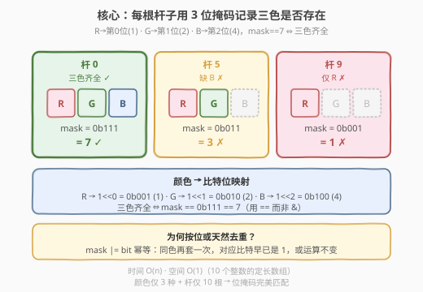
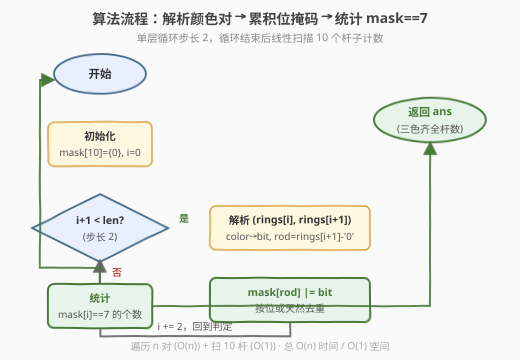
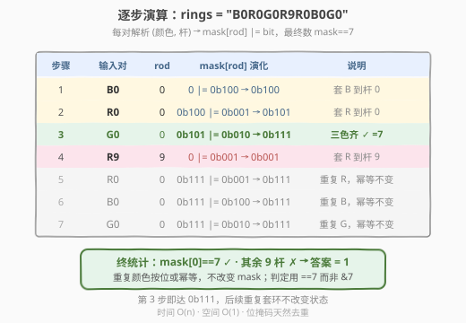

# 环和杆

- **题目名称**：环和杆
- **链接**：[2103. 环和杆](https://leetcode.cn/problems/rings-and-rods/)
- **难度**：简单
- **标签**：哈希表、字符串、位运算

## 1. 题目概述

有 `n` 个环，每个环的颜色是红（`R`）、绿（`G`）、蓝（`B`）三种之一。另有编号 `0` 到 `9` 的 **10 根杆子**。环被套在杆子上，给定一个长度为 `2n` 的字符串 `rings`，每两个字符描述一个环：

- 第 1 个字符是颜色：`'R'` / `'G'` / `'B'`；
- 第 2 个字符是杆子编号：`'0'` ~ `'9'`。

返回**同时拥有三种颜色环**的杆子数量。

**示例 1**：

```text
输入：rings = "B0R0G0R9R0B0G0"
输出：1
解释：
- 编号 0 的杆子：套了 B、R、G、R、B、G → 三色齐全 ✓
- 编号 9 的杆子：只套了 R → ✗
所以答案为 1。
```

**示例 2**：

```text
输入：rings = "G4"
输出：0
解释：编号 4 的杆子只有 G 一种颜色，三色不齐，答案为 0。
```

**约束条件**：

- `rings.length == 2n`
- `1 <= n <= 100`
- `rings[i]` 中 `i` 为偶数时是 `'R'`、`'G'`、`'B'` 之一
- `rings[i]` 中 `i` 为奇数时是 `'0'` ~ `'9'` 之一

---

## 2. 解题思路

### 2.1 暴力思路：为每根杆子维护一个颜色集合

最直白的做法是开一个长度为 10 的数组 `sets[10]`，每个元素是一个 `set`，记录该杆子上出现过的所有颜色。遍历 `rings` 每两个字符一对，把颜色塞进对应杆子的集合里。最后数有多少个集合大小为 3。

```text
sets = [set() for _ in range(10)]
for i in 0, 2, 4, ..., len-2:
    color = rings[i]
    rod   = int(rings[i+1])
    sets[rod].add(color)
return sum(1 for s in sets if len(s) == 3)
```

时间复杂度 $O(n)$，空间复杂度 $O(n)$（最坏每根杆子都存若干颜色）。这能通过，但**忽略了两个关键结构**：

1. **颜色只有 3 种**：用集合去重杀鸡用牛刀——三种颜色的存在性天然对应 3 个比特位。
2. **杆子编号是 `0..9`**：定长 10 的小数组即可承载，且每个状态只需 1 个整数编码。

### 2.2 核心观察：位掩码编码三色存在性



关键直觉：三种颜色 `R/G/B` 恰好可以对应一个 3 位二进制数的 3 个比特：

- `R` → 第 0 位（`1 << 0 = 0b001`）
- `G` → 第 1 位（`1 << 1 = 0b010`）
- `B` → 第 2 位（`1 << 2 = 0b100`）

每根杆子维护一个 `mask`，遇到某颜色就把对应**位置 1**（`mask |= bit`）。重复颜色不影响（按位或天然去重）。最终某根杆子三色齐全 ⇔ `mask == 0b111 == 7`，只需数有多少根杆子的 `mask` 等于 7。

> 💡 **为什么位运算天然去重？** 按位或 `mask |= bit` 的语义是"该位只要被置过 1 就保持 1"，无论同色环套多少次，对应比特只会被置 1 一次。这等价于集合的 `add` 操作，但常数更小、状态更紧凑——10 根杆子只需 10 个整数。

> ⚠️ **判定"三色齐全"用 `== 7` 而非 `& 7`**：`mask & 7` 只要任一位置 1 就非零，无法区分"部分色"与"全色"；必须用 `mask == 7` 精确判定 3 位全 1。等价写法是 `mask == 0b111` 或 `popcount(mask) == 3`。

### 2.3 算法流程图



流程是单层循环 + 一次终统计：遍历 `rings` 步长为 2，每轮解析 `(color, rod)` 并把对应颜色比特或入 `mask[rod]`；循环结束后线性扫描 10 个杆子，统计 `mask == 7` 的个数。

### 2.4 示例演算

以 `rings = "B0R0G0R9R0B0G0"` 为例逐步演算：



- **第 1 对 `B0`**：`mask[0] |= 0b100` → `mask[0] = 0b100`
- **第 2 对 `R0`**：`mask[0] |= 0b001` → `mask[0] = 0b101`
- **第 3 对 `G0`**：`mask[0] |= 0b010` → `mask[0] = 0b111`（三色齐 ✓）
- **第 4 对 `R9`**：`mask[9] |= 0b001` → `mask[9] = 0b001`
- **第 5 对 `R0`**：`mask[0] |= 0b001` → `mask[0]` 仍 `0b111`（按位或去重）
- **第 6 对 `B0`**：`mask[0] |= 0b100` → `mask[0]` 仍 `0b111`
- **第 7 对 `G0`**：`mask[0] |= 0b010` → `mask[0]` 仍 `0b111`

终统计：只有 `mask[0] == 7`，其余 9 根杆子均不满足，答案为 `1`。

---

## 3. 参考代码

### C++（位掩码数组 + 单次遍历）

```cpp
class Solution {
  public:
    int countPoints(string rings) {
        int mask[10] = {0};
        for (int i = 0; i + 1 < (int)rings.size(); i += 2) {
            int bit = rings[i] == 'R' ? 1
                    : rings[i] == 'G' ? 2
                    : 4;
            int rod = rings[i + 1] - '0';
            mask[rod] |= bit;
        }
        int ans = 0;
        for (int i = 0; i < 10; ++i) {
            if (mask[i] == 7) ++ans;
        }
        return ans;
    }
};
```

### Python

```python
class Solution:
    def countPoints(self, rings: str) -> int:
        mask = [0] * 10
        bit = {'R': 1, 'G': 2, 'B': 4}
        for i in range(0, len(rings), 2):
            rod = int(rings[i + 1])
            mask[rod] |= bit[rings[i]]
        return sum(m == 7 for m in mask)
```

> 💡 **颜色→比特的映射**用字典（Python）或三元条件（C++）均可，关键是把 `R/G/B` 映射到 `1/2/4` 这三个**互不重叠的比特位**。Python 用 `sum(m == 7 for m in mask)` 把"统计"与"判定"压成一行，是最简洁的写法。

---

## 4. 复杂度分析

| 维度 | 复杂度 | 说明 |
|------|--------|------|
| 时间复杂度 | $O(n)$ | 遍历 `rings` 一次（步长 2，共 $n$ 对），再扫 10 个杆子；$n \le 100$ |
| 空间复杂度 | $O(1)$ | 仅用长度 10 的定长 `mask` 数组，与 $n$ 无关 |

> 💡 相比暴力"每杆一个集合"的 $O(n)$ 空间，本题利用"颜色仅 3 种 + 杆仅 10 根"两个定常约束，把空间压到 $O(1)$，常数更小且无动态分配。

---

## 5. 扩展：状态压缩思想与判定写法

本题虽简单，却体现了两个可迁移的思想：

**1. 状态压缩：用比特位编码离散有限状态**

只要"状态种类数有限且小"，就可以用整数的比特位编码——每个比特代表一个布尔存在性。这是**状压 DP / 位运算枚举**的入门形态：

| 题号 | 题目 | 比特位如何承载状态 |
|------|------|------------------|
| 46 | 全排列 | bitmask 记录"哪些元素已用"，`used \| (1<<i)` 递归 |
| 526 | 优美的排列 | 状压 DP，`dp[mask][pos]` 记已选集合 |
| 187 | 重复的 DNA 序列 | 2 位编码 4 种碱基，10-mer 压成 20 位整数 |

本题的"3 色存在性 → 3 位掩码"是这一思想的极简版：状态种类 = 3，掩码宽度 = 3 bit。

**2. "全置位"判定的多种等价写法**

判定"3 位全 1"（即三色齐全）有多种写法，本质等价但风格不同：

- `mask == 7`：精确等于全 1 值，最直观；
- `mask == 0b111`：二进制字面量，可读性最好；
- `(mask & 7) == 7`：先掩后等，与"部分置位"区分；
- `__builtin_popcount(mask) == 3`：数 1 个数，扩展到 $k$ 色问题时最自然。

> 💡 当题目推广为"$k$ 种颜色齐全"时，前三种写法都要改成"等于 $(2^k-1)$"，而 `popcount == k` 只需把常数改 $k$，扩展性最好。本题 $k=3$ 固定，任何写法都行。

---

## 6. 面试要点

1. **为什么用 `mask == 7` 而不是 `mask & 7`？**

   - `mask & 7` 只要任一比特为 1 就非零，会把"只有 1 种或 2 种颜色"的杆子也判为真。必须用 `== 7` 精确匹配 3 位全 1。这是一个常见的"部分匹配 vs 全匹配"陷阱。

2. **按位或如何实现天然去重？**

   - `mask |= bit` 的语义是"该位只要被置过 1 就保持 1"。同一颜色重复出现时，对应比特早已是 1，再或一次不变。这等价于集合的 `add`（幂等操作），无需显式判重。

3. **如果颜色不止 3 种（比如 $k$ 种），思路如何推广？**

   - 掩码宽度从 3 bit 扩到 $k$ bit，每色占 1 位；判定条件改为 `mask == (1 << k) - 1` 或 `popcount(mask) == k`。只要 $k$ 不超过整数位宽（通常 32/64），位运算方案依然 $O(n)$ 时间、$O(1)$ 空间。

4. **能否不遍历全部 10 根杆子就提前得到答案？**

   - 不行。答案要求"统计全部满足条件的杆子数量"，必须对每根杆子做判定。但可以在置位时维护一个"已满足计数"：当某杆 `mask` 从非 7 变为 7 时 `ans++`，省去终统计循环（但仍需遍历 `rings`，渐近复杂度不变，只是常数优化）。

5. **字符串步长遍历的边界怎么处理？**

   - 题目保证 `rings.length` 为偶数，因此 `i` 以步长 2 取到倒数第二个字符，`i+1` 取末字符即可。若长度可能为奇数（变体题），需在循环条件加 `i + 1 < n` 防越界——本题 C++ 代码已写 `i + 1 < size` 以稳健。

---

## 7. 同类练习题

- [187. 重复的 DNA 序列](https://leetcode.cn/problems/repeated-dna-sequences/)：2 位编码 4 种碱基 + 滚动哈希，把字符串状态压成整数，承接本题"比特编码有限状态"思想
- [46. 全排列](https://leetcode.cn/problems/permutations/)：用 bitmask 记录已选元素集合，`used | (1<<i)` 递归，状压思想的搜索应用
- [526. 优美的排列](https://leetcode.cn/problems/beautiful-arrangement/)：状压 DP，`dp[mask][pos]` 用掩码记已选集合，本题"3 位掩码"的进阶版
- [136. 只出现一次的数字](https://leetcode.cn/problems/single-number/)：异或去重的经典位运算，与本题"按位或去重"对照（异或可逆 / 或不可逆）
- [231. 2 的幂](https://leetcode.cn/problems/power-of-two/)：`n & (n-1) == 0` 判定单比特，与本题"全比特判定"互为镜像（单 1 vs 全 1）
