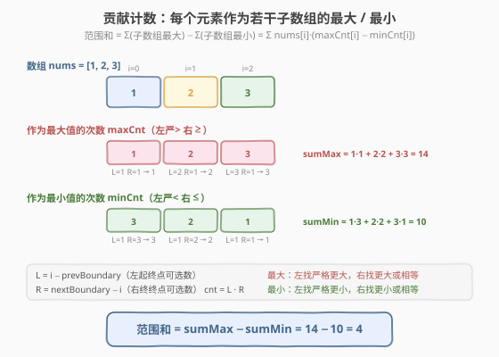
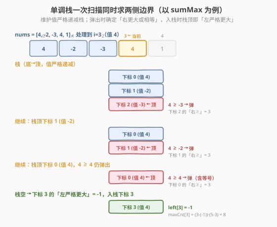

# LeetCode 子数组范围和 题解

## 1. 题目概述

- **标题 / 题号**：子数组范围和（#2104，medium）
- **链接**：https://leetcode.cn/problems/sum-of-subarray-ranges/
- **难度**：中等
- **标签**：数组、单调栈、贡献计数

**题意**：给你一个整数数组 `nums`。子数组的**范围**定义为子数组中**最大元素与最小元素的差值**（`max - min`）。返回 `nums` 中**所有**子数组范围的**和**。

子数组是数组中一个连续、非空的元素序列。

**示例 1**：

```text
输入：nums = [1,2,3]
输出：4
解释：6 个子数组的范围分别为：
  [1]   → 1-1 = 0
  [2]   → 2-2 = 0
  [3]   → 3-3 = 0
  [1,2] → 2-1 = 1
  [2,3] → 3-2 = 1
  [1,2,3] → 3-1 = 2
  和 = 0+0+0+1+1+2 = 4
```

**示例 2**：

```text
输入：nums = [1,3,3]
输出：4
解释：6 个子数组的范围：0,0,0,2,0,2，和 = 4
```

**示例 3**：

```text
输入：nums = [4,-2,-3,4,1]
输出：59
```

**约束**：

- `1 <= nums.length <= 1000`
- $-10^9 \le$ `nums[i]` $\le 10^9$

**进阶**：你能设计时间复杂度为 $O(n)$ 的解法吗？

> 💡 本题是 [907. 子数组的最小值之和](https://leetcode.cn/problems/sum-of-subarray-minimums/) 的「双向升级版」——既要算「子数组最大值之和」，又要算「子数组最小值之和」，再相减。暴力 $O(n^2)$ 已能过（$n \le 1000$），但进阶要求 $O(n)$，标准解法是**单调栈 + 贡献计数**：不枚举子数组，而是对每个元素计算「它作为多少个子数组的最大 / 最小」，把子数组层面的求和转化为元素层面的求和。

## 2. 解题思路

### 2.1 暴力思路：枚举所有子数组

最直观的做法：枚举子数组左端点 `i`，向右扩展右端点 `j`，在扩展过程中**增量维护**当前子数组的 `min` 和 `max`，累加 `max - min`。

```text
ans = 0
for i in 0..n-1:
    mn = mx = nums[i]
    for j in i..n-1:
        mn = min(mn, nums[j])
        mx = max(mx, nums[j])
        ans += mx - mn
return ans
```

时间 $O(n^2)$，空间 $O(1)$。$n = 1000$ 时约 $5 \times 10^5$ 次操作，能通过。但无法满足进阶的 $O(n)$ 要求。

> ⚠️ 暴力法的瓶颈：**子数组层面**枚举，每个子数组都要单独算一次 `max` 和 `min`，重复扫了大量元素。突破口是把视角从「每个子数组求 max/min」翻转为「每个元素作为多少个子数组的 max/min」——这就是**贡献计数**。

### 2.2 核心观察：贡献计数 + 单调栈

**关键拆解**：子数组的范围 = `max - min`，对所有子数组求和可拆成两部分：

$$\sum_{\text{子数组 } S}(\max(S) - \min(S)) = \sum_{S} \max(S) - \sum_{S} \min(S) = \text{sumMax} - \text{sumMin}$$

于是问题转化为两个独立的子问题：
- **sumMax**：所有子数组的最大值之和；
- **sumMin**：所有子数组的最小值之和。

两者互为镜像（把 `max` 换成 `min`、方向反转即可），以 sumMax 为例说明。

**贡献计数**：不枚举子数组，而是对每个元素 `nums[i]` 问——**有多少个子数组以 `nums[i]` 为最大值？** 设这个数为 `maxCnt[i]`，则：

$$\text{sumMax} = \sum_i \text{nums}[i] \cdot \text{maxCnt}[i]$$

**如何求 `maxCnt[i]`？** `nums[i]` 是某子数组的最大值，当且仅当该子数组包含 `i`，且子数组里**没有比 `nums[i]` 更大的元素**。设：
- `L` = `i` 左侧**第一个严格大于** `nums[i]` 的下标（边界，不能越过）；
- `R` = `i` 右侧**第一个大于或等于** `nums[i]` 的下标（边界）。

则子数组左端点可取 `L+1 .. i`（共 `i - L` 个），右端点可取 `i .. R-1`（共 `R - i` 个），于是：

$$\text{maxCnt}[i] = (i - L) \cdot (R - i)$$



> ⚠️ **处理重复元素的关键——一侧严格、一侧含等号**。数组里可能有相等的元素（如 `[1,3,3]` 两个 3），若两侧都用严格 `>`，含两个 3 的子数组会被两个位置**各算一次**（重复）；若两侧都用 `≥`，则**一次都不算**（遗漏）。正确做法是**一侧严格、另一侧含等号**：例如左用严格更大（`>`）、右用更大或相等（`≥`），这样每个含重复最大值的子数组**唯一归属**到最右那个最大值位置。sumMin 同理（左严格更小 `<`、右更小或相等 `≤`），归属到最右的最小值位置。两侧的「严不严格」方向必须**相反**，是本题最易错的点。

**用单调栈一次性求出所有 `L` 和 `R`**：维护一个**值严格递减**的栈（存下标）。从左到右扫描 `i`：

1. 当栈顶元素 `nums[stk.top()] <= nums[i]`（即 `< nums[i]` 或 `== nums[i]`，合起来就是 `<=`，对应「右更大或相等」边界 `R`）：弹出栈顶 `j`，此时 `R[j] = i`（`i` 就是 `j` 右侧第一个 `>= nums[j]` 的位置）。
2. 弹完后，若栈非空，`L[i] = stk.top()`（栈顶是左侧第一个**严格更大**的元素，因为所有 `<= nums[i]` 的都被弹了，剩下的都 `> nums[i]`）；若栈空，`L[i] = -1`。
3. 把 `i` 入栈。

扫描结束后，栈内剩余元素的 `R = n`（右侧没有更大或相等的）。这样**一次遍历同时求出 `L` 和 `R`**，每个元素入栈、出栈各一次，总 $O(n)$。



> 💡 **为什么一次扫描能同时拿两边？** 弹出 `j` 时，当前 `i` 正是 `j` 的「右更大或相等」边界——这是「未来」结算 `j` 的右界。而 `i` 入栈前栈顶留下的，是「过去」中比 `nums[i]` 严格大的最近一个——正是 `i` 的「左严格更大」边界。一个动作（弹栈）同时确定了一个元素的右界和另一个元素的左界，这是单调栈精妙之处，与 [907. 子数组的最小值之和](https://leetcode.cn/problems/sum-of-subarray-minimums/)、[84. 柱状图中最大的矩形](../0001-0100/84_柱状图中最大的矩形.md) 完全同构。

### 2.3 算法流程图

```text
subArrayRanges(nums):
  return sumMax(nums) - sumMin(nums)

sumMax(nums):   # 所有子数组最大值之和
  n = len(nums)
  st = []                # 值严格递减栈（存下标）
  total = 0
  for i in 0..n:         # 注意遍历到 n（哨兵，清空栈）
    while st 非空 且 nums[st.top()] <= nums[i] (i<n) 或 i==n:
        j = st.pop()
        left  = st 空 ? -1 : st.top()
        right = i
        total += nums[j] * (j - left) * (right - j)
    if i < n: st.push(i)
  return total

sumMin(nums):   # 所有子数组最小值之和（镜像：<= 换成 >=）
  ... 同上，弹栈条件改为 nums[st.top()] >= nums[i]
  total += nums[j] * (j - left) * (right - j)
  ...
```

> ⚠️ sumMax 与 sumMin 的**唯一差别**是弹栈比较方向：sumMax 维护**递减栈**、弹 `<=`（找更大），sumMin 维护**递增栈**、弹 `>=`（找更小）。两侧边界仍保持「一侧严格一侧含等号」的不变式（左严格、右含等号），归属到最右的极值位置。

### 2.4 示例演算

以 `nums = [4, -2, -3, 4, 1]`（答案 59）为例，对每个 `i` 计算 `maxCnt` 与 `minCnt`：

![示例演算：nums = [4,-2,-3,4,1] 的贡献表](../images/subarray_ranges_example_walkthrough.svg)

| `i` | `nums[i]` | maxCnt = `(i-L)·(R-i)` | max 贡献 | minCnt | min 贡献 | 净贡献 |
|-----|-----------|------------------------|----------|--------|----------|--------|
| 0 | 4 | `1·3 = 3`（L=−1, R=3） | `4·3 = 12` | `1·1 = 1` | `4·1 = 4` | +8 |
| 1 | -2 | `1·2 = 2`（L=0, R=3） | `-2·2 = -4` | `2·1 = 2` | `-2·2 = -4` | 0 |
| 2 | -3 | `1·1 = 1`（L=1, R=3） | `-3·1 = -3` | `3·3 = 9` | `-3·9 = -27` | +24 |
| 3 | 4 | `4·2 = 8`（L=−1, R=5） | `4·8 = 32` | `1·1 = 1` | `4·1 = 4` | +28 |
| 4 | 1 | `1·1 = 1`（L=3, R=5） | `1·1 = 1` | `2·1 = 2` | `1·2 = 2` | -1 |

- **sumMax** = $12 - 4 - 3 + 32 + 1 = 38$
- **sumMin** = $4 - 4 - 27 + 4 + 2 = -21$
- **范围和** = $38 - (-21) = 59$ ✓

关注 `i=2`（值 -3）：它的 `minCnt = 9`，因为 `-3` 是整个数组的最小值，左侧无更小（`L = -1`，左端点可选 `0..2` 共 3 个），右侧无更小或相等（`R = 5`，右端点可选 `2..4` 共 3 个），$3 \times 3 = 9$ 个子数组都以它为最小值，贡献 $-3 \times 9 = -27$——这正是 sumMin 为负的根源（最小值是负数，乘以大计数放大了负贡献）。

> 💡 对比暴力法：暴力要枚举 15 个子数组各算一次 max/min；贡献计数只对 5 个元素各算一次 `maxCnt`/`minCnt`，乘法直接得到该元素对所有子数组的总贡献。这就是「翻转视角」降阶的威力——从 $O(n^2)$ 个子数组降到 $O(n)$ 个元素。

## 3. 参考代码

### 暴力 $O(n^2)$（可通过，易于面试先写）

```cpp
// 子数组范围和 —— 暴力 O(n^2)
// 编译: g++ -O2 -std=c++17 子数组范围和.cpp -o subranges
#include <vector>
#include <algorithm>
using namespace std;

class Solution {
public:
    long long subArrayRanges(vector<int>& nums) {
        int n = nums.size();
        long long ans = 0;
        for (int i = 0; i < n; ++i) {
            int mn = nums[i], mx = nums[i];
            for (int j = i; j < n; ++j) {
                mn = min(mn, nums[j]);
                mx = max(mx, nums[j]);
                ans += mx - mn;
            }
        }
        return ans;
    }
};
```

### 单调栈 $O(n)$（满足进阶）

```cpp
// 子数组范围和 —— 单调栈 + 贡献计数 O(n)
// 编译: g++ -O2 -std=c++17 子数组范围和.cpp -o subranges
#include <vector>
#include <stack>
using namespace std;

class Solution {
public:
    long long subArrayRanges(vector<int>& nums) {
        return sumOfMax(nums) - sumOfMin(nums);
    }

private:
    // 所有子数组最大值之和：值严格递减栈，弹 <= 找右更大或相等
    long long sumOfMax(const vector<int>& nums) {
        int n = nums.size();
        stack<int> st;
        long long total = 0;
        for (int i = 0; i <= n; ++i) {
            while (!st.empty() &&
                   (i == n || nums[st.top()] <= nums[i])) {
                int j = st.top(); st.pop();
                int left = st.empty() ? -1 : st.top();
                int right = i;
                total += (long long)nums[j] * (j - left) * (right - j);
            }
            if (i < n) st.push(i);
        }
        return total;
    }

    // 所有子数组最小值之和：值严格递增栈，弹 >= 找右更小或相等
    long long sumOfMin(const vector<int>& nums) {
        int n = nums.size();
        stack<int> st;
        long long total = 0;
        for (int i = 0; i <= n; ++i) {
            while (!st.empty() &&
                   (i == n || nums[st.top()] >= nums[i])) {
                int j = st.top(); st.pop();
                int left = st.empty() ? -1 : st.top();
                int right = i;
                total += (long long)nums[j] * (j - left) * (right - j);
            }
            if (i < n) st.push(i);
        }
        return total;
    }
};
```

### Python

```python
class Solution:
    def subArrayRanges(self, nums: list[int]) -> int:
        return self._sum_of_max(nums) - self._sum_of_min(nums)

    def _sum_of_max(self, nums: list[int]) -> int:
        n = len(nums)
        st = []                       # 值严格递减栈，存下标
        total = 0
        for i in range(n + 1):
            while st and (i == n or nums[st[-1]] <= nums[i]):
                j = st.pop()
                left = st[-1] if st else -1
                right = i
                total += nums[j] * (j - left) * (right - j)
            if i < n:
                st.append(i)
        return total

    def _sum_of_min(self, nums: list[int]) -> int:
        n = len(nums)
        st = []                       # 值严格递增栈，存下标
        total = 0
        for i in range(n + 1):
            while st and (i == n or nums[st[-1]] >= nums[i]):
                j = st.pop()
                left = st[-1] if st else -1
                right = i
                total += nums[j] * (j - left) * (right - j)
            if i < n:
                st.append(i)
        return total
```

> 💡 **实现细节**：① 循环到 `i == n` 而非 `n-1`，最后一步当哨兵把栈清空，给所有右侧无更大（或相等）的元素结算 `R = n`，省去单独的收尾循环。② 用 `long long`（Python 无需），因为 `nums[i]` 可达 $\pm 10^9$、`cnt` 可达 $O(n^2) \approx 10^6$，乘积约 $10^{15}$ 超 32 位。③ 栈存下标而非值，方便取 `left = st.top()` 作为左边界下标。

## 4. 复杂度分析

| 维度 | 复杂度 | 说明 |
|------|--------|------|
| **时间复杂度** | $O(n)$ | 每个下标入栈 1 次、出栈 1 次；sumMax 与 sumMin 各扫一遍，总计 $O(n)$ |
| **空间复杂度** | $O(n)$ | 单调栈最坏存 `n` 个下标（严格递减/递增序列如 `[5,4,3,2,1]`） |

> ⚠️ 虽然有嵌套 `while`，但**均摊分析**：所有元素的总入栈 = `n`，总出栈 $\le n$，平摊到 `n` 次迭代每次 $O(1)$。这与 [739. 每日温度](../0701-0800/739_每日温度.md)、[901. 股票价格跨度](../0901-1000/901_股票价格跨度.md) 的均摊论证完全一致。暴力法 $O(n^2)$ 在 $n = 1000$ 下约 $5 \times 10^5$ 次操作也能过，但 $n$ 更大时单调栈是唯一可行解。

## 5. 扩展：与 907 子数组最小值之和的关系

### 5.1 本题是 907 的「双向 + 作差」版

| 维度 | 907 子数组最小值之和 | 2104 子数组范围和 |
|------|----------------------|-------------------|
| 目标 | $\sum_S \min(S)$ | $\sum_S (\max(S) - \min(S))$ |
| 单调栈方向 | 递增栈（找更小） | 递增栈 + 递减栈各一遍 |
| 重复处理 | 左严格更小 / 右更小或相等 | max 与 min 各自一套，方向相反 |
| 复杂度 | $O(n)$ | $O(n)$（两遍扫描） |

> 💡 掌握 907 的「贡献计数 + 单调栈求两侧边界」模板，本题只需把模板**复用两次**（一次求 max 贡献、一次求 min 贡献）再相减。是面试中「模板迁移」的典型考法。

### 5.2 为什么不直接「一次扫描同时算 max 和 min」？

理论上可以用两个栈（一个递减算 max、一个递增算 min）在一次遍历里同时结算，但代码可读性下降、且常数因子优化有限（仍 $O(n)$）。拆成两个独立函数更清晰、更易调试，是工程与面试的更好折中。若追求极致常数优化，可合并为单次扫描双栈版本。

### 5.3 两侧「严格/含等号」方向的反向不变式

这是本题（及 907、[84. 柱状图中最大的矩形](../0001-0100/84_柱状图中最大的矩形.md)、[1856. 子数组最小积的最大值](https://leetcode.cn/problems/maximum-subarray-min-product/)）的核心不变式：

- **归属到最右极值位置**：左用**严格**（`<` 或 `>`），右用**含等号**（`<=` 或 `>=`）。
- **归属到最左极值位置**：左用**含等号**，右用**严格**。

两种都正确，只需**保持一致**。本文采用「左严格、右含等号」（归属最右），便于和单调栈「弹出即定右界」的直觉对齐。

## 6. 面试要点

1. **为什么要拆成 sumMax - sumMin，而不是直接对每个子数组算 max - min？**

   - 暴力对每个子数组单独算 max/min，是 $O(n^2)$ 且无法降阶——每个子数组的极值互不相干。
   - 拆分后，sumMax 和 sumMin 各自是**独立的「子数组极值之和」问题**，可用**贡献计数 + 单调栈**降到 $O(n)$：不枚举子数组，而是问「每个元素作为多少个子数组的极值」，把子数组层求和翻转为元素层求和。这是把 $O(n^2)$ 降到 $O(n)$ 的关键视角转换。

2. **`maxCnt[i] = (i - L) · (R - i)` 的含义和正确性？**

   - `L` = 左侧第一个**严格大于** `nums[i]` 的下标，`R` = 右侧第一个**大于或等于** `nums[i]` 的下标。
   - 子数组以 `nums[i]` 为最大值 ⟺ 子数组包含 `i` 且不越过 `L`（否则含更大）和 `R`（否则含更大或相等，归属给更右的位置）。
   - 左端点可选 `L+1..i`（`i - L` 个），右端点可选 `i..R-1`（`R - i` 个），独立组合得 `maxCnt`。乘法原理保证不重不漏。

3. **重复元素如何处理？为什么一侧严格、一侧含等号？**

   - 若两侧都用严格 `>`，含两个相等最大值的子数组会被两个位置**各算一次**（重复）；两侧都用 `>=` 则**漏算**。
   - 解法：一侧严格、一侧含等号（如左严格、右含等号），把含重复最大值的子数组**唯一归属**到最右那个最大值位置。两侧方向的「严不严格」必须**相反**，这是最易错点，务必在面试中讲清。

4. **为什么一次单调栈扫描能同时求出 `L` 和 `R`？**

   - 弹出 `j` 时，当前 `i` 正是 `j` 的「右更大或相等」边界（未来结算 `j` 的 `R`）。
   - `i` 入栈前栈顶留下的，是「过去」中比 `nums[i]` **严格**更大的最近一个（所有 `<=` 的都被弹了），正是 `i` 的「左严格更大」边界 `L`。
   - 一个弹栈动作同时确定了一个元素的右界和另一个元素的左界。扫描到 `i = n` 作为哨兵清空栈，给剩余元素结算 `R = n`。总入栈、出栈各 $n$ 次，$O(n)$。

5. **sumMax 和 sumMin 的代码差别在哪？为什么结果可以是负数但范围和最终非负？**

   - 唯一差别：弹栈比较方向。sumMax 维护**递减栈**、弹 `nums[top] <= nums[i]`（找更大）；sumMin 维护**递增栈**、弹 `nums[top] >= nums[i]`（找更小）。两侧「严格/含等号」不变式相同。
   - sumMin 可能为负（最小值是负数、计数大时负贡献被放大，如示例 `i=2` 贡献 $-27$）；sumMax 也可能为负（最大值是负数）。但 $\max(S) - \min(S) \ge 0$ 恒成立（任何子数组的最大 ≥ 最小），故 $\text{sumMax} - \text{sumMin} \ge 0$ 总成立——这是验证代码正确性的一个不变式。

> 💡 **一句话总结**：2104 是 907 的双向升级版——用「贡献计数 + 单调栈」模板各跑一遍算出 sumMax 和 sumMin，再相减即得所有子数组范围和，$O(n)$ 时间。核心难点是**重复元素的「一侧严格一侧含等号」处理**与「**一次扫描同时求两侧边界**」的均摊论证，掌握后可迁移到所有「子数组极值之和」类问题。

## 同类练习题

| # | 题目 | 与本题的关联 |
|---|------|-------------|
| 907 | [子数组的最小值之和](https://leetcode.cn/problems/sum-of-subarray-minimums/) | 本题的单向原型，贡献计数 + 单调栈求子数组最小值之和，必先掌握 |
| 84 | [柱状图中最大的矩形](https://leetcode.cn/problems/largest-rectangle-in-histogram/)（[题解](../0001-0100/84_柱状图中最大的矩形.md)） | 单调栈求两侧第一个更小，矩形面积 = 高 × 宽，与本题两侧边界同构 |
| 1856 | [子数组最小积的最大值](https://leetcode.cn/problems/maximum-subarray-min-product/) | 单调栈求最小值边界 + 前缀和算子数组和，本题贡献计数的乘法延伸 |
| 795 | [区间子数组个数](https://leetcode.cn/problems/number-of-subarrays-with-bounded-maximum/) | 用「至多 K」转化统计最大值在区间内的子数组数，单调栈计数的计数型变体 |
| 828 | [统计子串中的唯一字符](https://leetcode.cn/problems/count-unique-characters-of-all-substrings-of-a-given-string/) | 贡献计数思想（每个字符作为多少子串的唯一字符），本题的字符串镜像 |
