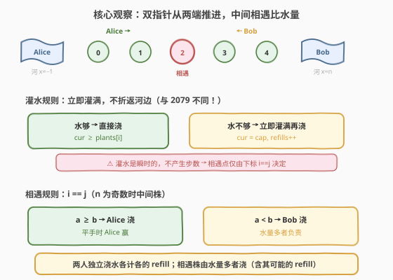
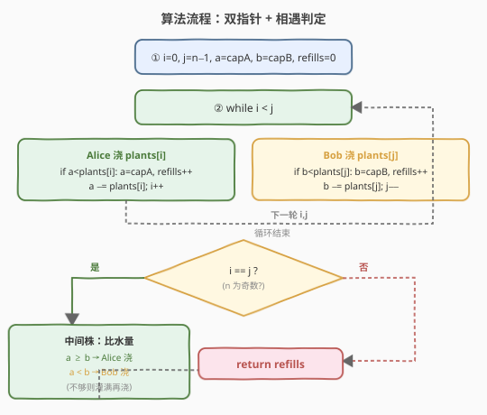
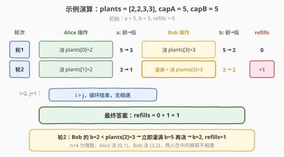

# 给植物浇水II

- **题目名称**：给植物浇水II
- **链接**：[2105. 给植物浇水 II](https://leetcode.cn/problems/watering-plants-ii/)
- **难度**：中等
- **标签**：数组、双指针、模拟、贪心

## 1. 题目概述

Alice 和 Bob 打算给花园里的 `n` 株植物浇水。植物排成一行，从左到右编号 `0` 到 `n-1`，第 `i` 株植物的位置是 `x = i`。每人各有一个水罐，**最初是满的**。

浇水方式：

- Alice 按**从左到右**的顺序浇水，从植物 `0` 开始；Bob 按**从右到左**的顺序浇水，从植物 `n-1` 开始。两人**同时**浇水。
- 无论需要多少水，**每株植物浇水所需时间相同**。
- 如果水罐中的水足以**完全**灌溉植物，**必须**浇水；否则，**首先（立即）重新装满**罐子，然后浇水。
- 如果两人到达**同一株**植物，**当前水罐中水更多**的人浇这株植物；水量相同则 Alice 浇。

给定数组 `plants`（`plants[i]` 为第 `i` 株植物需水量）和整数 `capacityA`、`capacityB`（两人水罐容量），返回浇灌所有植物过程中**重新灌满水罐的次数**。

**示例 1**：

```text
输入：plants = [2,2,3,3], capacityA = 5, capacityB = 5
输出：1
解释：
- 最初，Alice 和 Bob 的水罐中各有 5 单元水。
- Alice 给植物 0 浇水，Bob 给植物 3 浇水。
- Alice 和 Bob 现在分别剩下 3 单元和 2 单元水。
- Alice 有足够的水给植物 1，所以她直接浇水。Bob 的水不够给植物 2，所以他先重新装满水，再浇水。
重新灌满次数 = 0 + 0 + 1 + 0 = 1。
```

**示例 2**：

```text
输入：plants = [2,2,3,3], capacityA = 3, capacityB = 4
输出：2
解释：
- 最初，Alice 的水罐中有 3 单元水，Bob 的水罐中有 4 单元水。
- Alice 给植物 0 浇水，Bob 给植物 3 浇水。
- Alice 和 Bob 现在都只有 1 单元水，并分别需要给植物 1 和植物 2 浇水。
- 由于他们的水量均不足以浇水，所以他们重新灌满水罐再进行浇水。
重新灌满次数 = 0 + 1 + 1 + 0 = 2。
```

**示例 3**：

```text
输入：plants = [5], capacityA = 10, capacityB = 8
输出：0
解释：
- 只有一株植物。
- Alice 的水罐有 10 单元水，Bob 的水罐有 8 单元水。因此 Alice 的水罐中水更多，她会给这株植物浇水。
重新灌满次数 = 0。
```

**约束条件**：

- $n == \text{plants.length}$
- $1 \leq n \leq 10^5$
- $1 \leq \text{plants}[i] \leq 10^6$
- $\max(\text{plants}[i]) \leq \text{capacityA}, \text{capacityB} \leq 10^9$

> 💡 **审题关键**：① 灌水是**立即的**——"首先（立即）重新装满罐子，然后给植物浇水"，与 [2079](../2001-2100/2079_给植物浇水.md) 不同，本题**不需要回河边**，灌水不产生额外步数；② 两人**同步推进**——每株浇水时间相同 + 灌水瞬时，意味着两人各按自己的方向逐株推进，**相遇仅由下标决定**（`i == j`，即 `n` 为奇数时的中间株）；③ 约束保证 $\max(\text{plants}[i]) \leq \text{capacityA}$ 且 $\leq \text{capacityB}$，即每人满罐都能浇任意一株，最多灌一次即可；④ 题目问的是**灌满次数**而非步数，因此无需关心移动距离。

---

## 2. 解题思路

### 2.1 暴力思路：逐轮模拟两人浇水

最直观的做法：用两个指针 `i`（Alice 的下一株，从 `0` 向右）和 `j`（Bob 的下一株，从 `n-1` 向左），两个变量 `a`、`b` 跟踪两人水罐剩余水量，逐轮模拟。

- 每轮：Alice 处理 `plants[i]`，Bob 处理 `plants[j]`，然后 `i++`、`j--`。
- 若 `i == j`（同一株）：只有一人浇——水量多者（平手 Alice）。
- 单人浇水逻辑：若当前水不够，先灌满（`refills++`，水量恢复为容量），再浇（减去需水量）。

- **正确性**：完全复现题目描述的浇水过程。
- **效率**：每株 $O(1)$，总共 $O(n)$，空间 $O(1)$。暴力即最优。

> ⚠️ 本题没有更优复杂度可追求——$O(n)$ 已经是下界（至少要读一遍数组）。关键在于正确处理**相遇株**的归属判定。

### 2.2 核心观察：灌水瞬时 → 相遇仅由下标决定



整个解法建立在**两个关键观察**上。

**观察一：灌水是瞬时的，不改变推进节奏**

题目说"首先（立即）重新装满罐子，然后给植物浇水"。与 2079 不同，本题**不需要走回河边**——灌水就在原地瞬间完成。加上"每株浇水时间相同"，两人始终以**相同节奏**逐株推进：每轮 Alice 向右走一株、Bob 向左走一株。灌水与否不影响谁到达哪株。

> 💡 **对比 2079**：2079 中灌水需要折返河边（`2i+1` 步），步数与位置强相关；2105 中灌水是瞬时的，我们只数**次数**，不数步数。这是两题最本质的区别。

**观察二：相遇仅当 `i == j`（`n` 为奇数）**

既然两人同步推进——Alice 从 `0` 向右、Bob 从 `n-1` 向左——他们**仅在中间一株相遇**，且仅当 `n` 为奇数时：

| $n$ 的奇偶 | Alice 浇 | Bob 浇 | 相遇？ |
|-----------|----------|--------|--------|
| 偶数 | $0, 1, \ldots, \frac{n}{2}-1$ | $n-1, n-2, \ldots, \frac{n}{2}$ | 否（擦肩而过） |
| 奇数 | $0, 1, \ldots, \frac{n}{2}-1$ | $n-1, n-2, \ldots, \frac{n}{2}+1$ | 是（中间株 $\frac{n}{2}$） |

相遇时，**当前水量多者**浇这株（平手 Alice 浇）。决定后，该人按正常逻辑浇水（不够则先灌满）。

$$\boxed{\text{相遇株归属} = \begin{cases} \text{Alice} & \text{if } a \geq b \\ \text{Bob} & \text{if } a < b \end{cases}}$$

**用示例 1 验证**：`plants = [2,2,3,3]`, `capA = 5`, `capB = 5`。$n=4$（偶数），无相遇。

| 轮次 | Alice | $a$（前→后） | Bob | $b$（前→后） | refills |
|------|-------|--------------|-----|--------------|---------|
| 1 | 浇 `plants[0]=2` | 5→3 | 浇 `plants[3]=3` | 5→2 | 0 |
| 2 | 浇 `plants[1]=2` | 3→1 | 灌满+浇 `plants[2]=3` | 2→2 | +1 |

$i=2 > j=1$，循环结束，无相遇。$\text{refills} = 1$ ✓

**用示例 3 验证**：`plants = [5]`, `capA = 10`, `capB = 8`。$n=1$（奇数），相遇。

- $i=0, j=0$：$i == j$，相遇。$a=10 \geq b=8$，Alice 浇。$a=10 \geq 5$，直接浇，$a=5$。refills = 0 ✓

### 2.3 算法流程图



**完整步骤**：

1. 初始化 `i = 0`, `j = n-1`, `a = capacityA`, `b = capacityB`, `refills = 0`。
2. **当** `i < j`（两人尚未相遇）：
   - **Alice 浇 `plants[i]`**：若 `a < plants[i]`，则 `a = capacityA`，`refills++`；然后 `a -= plants[i]`，`i++`。
   - **Bob 浇 `plants[j]`**：若 `b < plants[j]`，则 `b = capacityB`，`refills++`；然后 `b -= plants[j]`，`j--`。
3. **若** `i == j`（相遇，`n` 为奇数）：
   - 若 `a >= b`：Alice 浇。若 `a < plants[i]`，则 `a = capacityA`，`refills++`；`a -= plants[i]`。
   - 否则：Bob 浇。若 `b < plants[j]`，则 `b = capacityB`，`refills++`；`b -= plants[j]`。
4. **返回** `refills`。

> ⚠️ **一个易错点**：相遇判定用 `i == j` 而非 `i <= j`。当 `n` 为偶数时，最后一轮 `i` 和 `j` 擦肩而过（`i` 变为 `n/2`，`j` 变为 `n/2 - 1`），此时 `i > j`，不进入相遇分支。若误用 `i <= j`，会导致偶数 `n` 时多处理一株已浇过的植物。

### 2.4 示例演算

以 `plants = [2,2,3,3]`, `capA = 5`, `capB = 5` 逐步演算：



**轮次拆解**：

- **轮 1**（$i=0, j=3$）：Alice 浇 `plants[0]=2`（$a=5 \geq 2$，直接浇，$a=3$）；Bob 浇 `plants[3]=3`（$b=5 \geq 3$，直接浇，$b=2$）。refills = 0。
- **轮 2**（$i=1, j=2$）：Alice 浇 `plants[1]=2`（$a=3 \geq 2$，直接浇，$a=1$）；Bob 浇 `plants[2]=3`（$b=2 < 3$，**灌满** $b=5$, refills=1，再浇 $b=2$）。
- $i=2, j=1$：$i > j$，循环结束，$n=4$ 偶数无相遇。

$$\text{refills} = 0 + 1 = 1 \checkmark$$

> 💡 **对照示例 2** `plants = [2,2,3,3]`, `capA = 3`, `capB = 4`：轮 1 后 $a=1, b=1$；轮 2 Alice 浇 `plants[1]=2`（$a=1<2$，灌满 $a=3$, refills=1, 浇 $a=1$），Bob 浇 `plants[2]=3`（$b=1<3$，灌满 $b=4$, refills=2, 浇 $b=1$）。$\text{refills} = 2$ ✓。

---

## 3. 参考代码

### 方法一：双指针一次遍历（$O(n)$，推荐）

### C++

```cpp
class Solution {
public:
    int minimumRefill(vector<int>& plants, int capacityA, int capacityB) {
        int n = plants.size();
        int i = 0, j = n - 1;
        int a = capacityA, b = capacityB;
        int refills = 0;
        while (i < j) {
            if (a < plants[i]) { a = capacityA; ++refills; }
            a -= plants[i]; ++i;
            if (b < plants[j]) { b = capacityB; ++refills; }
            b -= plants[j]; --j;
        }
        if (i == j) {
            if (a >= b) {
                if (a < plants[i]) { a = capacityA; ++refills; }
                a -= plants[i];
            } else {
                if (b < plants[j]) { b = capacityB; ++refills; }
                b -= plants[j];
            }
        }
        return refills;
    }
};
```

### Python

```python
class Solution:
    def minimumRefill(self, plants: list[int], capacityA: int, capacityB: int) -> int:
        n = len(plants)
        i, j = 0, n - 1
        a, b = capacityA, capacityB
        refills = 0
        while i < j:
            if a < plants[i]:
                a = capacityA
                refills += 1
            a -= plants[i]
            i += 1
            if b < plants[j]:
                b = capacityB
                refills += 1
            b -= plants[j]
            j -= 1
        if i == j:
            if a >= b:
                if a < plants[i]:
                    a = capacityA
                    refills += 1
                a -= plants[i]
            else:
                if b < plants[j]:
                    b = capacityB
                    refills += 1
                b -= plants[j]
        return refills
```

> 💡 **写法要点**：① 循环条件用 `i < j`——尚未相遇时两人各浇各的；② 相遇判定用 `i == j`——仅在 `n` 为奇数时触发，偶数 `n` 擦肩而过不触发；③ 灌水与浇水合并为同一分支：先判不够则灌满（`refills++`），再统一减去需水量；④ 相遇时比较的是**当前水量** `a` vs `b`（灌水前），平手用 `a >= b` 让 Alice 浇。

### 方法二：抽出单人浇水函数（$O(n)$，思路对照）

### C++

```cpp
class Solution {
    int water(int need, int cur, int cap, int& refills) {
        if (cur < need) { cur = cap; ++refills; }
        return cur - need;
    }
public:
    int minimumRefill(vector<int>& plants, int capacityA, int capacityB) {
        int n = plants.size();
        int i = 0, j = n - 1;
        int a = capacityA, b = capacityB;
        int refills = 0;
        while (i < j) {
            a = water(plants[i++], a, capacityA, refills);
            b = water(plants[j--], b, capacityB, refills);
        }
        if (i == j) {
            if (a >= b) a = water(plants[i], a, capacityA, refills);
            else        b = water(plants[j], b, capacityB, refills);
        }
        return refills;
    }
};
```

### Python

```python
class Solution:
    def minimumRefill(self, plants: list[int], capacityA: int, capacityB: int) -> int:
        refills = 0
        def water(need: int, cur: int, cap: int) -> int:
            nonlocal refills
            if cur < need:
                cur = cap
                refills += 1
            return cur - need

        n = len(plants)
        i, j = 0, n - 1
        a, b = capacityA, capacityB
        while i < j:
            a = water(plants[i], a, capacityA); i += 1
            b = water(plants[j], b, capacityB); j -= 1
        if i == j:
            if a >= b:
                a = water(plants[i], a, capacityA)
            else:
                b = water(plants[j], b, capacityB)
        return refills
```

> 💡 方法二将"不够则灌满再浇"抽成 `water()` 函数，消除重复代码。逻辑与方法一完全等价：`water(need, cur, cap)` 返回浇完后的水量，副作用是更新 `refills`。相遇株只需选择传 Alice 还是 Bob 的参数。

---

## 4. 复杂度分析

| 维度 | 方法 | 复杂度 | 说明 |
|------|------|--------|------|
| 时间 | 双指针 | $O(n)$ | 每株植物 $O(1)$ 处理，共 $n$ 株 |
| 空间 | 双指针 | $O(1)$ | 仅 `i`、`j`、`a`、`b`、`refills` 五个标量 |
| 时间 | 函数抽取 | $O(n)$ | 同为一次遍历，每株 $O(1)$ |
| 空间 | 函数抽取 | $O(1)$ | 标量个数不变，`water` 无额外空间 |

> 💡 两种方法复杂度完全相同。$O(n)$ 是理论下界——至少要读一遍 `plants` 数组。区别仅在代码组织：方法一直展逻辑、一目了然；方法二抽函数、消除三处重复的"灌满+浇"模式。面试中可先写方法一建立正确性，再重构为方法二展示代码品味。

---

## 5. 扩展：若灌水需要折返河边（回归 2079 模型）

本题的关键简化在于"灌水是**立即的**"。若改为 2079 的模型——灌水需要**走回各自的河边**再返回——问题将发生质变：

- **相遇点不再由下标决定**：灌水折返导致时间延迟，快的人可能"超车"多浇几株，相遇点取决于两人的灌水历史与折返距离。
- **需要时间模拟**：必须逐时间步推进两人的位置，比较谁先到达某株植物，问题从 $O(n)$ 贪心变为复杂的时间线模拟。
- **步数 vs 次数**：若仍问"灌满次数"，折返延迟虽改变相遇点但不改变每人浇水序列的总灌水次数（前提是每人浇的植物集合不变）；若问"总步数"，则需精确模拟移动距离。

> 💡 本题的"立即灌水"约束看似细节，实则是**将问题降维的关键**——它让两人的推进节奏解耦于灌水历史，相遇点纯粹由数组长度奇偶性决定，从而可以用简单的双指针一次遍历解决。

---

## 6. 面试要点

**Q1：为什么相遇仅当 `i == j`，而不是需要时间模拟？**

> 题目明确"灌水是立即的"（不折返河边）且"每株浇水时间相同"。两人始终以相同节奏推进——每轮各处理一株、各推进一格。因此两人**同步**向中间靠拢，相遇点仅取决于数组长度：`n` 为奇数时在中间株 `n/2` 相遇，`n` 为偶数时擦肩而过。灌水不改变推进节奏，无需时间模拟。

**Q2：相遇时为什么用当前水量而非容量来判定谁浇？**

> 题目规定"当前水罐中水更多的人浇水"。这是**到达该株时的瞬时水量**（可能在之前浇水中消耗了不少），而非水罐容量。容量大但沿途浇水多的人，到达中间时水量可能反而少。这一规则增加了状态依赖性——不能简单地按容量分配中间株。

**Q3：平手时为什么是 Alice 浇？**

> 题目明确规定"如果他俩水量相同，那么 Alice 会给这株植物浇水"。代码中用 `a >= b`（而非 `a > b`）体现这一平手规则。这是常见的 tiebreaker 约定，面试时需明确提及以展示审题细致。

**Q4：约束 `max(plants[i]) <= capacityA, capacityB` 有什么作用？**

> 它保证**每人满罐都能浇任意一株**——即任何一株最多灌一次水即可浇完。若去掉此约束（某株需水量超过某人的容量），该人即使灌满也无法浇这株，问题可能无解或需两人协作（中间株必须由容量足够的人浇）。这是本题可贪心求解的隐含前提。

**Q5：本题与 2079（给植物浇水）的核心区别是什么？**

> 三个本质区别：① **人数**——2079 单人从左到右，2105 两人从两端相向；② **灌水模型**——2079 灌水需折返河边（产生 `2i+1` 步），2105 灌水立即完成（不产生步数）；③ **问什么**——2079 问总步数（与位置强相关），2105 问灌满次数（与位置无关，只与水量序列有关）。因此 2079 需推导折返步数公式，2105 只需数灌满次数。

> 💡 **一句话总结**：双指针从两端推进，每人独立"不够则灌满再浇"并计数；`n` 为奇数时中间株由水量多者浇（平手 Alice）。$O(n)$ 时间、$O(1)$ 空间。核心是利用"灌水瞬时"将相遇点简化为下标判定。

---

## 7. 同类练习题

- [2079. 给植物浇水](https://leetcode.cn/problems/watering-plants/)：本题的前传——单人从左到右浇水，灌水需折返河边，问总步数。对比理解"折返步数 $2i+1$"与"立即灌满只数次数"的区别
- [2073. 买票需要的时间](https://leetcode.cn/problems/time-needed-to-buy-tickets/)：同为"按位置贡献一次遍历"——将循环轮转模拟压缩为按位置分类求和，$O(n)$ 代替 $O(\sum \text{tickets})$
- [881. 救生艇](https://leetcode.cn/problems/boats-to-save-people/)：双指针从两端配对——排序后最轻+最重配对判定，同为本题"两端向中间推进"的双指针范式
- [923. 三数之和的多种可能](https://leetcode.cn/problems/3sum-with-multiplicity/)：双指针 + 计数——固定一端后双指针从两端缩进，同为本题双指针思路的延伸
